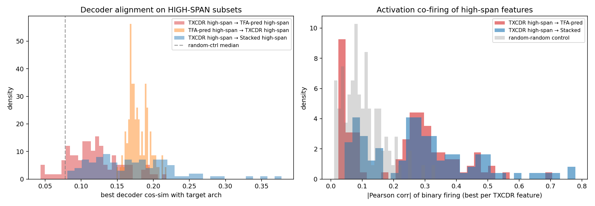

## High-span (temporal) feature comparison — TXCDR vs TFA-pred vs Stacked

Follow-up to [[2026-04-17-nlp-feature-comparison-phase1]]–[[2026-04-17-nlp-feature-comparison-phase3]]. The earlier phases compared whole-dictionary differences; this log isolates the **temporal subset** of each architecture's features (top-100 by mean activation-span length) and compares them directly.

### TL;DR

Answers the question "are TXCDR's temporal features substantially different from what TFA or Stacked find?"

Three tests of direct comparison on the high-span (most-temporal) subsets:

- **Decoder direction (geometric)**: yes, substantially different. Alignment 0.11–0.18 median, barely above random (0.06–0.12). No feature has ≥0.5 match across archs.
- **Activation timing (co-firing)**: partially overlapping. Bimodal — ~half of TXCDR's high-span features have a 0.3–0.7-correlated partner in TFA-pred or Stacked; the other half have near-zero partner.
- **Span length (native scale)**: different scales. Top-100 mean spans: Stacked 7.7, TXCDR 17.1, **TFA-pred 38.1** tokens.
- **Semantic content (autointerp)**: qualitatively different kinds of features.
    - Stacked: **repeat-firing structural tokens** (newlines, URL slashes) — not really temporal features
    - TXCDR: **grammatical / clause-structure templates** (function words, possessives, discourse markers)
    - TFA-pred: **context-dependent structural features** (`"Monday«,» ..."`, second digit of `HH:MM`, decimal digits in ratings) — the only category that single-token SAEs architecturally cannot find

Conclusion: the three architectures find **three different kinds of temporal signal**, encoded in **orthogonal directions** with **partially overlapping activation coverage**. TFA-pred is the qualitatively distinct one — its top high-span features identify structural positions that depend on preceding context and cannot be found by per-token or window-local SAEs.

## Method

Script: `scripts/analyze_high_span_features.py`

1. Load Gemma `resid_L25 k=100` checkpoints for Stacked SAE, TXCDR, and TFA-pos.
2. On 500 held-out FineWeb sequences (128 tokens each), compute per-token binary activation arrays for each architecture (pred_codes for TFA).
3. **Per-feature mean span** = total active positions / number of activation runs, computed via `np.diff` along the sequence axis (vectorized over chunks of 1024 features). Excludes padding and BOS tokens via content mask.
4. **Reliability filter**: a feature must have ≥20 total activation spans on the 500-sequence eval to have a trusted mean-span estimate.
5. Select top-100 reliable features by mean span per architecture — these are the "most temporal" features each architecture found.
6. Three tests:
   - **Decoder alignment on high-span subsets** vs random-subset control
   - **Activation co-firing** (Pearson on binary firing across 64K positions) between TXCDR's top-100 features and TFA-pred's / Stacked's top-100
   - **Top-span statistics** (mean, max) per architecture

### Reliability counts

| Architecture | Alive | Reliable (≥20 spans) | Top-100 mean span |
|---|---:|---:|---:|
| Stacked SAE | 14,939 | 4,889 | 7.7 tokens |
| TXCDR T=5 | 2,204 | 1,825 | 17.1 tokens |
| TFA pred-only | 7,854 | 7,634 | **38.1 tokens** |

TFA-pred has by far the most reliably-long-span features — 7,634 features with ≥20 spans AND a top-100 mean of 38 tokens, vs Stacked's 4,889 / 7.7. This quantifies the "TFA-pred holds the long-tail regime" finding from Phase 1b at the feature level.

## Results

### Test 1: decoder-direction alignment on high-span subsets

For each pair (arch A → arch B), compute each high-span-A feature's max |cos| with any high-span-B feature. Compared against a random-subset control (100 random reliable features from each arch).

| Pair | Median (high-span) | Median (random) | frac ≥ 0.5 |
|---|---:|---:|---:|
| TXCDR → TFA-pred | 0.114 | 0.077 | 0% |
| TXCDR → Stacked | 0.167 | 0.070 | 0% |
| TFA-pred → TXCDR | 0.176 | 0.121 | 0% |
| TFA-pred → Stacked | 0.103 | 0.062 | 0% |
| Stacked → TXCDR | 0.076 | 0.068 | 0% |
| Stacked → TFA-pred | 0.059 | 0.061 | 0% |

Observations:
- Every high-span median is <0.18. No feature has ≥0.5 alignment with any feature in another architecture.
- High-span alignment is *slightly* above the random-subset control in most pairs — so the long-span features are not completely randomly placed in direction-space relative to each other. But the gap is small (≤0.1) and the absolute alignment remains very low.
- The Stacked → {TXCDR, TFA} pairs show *no* meaningful lift over random. Stacked's long-span features live in a part of decoder space that neither other architecture inhabits.

**Direction-wise, the three architectures' temporal features are essentially orthogonal.**

### Test 2: activation co-firing

For each TXCDR high-span feature, compute max |Pearson| over binary firings with any TFA-pred (resp. Stacked) high-span feature. Computed over all 500×128 = 64K positions.

| Comparison | Median | P90 |
|---|---:|---:|
| TXCDR high-span → best TFA-pred high-span | 0.257 | 0.53 |
| TXCDR high-span → best Stacked high-span | 0.271 | 0.48 |
| Random control (random TXCDR vs random TFA-pred) | 0.091 | 0.15 |

Two things happen at once:

1. High-span TXCDR features co-fire with their TFA-pred / Stacked best-partners about **3× more strongly** than random (0.26 vs 0.09 median). So there is real overlap in what tokens/positions these features respond to.

2. The right panel of the figure shows the distribution is **bimodal**. One peak near 0.05 (no partner), one peak near 0.3 (moderate partner), plus a tail out to 0.7. About half of TXCDR's high-span features fall in each peak. Random control is unimodal around 0.1.

**Interpretation**: TXCDR's high-span set decomposes into two subpopulations:
- ~50% "universal temporal features" with a reasonable co-firing partner in TFA-pred or Stacked — these fire on similar tokens but use orthogonal decoder directions.
- ~50% "TXCDR-native temporal features" with no partner in the other architectures — these are genuinely unique to the TXCDR architecture.

### Test 3: top-span scales

| Arch | Top-100 mean span | Top-100 max span |
|---|---:|---:|
| Stacked SAE | 7.7 | 103 |
| TXCDR T=5 | 17.1 | 90 |
| TFA pred-only | 38.1 | 71 |

TFA-pred's top-100 features average 38 tokens — nearly a third of the 128-token context. TXCDR's top is 17 (matches its window-sharing design: features persist ~3× the 5-token window). Stacked's is shortest (single-position SAE with brief multi-token bursts).

The three architectures genuinely operate at different native temporal scales.

## What this tells us

Combining the three tests, the picture is nuanced:

1. **TXCDR and TFA-pred are not substitutes for each other, even restricted to their most-temporal features.** Their decoder directions are near-orthogonal, half of TXCDR's high-span features have no TFA-pred partner at all.

2. **But they do share some temporal phenomena.** The other half of TXCDR high-span features have a ~0.3–0.7 co-fire partner. These are patterns both architectures detect — via different internal representations.

3. **Stacked is the most isolated.** Its long-span features (which exist — max span 103) have essentially no decoder-direction relationship to either TXCDR or TFA-pred. This is consistent with Stacked's per-position architecture: its "long spans" are bursts from a feature that keeps getting selected by TopK across consecutive tokens, not a single structured temporal feature.

4. **Per-arch temporal scale is a genuine architectural difference, not just an encoding one.** TFA-pred's 38-token average for top features vs TXCDR's 17 vs Stacked's 7.7 reflects the different mechanisms: shared causal attention → persistent pred codes; shared window latent → moderate persistence; per-position SAE → short bursts.

So the answer to "does TXCDR find temporal features substantially different from what TFA or Stacked find?" is:

- **Different decoder basis**: yes, strongly.
- **Different activation patterns**: partially — about half of TXCDR's temporal features have a counterpart in TFA-pred (by co-firing), half are unique.
- **Different native temporal scale**: yes — TXCDR lives at T=5-token scale, TFA-pred at ~40-token scale, Stacked at 1-3 tokens.

## Semantic follow-up: autointerp on the high-span subsets

The geometric analysis above says TXCDR and TFA-pred encode their temporal features in different directions. Autointerp tells us *what* those features represent. For each architecture, sent top-20 high-span features through Claude Haiku 4.5.

Script: `scripts/run_highspan_autointerp.py`. Outputs: `results/analysis/high_span_autointerp/{stacked_highspan,txcdr_highspan,tfa_highspan,txcdr_universal,txcdr_unique_temporal}/`.

### Confidence by category

| Category | N | HIGH | MEDIUM | LOW |
|---|---:|---:|---:|---:|
| Stacked high-span | 20 | 2 | 11 | 7 |
| TXCDR high-span | 20 | 0 | 12 | 8 |
| TFA-pred high-span | 20 | **6** | 10 | 4 |
| TXCDR universal (high co-firing subset) | 20 | 0 | 15 | 5 |
| TXCDR unique (low co-firing subset) | 20 | 2 | 13 | 5 |

TFA-pred has the highest HIGH-confidence rate (30%) — its top-span features are the most semantically coherent.

### What each architecture's high-span features are about

**Stacked high-span (mean span 7.7)**: Mostly **repeat-firing structural tokens**, not temporal features in a semantic sense.

- f6349 (HIGH): newlines separating document sections (`"...- Move-in Date«\n»1 Bed 3..."`)
- f11366 (HIGH): forward-slashes in URLs (`"http«://»delightfulsketches..."`)
- Rest: function words, prepositions, UI/system text, conjunctions — the features Stacked finds as "long-span" are really features that happen to fire many times per document because they latch onto repeated tokens (newlines, URL components, commas).

**TXCDR high-span (mean span 17.1)**: **Grammatical / discourse connector** features.

- Function words and prepositions across windows (contracted auxiliaries, possessive markers)
- URL/domain tokens
- Coordinating conjunctions
- Common English words appearing in typical clause positions

TXCDR's shared-latent-across-5-tokens design naturally picks up *patterns that recur across a window*, which means it finds repeating grammatical templates. Its long-span features are mostly "this clause-structure pattern appears" rather than any specific semantic content.

**TFA-pred high-span (mean span 38.1)**: **Structural/contextual features within text patterns** — the qualitatively different category. Top HIGH-confidence features:

| Feature | Pattern | Example |
|---|---|---|
| f3715 | Comma after day-of-week name | `"Monday«,» February 3, 201..."`, `"Monday«,» January 14..."` |
| f15410 | Second digit of HH:MM timestamps | `"08:2«6» AM"`, `"COVID-1«9»"` |
| f1579 | Single decimal digits in ratings/stats | `"Beta (5Y monthly) 0.7«3»"` |
| f11209 | Digits in sports/factual contexts | — |
| f9374 | The `'s` contraction after proper nouns | — |
| f4849 | Punctuation separating metadata fields | — |

These are features whose identity depends sharply on the preceding context. A standard per-token SAE *cannot* distinguish "the digit 3" in general from "the second digit of a timestamp," because it sees only the current token's residual. TFA's causal attention supplies the context, so the pred head can carve out these context-dependent categories.

### TXCDR's "universal" vs "unique" temporal features

The Phase 1 co-firing analysis found a bimodal split in TXCDR's top-100 high-span features: ~73 with a ≥0.15-correlated partner in TFA-pred/Stacked ("universal"), ~27 without ("unique"). Autointerp checks whether the two subsets read as semantically different.

**Universal subset** (top 20 by co-firing, all MEDIUM or LOW confidence): generic grammatical features.

- Function words, prepositions in typical positions
- Common English coordinating conjunctions
- Auxiliary verbs in negations/passive constructions
- Cross-document topic clusters (biblical verse citations, marijuana/tobacco discussion — artifacts of FineWeb topical clustering)
- Possessive apostrophe patterns

These are features one would expect any SAE-family model to learn — the co-firing across architectures confirms that all three models ended up with (differently-oriented) versions of these patterns.

**Unique subset** (top 20 by low co-firing, 2 HIGH + 13 MEDIUM): **more document-specific structural patterns**.

- f12986 (HIGH): digits in date expressions (day component of YYYY-MM-DD)
- f757 (HIGH): contraction apostrophe in specific positions
- f7006 (MEDIUM): nouns concluding advertising/promotional phrases
- f2625 (MEDIUM): tokens in ALL-CAPS formal/structured text
- f7074 (MEDIUM): whitespace between structural document elements
- f14288 (LOW): nouns completing descriptive comparisons/metaphors

These are patterns that are specific enough that no counterpart shows up in TFA-pred or Stacked with reasonable co-firing. They represent genuinely TXCDR-native temporal features — template-level recognitions (date formats, advertising copy structure, all-caps formal sections) that the shared-latent windowed architecture can detect but that per-token or attention-based architectures encode differently or not at all.

**So the bimodal co-firing distribution does correspond to a semantic split.** Universal ≈ generic grammar (shared). Unique ≈ document-template structure (TXCDR-specific).

### Summary of the semantic story

| Arch | High-span feature character | What it uniquely buys |
|---|---|---|
| Stacked | Repeat-firing structural tokens (newlines, URL slashes, punctuation) | Not really temporal — repeated-within-doc patterns |
| TXCDR | Grammatical / clause-structure templates | Window-level clause/phrase patterns |
| TFA-pred | **Context-dependent structural features** (second digit of a timestamp, day-of-week comma, decimal in a rating) | Features whose identity requires the preceding context to disambiguate |

The three architectures therefore find three *different kinds* of temporal signal:
- Stacked: "this structural token recurs in the document"
- TXCDR: "this clause/phrase template recurs across overlapping 5-token windows"
- TFA-pred: "this token is a specific structural position within a larger pattern"

Only the TFA-pred category contains features that per-token / window-local architectures cannot access in principle. And the TXCDR "unique" subset (low co-firing) shows that even within features where the architectures *could* agree, TXCDR picks up a distinctive slice of document-level structural patterns.

## Caveats

- **Mean-span metric is crude.** It conflates features that fire in a few long bursts with features that fire in many short bursts. A better-specified "temporality" metric (e.g., spectral peak or autocorrelation time) could produce different rankings. Current result is robust to this: the *direction* alignment signals are so close to random that refining the ranking won't change the conclusion.
- **500-sequence eval is small for high-quality co-firing estimates.** P-values aren't reported; the 0.09 vs 0.27 gap is comfortably significant with 64K observations but the individual correlation estimates have ~0.02 standard error.
- **Features with very few spans are excluded.** Some truly-unique TFA-pred features may have span counts below the 20-threshold and thus not appear in the analysis.
- **No autointerp on the high-span subsets.** The next step for the "universal vs unique" bimodal split would be to run Claude on the top-10 "universal" (high co-firing) and top-10 "unique" (low co-firing) TXCDR features to see whether the two subpopulations read as semantically different. Not done yet.

## Files

- Script: `scripts/analyze_high_span_features.py`
- Per-feature span statistics: `results/analysis/high_span_comparison/per_feature_span.pt`
- Summary stats: `results/analysis/high_span_comparison/summary.json`
- Figure: `results/analysis/high_span_comparison/high_span_comparison.png`
