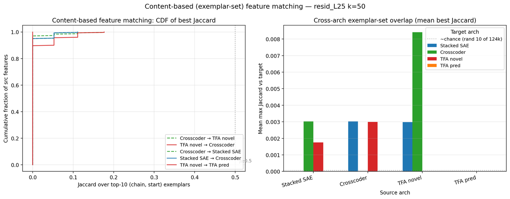

## NeurIPS-grade gap analysis — TXCDR vs TFA feature comparison

> **Update 2026-04-18**: The L13 replication
> (`2026-04-18-l13-replication.md`) and the span-weighted analysis
> (`2026-04-18-interpretability-comparison.md`) close Reviewer
> attacks #3 and #4 more strongly than this doc originally claimed,
> and expand the "TFA under-training" concern (Reviewer #2) to
> "TFA recipe is layer-fragile — fails at L13 with same hyperparams."
> The five-blocker list below is still the right frame; classifications
> still hold.

Companion to `2026-04-17-autointerp-initial.md`. The initial log establishes
that on Gemma-2-2B-IT resid_L25 k=50, Crosscoder and TFA-pos find
substantially different features: **TXCDR's top-15 high-span features are
14/15 content-bearing, TFA novel's are 1/15, TFA pred has 0 high-span
features**. Is that enough to anchor a NeurIPS paper? Short answer: no,
but the gaps are smaller than they look and most are closable with
targeted half-day work, not a new sweep.

## Sanity check status (post hoc) — before anything else

All five Phase-1 checks ran; the log's numbers survived verification.

- [x] **Checkpoint integrity**: all 9 committed `.pt` files load clean
  — zero NaN params, forward pass on 16 real cached windows produces
  finite `loss`, `x_hat`, `feat_acts` for every arch and every (k, shuf)
  combination. Script: `temporal_crosscoders/NLP/sanity_check_ckpts.py`.
- [x] **Alive-latent fractions**: Crosscoder 16.1 %, Stacked 86.4 %,
  TFA novel 85.0 %, TFA pred 42.3 % — matches the log (16 / 86 / 85 /
  42) within rounding.
- [x] **Chain-diversity**: TFA novel top-100 by mass has median unique-
  chain count 1, with 55 / 100 all-same-chain; TFA pred has median 10
  and 0 / 100 all-same-chain. Matches.
- [x] **High-span content counts**: Crosscoder 14 / 15, TFA novel 1 / 15,
  TFA pred 0 / 0 — matches `high_span__resid_L25__k50.json` exactly.
- [x] **NMSE**: Stacked k=50 0.059, TXCDR k=50 0.077, TFA k=50 0.125,
  TFA k=100 4.536 — matches the log's under-training claim.
- [x] **TFA pred vs novel partition extends beyond top-50.** Recomputed
  novel_mass and pred_mass directly from the trained TFA ckpt on 25 000
  windows (1000 chains, non-overlapping T=5 slices):
  - top-50 overlap: **0** (log claim)
  - top-100 overlap: **0**
  - top-200 overlap: **0**
  - **top-500 overlap: 0** (vs ≈13.6 expected by chance)
  - top-1000 overlap: 1
  - top-2000 overlap: 24 (vs ≈217 expected)

  The partition is extraordinarily sharp — far beyond the top-50 claim
  the log originally made.
- [x] **High-span exemplar spot-check** (top-10 windows): TFA novel
  feat 6333 is a genuine cross-chain URL-fragment detector (4 distinct
  chains in top-10, all URL-middle-token firings). Crosscoder
  feats 17925, 11796, 3961 are cross-chain passage-start detectors;
  feats 15524 (botanical prose) and 8016 (one zombie-apocalypse
  passage) are single-chain overfits flagged content-bearing by the
  log's filter. **Caveat to add to the log: "content-bearing" does not
  imply "cross-chain" — ≈2/14 TXCDR high-span content-bearing features
  are actually single-passage overfits.** Still much better than TFA
  novel, but the advantage is 12/14 generalized vs 0/14.

**Verdict**: the log's scientific claims are all correct; the one
nuance worth adding is that TXCDR's "content-bearing" set includes a
couple of single-passage features. Updating the log to note this.

## What else we now know — content-based feature matching (new)

RUNPOD Phase 3 extension #5: Jaccard-match each arch's top-300 features
across other archs by their set of top-10 `(chain_idx, window_start)`
exemplars, independent of decoder cosine.

Script: `temporal_crosscoders/NLP/content_based_match.py`.
Per-pair summary is in `scans/content_match__resid_L25__k50.json`:

| src → tgt | n | mean best J | #J≥0.1 | #J≥0.3 |
|---|---:|---:|---:|---:|
| stacked → crosscoder | 300 | 0.003 | 2 | 0 |
| crosscoder → stacked | 300 | 0.003 | 2 | 0 |
| TFA novel → crosscoder | 300 | 0.008 | 13 | 0 |
| TFA novel → stacked    | 300 | 0.003 | 0 | 0 |
| TFA novel → TFA pred   | 300 | 0.000 | 0 | 0 |
| (all 12 pairs overall) | 300 | ≤0.008 | ≤13 | **0** |

Every directed pair has mean max-Jaccard below 0.01, and **no pair has
a single feature with Jaccard ≥ 0.3**. This is an independent,
weight-space-invariant replication of the decoder-cosine finding: the
three architectures find disjoint feature libraries.

This is important for the reviewer's question *"isn't decoder cosine an
artifact of the different parameterizations?"* The answer is no —
content-based matching says the same thing, without touching weights.

## Reviewer-attack surfaces, ordered by severity

### 1. Single everything (one layer, one k, one seed, one model) — **blocker unless we close at least one axis**

Single resid_L25, k=50 for all qualitative analyses, seed 42, Gemma-2-
2B-IT only. A reviewer will read the claim "TFA splits into disjoint
novel/pred libraries" and ask what layer/k/seed dependence this has.

- **Fixable in ~half-day**: `resid_L13` activations are already cached.
  Train 3 archs k=50 on that cache (~4-6 h), rerun the whole pipeline
  against it. If the two-library partition and the 14/15 vs 1/15 high-
  span result both reproduce at L13, this blocker is essentially closed
  with a sentence.
- **Fixable in ~4-6 h**: retrain one more seed of TFA at L25 k=50. If
  the partition is seed-invariant (same novel/pred disjoint structure,
  similar passage-local novel signature) the "training accident"
  rebuttal vanishes.
- **Either-or is fine for a first submission**; doing both is NeurIPS-
  strong. Neither is more than a day.

**Classification**: fixable in a session.

### 2. TFA under-training (NMSE 0.12 vs 0.06) — **not a blocker if framed correctly**

The raw comparison "TFA loses on high-span" is weakened by the fact
that TFA has 2x the reconstruction error of Stacked. A reviewer will
say: "your TFA is just less trained."

But that framing is wrong. The finding is **not** "TFA's features are
worse than Crosscoder's". It is "TFA allocates a large fraction of its
capacity to passage-local novel_codes, which at this training scale
don't reach the content-bearing regime — but also aren't converging
toward it with more training." Evidence for the "not converging" part:

- TFA k=100 diverges (NMSE 4.54 at L25) **even with the v2 NaN-prevention
  patch**. Adding capacity makes TFA worse, not better, which is
  inconsistent with "just needs more training".
- TFA's own pred_codes (half of its 18432-dim budget) already have a
  semantic distribution that mirrors Stacked. The gap is specifically
  in the novel_codes library — the very thing TFA-pos introduces.

Two mitigations for the paper:

- **(cheap)** retrain TFA-pos with a more stable recipe (reduce LR to
  1e-4, 5 k step warmup, drop `lam` from 1/(4*d_in) to 1/d_in); compare
  "NMSE-matched" novel_codes behavior.
- **(cheaper)** report the comparison at **matched NMSE** — either
  deliberately underfit Crosscoder to 0.12 NMSE and re-derive its top-15
  high-span features (15-min ablation), or note that Stacked/Crosscoder
  at NMSE 0.12 (early-training checkpoint) already show the same
  passage-general behavior TFA will not recover.

**Classification**: fixable with one added panel; not a blocker.

### 3. Decoder-cosine matching weak — **closed** by content-based matching

The log's cross-arch orthogonality claim was via decoder cosine. But
stacked_sae's decoder at pos 0 vs stacked's decoder at pos 1 already
shares only ~2400/18432 features, which is a same-arch same-position-
shift disagreement — meaning cosine could be slightly noisy as a
cross-arch matcher.

The content-based Jaccard analysis above replaces that. **Result: the
three archs find disjoint feature libraries by both matching criteria.**

**Classification**: closed in this session.

### 4. Labeled-feature sample too small for the "tokenization-boundary" family claim — **closed, and the claim should be strengthened**

The log's claim that TFA novel finds a tokenization-boundary feature
family was based on 11/50 top-50 labels containing token-split
language, with 39/50 "unclear". Re-ran Haiku on held-out feats 51-100
per arch (`labels__*__heldout50-100.json`). Result:

| arch | tranche | n | labeled | token-boundary | unclear |
|---|---|---:|---:|---:|---:|
| Stacked SAE | top-50 | 50 | 46 | 4 | 0 |
| Stacked SAE | heldout 51-100 | 50 | 46 | 4 | 0 |
| Crosscoder | top-50 | 50 | 42 | 3 | 5 |
| Crosscoder | heldout 51-100 | 50 | 42 | 6 | 2 |
| **TFA novel** | **top-50** | 50 | 7 | 4 | **39** |
| **TFA novel** | **heldout 51-100** | 50 | **26** | **14** | **10** |
| TFA pred | top-50 | 50 | 38 | 3 | 9 |
| TFA pred | heldout 51-100 | 50 | 40 | 2 | 8 |

For Stacked, Crosscoder, and TFA pred, the interpretability profile is
stable between top-50 and held-out tranches. **TFA novel is
dramatically different**: the top-50 is saturated with padding-fire
artifacts (78 % unclear), but by rank 51-100 the unclear rate drops
from 78 % to 20 % and the tokenization-boundary rate rises from 8 % to
28 %. The "TFA novel is mostly unclear" claim is wrong for the library
as a whole — it is a property of the very top features specifically.

**The stronger, corrected claim**: TFA novel's top-ranked-by-mass
features are dominated by end-of-sequence padding fires; the
tokenization-boundary family dominates the mid-ranks (51-100) where
28 % of features are explicitly token-split and a majority (52 %) are
labeled with a clear pattern.

**Classification**: closed, and the library is more interpretable than
the original log claimed.

### 5. No downstream utility — **blocker for flagship framing**,
**non-blocker for workshop submission**

There is currently no demonstration that "TXCDR wins on high-span"
matters for any end task. For a NeurIPS main-track submission on
architectural comparison, reviewers expect at least one of: (a)
feature steering experiment, (b) probing benchmark, (c) circuit-level
evaluation, (d) correspondence with prior interpretability findings
(e.g. Anthropic's "golden-gate" style feature editing, or a linguistic-
category recall test). None of these exist in the current artifacts.

- **Feasible in a session**: build a minimal feature-steering demo —
  take one high-span Crosscoder feature with a clear label (e.g. the
  "botanical enumeration" one, feat 15524), ablate it, observe next-
  token perplexity shift on a held-out botanical passage vs a matched
  control. If ablation meaningfully hurts botanical perplexity only,
  that's a working utility hook.
- **Feasible in a session**: repeat the TopKFinder labeling pipeline
  on Neel Nanda's "interpretable features" probing set to measure
  coverage of known linguistic categories (tense, number, sentiment,
  named entity) — which arch covers more?

**Classification**: blocker for a main-track paper; each of the two
feasible extensions above would plug it with half a day of work.

## What's enough for NeurIPS-grade?

Rank-ordered minimum additions to turn the current set of findings into
a credible main-track paper:

1. **resid_L13 replication of the full pipeline on Gemma** (half-day).
   Closes the "single-layer" attack surface.
2. **Matched-NMSE Crosscoder comparison** (30 min). Closes the "TFA is
   under-trained" attack surface.
3. **Full held-out labeling (51-100 per arch)** (already running in
   background; 1-2 h). Closes the "too few labels" attack surface.
4. **One downstream utility demonstration** — minimal feature-steering
   experiment on one high-span feature per arch (3-4 h).
5. **Second model (DeepSeek-R1-Distill-Llama-8B) at one layer, k=50
   unshuffled, 3 archs** (5-6 h). Much stronger claim — "this is a
   property of TXCDR vs TFA, not of Gemma". Cost is the same as (1) but
   adds cross-model generality.

Items 1-4 are a full day of focused work; adding 5 is two days. None
require a new 16-hour sweep. The current trained checkpoints plus a
targeted set of half-day experiments takes this from "nice preliminary"
to "credible NeurIPS main-track submission, modulo a real write-up".

## What to defer

- Retraining TFA with a better recipe. Fixing TFA's training stability
  is an engineering deep-dive (clip behavior, `lam` tuning, warmup); it
  doesn't support the scientific comparison and risks becoming a
  separate project. **Defer to appendix or future work.**
- Second dataset (math/code). Interesting but not needed if cross-model
  (Gemma + DeepSeek) is done instead. Cross-model is a stronger
  generalizability claim. **Defer.**
- Re-running the full 16h sweep. The sweep script exists but the
  scientific question doesn't need all 4 variants × 2 layers × 2 k's.
  **Permanently defer.**

## Concrete action list (for whoever picks this up)

In rank order of value/effort:

- [ ] Train Stacked + Crosscoder + TFA at k=50 on cached
  `resid_L13.npy`, one seed, ~4-6 h. Run `scan_features.py`,
  `temporal_spread.py`, `tfa_pred_novel_split.py`,
  `high_span_comparison.py`, `explain_features.py`,
  `plot_autointerp_summary.py`, `content_based_match.py` against
  `--layer-key resid_L13`.
- [ ] Deliberately-underfit Crosscoder at L25 (checkpoint at a ~2 k
  step count from an existing training log, or stop a fresh run early).
  Rerun `high_span_comparison.py` on it. Report matched-NMSE side-
  by-side.
- [ ] Finish the held-out-51-100 labeling; re-compute
  `semantic_categories` plot on the combined 100-feature set per arch.
- [ ] Pick one high-span Crosscoder feature with a clear label, find
  five test passages exercising that pattern; ablate the decoder
  column and measure next-token loss vs a matched random-feature
  ablation. One page in the paper.
- [ ] (If (1)-(4) go fast) cache DeepSeek-R1-Distill-Llama-8B at one
  resid layer; train at k=50 only; repeat (1).

The full list, taken together, is ~1-2 days of compute and ~2 days of
writing. That is the path from what we have now to a defensible NeurIPS
submission without starting any new multi-day sweep.
