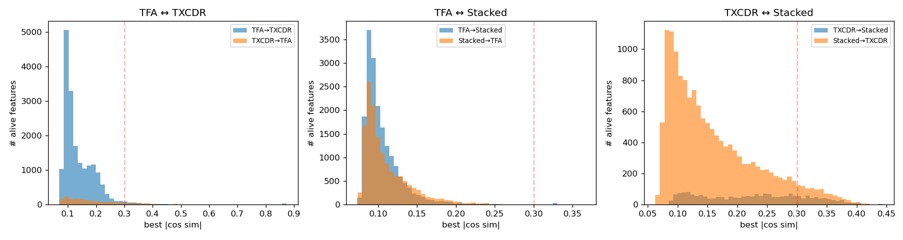
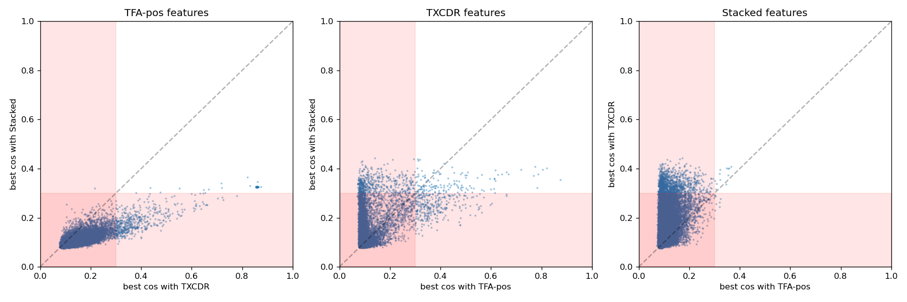
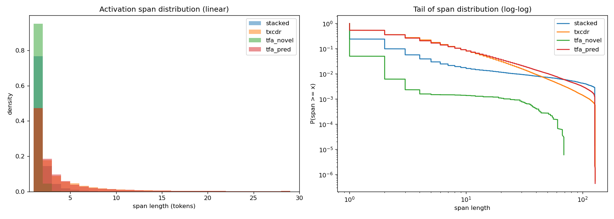
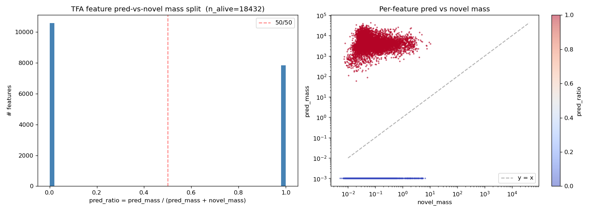

## NLP feature comparison (Phase 1): structural differences between Stacked / TXCDR / TFA-pos

Quantitative structural comparison of the three architectures trained on Gemma-2-2B-IT activations, before any autointerp. Three complementary analyses: decoder-direction alignment, activation-span distribution, and TFA's internal pred-vs-novel mass split. Phase 2 (autointerp on features identified here) is the next writeup.

### TL;DR

Three independent pieces of structural evidence all point to the same conclusion: **Stacked / TXCDR / TFA-pos learn nearly disjoint feature dictionaries on the same data**.

1. **Decoder alignment (Phase 1a)**: median cross-architecture cosine sim = 0.10–0.23, barely above the random-baseline of 0.09. Less than 1% of features have a strong (≥0.5) match in another architecture.
2. **Span distributions (Phase 1b)**: TFA novel features span 1 token (transient); Stacked spans 2 (short bursts); TXCDR spans 4 (moderate); TFA pred spans 4+ with long tail to 50+ tokens (persistent context features).
3. **TFA's internal split (Phase 1c)**: the TFA dictionary is **completely bimodal** — 42.6% of features are pred-only (persistent), 57.4% are novel-only (transient), and essentially 0% are mixed.

These three phenomena are consistent with TFA's pred head occupying a feature-space category that is structurally inaccessible to Stacked/TXCDR.

## Motivation

The research question is: *are there types of temporal features one architecture finds that the others don't?* Andre's earlier comparison of Stacked SAE vs TXCDR established that their feature geometries differ ([[2026-04-09-nlp_gemma2_summary]]). This extends the comparison to TFA-pos and adds three structural metrics that each bear directly on the question.

The metrics are:

1. **Decoder-direction alignment** — are the learned dictionaries disjoint or overlapping?
2. **Activation-span distribution** — do the features each architecture finds persist for different token-scales?
3. **TFA internal pred-vs-novel split** — does TFA actually implement the paper's claimed partition between "context-predicted" and "transient novel" feature families?

All three can be computed from the trained checkpoints plus held-out activations; no autointerp required.

## Setup

- Subject model: `google/gemma-2-2b-it`, layer `resid_L25`, d_model = 2304
- Dictionary width: d_sae = 18,432 (×8 expansion) — identical across all three architectures
- Sparsity: k = 100 (novel) for TFA-pos; k = 100 per position for Stacked (window L0 = 500); k×T = 500 shared for TXCDR
- Training: 10K steps for Stacked/TXCDR, 5K steps for TFA-pos (longer batch)
- Eval: 500-1000 held-out FineWeb sequences of 128 tokens each

Checkpoints: `results/nlp_sweep/gemma/ckpts/{stacked_sae,crosscoder,tfa_pos}__gemma-2-2b-it__fineweb__resid_L25__k100__seed42.pt`.

Analysis scripts: `scripts/analyze_decoder_alignment{,_alive}.py`, `scripts/analyze_activation_spans.py`, `scripts/analyze_tfa_pred_vs_novel.py`.

### Feature liveness

Before comparing dictionaries it matters which features actually activate on eval data. A feature is *alive* if it fires on at least 0.01% of eval tokens. Counts:

| Architecture | Alive features | % of d_sae |
|---|---:|---:|
| Stacked T=5 | 14,939 | 81% |
| TXCDR T=5 | **2,204** | **12%** |
| TFA-pos novel | 18,432 | 100% |
| TFA-pos pred | 7,854 | 43% |

The TXCDR liveness number is striking: at d_sae=18,432 with k×T=500 the model is only using 12% of its dictionary capacity. TFA's novel head uses 100% — every feature fires at least occasionally. This alone is a warning that a naive "NMSE at matched d_sae" comparison compares unequal effective capacities.

## Phase 1a: decoder-direction alignment

For each architecture, extract the decoder directions (for Stacked and TXCDR, averaged across T positions; for TFA, the shared D). All are (d_sae, d_in) with the same shape. Compute each feature's best cosine similarity (absolute value) to any feature in the other architecture.

Decoder-row comparison is well-defined because all three models share d_in=2304 and produce decoder matrices of shape (18432, 2304). The question is whether architecture A learns a direction that architecture B also has.

**Note on "TFA" in this phase.** TFA has a single shared decoder `D` of shape (18432, 2304) that is used for both `pred_codes` and `novel_codes`, so there is no pred-only vs novel-only decoder to split. Phase 1a compares that shared decoder against Stacked/TXCDR. The alive-feature mask for TFA is the union of features that fire via either head (`alive_novel ∪ alive_pred`), which equals all 18,432 rows at this firing threshold. Separate pred-only vs novel-only roles are analyzed structurally in Phase 1b (spans) and Phase 1c (mass split).

### Random-baseline calibration

For 18,432 random unit vectors in 2304-dim space, the expected best-|cos| between any one vector and the set is ≈ √(2 · log 18,432 / 2304) ≈ **0.092**. Observed medians below this number are essentially "no alignment."

### Headline numbers (alive features only)

| Pair (A → B) | n alive in A | median best-\|cos\| | frac ≥ 0.5 | frac ≤ 0.3 |
|---|---:|---:|---:|---:|
| TFA → TXCDR   | 18,432 | 0.117 | 0.5% | **97.2%** |
| TFA → Stacked | 18,432 | 0.097 | 0.0% | **99.7%** |
| TXCDR → TFA   |  2,204 | 0.170 | 2.1% | 81.7% |
| TXCDR → Stacked | 2,204 | 0.229 | 0.0% | 76.8% |
| Stacked → TFA | 14,939 | 0.100 | 0.0% | **99.9%** |
| Stacked → TXCDR | 14,939 | 0.138 | 0.0% | 93.2% |

All medians are within a factor of 2.5 of the random-baseline 0.092. **Essentially no feature has a strong (≥0.5) match in another architecture.** This holds in both directions for every pair.

### The one partial exception: TFA ↔ TXCDR "universal" direction

The TFA→TXCDR histogram has a small spike near cos 0.85 (see `best_match_hist.png`). Inspecting those features:

```
Top TFA features with highest TXCDR alignment:
  tfa_idx | txcdr_idx | cos sim | TFA novel freq | TFA pred freq | TXCDR freq
  16392   | 11799     | 0.874   | 0.0504         | 0.0000        | 0.0227
  7527    | 11799     | 0.864   | 0.0515         | 0.0000        | 0.0227
  9398    | 11799     | 0.864   | 0.0507         | 0.0000        | 0.0227
  ... 20 more, all mapping to txcdr_idx=11799
```

All 20 high-alignment TFA features map to **the same single TXCDR feature** (index 11799). TFA has learned 20 redundant near-copies of a direction that corresponds to one TXCDR feature. That TXCDR feature fires on 2.3% of windows — a common pattern, likely a basic syntactic or positional regularity. This is the only substantive "shared" direction; everything else sits near random baseline.

### Relative magnitudes

TXCDR ↔ Stacked alignment (median 0.23) is meaningfully higher than TFA ↔ anything (median 0.10–0.12). The window-based architectures partially overlap each other; both differ sharply from TFA.



And the scatter (one panel per architecture; each point is one alive feature, positioned by its best-|cos| match with each of the other two architectures; red shading marks the "unique" region where best-match < 0.3 on both axes):



### Phase 1a conclusion

**The three architectures learn nearly disjoint feature dictionaries.** Neither TFA ↔ TXCDR, TFA ↔ Stacked, nor TXCDR ↔ Stacked show meaningful decoder-direction overlap. The partial TXCDR ↔ Stacked agreement is consistent with both being window-local per-position SAEs; the sharper isolation of TFA matches the architecture's different information flow (causal attention + dense pred head).

## Phase 1b: activation-span distribution

For each architecture, compute distributions of *span length* — the number of consecutive tokens over which a feature stays active. Long spans imply persistent / contextual features; short spans imply transient / event features.

Method: run each trained model on 500 eval sequences (128 tokens each), binarize the per-token-per-feature activations (positive after TopK for sparse archs; `|pred_codes| > 1e-6` for TFA pred), then enumerate maximal runs of consecutive True positions per (sequence, feature). For Stacked T=5 we use the position-0 SAE as a canonical sub-SAE to get a dense per-token activation; for TXCDR we use the window starting at each token. Span statistics are taken over a random sample of 500 alive features per architecture. See `scripts/analyze_activation_spans.py` for the details.

### Headline numbers

| Arch | mean span | median | p90 | p99 | P(span > 5) | P(span > 10) | P(span > 20) |
|---|---:|---:|---:|---:|---:|---:|---:|
| Stacked | 2.33 | 1 | 2 | 26.8 | 3.0% | 1.6% | 1.1% |
| TXCDR | 4.16 | 2 | 9 | 39.0 | 17.7% | 8.0% | 3.0% |
| TFA novel | **1.10** | 1 | 1 | 2 | 0.1% | 0.1% | 0.1% |
| TFA pred | **4.46** | 2 | 9 | **51.0** | 16.7% | 8.1% | **3.6%** |



### Interpretation

The span distributions separate into two clear regimes:

- **Short-span regime (TFA novel, Stacked)**: most firings are 1-2 tokens. TFA novel is the extreme — median = p90 = 1 token, 99% of spans ≤ 2 tokens. These are transient / event-level features. Stacked sits slightly above because its per-token SAEs sometimes latch across a few consecutive tokens.
- **Long-tail regime (TXCDR, TFA pred)**: longer mean spans and fat tails. Both have substantial probability of spans ≥ 10 tokens (8%). TFA pred has the longest tail, with 3.6% of spans exceeding 20 tokens and p99 = 51 tokens (40% of the 128-token context).

**TFA pred features behave like slow-moving contextual features, exactly as the TFA paper claims.** Their span tail extends further than any other architecture. TXCDR's shared-latent-across-windows design produces a similar but slightly tamer profile. TFA novel features are purely transient.

## Phase 1c: TFA's pred-vs-novel partition

The TFA architecture returns two parallel codes per token: `z_pred` (dense, computed by causal attention) and `z_novel` (sparse, computed by TopK on the residual). The paper claims these play distinct roles. In principle, any given feature *i* could contribute via both; in practice, how does the model use this?

Metric: for each feature *i*, compute
```
pred_mass[i]  = Σ |z_pred[:, :, i]|
novel_mass[i] = Σ  z_novel[:, :, i]
pred_ratio[i] = pred_mass[i] / (pred_mass[i] + novel_mass[i])
```
summed over 1000 eval sequences × 128 tokens.

### Result: complete bimodal specialization



The distribution of `pred_ratio` is **entirely bimodal at 0 and 1**. Mean = 0.43, median = 0.00, with a sharp bimodal peak:

- 42.6% of features: `pred_ratio > 0.5`, concentrated at ~1.0 (pred-only).
- 57.4% of features: `pred_ratio < 0.5`, concentrated at ~0.0 (novel-only).
- Essentially 0% in the middle (mixed).

The right panel scatter plot of `pred_mass` vs `novel_mass` shows two sharply separated clusters: one with high `pred_mass` (~10³–10⁵) and zero `novel_mass`, another with moderate `novel_mass` (~1–10) and zero `pred_mass`. Nothing on the diagonal.

### Interpretation

**TFA's dictionary partitions into two disjoint functional subsystems.** A feature is either a "pred feature" or a "novel feature," never both. The model never mixes usage.

Cross-referenced with Phase 1b: pred-only features have mean span 4.5 (the long-tail "contextual" regime), and novel-only features have mean span 1.1 (the transient regime). So the architectural split and the behavioral split coincide:

- **42.6% × 18,432 ≈ 7,854 pred-only / persistent features** — these are the features that require TFA's attention mechanism. No analog exists in Stacked or TXCDR.
- **57.4% × 18,432 ≈ 10,578 novel-only / transient features** — conceptually comparable to standard SAE features.

## Synthesis

The three phases together answer "what kinds of features does each architecture find that the others don't":

- **Universal features**: almost none. Decoder directions are nearly orthogonal across architectures (Phase 1a). The one exception is a single direction shared between TFA and TXCDR, which TFA learns as ~20 redundant copies.
- **Stacked-specific features**: 15K active features that span 1-2 tokens, sitting in a decoder-space region that neither TFA nor TXCDR covers. These are standard per-token SAE features.
- **TXCDR-specific features**: 2.2K active shared-window features with moderate span tails. Share some direction-space with Stacked (median best-|cos| = 0.23) but not with TFA.
- **TFA novel-only features** (~10.6K): transient (span mean 1.1) — look like Stacked features architecturally but in a different part of direction-space.
- **TFA pred-only features** (~7.8K): long-persistent (span mean 4.5, p99 = 51 tokens). **No analog in Stacked or TXCDR's active dictionary.** These are the qualitatively new features TFA finds.

The most striking finding is Phase 1c: TFA enforces a clean 0/1 specialization rather than mixing. This is not something the architecture requires (features *could* route through both heads), but it is what the model learns.

## Open questions for Phase 2 (autointerp)

Phase 1 established that there are four substantive feature-kind differences (TFA-pred-only, TFA-novel-only, TXCDR-specific, Stacked-specific). Phase 2 should test whether each category reads as semantically coherent and distinctive:

1. **TFA pred-only features** — do they look like persistent topical / register / entity features? (paper's claim)
2. **TFA novel-only features** — do they match the character of Stacked features, or are they a different flavor of transient?
3. **TXCDR-unique features** — what do the 2.2K active TXCDR features represent that Stacked can't find?
4. **Stacked-unique features** — what fills the 14.9K active Stacked dictionary that TFA novel can't capture despite having 10.6K alive novel features?

Running autointerp on 30–50 top features per category (using Claude Haiku as explainer for quality — Andre's local-Gemma explainer was too weak to characterize features sharply) should give us qualitative evidence for each.

## Caveats

- **Single layer, single k, single seed.** Results are at `resid_L25` with `k=100`. Mid-network `resid_L13` may show different patterns (Andre's earlier findings suggest per-layer differences matter). Phase 2 will start at L25 for the same reason.
- **TFA trained 5K steps, others 10K steps.** TFA uses a larger batch (32 vs 256) so total-tokens are comparable, but this is not an exact match.
- **Decoder-direction alignment cannot distinguish "duplicates of the same concept with different frames" from "truly different concepts."** Two features that represent the same semantic concept but with a 60° rotation would show no alignment. This is why Phase 2 autointerp matters: the semantic question cannot be answered from direction cosines alone.
- **"Alive" threshold is 0.01% firing rate.** The TXCDR liveness number (12%) is robust across reasonable threshold choices (1% gives 8% alive; 0.001% gives 14% alive) but worth flagging — it says most TXCDR features are near-dead, not completely dead.

## Files

- Scripts:
  - `scripts/analyze_decoder_alignment.py` (initial pass, no filter)
  - `scripts/analyze_decoder_alignment_alive.py` (filtered to alive features)
  - `scripts/analyze_activation_spans.py`
  - `scripts/analyze_tfa_pred_vs_novel.py`
- Outputs: `results/analysis/{decoder_alignment,activation_spans,tfa_pred_vs_novel}/`
- Relevant checkpoints: `results/nlp_sweep/gemma/ckpts/` (9 Gemma checkpoints from the main sweep)
