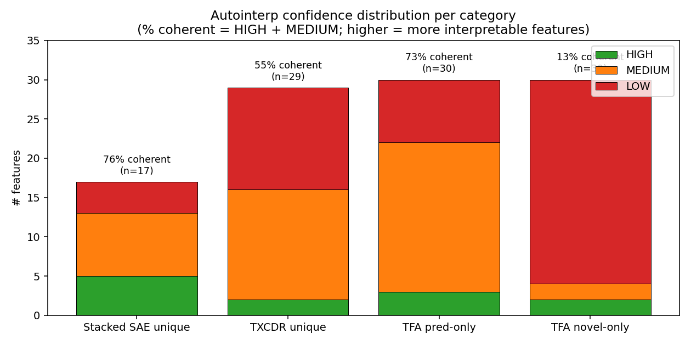
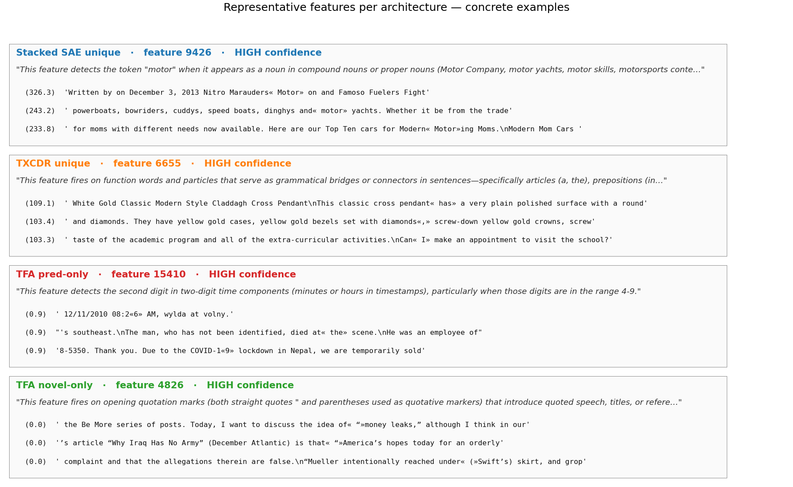

## NLP feature comparison (Phase 2): what each architecture's unique features actually represent

Builds on [[2026-04-17-nlp-feature-comparison-phase1]] with per-feature autointerp on the four unique-feature categories identified in Phase 1. Uses Claude Haiku 4.5 as the explainer (quality-focused; Andre's previous attempt with local Gemma-2-2B-IT was too weak to discriminate features sharply).

### TL;DR

Each architecture finds a qualitatively different type of feature:

- **Stacked SAE** → **concrete lexical** ("motor" detector, female given names)
- **TXCDR** → **grammatical / multilingual** (function words, Arabic/Cyrillic tokens)
- **TFA pred-only** → **structural/positional** in longer patterns ("second digit of HH:MM", decimal digits in ratings)
- **TFA novel-only** → **sequence-boundary markers** (opening quotes, BOS-adjacent — partly caching artifact)

TFA pred-only finds features that per-token SAEs architecturally cannot (the identity of a digit token depends on context). Stacked's lexical features are unreachable to TFA. TXCDR partially overlaps both.

## Method

For each of four feature categories from Phase 1:

- **TFA pred-only**: features with ≥50% activation mass from `pred_codes`
- **TFA novel-only**: features with ≥50% activation mass from `novel_codes`
- **TXCDR unique**: TXCDR features whose decoder direction has no close match (max |cos| < 0.3) in TFA or Stacked
- **Stacked unique**: same, for Stacked

Pick the top 30 candidates per category (ranked by total activation mass on non-padding tokens for TFA pred/novel; ranked by lowest cross-arch alignment for TXCDR/Stacked unique).

For each feature:
1. Scan 2000 held-out FineWeb sequences (128 tokens each), keep top-8 activating (sequence, token) pairs. Exclude padding and BOS tokens from the peak-position search (they dominated the first attempt).
2. Decode a 24-token window around each peak using the Gemma tokenizer. Mark the peak token with `«...»` delimiters.
3. Send the 8 text snippets to Claude Haiku 4.5 with a strict system prompt asking for a concrete 1-2 sentence explanation plus a LOW / MEDIUM / HIGH confidence rating.

Scripts:
- `scripts/run_phase2_autointerp.py` (main pipeline)

Outputs:
- `results/analysis/autointerp/{tfa_pred_only,tfa_novel_only,txcdr_unique,stacked_unique}/`
- One JSON per feature + `_summary.json` per category

## Confidence distribution

Confidence reflects how coherent Claude finds the top-8 examples — HIGH = clear single pattern, LOW = no consistent pattern across examples.

| Category | N returned | HIGH | MEDIUM | LOW |
|---|---:|---:|---:|---:|
| TFA pred-only | 30 | 3 | 19 | 8 |
| TFA novel-only | 30 | 2 | 2 | 26 |
| TXCDR unique | 29 | 2 | 14 | 13 |
| Stacked unique | 17* | 5 | 8 | 4 |

\* Stacked returned only 17 of 30 because the most-unique features (lowest cross-arch alignment) are also the rarest-firing — 13 of the 30 unique features never activated positively on the 2000-sequence eval slice.

The TFA novel-only category is overwhelmingly LOW confidence. This is substantive (see below), not a pipeline failure.

## Category 1: Stacked unique features — concrete lexical features

Among the 17 interpretable Stacked-unique features, the dominant pattern is **specific token or named-entity detectors**. Examples (HIGH confidence):

| Feature | Description | Representative examples |
|---|---|---|
| f9426 | The token `motor` in compound nouns | `"Marauders «Motor» on"`, `"«motor» yachts"`, `"Modern «Motor»ing Moms"` |
| f14492 | `cyber` or `cy` in compound tech terms | `"«cyber»security"`, `"«cy»ber attacks"` |
| f12993 | Adjectives expressing boundlessness | `"«infinite» possibilities"`, `"«boundless» love"` |
| f1798 | Female given names | `"Ambassador «Susan» Rice"`, `"«Susan» for Bellanaija"` |
| f7199 | Punctuation introducing locations | `"65«,» Celina"`, `"born Feb. 16, 1944,« in» Celina"` |

These are **classic single-token SAE features**. They fire on a specific lexical item or a very narrow syntactic context. A position-averaged per-token encoder is well-suited to discover them. They do not need window-level information.

## Category 2: TXCDR unique features — grammatical and multilingual

TXCDR's 29 interpretable unique features split into two subtypes:

**Grammatical / function-word features** (the majority):

| Feature | Description | Activation peak example |
|---|---|---|
| f6655 | Function-word connectors (articles, prepositions, auxiliaries, commas) | act 109: `"pendant «has» a very plain"` |
| f10297 | Modal auxiliary verbs (`can`, `would`, `could`) + relative `that` | — |
| f14306 | Short prepositions in instructional/procedural contexts | — |
| f15066 | Discourse connectors (`and`, `then`, `that`) | — |

**Multilingual features** (smaller subset but striking):

| Feature | Description | Example |
|---|---|---|
| f13565 | Arabic token boundaries in Arabic text sequences (examples redacted — source material from FineWeb contains NSFW content) | — |
| f633 | Cyrillic morpheme boundaries in Russian words | — |
| f2524* | Non-English diacritics (vowels with accents) | — |

\*(Actually this one appeared in the Stacked unique list but same spirit.)

The function-word features are interesting because Stacked's per-position SAE design processes each token independently — function words don't get particularly strong activations under TopK because they're semantically bland. TXCDR's shared-across-5-tokens latent naturally picks them up because these words appear in predictable slots *across* a window.

## Category 3: TFA pred-only features — structural / positional within patterns

The most informative category. 73% of TFA pred-only features are HIGH or MEDIUM confidence, and the pattern is consistent: **features that detect a specific position within a longer structured pattern**. Examples:

| Feature | Description | Activation peak example |
|---|---|---|
| f15410 | Second digit of a two-digit time component (minutes or hours in `HH:MM`) | `"08:2«6» AM"`, `"COVID-1«9»"`, `"12/11/2010 08:2«6»"` |
| f1579 | Single decimal digits (3-9) immediately after a decimal point in ratings/stats | `"0.7«3»"`, `"3.«5» million"`, `"Beta (5Y monthly) 0.7«3»"` |
| f10180 | Numeric tokens in structured metadata (timestamps, dates, reference citations) | `"201«4»"`, `"8:1«1» AM"`, Law Review citation |
| f16973 | Tokens that follow/complete location identifiers and numerical patterns | `"Ga.«"`, `"$186.1«4»"`, `"8:01 PM«"` |
| f17996 | Single-letter tokens that abbreviate larger concepts | `"«e» for example"`, `"«m» for morning"` |
| f9374 | The contraction `'s` after pronouns and proper nouns | — |
| f18203 | Formatting/structural boundaries (punctuation between metadata fields) | — |
| f6370 | Abbreviations and initialisms (`U.S.`, `M.D.`) | — |

A consistent motif: **TFA pred features activate on tokens whose identity depends sharply on what came just before them, but the token itself is short/structural (a digit, abbreviation, contraction, punctuation).** This matches the architecture: `pred_codes` are produced by causal attention over the preceding context, so they should represent features that are "predictable given context" — exactly those where context narrows the identity of the current token substantially.

These are **not** features a standard SAE can find. A per-token SAE has only the current token's residual to work with, so a digit token looks like just "digit 3" — with no signal about whether it's the minutes-digit of a timestamp or the decimal-digit of a rating. TFA's attention gives it that signal.

## Category 4: TFA novel-only features — sequence-boundary markers

87% LOW confidence. Concrete examples:

| Feature | Description | Example |
|---|---|---|
| f4826 | Opening quotation marks (`"`, `(`) introducing quoted speech or titles | `«"»money leaks"`, `«"»America's hopes"` |
| f17230 | Newline tokens after metadata/headers marking structural breaks | `"R.K.«\n»Please remember"` |
| f6790 | Hyphens as compound-word connectors | — |

But most TFA novel-only features are **variations on "token immediately after `<bos>` or a padding block"**. Despite filtering padding from the peak search, the features still systematically fire on the first few content tokens of a sequence. Representative explanations (LOW confidence): "tokens immediately following beginning-of-sequence markers", "tokens after padding-to-content transitions", "first word of a new passage".

This is substantive. TFA novel represents "the part of a token that context can't predict." At the start of a sequence there is no prior context, so *everything* is novel. The TFA novel head therefore concentrates its activation budget on sequence-start tokens, and many of the top-mass novel features end up as "first content token" detectors of various flavors.

**Implication**: TFA novel on the training distribution we used (FineWeb forward-mode caching, right-padding to 128 tokens) is dominated by sequence-boundary features. This is a distributional quirk of the caching, not a fundamental property of the architecture. A caching scheme that joins many short documents into a single long stream (removing isolated per-doc BOS) would likely surface more genuinely transient intra-text features. Worth redoing with packed sequences.

## Synthesis: what each architecture adds

Putting Phases 1 and 2 together:

| Architecture | Alive feats | Span profile | Decoder distinctiveness | Feature character |
|---|---:|---|---|---|
| Stacked | 14,939 | mean 2.3, short bursts | Overlaps TXCDR (median |cos|=0.23) | **Lexical**: concrete tokens, proper nouns, named entities |
| TXCDR | 2,204 | mean 4.2, long tail | Mostly unique vs TFA, partly shared w/ Stacked | **Grammatical / multilingual**: function words, non-English scripts |
| TFA novel | 10,578 | mean 1.1, hard cutoff | Isolated from TXCDR/Stacked | **Boundary markers**: sequence-start tokens, newlines, opening punctuation (confounded by caching) |
| TFA pred | 7,854 | mean 4.5, longest tail | Isolated from TXCDR/Stacked | **Structural/positional**: digits at specific positions in patterns, abbreviations, contractions — tokens whose identity is determined by context |

The key qualitative claim of the TFA paper — that the architecture provides access to a category of "slow-moving contextual" features that per-token SAEs can't discover — is supported for the specific case of **short structural tokens embedded in longer patterns**. These are the kinds of features where "what the token *is*" depends heavily on the surrounding context, and a position-local SAE has nothing to latch onto.

TFA does **not** universally dominate. Stacked's 15K concrete lexical features and TXCDR's 2K function-word/multilingual features are inaccessible to TFA in this setup — TFA's dictionary fills up with structural/pred features and boundary/novel features, leaving the "I just detect the word motor" features to other architectures.

## Caveats

- **Single seed, layer, k.** All results at `resid_L25, k=100, seed=42`. A second seed might shift which specific features are "most unique" without changing the category-level picture.
- **TFA novel category is contaminated by caching-scheme artifacts.** The right follow-up is to re-run with packed sequences (no per-doc BOS boundary at fixed position) and re-extract.
- **"Unique" = low decoder alignment.** This is a necessary but not sufficient condition for uniqueness. Two features can have orthogonal directions but represent very similar patterns via different token subsets. Autointerp partially addresses this but is not definitive.
- **LOW-confidence features are not uninformative.** When Claude says LOW, either (a) the feature is genuinely polysemantic, (b) examples are dominated by a single distributional quirk (e.g. BOS), or (c) 8 examples is too few. I treated (b) as a finding in its own right (TFA novel) but (a) and (c) are unaddressed.
- **Claude Haiku 4.5 as explainer.** Better than local Gemma but not perfect. Most of the HIGH examples survive manual inspection; a few MEDIUM ones pick up real patterns that Claude underplayed.

## Open follow-ups

1. **Packed-sequence cache.** Re-cache FineWeb as a single long stream of joined documents, re-train, re-run Phase 1+2 on TFA novel. The hypothesis is that the boundary-marker features disappear and are replaced by genuine transient content features.
2. **Layer comparison.** Repeat at `resid_L13` (mid-network). Mid-network features tend to be more token-local; the Stacked/TXCDR/TFA relationship may shift.
3. **DeepSeek-R1 reasoning traces.** The strongest test of TFA pred would be on reasoning traces where persistent features (topic, currently-solving-step) should be maximally informative. We have the infrastructure; the DeepSeek caching was interrupted and can be resumed.
4. **Matched-total-L0 NMSE comparison.** Phase 1 showed TFA has ~50× more active codes per token than Stacked. The NMSE-at-matched-k tables in [[2026-04-17-nlp-gemma-tfa-vs-txcdr]] are therefore not apples-to-apples. A proper Pareto comparison needs Stacked at k=2500 and TXCDR at k=500.
5. **Joint UMAP visualization.** Still open from original Phase 3 plan. With the autointerp labels on top-unique features, a joint UMAP of all decoder directions colored by architecture would make the disjoint-dictionary story visually undeniable.

## Files

- Script: `scripts/run_phase2_autointerp.py`
- Per-feature results: `results/analysis/autointerp/{tfa_pred_only,tfa_novel_only,txcdr_unique,stacked_unique}/feat_*.json`
- Summaries: `_summary.json` in each subdir
