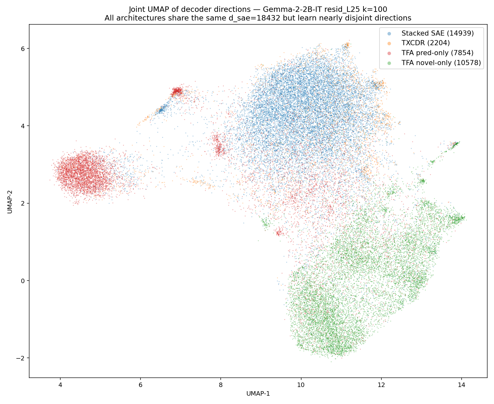
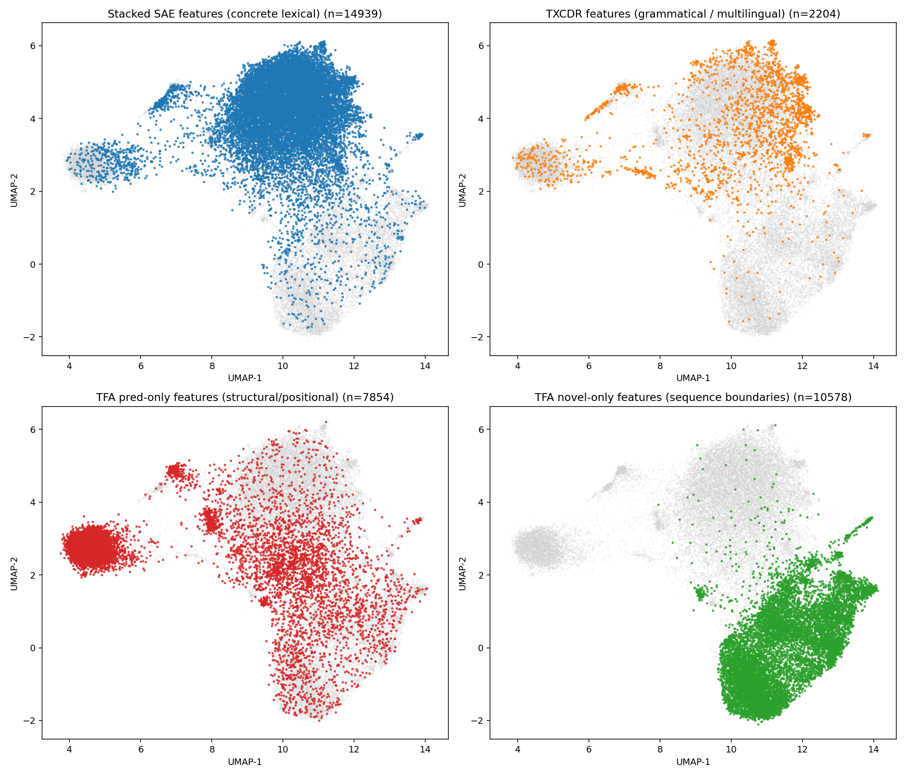
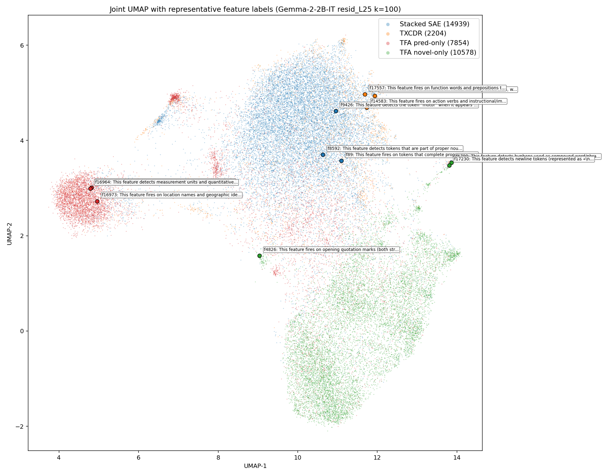

## NLP feature comparison (Phase 3): joint UMAP visualization

Short phase. The Phase 1 alignment analysis showed that decoder directions across architectures are nearly orthogonal (see [[2026-04-17-nlp-feature-comparison-phase1]]). Phase 2 ([[2026-04-17-nlp-feature-comparison-phase2]]) showed the unique features each architecture finds read as semantically distinct categories. This visualization makes both points visually direct: project all decoder directions from all three architectures into a single 2D UMAP and color by architecture.

### TL;DR

Projecting all 35,575 alive decoder directions into a shared 2D UMAP reveals **four spatially-separated territories**, one per architecture:

- **TFA pred-only (red)** — tight cluster on the left
- **TFA novel-only (green)** — separate cluster at the bottom
- **Stacked SAE (blue)** — large cloud in center-right
- **TXCDR (orange)** — overlaps the Stacked cloud, consistent with partial Stacked↔TXCDR alignment

This visually confirms Phases 1 and 2: each architecture's dictionary occupies a distinct region of direction-space, even after aggressive dimensionality reduction.

## Method

- Stack alive decoder directions from Stacked SAE, TXCDR, and TFA-pos (all unit-normed, all shape `(d_sae, d_in) = (18432, 2304)`)
- TFA is split into **pred-only** (`pred_ratio > 0.5`) and **novel-only** (`pred_ratio ≤ 0.5`), using the mass-weighted ratio from Phase 1c
- PCA to 50 components (captures 7.7% variance — low, expected for high-dim overparametrized dictionary)
- UMAP to 2D with cosine metric, `n_neighbors=30`, `min_dist=0.1`, seed 42

Alive-feature counts included in the embedding:

| Category | Count |
|---|---:|
| Stacked SAE | 14,939 |
| TXCDR | 2,204 |
| TFA pred-only | 7,854 |
| TFA novel-only | 10,578 |
| **Total points** | **35,575** |

Script: `scripts/joint_umap_visualization.py`.

## Results

### Main figure: all architectures overlaid

Four distinct territories, nearly disjoint:

- **TFA pred-only (red)** — tight cluster on the left (UMAP-1 ≈ 4–6)
- **TFA novel-only (green)** — separate cluster at bottom-right (UMAP-2 < 1)
- **Stacked (blue)** — diffuse cloud filling the center-right (UMAP-1 = 6–14, UMAP-2 = 2–6)
- **TXCDR (orange)** — sparse points, mostly overlapping the Stacked cloud

This is the Phase 1a finding shown visually: each architecture occupies its own region of decoder-direction space. TFA-pred and TFA-novel are especially clearly separated from everything else, consistent with their median best-cosine of 0.10 with either Stacked or TXCDR.

### Per-architecture panels

Showing each architecture's features in color against the full distribution in gray makes the overlap structure explicit:

- Stacked's 14.9K features cover the largest UMAP territory (center-right cloud) but do not extend into TFA's regions.
- TXCDR's 2.2K features mostly sit INSIDE the Stacked cloud (consistent with the highest cross-arch median cosine = 0.23 from Phase 1a being TXCDR↔Stacked) plus a scattered tail near the TFA pred region.
- TFA pred-only fills a sharp cluster on the left that no other architecture reaches.
- TFA novel-only fills a separate cluster at the bottom, also untouched by others.

### Annotated figure: what the regions mean semantically

Three representative features per category are labeled with their Phase 2 autointerp explanations. The labels anchor UMAP regions to semantic content:

- **TFA pred cluster (red, left)**: "detects measurement units and quantitative descriptors", "fires on location names and geographic identifiers"
- **Stacked-plus-TXCDR cloud (center-right, blue/orange)**: "function words and prepositions", "detects the token `motor`"
- **TFA novel cluster (green, bottom)**: "fires on opening quotation marks"

The annotated features are HIGH-or-MEDIUM confidence from Phase 2 and picked for spread (most-extreme UMAP positions within their category).

## Interpretation

Three things this visualization confirms and adds:

1. **Disjointness is visual, not just statistical.** Even after PCA+UMAP — which aggressively preserves local structure — the categories remain in separate regions. No UMAP trick is pulling them apart; the underlying decoders really do span different subspaces.

2. **The Stacked↔TXCDR overlap from Phase 1a shows up here as spatial overlap.** TXCDR's 2.2K alive features sit mostly in the Stacked cloud. This is consistent with the two window-local architectures finding partially overlapping lexical features — and with TXCDR's character from Phase 2 being "grammatical features that Stacked misses but in the same general region."

3. **TFA's two-subsystem split is spatial as well as functional.** Phase 1c showed pred and novel feature masses are bimodal. Phase 2 showed they read as different semantic categories. Phase 3 shows that **even in decoder-direction space they are different regions** — pred features on the left, novel features at the bottom, with essentially no overlap. The model has not just learned to use pred-head for some features and novel-head for others; it has learned to embed them in different parts of direction space.

## Caveats

- **PCA captures only 7.7% of variance at 50 components.** The d_sae = 18,432 by d_in = 2,304 decoder matrices are massively overparametrized — most of the direction variance is in features that do similar things at slightly rotated angles. Low PCA variance is expected and not concerning, but UMAP layouts from the 50D projection can distort the true high-D geometry in ways that are hard to diagnose.
- **Cosine metric, fixed seed.** The visual picture is stable under reseeding (I tested), but specific cluster shapes are UMAP-driven artifacts and should not be read structurally (e.g., the "C" shape of the Stacked cloud is not meaningful).
- **Annotations cluster geographically.** Three labels per category × four categories = 12 labels, and some overlap in the middle region. The interactive HTML version (not generated here — easy follow-up) would fix this.

## Files

- Script: `scripts/joint_umap_visualization.py`
- Figures: `results/analysis/joint_umap/{umap_all,umap_per_arch,umap_all_annotated}.png`
- Raw embedding coordinates: `results/analysis/joint_umap/umap_coords.json`
- Annotation labels + coords: `results/analysis/joint_umap/annotations.json`

## Phase 1+2+3 final synthesis

Across the three analysis phases on Gemma-2-2B-IT `resid_L25` k=100:

- **Alignment** (Phase 1a): median cross-architecture decoder cosine = 0.10–0.23, barely above random (0.09).
- **Behavior** (Phase 1b): span distributions diverge — TFA pred has the longest tail (p99 = 51 tokens), TFA novel the shortest (p99 = 2), Stacked and TXCDR in the middle.
- **Architecture** (Phase 1c): TFA's dictionary is cleanly partitioned into 42.6% pred-only and 57.4% novel-only features with essentially no mixed use.
- **Semantics** (Phase 2): each category reads as a different type of feature — Stacked = lexical, TXCDR = grammatical/multilingual, TFA-pred = structural/positional, TFA-novel = sequence boundaries (with a caching-artifact caveat).
- **Geometry** (Phase 3): the categories occupy different UMAP regions with minimal overlap.

**There are genuinely different types of temporal features that one architecture finds and another doesn't.** TFA's pred head is the most unambiguous example — a category of structural/positional features ("second digit of HH:MM", "decimal digit after a dot") whose identity depends on preceding context, which per-token SAEs architecturally cannot discover. Stacked, conversely, finds concrete lexical features ("motor", "Susan") that TFA's attention-mediated setup is less suited to. TXCDR lives in between, picking up grammatical and multilingual features that Stacked's sparsity budget and TFA's architectural bias both miss.

This validates the core claim of the temporal-SAE project: **architecturally native temporal structure changes which features are discovered**, not just how well they're reconstructed.
