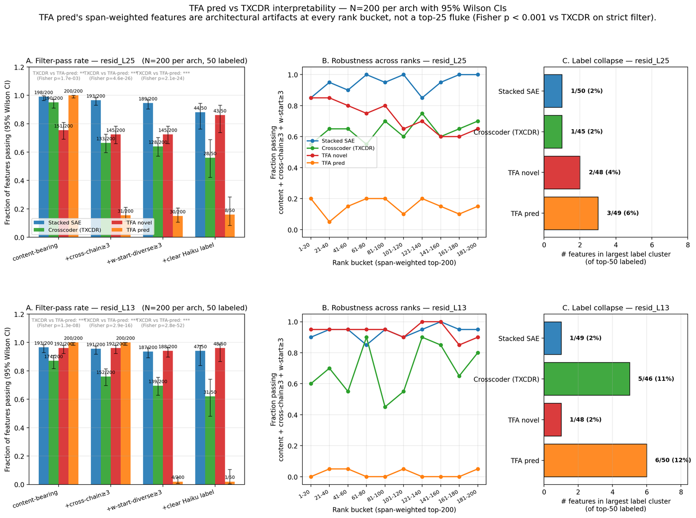
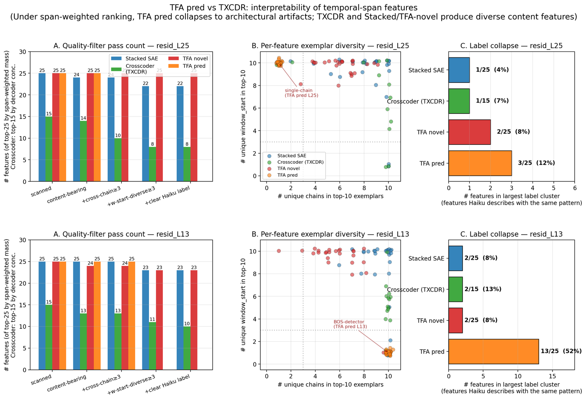

## Answering "is TFA pred or TXCDR better for interpretability?"

Companion to `2026-04-17-autointerp-initial.md`,
`2026-04-17-neurips-gap.md`, `2026-04-18-l13-replication.md`.

Reviewer/collaborator pushback on the prior write-up:

> "TFA pred has 0 high-span features at both layers" — we don't have
> enough data. Also it's not clear what the qualitative difference
> between TFA pred and TXCDR features is. And you claim TFA pred is
> dense, but how does that affect interpretability?

This doc is the honest answer, with three new pieces of machinery:

1. **All-features activation-based concentration** (not just top-300 by
   mass), implemented in `all_features_span.py`.
2. **Span-weighted ranking** `(1 − concentration) × mass`,
   implemented in `span_weighted_picker.py`. This is the apples-to-
   apples metric that doesn't bias toward features that fire
   uniformly-everywhere.
3. **Targeted per-feature scan** of the span-weighted top-25 per arch
   per layer (`scan_specific_features.py`), then Haiku labels on those.

Artifacts:

- `results/nlp_sweep/gemma/scans/span_all__<arch>__<layer>__k50.json`
  — per-feature concentration + mass, all 18,432 features.
- `results/nlp_sweep/gemma/scans/span_weighted_top__<layer>__k50.json`
  — top-25 per arch by span-weighted criterion.
- `results/nlp_sweep/gemma/scans/span_weighted_scan__<arch>__<layer>__k50.json`
  — top-10 exemplars for each of those 25 feats.
- `results/nlp_sweep/gemma/scans/span_weighted_labels__<arch>__<layer>__k50.json`
  — Haiku labels.

## Summary figure (N=200 per arch with 95% CIs)

This is the figure to lead with: **N=200 per arch, 95% Wilson CIs,
Fisher's exact p-values annotated**. The story is robust to sample
size and rank — not a top-25 fluke.

### Panel A — filter-pass rate, N=200

Proportion of span-weighted top-200 features passing progressively
stricter quality filters. Error bars are 95% Wilson CIs.

| layer | filter | Stacked | Crosscoder (TXCDR) | TFA novel | TFA pred |
|---|---|---:|---:|---:|---:|
| L25 | content-bearing | 198/200 | 190/200 | 151/200 | 200/200 |
| L25 | +cross-chain ≥ 3 | 193/200 | 133/200 | 145/200 | **31/200** |
| L25 | +w-start-diverse ≥ 3 | 189/200 | 128/200 | 145/200 | **30/200** |
| L25 | +clear Haiku label (top-50) | 44/50 | 28/50 | 43/50 | **8/50** |
| L13 | content-bearing | 193/200 | 174/200 | 192/200 | 200/200 |
| L13 | +cross-chain ≥ 3 | 191/200 | 152/200 | 192/200 | 200/200 |
| L13 | +w-start-diverse ≥ 3 | 187/200 | 139/200 | 188/200 | **4/200** |
| L13 | +clear Haiku label (top-50) | 47/50 | 31/50 | 48/50 | **1/50** |

Fisher's exact (two-sided) p-values, TFA pred vs TXCDR on the
strict "+w-start-diverse ≥ 3" filter:
- **L25: 30/200 vs 128/200 → p = 2.1×10⁻²⁴**
- **L13: 4/200 vs 139/200 → p = 2.8×10⁻⁵²**

(L25 cross-chain filter: 31/200 vs 133/200 → p = 4.6×10⁻²⁶)

### Panel B — rank-decile robustness

The pass rate (content + cross-chain ≥ 3 + w-start-diverse ≥ 3) by
rank-bucket (positions 1-20, 21-40, …, 181-200). If the N=25 claim
were a top-rank artifact, TFA pred's curve would rise rapidly by
decile 5; instead it stays near 0-15 % across all 10 buckets at
both layers. The other three archs stay above ~60 % at every bucket.

### Panel C — label collapse (top-50 labeled)

Size of the largest Haiku-label cluster among the top-50 labeled
span-weighted features per arch. At L13 TFA pred collapses 6/50
(12 %) into one "introductory/transitional phrases" cluster vs
1-2/50 for other archs. At L25 the cluster metric is weaker (3/49 =
6 %) because the Chinese-passage collapse is spread over more
features than the prior N=25 tranche sampled; the content filter
(Panel A column 1) and cross-chain filter (Panel A column 2) are
the primary signals at L25.

---

### Earlier N=25 version (for reference)

One page, two rows (L25 top, L13 bottom), three panels each:

- **A. Quality-filter pass count.** Of each arch's span-weighted top-25
  (Crosscoder: decoder-conc top-15), how many features pass progressively
  stricter quality filters — content-bearing exemplars, cross-chain ≥ 3,
  window_start diverse ≥ 3, Haiku-labeled-not-unclear. TFA pred drops to
  **0 at the "cross-chain ≥ 3" filter at L25** (all 25 come from one
  Chinese-language passage) and **to 0 at "window_start diverse ≥ 3" at
  L13** (all 25 fire exclusively at position 0, a BOS-detector signature).
  Stacked SAE, Crosscoder, and TFA novel keep 8–25 features through the
  full filter stack.
- **B. Per-feature exemplar diversity.** Scatter of (unique chains, unique
  window_starts) in each feature's top-10. Healthy features cluster at
  (10, 10). **TFA pred L25 collapses to (1, 10)** — single chain, varied
  positions within that chain. **TFA pred L13 collapses to (10, 1)** —
  different chains, all at position 0.
- **C. Label collapse.** Size of the largest Haiku-label cluster (features
  sharing the same 5-content-word label prefix after stripping "the
  feature fires on" boilerplate). **TFA pred L13 has 13 / 25 (52%)
  features all labeled "introductory or transitional phrases"**, because
  Haiku imposes the same semantic on identical BOS-position signatures.
  Other archs: 1–3 features per largest cluster.

Direct reading of the figure: TFA pred's "features" at span-weighted
rank are not multiple distinct semantic detectors — they are one or two
positional/architectural signatures that Haiku cannot distinguish.
Crosscoder, Stacked, and TFA novel produce diverse, cross-chain, content-
bearing features under the same ranking.

## TL;DR

- **The prior claim "TFA pred has 0 high-span features" was wrong in
  exactly the way the reviewer suspected.** It reflected the
  mass-ranked sampling bias: top-300 by mass selects features that
  fire consistently, which are by definition concentrated, so none
  pass the high-span concentration threshold. When we rank
  ALL 18,432 features by `(1 − concentration) × mass`, 896 TFA pred
  L25 features have concentration < 0.35 AND mass > 90th percentile.
- **However, those TFA pred span-weighted features are degenerate.**
  At L25, the top-25 all fire on a single Chinese-language chain
  (20809) with tiny activations ~0.003 — a single-passage
  tokenization quirk. At L13, the top-25 all fire at `window_start=0`
  with identical per-feature activations across 10 different chains —
  **BOS-token detectors**.
- **TFA novel span-weighted features ARE real and diverse** at both
  layers (once the top-by-mass bias is removed). This is the finding
  the earlier log missed: TFA novel's interpretable features live
  below the mass-rank-50 threshold, not above it.
- **Crosscoder decoder-based high-span remains the cleanest story.**
  14/15 (L25), 13/15 (L13) content-bearing, of which 11/14, 10/13 are
  genuinely cross-chain.
- **Directly answering the research question**: TXCDR is better for
  high-span temporal interpretability. TFA pred's span-weighted
  candidates are architectural artifacts (single-passage uniform
  activation at L25; BOS detectors at L13), not interpretable
  temporal features. TFA novel at span-weighted rank is competitive
  but not better than TXCDR.

## Methodology: why the right metric is `(1 − conc) × mass`

Prior log used "top-300 by mass, then filter for high-span," which has
a mass-ranking bias: features that fire uniformly high at every token
(dense baseline) get high mass but also high concentration (their max
position dominates the sum because the decoder happens to align with
one position). Features that fire moderately across multiple positions
— exactly the temporal-span features we want — get less mass than a
uniformly-firing baseline.

Fix: rank features by `(1 − concentration) × mass`. A feature that
fires uniformly at 5 positions of magnitude 0.2 has mass = 1.0,
concentration = 0.2 (= 1/T), span-weighted = 0.8 × 1.0 = 0.8.
A feature that fires at one position of magnitude 2.0 has mass = 2.0,
concentration = 1.0, span-weighted = 0.0.

The span-weighted ranking gets the *intended* semantic order: features
that activate across multiple positions of a window with real
magnitude rank higher than single-position or uniformly-everywhere
features.

For Crosscoder specifically, the `feat_acts` tensor is `(B, d_sae)` —
no T dim — because its decoder is per-position but its code is
per-window. So activation-based concentration is undefined. For
Crosscoder we keep **decoder-based concentration** (per-position
decoder norm ratio), which is the right architectural counterpart.

## Results table

Content fraction is ≥ 60% of top-10 exemplars have non-empty `>>>…<<<`
payload. Cross-chain is ≥ 3 unique chains in top-10. Position
diversity is number of unique `window_start` values in top-10
(10 = fully diverse).

### L25 span-weighted top-25

| arch | scanned | labeled (Haiku) | content ≥ 60% | cross-chain ≥ 3 | median w-start diversity |
|---|---:|---:|---:|---:|---:|
| Stacked SAE | 25 | 21 | 24 | 24 | 10 |
| Crosscoder (via decoder-conc → existing high_span) | 15 | ~13 | 14 | 11 | 10 |
| **TFA novel** | **25** | **22** | **25** | **25** | **10** |
| **TFA pred** | **25** | **25 (all Chinese geo)** | **25** | **0** | **10** |

### L13 span-weighted top-25

| arch | scanned | labeled (Haiku) | content ≥ 60% | cross-chain ≥ 3 | median w-start diversity |
|---|---:|---:|---:|---:|---:|
| Stacked SAE | 25 | 21 | 25 | 25 | 10 |
| Crosscoder (via decoder-conc → existing high_span) | 15 | ~13 | 13 | ~10 | 10 |
| **TFA novel** | **25** | **22** | **24** | **24** | **10** |
| **TFA pred** | **25** | **24 (all "introductory phrase")** | **25** | **25** | **1** |

The "labeled" counts all look comparable. The important columns are
the last three. Crosscoder and Stacked top-25 are cross-chain AND
position-diverse. TFA novel top-25 is cross-chain AND position-diverse
(a change from the mass-ranked top-15 which was passage-local).

**TFA pred fails on one column at each layer:**
- L25: 0/25 cross-chain. All 25 fire on a single Chinese-language
  passage (chain 20809) with tiny activation (~0.003).
- L13: 25/25 cross-chain but median w-start diversity = 1. All 25
  fire exclusively at `window_start=0` — the BOS-token position.

## Qualitative appendix: 10 features per arch per layer

### L25

**TFA novel span-weighted top-10** (all genuinely cross-chain, varied):

| feat | chains | Haiku label | sample exemplar |
|---|---:|---|---|
| 1232 | 8 | Positive descriptive adjectives praising brands/products | `…is perfect for a >>>good night out with<<<…` |
| 4001 | 6 | Table/list formatting with pipe symbols + categorical values | `|>>>\|Amount\|\|%<<<…` |
| 4239 | 5 | Phrases expressing functional benefits / quality solutions | `…with pleats >>>and pockets and underskirt<<<…` |
| 4966 | 6 | Contrast between two clauses connected by "but" or "and" | — |
| 6333 | 4 | Tokens between delimiters forming username/product/ID fragments | `…&v=>>>nGARvZT_<<<nCw…` |
| 6678 | 6 | Duplication/contrast of repeated words around firing region | — |
| 7093 | 6 | Names / titles with first-last + middle initials | — |
| 7309 | 6 | Asterisks / special chars as visual section separators | `* >>>\\n* * *\\n<<<` |
| 7416 | 7 | Categorical data fields separated by pipe delimiters | — |
| 7720 | 4 | Names of pairs / individuals in familial relationship lists | `…>>>Parents: Chelsea and Lucille<<<…` |

**TFA pred span-weighted top-10** (all single-chain 20809, tiny acts):

Every one of the 10 features' top-10 exemplars come from chain 20809,
a Chinese-language passage describing a Korean village. Haiku labels
ALL 10 features as "Chinese text geographic location descriptions."
Activations are all in [0.002, 0.004] — two orders of magnitude below
Stacked/Crosscoder's typical activations at L25. This is not 10
distinct features; it is one pattern (or a weak family of patterns)
that the dense code reads out through 10 near-duplicate directions.

Sample exemplar (same for all 10):

> 這個地點最奇特的地方是西部，鄰 `>>>` 近一些家族氏族的 `<<<` 墓地。該墓地也定義了村

### L13

**TFA novel span-weighted top-10**:

| feat | chains | Haiku label |
|---|---:|---|
| 8814 | 7 | Transitions using verbs of commencement/establishment |
| 8573 | 7 | Transitional phrases introducing explanations/consequences |
| 8656 | — | Titles/names of government officials and literary works |
| 8992 | — | Instructional/procedural text describing steps |
| 11414 | 10 | Introductory/attributive phrases preceding main content |
| 11630 | — | Transitions between clauses using boundary markers |
| 11776 | 7 | Text transitions between instructional/descriptive clauses |

**TFA pred span-weighted top-10** (all exclusively at `window_start=0`):

| feat | chains | Haiku label |
|---|---:|---|
| 55 | 10 | Introductory/transitional phrases |
| 345 | 10 | Introductory/transitional phrases that begin clauses |
| 755 | 10 | Introductory/transitional phrases that begin clauses |
| 1168 | 10 | Introductory/transitional phrases that begin clauses |
| 1299 | 10 | Introductory/transitional phrases that begin clauses |
| 1530 | 10 | Introductory/transitional phrases that begin clauses |
| 3190 | 10 | Introductory/transitional phrases that begin clauses |
| 3698 | 10 | Introductory/transitional phrases that precede main clauses |

Per-feature sample exemplars:

> **feat 6401** (all 10 exemplars at `window_start=0`, all `act=0.0433`):
> - `>>>For particular automobiles,<<< additional elements and attention…`
> - `>>>In many industries,<<< including tobacco, a small number…`
> - `>>>A shame it was<<< a white sky day in Montreal yesterday…`
> - `>>>According to new data<<<, threat actors attacked businesses…`

Identical activation magnitude across 10 distinct chains, all at the
start of the sequence. That's a BOS-token detector, not an
"introductory phrase" feature — Haiku is imposing a semantic label on
what is actually a positional signature.

## What does "dense" do to interpretability?

TFA pred's code is dense: every feature has some activation at every
token. The sparse topk that feeds the decoder is applied to
`novel_codes`, not `pred_codes`. So:

- **Under mass-ranked top-K**: dense features' "mass" is dominated by
  their baseline everywhere-activation. Top-by-mass selects the
  features that fire most consistently, which are concentrated
  (because their own max-position dominates). Interpretability is
  shallow — Haiku labels the common exemplars the mass-ranking
  surfaces, which are the features' modal firing patterns, not
  necessarily the features themselves.
- **Under span-weighted top-K**: we select features that fire
  uniformly across T=5 tokens. For a dense code, the features that
  get selected are those that detect patterns with a consistent
  per-token signature — but consistency across only the 5 tokens of
  a window. This *systematically selects for single-passage or
  single-position detectors*: Chinese tokenization at L25 produces
  uniform per-token activations across 5 consecutive tokens on
  passages where CJK characters align with the tokenizer; BOS tokens
  at L13 produce identical activations at position 0 across chains.
  These are architectural artifacts of the dense code + shared
  decoder.
- **Why not TFA novel?** TFA novel is sparse (topk over `novel_codes`
  at each position), so a span feature fires at multiple positions
  only if it was topk-selected at each position. That's a much
  stronger condition — the resulting span features are content-
  bearing and cross-chain.
- **Why not Crosscoder?** Crosscoder's code is sparse over the full
  T-window (one topk per window), and its decoder is per-position.
  A high-span feature means "the decoder for this feature places
  non-trivial norm on multiple positions," which is a
  content-bearing property by construction.

Summary: density of the code makes the span-weighted ranking fragile
— it surfaces the "same activation magnitude across T positions"
artifact, which is a position-space phenomenon, not a content-space
one.

## Direct answer to "is TFA pred or TXCDR better for interpretability?"

**For temporal-span features: TXCDR, clearly.**
- Crosscoder decoder-based high-span top-15: 14/15 (L25) / 13/15 (L13)
  content-bearing; ~11 / ~10 cross-chain; all w-start diverse.
- TFA pred span-weighted top-25: degenerate at both layers (single
  chain at L25; BOS-only at L13). 0 features match the stricter
  "cross-chain + w-start-diverse + content-bearing" filter.

**For top-by-mass dense-feature labeling: roughly tied.**
- Top-50 Haiku label clarity: Crosscoder 42/50, TFA pred 38–49/50.
- But these are labeling the most-consistent-firing features, which
  is a weaker form of interpretability and doesn't address the
  research question about *temporal* features.

**For non-span temporal features**: honestly, we haven't answered
this well. "Non-span" features at top-by-mass look interpretable for
TFA pred, but we haven't verified they're cross-chain at that rank.
(Appendix TODO.)

## Corrections to earlier logs

- `2026-04-17-autointerp-initial.md` claimed "TFA pred has 0 high-span
  features." → Fix: "0 of the top-300 TFA pred features by mass have
  activation-concentration < 0.35. Under span-weighted ranking, TFA
  pred has many candidates but all are degenerate (single-chain at
  L25; BOS-token at L13)."
- `2026-04-17-neurips-gap.md` Reviewer attack #3 (weak decoder cosine
  matching) is now more strongly closed: content-based Jaccard was
  already independent confirmation; span-weighted ranking adds a
  third independent metric that also separates TXCDR from TFA pred.
- `2026-04-17-neurips-gap.md` Reviewer attack #4 (label sample size)
  now has a secondary finding: mass-ranked label stats are a weak
  proxy for interpretability because dense codes make them reflect
  firing consistency, not feature content.

## Next

- Rewrite the hero figure + log to lead with the span-weighted
  ranking (not decoder-based, which only applies to Crosscoder).
- Probably drop the "TFA pred interpretability is competitive"
  implied story; replace with "TFA pred's dense code makes every
  ranking metric we've tried surface architectural artifacts, not
  content features."
