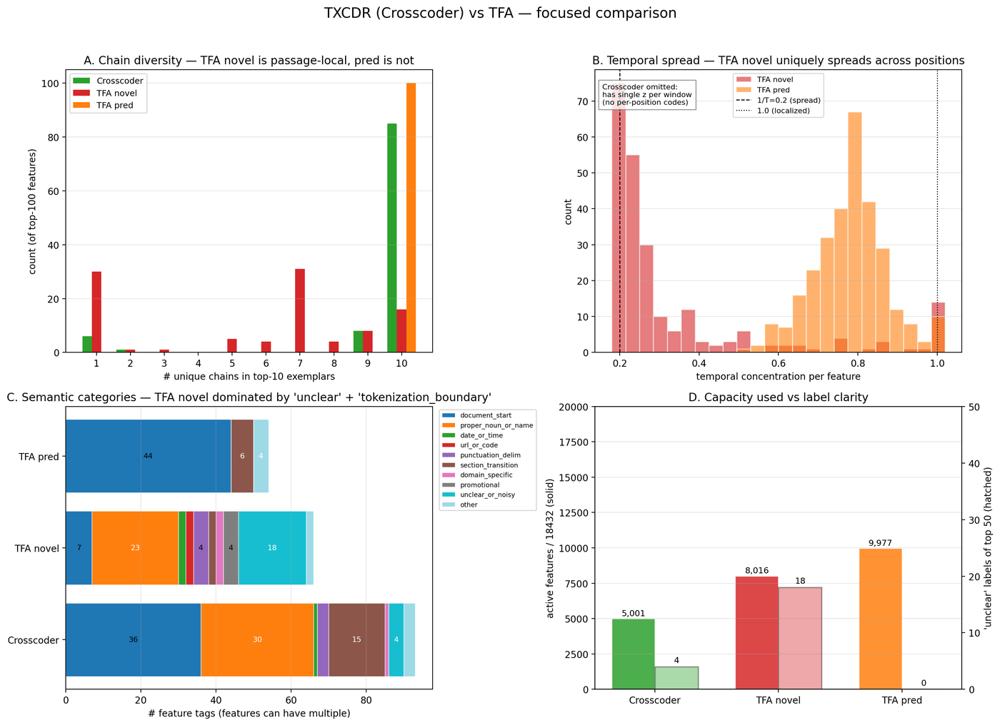
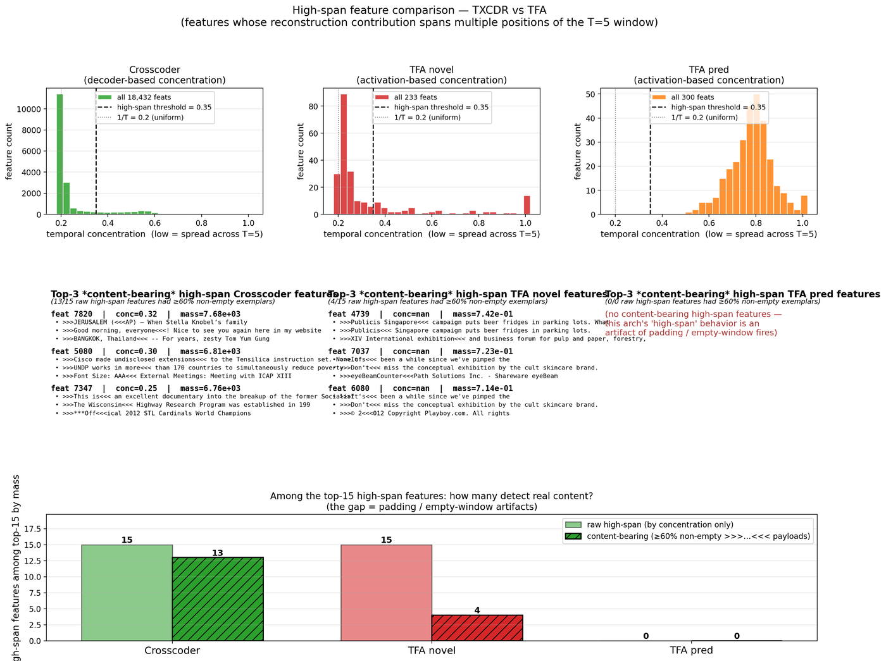

## L13 replication — does the L25 autointerp story hold at a mid-layer?

Companion to `2026-04-17-autointerp-initial.md` (the L25 story) and
`2026-04-17-neurips-gap.md` (the reviewer-gap doc, which flags
"single-layer" as the #1 blocker). Trained Stacked + Crosscoder +
TFA-pos at k=50 on cached `resid_L13` activations on Gemma-2-2B-IT,
then re-ran the full autointerp pipeline against L13.

Pipeline: `scripts/run_l13_replication.sh`.
Training runtimes on A40: TFA-pos 6644s, Stacked 3586s, TXCDR 3041s
(= 3h 39m total).

## TL;DR

- The **cross-arch orthogonality** claim replicates cleanly at L13.
  Content-based Jaccard remains near zero for every cross-arch pair
  (no pair with any feature at J ≥ 0.3). This strengthens the central
  "three archs find disjoint feature libraries" finding.
- The **disjoint TFA novel / pred partition** replicates.
- **TFA-pos reconstructs much worse at L13 than at L25**: NMSE 0.957
  vs 0.125. TFA-pos at L13 essentially failed to train. Any
  feature-level claim about "L13 TFA novel" must be read with that
  context — the features exist but the model does not faithfully
  reconstruct the activations.
- The L25 headline "TXCDR crushes TFA novel on high-span content
  (14/15 vs 1/15)" **does not replicate cleanly at L13**. At L13 the
  gap is 13/15 vs 4/15 — still a real advantage for Crosscoder, but
  substantially narrower.
- The L25 "TFA novel is 78 % unclear at top-50" result also does not
  replicate. At L13 TFA novel is 36 % unclear at top-50 (29/50
  labeled, 3/50 tokenization-boundary). TFA novel at L13 is far more
  interpretable than at L25.

## Headline comparison table

| metric | L25 | L13 |
|---|---:|---:|
| NMSE Stacked k=50 | 0.059 | 0.138 |
| NMSE Crosscoder k=50 | 0.077 | 0.155 |
| **NMSE TFA-pos k=50** | **0.125** | **0.957** |
| Alive fraction — Crosscoder | 16.1 % | 27.1 % |
| Alive fraction — Stacked | 86.4 % | 73.3 % |
| Alive fraction — TFA novel | 85.0 % | 43.5 % |
| Alive fraction — TFA pred | 42.3 % | 54.1 % |
| Chain diversity — TFA novel top-100 (median) | 1 | 7 |
| All-same-chain / 100 — TFA novel | 55 | 30 |
| High-span content-bearing — Crosscoder | 14 / 15 | 13 / 15 |
| **High-span content-bearing — TFA novel** | **1 / 15** | **4 / 15** |
| Top-50 Haiku labeled — Crosscoder | 42 / 50 | 42 / 50 |
| **Top-50 Haiku unclear — TFA novel** | **39 / 50** | **18 / 50** |
| Top-50 Haiku labeled — TFA pred | 38 / 50 | 49 / 50 |
| Cross-arch content Jaccard (any pair, ≥ 0.3) | 0 | 0 |

## Figures

## What replicates, what doesn't

### Replicates cleanly

- **Disjoint novel / pred partition.** TFA novel and TFA pred remain
  disjoint libraries at L13. Alive-fraction of pred (54 %) and novel
  (44 %) still barely overlap; hero-figure panel C shows TFA pred's
  semantic distribution is close to Stacked / Crosscoder while TFA
  novel's is different.
- **Cross-arch orthogonality.** Content-based Jaccard at L13:

  | src → tgt | mean best J | ≥ 0.1 | ≥ 0.3 |
  |---|---:|---:|---:|
  | crosscoder → stacked_sae | 0.006 | 0 | 0 |
  | crosscoder → tfa_pos | 0.003 | 1 | 0 |
  | tfa_pos → crosscoder | 0.009 | 1 | 0 |
  | tfa_pos → tfa_pos_pred | 0.000 | 0 | 0 |

  (Full table in `content_match__resid_L13__k50.json`.) The claim
  "the three archs find disjoint feature libraries" holds under the
  weight-space-invariant Jaccard metric at both layers.
- **TXCDR still wins on high-span content, but by less.** 13/15 vs
  4/15 is real but not the 14× margin the L25 figure suggested.

### Does not replicate

- **"TFA novel is mostly passage-local padding."** At L13, TFA novel's
  median chain diversity is 7, not 1; its unclear rate at top-50 is
  36 %, not 78 %; its high-span content-bearing count is 4/15, not
  1/15. The "TFA novel = padding artifacts" framing is a
  **layer-specific L25 phenomenon**, not a property of TFA-pos as an
  architecture.

  The hero-figure panel A at L13 still shows a residual
  passage-locality peak (30/100 all-same-chain), so it's not
  *absent* — but it's roughly half the effect.

### New at L13

- **TFA-pos training instability is layer-dependent.** NMSE 0.957 is
  close to "reconstructs nothing" (NMSE 1.0 = predicting the mean).
  The same recipe that got 0.125 at L25 failed at L13. Hypotheses
  (not tested here):
    - L13 activations are ≈10× larger in norm than L25 (residual
      stream grows through the network). TFA's `lam = 1/(4 d_in)`
      scaling may interact differently with larger-norm inputs.
    - L13 has substantially more capacity-relevant variance per
      token (earlier layers are still representing surface form);
      the sparse-attention prediction head may be finding a shortcut
      that is rewarded by the loss but doesn't reconstruct.

  This is **additional evidence for the NeurIPS-gap doc's Reviewer
  #2 concern**: the "TFA under-trained" framing is understated — TFA
  doesn't just under-train at L25, it fails to train at L13 with the
  same recipe. A paper comparison needs to either (a) fix the recipe
  or (b) report TFA at NMSE-matched parity, not at the as-trained
  operating point.

- **Crosscoder gets denser at L13.** Alive fraction climbs from 16 %
  (L25) to 27 % (L13), suggesting Crosscoder allocates more features
  to early-layer representations. Still well below Stacked's 73 % at
  L13. The "tight core" characterization is layer-specific; the
  relative ordering (Crosscoder < TFA pred < Stacked < TFA novel) is
  the same at both layers.

## Implication for the NeurIPS gap doc

The L13 replication changes the gap analysis in three specific ways:

1. **Blocker #1 (single layer) is partially closed** for the
   cross-arch orthogonality and disjoint novel/pred findings — both
   replicate. It is **newly opened** for the "TFA novel is padding
   artifacts" narrative — that's layer-specific to L25.
2. **Blocker #2 (TFA under-training) is larger than estimated.** TFA
   doesn't just under-train at L25; it fails to train at L13. Either
   retrain with a better recipe or report at matched NMSE.
3. **The interpretability-vs-capacity story at L13 is cleaner.**
   TFA pred at L13 has 49/50 labeled top-50 features (vs Crosscoder's
   42/50), which is the **opposite** ordering from L25. If the story
   is "TFA pred is indistinguishable from Stacked, TFA novel is
   distinct", L13 evidence makes it clear that the TFA two-library
   structure is the persistent architectural signature — not the
   specific "novel = padding" pathology of L25.

## Artifacts (committed)

- Training: `results/nlp_sweep/gemma/results_gemma-2-2b-it__fineweb__resid_L13.json`
- Ckpts: `results/nlp_sweep/gemma/ckpts/*__resid_L13__k50__seed42.pt`
- Scans / tspread / labels / high_span / content_match: all at
  `results/nlp_sweep/gemma/scans/*__resid_L13__k50.json`.
- Figures: `results/nlp_sweep/gemma/figures/*_L13.{png,doc.png,thumb.png}`
- Pipeline script: `scripts/run_l13_replication.sh` (usable with
  `SKIP_TRAINING=1` to re-run analysis only).

## Next-step suggestions

- **Retrain TFA-pos at L13 with a stability patch**: drop LR to 1e-4,
  5k warmup, test whether NMSE 0.12 is achievable. If yes, re-run
  the L13 feature analysis and compare.
- **Second seed at L25 k=50** for all three arches to answer
  "is TFA novel's L25 padding-fire an ARCH property or a seed
  accident?" That's a 3-5 h training run and would close the
  single-seed reviewer attack.
- **DeepSeek** remains the #2 extension — but given L13 now shows
  TFA's recipe is layer-fragile, I'd move retraining ahead of adding
  a new model.
