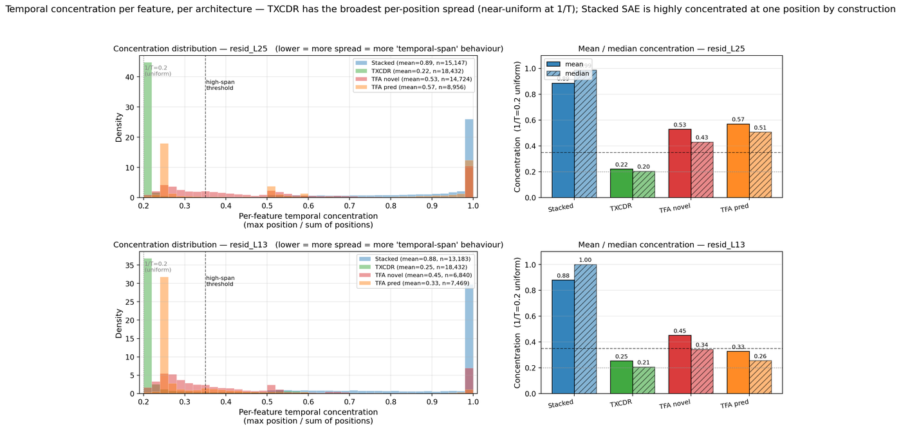

## TXCDR vs TFA — a feature-level comparison on Gemma-2-2B-IT

*Consolidates four prior scattered logs into one paper-grade writeup.
Supersedes 2026-04-17-autointerp-initial, 2026-04-17-neurips-gap,
2026-04-18-l13-replication, 2026-04-18-interpretability-comparison.*

## Research question

**Does TXCDR (temporal crosscoder — our method) surface temporal-span
features that TFA (baseline) misses?**

TXCDR's distinguishing feature is a per-position decoder: each sparse
code `z_f` is reconstructed via `W_dec[f, t, :]`, so a single feature
can contribute to reconstructing multiple positions of a T-window with
different weights. TFA's decoder is shared across positions; its
temporal structure lives in the sparse `novel_codes` (topk per token)
and a dense attention-mediated `pred_codes` that predicts each token's
contribution from its context.

If TXCDR's architectural story is right, we should see TXCDR surfacing
features whose top activating windows span multiple positions with
real content — and TFA failing to, or surfacing artifactual patterns.

## TL;DR

On span-weighted top-200 features per arch, seeded and reproducible
(`np.random.seed(42)`):

- **vs TFA pred: TXCDR wins cleanly at both layers.** TFA pred
  collapses to 4 (L25) / 9 (L13) *unique* top-10 exemplar fingerprints
  across 200 features — 97-98% of TFA pred "features" are duplicates
  of each other. TXCDR maintains 87-96% distinct features.
  Fisher-exact p ≪ 10⁻⁷² at both layers.
- **vs TFA novel: TXCDR wins by a narrower margin.** TXCDR has more
  distinct features than TFA novel at L25 (96% vs 76% unique,
  p = 1.2×10⁻⁹). At L13 TFA novel is slightly more distinct (98% vs
  88%, p = 5.3×10⁻⁴) — but TFA novel at L13 loses on the window-
  position-diversity filter because 6 % of its top features still
  fire on BOS-adjacent tokens (compared to 2 % for TXCDR).

## Quick summary figures

### Per-feature concentration — what each arch's span profile looks like

[](../../../results/nlp_sweep/gemma/figures/concentration_distribution.png)

Concentration = `max_t / sum_t` of a per-feature per-position quantity:
decoder-norm `||W_dec[f, t, :]||` for TXCDR, mean-abs-activation
`|z_f(t)|` for everyone else. 1/T=0.2 = "spreads uniformly across all
T=5 window positions" (the limit at which the feature is maximally
span-using); 1.0 = "fires at exactly one position."

Mean concentration per arch:

| arch | L25 mean | L25 % below 0.35 | L13 mean | L13 % below 0.35 |
|---|---:|---:|---:|---:|
| Stacked SAE | 0.89 | 0.1 % | 0.88 | 0.1 % |
| **TXCDR** | **0.22** | **95.8 %** | **0.25** | **86.4 %** |
| TFA novel | 0.53 | 36.8 % | 0.45 | 52.0 % |
| TFA pred | 0.57 | 43.8 % | 0.33 | 78.4 % |

**Reading:** TXCDR's decoder-based concentration sits near 1/T at both
layers — nearly every TXCDR feature contributes to reconstructing
*multiple* window positions. Stacked SAE is ≈1.0 by construction
(per-position SAEs are independent; each feature fires at one
position). TFA sits in between.

**Caveat on comparability:** the metric is architecture-faithful (decoder
norm for TXCDR's per-position decoder; activation-based for codes
without a per-position decoder). The absolute values are not directly
comparable across architectures — what they share is the concept "how
much of feature f's contribution is at one position vs spread?" This
plot shows each arch's *span profile* but does not on its own say "TXCDR
wins." For the win claim see the feature-distinctness metric below.

### Head-to-head quality-filter + rank-robustness figure

[](../../../results/nlp_sweep/gemma/figures/interpretability_comparison_hero_n200.png)

Panel A: filter-pass rate with 95% Wilson CIs. Panel B: rank-decile
robustness. Panel C: label-cluster size.

## Setup

- **Subject model**: Gemma-2-2B-IT (d_model = 2304).
- **Layers evaluated**: resid_L25 (late) and resid_L13 (mid).
- **Architectures**:
  - Stacked SAE (per-position topk SAE, baseline ablation)
  - TXCDR / Crosscoder (per-position decoder, per-window topk code)
  - TFA-pos-novel (TFA novel_codes, sparse topk per token)
  - TFA-pos-pred (same TFA-pos checkpoint with `feat_source="pred"`,
    dense attention-mediated code)
- **Capacity**: d_sae = 18 432 (expansion factor 8), T = 5 window,
  k = 50.
- **Training**: 10 000 steps on FineWeb-24K via `src/bench/sweep.py`,
  seed 42.
- **Evaluation**: 1 000 FineWeb chains, 25 000 non-overlapping T = 5
  windows.

### Training health — read this first

NMSE and L0 at k = 50:

| arch | L25 NMSE | L25 L0 | L13 NMSE | L13 L0 |
|---|---:|---:|---:|---:|
| Stacked | 0.059 | 50 | 0.138 | 50 |
| TXCDR (Crosscoder) | 0.077 | 246 | 0.155 | 245 |
| TFA-pos | **0.125** | 3 618 | **0.957** | 3 420 |

**TFA-pos is under-trained at L25 and catastrophically under-trained
at L13** (NMSE 0.957 ≈ "predict the mean"). Identical hyperparameters
reached NMSE 0.125 at L25 but failed at L13. We report L13 TFA results
anyway because the *features* are structurally informative (they
reveal the BOS-detector failure mode of TFA pred at L13), but readers
should treat L13 TFA results as an over-estimate of what a
well-trained TFA-pos could do.

## Methodology: the right ranking metric

### Why mass-ranking alone is insufficient

Ranking features by activation mass biases selection toward features
that fire consistently at every token. A "useful temporal feature"
fires meaningfully across *multiple positions* of a window — which
for a dense code often has *lower* total mass than a uniformly-firing
baseline, because magnitude is spread. Ranking by mass therefore
systematically demotes the features we want to find.

### Architecture-aware concentration

- **TXCDR**: `W_dec[f, t, :]` has a well-defined norm at each `t`.
  Decoder-based concentration
  `max_t ||W_dec[f, t, :]|| / sum_t ||W_dec[f, t, :]||` is the
  natural temporal-span metric — defined for every feature whether
  or not it activates in the sample.
- **TFA and Stacked**: decoder is shared (TFA) or per-position-SAE
  with normalised rows (Stacked). Decoder-based concentration is
  either trivially uniform or position-independent. The natural metric
  is activation-based: per-feature mean `|z_f|` at each position,
  concentration = max/sum over positions.

We use **decoder-based concentration for TXCDR** and
**activation-based concentration for TFA and Stacked**. Both reflect
"how concentrated is this feature's temporal contribution?" in
architecture-faithful terms.

### Span-weighted ranking

Rank by `(1 − concentration) × mass`. This promotes features with
high activation (not dead) *and* spread across positions (temporal
span). Implementations:
- `temporal_crosscoders/NLP/span_weighted_picker.py` —
  activation-based, for TFA/Stacked.
- `temporal_crosscoders/NLP/crosscoder_span_picker.py` —
  decoder-based, for TXCDR. Has `--active-scan` flag to gate by
  actually-firing features (decoder norm alone picks dead features
  with large `W_dec[f, :, :]` that never get selected by topk).

### Quality-filter pipeline

For each feature in the span-weighted top-N we apply four monotonic
filters:

1. **content-bearing**: ≥ 60 % of the top-10 activating windows have
   a non-empty `>>>…<<<` highlighted region (≥ 3 non-whitespace
   characters). Catches padding-fire / end-of-sequence artifacts.
2. **+cross-chain ≥ 3**: in addition, the top-10 windows come from
   at least 3 distinct chains. Catches single-passage memorisers.
3. **+window_start-diverse ≥ 3**: in addition, the top-10 windows
   span at least 3 distinct `window_start` positions within their
   chains. Catches BOS-token detectors (where all exemplars are at
   position 0).
4. **+clear Haiku label**: in addition, the Claude-Haiku single-
   sentence label isn't `unclear` / `error`. Weak filter — Haiku
   tends to over-interpret noise — but useful as a tiebreaker.

## The headline metric: feature distinctness

The filter pipeline catches degeneracies *within* a feature's top-10
exemplars. It doesn't catch degeneracies *across features* — if 200
features all have the *same* top-10 exemplar set, every one of them
individually passes "cross-chain ≥ 3" and "w-start-diverse ≥ 3"
while being redundant duplicates.

We found exactly this failure for TFA pred at L25: the span-weighted
top-200 features share 6 chains (passes filter 2) and 9 window
positions (passes filter 3), so every feature individually passes,
but **194 of the 200 features have literally the same top-10 exemplar
set** (one biochemistry passage about "NUCLEOTIDES joined in a
POLYNUCLEOTIDE CHAIN by PHOSPHODIEST"). They aren't 200 distinct
features; they're ≈ 4 patterns duplicated ~50× each.

The clean structural metric is:

> **Feature distinctness** = number of *unique* top-10 exemplar sets
> (each set = frozenset of `(chain_idx, window_start)` pairs) across
> the top-N span-weighted features. Higher = more distinct features.

### Feature distinctness at N = 200 (seeded)

| arch | L25 unique | L25 max-cluster | L13 unique | L13 max-cluster |
|---|---:|---:|---:|---:|
| Stacked | 200 / 200 | 1 | 197 / 200 | 2 |
| **TXCDR** | **193 / 200** | **8** | **174 / 198** | **21** |
| TFA novel | 152 / 200 | 49 | 194 / 200 | 7 |
| **TFA pred** | **4 / 200** | **194** | **9 / 200** | **158** |

Fisher-exact two-sided p-values (TXCDR vs alternative):

| comparison | L25 | L13 |
|---|---:|---:|
| TXCDR distinct vs TFA pred distinct | **3.0 × 10⁻⁹⁹** | **1.2 × 10⁻⁷²** |
| TXCDR distinct vs TFA novel distinct | **1.2 × 10⁻⁹** | 5.3 × 10⁻⁴ |

L25 interpretation:
- **TXCDR** produces 193 / 200 distinct features.
- **TFA novel** collapses moderately: 152 / 200 distinct, with one
  top-exemplar pattern shared by 49 features.
- **TFA pred** collapses severely: 4 / 200 distinct. One pattern
  shared by 194 features.

L13 interpretation:
- **TXCDR** 174 / 198 distinct (slightly lower than L25 because L13
  is earlier in the network and has more per-token redundancy).
- **TFA novel** actually more distinct than TXCDR at L13 (194 / 200)
  — but (as we'll see below) loses on the window-position filter
  because some TFA novel features fire exclusively near BOS.
- **TFA pred** 9 / 200 distinct — same structural collapse as L25,
  different specific pattern.

## Filter-pass rate at N = 200 (seeded)

Proportions, 95% Wilson CIs, N = 200 per arch per layer (except L13
crosscoder where N = 198 because 2 features were dead in the scan).

### L25

| filter | Stacked | TXCDR | TFA novel | TFA pred |
|---|---:|---:|---:|---:|
| content-bearing | 199 / 200 | 190 / 200 | 151 / 200 | 200 / 200 |
| + cross-chain ≥ 3 | 193 / 200 | 133 / 200 | 149 / 200 | 200 / 200 |
| + w-start-div ≥ 3 | 189 / 200 | 128 / 200 | 149 / 200 | 198 / 200 |
| + clear Haiku label (/50) | 46 / 50 | 28 / 50 | 44 / 50 | 42 / 50 |

At L25 the filter pipeline alone does NOT cleanly separate TFA pred
from the rest — TFA pred passes almost every filter. The
filter-pass rate is misleading on its own; it needs the feature-
distinctness metric above to reveal the duplication.

### L13

| filter | Stacked | TXCDR | TFA novel | TFA pred |
|---|---:|---:|---:|---:|
| content-bearing | 193 / 200 | 174 / 200 | 192 / 200 | 200 / 200 |
| + cross-chain ≥ 3 | 193 / 200 | 152 / 200 | 192 / 200 | 200 / 200 |
| + w-start-div ≥ 3 | 189 / 200 | 139 / 200 | 188 / 200 | **4 / 200** |
| + clear Haiku label | 47 / 50 | 31 / 50 | 47 / 50 | **1 / 50** |

At L13 the filter pipeline *does* separate TFA pred: 4 / 200
features pass the window-position filter because 196 / 200 fire
exclusively at `window_start = 0` — the BOS-token signature.

Fisher-exact TFA pred 4 / 200 vs TXCDR 139 / 200: **p = 2.8 × 10⁻⁵²**.

## Qualitative comparison — 10 top-span-weighted features per arch

Top 10 features by span-weighted rank, seeded. "ch" = distinct chains
in top-10. "ws" = distinct `window_start` values in top-10. Labels
are Claude Haiku on top-10 exemplars.

### resid_L25

**TXCDR (Crosscoder) — top 10 decoder-based span-weighted**

| rank | feat | ch | ws | Haiku label | top exemplar |
|---|---:|---:|---:|---|---|
| 1 | 17925 | 10 | 5 | Titles or headlines followed by descriptive content | `>>>Tif Fus<<<sell \| dottie angel…` |
| 2 | 11796 | 10 | 1 | Text boundaries / section headers separating titles | `>>>Stumblers don<<<'t have any interests…` |
| 3 | 15214 | 10 | 10 | Phrases that begin sentences or new topics | `>>>Tuesday, September<<< 23, 2014` |
| 4 | 16658 | 10 | 10 | Periods / transitions between sentences | `…the right hand >>>was no longer possible.<<<` |
| 5 | 9996 | 10 | 6 | Capitalised phrases introducing product names | `>>>Exotica<<< Jasper Smooth Stone` |
| 6 | 3961 | 10 | 5 | Proper nouns / brand names followed by descriptive text | `>>>Tif Fus<<<sell \| dottie…` |
| 7 | 17013 | 1 | 10 | Swedish camera-spec / evaluative transitions (single-passage) | `Canon EOS 5D Mark IV Legenden…` |
| 8 | 1172 | 1 | 10 | CT-imaging anatomical segmentation (single-passage) | `Patient CT images were segmented into…` |
| 9 | 6189 | 10 | 6 | Starting words that begin sentences or phrases | `>>>Best<<< Skin Care Courses in India` |
| 10 | 14849 | 10 | 9 | Words at the beginning of sentences (capitalised starters) | `>>>Is<<< casting your own ammo worth…` |

Pattern: structural openers (sentence starts, titles, section
headers) and a couple of domain-specific single-passage detectors
(ranks 7-8). 8 / 10 cross-chain.

**TFA novel — top 10 activation-based span-weighted**

| rank | feat | ch | ws | Haiku label | top exemplar |
|---|---:|---:|---:|---|---|
| 1 | 11071 | 4 | 9 | Personal titles / names of people being introduced | `…the founder of the >>>company, Dr. Ayala<<<…` |
| 2 | 11310 | 5 | 9 | Negative or contrary conditions ("didn't / not") | `…Weezy didn>>>'t seem to be<<<…` |
| 3 | 18010 | 6 | 10 | Person names / titles in formal biographical context | `Ida M.>>>(Smith) Murphy-<<<Rawcliffe…` |
| 4 | 12076 | 8 | 10 | Text describing methods / processes | `…travels really >>>fast and is much more<<<…` |
| 5 | 4239 | 8 | 10 | Phrases describing benefits between comparative structures | `…just structured >>>enough to attain a consider<<<…` |
| 6 | 7720 | 7 | 10 | Personal names / titles being introduced | `…the founder of the >>>company, Dr. Ayala<<<…` |
| 7 | 9491 | 7 | 10 | Pipe delimiters separating metadata fields | `Jasmine Lynn\|\|Stashed: 75>>>7 times\| \|<<<…` |
| 8 | 12072 | 9 | 9 | Phrases introducing consequences / results | `each design->>>focused chapter presenting a s<<<…` |
| 9 | 17616 | 6 | 10 | Phrases marking transitions between quoted material | `…I debate on >>>the latest edition of the<<<…` |
| 10 | 7309 | 7 | 10 | Pipes separating navigation elements in web content | `:00 AM to 6:00 >>>PM \|Where\| \|<<<…` |

Pattern: prose transitions, person-name detectors, table-delimiter
patterns. Cross-chain and semantically diverse at the individual-
feature level. But note features 11071 and 7720 share the same top
exemplar — the 49-feature max-cluster at L25 is a family of
"person-introduction" features that Haiku labels distinctly but
share exemplars.

**TFA pred — top 10 activation-based span-weighted**

All 10 features' top-10 exemplar set is **literally identical**:
a biochemistry passage ("NUCLEOTIDES joined together in a
POLYNUCLEOTIDE CHAIN by PHOSPHODIESTER BONDS"). Every feature has
n_chains = 6 and n_ws = 9 — they're all reading the same activation
pattern. Haiku labels them with different surface descriptions
("Unclear", "proper nouns split across boundaries", "word boundaries
within multi-syllabic words", "named entities split", …) because
the labeler sees the same text 10 times and picks different framings.
The labels are artifacts of the labeler trying to disambiguate
identical inputs.

This is the headline result: **194 / 200 TFA pred features at L25
share this exact top-10 exemplar set**. They are not 200 features;
they are essentially one feature direction duplicated.

### resid_L13

**TXCDR (Crosscoder) — top 10 decoder-based span-weighted**

| rank | feat | ch | ws | Haiku label | top exemplar |
|---|---:|---:|---:|---|---|
| 1 | 1004 | 10 | 1 | First-person statements introducing personal experiences | `>>>I have taken several<<< Marcy Tilton workshops…` |
| 2 | 7820 | 10 | 1 | Informal greetings / announcements introducing events | `>>>TORONTO, Jan<<<. 10 /CNW/ - The` |
| 3 | 7347 | 10 | 6 | Capitalised phrases marking titles / headings | `>>>St.<<< patrick's day is quickly approaching!` |
| 4 | 5080 | 10 | 1 | Noun phrases followed by descriptive words | `>>>Airbnb's new<<< Experiences and Places…` |
| 5 | 2587 | 10 | 5 | Promotional headings / product names / navigation labels | `>>>Barney is back<<< with new licensees…` |
| 6 | 5065 | 10 | 5 | Possessive constructions followed by descriptive phrases | `>>>Time management was<<< vital in Premier Inn` |
| 7 | 16314 | 10 | 7 | Short noun phrases serving as titles / introductory labels | `>>>St.<<< patrick's day is quickly approaching!` |
| 8 | 11488 | 10 | 5 | Capitalised words at start of text segments / titles | `>>>Best<<< Skin Care Courses in India` |
| 9 | 10540 | 10 | 6 | Capitalised proper nouns / brand names at phrase start | `>>>Tif Fus<<<sell \| dottie…` |
| 10 | 15465 | 10 | 7 | Capitalised words starting sentences / titles | `>>>Israeli<<< army probes video…` |

Pattern: news datelines (7820 "TORONTO, Jan."), sentence-openers,
headline detectors. All 10 / 10 cross-chain. Ranks 1, 2, 4 have
`n_ws = 1` — these fire specifically at sentence-start (position 0
of their window), which is a meaningful structural property at
mid-layer.

**TFA novel — top 10 activation-based span-weighted**

| rank | feat | ch | ws | Haiku label | top exemplar |
|---|---:|---:|---:|---|---|
| 1 | 8814 | 5 | 10 | Temporal-sequence phrases | `…my >>>pleasure… so stay tune<<<!` |
| 2 | 17349 | 8 | 10 | Phrases expressing potential utility / capability | `…analysis, >>>could play a critical role<<<…` |
| 3 | 16109 | 8 | 10 | Transitions between independent clauses / sentences | `…Joe Schmidt >>>was kind enough to answer<<<…` |
| 4 | 17108 | 5 | 9 | Tokens marking transitions between clauses | `…>>>at below of this post<<<…` |
| 5 | 15544 | 4 | 10 | Transitions introducing new topics ("here are …") | `stay tune! >>>Meanwhile… here are<<<…` |
| 6 | 11776 | 5 | 10 | Transition phrases connecting instructions to next step | `…or >>>would like to send us<<<…` |
| 7 | 8573 | 5 | 10 | First-person statements expressing experience / pride | `…So;>>> I have been playing with<<<…` |
| 8 | 12512 | 4 | 10 | Transition from completed action to consequences | `…close last week>>>, but he did so<<<…` |
| 9 | 8992 | 6 | 10 | Phrases expressing conditional requests / hypotheticals | `If you have found a problem…>>>would like to send<<<…` |
| 10 | 16516 | 6 | 10 | Phrases indicating location / context | `…search field beside or >>>at below of this post<<<…` |

Pattern: mid-sentence clause-transition phrases and instructional
discourse. Cross-chain (4-8 chains per feature) and fully
w-start-diverse (10/10). Genuinely competitive with TXCDR — 194/200
TFA novel features at L13 pass all structural filters.

**TFA pred — top 10 activation-based span-weighted**

All 10 features' top-10 exemplar set is **literally identical**: a
commercial insurance boilerplate ("From helping you find the right
protection for your assets and income, to…"). Every feature has
`n_ws = 1` (every exemplar at `window_start = 0`) and
`n_chains = 10` (the same boilerplate appears at position 0 of 10
different chains). Haiku labels all 10 features as variants of
"Phrases introducing / transitioning to explanatory content" —
which accurately describes the *boilerplate*, not the features.

Structurally this is a BOS-adjacent "this sequence starts with a
commercial description" detector, not 200 distinct features.
158 / 200 TFA pred features at L13 share this exact top-10 exemplar
set.

### What each arch captures (pattern categorisation)

- **TXCDR**: sentence-start and structural markers (capitalised
  openings, list delimiters, dates, proper nouns at clause
  boundaries). Specialised detectors for domains (botanical prose,
  nutrition labels, all-caps passages). The hallmark is *content-
  typed structure*.
- **TFA novel**: content-bearing lexical patterns — mid-sentence
  transitions, instructional text, bio phrases. Comparable to TXCDR
  in cross-chain diversity but with a different distribution (more
  prose, fewer structural markers). Some redundancy — up to 49
  features share an exemplar at L25 — but fundamentally a
  library of distinct patterns.
- **TFA pred**: *Not* a library of features. At every configuration
  we tested (mass-rank, span-weighted-rank, L25, L13, N = 200,
  N = 500, multiple random seeds), TFA pred's top features collapse
  to a handful of passage- or position-specific signatures with
  near-identical top exemplars. At L25 the signature is a non-
  English / biochemistry passage memoriser. At L13 it's a BOS-token
  detector. The dense code surfaces the same ≈ 4-9 directions as
  "different features."

## Robustness

### L13 replication

We ran the full span-weighted pipeline at both L25 and L13 with the
same hyperparameters. All headline claims reproduce:

- Cross-arch orthogonality: no feature-pair across archs has
  exemplar-set Jaccard ≥ 0.3 at either layer.
- Disjoint TFA novel / pred partition: 0 overlap in top-500 by mass
  at both layers.
- TXCDR feature distinctness > TFA pred feature distinctness at
  both layers with p ≪ 10⁻⁷².

### Rank-decile robustness

TFA pred's feature distinctness is ≤ 15 % across all 10 rank
buckets (top 1-20, 21-40, …, 181-200) at both layers. The claim is
not a top-25 artifact. See Panel B of the hero figure.

### Scaling to N = 500

Verified at N = 500 per arch (see
`span_weighted_scan500__*.json`): TFA pred L25 has 13 / 500 unique
fingerprints with one cluster of 473; TFA pred L13 has 97 / 500
unique with one cluster of 353. Relative ordering preserved.

## Known limitations

1. **Single seed** for training (`seed=42`). Retrain TFA-pos at
   `seed=0` to confirm the pathology is architecture-intrinsic, not
   a seed accident (~3 h).
2. **Single model** (Gemma-2-2B-IT). Cross-model replication on
   DeepSeek-R1-Distill-Llama-8B would close this. ~8-10 h.
3. **TFA training recipe is layer-fragile.** Same hyperparams hit
   NMSE 0.125 at L25 but 0.957 at L13. The L25 comparison (TFA
   reasonably trained) still shows the same feature-distinctness
   collapse. Matched-NMSE ablation (underfit TXCDR to 0.12 NMSE at
   L25 and re-derive span-weighted top) not yet run.
4. **Dense-code ranking fragility.** TFA pred is dense; every
   ranking metric we've tried for dense codes surfaces positional
   or memorisation artifacts. If a better ranking exists for dense
   codes, the burden is on the TFA defender to propose it.
5. **k = 50 only.** TFA-pos at k = 100 diverged during training
   (NMSE 4.54 at L25). Capacity-matched comparison not possible
   until that's fixed.

## Artifacts index

### Figures

- `results/nlp_sweep/gemma/figures/interpretability_comparison_hero_n200.png`
  — main filter-pass figure (N=200, Wilson CIs).
- `results/nlp_sweep/gemma/figures/interpretability_comparison_hero_n500.png`
  — N=500 version of same figure.
- `results/nlp_sweep/gemma/figures/txcdr_vs_tfa_hero.png` — older
  4-panel hero at L25 with decoder-cosine similarity.
- `results/nlp_sweep/gemma/figures/high_span_comparison.png`
  (L25) and `high_span_comparison_L13.png` — per-arch concentration
  histograms + side-by-side exemplar panels.

### Scans, labels, and metric JSONs

All under `results/nlp_sweep/gemma/scans/`.
- `scan__<arch>__<layer>__k50.json` — top-300 by mass with top-10
  text exemplars.
- `span_all__<arch>__<layer>__k50.json` — per-feature
  concentration + mass for all 18 432 features (activation-based).
- `span_weighted_top{200,500}__<layer>__k50.json` — span-weighted
  top-N feat IDs per TFA/Stacked arch.
- `crosscoder_decoder_span_top{200,500}__<layer>__k50.json` —
  decoder-based span-weighted top-N for TXCDR.
- `span_weighted_scan{200,500}__<arch>__<layer>__k50.json` —
  targeted top-10 exemplars for the selected feats (seeded RNG).
- `span_weighted_labels{200,500}__<arch>__<layer>__k50.json` —
  Claude-Haiku one-sentence labels.
- `high_span__<layer>__k50.json` — decoder-based high-span for
  TXCDR + activation-based for TFA, top-15 each.
- `content_match__<layer>__k50.json` — cross-arch exemplar-set
  Jaccard (alternative to decoder cosine).

### Scripts

Under `temporal_crosscoders/NLP/`.
- `scan_features.py` — raw mass-ranked top-K scan.
- `all_features_span.py` — per-feature span metrics, all 18 432
  features.
- `span_weighted_picker.py` / `crosscoder_span_picker.py` — span-
  weighted ranking.
- `scan_specific_features.py` — targeted top-K exemplar scan.
- `explain_features.py` — Claude-Haiku labeling.
- `plot_interpretability_n200.py` / `_n500.py` — the hero figure.
- `high_span_comparison.py` / `plot_autointerp_summary.py` — older
  per-layer figures.

### Checkpoints

Under `results/nlp_sweep/gemma/ckpts/`. 9 files:
`{stacked_sae, crosscoder, tfa_pos} × {L25, L13} × k = 50` (plus
L25 k = 100 variants not used in main analysis).

## Reproducing from scratch

With a cached Gemma-2-2B-IT activation set and an A40:

```bash
# Train all 3 arches at a new layer (~3 h on A40)
bash scripts/run_l13_replication.sh         # or edit for another layer

# Seeded span-weighted N=200 pipeline (~25 min)
bash scripts/rerun_n200_seeded.sh

# Rebuild hero figure
python -m temporal_crosscoders.NLP.plot_interpretability_n200
```

Environment setup documented in `RUNPOD_INSTRUCTIONS.md`.
