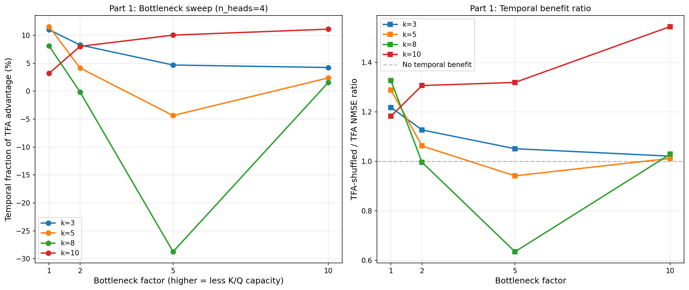
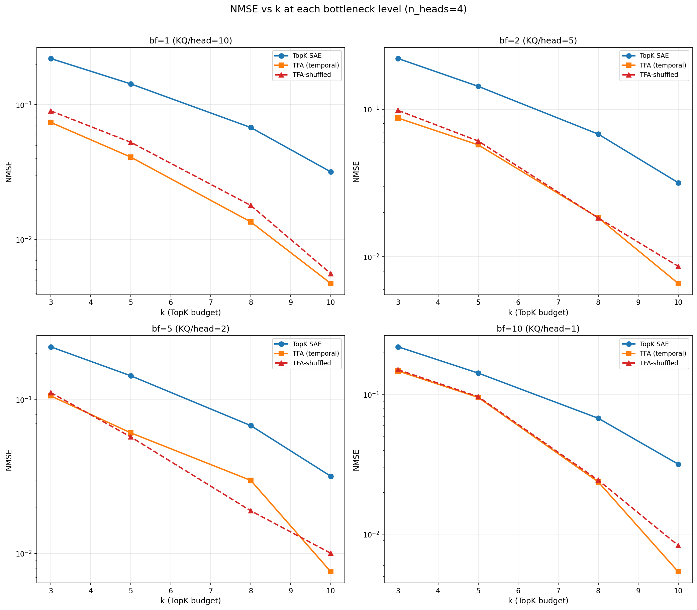
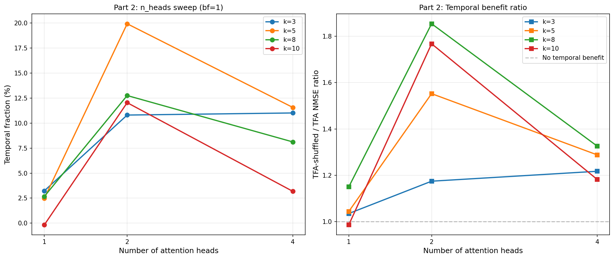

## Objective

Test whether reducing TFA's attention capacity makes temporal correlations more important for reconstruction quality. The v2 shuffle diagnostic (2026-03-04) showed that 88--97% of TFA's NMSE advantage over a standard SAE is architectural capacity, with only 3--12% from temporal structure. This experiment asks: is that ratio stable, or does temporal information become more important when the architecture can't brute-force reconstruction via content matching?

## Hypothesis

At full attention capacity, TFA's predictable component acts as a general-purpose reconstruction channel via content-based retrieval (query-key matching finds similar tokens in context regardless of temporal order). As we bottleneck the K/Q projections, content matching degrades because the attention can only discriminate tokens along fewer dimensions. Temporal prediction --- which could work with simple attention patterns (e.g., attend to recent positions) --- should be less affected. Therefore, the temporal fraction of TFA's advantage should **increase** as the bottleneck increases.

**Result: the hypothesis is rejected.** The temporal fraction generally *decreases* or stays flat as the bottleneck increases (Part 1). However, multi-head diversity turns out to matter more than K/Q capacity for exploiting temporal structure (Part 2).

## Method

### Data

Same synthetic Scheme C setup as the v2 experiments:

- $n = 20$ features, $d = 40$, $\pi = 0.5$ for all features ($\mathbb{E}[L_0] = 10$)
- $\rho$ spread: 4 features each at $\rho \in \{0.0, 0.3, 0.5, 0.7, 0.9\}$
- Sequence length $T = 64$, unit magnitudes
- Input scaled so $\mathbb{E}[\|x\|] = \sqrt{d}$

### Models

All models use dictionary width 40 and TopK sparsity. Swept $k \in \{3, 5, 8, 10\}$ (binding regime).

**TopK SAE** (3,280 params): Standard per-token SAE. Trained once per $k$ (does not depend on attention capacity). Serves as the baseline for computing temporal fraction.

**TFA**: TemporalSAE with causal attention. Trained on temporally ordered sequences.

**TFA-shuffled**: Identical architecture, trained on position-shuffled sequences (no temporal correlations). Evaluated on unshuffled data.

### Part 1: Bottleneck sweep (n_heads=4 fixed)

The `bottleneck_factor` parameter controls the K/Q projection dimension in the attention mechanism: `n_embds = width / bottleneck_factor`. Higher bottleneck = fewer dimensions for attention discrimination, while V/O projections remain full-rank.

| Config | bottleneck_factor | KQ/head | Total params | K/Q params |
| --- | --- | --- | --- | --- |
| nh4_bf1 | 1 | 10 | 8,200 | 3,280 |
| nh4_bf2 | 2 | 5 | 6,560 | 1,640 |
| nh4_bf5 | 5 | 2 | 5,576 | 656 |
| nh4_bf10 | 10 | 1 | 5,248 | 328 |

At `bf=10`, each attention head has a single scalar for K/Q dot product --- the most extreme bottleneck where attention can barely discriminate between tokens.

### Part 2: n_heads sweep (bottleneck_factor=1 fixed)

Varying the number of attention heads while keeping total projection dimensions constant (all configs have 8,200 params). This tests multi-head diversity rather than raw capacity.

| Config | n_heads | KQ/head | Total params |
| --- | --- | --- | --- |
| nh1_bf1 | 1 | 40 | 8,200 |
| nh2_bf1 | 2 | 20 | 8,200 |
| nh4_bf1 | 4 | 10 | 8,200 |

### Metrics

- **NMSE** $= \sum \|x - \hat{x}\|^2 / \sum \|x\|^2$ over 128K tokens (2000 sequences $\times$ 64 positions)
- **Temporal fraction** $= (\text{NMSE}_{\text{shuf}} - \text{NMSE}_{\text{tfa}}) / (\text{NMSE}_{\text{sae}} - \text{NMSE}_{\text{tfa}})$: share of TFA's total advantage attributable to temporal information
- **Shuf/TFA ratio** $= \text{NMSE}_{\text{shuf}} / \text{NMSE}_{\text{tfa}}$: direct measure of temporal benefit ($>1$ means temporal data helps)

### Training

- SAE: 30K steps, batch 4096 tokens, Adam lr 3e-4
- TFA/TFA-shuffled: 30K steps, batch 64 sequences, AdamW lr 1e-3, cosine warmup, grad clip 1.0
- Seed 42 throughout. Single seed (no variance estimates).

Run: `TQDM_DISABLE=1 PYTHONUNBUFFERED=1 python -u src/v2_temporal_schemeC/run_bottleneck_ablation.py`

## Results

### SAE baselines

| k | NMSE | L0 |
| --- | --- | --- |
| 3 | 0.2202 | 3.00 |
| 5 | 0.1428 | 5.00 |
| 8 | 0.0678 | 8.00 |
| 10 | 0.0318 | 10.00 |

These match the original v2 results exactly (same seed).

### Part 1: Bottleneck sweep (n_heads=4)

**Temporal fraction (%):**

| bf | KQ/hd | k=3 | k=5 | k=8 | k=10 |
| --- | --- | --- | --- | --- | --- |
| 1 | 10 | 11.0 | 11.6 | 8.1 | 3.2 |
| 2 | 5 | 8.3 | 4.1 | -0.1 | 8.0 |
| 5 | 2 | 4.7 | -4.4 | -28.7 | 10.0 |
| 10 | 1 | 4.2 | 2.4 | 1.5 | 11.1 |

**Shuf/TFA NMSE ratio** ($>1$ means temporal helps):

| bf | KQ/hd | k=3 | k=5 | k=8 | k=10 |
| --- | --- | --- | --- | --- | --- |
| 1 | 10 | 1.22 | 1.29 | 1.33 | 1.18 |
| 2 | 5 | 1.13 | 1.06 | 1.00 | 1.31 |
| 5 | 2 | 1.05 | 0.94 | 0.64 | 1.32 |
| 10 | 1 | 1.02 | 1.01 | 1.03 | 1.54 |



**Detailed NMSE (SAE / TFA / TFA-shuffled):**

| Config | k=3 | k=5 | k=8 | k=10 |
| --- | --- | --- | --- | --- |
| nh4_bf1 | .2202 / .0740 / .0901 | .1428 / .0409 / .0527 | .0678 / .0135 / .0179 | .0318 / .0047 / .0056 |
| nh4_bf2 | .2202 / .0870 / .0980 | .1428 / .0573 / .0609 | .0678 / .0184 / .0183 | .0318 / .0066 / .0086 |
| nh4_bf5 | .2202 / .1057 / .1111 | .1428 / .0608 / .0572 | .0678 / .0299 / .0189 | .0318 / .0076 / .0100 |
| nh4_bf10 | .2202 / .1478 / .1509 | .1428 / .0956 / .0967 | .0678 / .0237 / .0244 | .0318 / .0054 / .0083 |



### Part 2: n_heads sweep (bf=1)

**Temporal fraction (%):**

| nh | KQ/hd | k=3 | k=5 | k=8 | k=10 |
| --- | --- | --- | --- | --- | --- |
| 1 | 40 | 3.2 | 2.5 | 2.7 | -0.2 |
| 2 | 20 | 10.8 | 19.9 | 12.7 | 12.0 |
| 4 | 10 | 11.0 | 11.6 | 8.1 | 3.2 |

**Shuf/TFA NMSE ratio:**

| nh | KQ/hd | k=3 | k=5 | k=8 | k=10 |
| --- | --- | --- | --- | --- | --- |
| 1 | 40 | 1.04 | 1.04 | 1.15 | 0.99 |
| 2 | 20 | 1.18 | 1.55 | 1.85 | 1.77 |
| 4 | 10 | 1.22 | 1.29 | 1.33 | 1.18 |

**Detailed NMSE:**

| Config | k=3 | k=5 | k=8 | k=10 |
| --- | --- | --- | --- | --- |
| nh1_bf1 | .2202 / .1055 / .1092 | .1428 / .0515 / .0538 | .0678 / .0103 / .0118 | .0318 / .0034 / .0034 |
| nh2_bf1 | .2202 / .0841 / .0988 | .1428 / .0378 / .0587 | .0678 / .0088 / .0163 | .0318 / .0043 / .0076 |
| nh4_bf1 | .2202 / .0740 / .0901 | .1428 / .0409 / .0527 | .0678 / .0135 / .0179 | .0318 / .0047 / .0056 |



## Findings

### 1. The bottleneck hypothesis is wrong (Part 1)

Reducing K/Q capacity does **not** increase the temporal fraction. For k=3 and k=5 (the most constrained binding regime), the temporal fraction monotonically *decreases* from ~11% at bf=1 to ~2--4% at bf=10. At k=8 with bf=5, the temporal fraction goes to **-28.7%** --- TFA trained on shuffled data is dramatically better.

**Why the hypothesis fails.** Content-based retrieval and temporal prediction both degrade together under K/Q bottleneck. With 1-dimensional K/Q per head, the attention can barely distinguish between any tokens, so it can't exploit temporal *or* content patterns. The bottleneck doesn't differentially preserve temporal prediction --- it degrades the entire attention mechanism.

### 2. TFA-shuffled can outperform TFA at bottleneck (Part 1)

At bf=5, k=8: TFA gets NMSE=0.030 while TFA-shuffled gets 0.019 (ratio 0.64). At bf=5, k=5: ratio 0.94. These negative temporal fractions suggest that with limited K/Q capacity, the temporal ordering of context positions actually *confuses* the attention mechanism. When positions are shuffled, the model apparently learns more efficient use of its coarse attention.

### 3. n_heads=2 is the temporal sweet spot (Part 2)

The most surprising result: **2-head attention exploits temporal structure better than 4-head attention.** At n_heads=2, the temporal fraction reaches 12--20% across all k values (vs 3--12% at n_heads=4). At n_heads=1, the temporal fraction collapses to 0--3%.

This is not a capacity effect --- all three configs have identical parameter counts (8,200). The difference is purely structural.

**Interpretation.** With 1 head (40 K/Q dims), the model has high discrimination capacity but no diversity --- it must commit to a single attention pattern per position, and apparently uses it for content matching rather than temporal prediction. With 4 heads (10 K/Q dims each), the model has diversity but each head has limited capacity, and the multi-head combination also tends toward content matching. With 2 heads (20 K/Q dims each), the model may be allocating one head to content and one to temporal, achieving a better balance.

### 4. nh2_bf1 achieves the best raw NMSE (Part 2)

Notably, n_heads=2 achieves the best TFA NMSE at k=5,8,10 across *all* configurations tested:

| k | Best TFA NMSE | Config |
| --- | --- | --- |
| 3 | 0.0740 | nh4_bf1 |
| 5 | 0.0378 | nh2_bf1 |
| 8 | 0.0088 | nh2_bf1 |
| 10 | 0.0034 | nh1_bf1 (nh2 is 0.0043) |

### 5. k=10 behaves differently from smaller k (Part 1)

At k=10 ($= \mathbb{E}[L_0]$), the temporal fraction *increases* with bottleneck (3.2% → 8.0% → 10.0% → 11.1%), the opposite of the k=3,5 trend. Near the boundary where TopK sparsity is no longer binding, the dynamics change --- the TFA advantage over the SAE is small in absolute terms, and the temporal fraction becomes noisier and harder to interpret.

## Synthesis

The original shuffle diagnostic showed TFA's advantage is ~90% architectural capacity. This experiment reveals that this 90/10 split is **not fundamental to TFA's architecture** but rather a property of the specific 4-head, full-rank configuration. The temporal fraction is tunable:

- It can be reduced to near-zero by using 1 head or heavy K/Q bottleneck
- It can be increased to ~20% by using 2 heads at full K/Q rank

This suggests the attention mechanism has enough temporal information available in the data, but the standard 4-head configuration doesn't optimally exploit it. A 2-head configuration appears to enable some form of task specialization (content vs temporal) that extracts more temporal signal.

**Implication for architecture design.** Rather than adding constraints to *prevent* the predictable component from acting as a general reconstruction channel, a more productive direction may be to structure the attention heads to encourage specialization --- e.g., explicit partitioning of heads into "temporal" and "content" roles with different learning objectives.

## Limitations

- **Single seed.** No variance estimates. The k=10 results at different bottleneck levels may be noise.
- **K/Q bottleneck only.** The V/O projections remain full-rank. A more aggressive capacity reduction (bottlenecking V too) might show different behavior.
- **Per-feature correlations only.** The synthetic data has no event-level structure. The head specialization effect may be stronger or weaker with richer correlation structure.
- **No investigation of learned attention patterns.** We hypothesize head specialization at n_heads=2 but haven't verified it by inspecting attention weights.

## Reproduction

```bash
TQDM_DISABLE=1 PYTHONUNBUFFERED=1 python -u src/v2_temporal_schemeC/run_bottleneck_ablation.py
```

Results: `src/v2_temporal_schemeC/results/bottleneck_ablation/`
