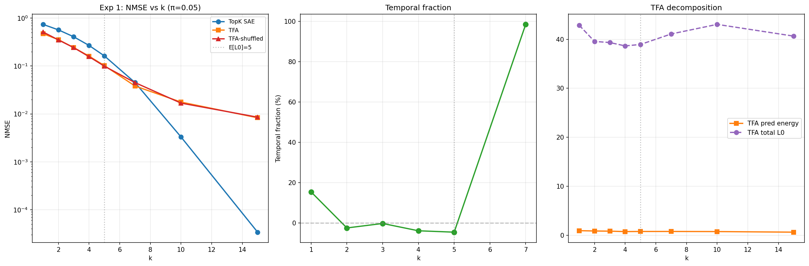
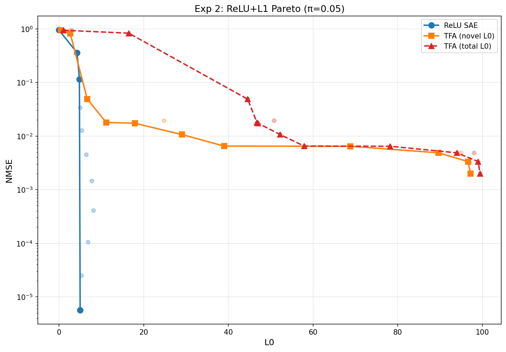
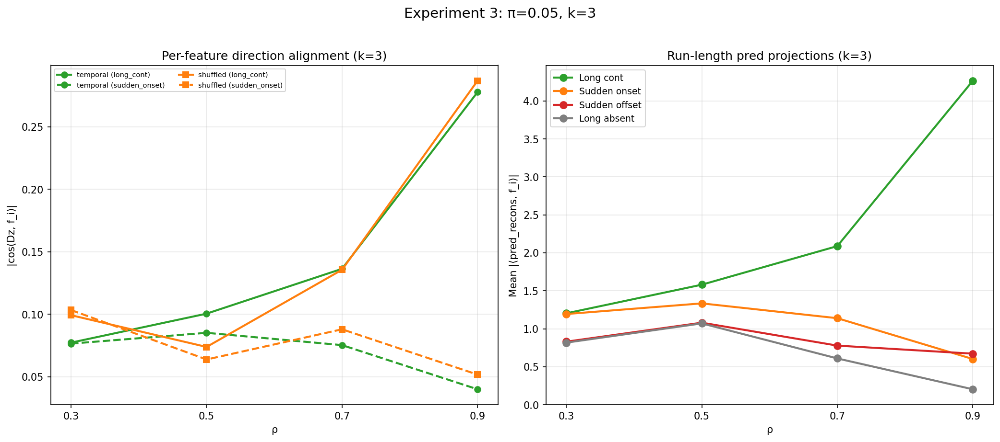

## Objective

Replicate the TFA evaluation (Experiments 1--4 from the $\pi = 0.5$ study) in a low-density regime ($\pi = 0.05$, 100 features) where content-based matching is weak. At $\pi = 0.5$, any two tokens share ~5 features by chance, providing strong content-matching signal that drowns out temporal information. At $\pi = 0.05$, the overlap drops to ~0.25 features, and each feature appears in only ~3/64 context positions. If TFA genuinely exploits temporal structure, this regime should reveal it.

## Motivation

The $\pi = 0.5$ experiments established that:

1. TFA's NMSE advantage over SAE is 88--97% architectural capacity, 3--12% temporal.
2. The attention direction does not encode per-feature temporal history --- long continuation (11111) $\approx$ sudden onset (00001) in per-feature alignment (Experiment 3c).
3. Content-based matching dominates: the shuffled model achieves 74% variance explained from direction quality alone.

However, all of this was measured at $\pi = 0.5$ where content overlap is high. The key prediction: at low $\pi$, content matching weakens, and temporal signal should become visible --- both in the direction analysis and in the shuffle diagnostic's temporal fraction.

## Data

Synthetic data with Scheme C temporal correlations. Parameters:

| Parameter | $\pi = 0.5$ study | $\pi = 0.05$ study | Rationale |
| --- | --- | --- | --- |
| $n$ (features) | 20 | 100 | More features to maintain $\mathbb{E}[L_0]$ |
| $d$ (hidden dim) | 40 | 100 | $d \geq n$ for orthogonal embedding |
| $\pi$ | 0.5 | 0.05 | Low density regime |
| $\mathbb{E}[L_0]$ | 10 | 5 | $n \times \pi$ |
| $\rho$ | {0.0, 0.3, 0.5, 0.7, 0.9} $\times$ 4 | {0.0, 0.3, 0.5, 0.7, 0.9} $\times$ 20 | Same distribution |
| $T$ | 64 | 64 | Same |
| Dict width | 40 | 100 | $1\times$ expansion |

Key statistics at $\pi = 0.05$:

- **Content overlap**: 0.25 features shared between random tokens (vs 5 at $\pi = 0.5$) --- 20$\times$ reduction
- **Feature in context**: ~3.2/63 positions (vs ~32/63 at $\pi = 0.5$) --- 10$\times$ reduction
- **At $\rho = 0.9$**: expected ON run length $\approx 10.5$, expected OFF run length $\approx 200$ (much longer than $T = 64$)

Run: `TQDM_DISABLE=1 PYTHONUNBUFFERED=1 python -u src/v2_temporal_schemeC/run_low_pi_full_suite.py`.

## Experiment 1: TopK sweep + shuffle diagnostic

**Models.** Same architecture as the $\pi = 0.5$ study, scaled up:

- **TopK SAE** (20,200 params): standard per-token SAE, dict width 100.
- **TFA** (~50K params): 4-head causal attention, bottleneck factor 1, tied weights.
- **TFA-shuffled**: identical TFA trained on position-shuffled sequences.
- **TXCDR** ($T$=2): temporal crosscoder with shared latent, dict width 100.
- **TXCDR** ($T$=5): same architecture with 5-token window.

SAE/TFA/TFA-shuffled trained 30K steps; TXCDR trained 80K steps. Evaluated on 128K unshuffled tokens.

**NMSE results:**

| $k$ | TopK SAE | TFA | TFA-shuf | TXCDR ($T$=2) | TXCDR ($T$=5) | TFA/SAE | Temp % |
| --- | --- | --- | --- | --- | --- | --- | --- |
| 1 | 0.741 | 0.473 | 0.514 | 0.765 | 0.799 | 1.57x | 15.3% |
| 2 | 0.569 | 0.356 | 0.351 | 0.617 | 0.697 | 1.60x | -2.5% |
| 3 | 0.408 | 0.243 | 0.242 | 0.499 | 0.630 | 1.68x | -0.3% |
| 5 | 0.163 | 0.102 | 0.099 | 0.353 | 0.554 | 1.59x | -4.6% |
| 7 | 0.045 | 0.038 | 0.045 | 0.291 | 0.516 | 1.18x | 98.5% |
| 10 | 0.003 | 0.018 | 0.017 | 0.256 | 0.493 | 0.19x | --- |
| 15 | 0.00003 | 0.008 | 0.009 | 0.248 | 0.480 | 0.00x | --- |

**Feature recovery AUC:**

| $k$ | TopK SAE | TFA | TFA-shuf | TXCDR ($T$=2) | TXCDR ($T$=5) |
| --- | --- | --- | --- | --- | --- |
| 1 | 0.523 | 0.662 | 0.686 | 0.455 | 0.583 |
| 2 | 0.820 | 0.752 | 0.777 | 0.757 | 0.808 |
| 3 | 0.909 | 0.820 | 0.827 | 0.857 | 0.831 |
| 5 | **0.990** | 0.886 | 0.877 | 0.884 | 0.836 |
| 7 | **0.990** | 0.906 | 0.903 | 0.879 | 0.819 |
| 10 | **0.990** | 0.927 | 0.928 | 0.911 | 0.817 |
| 15 | 0.964 | 0.886 | 0.886 | **0.953** | 0.818 |



**Findings.**

1. **TFA advantage is much smaller at low $\pi$.** TFA achieves only 1.6--1.7$\times$ lower NMSE than the SAE in the binding regime ($k \leq 5$), compared to 3--7$\times$ at $\pi = 0.5$. The attention mechanism has less to work with: with ~0.25 features of overlap between tokens, content-based retrieval captures little information.

2. **SAE dominates above $\mathbb{E}[L_0]$.** At $k \geq 7$, the SAE surpasses TFA --- at $k = 10$, SAE NMSE = 0.003 vs TFA NMSE = 0.018 (SAE is 5$\times$ better). TFA's predictable component becomes counterproductive, adding ~40 dense codes that hurt more than they help. This crossover happens earlier and more sharply than at $\pi = 0.5$.

3. **Temporal fraction is zero or negative at $k \geq 2$.** TFA-shuffled matches or beats temporal TFA. The one exception is $k = 1$ (15.3% temporal) and $k = 7$ (98.5%). The $k = 7$ value is a degenerate case: TFA-shuffled (0.045) $\approx$ SAE (0.045), so the denominator of the temporal fraction (NMSE$_{\text{SAE}}$ $-$ NMSE$_{\text{TFA}}$ = 0.007) is tiny, and even a small TFA advantage (0.038 vs 0.045) gives a large percentage. This does not indicate genuine temporal exploitation --- it means TFA-shuffled provides zero benefit over the SAE at this $k$, not that temporal TFA is exploiting temporal order.

4. **TXCDR is worse than the SAE at every $k$.** TXCDR $T$=2 NMSE is 0.25--0.77 (vs SAE 0.00003--0.74). The shared-latent bottleneck is even more severe at low $\pi$: with $\mathbb{E}[L_0] = 5$, the TXCDR has fewer active features to work with while still needing to explain $T \times d$ values. TXCDR $T$=5 is uniformly worse than $T$=2. Notably, TXCDR NMSE plateaus around 0.25 for $k \geq 10$ (vs SAE near-zero), indicating the bottleneck imposes a hard reconstruction floor.

5. **AUC: SAE dominates feature recovery at low $\pi$.** The SAE achieves AUC = 0.99 at $k \geq 5$ (near-perfect feature recovery), far surpassing all other models. This contrasts sharply with $\pi = 0.5$, where the SAE's AUC peaks at only 0.86 and TXCDR dominates. At low $\pi$, the SAE has enough capacity ($k = 5 = \mathbb{E}[L_0]$) to recover all features without superposition. TXCDR $T$=2 AUC peaks at 0.95 ($k = 15$), while TXCDR $T$=5 plateaus around 0.82 --- the larger window provides no benefit and likely introduces noise into the per-position decoder columns.

## Experiment 2: ReLU+L1 Pareto frontier

Swept $\lambda$ over 15 log-spaced values (ReLU SAE: $10^{-2}$ to $10^{2}$; TFA: $10^{-1}$ to $10^{2.5}$; TXCDR $T$=2: $10^{-1}$ to $10^{2}$).



**Findings.**

1. **The ReLU SAE Pareto frontier strictly dominates TFA on total L0.** At matched total L0, the SAE achieves lower NMSE across the entire range. The SAE frontier drops steeply from NMSE $\approx 0.1$ at L0 $\approx 5$ to NMSE $< 10^{-5}$ at L0 $\approx 5$ (near-perfect reconstruction when L1 is weak enough to allow the true L0).

2. **TFA on novel L0 shows a small advantage at low L0.** At novel L0 $\approx 5$, TFA achieves NMSE $\approx 0.005$--$0.01$ vs SAE NMSE $\approx 0.03$ at the same L0. But this is the familiar "dense channel" effect --- TFA's total L0 is 40--50 at these points.

3. **TFA has a floor of NMSE $\approx 0.002$--$0.005$.** Even with nearly unconstrained novel codes (L1 $= 0.1$, novel L0 $\approx 97$), TFA can't match the SAE's near-zero NMSE. The attention mechanism and proj\_scale introduce some reconstruction error that the SAE avoids.

4. **TXCDR $T$=2 is stuck at NMSE $\approx 0.25$ across all L1 values** (L0 $\approx 6.5$), with AUC $\approx 0.93$. Unlike the $\pi = 0.5$ regime where TXCDR achieved AUC = 0.987, low-$\pi$ TXCDR has good but not exceptional feature recovery while maintaining a hard NMSE floor. The crosscoder's narrow usable L1 range and high NMSE floor are even more pronounced at low $\pi$.

## Experiment 3: Temporal decomposition

### Direction analysis (before proj\_scale)

For each trained TFA (temporal and shuffled), extract the raw attention direction $Dz_{\text{pred}}$ and measure alignment with the specific feature under test.

**Per-feature alignment $|\cos(Dz, \mathbf{f}_i)|$ at $\rho = 0.9$:**

| Condition | $k$ | Long cont | Sudden onset | Ratio |
| --- | --- | --- | --- | --- |
| Temporal | 2 | 0.288 | 0.039 | **7.4x** |
| Shuffled | 2 | 0.297 | 0.039 | **7.6x** |
| Temporal | 3 | 0.278 | 0.040 | **6.9x** |
| Shuffled | 3 | 0.287 | 0.052 | **5.5x** |
| Temporal | 5 | 0.246 | 0.039 | **6.4x** |
| Shuffled | 5 | 0.221 | 0.037 | **6.0x** |

The attention now **strongly distinguishes** long continuations from sudden onsets (6--7$\times$ ratio, vs $\approx 1.0$ at $\pi = 0.5$). But **both temporal and shuffled models show the same ratio**. This is content availability: in the 11111 case, context tokens contain feature $i$ and the attention finds them by content matching. In the 00001 case, context lacks feature $i$ and the attention can't retrieve it.

**Global direction quality ($k = 3$):**

| Condition | $\cos(Dz, x_t)$ | Var explained |
| --- | --- | --- |
| Temporal | -0.868 | 75.6% |
| Shuffled | -0.869 | 75.8% |
| Random | -0.000 | 1.0% | 

Temporal $\approx$ shuffled for global direction quality. The negative cosine indicates the directions are anti-aligned with $x_t$ (an artifact of the learned dictionary orientation), but the magnitude is similar. Both capture ~76% variance explained vs 1% for random.



### Run-length prediction projections (after proj\_scale)

Mean $|\langle \hat{x}_{\text{pred}}, \mathbf{f}_i \rangle|$ at $\rho = 0.9$:

| $k$ | Long cont | Sudden onset | Ratio |
| --- | --- | --- | --- |
| 2 | 4.34 | 0.57 | **7.6x** |
| 3 | 4.27 | 0.60 | **7.1x** |
| 5 | 3.79 | 0.58 | **6.5x** |

At $\rho = 0.5$ the ratios are smaller (1.0--1.2$\times$), consistent with lower temporal persistence.

### Why the ratio is high at low $\pi$ but was 1.0 at high $\pi$

At $\pi = 0.5$: feature $i$ is active at ~32/63 context positions regardless of the recent history. Even in the 00001 case, the context is saturated with tokens containing feature $i$, so the attention always finds it. The 5 recent positions being ON or OFF barely perturbs the pool.

At $\pi = 0.05$: feature $i$ is active at only ~3/63 context positions. In the 11111 case, the recent positions are guaranteed to have feature $i$, making up most of the ~3 total context occurrences. In the 00001 case, the recent 5 positions do NOT have feature $i$, and the remaining context may have 0--2 tokens with it. The attention's content matching genuinely succeeds in one case and fails in the other.

This is a **content availability** effect, not a temporal prediction effect. The attention doesn't learn "features that were recently ON will persist" --- it learns "find tokens in context that share features with the current token." The shuffled model achieves the same ratio because content matching does not require temporal order.

## Synthesis

### TFA is a content-retrieval system, not a temporal predictor

Across both $\pi$ regimes, TFA's predictable component operates via content-based retrieval in the attention context:

1. The query (from $x_t$) matches keys (from context tokens) based on shared features.
2. The attention retrieves value vectors from matching tokens.
3. proj\_scale adapts the magnitude to match $x_t$.

This mechanism provides reconstruction benefit (the "dense channel") without requiring temporal order. The shuffle diagnostic confirms this: TFA-shuffled matches temporal TFA at every $k \geq 2$ in the low-$\pi$ regime.

The difference between regimes is **content availability**:

| Metric | $\pi = 0.5$ | $\pi = 0.05$ |
| --- | --- | --- |
| Content overlap between tokens | 5 features | 0.25 features |
| Feature $i$ in context | 32/63 positions | 3.2/63 positions |
| Long/sudden pred ratio ($\rho = 0.9$) | $\approx 1.0$ | $\approx 7\times$ |
| Long/sudden ratio (shuffled model) | $\approx 1.0$ | $\approx 5.5$--$7.5\times$ |
| Temporal fraction (binding regime) | 3--12% | $\leq 0\%$ |
| TFA vs SAE advantage (binding regime) | 3--7$\times$ | 1.6--1.7$\times$ |
| TFA vs SAE (above $\mathbb{E}[L_0]$) | SAE wins at $k > 12$ | SAE wins at $k \geq 7$ |
| TXCDR $T$=2 best AUC | **0.987** (dominates) | 0.953 (SAE dominates) |
| TXCDR NMSE floor | 0.003 | 0.248 |

At high $\pi$, every feature is everywhere in context, so content matching always succeeds --- giving a large TFA advantage but no temporal discrimination. At low $\pi$, features are scarce in context, so content matching only succeeds when the feature was recently active --- giving temporal discrimination but no temporal *advantage* (shuffled data has the same effect).

### The small temporal fraction at $\pi = 0.5$ was likely a training distribution effect

At $\pi = 0.5$, the 3--12% temporal fraction suggested a small but consistent temporal benefit. At $\pi = 0.05$, this fraction drops to $\leq 0\%$. This is consistent with the $\pi = 0.5$ temporal fraction being a training distribution mismatch (TFA trained on temporal data and evaluated on temporal data, vs TFA-shuffled trained on different-looking data) rather than genuine temporal exploitation.

### TFA hurts more than it helps at low sparsity budget above $\mathbb{E}[L_0]$

The SAE overtakes TFA much earlier at low $\pi$: at $k = 10$ ($2\times \mathbb{E}[L_0]$), the SAE achieves NMSE $= 0.003$ while TFA is stuck at $0.018$ --- the predictable component's ~40 dense codes actively interfere with reconstruction. The Pareto frontier (Experiment 2) confirms this: the SAE frontier strictly dominates TFA on total L0 across the entire range.

### Implications

These results strengthen the conclusion from the $\pi = 0.5$ study: on our toy model, TFA's predictable component functions as a content-retrieval channel, not a temporal predictor. This finding is now robust across two very different data regimes:

- At high $\pi$: content matching is strong, temporal discrimination is impossible (everything is in context), TFA advantage is large but non-temporal.
- At low $\pi$: content matching is weak, temporal discrimination appears but is equally available on shuffled data, TFA advantage is small.

The remaining question is whether this conclusion extends to real LM activations, where (1) the residual stream encodes temporal context from prior attention layers, and (2) feature structure may differ from our orthogonal-embedding toy model.

## Limitations

- **Single seed (42).** No variance estimates.
- **Memoryless representations.** The toy model is a linear embedding. In real transformers, $x_t$ at a middle layer encodes temporal context, which TFA's proj\_scale could exploit. This limitation applies equally to both regimes.
- **Only two $\pi$ values tested.** A sweep over $\pi \in \{0.01, 0.05, 0.1, 0.2, 0.5\}$ would show the transition more clearly.
- **Different $\mathbb{E}[L_0]$.** The two regimes have different $\mathbb{E}[L_0]$ (10 vs 5), which changes the binding regime. The TFA/SAE advantage ratio depends on how constrained the sparsity budget is relative to $\mathbb{E}[L_0]$, not just on $\pi$.

## Reproduction

```bash
TQDM_DISABLE=1 PYTHONUNBUFFERED=1 python -u src/v2_temporal_schemeC/run_low_pi_full_suite.py
TQDM_DISABLE=1 PYTHONUNBUFFERED=1 python -u src/v2_temporal_schemeC/run_low_pi_auc_and_crosscoder.py
```

Results: `src/v2_temporal_schemeC/results/{low_pi_regime, low_pi_auc_and_crosscoder}/`.
