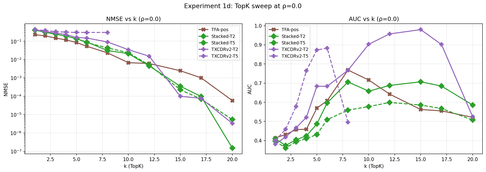
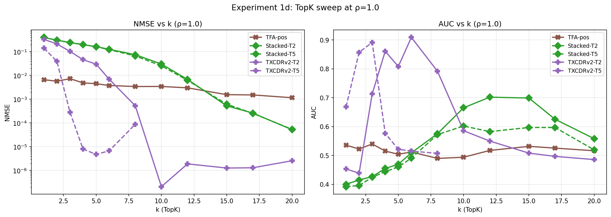
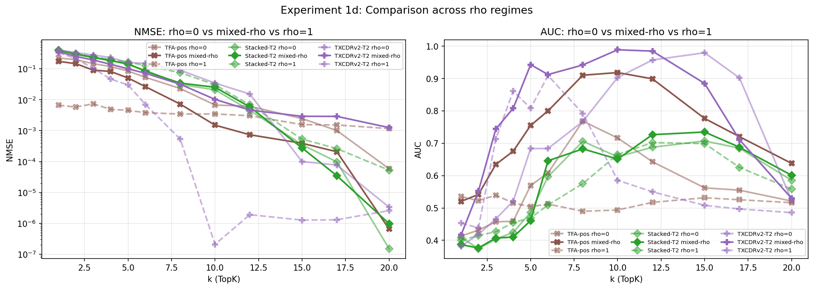

## Experiment 1d: TopK sweep at limiting correlations (ρ=0 and ρ=1)

Full 12-point TopK sweep at the two extremes of temporal correlation: ρ=0 (i.i.d. features, no temporal signal) and ρ=1 (frozen features, maximum temporal signal). Five models tested: TFA-pos, Stacked-T2, Stacked-T5, TXCDRv2-T2, TXCDRv2-T5.

### Setup

- 20 features, hidden_dim=40, seq_len=64, pi=0.5, unit magnitudes
- k values: 1, 2, 3, 4, 5, 6, 8, 10, 12, 15, 17, 20
- TXCDRv2-T5 capped at k=8 (k×T=40=d_sae)
- 30K training steps per model per k
- Script: `src/v2_temporal_schemeC/run_experiment1d.py`
- Results: `src/v2_temporal_schemeC/results/experiment1d_limiting_rho/`

### Key note on ρ=1 with unit magnitudes

At ρ=1 with unit magnitudes, all tokens in a sequence are **identical** (same active features, same magnitudes). This is a degenerate case: any model that can average over positions can reconstruct perfectly. The interesting signal is in **AUC** (feature recovery) and how quickly NMSE approaches zero as a function of k.

### Results

#### ρ=0 (i.i.d.)



**NMSE observations:**
- TFA-pos has the lowest NMSE at low k (0.225 at k=1 vs 0.40 for Stacked SAEs). Its attention mechanism provides a useful inductive bias even without temporal structure.
- All models converge to near-zero NMSE by k=15-20.
- **TXCDRv2-T5 plateaus at NMSE≈0.30** for k≥5. Once k×T approaches d_sae=40, the model saturates and cannot effectively use additional capacity. This is a fundamental limitation of the architecture at this scale.

**AUC observations:**
- **TXCDRv2-T2 achieves the best AUC at ρ=0**, peaking at 0.980 at k=15. This is remarkable: even without temporal signal, the shared-latent constraint enforces cross-position consistency, which improves feature recovery via decoder averaging.
- TXCDRv2-T5 AUC peaks at 0.883 (k=6) then drops to 0.496 at k=8, where k×T=40=d_sae.
- Most models converge to AUC≈0.5 at k=20 (Stacked-T2 reaches 0.59) — too many latents for d_sae=40, many become redundant.

#### ρ=1 (frozen)



**NMSE observations:**
- **TFA-pos has dramatically lower NMSE across all k values** (0.007 at k=1 vs 0.40 for Stacked SAEs). With frozen features, every token is identical, so attention can average over 64 positions to reconstruct with only k=1 novel latent.
- TXCDRv2-T2 converges to NMSE≈0 by k=10 (vs k=15 at ρ=0).
- **TXCDRv2-T5 achieves near-zero NMSE at just k=3** (0.0003). The 5-position window is maximally useful when all positions carry the same signal.
- Stacked SAEs show **limited sensitivity to ρ** — similar NMSE at low and high k, but up to 2× worse at mid-range k for ρ=1.

**AUC observations:**
- TFA-pos AUC remains around 0.5 across all k — it reconstructs well but does not recover individual features.
- TXCDRv2-T2 AUC peaks at 0.909 (k=6), earlier than ρ=0 (k=15), because frozen features make the learning problem easier.
- **TXCDRv2-T5 at k=3 achieves AUC=0.892**, dramatically better than ρ=0 (0.579).
- AUC drops quickly after the peak for all models at ρ=1 — once the model has enough latents to perfectly reconstruct, additional latents become redundant and hurt feature identification.

### Comparison across ρ regimes



Selected models compared across ρ=0 (this experiment), mixed-ρ (Experiment 1 reproduction), and ρ=1 (this experiment):

| Model | k=3 NMSE (ρ=0 / mixed / ρ=1) | k=3 AUC (ρ=0 / mixed / ρ=1) |
|-------|-------------------------------|------------------------------|
| TFA-pos | 0.147 / — / 0.007 | 0.457 / — / 0.540 |
| Stacked-T2 | 0.239 / — / 0.244 | 0.404 / — / 0.427 |
| TXCDRv2-T2 | 0.279 / 0.192 / 0.104 | 0.466 / 0.744 / 0.713 |

### Summary of findings

1. **At ρ=0 (no temporal structure), TXCDRv2-T2 achieves the best AUC** (0.98 at k=15). The shared-latent constraint is beneficial for feature recovery even without temporal signal, through the decoder-averaging metric.

2. **TFA-pos's attention provides a consistent NMSE advantage at low k** — ~2× at ρ=0 and up to ~57× at ρ=1 where temporal averaging is maximally useful — but this does not translate to better AUC (feature recovery).

3. **Stacked SAEs show limited sensitivity to temporal correlation** — their NMSE is similar at low and high k but up to 2× worse at mid-range k for ρ=1, likely due to training on identical tokens. They have no mechanism to exploit temporal structure.

4. **TXCDRv2 models improve substantially from ρ=0 to ρ=1**, with faster NMSE convergence and earlier AUC peaks. The shared encoder architecture can exploit frozen features.

5. **TXCDRv2-T5 has a fundamental scale limitation** — it plateaus at NMSE≈0.30 for ρ=0 when k×T approaches d_sae=40. At ρ=1 this is resolved (NMSE=0.0003 at k=3) because the frozen features reduce the effective complexity.

6. **AUC peaks and then declines** for all models at both ρ values, confirming the "sparse but wrong" finding: too many latents relative to d_sae causes feature splitting.

### Commands

```bash
# Main run (crashed during rho=1 TXCDRv2-T5 due to CUDA error)
TQDM_DISABLE=1 PYTHONPATH=/home/elysium/temp_xc \
  /home/elysium/miniforge3/envs/torchgpu/bin/python -u \
  src/v2_temporal_schemeC/run_experiment1d.py

# Recovery (loads cached models, retrains TXCDRv2-T5 at rho=1)
TQDM_DISABLE=1 PYTHONPATH=/home/elysium/temp_xc \
  /home/elysium/miniforge3/envs/torchgpu/bin/python -u \
  src/v2_temporal_schemeC/run_experiment1d_recover.py
```

Total runtime: ~20h (initial) + 21m (recovery).
