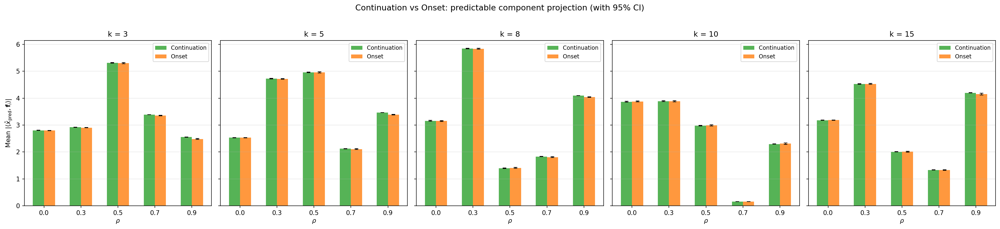
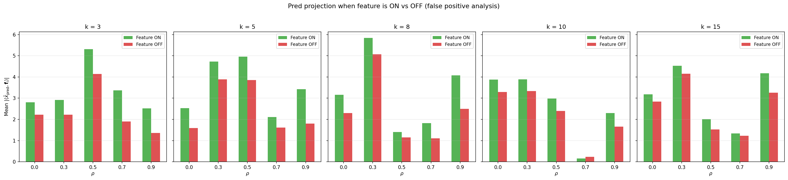
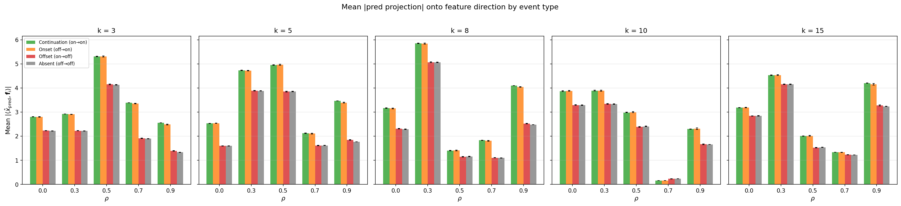
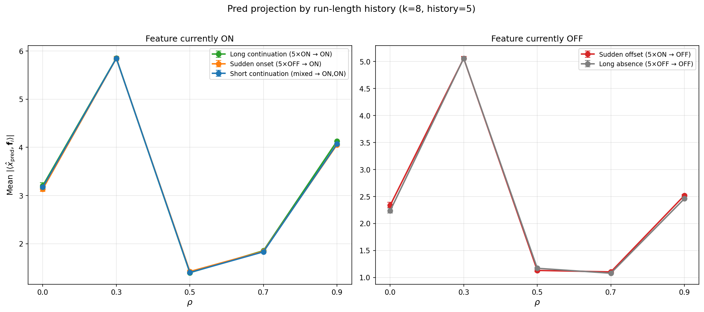
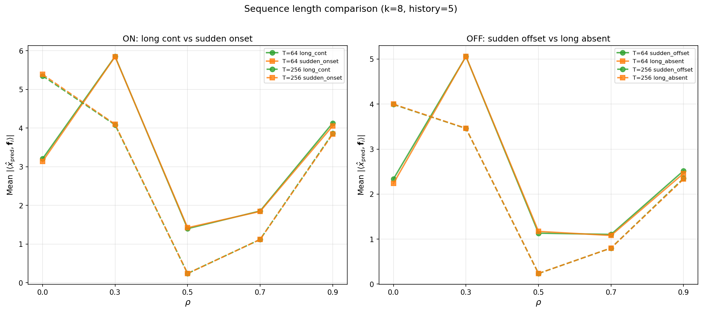

## Experiment 3: Temporal decomposition

**Question.** Does TFA's predictable component preferentially capture *continuing* features (on at $t-1$ and $t$, which are temporally predictable) vs *onset* features (off at $t-1$, on at $t$, which are not)?

**Model.** TFA only (no SAE baseline). Same TFA architecture as Experiment 1 (TopK novel component), trained at $k \in \{3, 5, 8, 10, 15\}$. We analyse TFA's internal decomposition using ground-truth feature labels.

Run: `TQDM_DISABLE=1 python src/v2_temporal_schemeC/run_temporal_decomposition_v2.py`.

**Method.** Using the ground-truth Markov chain state, we classify each (feature $i$, position $t > 1$) event into four types based on the transition from $t-1$ to $t$:

- **Continuation** (on $\to$ on): feature was active at $t-1$ and remains active at $t$ (37% of events)
- **Onset** (off $\to$ on): feature was inactive at $t-1$ and becomes active at $t$ (13%)
- **Offset** (on $\to$ off): feature was active at $t-1$ and becomes inactive at $t$ (13%)
- **Absent** (off $\to$ off): feature was inactive at both $t-1$ and $t$ (37%)

For each event type and $\rho$-group, we compute the **mean absolute prediction projection**: $\mathbb{E}[|\langle D z_{\text{pred},t}, \mathbf{f}_i \rangle|]$ averaged over all tokens of that event type for features in that $\rho$-group. This measures how strongly TFA's predictable component reconstructs along a given feature's direction. 95% confidence intervals via bootstrap (200 resamples). Sample sizes range from ~19K (onset at $\rho = 0.9$) to ~359K (continuation at $\rho = 0.9$).

If TFA exploits temporal structure, we expect: (1) continuations should have higher prediction projection than onsets (persistent features are predictable from context), (2) offset/absent should have low projection (inactive features should not be predicted), and (3) these patterns should be sharper for high-$\rho$ features (which are more temporally persistent).

Mean prediction projection for continuations vs onsets across $\rho$ groups, with 95% bootstrap CIs.

Mean prediction projection when the feature is ON vs OFF, showing high false-positive rates.

All four event types: continuation $\approx$ onset and offset $\approx$ absent at every $k$ and $\rho$.

**Findings.**

1. **Continuations $\approx$ onsets.** At every $k$ and $\rho$, prediction projections are virtually identical for continuing vs newly appearing features (e.g., at $k = 8$, $\rho = 0.9$: 4.10 vs 4.04). The predictable component does not detect whether a feature was previously active.

2. **High false-positive rate.** The predictable component projects strongly onto feature directions even when the feature is OFF. This is because TFA's projection-scale mechanism ($\text{proj\_scale} = \langle D z_{\text{pred}}, x \rangle / \|D z_{\text{pred}}\|^2$) uses the current token, so the output adapts to the input regardless of temporal context.

3. **No monotonic relationship with $\rho$.** If TFA exploited temporal persistence, high-$\rho$ features should show higher prediction projections. Instead, projections vary erratically (at $k = 8$: $\rho\!=\!0.3 \to 5.85$, $\rho\!=\!0.5 \to 1.40$, $\rho\!=\!0.9 \to 4.10$). Routing appears driven by training dynamics, not temporal structure.

**Interpretation.** The attention averages over all $T = 64$ context positions. With $\pi = 0.5$, a feature is active at ~32 prior positions; whether it was active at $t-1$ specifically is one bit diluted across this average. The decomposition routes features by identity (which features the predictable component "owns"), not by temporal event.

These findings suggest TFA's predictable component may function as a general-purpose reconstruction channel rather than a temporal predictor. **Experiment 3b** (below) strengthens this conclusion by testing against longer temporal histories and longer sequences.

### Experiment 3b: Run-length and sequence-length controls

**Motivation.** The lag-1 analysis above could be criticised as a weak test: the attention sees 64 context positions, so a single-position transition is diluted. Three alternative hypotheses remain: (1) TFA cares about *long* persistence (e.g., 5+ consecutive ON) rather than lag-1, (2) $T = 64$ is too short for attention to learn temporal patterns, and (3) the attention architecture simply cannot exploit this type of persistence. We test all three.

Run: `TQDM_DISABLE=1 PYTHONUNBUFFERED=1 python -u src/v2_temporal_schemeC/run_temporal_decomposition_v3.py`.

**Method.** For each (feature $i$, position $t$), we look at the full recent history $s_{i,t-4}, \ldots, s_{i,t}$ (5 positions) and classify into six categories:

- **Long continuation** ($1\!1\!1\!1\!1$): feature ON for all 5 positions --- the strongest temporal signal
- **Sudden onset** ($0\!0\!0\!0\!1$): feature OFF for 4 positions, then ON --- temporally unpredictable
- **Short continuation**: feature ON at $t-1$ and $t$, but not all 5 positions ON
- **Short onset**: feature OFF at $t-1$, ON at $t$, but not all 5 OFF before
- **Sudden offset** ($1\!1\!1\!1\!0$): feature ON for 4 positions, then OFF
- **Long absence** ($0\!0\!0\!0\!0$): feature OFF for all 5 positions

If TFA exploits temporal structure, long continuations should have substantially higher prediction projections than sudden onsets.

**Part 1: Run-length conditioning ($T = 64$, $k \in \{5, 8\}$).**

| Category | $\rho = 0.5$ | $\rho = 0.9$ | Ratio (long/sudden) |
| --- | --- | --- | --- |
| Long cont ($k=8$) | 1.397 | 4.128 | --- |
| Sudden onset ($k=8$) | 1.422 | 4.054 | --- |
| **long/sudden** | **0.98** | **1.02** | $\approx 1.0$ |
| Long cont ($k=5$) | 4.964 | 3.512 | --- |
| Sudden onset ($k=5$) | 4.964 | 3.407 | --- |
| **long/sudden** | **1.00** | **1.03** | $\approx 1.0$ |

The same pattern holds for the OFF side: sudden offset $\approx$ long absence at all $\rho$ values.

**TFA-pos run-length conditioning ($T = 64$, $k \in \{5, 8\}$).**

| Category | $\rho = 0.5$ | $\rho = 0.9$ | Ratio (long/sudden) |
| --- | --- | --- | --- |
| Long cont ($k=8$) | 4.213 | 1.158 | --- |
| Sudden onset ($k=8$) | 4.108 | 0.836 | --- |
| **long/sudden** | **1.03** | **1.39** | $> 1.0$ |
| Long cont ($k=5$) | 5.398 | 0.908 | --- |
| Sudden onset ($k=5$) | 4.818 | 0.997 | --- |
| **long/sudden** | **1.12** | **0.91** | mixed |

With positional encoding, TFA-pos shows a long/sudden ratio of **1.39 at $\rho = 0.9$, $k = 8$** --- a 39% distinction that is absent in position-blind TFA (ratio 1.02). This confirms that positional encoding enables some temporal discrimination in the attention direction. The effect is modest and not uniform: at $k = 5$, $\rho = 0.9$, the ratio is 0.91, suggesting the temporal routing learned by TFA-pos is $k$-dependent.

For position-blind TFA (above plot): long continuation, sudden onset, and short continuation all produce virtually identical prediction projections at every $\rho$. The three curves overlap completely.

For TFA-pos (above plot): at $\rho = 0.9$, long continuation produces higher prediction projections than sudden onset, showing the positional encoding enables some temporal discrimination.

**Part 2: Sequence length ($T = 64$ vs $T = 256$, $k = 8$).**

| $T$ | $\rho$ | Long cont | Sudden onset | Ratio |
| --- | --- | --- | --- | --- |
| 64 | 0.5 | 1.397 | 1.422 | 0.983 |
| 64 | 0.9 | 4.128 | 4.054 | 1.018 |
| 256 | 0.5 | 0.237 | 0.237 | 1.001 |
| 256 | 0.9 | 3.862 | 3.844 | 1.005 |

At $T = 256$ with ~12 full ON/OFF cycles per feature (vs ~3 at $T = 64$), the long/sudden ratio moves *closer* to 1.0, not further.

**Findings.**

1. **Run-length history is irrelevant.** Whether a feature has been ON for 5+ consecutive positions or has just appeared makes no difference to the predictable component (ratios 0.98--1.03 across all conditions). This rules out the hypothesis that TFA exploits long-run persistence rather than lag-1 transitions.

2. **More context does not help.** Quadrupling the sequence length to $T = 256$ makes the long/sudden ratio even closer to 1.0. With 256 context positions and ~12 full cycles per feature at $\rho = 0.9$, the attention has ample opportunity to detect temporal patterns --- and ignores them.

3. **Content-based matching drowns out temporal signal.** The attention should in principle produce different directions for the two cases: in the 11111 case, context tokens contain feature $i$, so the attention direction should align with $\mathbf{f}_i$; in the 00001 case, context lacks feature $i$, so it should not. But with $\pi = 0.5$ and 20 features, any two tokens share ~5 features on average ($n\pi^2 = 5$). The attention finds partially matching tokens and produces a broad direction spanning many features, regardless of whether the specific feature under test appeared in context. The temporal signal (whether one particular feature was in context) is overwhelmed by the content-matching signal (many other shared features). The proj\_scale step then projects $x_t$ onto this broadly similar direction, yielding similar projections along $\mathbf{f}_i$ for both cases.

4. **The non-monotonic $\rho$ dependence persists.** Projection strength at $k = 8$ peaks at $\rho = 0.3$ ($\approx 5.85$), drops at $\rho = 0.5$ ($\approx 1.40$), and partially recovers at $\rho = 0.9$ ($\approx 4.13$). This confirms that which features the predictable component "owns" is determined by training dynamics and feature identity, not by temporal persistence.

Experiment 3c directly tests the content-matching hypothesis by examining the raw attention direction before proj\_scale.

### Experiment 3c: Attention direction quality analysis

**Motivation.** Experiments 3/3b show that the *final* prediction projection (after proj\_scale) is identical for long continuations and sudden onsets. But this could mean either (a) the attention genuinely fails to distinguish them, or (b) the attention produces different directions but proj\_scale collapses the difference. To disentangle these, we examine the raw attention direction $D z_{\text{pred}}$ *before* proj\_scale, comparing three conditions: TFA trained on temporal data, TFA trained on shuffled data, and random directions.

Run: `TQDM_DISABLE=1 PYTHONUNBUFFERED=1 python -u src/v2_temporal_schemeC/run_attention_direction_analysis.py`.

**Method.** For each trained TFA, we extract the raw attention direction $D z_{\text{pred}}$ (the decoded attention output before the proj\_scale step) and compute:

- **Per-feature alignment** $|\cos(D z_{\text{pred}}, \mathbf{f}_i)|$: does the direction point toward the specific feature under test?
- **Global alignment** $\cos(D z_{\text{pred}}, x_t)$: how well does the direction match the full input?
- **Variance explained** $\langle \hat{d}, x_t \rangle^2 / \|x_t\|^2$ where $\hat{d}$ is the unit direction: fraction of $x_t$'s energy captured by projection onto the direction.

Three conditions: temporal TFA, shuffled TFA, and random unit directions. All evaluated on the same unshuffled temporal eval data. Broken down by run-length category (long continuation, sudden onset, etc.) and $\rho$ group.

**Results — global direction quality ($k = 8$):**

| Condition | $\cos(Dz, x_t)$ | Var explained |
| --- | --- | --- |
| Temporal | 0.971 | 94.3% |
| Shuffled | 0.858 | 73.6% |
| Random | 0.000 | 2.5% |

The temporal model produces substantially better directions than shuffled (94% vs 74% variance explained), and both are far above random. Content-based matching (benefit 2) accounts for the bulk of direction quality, and temporal training adds ~20% variance explained on top.

**Results — per-feature alignment $|\cos(Dz, \mathbf{f}_i)|$ at $\rho = 0.9$, $k = 8$:**

| Condition | Long cont | Sudden onset | Ratio |
| --- | --- | --- | --- |
| Temporal | 0.231 | 0.227 | 1.02 |
| Shuffled | 0.255 | 0.252 | 1.01 |
| Random | 0.127 | 0.127 | 1.00 |

Long continuation $\approx$ sudden onset for **all** conditions — temporal, shuffled, and random. The attention does not produce directions that align more with $\mathbf{f}_i$ when the feature was persistently active in context.

**Results — global alignment is also identical across categories ($k = 8$, temporal):**

| Category | $\cos(Dz, x_t)$ | Var explained |
| --- | --- | --- |
| Long cont ($\rho = 0.9$) | 0.972 | 94.5% |
| Sudden onset ($\rho = 0.9$) | 0.972 | 94.5% |
| Sudden offset ($\rho = 0.9$) | 0.971 | 94.3% |
| Long absent ($\rho = 0.9$) | 0.971 | 94.3% |

**Findings.**

1. **The attention direction does not encode per-feature temporal history.** Per-feature alignment $|\cos(Dz, \mathbf{f}_i)|$ is virtually identical for long continuations and sudden onsets (ratio $\approx 1.0$) in all three conditions. This rules out explanation (b) — the attention genuinely fails to distinguish these cases, and proj\_scale is not collapsing a signal that was there.

2. **Temporal training improves overall direction quality, not temporal prediction.** The temporal model achieves 94% variance explained vs 74% for shuffled — a large gap. But this improvement is uniform across all run-length categories. The temporal model does not get *disproportionately* better for long continuations. The improvement likely comes from training on data whose distribution matches the eval data, not from learning temporal patterns.

3. **Content-based matching accounts for 74% of variance explained.** The shuffled model, which has no access to temporal information, still achieves 74% variance explained — the attention finds content-similar tokens in context regardless of position. The remaining ~20% gap between temporal and shuffled is consistent with the 3--12% temporal fraction from the shuffle diagnostic (Experiment 1, finding 5), given that direction quality maps nonlinearly to NMSE.

4. **The per-feature alignment is only 0.23 even for the temporal model.** The direction $D z_{\text{pred}}$ is broadly distributed across many features, not sharply aligned with any single one. This confirms that the attention produces a broad content-matching direction rather than a feature-specific prediction.
