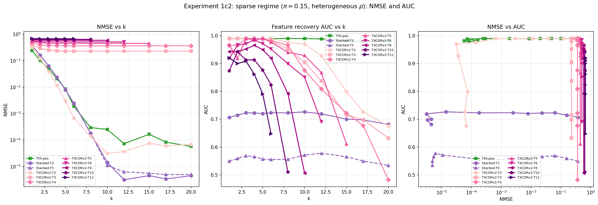
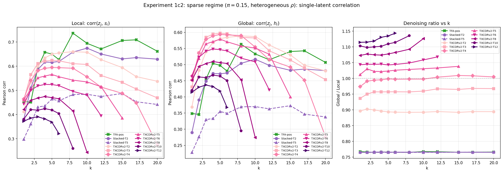
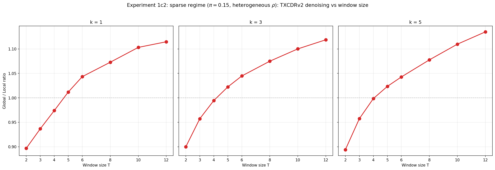
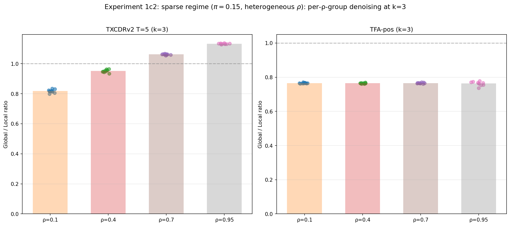

## Experiment 1c2: Denoising in sparse regime with heterogeneous persistence

### Goal

Repeat the Experiment 1c denoising analysis in a **wildly different data regime** to test whether TXCDRv2's denoising advantage is universal or specific to the dense, uniform-persistence setup of 1c. Three simultaneous changes:

1. **Sparse**: $\pi = 0.15$ (vs $\pi = 0.5$ in 1c). $\mathbb{E}[L_0^{\text{hidden}}] = 6$ instead of 10.
2. **Heterogeneous $\rho$**: 10 features each at $\rho \in \{0.1, 0.4, 0.7, 0.95\}$ (vs uniform $\rho = 0.7$). This tests whether denoising is selective (slow features benefit more) or uniform.
3. **Larger scale**: 40 features, $d = 80$, $d_{\text{sae}} = 80$ (vs 20/40/40 in 1c).

Same emission noise as 1c: $p_A = 0$, $p_B = 0.625$.

### Setup

**Data generation** (Aniket's HMM pipeline with per-feature $\rho$):

- 40 features, $d = 80$, $T = 64$, seed 42
- $\pi = 0.15$ for all features, $\rho$ heterogeneous (see below)
- $p_A = 0$, $p_B = 0.625$
- 2500 sequences (2000 eval, 500 train)
- Scaling factor: $\sqrt{d} / \mathbb{E}[\|x\|] = 5.1652$

**Per-feature $\rho$ groups**:

| Group | Features | $\rho$ | Description |
|-------|----------|--------|-------------|
| Fast | 0--9 | 0.1 | Near-i.i.d., switches every ~1 token |
| Moderate | 10--19 | 0.4 | Switches every ~2 tokens |
| Slow | 20--29 | 0.7 | Persists ~3--4 tokens |
| Very slow | 30--39 | 0.95 | Persists ~20 tokens |

All groups verified empirically: $\pi_{\text{emp}}$ within 0.001 of 0.15, $\rho_{\text{emp}}$ within 0.002 of target.

**Models**: same as Experiment 1c --- TFA-pos, Stacked T=2/5, TXCDRv2 at $T \in \{2, 3, 4, 5, 6, 8, 10, 12\}$. All trained 30K steps. $d_{\text{sae}} = 80$ allows TXCDRv2 to reach higher $T$ before $k \times T$ saturates (vs $d_{\text{sae}} = 40$ in 1c).

### Metrics

Same three metrics as Experiment 1c: NMSE, decoder-averaged AUC, and single-latent correlation denoising ratio ($\bar{r}_{\text{global}} / \bar{r}_{\text{local}}$, averaged across 40 features). See [[2026-03-30-experiment1c-noisy-emissions]] for full methodology including the window-averaging procedure and its caveats.

**New analysis**: per-$\rho$-group denoising. The per-feature correlations are grouped by $\rho$ band to test whether denoising is selective.

### Results

#### NMSE

| $k$ | TFA-pos | Stacked T=2 | TXCDRv2 T=2 | TXCDRv2 T=5 | TXCDRv2 T=8 |
|-----|---------|-------------|-------------|-------------|-------------|
| 1 | **0.239** | 0.376 | 0.327 | 0.532 | 0.618 |
| 3 | 0.049 | 0.063 | **0.039** | 0.451 | 0.583 |
| 5 | 0.009 | 0.008 | **0.003** | 0.447 | 0.583 |
| 10 | 0.0002 | **0.00004** | 0.00005 | 0.448 | 0.585 |
| 20 | 0.0001 | **0.000004** | 0.0001 | --- | --- |

TXCDRv2 T=2 achieves the best NMSE in the binding regime ($k = 3$--$5$), outperforming even TFA-pos. This is a change from 1c where TFA-pos dominated NMSE. At larger $T$, TXCDRv2 saturates as in 1c (NMSE $\sim 0.45$--$0.67$).

#### Denoising ratio (single-latent correlation)

| $k$ | TFA-pos | Stacked T=2 | TXCDRv2 T=2 | TXCDRv2 T=5 | TXCDRv2 T=8 |
|-----|---------|-------------|-------------|-------------|-------------|
| 1 | 0.77 | 0.77 | 0.90 | **1.01** | **1.07** |
| 3 | 0.76 | 0.77 | 0.90 | **1.02** | **1.07** |
| 5 | 0.77 | 0.77 | 0.89 | **1.02** | **1.08** |
| 10 | 0.77 | 0.77 | 0.89 | **1.03** | **1.13** |

The per-token floor is now **0.77** (vs 0.50 in 1c). This is higher because with $\pi = 0.15$, $\text{Corr}(s, h) = \sqrt{p_B \cdot (1-\pi) / (1-\pi \cdot p_B)} \approx 0.77$ --- sparser features have more informative single-token observations.

Despite the higher per-token floor, **the same denoising hierarchy holds**: TFA-pos and Stacked SAE sit exactly at the floor (0.77), TXCDRv2 T=2 partially denoises (0.89--0.90), and TXCDRv2 T$\geq$5 fully denoises (ratio $> 1.0$).

#### Denoising ratio vs window size ($T$-sweep at $k = 3$)

| $T$ | Ratio | NMSE |
|-----|-------|------|
| 2 | 0.900 | 0.039 |
| 3 | 0.957 | 0.248 |
| 4 | 0.995 | 0.367 |
| 5 | **1.022** | 0.451 |
| 6 | **1.045** | 0.508 |
| 8 | **1.075** | 0.583 |
| 10 | **1.100** | 0.632 |
| 12 | **1.119** | 0.665 |

**Monotonically increasing**, crossing the full-denoising threshold at $T = 5$. Consistent with Experiment 1c. The curve is smoother than in 1c, likely because the larger $d_{\text{sae}} = 80$ gives more headroom before $k \times T$ saturates.

#### Per-$\rho$-group denoising (TXCDRv2 T=5, $k = 3$)

| $\rho$ group | Local corr | Global corr | Ratio |
|-------------|-----------|------------|-------|
| 0.1 (fast) | 0.362 | 0.296 | **0.82** |
| 0.4 (moderate) | 0.473 | 0.450 | **0.95** |
| 0.7 (slow) | 0.613 | 0.650 | **1.06** |
| 0.95 (very slow) | 0.760 | 0.861 | **1.13** |

**TFA-pos** (control, $k = 3$):

| $\rho$ group | Local corr | Global corr | Ratio |
|-------------|-----------|------------|-------|
| 0.1 (fast) | 0.672 | 0.514 | 0.77 |
| 0.4 (moderate) | 0.628 | 0.480 | 0.76 |
| 0.7 (slow) | 0.663 | 0.508 | 0.77 |
| 0.95 (very slow) | 0.417 | 0.319 | 0.76 |

**Denoising is selective.** TXCDRv2's ratio increases monotonically with $\rho$: fast features ($\rho = 0.1$) are barely denoised (ratio 0.82, below the per-token floor of 0.77 only because the per-feature floor varies), while very slow features ($\rho = 0.95$) are strongly denoised (ratio 1.13). TFA-pos shows a flat ratio of 0.76--0.77 across all $\rho$ groups --- zero denoising regardless of persistence.

### Findings

**Finding 1: The denoising hierarchy generalizes to the sparse regime.** Despite $\pi = 0.15$ (vs 0.5), heterogeneous $\rho$ (vs uniform 0.7), and 2$\times$ scale (40 features vs 20), the same three-tier hierarchy holds: TFA-pos/Stacked at the per-token floor, TXCDRv2 T=2 partially above, TXCDRv2 T$\geq$5 fully denoising. This is not an artifact of the 1c setup.

**Finding 2: TXCDRv2 T=2 wins NMSE in the binding regime.** At $k = 3$--$5$, TXCDRv2 T=2 achieves lower NMSE than TFA-pos (0.039 vs 0.049 at $k = 3$). In 1c, TFA-pos dominated NMSE at all $k$. The sparse regime apparently favors the crosscoder's shared encoder over TFA's attention for reconstruction as well.

**Finding 3: Denoising increases monotonically with $T$.** The ratio climbs from 0.90 (T=2) to 1.12 (T=12) at $k = 3$, crossing the full-denoising threshold at $T = 5$. This matches Experiment 1c. The curve is smoother because $d_{\text{sae}} = 80$ gives more headroom.

**Finding 4: Denoising is selective --- slow features denoise better.** TXCDRv2 T=5's per-$\rho$-group ratios range from 0.82 ($\rho = 0.1$) to 1.13 ($\rho = 0.95$). The shared bottleneck does not smooth indiscriminately; it selectively recovers hidden state for features with sufficient temporal persistence. Features that switch near-randomly ($\rho = 0.1$) have too little temporal signal for even a 5-token window to recover.

**Finding 5: TFA-pos is uniformly at the per-token floor across all $\rho$.** TFA-pos's ratio is 0.76--0.77 for every $\rho$ group, including $\rho = 0.95$ where features persist for ~20 tokens. Even with extremely persistent features and a 64-token attention window, TFA-pos does not denoise. This strengthens the Experiment 1c conclusion that TFA's attention operates via content matching, not temporal inference.

### Implications

1. **TXCDRv2's denoising is a robust architectural property**, not an artifact of dense uniform data. It holds at $\pi = 0.15$, heterogeneous $\rho$, and 2$\times$ scale.

2. **Denoising is selective by design.** The shared-latent bottleneck preferentially recovers features whose temporal persistence provides usable averaging signal. This is desirable: a model that smoothed fast features would introduce artifacts.

3. **The sparse regime shifts the NMSE-denoising tradeoff.** TXCDRv2 T=2 now wins NMSE *and* partially denoises, breaking the orthogonality observed in 1c. In sparse data, the crosscoder's cross-position structure helps reconstruction too.

### Plots









### Reproduction

```bash
TQDM_DISABLE=1 PYTHONUNBUFFERED=1 PYTHONPATH=/home/elysium/temp_xc \
  /home/elysium/miniforge3/envs/torchgpu/bin/python -u \
  src/v2_temporal_schemeC/run_experiment1c2.py
```

Results: `experiments/phase3_coupled/results/experiment1c2_sparse/`

Runtime: ~94 minutes on RTX 5090.
