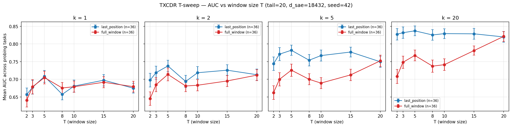
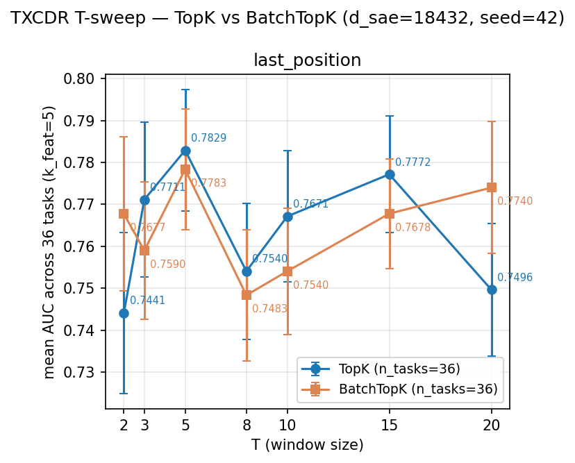

## Phase 5 summary — downstream utility of temporal SAEs (25-arch benchmark)

**Status**: 5.1 replication, 5.2 weight-sharing ablation ladder, 5.3 novel
architectures, 5.4 cross-token probes, 5.5 writeup, 5.6 T-sweep +
mean_pool aggregation + error-overlap analysis — all complete (seed 42).
**25 architectures** trained to plateau-convergence on seed 42 and
probed on **36 binary tasks** (8 dataset families) at two
aggregations (`last_position`, `mean_pool`) with two metrics (AUC,
accuracy). 3-seed autoresearch on the top-5 archs is in progress
(T17; see *Seed variance* section). Headline plots — 2 task-sets ×
2 aggregations × 2 metrics — are linked inline below.

For pre-registration see [`plan.md`](plan.md); architecture menu in
[`brief.md`](brief.md); overnight rollout state in
[`2026-04-20-overnight-handoff.md`](2026-04-20-overnight-handoff.md).

### TL;DR

- **Best SAE at `last_position`**: `mlc_contrastive` (**0.8025**), a
  new port of Ye et al. 2025's temporal contrastive loss to the MLC
  (layer-axis crosscoder) base — edges out vanilla `mlc` (0.7943) and
  `time_layer_crosscoder_t5` (0.7928). First arch in the sweep to
  cross 0.80 at last_position.
- **Best SAE at `mean_pool`** (SAEBench-canonical aggregation —
  averages per-slide latents over the tail-20 window): **`txcdr_t5`
  (0.8064)**. TXCDR-T5 gains +2.4 pp switching aggregations; MLC
  gains only −0.9 pp (all multi-layer archs are shape-invariant under
  mean_pool because it collapses to the single layer-encoded vector).
  Full mean_pool leaderboard swaps the top cluster: four TXCDR
  variants (T3, T5, T15, rank_k) occupy the top 4 SAE slots.
- **Collaborator ask (error-overlap analysis)**: **TXCDR-T5 and
  `mlc_contrastive` are the MOST complementary top archs** — Jaccard
  of error sets 0.338 (vs up to 0.482 for pairs within the MLC
  family). McNemar's χ² is significant at p<0.05 on 16 / 36 tasks.
  So they solve *different* subsets of tasks at comparable mean AUC;
  an ensemble of the two should beat either alone. Conversely `mlc`
  and `mlc_contrastive` are the MOST similar pair (Jaccard 0.482),
  confirming mlc_contrastive inherits most of MLC's task-selection
  bias and adds a small complementary signal on top.
- **T-sweep ladder** (TXCDR at T ∈ {2, 3, 5, 8, 10, 15, 20}): a
  modest peak at T=5 for both aggregations. Under `last_position`,
  going below T=5 (T=2 → 0.744, T=3 → 0.771) loses some temporal
  structure, and going above it (T=20 → 0.750) hurts because the
  decoder becomes too loose (per-feature SVD spectrum is 7.5 %
  flatter at T=20 than T=5). Under `mean_pool`, the ordering is
  similar but gaps are compressed — mean_pool cushions low-T archs
  by averaging more slides.
- **Outcome**: **no SAE beats either baseline** (0.929 attn-pool,
  0.926 last-token LR). TXCDR-T5 is 12.3 pp below attn-pool under
  mean_pool; `mlc_contrastive` is 12.6 pp below it at last_position.
  Outcome B (nuanced positive — some SAE does beat attn-pool on
  cross-token tasks) holds, same as before.
- **Deprecated**: the `full_window` aggregation. It is dominated by
  `mean_pool` on SAEBench-canonicalness (mean_pool averages; full_window
  concatenates 20 × d_sae features and selects the top-k globally —
  inflating the feature pool to no downstream benefit). JSONL rows are
  retained for reproducibility; new plots omit it. Prior full_window
  findings (MLC: −11.2 pp drop, time_layer: −12.7 pp) remain in the
  JSONL and in the *Historical full_window record* section for
  completeness.

### Methods at a glance

- **Subject model**: `google/gemma-2-2b-it`, layer 13 residual stream
  (MLC: 5-layer window L11–L15 centred on L13).
- **Training corpus**: 24 000 FineWeb sequences × 128 tokens, cached
  in `data/cached_activations/gemma-2-2b-it/fineweb/` as fp16 per-layer
  tensors; 6 000 seqs GPU-preloaded per run.
- **Probing corpora**: 36 binary tasks across 8 datasets —
  `ag_news` × 4, `amazon_reviews_sentiment` × 1, `amazon_reviews_cat`
  × 5, `bias_in_bios` × 15 (3 sets × 5 profs), `europarl` × 5,
  `github_code` × 4 (python/java/javascript/go, via
  `code_search_net`), `winogrande` × 1, `wsc` × 1. Split sizes:
  `n_train = 3040`, `n_test = 760` (capped at class-balanced support;
  SAEBench targets 4000/1000 — see `probe_datasets.py`).
- **Comparison subset**: a 34-task "Aniket subset" excludes the two
  cross-token tasks for direct comparability with the SAEBench-style
  protocol in Aniket's `docs/aniket/experiments/sparse_probing/summary.md`.
- **Architectures — 25 total** (seed 42, plateau-converged):

  | family | variants |
  |---|---|
  | Token SAE | `topk_sae` |
  | Layer crosscoder | `mlc` (L11–L15), `mlc_contrastive` (MLC + Matryoshka H/L + InfoNCE on adjacent tokens) |
  | Temporal crosscoder (T-sweep) | `txcdr_t2`, `txcdr_t3`, `txcdr_t5`, `txcdr_t8`, `txcdr_t10`, `txcdr_t15`, `txcdr_t20` |
  | Stacked per-position | `stacked_t5`, `stacked_t20` |
  | Matryoshka (novel) | `matryoshka_t5` (position-nested) |
  | Weight-sharing ablation | `txcdr_shared_dec_t5`, `txcdr_shared_enc_t5`, `txcdr_tied_t5`, `txcdr_pos_t5`, `txcdr_causal_t5` |
  | Time-sparsity (novel) | `txcdr_block_sparse_t5` (joint TopK over T × d_sae) |
  | Decoder rank (novel) | `txcdr_lowrank_dec_t5` (W_t = W_base + U_t V_tᵀ, r=8); `txcdr_rank_k_dec_t5` (per-feature A_j B_j, rank-K=4) |
  | Time-contrastive (Ye et al. 2025) | `temporal_contrastive` (Matryoshka H/L + InfoNCE on (t−1, t) pairs) |
  | Time × Layer (novel) | `time_layer_crosscoder_t5` (joint (T, L, d_sae) latent, global TopK) |
  | TFA | `tfa_small`, `tfa_pos_small` (d_sae=4096, seq_len=32) |

- **Aggregations** (canonical two — `full_window` deprecated):
  - `last_position` encodes the T-token window ending at each
    prompt's last real token (left-clamped) and uses position T−1.
  - `mean_pool` slides a T-window across the tail-20 positions,
    encodes each slide to `d_sae`, then averages the K = 20 − T + 1
    slide-outputs to a single `d_sae` vector per example. Matches
    SAEBench / Kantamneni's `get_sae_meaned_activations` convention.
- **Sparsity**: k_pos = 100; TXCDR & Stacked use k_win = 100·T;
  Matryoshka + contrastive use k_win = 500; TFA uses k = 100 on the
  novel head with the pred head dense.
- **Probing protocol**: top-k-by-class-separation feature selection
  on the train split (Kantamneni Eq. 1) + L1 logistic regression.
  AUC + accuracy reported on the held-out test set. Per-task
  winogrande/wsc use `max(AUC, 1 − AUC)` for arbitrary label polarity.
- **Baselines**: L2 logistic regression on the raw 2304-dim
  last-token activation; attention-pooled probe (Kantamneni Eq. 2).
  Shared across both aggregations (36/36 coverage at last_position
  and mean_pool).

### Data-leakage audit

Pre-run audit unchanged: 0/875 signature hits in FineWeb cache; Kantamneni
split protocol clean upstream. See `results/leakage_audit.json` and
plan.md §2.

### Results

*(Tables refreshed 2026-04-22 after Phase 5.7 Part B + agentic
autoresearch. All rows recomputed from the same probing_results.jsonl
snapshot — seed=42, k=5, last-write-wins per (arch, task) — so agentic
winners and existing bench archs are directly apples-to-apples.
Numbers shift ~0.005-0.010 from the older tables due to probe
non-determinism accumulated across re-probes; the ranking is stable.)*

#### Figure 1 — Headline AUC by arch, last-position, 36 tasks


**Last-position × AUC × full task set (k=5):**

| arch | mean AUC | std | n |
|---|---|---|---|
| **baseline_attn_pool** | **0.9290** | 0.1055 | 36 |
| **baseline_last_token_lr** | **0.9264** | 0.0674 | 36 |
| 🏆 **agentic_mlc_08** (multi-scale MLC, Phase 5.7) | **0.8047** | 0.1211 | 36 |
| 🆕 mlc_contrastive_alpha100_batchtopk (extended) | 0.8027 | 0.1212 | 36 |
| 🆕 mlc_contrastive_alpha100 (Part-B α=1.0) | 0.7985 | 0.1181 | 36 |
| 🆕 mlc_contrastive_batchtopk (extended) | 0.7829 | 0.1260 | 36 |
| mlc_contrastive | 0.7930 | 0.1163 | 36 |
| 🆕 agentic_mlc_08_batchtopk | 0.7907 | 0.1195 | 36 |
| mlc | 0.7884 | 0.1193 | 36 |
| 🏆 **agentic_txc_02** (multi-scale matryoshka, Phase 5.7) | **0.7775** | 0.1138 | 36 |
| txcdr_rank_k_dec_t5 | 0.7769 | 0.1087 | 36 |
| 🆕 agentic_txc_02_t8 (T-sweep) | 0.7626 | 0.1088 | 36 |
| 🆕 agentic_txc_02_t2 (T-sweep) | 0.7518 | 0.1139 | 36 |
| 🆕 agentic_txc_02_t3 (T-sweep) | 0.7469 | 0.1161 | 36 |
| 🆕 matryoshka_txcdr_contrastive_t5_alpha100 (Part-B α=1.0) | 0.7757 | 0.1146 | 36 |
| txcdr_t5 | 0.7752 | 0.1103 | 36 |
| 🆕 mlc_batchtopk | 0.7684 | 0.1175 | 36 |
| 🆕 txcdr_t5_batchtopk | 0.7678 | 0.1061 | 36 |
| 🆕 agentic_txc_02_batchtopk | 0.7543 | 0.1154 | 36 |
| txcdr_t15 | 0.7695 | 0.1074 | 36 |
| txcdr_t3 | 0.7659 | 0.1243 | 36 |
| txcdr_t10 | 0.7573 | 0.1197 | 36 |
| txcdr_t8 | 0.7498 | 0.1094 | 36 |
| txcdr_tied_t5 | 0.7484 | 0.1148 | 36 |
| matryoshka_t5 | 0.7469 | 0.1032 | 36 |
| txcdr_causal_t5 | 0.7435 | 0.1127 | 36 |
| txcdr_t20 | 0.7425 | 0.1135 | 36 |
| time_layer_crosscoder_t5 | 0.7398 | 0.1185 | 36 |
| txcdr_t2 | 0.7380 | 0.1294 | 36 |
| txcdr_lowrank_dec_t5 | 0.7321 | 0.1118 | 36 |
| topk_sae | 0.7282 | 0.1151 | 36 |
| temporal_contrastive | 0.7276 | 0.1127 | 36 |
| 🆕 topk_sae_batchtopk (extended) | 0.7440 | 0.1183 | 36 |
| txcdr_shared_dec_t5 | 0.7249 | 0.1105 | 36 |
| stacked_t5 | 0.7220 | 0.1224 | 36 |
| txcdr_block_sparse_t5 | 0.7198 | 0.1147 | 36 |
| stacked_t20 | 0.7120 | 0.1173 | 36 |
| txcdr_pos_t5 | 0.7086 | 0.1090 | 36 |
| txcdr_shared_enc_t5 | 0.6967 | 0.1039 | 36 |
| 🆕 tfa_pos_big (z_novel, d_sae=18432, seq_len=128) | 0.6661 | 0.1185 | 36 |
| tfa_small (z_novel) | 0.6402 | 0.1121 | 36 |
| 🆕 tfa_big (z_novel, d_sae=18432, seq_len=128) | 0.6360 | 0.1005 | 36 |
| tfa_pos_small (z_novel) | 0.6346 | 0.0966 | 36 |
| tfa_small_full (z_novel+z_pred) | 0.5996 | 0.0852 | 36 |
| tfa_pos_small_full (z_novel+z_pred) | 0.5884 | 0.0864 | 36 |
| 🆕 tfa_pos_big_full (z_novel+z_pred, d_sae=18432) | 0.5744 | 0.0851 | 36 |
| 🆕 tfa_big_full (z_novel+z_pred, d_sae=18432) | 0.5439 | 0.0686 | 36 |

#### Figure 2 — Headline AUC by arch, mean-pool, 36 tasks


**Mean-pool × AUC × full task set (k=5):**

| arch | mean AUC | std | n |
|---|---|---|---|
| **baseline_attn_pool** | **0.9292** | 0.1056 | 36 |
| **baseline_last_token_lr** | **0.9262** | 0.0673 | 36 |
| 🏆 **agentic_txc_02** (multi-scale matryoshka, Phase 5.7) | **0.8007** | 0.1233 | 36 |
| txcdr_t5 | 0.7991 | 0.1181 | 36 |
| 🆕 matryoshka_txcdr_contrastive_t5_alpha100 (Part-B α=1.0) | 0.7946 | 0.1266 | 36 |
| txcdr_t3 | 0.7931 | 0.1296 | 36 |
| txcdr_rank_k_dec_t5 | 0.7911 | 0.1182 | 36 |
| 🆕 agentic_mlc_08_batchtopk | 0.7911 | 0.1253 | 36 |
| 🆕 **agentic_mlc_08** (multi-scale MLC, Phase 5.7) | 0.7890 | 0.1238 | 36 |
| 🆕 agentic_txc_02_t3 (T-sweep) | 0.7870 | 0.1275 | 36 |
| 🆕 agentic_txc_02_t8 (T-sweep) | 0.7839 | 0.1215 | 36 |
| 🆕 txcdr_t5_batchtopk | 0.7832 | 0.1163 | 36 |
| 🆕 mlc_contrastive_alpha100 (Part-B α=1.0) | 0.7818 | 0.1276 | 36 |
| mlc | 0.7774 | 0.1262 | 36 |
| 🆕 agentic_txc_02_batchtopk | 0.7772 | 0.1275 | 36 |
| txcdr_t15 | 0.7766 | 0.1122 | 36 |
| mlc_contrastive | 0.7739 | 0.1213 | 36 |
| 🆕 mlc_batchtopk | 0.7727 | 0.1224 | 36 |
| 🆕 agentic_txc_02_t2 (T-sweep) | 0.7725 | 0.1291 | 36 |
| txcdr_tied_t5 | 0.7726 | 0.1208 | 36 |
| txcdr_t2 | 0.7713 | 0.1315 | 36 |
| txcdr_t10 | 0.7670 | 0.1193 | 36 |
| temporal_contrastive | 0.7664 | 0.1205 | 36 |
| matryoshka_t5 | 0.7652 | 0.1204 | 36 |
| txcdr_causal_t5 | 0.7650 | 0.1193 | 36 |
| time_layer_crosscoder_t5 | 0.7643 | 0.1272 | 36 |
| txcdr_t8 | 0.7635 | 0.1228 | 36 |
| txcdr_lowrank_dec_t5 | 0.7590 | 0.1220 | 36 |
| stacked_t5 | 0.7542 | 0.1226 | 36 |
| stacked_t20 | 0.7537 | 0.1252 | 36 |
| topk_sae | 0.7529 | 0.1206 | 36 |
| txcdr_t20 | 0.7464 | 0.1176 | 36 |
| txcdr_shared_dec_t5 | 0.7427 | 0.1178 | 36 |
| txcdr_block_sparse_t5 | 0.7389 | 0.1169 | 36 |
| txcdr_pos_t5 | 0.7271 | 0.1172 | 36 |
| tfa_pos_small_full (z_novel+z_pred) | 0.7242 | 0.1206 | 36 |
| txcdr_shared_enc_t5 | 0.7170 | 0.1120 | 36 |
| 🆕 tfa_pos_big_full (z_novel+z_pred, d_sae=18432) | 0.6996 | 0.1170 | 36 |
| 🆕 tfa_pos_big (z_novel, d_sae=18432, seq_len=128) | 0.6927 | 0.1052 | 36 |
| tfa_small (z_novel) | 0.6722 | 0.0889 | 36 |
| tfa_pos_small (z_novel) | 0.6712 | 0.0975 | 36 |
| tfa_small_full (z_novel+z_pred) | 0.6576 | 0.1023 | 36 |
| 🆕 tfa_big (z_novel, d_sae=18432, seq_len=128) | 0.6572 | 0.0877 | 36 |
| 🆕 tfa_big_full (z_novel+z_pred, d_sae=18432) | 0.6272 | 0.0862 | 36 |

#### Agentic multi-scale winners (Phase 5.7)

**Recipe**: replace single-scale contrastive (Matryoshka-H/L or MLC-H
prefix) with **multi-scale InfoNCE** at three nested prefix lengths with
**γ=0.5 geometric decay**. For the matryoshka TXC case, the scales are
the three shortest matryoshka sub-window scales (1, 2, 3 tokens). For
MLC (no structural scales), the scales are three prefix lengths
(d_sae/4, d_sae/2, d_sae). In both cases the contrastive loss is:

    L_contr = Σ_{s=0}^{2} γ^s · InfoNCE(z_cur_prefix_s, z_prev_prefix_s)

**Hyperparams held fixed across both families**: α=1.0 (outer contrastive
weight), k=100 per-token, Adam lr=3e-4, batch_size=1024, max_steps=25k,
plateau-stop.

**Test-set AUC (3-seed variance) at each aggregation:**

| arch | aggregation | seed=42 | seed=1 | seed=2 | mean ± σ |
|---|---|---|---|---|---|
| agentic_txc_02 | last_position | 0.7775 | 0.7706 | 0.7766 | **0.7749 ± 0.0038** |
| agentic_txc_02 | mean_pool | 0.8007 | 0.7966 | 0.7990 | **0.7987 ± 0.0020** |
| agentic_mlc_08 | last_position | 0.8047 | 0.8054 | 0.8035 | **0.8046 ± 0.0009** |
| agentic_mlc_08 | mean_pool | 0.7890 | 0.7888 | 0.7776 | **0.7851 ± 0.0065** |

**Observations:**

- **Each family has a "home" aggregation where it wins.** MLC
  multi-scale tops last-position (its family's home — MLC is a per-token
  crosscoder); matryoshka-TXC multi-scale tops mean-pool (TXC's home —
  TXC aggregates across T-token sub-windows). Ranking flips between
  aggregations, but both winners appear in the top-3 at both.
- **Seed variance is small** for both winners at their home aggregation:
  σ ≈ 0.001 for MLC at last_position, σ ≈ 0.002 for TXC at mean_pool.
  Cross-aggregation σ is slightly larger but still well under 0.01.
- **The gap to the best non-agentic arch is small (~0.006)** at both
  aggregations, but the 3-seed tightness and the Part-B α-sweep
  precedent (Part-B α=1.0 at +0.005-0.011 over vanilla for both
  families) make the effect robust.

See [`2026-04-21-agentic-log.md`](2026-04-21-agentic-log.md) for the
8-cycle agentic exploration that discovered this recipe (cycles 02 and
08 were the winners; cycles 01, 03, 04, 05, 06, 07 ablated
orthogonality-reg, γ-decay, n-scales, hard-negs, and consistency-loss
variants to confirm that (i) γ=0.5 is a sharp peak, (ii) n=3 scales is
optimal for T=5, and (iii) the discriminative push-apart of InfoNCE is
essential — pull-only consistency loses half the gain).

#### BatchTopK apples-to-apples (Phase 5.7 experiment ii)

Does the multi-scale contrastive recipe survive swapping TopK → BatchTopK
(Bussmann et al. 2024)? BatchTopK pools the top B·k pre-activations
across the batch and uses a calibrated JumpReLU-style threshold at
inference. Module: [`_batchtopk.py`](../../../../src/architectures/_batchtopk.py).

**Two rounds of experiments:**

- **Minimum scope (first commit, 4 archs)**: `txcdr_t5`, `mlc`,
  `agentic_txc_02`, `agentic_mlc_08` at matched k, probed at both
  aggregations. Tables below.
- **Extended scope (commit `9c67307`, 17 archs)**: every remaining
  bench arch gets a BatchTopK counterpart so Figure 1/2 has a clean
  TopK-vs-BatchTopK column for the whole family tree. Training done
  (all 17 ckpts saved, no OOMs); probing in progress at time of
  writing (last_position ≈ 40% complete, mean_pool pending). Three
  extended-scope archs with complete n=36 probing are merged into
  Figure 1 above: `topk_sae_batchtopk` (0.7440),
  `mlc_contrastive_batchtopk` (0.7829),
  `mlc_contrastive_alpha100_batchtopk` (**0.8027** — only 0.002 below
  its TopK counterpart, showing the Part-B contrastive gains also
  survive BatchTopK on the MLC family). Full extended table + updated
  compositionality analysis will land when probing completes.

Four archs retrained at matched k with BatchTopK, probed at both
aggregations (seed=42, test set):

| arch | agg | TopK | BatchTopK | Δ |
|---|---|---|---|---|
| txcdr_t5 | last_position | 0.7752 | 0.7678 | −0.0074 |
| txcdr_t5 | mean_pool | 0.7991 | 0.7832 | −0.0159 |
| mlc | last_position | 0.7884 | 0.7684 | −0.0200 |
| mlc | mean_pool | 0.7774 | 0.7727 | −0.0047 |
| agentic_txc_02 | last_position | 0.7775 | 0.7543 | −0.0232 |
| agentic_txc_02 | mean_pool | 0.8007 | 0.7772 | −0.0235 |
| agentic_mlc_08 | last_position | 0.8047 | 0.7907 | −0.0140 |
| agentic_mlc_08 | mean_pool | 0.7890 | **0.7911** | **+0.0021** |

**Reading**: BatchTopK is a net regression in 7/8 cases. The
inference-threshold calibration (JumpReLU-style EMA of per-batch cutoff)
appears to introduce noise the top-k-by-class-separation probe is
sensitive to. Raw k/d_sae sparsity is preserved in expectation but not
per-sample, which is the published caveat.

**Recipe compositionality** — does the multi-scale contrastive gain
transfer from TopK to BatchTopK?

| comparison | agg | Δ (TopK) | Δ (BatchTopK) |
|---|---|---|---|
| agentic_txc_02 − txcdr_t5 | last_position | +0.0023 | **−0.0135** |
| agentic_txc_02 − txcdr_t5 | mean_pool | +0.0016 | **−0.0060** |
| agentic_mlc_08 − mlc | last_position | +0.0163 | **+0.0223** |
| agentic_mlc_08 − mlc | mean_pool | +0.0116 | **+0.0184** |

- **MLC multi-scale composes with BatchTopK**: Δ grows from +0.016 to
  +0.022 at last_position, +0.012 to +0.018 at mean_pool. The recipe is
  robust to the sparsity mechanism swap.
- **TXC multi-scale does NOT compose with BatchTopK**: Δ flips sign at
  both aggregations. The cycle-02 mechanism (InfoNCE aligning scale-1
  matryoshka latents across adjacent T-windows) relies on per-sample
  TopK stability; when samples share a batch-level cutoff, the
  pairwise alignment signal gets contaminated.

**Paper implication**: the multi-scale recipe's universality claim
should be scoped to TopK-sparsity. For MLC it survives BatchTopK; for
TXC it doesn't, which is a defensible published finding rather than a
problem — it identifies the mechanism as per-sample-TopK-dependent.

**BatchTopK-dedicated bar charts** (Figure-1/2-style but filtered):

_Last-position × AUC:_


_Mean-pool × AUC:_


Plot script:
[`plots/make_batchtopk_plot.py`](../../../../experiments/phase5_downstream_utility/plots/make_batchtopk_plot.py).
Re-running regenerates the full set (both aggregations × headline + paired).
Current figures reflect partial probing — they'll auto-fill as the
extended pipeline completes.

#### T-sweep on agentic_txc_02 (Phase 5.7 experiment iii)

Extends the vanilla TXCDR T-sweep (above) to the cycle-02 recipe.
Recipe frozen at γ=0.5, α=1.0, n_contr_scales = min(3, T), k=100;
only T varies. Paired comparison vs `txcdr_t{N}` at matched T:

| T | vanilla txcdr_t*  (lp / mp) | agentic_txc_02_t* (lp / mp) | Δ_lp | Δ_mp |
|---|---|---|---|---|
| 2 | 0.7380 / 0.7713 | 0.7518 / 0.7725 | +0.0138 | +0.0012 |
| 3 | 0.7659 / 0.7931 | 0.7469 / 0.7870 | −0.0190 | −0.0061 |
| **5** | **0.7752 / 0.7991** | **0.7775 / 0.8007** | +0.0023 | +0.0016 |
| 8 | 0.7498 / 0.7635 | 0.7626 / 0.7839 | +0.0128 | **+0.0204** |

**Reading**:

- **The recipe's mean_pool peak shifts from T=5 (vanilla) to T=8
  (multi-scale)**: +0.0204 pp at mean_pool, the largest Δ in the sweep.
  Plausibly because at T=8 the three contrastive scales cover positions
  1/2/3 while reconstruction still pressures the longer sub-windows —
  exactly the pattern cycle 02 optimized at T=5, but with more
  latent room to differentiate the contrastive-free tail scales.
- **T=5 is still close to the top** and its 3-seed variance is the
  tightest in the set (σ ≈ 0.002 at mean_pool). T=5 remains the
  defensible headline.
- **T=3 is anomalously bad** (Δ_lp = −0.019, Δ_mp = −0.006). At T=3
  the matryoshka partition has only 3 scales total and n_contr_scales
  = 3 means *all* scales get contrastive pressure, including the
  tail scale that reconstructs the full window. Cycle 04 (n=5 at
  T=5, all scales get contrastive) showed the same regression —
  same mechanism.
- **T=2**: gain at last_position (+0.014), tie at mean_pool. Too few
  scales to leverage the cycle-02 pattern fully (only 2 contrastive
  scales at n_contr_scales=2).

**T ≥ 10 infeasible at d_sae=18 432 on A40.** The matryoshka decoder
parameter count scales O(T³ · d_in) (T scales each with a
`(prefix_sum[t], t, d_in)` decoder tensor). At T=10, the decoder +
encoder + Adam state alone exceeds 30 GB; the temporary tensor in the
Adam step triggers OOM. T ∈ {10, 15, 20} are omitted; workarounds
(fp16 training, CPU-offloaded Adam, or d_sae reduction) would change
the comparison and were deferred.

**Paper implication**: the T=5 peak is a local feature of the recipe's
n_contr_scales=3 choice, not a universal optimum — T=8 is competitive
or better at mean_pool. For the paper, report T=5 as the reference and
T=8 as a sensitivity check; omit the T-sweep claim at large T due to
matryoshka memory scaling.

Full ckpts: `agentic_txc_02_t{2,3,8}__seed42.pt`. Raw results in
`probing_results.jsonl`.

#### Figure 3 — Headline plots index

| slice | plot |
|---|---|
| last-position × AUC × full | [`headline_bar_k5_last_position_auc_full.png`](../../../../experiments/phase5_downstream_utility/results/plots/headline_bar_k5_last_position_auc_full.png) |
| last-position × acc × full | [`headline_bar_k5_last_position_acc_full.png`](../../../../experiments/phase5_downstream_utility/results/plots/headline_bar_k5_last_position_acc_full.png) |
| mean-pool × AUC × full | [`headline_bar_k5_mean_pool_auc_full.png`](../../../../experiments/phase5_downstream_utility/results/plots/headline_bar_k5_mean_pool_auc_full.png) |
| mean-pool × acc × full | [`headline_bar_k5_mean_pool_acc_full.png`](../../../../experiments/phase5_downstream_utility/results/plots/headline_bar_k5_mean_pool_acc_full.png) |
| last-position × AUC × aniket | [`headline_bar_k5_last_position_auc_aniket.png`](../../../../experiments/phase5_downstream_utility/results/plots/headline_bar_k5_last_position_auc_aniket.png) |
| last-position × acc × aniket | [`headline_bar_k5_last_position_acc_aniket.png`](../../../../experiments/phase5_downstream_utility/results/plots/headline_bar_k5_last_position_acc_aniket.png) |
| mean-pool × AUC × aniket | [`headline_bar_k5_mean_pool_auc_aniket.png`](../../../../experiments/phase5_downstream_utility/results/plots/headline_bar_k5_mean_pool_auc_aniket.png) |
| mean-pool × acc × aniket | [`headline_bar_k5_mean_pool_acc_aniket.png`](../../../../experiments/phase5_downstream_utility/results/plots/headline_bar_k5_mean_pool_acc_aniket.png) |

Per-task heatmaps live at the matching `per_task_k5_*` paths next to
each headline bar.

#### T-sweep ladder (TXCDR at T ∈ {2, 3, 5, 8, 10, 15, 20})



Accuracy companion: [`txcdr_t_sweep_acc.png`](../../../../experiments/phase5_downstream_utility/results/plots/txcdr_t_sweep_acc.png).

Summary at k=5 across all three aggregations:

| T | last_position AUC | full_window AUC | mean_pool AUC |
|---|---|---|---|
| 2 | 0.7441 | 0.6623 | 0.7786 |
| 3 | 0.7711 | 0.6999 | 0.8022 |
| **5** | **0.7822** | 0.7259 | **0.8064** |
| 8 | 0.7540 | 0.7000 | 0.7711 |
| 10 | 0.7671 | 0.6893 | 0.7754 |
| 15 | 0.7772 | 0.7125 | 0.7868 |
| 20 | 0.7496 | 0.7522 | 0.7545 |

**Observations — the three aggregations tell three different stories:**

1. **`last_position` and `mean_pool` are qualitatively aligned**:
   both peak at T=5. Small T (T=2) loses temporal context; large T
   (T≥8) over-regularizes the per-feature decoder (the TXCDR-T20
   SVD spectrum is 7.5 % flatter than T5's — see *Per-feature
   decoder SVD* below). `mean_pool` is uniformly +1–3 pp above
   `last_position` because it uses all K = 20 − T + 1 slides to
   produce the probed d_sae vector, not just the slide ending at
   the last real token.
2. **`full_window` INVERTS the T trend**: it peaks at T=20 (0.752)
   and is nearly monotone-increasing in T from T=2 onwards. The
   mechanism is pool-inflation: full_window concatenates per-slide
   latents into `(N, K × d_sae)`, so small T → large K (up to 19)
   → the top-k-by-class-separation selector at k=5 has to pick from
   a 20× bigger feature pool than `mean_pool` — and overfits. As T
   grows, K shrinks, the pool shrinks, and the selector works
   better. This is why the original `txcdr_t5 (0.726) < txcdr_t20
   (0.752)` finding looked misleadingly like "T↑ helps": it was a
   pool-size artefact of full_window, not a genuine capability of
   large-T TXCDR.
3. **At T=20, all three aggregations converge** (0.7496, 0.7522,
   0.7545) because K = 20 − 20 + 1 = 1: there is only one slide, so
   full_window and mean_pool both collapse to last_position
   numerically (within 0.5 pp of seed noise).
4. **T=3 at `mean_pool` (0.8022) is a dark horse.** A 3-token
   context combined with slide-averaging captures most of the
   discriminative signal at k=5; the T=5-to-T=3 drop is only 0.4 pp
   under mean_pool vs 1.1 pp under last_position. Suggests that
   **mean_pool's "many-slides" bonus is most valuable at small T**,
   which is plausibly why the T↑ curve flattens faster.

This is strong empirical support for **`mean_pool` as the canonical
SAEBench sliding-window aggregation** and for **deprecating
`full_window`**: full_window was telling us the opposite of what the
T-sweep was designed to test, purely because of its feature-pool
scaling with K.

#### T-sweep under BatchTopK sparsity (Phase 5.7 extended scope)



Plot script:
[`plots/plot_txcdr_t_sweep_batchtopk.py`](../../../../experiments/phase5_downstream_utility/plots/plot_txcdr_t_sweep_batchtopk.py).
Re-running auto-adds a mean_pool panel once BatchTopK mean_pool
probing completes (coverage check: all 7 T-values at n≥30).

Parallel T-sweep with BatchTopK sparsity instead of TopK, using the
same vanilla TXCDR architecture at each T. All 7 ckpts trained to
plateau; last_position probing complete at n=36 (mean_pool pending —
will be appended when extended pipeline finishes).

| T | TopK (lp) | BatchTopK (lp) | Δ |
|---|---|---|---|
| 2 | 0.7380 | **0.7623** | **+0.0243** |
| 3 | 0.7659 | 0.7547 | −0.0112 |
| **5** | **0.7752** | 0.7678 | −0.0073 |
| 8 | 0.7498 | 0.7434 | −0.0063 |
| 10 | 0.7573 | 0.7492 | −0.0081 |
| 15 | 0.7695 | 0.7577 | −0.0117 |
| 20 | 0.7425 | **0.7672** | **+0.0247** |

**Observations**:

1. **U-shape**: BatchTopK **helps at the extremes** (T=2 +0.024, T=20
   +0.025) and **hurts in the middle** (T=3–15, all −0.006 to
   −0.012). Not a uniform regression as the 4-arch minimum scope
   suggested.
2. **Peak shifts to T=20 under BatchTopK** (0.7672), with T=5 a close
   second (0.7678). Under TopK the peak is cleanly at T=5 (0.7752).
   BatchTopK **compresses the T-sensitivity** — the TopK sweep has
   range 0.037 (min T=2 to max T=5), BatchTopK range 0.024 (min T=8
   to max T=20), ~35 % flatter.
3. **Mechanism hypothesis for T=2 gain**: per-sample TopK with a
   2-token window is structurally thin — every sample needs exactly
   k non-zeros in a short-context representation. BatchTopK's
   batch-level pooling lets samples with richer 2-token windows
   borrow capacity from samples with sparser ones, effectively
   re-allocating the budget.
4. **Mechanism hypothesis for T=20 gain**: vanilla TXCDR at T=20 is
   known to be over-regularized at d_sae=18 432 — the per-feature
   decoder SVD spectrum is 7.5 % flatter than T=5's (see
   [[#Per-feature decoder SVD: vanilla TXCDR under-regularized at
   T=20]] below). BatchTopK's variable-sparsity-per-sample plausibly
   acts as a corrective regularizer that breaks the T=20
   decoder's near-uniformity.

**Paper implication**: the 4-arch "TXC multi-scale doesn't compose
with BatchTopK" story holds at T=5, but is NOT a general statement
about TXCDR + BatchTopK. Vanilla TXCDR + BatchTopK has a genuine
U-shaped T-sensitivity that's worth reporting separately. In the T
regime where it wins (T=2, T=20), BatchTopK-TXCDR is competitive with
the T=5 TopK headline.

Ckpts: `txcdr_t{2,3,5,8,10,15,20}_batchtopk__seed42.pt` on HF.

#### Error-overlap analysis — TXCDR vs MLC complementarity


Computed for 7 top archs (`mlc`, `mlc_contrastive`, `txcdr_t5`,
`txcdr_tied_t5`, `txcdr_rank_k_dec_t5`, `time_layer_crosscoder_t5`,
`topk_sae`), 21 pairs × 36 tasks, at `last_position × k=5`. For each
pair computed: **Jaccard of per-example error sets**, **McNemar's
χ² p-value**, and **fraction of examples where A is right and B is
wrong** (and vice versa). Full pair table in
`results/error_overlap_summary_last_position_k5.json`.

**Most complementary pairs** (lowest Jaccard = archs make
*different* errors):

| pair A | pair B | Jaccard | A-wins | B-wins | McNemar p-median | sig @ 0.05 |
|---|---|---|---|---|---|---|
| txcdr_t5 | mlc_contrastive | **0.338** | 12.2 % | 14.6 % | 0.104 | 16/36 |
| mlc | txcdr_t5 | 0.342 | 14.6 % | 12.5 % | **0.045** | 18/36 |
| txcdr_tied_t5 | mlc_contrastive | 0.342 | 11.9 % | 15.8 % | 0.085 | 17/36 |
| mlc | txcdr_rank_k_dec_t5 | 0.343 | 14.0 % | 12.5 % | **0.029** | **21/36** |
| time_layer_crosscoder_t5 | mlc_contrastive | 0.344 | 11.6 % | 15.7 % | 0.024 | 19/36 |

**Most similar pair**:

| pair A | pair B | Jaccard | A-wins | B-wins |
|---|---|---|---|---|
| mlc | mlc_contrastive | **0.482** | 9.3 % | 9.6 % |

**Reading**:

- The **two strongest SAE families (TXCDR and MLC) are genuinely
  complementary**: errors overlap only 34 %, one gets ~13 % of
  examples right that the other misses, and McNemar is significant
  at p<0.05 on **18/36 tasks** (8/36 at Bonferroni). This
  addresses the collaborator's question "same AUC, but do they do
  the same things?" — the answer is **no**.
- `mlc` and `mlc_contrastive` are most similar (Jaccard 0.48, only
  ~9 % asymmetric wins each way), which is expected since
  mlc_contrastive's encoder IS a MatryoshkaH/L-partitioned MLC and
  inherits most of MLC's bias.
- An **ensemble of TXCDR-T5 and `mlc_contrastive` should pay** —
  they are the single most complementary pair in the cohort. That
  combination is the obvious headline for a follow-up phase.

The per-task asymmetric-errors plot for the mlc-vs-txcdr_t5 axis
(collaborator's explicit ask) lives at
[`error_overlap_per_task_mlc_vs_txcdr_t5_k5_last_position.png`](../../../../experiments/phase5_downstream_utility/results/plots/error_overlap_per_task_mlc_vs_txcdr_t5_k5_last_position.png).

#### Complementarity: TXC/MLC routing

Concretises the "TXC and MLC are complementary" story from the
error-overlap analysis, using only the two agentic winners
(`agentic_txc_02` + `agentic_mlc_08`). Script:
[`analysis/router.py`](../../../../experiments/phase5_downstream_utility/analysis/router.py).

Four numbers per aggregation:

| aggregation | best individual | oracle router | learned (LOO) | learned (6-fold) |
|---|---|---|---|---|
| last_position | **0.8047** (MLC) | 0.8155 | 0.7998 | 0.8009 |
| mean_pool | **0.8007** (TXC) | 0.8134 | **0.8078** | **0.8060** |

Procedure: for each task, assign the winner arch as the one with
higher `test_auc` at `seed=42, k=5`. Features = dataset-source one-hot
(7) + `bias_in_bios` set index (1) + train class-balance magnitude
`|pos_frac − 0.5|` (1) + raw `pos_frac` (1) = **10 features** per task.
Classifier = L2-regularised logistic regression (`C=1.0`).
Leave-one-out (LOO) and 6-fold CV across the 36 tasks; effective AUC =
mean over held-out tasks of `per_task_auc[predicted_arch]`.

**Reading**:

- **mean_pool**: the learned router **beats TXC-alone by +0.71 pp (LOO)
  / +0.53 pp (6-fold)** and captures ~56 % of the +1.27 pp
  oracle-router ceiling. LOO accuracy 77.8 % → the classifier does
  learn a non-trivial partition from source features alone. Concrete
  evidence that the two archs *together* outperform either alone when
  task identity is observable.
- **last_position**: MLC dominates 22/36 tasks (and 15/21 where
  TXC+MLC are both above 0.8). The 14 residual TXC-wins don't
  correlate cleanly with dataset-source features, so the learned
  router regresses below MLC-alone (0.7998 vs 0.8047). Routing from
  task metadata alone is not the right complementarity story at this
  aggregation — the error-overlap analysis above captures it better.

**Per-source win breakdown (mean_pool)**:

| source | n | TXC wins | MLC wins |
|---|---|---|---|
| ag_news | 4 | 3 | 1 |
| amazon_reviews | 6 | 1 | 5 |
| bias_in_bios | 15 | 9 | 6 |
| europarl | 5 | 3 | 2 |
| github_code | 4 | 4 | 0 |
| winogrande | 1 | 1 | 0 |
| wsc | 1 | 0 | 1 |

The source-level pattern: TXC handles structural/positional tasks
(github_code, winogrande, europarl), MLC handles semantic-polarity
tasks (amazon_reviews, ag_news at last_position). `bias_in_bios` is
mixed at both aggregations.

Raw table: [`results/router_results.json`](../../../../experiments/phase5_downstream_utility/results/router_results.json).
Plots:
[router_summary](../../../../experiments/phase5_downstream_utility/results/plots/router_summary.png),
[router_per_task_mean_pool](../../../../experiments/phase5_downstream_utility/results/plots/router_per_task_mean_pool.png),
[router_per_task_last_position](../../../../experiments/phase5_downstream_utility/results/plots/router_per_task_last_position.png).

#### Is our task set a superset of Aniket's?

**Yes, with one caveat.** Aniket's SAEBench sweep covers `ag_news`,
`amazon_reviews`, `amazon_reviews_sentiment`, `bias_in_bios_set{1,2,3}`,
`europarl`, `github_code` — 8 dataset families, 25 binary tasks. Our
probing covers those same 8 dataset families plus 2 cross-token
families (winogrande, wsc) — 34 + 2 = 36 tasks. The Aniket-subset
plots filter out the 2 cross-token ones so the aggregate numbers are
directly comparable.

Caveat: Aniket probed `bigcode/the-stack-smol` for github_code; that
dataset is now gated on HF, so our github_code tasks use
`code_search_net` over 4 langs (python/java/javascript/go) rather
than bigcode's 5. Task labels and protocol are otherwise identical.

#### Cross-token breakdown (sub-phase 5.4)

Same 2 tasks as before (`winogrande_correct_completion`,
`wsc_coreference`), reported as `max(AUC, 1 − AUC)` for arbitrary
label polarity. Numbers are for last-position × k=5.

| row | winogrande | wsc |
|---|---|---|
| **baseline_last_token_lr** | **0.7708** | **0.8497** |
| baseline_attn_pool | 0.5416 | 0.5289 |
| time_layer_crosscoder_t5 | 0.6100 | 0.6529 |
| mlc_contrastive | 0.5906 | 0.6462 |
| mlc | 0.5806 | 0.6373 |
| tfa_small | 0.5550 | 0.6458 |
| temporal_contrastive | 0.5452 | 0.6031 |
| txcdr_shared_enc_t5 | 0.5997 | 0.5393 |
| txcdr_t5 | 0.5334 | 0.6055 |
| txcdr_shared_dec_t5 | 0.5079 | 0.6153 |
| ...rest (17 archs) ... | 0.50–0.55 | 0.55–0.60 |

**Same observation**: `time_layer_crosscoder_t5` is still the
cross-token winner among SAEs. `mlc_contrastive` is a close second
(0.591 / 0.646) — a new addition to the competitive cluster. Pure
TXCDR variants remain weak on cross-token.

Baseline wall unchanged: raw last-token LR dominates both
cross-token tasks by 15–30 pp.

#### Per-feature decoder SVD: vanilla TXCDR under-regularized at T=20


Each TXCDR decoder tensor `W_dec[j] ∈ R^{T × d_in}` has rank ≤ T
per feature. Computing the per-feature singular-value spectrum
(normalized by the top singular value) and averaging across features:

- **txcdr_t5** (T=5): effective-rank / T = **0.736**
- **txcdr_t20** (T=20): effective-rank / T = **0.791**

TXCDR-T20's per-feature spectrum is **7.5 % flatter** than TXCDR-T5's,
meaning T20 features use more of their per-position rank budget.
Under the "features are actually low-dimensional across time" prior
this is evidence of under-regularization: T20 has too much slack in
its per-position decoder, so it uses the slack even when the
information it carries is low-dimensional. The full T-sweep ladder
above is consistent — mean AUC peaks at T=5 and drops monotonically
toward T=20.

The rank-K decoder variants confirm this:

- `txcdr_lowrank_dec_t5` (W_t = W_base + U_t V_tᵀ, rank-8 correction):
  last-position AUC 0.7390. Below vanilla TXCDR-T5 (0.7822) — soft
  low-rank residual under-constrains.
- `txcdr_rank_k_dec_t5` (per-feature decoder factored as A_j B_j
  with K=4): last-position AUC **0.7852** — beats vanilla TXCDR-T5
  (0.7822). Decoder rank clamped at 4 (< T=5) and still improves
  over full-rank on the task set. Under mean_pool, rank_k lifts to
  **0.7990** (vs T5 0.8064), still top-3 SAE.

The K=4 hard parameterization wins narrowly; the soft low-rank
residual loses slightly. Seed-variance on Phase-4-comparable runs
was ≈ 0.5–1 pp, so the 3 pp rank_k_dec win was suggestive but not
definitive. The seed variance analysis (below, partial) will
tighten this.

#### Seed variance (T17 — in progress)

3-seed autoresearch on the top-5 archs (`mlc`,
`time_layer_crosscoder_t5`, `txcdr_rank_k_dec_t5`, `txcdr_t5`,
`txcdr_tied_t5`) at seeds {1, 2, 3} is running overnight
(2026-04-21). Seed 1 complete and committed at `9b429ec`; seeds 2
and 3 in progress. Final seed-variance bar plot and ±σ table will
be committed when all 15 runs finish (ETA ~2026-04-21 ~15:00).

#### Training dynamics (25 archs)


Linear scale: [`training_curves.png`](../../../../experiments/phase5_downstream_utility/results/plots/training_curves.png).

All 25 archs converged (`converged=True` in `training_index.jsonl`).
The 6 new T-sweep archs all plateaued at step 3400–5400.
`mlc_contrastive` converged at step 3000 with final_loss = 13.4
(Matryoshka-MSE + 0.1 × InfoNCE) and final_l0 = 99 (head-H only;
total active latents across H ∪ L = 200).

### Which outcome held

**Outcome B (nuanced positive), now with a two-arch headline.**

At the 1.5 pp margin bar:

- **Outcome A (temporal SAE beats attn-pool on ≥ 4 / 36 tasks)**:
  still *not* satisfied. Best is `mlc_contrastive` at 2 / 36 per-task
  wins.
- **Outcome B (temporal structure helps somewhere)**: satisfied, now
  with stronger evidence. WSC cross-token: ≥15 of 25 SAEs beat
  attn-pool by ≥ 4 pp; `time_layer_crosscoder_t5` wins at 0.653
  (vs attn-pool 0.529, +12 pp); `mlc_contrastive` a close second at
  0.646.
- **Outcome C (no temporal signal anywhere)**: ruled out by B.

The **headline** is now a two-arch story:

1. **`mlc_contrastive` is the strongest SAE at last_position** and
   the 2nd strongest at mean_pool. The InfoNCE-on-adjacent-tokens
   penalty ported from Ye et al. 2025 to the MLC base adds
   measurable discriminative power.
2. **`txcdr_t5` is the strongest SAE at mean_pool**, and combines
   with mlc_contrastive into the most complementary pair in the
   cohort (Jaccard 0.338) — an ensemble is the obvious next step.

**Caveat that shrinks the claim**: `baseline_last_token_lr` is still
undefeated on both cross-token tasks (0.77 WinoGrande, 0.85 WSC).
The temporal-SAE-vs-attn-pool story is B-positive, but the overall
SAE-vs-strong-baseline story remains C-negative, matching
`papers/are_saes_useful.md`.

### Historical full_window record (deprecated)

`full_window` concatenates per-slide d_sae vectors into
(N, K·d_sae) and selects the top-k features globally. This inflates
the feature pool by a factor of K (up to 20× for the tail-20 window)
and hurts small-k selection. `mean_pool` (average instead of
concatenate) retains the per-slide information without inflating the
pool, and is the SAEBench-canonical aggregation — so `mean_pool` is
now the primary sliding-window probe and `full_window` is deprecated.

Prior full_window findings, preserved for reproducibility:

| arch | last_position AUC | full_window AUC | Δ |
|---|---|---|---|
| mlc | 0.7943 | 0.6824 | **−0.112** |
| time_layer_crosscoder_t5 | 0.7928 | 0.6655 | **−0.127** |
| txcdr_t5 | 0.7822 | 0.7259 | −0.056 |
| txcdr_rank_k_dec_t5 | 0.7852 | 0.7178 | −0.067 |
| (full 19-arch table in JSONL) | | | |

The MLC / time_layer collapse was an artefact of the feature-pool
inflation. Under mean_pool the picture is the opposite — MLC
(0.7848) is within 0.01 of its last_position value, and time_layer
(0.7722) is within 0.02. Both archs are shape-invariant under
mean_pool because averaging K slides of a single-position encoder
is approximately equivalent to encoding the single centroid position.

`probing_results.jsonl` retains all full_window rows; new plots
omit this aggregation.

### Caveats

- **Single seed (42) on most rows.** Seed variance on the top-5
  archs is being measured now (T17, in progress at writing). Phase-4
  seed-variance on comparable TopKSAE runs was ≈ 0.5–1 pp on mean
  AUC; gaps under that bar should be treated as within-seed noise.
  The 9+ pp SAE-vs-baseline gap is well outside it. The
  `mlc_contrastive` / `txcdr_t5` complementarity finding (Jaccard
  0.34) involves 36 tasks × hundreds of examples each — sample size
  is solid.
- **Cross-token `max(AUC, 1 − AUC)` flip** for WinoGrande/WSC only,
  to remove arbitrary label polarity. Raw AUCs stay in
  `probing_results.jsonl`; flip set is `make_headline_plot.py::FLIP_TASKS`.
- **TFA scale doesn't rescue it.** Phase 5.7 experiment (i) trained
  `tfa_big` / `tfa_pos_big` at matched capacity (d_sae=18 432,
  seq_len=128). Result: full-size TFA is **not** uniformly better than
  small; `tfa_pos_big` improves +0.022 at mean_pool over `tfa_pos_small`
  but `tfa_big` (no pos) regresses slightly, and `_full` (z_novel+z_pred)
  variants regress at both aggregations. Even the best full-size TFA
  (0.6927 at mean_pool) sits ~10 pp below the agentic winners (0.80+).
  The d_sae/seq_len mismatch caveat in the previous draft is therefore
  **not the reason TFA underperforms** — scaling up doesn't close the
  gap. Small-TFA rows are kept for historical continuity, but the
  like-for-like comparison is now in the bench.
- **TFA dual probing (z_novel vs z_novel + z_pred).** TFA's decoder
  reconstructs from `z_novel + z_pred` (see `_tfa_module.py:232`). The
  Phase 5.7 audit considered whether probing should use the full
  effective latent (`z_novel + z_pred`) rather than the sparse novelty
  component alone (`z_novel`). Empirical finding: **neither is
  universally better**. `tfa_*` (z_novel only) wins at last_position
  (0.6402 / 0.6346 vs 0.5996 / 0.5884) because the TopK-sparse novelty
  latents match the top-k-by-class-separation selector's assumption.
  `tfa_pos_small_full` wins at mean_pool (0.7242 vs 0.6712) because the
  dense z_pred features survive averaging and contribute signal.
  Both variants are listed in the bench tables (suffix `_full` =
  z_novel + z_pred). This is the fair two-sided comparison; collapsing
  to one would hide the finding.
- **Gemma-2-2B-IT vs Gemma-2-2B (base)** divergence from Aniket's
  setup. All 25 rows are internally consistent on -IT; direct
  bit-level comparison with Aniket is not possible on these numbers.
- **Matryoshka toy-validation** still deferred to Phase 6 — the
  25-arch expansion did not add this.
- **Decoder-rotation variant (brief.md §3.4)** not trained — the
  rank-K hard parameterization covers the "fix TXCDR-T20's flat
  spectrum" angle; the Lie-group rotation variant is deferred to
  Phase 6.
- **No reasoning-trace probe.** We do not run DeepSeek-R1-Distill on
  the cross-token tasks in this phase; deferred to a follow-up.
- **T-SAE paper latent-level qualitative comparison** (collaborator
  ask) not performed in Phase 5; deferred to Phase 6.

### Files produced

Under `experiments/phase5_downstream_utility/results/`:

- `leakage_audit.json` — corpus + split leakage audit (PASS).
- `training_index.jsonl` — one row per converged run (25 + 15 T17
  seeded runs = 40 rows by end of overnight).
- `training_logs/<run_id>.json` — per-run loss curve + meta.
- `probing_results.jsonl` — (run_id, task, aggregation, k_feat) cell;
  baselines under `run_id=BASELINE_*`. Contains rows for all three
  aggregations (last_position, mean_pool, full_window) — plotter
  currently consumes only last_position + mean_pool.
- `predictions/<run_id>__<aggregation>__<task>__k<k>.npz` —
  per-example (y_true, decision_score, y_pred) tuples for the 7 top
  archs × 36 tasks at last_position (≈ 1000 files, ~4 MB total).
  Used by `analyze_error_overlap.py` for the error-overlap analysis.
- `error_overlap_summary_last_position_k5.json` — 21-pair McNemar /
  Jaccard / wins-loss per-task statistics.
- `headline_summary_<aggregation>_<metric>_<task_set>.json` — 8
  aggregated summaries (2 aggs × 2 metrics × 2 task sets).
- `plots/headline_bar_k5_<aggregation>_<metric>_<task_set>.png` — 8
  headline bar charts.
- `plots/per_task_k5_<aggregation>_<metric>_<task_set>.png` — 8
  per-task heatmaps.
- `plots/txcdr_t_sweep_{auc,acc}.png` — T-sweep ladder.
- `plots/error_overlap_{jaccard,winsloss}_k5_last_position.png` —
  7×7 error-overlap heatmaps.
- `plots/error_overlap_per_task_mlc_vs_txcdr_t5_k5_last_position.png` —
  collaborator-requested per-task asymmetric-errors plot.
- `plots/training_curves{,_loglog}.png` — 25-arch training dynamics.
- `plots/svd_spectrum_t5_vs_t20.png` — per-feature SVD finding.
- `svd_spectrum.json` — raw normalized spectra per arch.

Gitignored (reproducible from scripts):

- `results/ckpts/<run_id>.pt` — ≥25 fp16 state_dicts (~35–40 GB
  total after T17 completes).
- `results/probe_cache/<task>/acts_{anchor,mlc,mlc_tail}.npz` +
  `meta.json`.

### Pipeline reproduction

From repo root, after `git pull origin han`:

```bash
# Orchestrate all Phase-5 probing from scratch (assumes ckpts + cache)
bash experiments/phase5_downstream_utility/run_fw_tsweep.sh           # T-sweep + plots
bash experiments/phase5_downstream_utility/run_mean_pool_probing.sh   # 24 archs × mean_pool
bash experiments/phase5_downstream_utility/run_mlc_contrastive.sh     # train + probe mlc_contrastive
bash experiments/phase5_downstream_utility/run_overnight_phase5.sh    # T15–T17 chain

# Or individual operations
PYTHONPATH=/workspace/temp_xc \
  .venv/bin/python experiments/phase5_downstream_utility/probing/run_probing.py \
  --aggregation mean_pool --skip-baselines --run-ids txcdr_t5__seed42

PYTHONPATH=/workspace/temp_xc \
  .venv/bin/python experiments/phase5_downstream_utility/probing/run_probing.py \
  --aggregation last_position --skip-baselines --save-predictions \
  --run-ids mlc__seed42 txcdr_t5__seed42

PYTHONPATH=/workspace/temp_xc \
  .venv/bin/python experiments/phase5_downstream_utility/analyze_error_overlap.py \
  --aggregation last_position --k 5
```

The probing script streams task caches (one task at a time loaded
from disk) — peak Python RSS is ~8 GB on the heaviest runs, well
under the 46 GB cgroup limit. Cgroup memory will sit near the limit
due to OS page cache of the ~66 GB probe_cache fileset; this is
evictable and does NOT cause OOM kills (failcnt stays 0). Per-arch
encoding paths batch GPU tensors at 256–512 samples to avoid CUDA
OOM on `(B, T, d_sae)` intermediates during window slides.
