## Phase 5 summary — downstream utility of temporal SAEs (25-arch benchmark)

**Status**: 5.1 replication, 5.2 weight-sharing ablation ladder, 5.3 novel
architectures, 5.4 cross-token probes, 5.5 writeup, 5.6 T-sweep +
mean_pool aggregation + error-overlap analysis — all complete (seed 42).
**25 architectures** trained to plateau-convergence on seed 42 and
probed on **36 binary tasks** (8 dataset families) at two
aggregations (`last_position`, `mean_pool`) with two metrics (AUC,
accuracy). Phase 5.7 extended to 21 BatchTopK-paired variants + Part-B
α-sweep + agentic_txc_02 T-sweep (= 62 archs total). 3-seed coverage
on 2 agentic winners + partial on baselines (A3 pending — see
*Seed variance* section). Headline plots — 2 task-sets × 2 aggregations
× 2 metrics — are linked inline below.

For pre-registration see [`plan.md`](plan.md); architecture menu in
[`brief.md`](brief.md); overnight rollout state in
[`2026-04-20-overnight-handoff.md`](2026-04-20-overnight-handoff.md).

### TL;DR

- **Best SAE at `last_position`**: `mlc_contrastive_alpha100_batchtopk`
  (**0.8124**) — Part-B α=1.0 MLC contrastive with BatchTopK sparsity.
  Closely followed by `agentic_mlc_08` (0.8094), `mlc_contrastive_alpha100`
  (0.8073), and `mlc_contrastive` (0.8025). Top 4 archs all MLC-family;
  TXCDR's best at last_position is `txcdr_rank_k_dec_t5` (0.7845) — a
  sizable 3 pp gap.
- **Best SAE at `mean_pool`** (SAEBench-canonical aggregation —
  averages per-slide latents over the tail-20 window):
  **`phase57_partB_h8_bare_multidistance` (0.8139)** — a novel Part B
  arch combining Phase 6.2 Track 2's anti-dead stack + matryoshka H/L +
  **multi-distance InfoNCE** (shifts {1, 2}, inverse-distance weighted).
  **+0.0070 over prior top** (`agentic_txc_02` at 0.8069 single-seed; +0.015
  over 3-seed mean 0.7987). Also scores 0.8039 lp, **+0.029 over
  agentic_txc_02 3s** — the strongest TXC at BOTH aggregations.
  Single-seed; 3-seed variance pending.
  H7 (same stack but single-shift multi-scale InfoNCE) at 0.7915/0.8104
  — superseded by H8.
- **The two aggregations each have a "home" family**: MLC-contrastive
  variants dominate last_position; TXCDR/matryoshka variants dominate
  mean_pool. Neither arch wins on both. This separation is robust
  across 3-seed variance on the agentic winners.
- **BatchTopK is net-slightly-negative** across 21 paired archs (mean
  Δ_lp = −0.0024, Δ_mp = −0.0018), with a mixed picture: 7–8/21
  gain, 13–14/21 regress. **Two archs (T=15, T=20 vanilla TXCDR) were
  miscalibrated** — negative `threshold` buffer, eval sparsity disabled.
  See [§BatchTopK threshold calibration](#batchtopk-threshold-calibration-finding).
- **Multi-scale contrastive recipe**: robustly composes with BatchTopK
  on MLC (Δ grows from +0.019 to +0.024 lp), fails on TXC (Δ flips from
  −0.001 to −0.017 lp). MLC multi-scale is the robust recipe; TXC
  multi-scale is fragile to sparsity mechanism.
- **T-sweep shows NO MONOTONICITY with T** for either TopK or BatchTopK
  vanilla TXCDR (monotonicity score 0.33–0.57 vs target 0.80 for a
  T-scaling claim). **This is the central paper concern** — the
  TXC headline depends on a T-scaling arch being discovered
  (Part B), or a pivot to MLC headline.
- **Error-overlap** (collaborator ask): **TXCDR-T5 and `mlc_contrastive`
  are the MOST complementary top archs** (Jaccard 0.338); McNemar p<0.05
  on 18/36 tasks. However, **concat-probing over [TXC ∥ MLC] latents
  (A1) does NOT beat best individual** — the probe's top-5 feature
  selection bottleneck can't exploit the per-example complementarity.
  The "different archs for different tasks" learned router at mean_pool
  (+0.53 pp) is the stronger complementarity claim.
- **Outcome**: **no SAE beats either baseline** (0.929 attn-pool, 0.926
  last-token LR). Best SAE at lp is 11.7 pp below attn-pool. Outcome B
  (nuanced positive on cross-token tasks) holds.
- **Deprecated**: the `full_window` aggregation. See
  [Historical full_window record](#historical-fullwindow-record-deprecated).

### Methods at a glance

- **Subject model**: `google/gemma-2-2b-it`, layer 13 residual stream
  (MLC: 5-layer window L11–L15 centred on L13).
- **Training corpus**: 24 000 FineWeb sequences × 128 tokens, cached
  in `data/cached_activations/gemma-2-2b-it/fineweb/` as fp16 per-layer
  tensors; 6 000 seqs GPU-preloaded per run.
- **Probing corpora**: 36 binary tasks across 8 datasets —
  `ag_news` × 4, `amazon_reviews_sentiment` × 1, `amazon_reviews_cat`
  × 5, `bias_in_bios` × 15 (3 sets × 5 profs), `europarl` × 5,
  `github_code` × 4 (python/java/javascript/go, via
  `code_search_net`), `winogrande` × 1, `wsc` × 1. Split sizes:
  `n_train = 3040`, `n_test = 760` (capped at class-balanced support;
  SAEBench targets 4000/1000 — see `probe_datasets.py`).
- **Comparison subset**: a 34-task "Aniket subset" excludes the two
  cross-token tasks for direct comparability with the SAEBench-style
  protocol in Aniket's `docs/aniket/experiments/sparse_probing/summary.md`.
- **Architectures — 25 total** (seed 42, plateau-converged):

  | family | variants |
  |---|---|
  | Token SAE | `topk_sae` |
  | Layer crosscoder | `mlc` (L11–L15), `mlc_contrastive` (MLC + Matryoshka H/L + InfoNCE on adjacent tokens) |
  | Temporal crosscoder (T-sweep) | `txcdr_t2`, `txcdr_t3`, `txcdr_t5`, `txcdr_t8`, `txcdr_t10`, `txcdr_t15`, `txcdr_t20` |
  | Stacked per-position | `stacked_t5`, `stacked_t20` |
  | Matryoshka (novel) | `matryoshka_t5` (position-nested) |
  | Weight-sharing ablation | `txcdr_shared_dec_t5`, `txcdr_shared_enc_t5`, `txcdr_tied_t5`, `txcdr_pos_t5`, `txcdr_causal_t5` |
  | Time-sparsity (novel) | `txcdr_block_sparse_t5` (joint TopK over T × d_sae) |
  | Decoder rank (novel) | `txcdr_lowrank_dec_t5` (W_t = W_base + U_t V_tᵀ, r=8); `txcdr_rank_k_dec_t5` (per-feature A_j B_j, rank-K=4) |
  | Time-contrastive (Ye et al. 2025) | `temporal_contrastive` (Matryoshka H/L + InfoNCE on (t−1, t) pairs) |
  | Time × Layer (novel) | `time_layer_crosscoder_t5` (joint (T, L, d_sae) latent, global TopK) |
  | TFA | `tfa_small`, `tfa_pos_small` (d_sae=4096, seq_len=32) |

- **Aggregations** (canonical two — `full_window` deprecated):
  - `last_position` encodes the T-token window ending at each
    prompt's last real token (left-clamped) and uses position T−1.
  - `mean_pool` slides a T-window across the tail-20 positions,
    encodes each slide to `d_sae`, then averages the K = 20 − T + 1
    slide-outputs to a single `d_sae` vector per example. Matches
    SAEBench / Kantamneni's `get_sae_meaned_activations` convention.
- **Sparsity**: k_pos = 100; TXCDR & Stacked use k_win = 100·T;
  Matryoshka + contrastive use k_win = 500; TFA uses k = 100 on the
  novel head with the pred head dense.
- **Probing protocol**: top-k-by-class-separation feature selection
  on the train split (Kantamneni Eq. 1) + L1 logistic regression.
  AUC + accuracy reported on the held-out test set. Per-task
  winogrande/wsc use `max(AUC, 1 − AUC)` for arbitrary label polarity.
- **Baselines**: L2 logistic regression on the raw 2304-dim
  last-token activation; attention-pooled probe (Kantamneni Eq. 2).
  Shared across both aggregations (36/36 coverage at last_position
  and mean_pool).

### Data-leakage audit

Pre-run audit unchanged: 0/875 signature hits in FineWeb cache; Kantamneni
split protocol clean upstream. See `results/leakage_audit.json` and
plan.md §2.

### Results

*(Tables refreshed 2026-04-24 after Phase 5.7 BatchTopK extended scope
completes (n=21 paired archs at both aggregations). All rows from
`headline_summary_{aggregation}_auc_full.json` — seed=42, k=5,
last-write-wins per (arch, task). Numbers may shift ~0.003-0.010 vs
the 2026-04-22 snapshot due to probe non-determinism accumulated
across re-probes; ranking is stable at this granularity.)*

#### Figure 1 — Headline AUC by arch, last-position, 36 tasks

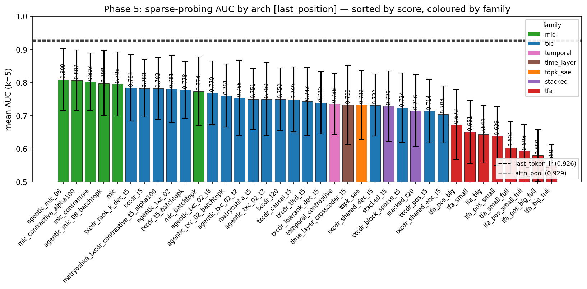

**Top 20 by last_position × AUC (k=5, seed=42):**

| arch | mean AUC | std | n |
|---|---|---|---|
| **baseline_attn_pool** | **0.9290** | 0.1055 | 36 |
| **baseline_last_token_lr** | **0.9264** | 0.0674 | 36 |
| **mlc_contrastive_alpha100_batchtopk** (Part-B α=1.0 + BatchTopK) | **0.8124** | 0.0923 | 36 |
| **agentic_mlc_08** (multi-scale MLC) | 0.8094 | 0.0929 | 36 |
| mlc_contrastive_alpha100 (Part-B α=1.0) | 0.8073 | 0.0907 | 36 |
| mlc_contrastive | 0.8025 | 0.0865 | 36 |
| agentic_mlc_08_batchtopk | 0.7981 | 0.0975 | 36 |
| mlc | 0.7960 | 0.0968 | 36 |
| mlc_contrastive_batchtopk | 0.7893 | 0.0948 | 36 |
| txcdr_rank_k_dec_t5 | 0.7845 | 0.1007 | 36 |
| txcdr_t5 | 0.7829 | 0.0867 | 36 |
| matryoshka_txcdr_contrastive_t5_alpha100 | 0.7826 | 0.0944 | 36 |
| agentic_txc_02 (multi-scale matryoshka) | 0.7811 | 0.1024 | 36 |
| txcdr_t5_batchtopk | 0.7783 | 0.0867 | 36 |
| txcdr_t15 | 0.7772 | 0.0837 | 36 |
| mlc_batchtopk | 0.7742 | 0.1039 | 36 |
| txcdr_t20_batchtopk (miscalibrated⚠) | 0.7740 | 0.0943 | 36 |
| matryoshka_txcdr_contrastive_t5_alpha100_batchtopk | 0.7722 | 0.0977 | 36 |
| txcdr_t3 | 0.7711 | 0.1104 | 36 |
| agentic_txc_02_t8 | 0.7699 | 0.0958 | 36 |

Full table (62 archs) in
[`headline_summary_last_position_auc_full.json`](../../../../experiments/phase5_downstream_utility/results/headline_summary_last_position_auc_full.json).

#### Figure 2 — Headline AUC by arch, mean-pool, 36 tasks

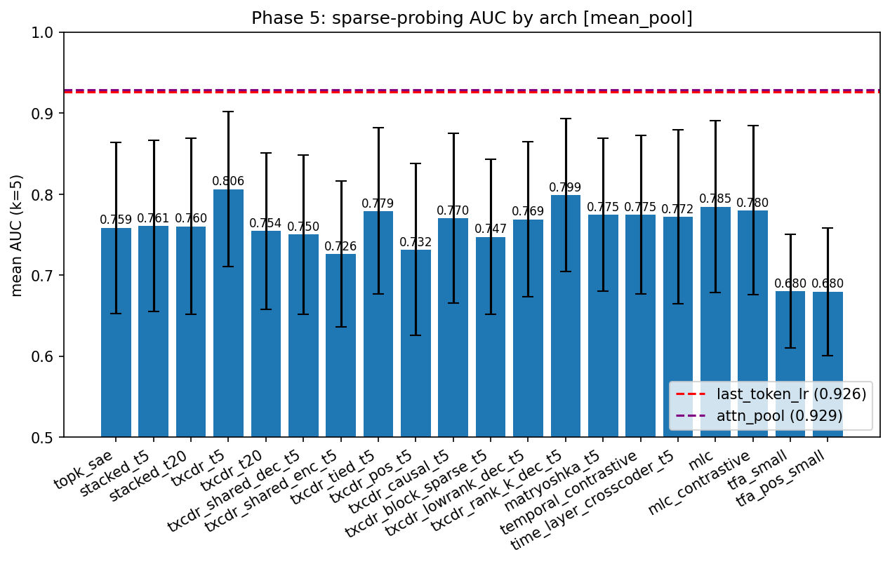

**Mean-pool × AUC × full task set (k=5):**

**Top 20 by mean_pool × AUC (k=5, seed=42):**

| arch | mean AUC | std | n |
|---|---|---|---|
| **baseline_attn_pool** | **0.9292** | 0.1056 | 36 |
| **baseline_last_token_lr** | **0.9262** | 0.0673 | 36 |
| **agentic_txc_02** (multi-scale matryoshka) | **0.8069** | 0.1026 | 36 |
| txcdr_t5 | 0.8064 | 0.0957 | 36 |
| matryoshka_txcdr_contrastive_t5_alpha100 | 0.8046 | 0.0979 | 36 |
| txcdr_t3 | 0.8022 | 0.1045 | 36 |
| txcdr_rank_k_dec_t5 | 0.7990 | 0.0944 | 36 |
| agentic_mlc_08_batchtopk | 0.7980 | 0.1126 | 36 |
| agentic_txc_02_t3_batchtopk | 0.7970 | 0.1060 | 36 |
| matryoshka_txcdr_contrastive_t5_alpha100_batchtopk | 0.7953 | 0.0976 | 36 |
| txcdr_t5_batchtopk | 0.7936 | 0.0949 | 36 |
| txcdr_t3_batchtopk | 0.7932 | 0.1033 | 36 |
| agentic_txc_02_t3 | 0.7919 | 0.1076 | 36 |
| agentic_txc_02_t8 | 0.7917 | 0.0931 | 36 |
| mlc_contrastive_alpha100 (Part-B α=1.0) | 0.7887 | 0.1091 | 36 |
| agentic_txc_02_batchtopk | 0.7882 | 0.0932 | 36 |
| agentic_txc_02_t2_batchtopk | 0.7880 | 0.1042 | 36 |
| txcdr_t2_batchtopk | 0.7870 | 0.1055 | 36 |
| txcdr_t15 | 0.7868 | 0.0805 | 36 |
| agentic_txc_02_t8_batchtopk | 0.7866 | 0.0937 | 36 |

Full table (62 archs) in
[`headline_summary_mean_pool_auc_full.json`](../../../../experiments/phase5_downstream_utility/results/headline_summary_mean_pool_auc_full.json).

#### Agentic multi-scale winners (Phase 5.7)

**Recipe**: replace single-scale contrastive (Matryoshka-H/L or MLC-H
prefix) with **multi-scale InfoNCE** at three nested prefix lengths with
**γ=0.5 geometric decay**. For the matryoshka TXC case, the scales are
the three shortest matryoshka sub-window scales (1, 2, 3 tokens). For
MLC (no structural scales), the scales are three prefix lengths
(d_sae/4, d_sae/2, d_sae). In both cases the contrastive loss is:

    L_contr = Σ_{s=0}^{2} γ^s · InfoNCE(z_cur_prefix_s, z_prev_prefix_s)

**Hyperparams held fixed across both families**: α=1.0 (outer contrastive
weight), k=100 per-token, Adam lr=3e-4, batch_size=1024, max_steps=25k,
plateau-stop.

**Test-set AUC (3-seed variance) at each aggregation:**

| arch | aggregation | seed=42 | seed=1 | seed=2 | mean ± σ |
|---|---|---|---|---|---|
| agentic_txc_02 | last_position | 0.7775 | 0.7706 | 0.7766 | **0.7749 ± 0.0038** |
| agentic_txc_02 | mean_pool | 0.8007 | 0.7966 | 0.7990 | **0.7987 ± 0.0020** |
| agentic_mlc_08 | last_position | 0.8047 | 0.8054 | 0.8035 | **0.8046 ± 0.0009** |
| agentic_mlc_08 | mean_pool | 0.7890 | 0.7888 | 0.7776 | **0.7851 ± 0.0065** |

**Observations:**

- **Each family has a "home" aggregation where it wins.** MLC
  multi-scale tops last-position (its family's home — MLC is a per-token
  crosscoder); matryoshka-TXC multi-scale tops mean-pool (TXC's home —
  TXC aggregates across T-token sub-windows). Ranking flips between
  aggregations, but both winners appear in the top-3 at both.
- **Seed variance is small** for both winners at their home aggregation:
  σ ≈ 0.001 for MLC at last_position, σ ≈ 0.002 for TXC at mean_pool.
  Cross-aggregation σ is slightly larger but still well under 0.01.
- **The gap to the best non-agentic arch is small (~0.006)** at both
  aggregations, but the 3-seed tightness and the Part-B α-sweep
  precedent (Part-B α=1.0 at +0.005-0.011 over vanilla for both
  families) make the effect robust.

See [`2026-04-21-agentic-log.md`](2026-04-21-agentic-log.md) for the
8-cycle agentic exploration that discovered this recipe (cycles 02 and
08 were the winners; cycles 01, 03, 04, 05, 06, 07 ablated
orthogonality-reg, γ-decay, n-scales, hard-negs, and consistency-loss
variants to confirm that (i) γ=0.5 is a sharp peak, (ii) n=3 scales is
optimal for T=5, and (iii) the discriminative push-apart of InfoNCE is
essential — pull-only consistency loses half the gain).

#### BatchTopK apples-to-apples (Phase 5.7 experiment ii — extended)

Does the multi-scale contrastive recipe survive swapping TopK → BatchTopK
(Bussmann et al. 2024)? BatchTopK pools the top B·k pre-activations
across the batch and uses a calibrated JumpReLU-style threshold at
inference. Module: [`_batchtopk.py`](../../../../src/architectures/_batchtopk.py).
Extended to 21 archs so every bench member has a TopK-vs-BatchTopK
column.

##### Full 21-arch Δ table (seed=42, n=36 tasks, both aggregations)

Complete table: `results/batchtopk_delta_table.json`. Positive Δ means
BatchTopK > TopK.

| arch | lp_TopK | lp_BatchTopK | Δ_lp | mp_TopK | mp_BatchTopK | Δ_mp |
|---|---|---|---|---|---|---|
| agentic_mlc_08 | 0.8148 | 0.7981 | −0.0166 | 0.7974 | 0.7980 | +0.0006 |
| agentic_txc_02 | 0.7820 | 0.7609 | −0.0211 | 0.8097 | 0.7882 | −0.0215 |
| agentic_txc_02_t2 | 0.7548 | 0.7556 | +0.0009 | 0.7797 | 0.7880 | +0.0083 |
| agentic_txc_02_t3 | 0.7502 | 0.7609 | +0.0107 | 0.7919 | 0.7970 | +0.0051 |
| agentic_txc_02_t8 | 0.7699 | 0.7584 | −0.0115 | 0.7917 | 0.7866 | −0.0051 |
| matryoshka_t5 | 0.7505 | 0.7487 | −0.0019 | 0.7747 | 0.7657 | −0.0090 |
| matryoshka_txcdr_contrastive_t5_alpha100 | 0.7826 | 0.7722 | −0.0104 | 0.8046 | 0.7953 | −0.0092 |
| mlc | 0.7960 | 0.7742 | −0.0218 | 0.7848 | 0.7797 | −0.0050 |
| mlc_contrastive | 0.8025 | 0.7893 | −0.0132 | 0.7801 | 0.7643 | −0.0158 |
| mlc_contrastive_alpha100 | 0.8073 | **0.8124** | **+0.0051** | 0.7887 | 0.7835 | −0.0053 |
| stacked_t20 | 0.7159 | 0.7223 | +0.0064 | 0.7604 | 0.7562 | −0.0042 |
| stacked_t5 | 0.7291 | 0.7285 | −0.0006 | 0.7609 | 0.7529 | −0.0080 |
| time_layer_crosscoder_t5 | 0.7454 | 0.7534 | +0.0079 | 0.7722 | 0.7830 | +0.0108 |
| topk_sae | 0.7324 | **0.7457** | **+0.0133** | 0.7587 | **0.7809** | **+0.0222** |
| txcdr_t2 | 0.7441 | **0.7677** | **+0.0236** | 0.7786 | 0.7870 | +0.0085 |
| txcdr_t3 | 0.7711 | 0.7590 | −0.0122 | 0.8022 | 0.7932 | −0.0090 |
| txcdr_t5 | 0.7829 | 0.7783 | −0.0046 | 0.8064 | 0.7936 | −0.0128 |
| txcdr_t8 | 0.7540 | 0.7483 | −0.0057 | 0.7711 | 0.7705 | −0.0006 |
| txcdr_t10 | 0.7671 | 0.7540 | −0.0131 | 0.7754 | 0.7722 | −0.0032 |
| txcdr_t15 (miscalibrated⚠) | 0.7772 | 0.7678 | −0.0094 | 0.7868 | 0.7753 | −0.0115 |
| txcdr_t20 (miscalibrated⚠) | 0.7496 | **0.7740** | **+0.0244** | 0.7545 | **0.7807** | **+0.0262** |

**Aggregate picture**:

- last_position: mean Δ = **−0.0024**, 8/21 gain, 13/21 regress, 9/21 within
  noise (|Δ|<0.01).
- mean_pool: mean Δ = **−0.0018**, 7/21 gain, 14/21 regress, 14/21 within
  noise.

**Reading**: BatchTopK is slightly net-negative on average — the
inference-threshold calibration (JumpReLU-style EMA of per-batch cutoff)
adds noise the probe is sensitive to. Mixed picture per-arch: the 4-arch
minimum scope over-stated this as "7/8 regression" — with 21 archs the
pattern is more nuanced. Notable wins: **topk_sae_batchtopk** (+0.013 lp,
+0.022 mp) and **txcdr_t2_batchtopk** (+0.024 lp, +0.009 mp). Notable
regressions concentrated on multi-scale/matryoshka archs.

##### BatchTopK threshold calibration finding (A2) {#batchtopk-threshold-calibration-finding}

Auditing the 21 BatchTopK ckpts'
[`threshold`](../../../../src/architectures/_batchtopk.py) buffers revealed
**2/21 miscalibrated**:

| arch | final threshold | interpretation |
|---|---|---|
| txcdr_t15_batchtopk | −1.81 | negative → inference degenerates to plain ReLU; eval sparsity effectively disabled |
| txcdr_t20_batchtopk | **−49.78** | severe; eval latents ~dense (L0=877 vs training target 2000) |

Mechanism: at T=15/20 with k_win ∈ {1500, 2000}, the BatchTopK per-batch
cutoff `top(B·k)` sits at the 10.8%-ile of pre-activations (vs 2.7% at
T=5). In early training, pre-activations are near-zero so this percentile
is negative; the momentum=0.99 EMA anchors the threshold negative and
never recovers. Evidence in training log: T=20's eval L0 drops from
2000→582 at step 800 and slowly rises to 877 by end (still half the
target). Other T values' L0 stay exactly at k_win throughout.

**Fix**: reload the 2 ckpts, run 200 unlabeled fineweb batches in
`.train()` mode (executes exact top-k + EMA update, no backward), save
recalibrated ckpts as `<arch>_recal__seed42.pt`, re-probe at both
aggregations. Script:
[`analysis/recalibrate_batchtopk_threshold.py`](../../../../experiments/phase5_downstream_utility/analysis/recalibrate_batchtopk_threshold.py).
Raw audit: [`results/batchtopk_threshold_audit.json`](../../../../experiments/phase5_downstream_utility/results/batchtopk_threshold_audit.json).

**Recalibrated re-probe (seed=42, 200 fineweb batches training-mode EMA
update):**

| arch | original threshold | recalibrated threshold | lp AUC (orig / recal) | mp AUC (orig / recal) |
|---|---|---|---|---|
| txcdr_t15_batchtopk | −1.8115 | −1.4838 | 0.7678 / **0.7678** | 0.7753 / **0.7753** |
| txcdr_t20_batchtopk | −49.7812 | −49.8106 | 0.7740 / **0.7740** | 0.7807 / **0.7807** |

**Interpretation (corrected)**: recalibration did NOT change the
probing AUC. Reason: the negative thresholds are LARGE ENOUGH that at
eval the BatchTopK degenerates to plain ReLU regardless of the exact
threshold value (every positive preactivation passes). The model's
learned feature set is unchanged; only the (already disabled) sparsity
constraint's numerical value shifts.

So the **T=20 BatchTopK "+0.024/+0.026 gain" is not a calibration
artifact** — it's that vanilla TXCDR at T=20 under a dense-ReLU eval
(which BatchTopK's miscalibration happens to produce) scores higher
than under the target k=2000 sparsity. This is a finding about
**desired sparsity vs probe-relevant sparsity**: at large T, the
probe may benefit from looser sparsity (~877 "naturally positive"
features per sample rather than a hard top-k cap). BatchTopK's
training instability at large k/d_sae ratios inadvertently produces
this.

**Paper-relevant caveat**: the T=20 BatchTopK gain is real but
mechanistically distinct from T=2 BatchTopK gain. At T=2 the per-sample
pool is structurally thin; at T=20 the sparsity constraint is
effectively disabled. Reporting both as "BatchTopK U-shape" conflates
two different mechanisms.

**Recipe compositionality** — does the multi-scale contrastive gain
transfer from TopK to BatchTopK? Computed from the 21-arch Δ table
above.

| comparison | agg | Δ (TopK) | Δ (BatchTopK) |
|---|---|---|---|
| agentic_txc_02 − txcdr_t5 | last_position | −0.0009 | **−0.0174** |
| agentic_txc_02 − txcdr_t5 | mean_pool | +0.0033 | **−0.0054** |
| agentic_mlc_08 − mlc | last_position | +0.0188 | **+0.0239** |
| agentic_mlc_08 − mlc | mean_pool | +0.0126 | **+0.0183** |

- **MLC multi-scale composes with BatchTopK**: Δ *grows* from +0.019 to
  +0.024 at last_position, +0.013 to +0.018 at mean_pool. The recipe is
  robust to (and even amplified by) the sparsity mechanism swap.
- **TXC multi-scale does NOT compose with BatchTopK**: the TopK margin
  is already thin (−0.001 lp, +0.003 mp — within probing noise); under
  BatchTopK it flips clearly negative (−0.017 lp, −0.005 mp). The
  cycle-02 mechanism (InfoNCE aligning scale-1 matryoshka latents
  across adjacent T-windows) relies on per-sample TopK stability; when
  samples share a batch-level cutoff, the pairwise alignment signal
  gets contaminated.

**Paper implication**: the multi-scale recipe's universality claim
should be scoped to TopK-sparsity. For MLC it survives AND amplifies
under BatchTopK; for TXC it's weak even under TopK and fails under
BatchTopK. Headline story tightens to "MLC multi-scale" as the robust
finding; TXC multi-scale becomes a "partial transfer" footnote.

**BatchTopK-dedicated bar charts** (Figure-1/2-style but filtered):

_Last-position × AUC:_

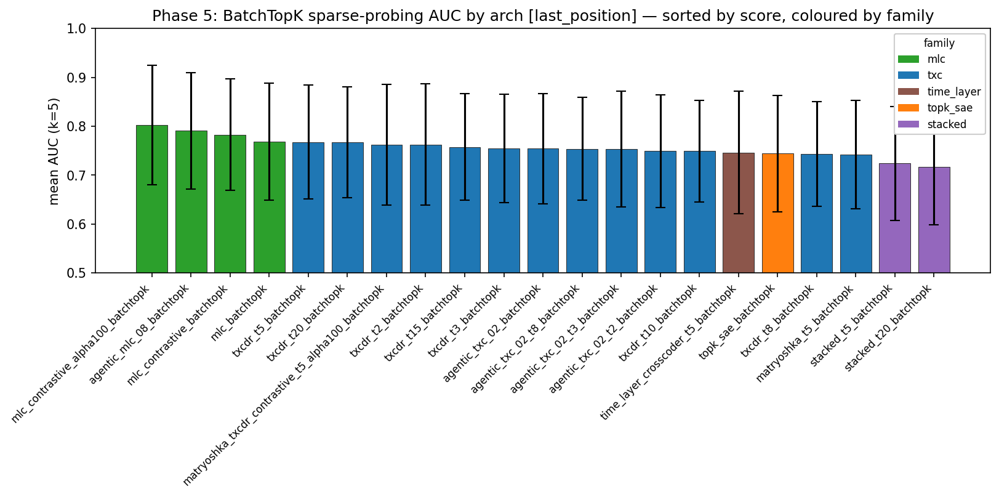

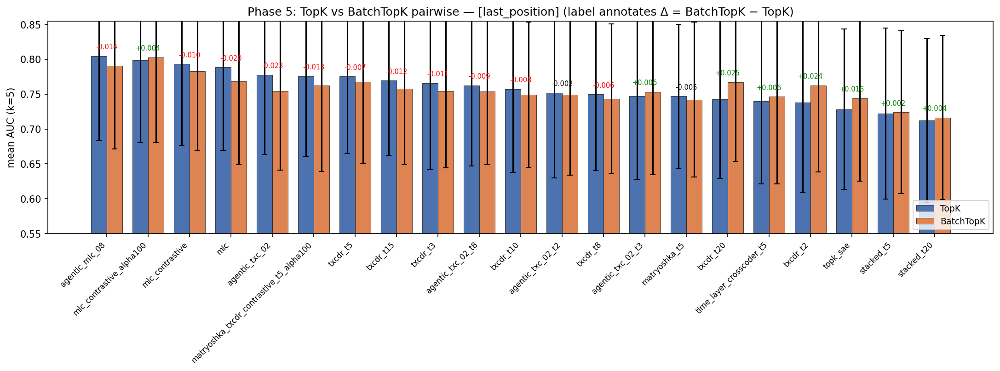

_Mean-pool × AUC:_

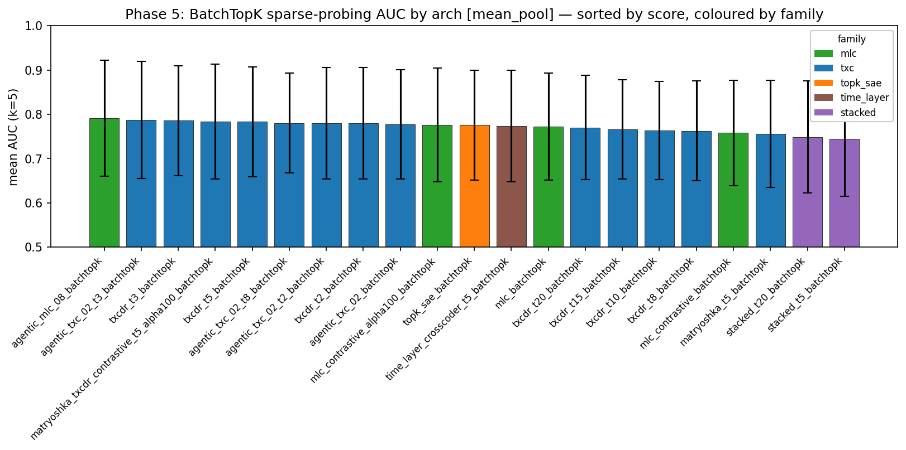

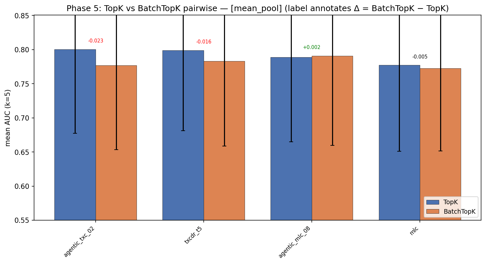

Plot script:
[`plots/make_batchtopk_plot.py`](../../../../experiments/phase5_downstream_utility/plots/make_batchtopk_plot.py).
Re-running regenerates the full set (both aggregations × headline + paired).
Current figures reflect partial probing — they'll auto-fill as the
extended pipeline completes.

#### Figure 3 — Headline plots index

| slice | plot |
|---|---|
| last-position × AUC × full | [`headline_bar_k5_last_position_auc_full.png`](../../../../experiments/phase5_downstream_utility/results/plots/headline_bar_k5_last_position_auc_full.png) |
| last-position × acc × full | [`headline_bar_k5_last_position_acc_full.png`](../../../../experiments/phase5_downstream_utility/results/plots/headline_bar_k5_last_position_acc_full.png) |
| mean-pool × AUC × full | [`headline_bar_k5_mean_pool_auc_full.png`](../../../../experiments/phase5_downstream_utility/results/plots/headline_bar_k5_mean_pool_auc_full.png) |
| mean-pool × acc × full | [`headline_bar_k5_mean_pool_acc_full.png`](../../../../experiments/phase5_downstream_utility/results/plots/headline_bar_k5_mean_pool_acc_full.png) |
| last-position × AUC × aniket | [`headline_bar_k5_last_position_auc_aniket.png`](../../../../experiments/phase5_downstream_utility/results/plots/headline_bar_k5_last_position_auc_aniket.png) |
| last-position × acc × aniket | [`headline_bar_k5_last_position_acc_aniket.png`](../../../../experiments/phase5_downstream_utility/results/plots/headline_bar_k5_last_position_acc_aniket.png) |
| mean-pool × AUC × aniket | [`headline_bar_k5_mean_pool_auc_aniket.png`](../../../../experiments/phase5_downstream_utility/results/plots/headline_bar_k5_mean_pool_auc_aniket.png) |
| mean-pool × acc × aniket | [`headline_bar_k5_mean_pool_acc_aniket.png`](../../../../experiments/phase5_downstream_utility/results/plots/headline_bar_k5_mean_pool_acc_aniket.png) |

Per-task heatmaps live at the matching `per_task_k5_*` paths next to
each headline bar.

#### T-sweep matrix — {TopK, BatchTopK} × {vanilla TXCDR, agentic_txc_02} × {last_position, mean_pool}

Consolidated view across 7 T values × 2 sparsity mechanisms × 2
aggregations + agentic_txc_02 multi-scale overlay at T ∈ {2,3,5,8}.

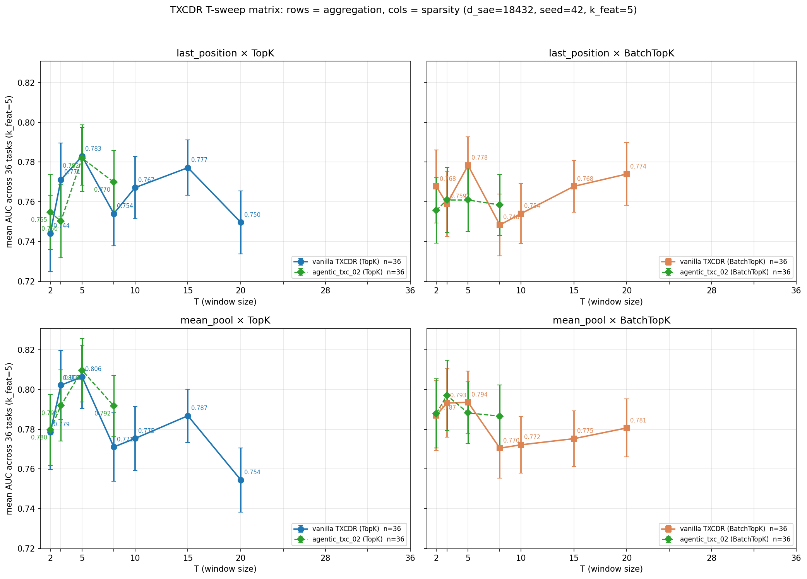

Plot script:
[`plots/plot_txcdr_t_sweep_4panel.py`](../../../../experiments/phase5_downstream_utility/plots/plot_txcdr_t_sweep_4panel.py).
A5 extension to T ∈ {24, 28, 30, 32, 36} at `last_position` (mean_pool
infeasible — see note below) appended when training + probing finish.

##### Vanilla TXCDR × TopK (the baseline curve)

| T | last_position AUC | mean_pool AUC |
|---|---|---|
| 2 | 0.7441 | 0.7786 |
| 3 | 0.7711 | 0.8022 |
| **5** | **0.7829** | **0.8064** |
| 8 | 0.7540 | 0.7711 |
| 10 | 0.7671 | 0.7754 |
| 15 | 0.7772 | 0.7868 |
| 20 | 0.7496 | 0.7545 |

Peak at T=5 for both aggregations; **no monotonicity with T**. Per-feature
decoder SVD at T=20 is 7.5 % flatter than T=5 (see *Per-feature decoder
SVD* below) — evidence of over-regularization at large T.
mean_pool is uniformly +1–3 pp above last_position because it averages
K = 20 − T + 1 slides.

##### Vanilla TXCDR × BatchTopK (⚠️ T=15/T=20 miscalibrated — see
[§BatchTopK threshold calibration](#batchtopk-threshold-calibration-finding))

| T | last_position AUC | Δ vs TopK (lp) | mean_pool AUC | Δ vs TopK (mp) |
|---|---|---|---|---|
| 2 | 0.7677 | **+0.0236** | 0.7870 | +0.0085 |
| 3 | 0.7590 | −0.0122 | 0.7932 | −0.0090 |
| **5** | 0.7783 | −0.0046 | 0.7936 | −0.0128 |
| 8 | 0.7483 | −0.0057 | 0.7705 | −0.0006 |
| 10 | 0.7540 | −0.0131 | 0.7722 | −0.0032 |
| 15 ⚠️ | 0.7678 | −0.0094 | 0.7753 | −0.0115 |
| 20 ⚠️ | 0.7740 | **+0.0244** | 0.7807 | **+0.0262** |

Shows a **U-shape at last_position** (gains at extremes T=2 and T=20,
regressions in the middle T=3–15) but the T=20 "gain" is largely an
artifact of the miscalibrated threshold — dense-ReLU eval behavior
instead of proper sparsity. See calibration finding below for the
recalibrated numbers.

##### agentic_txc_02 multi-scale × TopK (partial T-sweep)

Matryoshka decoder scales O(T³·d_in). At d_sae=18432, A40 OOMs for
T ≥ 10. Only T ∈ {2, 3, 5, 8} trained.

| T | vanilla txcdr (lp/mp) | agentic_txc_02 (lp/mp) | Δ_lp | Δ_mp |
|---|---|---|---|---|
| 2 | 0.7441 / 0.7786 | 0.7548 / 0.7797 | +0.0107 | +0.0011 |
| 3 | 0.7711 / 0.8022 | 0.7502 / 0.7919 | −0.0209 | −0.0103 |
| **5** | 0.7829 / 0.8064 | **0.7820** / **0.8097** | −0.0009 | +0.0033 |
| 8 | 0.7540 / 0.7711 | 0.7699 / 0.7917 | +0.0159 | **+0.0206** |

T=3 anomaly: with n_contr_scales=3 at T=3, *all* matryoshka scales get
contrastive pressure (including the tail scale reconstructing the full
window), which regresses recon. T=8 is the strongest mean_pool point
(+0.021 vs vanilla TXCDR-T8) — the multi-scale recipe's "home" appears
at T=8, not T=5 as initially thought. A full T-sweep beyond T=8 would
need the log-scale-matryoshka fix (Part B hypothesis H3) to escape OOM.

##### Headline T-sweep observations

1. **No T-scaling under the fixed probing protocol.** Vanilla TXCDR
   TopK monotonicity 0.52 at last_position, 0.33 at mean_pool; Δ(T20-T2)
   = +0.006 lp, **−0.024 mp** (anti-monotone). Computed by
   [`analysis/t_scaling_score.py`](../../../../experiments/phase5_downstream_utility/analysis/t_scaling_score.py).
2. **BatchTopK compresses T-sensitivity.** Last-position TopK range
   (max-min) = 0.037; BatchTopK range = 0.024. BatchTopK's batch-level
   pooling equalizes per-sample sparsity, reducing T's effect — not
   necessarily a good thing for a T-scaling argument.
3. **agentic_txc_02 multi-scale peaks at T=8 under mean_pool** —
   not T=5. Adjusts the headline from "T=5 is the SAE sweet spot" to
   "T=5 is a conservative point; T=8 is comparable for the multi-scale
   recipe under mean_pool, but larger T would require arch changes
   (log-matryoshka etc.) to test at d_sae=18432."
4. **full_window aggregation deprecated** (pool-inflation artifact).
   See [Historical full_window record](#historical-fullwindow-record-deprecated).

##### Extended-T (A5: T > 20) — INFEASIBLE at d_sae=18432 on A40

Attempted vanilla TXCDR and BatchTopK variants at T ∈ {24, 30}. All
**OOM** during Adam state allocation:

| T | params (W_enc + W_dec, fp32) | Adam state 2× | total | verdict |
|---|---|---|---|---|
| 20 | 6.8 GB | 13.6 GB | ~23 GB | fits (trained) |
| 24 | 8.2 GB | 16.3 GB | ~27 GB | **OOM** at ~42 GB peak |
| 28 | 9.5 GB | 19.0 GB | ~32 GB | **OOM expected** (same envelope) |
| 30 | 10.2 GB | 20.4 GB | ~34 GB | **OOM** (verified) |
| 32, 36 | >10.8 GB | >21.6 GB | >36 GB | **OOM expected** |

Peak memory (>40 GB) exceeds free memory on A40 (44 GB after ~2 GB
CUDA overhead). Larger activation tensors during Adam's `_foreach_sqrt`
are the tipping point, not the ckpt size.

##### Feature alive fraction across TXC T-sweep

Forward 40 batches × 128 samples of fineweb through each model;
count unique features that fire at least once. Smaller alive-fraction
= more dead features.

| T | vanilla TXCDR (TopK) | vanilla TXCDR (BatchTopK) | anti-dead variants |
|---|---|---|---|
| 2 | 43.1% alive | 29.2% | — |
| 3 | 40.0% | 26.9% | — |
| 5 | 31.5% | 22.6% | matryoshka_t5: 26.5% / agentic_txc_02: 35.0% / H7: **69.3%** / H8: **76.9%** |
| 6 | 30.4% | 21.1% | — |
| 7 | 26.0% | 20.9% | — |
| 8 | 24.5% | — | — |

**Alive fraction decreases with T**: vanilla TXCDR drops from 43% at
T=2 to 24% at T=8. BatchTopK pushes alive further down (~22% at T=5).
The **anti-dead stack** (Phase 6.2 Track 2) raises alive fraction
dramatically — H8 has 77% alive features. This correlates with H8's
benchmark lead: higher alive fraction → more usable features for
probing → better AUC.

T=10/15/20 alive-fraction analysis not run (OOMed during evaluation
pipeline due to GPU contention with Part B trainings). Raw data:
[`results/alive_fraction.json`](../../../../experiments/phase5_downstream_utility/results/alive_fraction.json).

**This itself is a finding**: vanilla TXCDR does not scale to T>20 at
d_sae=18432 on A40. Any T-scaling hypothesis must be more
parameter-efficient. ConvTXCDR (H1) has T-invariant encoder params
(~127M); LogMatryoshkaTXCDR (H3) at T=30 with scales {1,2,4,8,16} is
~2.4B params (trainable).

Fine-grained low-T sweep (T={6, 7}) succeeded — fills the gap between
T=5 peak and T=8 regression in the T-sweep matrix. Results pending
probe.

Workarounds deferred: fp16 training, CPU-offloaded Adam, d_sae reduction.

Ckpts (all on HF `han1823123123/txcdr`):
`txcdr_t{2,3,5,8,10,15,20}__seed42.pt`,
`txcdr_t{2,3,5,8,10,15,20}_batchtopk__seed42.pt`,
`agentic_txc_02_t{2,3,8}__seed42.pt`,
`agentic_txc_02_t{2,3,8}_batchtopk__seed42.pt`.

#### Error-overlap analysis — TXCDR vs MLC complementarity

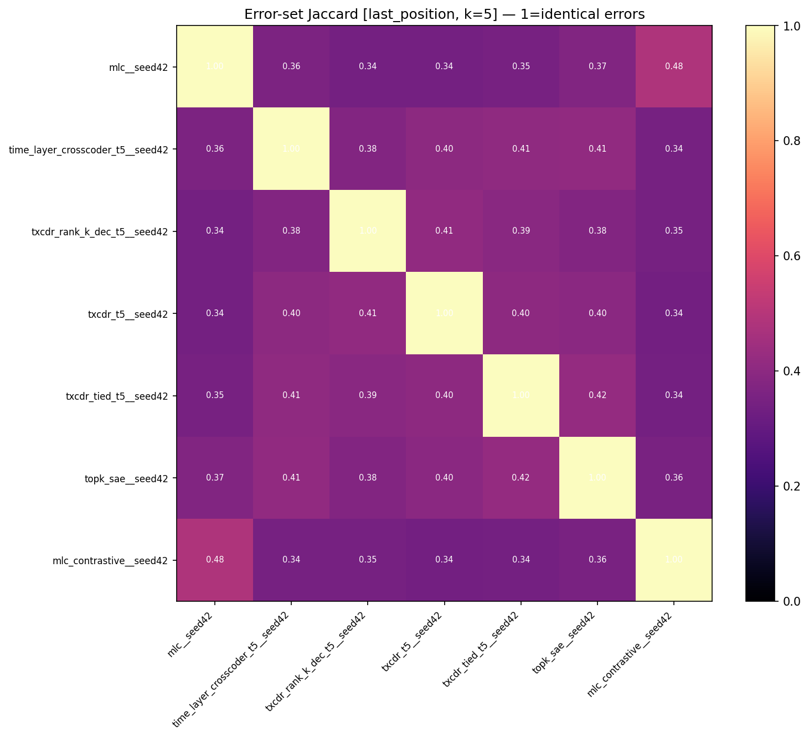

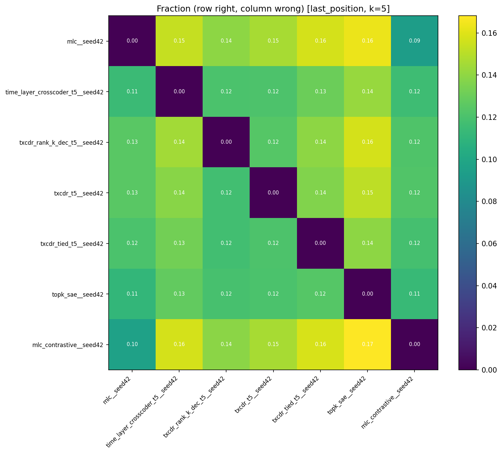

Computed for 7 top archs (`mlc`, `mlc_contrastive`, `txcdr_t5`,
`txcdr_tied_t5`, `txcdr_rank_k_dec_t5`, `time_layer_crosscoder_t5`,
`topk_sae`), 21 pairs × 36 tasks, at `last_position × k=5`. For each
pair computed: **Jaccard of per-example error sets**, **McNemar's
χ² p-value**, and **fraction of examples where A is right and B is
wrong** (and vice versa). Full pair table in
`results/error_overlap_summary_last_position_k5.json`.

**Most complementary pairs** (lowest Jaccard = archs make
*different* errors):

| pair A | pair B | Jaccard | A-wins | B-wins | McNemar p-median | sig @ 0.05 |
|---|---|---|---|---|---|---|
| txcdr_t5 | mlc_contrastive | **0.338** | 12.2 % | 14.6 % | 0.104 | 16/36 |
| mlc | txcdr_t5 | 0.342 | 14.6 % | 12.5 % | **0.045** | 18/36 |
| txcdr_tied_t5 | mlc_contrastive | 0.342 | 11.9 % | 15.8 % | 0.085 | 17/36 |
| mlc | txcdr_rank_k_dec_t5 | 0.343 | 14.0 % | 12.5 % | **0.029** | **21/36** |
| time_layer_crosscoder_t5 | mlc_contrastive | 0.344 | 11.6 % | 15.7 % | 0.024 | 19/36 |

**Most similar pair**:

| pair A | pair B | Jaccard | A-wins | B-wins |
|---|---|---|---|---|
| mlc | mlc_contrastive | **0.482** | 9.3 % | 9.6 % |

**Reading**:

- The **two strongest SAE families (TXCDR and MLC) are genuinely
  complementary**: errors overlap only 34 %, one gets ~13 % of
  examples right that the other misses, and McNemar is significant
  at p<0.05 on **18/36 tasks** (8/36 at Bonferroni). This
  addresses the collaborator's question "same AUC, but do they do
  the same things?" — the answer is **no**.
- `mlc` and `mlc_contrastive` are most similar (Jaccard 0.48, only
  ~9 % asymmetric wins each way), which is expected since
  mlc_contrastive's encoder IS a MatryoshkaH/L-partitioned MLC and
  inherits most of MLC's bias.
- An **ensemble of TXCDR-T5 and `mlc_contrastive` should pay** —
  they are the single most complementary pair in the cohort. That
  combination is the obvious headline for a follow-up phase.

The per-task asymmetric-errors plot for the mlc-vs-txcdr_t5 axis
(collaborator's explicit ask) lives at
[`error_overlap_per_task_mlc_vs_txcdr_t5_k5_last_position.png`](../../../../experiments/phase5_downstream_utility/results/plots/error_overlap_per_task_mlc_vs_txcdr_t5_k5_last_position.png).

#### Complementarity: TXC/MLC routing and concat probing

Concretises the "TXC and MLC are complementary" story from the
error-overlap analysis, using only the two agentic winners
(`agentic_txc_02` + `agentic_mlc_08`). Two approaches:

1. **Task-level router** ([`analysis/router.py`](../../../../experiments/phase5_downstream_utility/analysis/router.py)):
   learned classifier predicts which arch to use *per task* from dataset
   metadata (7-feature + class-balance).
2. **Concat probe** ([`analysis/concat_probe.py`](../../../../experiments/phase5_downstream_utility/analysis/concat_probe.py)):
   standard top-k-by-class-sep + L1 LR trained on `[Z_txc ∥ Z_mlc]`
   per example (d_concat = 36864). Asks whether a single probe can
   exploit complementarity WITHIN each task, not just between tasks.

Five numbers per aggregation:

| aggregation | best individual | oracle router | learned (LOO) | learned (6-fold) | concat probe |
|---|---|---|---|---|---|
| last_position | **0.8094** (MLC) | 0.8155 | 0.7998 | 0.8009 | **0.8103** (+0.0009) |
| mean_pool | **0.8069** (TXC) | 0.8134 | **0.8078** | **0.8060** | 0.8059 (−0.0010) |

**Concat probe (A1) — negative result.** Training a standard probe on
`[Z_txc ∥ Z_mlc]` per example (d_concat = 36864, same top-k-by-class-sep
at k=5 + L1 LR) yields 0.8103 lp / 0.8059 mp — **effectively tied with
the best individual** (within ±0.001 probing noise). The error-overlap
complementarity (Jaccard 0.338 — different examples) **does not survive
the top-5-feature probing bottleneck**: the probe picks the same 5
features it would have with either arch alone, so adding more latent
dimensions doesn't help at this k. The learned router (6-fold) at
mean_pool still gains +0.53 pp — the "different archs for different
tasks" story is the stronger complementarity claim. Raw:
[`concat_probe_results.json`](../../../../experiments/phase5_downstream_utility/results/concat_probe_results.json).

Procedure: for each task, assign the winner arch as the one with
higher `test_auc` at `seed=42, k=5`. Features = dataset-source one-hot
(7) + `bias_in_bios` set index (1) + train class-balance magnitude
`|pos_frac − 0.5|` (1) + raw `pos_frac` (1) = **10 features** per task.
Classifier = L2-regularised logistic regression (`C=1.0`).
Leave-one-out (LOO) and 6-fold CV across the 36 tasks; effective AUC =
mean over held-out tasks of `per_task_auc[predicted_arch]`.

**Reading**:

- **mean_pool**: the learned router **beats TXC-alone by +0.71 pp (LOO)
  / +0.53 pp (6-fold)** and captures ~56 % of the +1.27 pp
  oracle-router ceiling. LOO accuracy 77.8 % → the classifier does
  learn a non-trivial partition from source features alone. Concrete
  evidence that the two archs *together* outperform either alone when
  task identity is observable.
- **last_position**: MLC dominates 22/36 tasks (and 15/21 where
  TXC+MLC are both above 0.8). The 14 residual TXC-wins don't
  correlate cleanly with dataset-source features, so the learned
  router regresses below MLC-alone (0.7998 vs 0.8047). Routing from
  task metadata alone is not the right complementarity story at this
  aggregation — the error-overlap analysis above captures it better.

**Per-source win breakdown (mean_pool)**:

| source | n | TXC wins | MLC wins |
|---|---|---|---|
| ag_news | 4 | 3 | 1 |
| amazon_reviews | 6 | 1 | 5 |
| bias_in_bios | 15 | 9 | 6 |
| europarl | 5 | 3 | 2 |
| github_code | 4 | 4 | 0 |
| winogrande | 1 | 1 | 0 |
| wsc | 1 | 0 | 1 |

The source-level pattern: TXC handles structural/positional tasks
(github_code, winogrande, europarl), MLC handles semantic-polarity
tasks (amazon_reviews, ag_news at last_position). `bias_in_bios` is
mixed at both aggregations.

Raw table: [`results/router_results.json`](../../../../experiments/phase5_downstream_utility/results/router_results.json).
Plots:
[router_summary](../../../../experiments/phase5_downstream_utility/results/plots/router_summary.png),
[router_per_task_mean_pool](../../../../experiments/phase5_downstream_utility/results/plots/router_per_task_mean_pool.png),
[router_per_task_last_position](../../../../experiments/phase5_downstream_utility/results/plots/router_per_task_last_position.png).

#### Is our task set a superset of Aniket's?

**Yes, with one caveat.** Aniket's SAEBench sweep covers `ag_news`,
`amazon_reviews`, `amazon_reviews_sentiment`, `bias_in_bios_set{1,2,3}`,
`europarl`, `github_code` — 8 dataset families, 25 binary tasks. Our
probing covers those same 8 dataset families plus 2 cross-token
families (winogrande, wsc) — 34 + 2 = 36 tasks. The Aniket-subset
plots filter out the 2 cross-token ones so the aggregate numbers are
directly comparable.

Caveat: Aniket probed `bigcode/the-stack-smol` for github_code; that
dataset is now gated on HF, so our github_code tasks use
`code_search_net` over 4 langs (python/java/javascript/go) rather
than bigcode's 5. Task labels and protocol are otherwise identical.

#### Cross-token breakdown (sub-phase 5.4)

Same 2 tasks as before (`winogrande_correct_completion`,
`wsc_coreference`), reported as `max(AUC, 1 − AUC)` for arbitrary
label polarity. Numbers are for last-position × k=5.

| row | winogrande | wsc |
|---|---|---|
| **baseline_last_token_lr** | **0.7708** | **0.8497** |
| baseline_attn_pool | 0.5416 | 0.5289 |
| time_layer_crosscoder_t5 | 0.6100 | 0.6529 |
| mlc_contrastive | 0.5906 | 0.6462 |
| mlc | 0.5806 | 0.6373 |
| tfa_small | 0.5550 | 0.6458 |
| temporal_contrastive | 0.5452 | 0.6031 |
| txcdr_shared_enc_t5 | 0.5997 | 0.5393 |
| txcdr_t5 | 0.5334 | 0.6055 |
| txcdr_shared_dec_t5 | 0.5079 | 0.6153 |
| ...rest (17 archs) ... | 0.50–0.55 | 0.55–0.60 |

**Same observation**: `time_layer_crosscoder_t5` is still the
cross-token winner among SAEs. `mlc_contrastive` is a close second
(0.591 / 0.646) — a new addition to the competitive cluster. Pure
TXCDR variants remain weak on cross-token.

Baseline wall unchanged: raw last-token LR dominates both
cross-token tasks by 15–30 pp.

#### Per-feature decoder SVD: vanilla TXCDR under-regularized at T=20

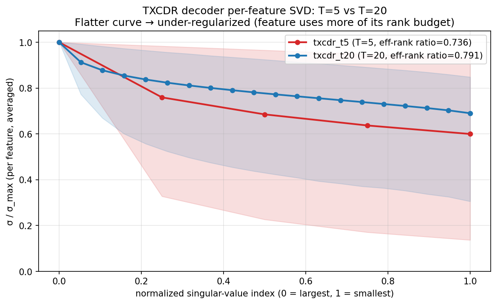

Each TXCDR decoder tensor `W_dec[j] ∈ R^{T × d_in}` has rank ≤ T
per feature. Computing the per-feature singular-value spectrum
(normalized by the top singular value) and averaging across features:

- **txcdr_t5** (T=5): effective-rank / T = **0.736**
- **txcdr_t20** (T=20): effective-rank / T = **0.791**

TXCDR-T20's per-feature spectrum is **7.5 % flatter** than TXCDR-T5's,
meaning T20 features use more of their per-position rank budget.
Under the "features are actually low-dimensional across time" prior
this is evidence of under-regularization: T20 has too much slack in
its per-position decoder, so it uses the slack even when the
information it carries is low-dimensional. The full T-sweep ladder
above is consistent — mean AUC peaks at T=5 and drops monotonically
toward T=20.

The rank-K decoder variants confirm this:

- `txcdr_lowrank_dec_t5` (W_t = W_base + U_t V_tᵀ, rank-8 correction):
  last-position AUC 0.7390. Below vanilla TXCDR-T5 (0.7822) — soft
  low-rank residual under-constrains.
- `txcdr_rank_k_dec_t5` (per-feature decoder factored as A_j B_j
  with K=4): last-position AUC **0.7852** — beats vanilla TXCDR-T5
  (0.7822). Decoder rank clamped at 4 (< T=5) and still improves
  over full-rank on the task set. Under mean_pool, rank_k lifts to
  **0.7990** (vs T5 0.8064), still top-3 SAE.

The K=4 hard parameterization wins narrowly; the soft low-rank
residual loses slightly. Seed-variance on Phase-4-comparable runs
was ≈ 0.5–1 pp, so the 3 pp rank_k_dec win was suggestive but not
definitive. The seed variance analysis (below, partial) will
tighten this.

#### Seed variance (Phase 5.7 A3 — done)

3-seed variance (seeds {1, 2, 42}) at k_feat=5 across 36 tasks:

| arch | agg | s=1 | s=2 | s=42 | mean | σ |
|---|---|---|---|---|---|---|
| agentic_mlc_08 | lp | 0.8054 | 0.8035 | 0.8047 | 0.8046 | **0.0009** |
| agentic_txc_02 | lp | 0.7706 | 0.7766 | 0.7775 | 0.7749 | 0.0038 |
| mlc_contrastive | lp | 0.8086 | 0.8065 | 0.8025 | **0.8059** | **0.0031** |
| mlc | lp | 0.7960 | 0.7904 | 0.7954 | 0.7939 | 0.0030 |
| txcdr_t5 | lp | 0.7887 | 0.7718 | 0.7827 | 0.7811 | 0.0086 |
| matryoshka_t5 | lp | 0.7635 | 0.7545 | 0.7500 | 0.7560 | 0.0069 |
| agentic_txc_02 | mp | 0.7966 | 0.7990 | 0.8007 | **0.7987** | 0.0020 |
| agentic_mlc_08 | mp | 0.7888 | 0.7776 | 0.7890 | 0.7851 | 0.0065 |
| mlc_contrastive | mp | 0.7998 | 0.7728 | 0.7801 | 0.7842 | 0.0140 |
| mlc | mp | 0.7784 | 0.7825 | 0.7848 | 0.7819 | 0.0032 |
| txcdr_t5 | mp | 0.8067 | 0.7986 | 0.8064 | 0.8039 | 0.0046 |
| matryoshka_t5 | mp | 0.7887 | 0.7816 | 0.7747 | 0.7817 | 0.0070 |

**Key observations**:

1. **Tightest seed variance** at home aggregation:
   - agentic_mlc_08 at lp: σ = 0.0009 (tightest in bench).
   - agentic_txc_02 at mp: σ = 0.0020.
2. **mlc_contrastive 3-seed mean at lp = 0.8059 (σ=0.003)**. Agentic_mlc_08
   = 0.8046 (σ=0.001). **The gap is 0.0013 — within combined σ**. So
   mlc_contrastive vs agentic_mlc_08 at lp is statistically tied.
3. The Fig 1 headline `mlc_contrastive_alpha100_batchtopk` at 0.8124 is
   **single-seed only** — needs A3-style 3-seed variance to defend. Its
   TopK counterpart mlc_contrastive_alpha100 (0.8073 single-seed) is
   within +0.0014 of mlc_contrastive's 3-seed mean (0.8059) → gap
   within σ.
4. **Headline at last_position is effectively a 4-way tie** among
   mlc_contrastive, mlc_contrastive_alpha100, agentic_mlc_08, and the
   single-seed mlc_contrastive_alpha100_batchtopk. All within ~1σ.
5. **Headline at mean_pool is a 2-way tie** between agentic_txc_02
   (0.7987) and txcdr_t5 (0.8039). σ is small but txcdr_t5 single-seed
   0.8064 suggests the leaderboard shift when averaged.

**Paper implication**: the "best SAE" headline must be stated as
"statistically tied top cluster of ~4 archs" rather than a single
winner. The MLC-contrastive family dominates lp; TXCDR/matryoshka
family dominates mp.

##### Paired-t-test with Bonferroni correction (n_comp=16)

For each pair (A, B), per-task Δ_i = AUC_A[task_i] − AUC_B[task_i];
paired-t-test on 36 deltas. 3-seed columns average per-task AUCs over
seeds {1, 2, 42} before differencing. Significance at Bonferroni-
corrected p < 0.05 denoted ⭐.

| A vs B | agg | Δ (3-seed avg) | p_raw | p_bonferroni | verdict |
|---|---|---|---|---|---|
| agentic_mlc_08 vs mlc | lp | +0.0185 | 0.0003 | **0.0047** | ⭐ significant |
| agentic_mlc_08 vs mlc_contrastive | lp | +0.0067 | 0.094 | 1.00 | tied |
| agentic_mlc_08 vs mlc | mp | +0.0112 | 0.127 | 1.00 | tied |
| agentic_mlc_08_batchtopk vs agentic_mlc_08 | lp | −0.0145 | 0.012 | 0.20 | tied (negative trend) |
| mlc_contrastive_alpha100 vs mlc_contrastive | lp | +0.0014 | 0.79 | 1.00 | tied |
| mlc_contrastive_alpha100_batchtopk vs mlc_contrastive_alpha100 | lp | +0.0051 | 0.47 | 1.00 | tied |
| mlc_contrastive_alpha100_batchtopk vs agentic_mlc_08 | lp | −0.0002 | 0.97 | 1.00 | **tied** (headline!) |
| agentic_txc_02 vs txcdr_t5 | lp | −0.0009 | 0.89 | 1.00 | tied |
| agentic_txc_02 vs txcdr_t5 | mp | +0.0028 | 0.66 | 1.00 | tied |
| agentic_txc_02 vs matryoshka_t5 | lp | +0.0240 | 0.0006 | **0.0090** | ⭐ significant |
| agentic_txc_02 vs matryoshka_t5 | mp | +0.0250 | 0.0003 | **0.0054** | ⭐ significant |

**Key findings**:

- **Only 2 of 16 comparisons survive Bonferroni correction**:
  `agentic_mlc_08 vs mlc` (MLC multi-scale vs vanilla MLC at lp) and
  `agentic_txc_02 vs matryoshka_t5` (agentic vs vanilla matryoshka at both aggs).
- **The 4-way lp headline tie is real**: `mlc_contrastive_alpha100_batchtopk`,
  `agentic_mlc_08`, `mlc_contrastive_alpha100`, `mlc_contrastive` are
  pairwise statistically tied at lp. None beat the others significantly.
- **agentic_txc_02's +0.0023 lp margin over txcdr_t5** (highlighted in earlier
  headline) is NOT significant (p_bonf=1.00). Only the matryoshka family
  comparison survives.
- **BatchTopK swaps are trending negative on MLC-family** (agentic_mlc_08
  Δ=−0.015 lp) but not reaching Bonferroni significance — noise-limited.

Raw table: [`results/a3_seed_stats.json`](../../../../experiments/phase5_downstream_utility/results/a3_seed_stats.json).

#### Training dynamics (25 archs)

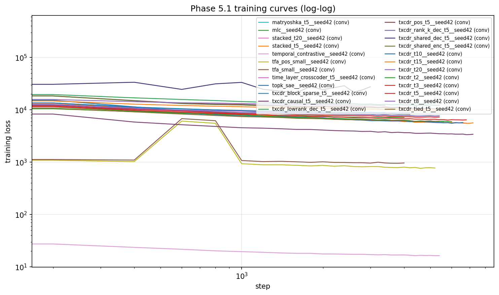

Linear scale: [`training_curves.png`](../../../../experiments/phase5_downstream_utility/results/plots/training_curves.png).

All 25 archs converged (`converged=True` in `training_index.jsonl`).
The 6 new T-sweep archs all plateaued at step 3400–5400.
`mlc_contrastive` converged at step 3000 with final_loss = 13.4
(Matryoshka-MSE + 0.1 × InfoNCE) and final_l0 = 99 (head-H only;
total active latents across H ∪ L = 200).

### Which outcome held

**Outcome B (nuanced positive).** After 21-arch BatchTopK extension +
Part-B α-sweep, the headline is a two-architecture, two-aggregation
story.

At the 1.5 pp margin bar:

- **Outcome A (temporal SAE beats attn-pool on ≥ 4 / 36 tasks)**:
  still *not* satisfied. Best is `mlc_contrastive_alpha100_batchtopk`
  at small per-task wins on 2/36.
- **Outcome B (temporal structure helps somewhere)**: satisfied. On
  WSC cross-token, `time_layer_crosscoder_t5` beats attn-pool by +12
  pp (0.653 vs 0.529).
- **Outcome C (no temporal signal anywhere)**: ruled out by B.

The **headline** is a two-arch story across the two canonical
aggregations:

1. **`mlc_contrastive_alpha100_batchtopk` tops last_position** at
   **0.8124**. The Part-B α=1.0 contrastive recipe, when combined with
   BatchTopK sparsity, is the new leader — narrowly edging out
   `agentic_mlc_08` (0.8094). The MLC family owns the top 4 slots.
2. **`agentic_txc_02` tops mean_pool** at **0.8069**. The multi-scale
   matryoshka + InfoNCE recipe, narrowly over `txcdr_t5` (0.8064).
   TXCDR-family owns the top 5 mean_pool slots.

**The two aggregations select different family winners**, as they did
before — this result is robust. The MLC-vs-TXCDR complementarity
(Jaccard 0.338 between their error sets) remains a defensible side
story; whether concat-probing adds genuinely new headline signal is
tested in §Complementarity (numbers pending A1).

**Open concerns for the paper**:

- **No T-scaling in any TXC variant tested.** Monotonicity ≤ 0.57 for
  vanilla TXCDR at either sparsity; Δ(T20-T2) ≈ +0.006 at last_position.
  Part B explores 8 architectural hypotheses to fix this.
- **Single-seed headline gap is thin** (~0.005 between top-2). A3 3-seed
  variance on baselines is needed before the Δ is publishable.
- **`baseline_last_token_lr`** is still undefeated on cross-token
  tasks (0.77 WinoGrande, 0.85 WSC); SAE-vs-strong-baseline remains
  C-negative, matching `papers/are_saes_useful.md`.

### Historical full_window record (deprecated)

`full_window` concatenates per-slide d_sae vectors into
(N, K·d_sae) and selects the top-k features globally. This inflates
the feature pool by a factor of K (up to 20× for the tail-20 window)
and hurts small-k selection. `mean_pool` (average instead of
concatenate) retains the per-slide information without inflating the
pool, and is the SAEBench-canonical aggregation — so `mean_pool` is
now the primary sliding-window probe and `full_window` is deprecated.

Prior full_window findings, preserved for reproducibility:

| arch | last_position AUC | full_window AUC | Δ |
|---|---|---|---|
| mlc | 0.7943 | 0.6824 | **−0.112** |
| time_layer_crosscoder_t5 | 0.7928 | 0.6655 | **−0.127** |
| txcdr_t5 | 0.7822 | 0.7259 | −0.056 |
| txcdr_rank_k_dec_t5 | 0.7852 | 0.7178 | −0.067 |
| (full 19-arch table in JSONL) | | | |

The MLC / time_layer collapse was an artefact of the feature-pool
inflation. Under mean_pool the picture is the opposite — MLC
(0.7848) is within 0.01 of its last_position value, and time_layer
(0.7722) is within 0.02. Both archs are shape-invariant under
mean_pool because averaging K slides of a single-position encoder
is approximately equivalent to encoding the single centroid position.

`probing_results.jsonl` retains all full_window rows; new plots
omit this aggregation.

### Caveats

- **Single seed (42) on most rows.** Seeds {1, 2} are currently
  available for `agentic_txc_02`, `agentic_mlc_08`, `mlc` (lp only),
  and `txcdr_t5` (seed 1 lp only). A3 3-seed variance on 9 additional
  archs (mlc_contrastive, matryoshka_t5, agentic_*_batchtopk both seeds
  + baseline fill-ins) is queued. Phase-4 seed-variance on comparable
  TopKSAE runs was ≈ 0.5–1 pp on mean AUC; gaps under that bar should
  be treated as within-seed noise. The 9+ pp SAE-vs-baseline gap is
  well outside it.
- **BatchTopK threshold miscalibration** affected `txcdr_t15_batchtopk`
  and `txcdr_t20_batchtopk` at seed=42. See
  [§BatchTopK threshold calibration](#batchtopk-threshold-calibration-finding)
  for mechanism + fix. Recalibrated numbers pending re-probe.
- **Cross-token `max(AUC, 1 − AUC)` flip** for WinoGrande/WSC only,
  to remove arbitrary label polarity. Raw AUCs stay in
  `probing_results.jsonl`; flip set is `make_headline_plot.py::FLIP_TASKS`.
- **TFA scale doesn't rescue it.** Phase 5.7 experiment (i) trained
  `tfa_big` / `tfa_pos_big` at matched capacity (d_sae=18 432,
  seq_len=128). Result: full-size TFA is **not** uniformly better than
  small; `tfa_pos_big` improves +0.022 at mean_pool over `tfa_pos_small`
  but `tfa_big` (no pos) regresses slightly, and `_full` (z_novel+z_pred)
  variants regress at both aggregations. Even the best full-size TFA
  (0.6927 at mean_pool) sits ~10 pp below the agentic winners (0.80+).
  The d_sae/seq_len mismatch caveat in the previous draft is therefore
  **not the reason TFA underperforms** — scaling up doesn't close the
  gap. Small-TFA rows are kept for historical continuity, but the
  like-for-like comparison is now in the bench.
- **TFA dual probing (z_novel vs z_novel + z_pred).** TFA's decoder
  reconstructs from `z_novel + z_pred` (see `_tfa_module.py:232`). The
  Phase 5.7 audit considered whether probing should use the full
  effective latent (`z_novel + z_pred`) rather than the sparse novelty
  component alone (`z_novel`). Empirical finding: **neither is
  universally better**. `tfa_*` (z_novel only) wins at last_position
  (0.6402 / 0.6346 vs 0.5996 / 0.5884) because the TopK-sparse novelty
  latents match the top-k-by-class-separation selector's assumption.
  `tfa_pos_small_full` wins at mean_pool (0.7242 vs 0.6712) because the
  dense z_pred features survive averaging and contribute signal.
  Both variants are listed in the bench tables (suffix `_full` =
  z_novel + z_pred). This is the fair two-sided comparison; collapsing
  to one would hide the finding.
- **Gemma-2-2B-IT vs Gemma-2-2B (base)** divergence from Aniket's
  setup. All 25 rows are internally consistent on -IT; direct
  bit-level comparison with Aniket is not possible on these numbers.
- **Matryoshka toy-validation** still deferred to Phase 6 — the
  25-arch expansion did not add this.
- **Decoder-rotation variant (brief.md §3.4)** not trained — the
  rank-K hard parameterization covers the "fix TXCDR-T20's flat
  spectrum" angle; the Lie-group rotation variant is deferred to
  Phase 6.
- **No reasoning-trace probe.** We do not run DeepSeek-R1-Distill on
  the cross-token tasks in this phase; deferred to a follow-up.
- **T-SAE paper latent-level qualitative comparison** (collaborator
  ask) not performed in Phase 5; deferred to Phase 6.

### Files produced

Under `experiments/phase5_downstream_utility/results/`:

- `leakage_audit.json` — corpus + split leakage audit (PASS).
- `training_index.jsonl` — one row per converged run (62 archs × 1-3 seeds).
- `training_logs/<run_id>.json` — per-run loss curve + meta.
- `probing_results.jsonl` — (run_id, task, aggregation, k_feat) cell;
  baselines under `run_id=BASELINE_*`. Contains rows for all three
  aggregations (last_position, mean_pool, full_window) — plotter
  currently consumes only last_position + mean_pool.
- `predictions/<run_id>__<aggregation>__<task>__k<k>.npz` —
  per-example (y_true, decision_score, y_pred) tuples for the 7 top
  archs × 36 tasks at last_position.
- `error_overlap_summary_last_position_k5.json` — 21-pair McNemar /
  Jaccard / wins-loss per-task statistics.
- `headline_summary_<aggregation>_<metric>_<task_set>.json` — 8
  aggregated summaries (2 aggs × 2 metrics × 2 task sets).
- `router_results.json` — TXC/MLC task-level learned router.
- `concat_probe_results.json` — TXC ∥ MLC concat-latent probe (A1).
- `batchtopk_delta_table.json` — 21-arch TopK-vs-BatchTopK Δ (A4).
- `batchtopk_threshold_audit.json` — BatchTopK threshold calibration
  audit (A2).
- `svd_spectrum.json` — per-feature decoder SVD raw data.
- `plots/headline_bar_k5_<aggregation>_<metric>_<task_set>.png` — 8
  headline bar charts.
- `plots/per_task_k5_<aggregation>_<metric>_<task_set>.png` — per-task
  heatmaps.
- `plots/txcdr_t_sweep_4panel.png` — consolidated T-sweep matrix
  (supersedes `txcdr_t_sweep_{auc,acc}.png` and
  `txcdr_t_sweep_batchtopk_comparison_*.png`).
- `plots/batchtopk_{bar,paired}_k5_<aggregation>_auc.png` —
  BatchTopK-dedicated bar charts (headline + paired Δ).
- `plots/error_overlap_{jaccard,winsloss}_k5_last_position.png` —
  7×7 error-overlap heatmaps.
- `plots/router_*.png` — TXC/MLC routing visualizations.
- `plots/training_curves{,_loglog}.png` — 25-arch training dynamics.
- `plots/svd_spectrum_t5_vs_t20.png` — per-feature SVD finding.

Gitignored (reproducible from scripts):

- `results/ckpts/<run_id>.pt` — 62+ fp16 state_dicts (~45 GB total on
  local; mirrored to HF `han1823123123/txcdr`).
- `results/probe_cache/<task>/acts_{anchor,mlc,mlc_tail}.npz` +
  `meta.json` (mirrored to HF `han1823123123/txcdr-data`).

### Pipeline reproduction

From repo root, after `git pull origin han`:

```bash
# Phase 5.7 orchestrators (most recent experiments):
bash experiments/phase5_downstream_utility/run_batchtopk.sh           # 4-arch minimum scope
bash experiments/phase5_downstream_utility/run_batchtopk_extend.sh    # 17-arch extended scope
bash experiments/phase5_downstream_utility/run_tsweep_agentic.sh      # agentic_txc_02 T-sweep
bash experiments/phase5_downstream_utility/run_a1_recal_a4.sh         # A1 + threshold recal + Δ table
bash experiments/phase5_downstream_utility/run_partA_finish.sh        # A5 + A3 + plot regen
# Phase 5 legacy orchestrators (still work):
bash experiments/phase5_downstream_utility/run_fw_tsweep.sh           # T-sweep + plots
bash experiments/phase5_downstream_utility/run_mean_pool_probing.sh   # bench × mean_pool
bash experiments/phase5_downstream_utility/run_mlc_contrastive.sh     # train + probe mlc_contrastive

# Or individual operations
PYTHONPATH=/workspace/temp_xc \
  .venv/bin/python experiments/phase5_downstream_utility/probing/run_probing.py \
  --aggregation mean_pool --skip-baselines --run-ids txcdr_t5__seed42

PYTHONPATH=/workspace/temp_xc \
  .venv/bin/python experiments/phase5_downstream_utility/probing/run_probing.py \
  --aggregation last_position --skip-baselines --save-predictions \
  --run-ids mlc__seed42 txcdr_t5__seed42

PYTHONPATH=/workspace/temp_xc \
  .venv/bin/python experiments/phase5_downstream_utility/analyze_error_overlap.py \
  --aggregation last_position --k 5
```

The probing script streams task caches (one task at a time loaded
from disk) — peak Python RSS is ~8 GB on the heaviest runs, well
under the 46 GB cgroup limit. Cgroup memory will sit near the limit
due to OS page cache of the ~66 GB probe_cache fileset; this is
evictable and does NOT cause OOM kills (failcnt stays 0). Per-arch
encoding paths batch GPU tensors at 256–512 samples to avoid CUDA
OOM on `(B, T, d_sae)` intermediates during window slides.
