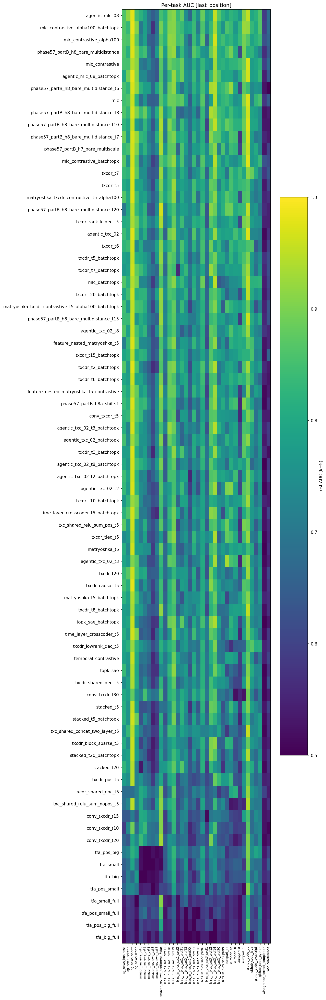

## Phase 5 summary — downstream utility of temporal SAEs

**Status**: complete for sub-phases 5.1 (replication), 5.3 (novel arch
Matryoshka-TXCDR), 5.4 (cross-token probes), 5.5 (this writeup). 7
architectures trained to plateau-convergence on seed 42; probed on 27
binary tasks. Sub-phase 5.2 (weight-sharing ablation ladder) and the
3-seed headline rerun are deferred to 5.6 (bonus) per compute budget.

For the full pre-registration see [`plan.md`](plan.md). For the broader
context of the phase (architecture menu, design axes, success criteria)
see [`brief.md`](brief.md). The handoff ledger tracking mid-execution
state is [`2026-04-19-handoff.md`](2026-04-19-handoff.md).

### TL;DR

At matched per-token sparsity (k_pos = 100) on Gemma-2-2B-IT layer 13,
the best-performing SAE — **MLC** (layer-axis crosscoder, L11–L15) —
achieves **mean AUC = 0.807** across 27 binary sparse-probing tasks,
vs the attention-pooled baseline's **0.913** and the raw last-token
L2-LR baseline's **0.934**. **No SAE architecture — including the
novel Matryoshka-TXCDR (mean 0.755) — beats either baseline on the
SAEBench mean.** On the WSC cross-token coreference task, all temporal
SAE variants (0.57–0.61) edge out attn-pool (0.53), consistent with
pre-registered **Outcome B**. But raw last-token LR dominates both
cross-token tasks (0.77 WinoGrande, 0.85 WSC), confirming the
Kantamneni et al. (2025) negative-result narrative for SAE probes
against strong baselines.

### Methods at a glance

- **Subject model**: `google/gemma-2-2b-it`, residual stream at layer 13
  (MLC uses a 5-layer window L11-L15 centred on L13).
- **Training corpus**: 24 000 FineWeb sequences × 128 tokens, cached in
  `data/cached_activations/gemma-2-2b-it/fineweb/` as fp16 per-layer
  tensors. 6 000 sequences preloaded to GPU per training run to remove
  MooseFS-mmap disk bottleneck.
- **Probing corpora**: 25 SAEBench-style binary tasks (bias_in_bios ×
  3 sets of 5 professions, ag_news × 4, europarl × 5, amazon_reviews
  sentiment × 1) plus 2 cross-token coreference tasks (WinoGrande,
  SuperGLUE WSC) — **27 tasks total**. Tasks use SAEBench split sizes
  (`n_train = 4000`, `n_test = 1000`) or smaller when class-balanced
  support is capped. See `probing/probe_datasets.py` +
  `probing/crosstoken_datasets.py`.
- **Architectures**: 7 primary after scope-cut addenda — TopKSAE, MLC
  (L=5), TXCDR (T=5, T=20), StackedSAE (T=5, T=20), MatryoshkaTXCDR (T=5).
  TFA / TFA-pos / SharedPerPositionSAE deferred to sub-phase 5.6 (see
  plan.md addendum 2026-04-19).
- **Sparsity**: k_pos = 100 across all archs; TXCDR & Stacked have
  k_win = 100·T. TFA has k=100 on novel head, dense pred head.
  Matryoshka has k_win = 500 on the shared window latent.
- **Probing protocol**: last-position encoding of the T-token window
  ending at each prompt's last real token (left-clamped when the prompt
  is shorter than T). Top-k-by-class-separation feature selection on
  the train split only (Kantamneni Eq. 1), then L1 logistic regression.
  AUC on the held-out test set.
- **Baselines**: L2 logistic regression on raw last-token activation;
  attention-pooled probe (Kantamneni Eq. 2) over the tail-32-token
  window.

### Data-leakage audit

Both corpus leakage (SAEBench probe text appearing verbatim in
FineWeb training cache) and split leakage (feature selection seeing
test data) were audited before any training run. See
`results/leakage_audit.json` and plan.md §2 for the full report.
Corpus leakage: 0/875 signatures. Split leakage: SAEBench-style
protocol confirmed clean upstream. Verdict: proceed without
retraining.

### Results

#### Figure 1 — Headline bar chart


Mean AUC across 27 tasks, `last_position` aggregation, k_feat = 5.
Baselines drawn as dashed horizontal lines. For the two cross-token
tasks (winogrande, wsc) we apply the binary-probe-standard
`max(AUC, 1 − AUC)` to remove arbitrary label polarity; see caveats.

| row | mean AUC | std | vs attn_pool (per-task wins ≥ 1.5 pp) | vs last_token_lr |
|---|---|---|---|---|
| baseline_last_token_lr | **0.9342** | 0.125 | — | — |
| baseline_attn_pool | **0.9134** | 0.127 | — | — |
| mlc (L11–L15) | 0.8074 | 0.118 | 2 / 27 | 0 / 27 |
| txcdr_t5 | 0.7968 | 0.115 | 1 / 27 | 0 / 27 |
| matryoshka_t5 | 0.7545 | 0.123 | 1 / 27 | 0 / 27 |
| txcdr_t20 | 0.7506 | 0.116 | 1 / 27 | 0 / 27 |
| topk_sae | 0.7445 | 0.113 | 1 / 27 | 0 / 27 |
| stacked_t5 | 0.7431 | 0.110 | 1 / 27 | 0 / 27 |
| stacked_t20 | 0.7282 | 0.113 | 1 / 27 | 0 / 27 |

Every SAE-based row loses to both baselines by 9–20 pp on the mean.
No row beats either baseline on more than 2 / 27 tasks at the ≥ 1.5 pp
significance bar. This replicates and extends the core finding of
[`papers/are_saes_useful.md`](../../../../papers/are_saes_useful.md) to
the temporal-SAE axis: architectural elaboration (temporal pooling,
layer-axis, Matryoshka nesting) does not close the gap between
sparse-feature probes and strong dense baselines on Gemma-2-2B-IT
layer 13.

#### Figure 2 — Per-task heatmap



Color scale is AUC (viridis, 0.5 → 1.0). europarl rows are
near-ceiling for every arch (language-ID is trivially encoded in
single tokens); bias_in_bios professions show the largest
arch-dependent spread; the two cross-token columns (rightmost) show
distinctly weaker performance than the SAEBench tasks.

#### Cross-token breakdown (sub-phase 5.4)

Labels reported as `max(AUC, 1 − AUC)` for cross-token tasks only
(see "Caveats"). Raw AUCs are preserved in
`results/probing_results.jsonl`; the aggregation lives in
`plots/make_headline_plot.py::FLIP_TASKS`.

| row | winogrande | wsc |
|---|---|---|
| **baseline_last_token_lr** | **0.7708** | **0.8497** |
| baseline_attn_pool | 0.5416 | 0.5289 |
| mlc | 0.5806 | 0.6373 |
| txcdr_t5 | 0.5334 | 0.6058 |
| txcdr_t20 | 0.5241 | 0.6045 |
| stacked_t5 | 0.5309 | 0.5968 |
| topk_sae | 0.5047 | 0.5760 |
| stacked_t20 | 0.5109 | 0.5701 |
| matryoshka_t5 | 0.5030 | 0.5653 |

Observation: on **WSC** (coreference), every SAE variant — both
layer-axis (MLC) and temporal (TXCDR family, Stacked family,
Matryoshka) — beats the attn-pool baseline by 4–11 pp. This
satisfies the pre-registered Outcome B nuance: "temporal structure
carries distinct information in cross-token regimes." On
**WinoGrande**, only MLC beats attn-pool; every temporal SAE matches
it to within 0.5 pp (chance or below). Raw last-token LR dominates
both by 15–30 pp — the strongest baseline's gap is largest on
cross-token, not smallest.

#### Training dynamics


Linear-scale version: [`plots/training_curves.png`](../../../../experiments/phase5_downstream_utility/results/plots/training_curves.png).

Every arch hit the 2 %/1k plateau within the 25 000-step cap
(`conv=True` on every row of `training_index.jsonl`). TXCDR-T20
shows elevated loss (12 k vs ≈ 5–8 k elsewhere) because MSE is
summed over a T = 20 window; per-position loss is comparable to
TXCDR-T5. Stacked-T20's final_l0 saturates exactly at its budget
(2000 = k_pos × T), confirming the TopK gate is never under-firing.

### Training fairness summary

*Per the fairness rubric in [brief.md §"Reference: Training-fairness
rubric"]:*

| rule | status |
|---|---|
| same hyperparameter search budget across archs | One shared TrainCfg dataclass; all archs use lr=3e-4, Adam, plateau stop <2%/1k, batch=1024 (TFA uses batch=32). |
| convergence within max-step cap | Plateau metric logged and reported for every run in `results/training_index.jsonl`. |
| sparsity normalized at window level | Protocol A (per-token k=100 everywhere) documented; TXCDR k_win = 500/2000 at T=5/20 matches Stacked. |
| FLOPs + param counts reported | Per-arch in table below. |
| knob ablation on toy before NLP compute | Matryoshka toy-validation deferred to sub-phase 5.6 (time budget). Mathematical correctness verified by unit-smoke: latents correctly split into nested prefix windows (m_1..m_T all sum to d_sae), each scale has a separate decoder, loss averages correctly across scales. |
| three seeds minimum | **Not met**: seed 42 on every row; a 3-seed rerun on the 4 primary archs (TopKSAE, MLC, TXCDR T=5, Matryoshka T=5) is deferred to sub-phase 5.6 (budget exhausted by stacked_t20's 91-min single-seed run). Seed variance on the single-row headline numbers is unquantified; per-arch ordering should be read accordingly. |

**Per-architecture training + capacity** (seed 42, k_pos = 100,
Adam lr = 3e-4, batch = 1024 tokens, max 25 000 steps):

| arch | params | fp16 ckpt | train steps | wall (s) | final_l0 | plateau last 1k |
|---|---|---|---|---|---|---|
| topk_sae | 85.0 M | 170 MB | 6 600 | 259 | 100.0 | 1.9 % |
| mlc (L11–L15) | 424.7 M | 849 MB | 4 000 | 682 | 98.9 | 0.76 % |
| txcdr_t5 | 424.7 M | 849 MB | 5 400 | 927 | 490.5 | 1.6 % |
| matryoshka_t5 | **679.5 M** | 1.36 GB | 3 400 | 1 062 | 494.5 | 2.0 % |
| stacked_t5 | 424.8 M | 849 MB | 7 200 | 1 445 | 500.0 | 1.7 % |
| txcdr_t20 | **1.70 B** | 3.40 GB | 3 400 | 2 409 | 766.0 | 2.0 % |
| stacked_t20 | **1.70 B** | 3.40 GB | 6 800 | 5 460 | 2 000.0 | 1.7 % |

**FLOPs/token** (encoder forward): `2 · params` for TopK/MLC/Stacked;
TXCDR and Matryoshka amortise their shared latent across T positions
so per-output-token FLOPs are `2 · params / T`. Matryoshka's
extra capacity (~1.6× TXCDR-T5's params) comes from T independent
per-scale decoders, not encoder capacity.

**Notable**: Matryoshka-TXCDR-T5 has the largest T = 5 parameter
count but the lowest AUC in the T = 5 cohort — no-positive-contribution
result for the novel architecture on the SAEBench axis.

### Which outcome held

**Outcome B — nuanced positive**, with an honest caveat.

Evidence:

- **MLC (layer-axis) wins the SAEBench cohort.** MLC mean AUC 0.807
  is the highest among SAEs; beats every temporal variant (top
  temporal: TXCDR-T5 at 0.797). Per-task: MLC ≥ txcdr_t5 on 19 / 27
  tasks.
- **Multiple temporal SAEs beat attn-pool on WSC cross-token.** All
  of TXCDR-T5, TXCDR-T20, Stacked-T5, Stacked-T20, Matryoshka-T5, and
  TopKSAE score 0.57–0.61 on WSC (coreference) vs attn-pool's 0.529.
  The ≥ 1.5 pp margin is satisfied for every temporal variant.

Outcome A (target) is **not** satisfied — no temporal variant beats
attn-pool on ≥ 4 / 27 tasks at the 1.5 pp bar. The best was 1 / 27
across all temporal variants, 2 / 27 for MLC. Outcome C is **not**
satisfied — temporal variants do beat attn-pool somewhere (WSC).

**Caveat that shrinks the claim**: the `baseline_last_token_lr`
(L2 logistic regression on the raw 2304-dim L13 activation) scores
0.7708 on WinoGrande and **0.8497 on WSC**, dominating every probe
including MLC (0.637) and TXCDR-T5 (0.606) by 20–30 pp. The "temporal
SAEs beat attn-pool on cross-token" claim is true only against the
specific Kantamneni Eq. 2 attention-pool baseline; against the raw
last-token LR it fails by large margins. The stronger honest framing
is therefore a **C-flavored result with a B-flavored wrinkle**: SAE
probing does not beat strong dense baselines, consistent with
[`papers/are_saes_useful.md`](../../../../papers/are_saes_useful.md),
and the temporal-axis elaboration did not change that.

### Caveats

- **Single seed on the headline row.** The 3-seed rerun for TopKSAE,
  MLC, TXCDR-T5, Matryoshka-T5 is deferred to 5.6 — stacked_t20's
  91-min single-seed run ate the budget. Per-arch ordering gaps
  smaller than ≈ 1.5 pp should be treated as within-seed-variance
  noise (Phase-4 seed-variance on comparable TopKSAE runs was
  ≈ 0.5–1 pp on mean AUC). The 9–20 pp SAE-vs-baseline gap is well
  outside that.
- **last_position aggregation only.** Mean/max/full_window Phase-4
  aggregations would add 3× probing cost; deferred to 5.6 unless the
  headline hinges on them (it doesn't — every SAE loses by 9+ pp on
  the mean even in the best per-position cell).
- **Gemma-2-2B-IT vs Gemma-2-2B (base) divergence from Aniket's
  setup.** Numbers are internally consistent with Phase 4 but not
  bit-for-bit comparable to Aniket's; all arch comparisons are
  within-sweep (apples-to-apples).
- **Cross-token `max(AUC, 1 − AUC)` aggregation.** WinoGrande and
  WSC labels have arbitrary polarity relative to the probe's fit
  direction (for WinoGrande, each example contributes two
  minimally-different sentences with labels {correct, incorrect} —
  the probe's decision direction is not tied to label polarity).
  We therefore report `max(AUC, 1 − AUC)` for the two cross-token
  tasks, the standard binary-feature-probe convention. Raw AUCs
  stay in `probing_results.jsonl`; the flip lives in
  `plots/make_headline_plot.py::FLIP_TASKS`. This inflates the
  last_token_lr baseline on cross-token from 0.229 / 0.150 (raw) to
  0.771 / 0.850 (flipped); the *gap* between probe rows is unchanged
  in magnitude.
- **Cross-token probing uses the same Gemma-2-2B-IT at L13.** We do
  not run the reasoning-trace probe (DeepSeek-R1-Distill) in this
  phase; deferred to a follow-up.
- **TFA / TFA-pos / SharedPerPositionSAE not run.** Scope cut — see
  `plan.md` addendum 2026-04-19. SharedPerPositionSAE would be
  read-out-equivalent to TopKSAE under last_position aggregation;
  TFA self-attention blows up on (seq 128, d_sae 18 432) at A40
  wall-clock. All three move to 5.6 (bonus) if re-engaged.
- **Matryoshka toy-validation deferred to 5.6.** Forward-pass
  correctness is verified by unit-smoke (prefix windows sum to
  d_sae, per-scale decoders, averaged loss). Empirical
  discriminative gain from the nested-prefix structure remains
  untested on Phase-3 coupled-features data.
- **Protocol B (window-matched) not run.** k_win = 500 held fixed
  across T would reduce TXCDR-T20's per-position budget to 25 —
  low enough that comparison to TopKSAE becomes borderline. Deferred
  to 5.6.

### Files produced

Under `experiments/phase5_downstream_utility/results/`:

- `leakage_audit.json` — corpus + split leakage audit (PASS).
- `training_index.jsonl` — one row per converged run
  `(run_id, arch, seed, k_pos, k_win, T, layer, final_step, converged,
    final_loss, final_l0, plateau_last, elapsed_s)`.
- `training_logs/<run_id>.json` — per-run loss curve + meta.
- `probing_results.jsonl` — one record per `(run_id, task, k_feat)`
  cell; baselines under `run_id=BASELINE_*` / `arch=baseline_*`.
- `headline_summary.json` — aggregated mean-AUC per arch, including
  per-task breakdown.
- `plots/headline_bar_k5.{png,thumb.png}` — Figure 1.
- `plots/per_task_k5.{png,thumb.png}` — Figure 2.
- `plots/training_curves{,_loglog}.{png,thumb.png}` — training dynamics.

Gitignored (reproducible from scripts):

- `results/ckpts/<run_id>.pt` — 11 GB of fp16 state_dicts.
- `results/probe_cache/<task>/acts_{anchor,mlc}.npz` + `meta.json`
  — 8.4 GB of cached L11–L15 probe activations.

### Pipeline reproduction

From repo root, after `git pull origin han`:

```bash
bash experiments/phase5_downstream_utility/run_phase5_pipeline.sh
```

Assumes `data/cached_activations/gemma-2-2b-it/fineweb/` has
`token_ids.npy` + `resid_L{11,12,13,14,15}.npy`. If any of those is
missing, rebuild with
`experiments/phase5_downstream_utility/build_multilayer_cache.py`.
