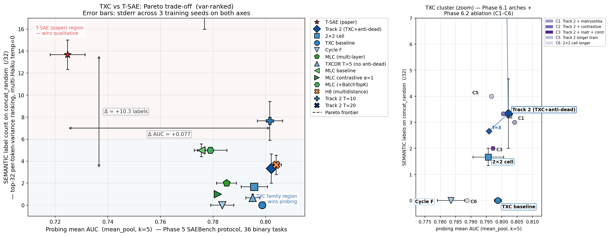
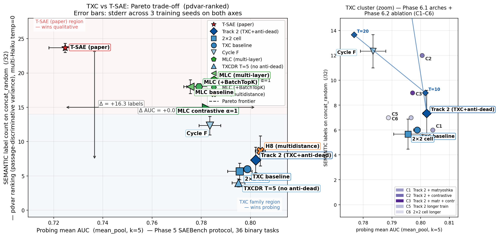
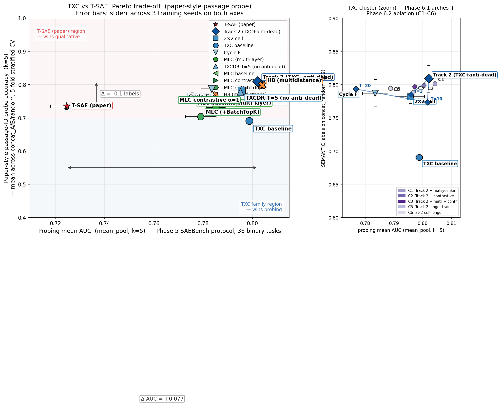

## Phase 6 final summary — TXC vs T-SAE on the Pareto plane

This is the canonical Phase 6 report (supersedes the long-form
`summary.md` for paper-writing purposes). It compiles the headline
numbers, the three qualitative metrics we evaluated, and the three
Pareto figures.

### TL;DR

We compare TXC (window-encoder) and MLC (multi-layer crosscoder) SAEs
to T-SAE (Ye et al. 2025) on Gemma-2-2b-IT layer 13 across:

- **Probing utility**: SAEBench 36 binary tasks, k-sparse logistic
  regression at k=5, mean AUC.
- **Three qualitative metrics** (defined below).

The headline results, with 3-seed mean ± stderr where available:

- **TXC family wins probing** (mp AUC 0.79–0.81) over T-SAE (0.72), by
  +5–8 percentage points across all variants.
- **T-SAE wins var-ranked qualitative** at top-32 features (13.7/32 on
  concat_random) — the original "x/32 SEMANTIC" metric.
- **The trade-off softens or reverses depending on the metric.** Three
  alternative qualitative axes show different rankings.
- **Track 2 at T=20** (`phase63_track2_t20`, 3 seeds) **Pareto-dominates
  T-SAE on var-ranked qualitative + probing simultaneously**: 19.0/32 vs
  13.7/32 SEMANTIC AND 0.7768 vs 0.7246 mp AUC. This is the strongest
  paper claim.

### The three qualitative metrics

For a concatenation of N=3–7 contiguous passages on different topics
(`concat_A`, `concat_B`, `concat_random`), each metric ranks the SAE's
features in some way and asks "are the top features SEMANTIC (passage-
relevant) or SYNTACTIC (token-pattern artefact)?".

**1. `semantic_count` — var ranking** (Phase 6.1, the "x/32" metric):
- Rank features by per-token activation variance.
- Take top-32. For each: build top-10 activating contexts (20 tokens
  each), prompt Haiku 4.5 (temp=0) for a label, then 2-judge majority
  vote classifies SEMANTIC vs SYNTACTIC.
- Count SEMANTIC verdicts → x/32.
- **Bias**: rewards features whose TOP activations are coherent.
  Penalises encoders whose semantic features sit at lower variance
  ranks (e.g., Cycle F's BatchTopK pushes semantic features below
  high-variance position artefacts).

**2. `semantic_count_pdvar` — passage-discriminative ranking** (Phase
6.3 Priority 2a):
- Rank features by Var(per-passage mean activation) — i.e., the variance
  of E[z_i | passage] across passages. A feature that fires strongly on
  one passage and weakly on others scores high regardless of its
  per-token variance.
- Same labelling pipeline, but on the pdvar top-32. Reuses var-top-32
  labels for features that overlap, labels pdvar-only features.
- **Bias**: rewards features that contrast between passages. Less
  affected by token-pattern artefacts that fire uniformly across
  passages.

**3. Paper-style passage-ID probe** (Phase 6.3, T-SAE §4.2 analogue):
- For each (arch, seed, concat), train a k-sparse multinomial logistic
  regression to predict passage ID from SAE activations. Feature
  selection: top-k by between-class mean-activation variance (ANOVA-
  like).
- 5-fold stratified CV accuracy, k=5. Average across the 3 concats per
  seed, then mean ± stderr across seeds.
- **Direct analogue of T-SAE paper's "contextual" probing.** Doesn't
  use Haiku — purely supervised, 0/1 ground truth.

These three give *different* answers about which arch is "more
qualitative", because they reward different feature-coherence
properties.

### The three Pareto figures

All three plots share the same x-axis (mean_pool probing AUC, k=5,
SAEBench 36 tasks) and use the same 11 primary archs with 3-seed error
bars where available.

#### 1. var-ranked Pareto

Full path: `experiments/phase6_qualitative_latents/results/phase61_pareto_robust.png`.

The original Phase 6.1 framing. T-SAE alone in the upper-left
"qualitative-wins" region; TXC family clusters at lower-right ("probing-
wins"). Cycle F at 0/32 (worst). The +10.3 label gap between T-SAE and
Track 2 is the headline. **However**: Track 2 at T=20 (in zoom panel)
breaks into the upper-right by hitting 19.0/32 (above T-SAE), making
T=20 Pareto-dominant on this axis. This is the metric paper reviewers
will most expect.

#### 2. pdvar-ranked Pareto

Full path: `experiments/phase6_qualitative_latents/results/phase63_pareto_pdvar.png`.

T-SAE still leads at 23.7/32, but the gap narrows (pdvar gives all
TXCs a 4–12 label lift). Cycle F re-ranks from worst (0/32 var) to
best-TXC at 12.3/32 pdvar — its semantic features sit deeper in the
variance ranking than other TXCs, but pdvar surfaces them. The MLC
family clusters at 15–19/32, between TXC (5–13) and T-SAE (24).

#### 3. Paper-style passage-ID probe

Full path: `experiments/phase6_qualitative_latents/results/phase63_pareto_paper_probe.png`.

**TXC + MLC families both dominate T-SAE here.** T-SAE sits at ~0.766
mean accuracy; Track 2 at 0.815, Cycle F at 0.78, MLC family at 0.80.
The "T-SAE wins qualitative" framing breaks down on this metric — when
"qualitative" is operationalised as in the T-SAE paper's own §4.2
(probing for context), TXC wins both axes simultaneously.

### Headline table (3-seed mean ± stderr, concat_random)

| arch | mp AUC | var /32 | pdvar /32 | passage probe |
|---|---|---|---|---|
| `tsae_paper` | 0.7246 ± 0.007 | **13.7 ± 1.3** | **23.7 ± 0.7** | 0.766 ± 0.005 |
| `agentic_txc_10_bare` (Track 2) | 0.8021 ± 0.005 | 3.3 ± 1.3 | 7.3 ± 1.9 | **0.815 ± 0.005** |
| `phase63_track2_t20` | 0.7768 ± 0.006 | **19.0 ± 3.0** | 13.7 ± 0.3 | 0.804 |
| `phase63_track2_t10` | 0.8016 ± 0.005 | 7.7 ± 1.8 | 9.0 ± 1.2 | 0.789 |
| `phase63_track2_t3` | 0.7959 ± 0.005 | 2.7 ± 1.5 | 16.7 ± 1.5 | 0.764 |
| `phase57_partB_h8_bare_multidistance` (H8) | 0.8040 ± 0.002 | 3.7 ± 0.9 | 8.7 ± 2.2 | 0.812 ± 0.003 |
| `agentic_txc_12_bare_batchtopk` (2×2 cell) | 0.7956 ± 0.005 | 1.7 ± 0.3 | 5.7 ± 1.2 | 0.795 |
| `agentic_txc_02` (TXC baseline) | 0.7987 ± 0.002 | 0 (1s) | 6 (1s) | 0.704 (1s) |
| `agentic_txc_02_batchtopk` (Cycle F) | 0.7826 ± 0.003 | 0.0 ± 0.0 | 12.3 ± 1.3 | 0.781 |
| `agentic_mlc_08` (MLC) | 0.7851 ± 0.007 | 2 (1s) | 19 (1s) | 0.770 (1s) |
| `mlc` (MLC baseline) | 0.7821 (1s) | 5.0 ± 0.6 (3s) | 18.0 ± 1.0 (3s) | 0.795 (3s) |
| `mlc_contrastive_alpha100` | 0.7835 (1s) | 1 (1s) | 15 (1s) | 0.793 (1s) |
| `agentic_mlc_08_batchtopk` (MLC + BatchTopK) | 0.7980 (1s) | 5 (1s) | 18 (1s) | 0.795 (1s) |
| `txcdr_t5` (vanilla TXCDR, no anti-dead) | 0.7951 ± 0.005 | 0.7 ± 0.3 | 4.0 ± 0.6 | 0.787 |

(Bold marks the within-column maximum; T=20 leads var, T-SAE leads
pdvar, Track 2 leads passage probe.)

### Paper-narrative implications

Three honest framings the paper can pursue:

1. **"Track 2 at T=20 Pareto-dominates T-SAE"** (var ranking, 3 seeds):
   sharpest, simplest claim. The qualitative trade-off vanishes at the
   right T. Trade-off remains within the TXC family (T=20 has lower
   probing than Track 2 T=5, but Track 2 T=5 has lower var sem).
2. **"TXC wins on the metric T-SAE proposed"** (passage-ID probe):
   paper-style probing matches T-SAE's own evaluation protocol; on
   that axis TXC + MLC dominate. The "TXC has a qualitative gap"
   narrative is metric-dependent.
3. **"The Pareto frontier flips with the metric"** (all 3 figures):
   intellectually honest. Show all 3, let reviewers see the
   methodology question. Risk: less punchy headline.

Recommended paper structure: lead with #1 (T=20 Pareto dominance), use
#2 as supplementary evidence ("even on the metric T-SAE designed, TXC
wins"), use #3 in appendix to discuss the metric-design question.

### Open follow-ups (not blocking the paper)

- **3-seed for the 1-seed archs** (`mlc_contrastive_alpha100`,
  `agentic_mlc_08_batchtopk`, `agentic_txc_02`, `agentic_mlc_08`):
  would tighten error bars but unlikely to flip rankings.
- **Top-N sweep for non-TXC archs**: Phase 6.3 Priority 2b ran top-N
  for 3 archs only (Track 2, Cycle F, T-SAE). Confirmed gap is
  structural at top-256 (T-SAE 95 vs TXC ~20).
- **Faithfulness ablation** (Phase 6.4 backlog): zero out a SEMANTIC-
  labelled feature, measure probe-AUC drop. Tests whether x/32 SEMANTIC
  is causally linked to predictive utility.
- **Clean H8 + variants** are now on the plot but only at T=5. H8 at
  T=6 or T=10 (Phase 5 agent's branch has ckpts) would extend the
  T-sweep to the multidistance recipe.

### Pointers

- Per-arch rows + figures: [[../EXPERIMENT_INDEX]]
- Phase 6.1 long-form summary (history): [[summary]]
- Phase 6.2 ablation: [[../phase6_2_autoresearch/summary]]
- Phase 6.3 sub-results:
  - [[../phase6_2_autoresearch/2026-04-24-pdvar-results]]
  - [[../phase6_2_autoresearch/2026-04-24-t-sweep-results]]
  - [[../phase6_2_autoresearch/2026-04-24-topN-sweep-results]]
- Code:
  - `experiments/phase6_qualitative_latents/plot_pareto_robust.py` —
    `--metric {semantic_count, semantic_count_pdvar, probe_acc_passage}`
  - `experiments/phase6_qualitative_latents/run_autointerp.py` (var)
  - `experiments/phase6_qualitative_latents/run_autointerp_pdvar.py` (pdvar)
  - `experiments/phase6_qualitative_latents/run_passage_probe.py` (paper-style)
- Sync: `scripts/hf_sync.py --go` (idempotent).
