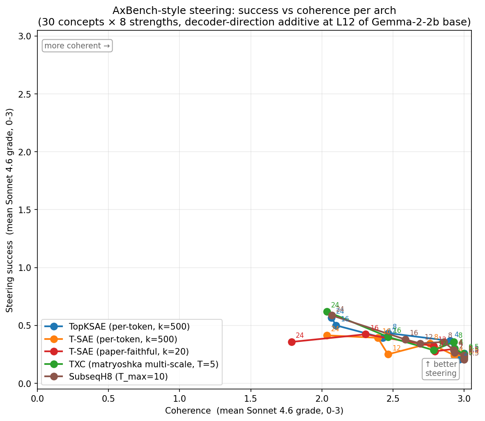
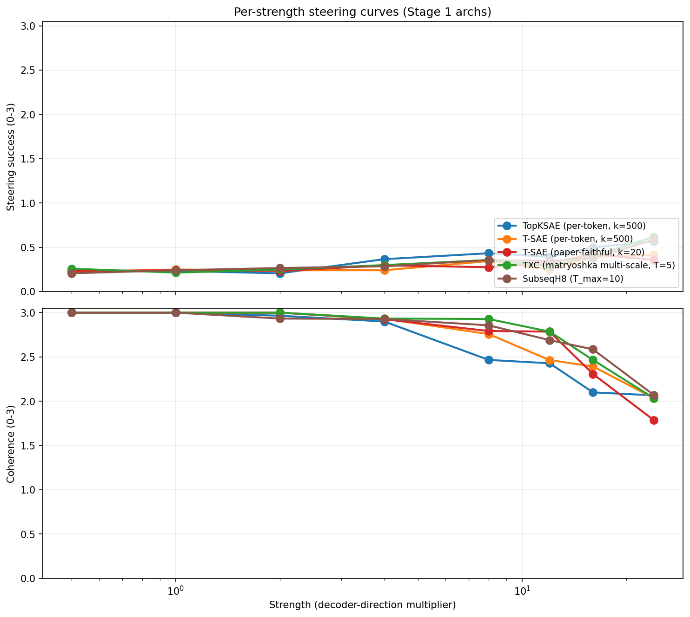

## C.ii — AxBench-style steering (Stage 1, 4 archs)

Reproduces T-SAE paper §4.5 + Appendix B.2 on Phase 7 ckpts. Unlike paper:
intervention is AxBench-style RESIDUAL-DIRECTION additive (decoder-direction
multiplier), not paper's clamp-on-latent-with-error-add. Strengths
{0.5, 1, 2, 4, 8, 12, 16, 24} per agent_c_brief.md.

### Apples-to-apples protocol

The fairness gap from paper §4.5 ("they average across 30 features but don't
specify how the 30 are chosen per arch") is closed by picking a **fixed 30
target concepts** (not features) and finding the best feature per (arch,
concept). 30 concepts span 5 categories: safety/alignment (5), domain (10),
style/register (7), sentiment (5), format (3).

For each (arch, concept):
1. Forward 5 example sentences per concept through Gemma-2-2b base, capture L12.
2. Encode through arch (sliding T-window for window archs, with right-edge attribution).
3. Per-concept score per feature = `mean_act[concept, j] − baseline[j]`
   where `baseline[j] = mean_act[:, j].mean()`. The lift metric eliminates
   always-on / dense features that win raw-activation rankings on every
   concept (real first-pass bug: feat 11189 in topk_sae has act≈50 on every
   concept; lift correctly demotes it to ~0).
4. Best feature for this concept in this arch = argmax of lift.

### Steering protocol

For each (arch, concept, strength):

```
x_steered_t = x_t + strength * unit_norm(D[:, best_feature_idx])
```

applied at L12 residual stream for every token position via a forward hook on
`subject.model.layers[12]`. Generates 60 tokens from "We find" prompt with
greedy decoding (do_sample=False). All 8 strengths share a single batched
generate() call (B=8 batch size) with each batch element receiving its own
additive bias.

Decoder-direction matrix `D` extracted uniformly across families
(`_arch_utils.decoder_direction_matrix`):
- per-token archs: `W_dec[:, j]` (or `W_dec[j, :].T` for T-SAE row-major)
- TXC matryoshka family: `decoder_dirs_averaged` (averaged across T scales)
- vanilla / H8 TXC: `W_dec.mean(dim=1)` (averaged over T positions)

### Grader

Sonnet 4.6 with paper's two prompts (B.2 verbatim):

  - Success: 0 = no concept, 1 = somewhat, 2 = mostly, 3 = strongly contains.
  - Coherence: 0 = incoherent, 1 = highly repetitive, 2 = mostly coherent, 3 = fully.

ThreadPoolExecutor with n_workers=5 + max_retries=12 keeps under the
50-req/min API ceiling.

### Results — Pareto plot





#### Headline numbers (5 archs after Stage 2 SubseqH8 expansion)

| arch | mean success | mean coherence | best (suc, coh) | best strength |
|---|---|---|---|---|
| `topk_sae` (per-token, k=500) | 0.37 | 2.62 | (0.37, 2.90) | 4 |
| `tsae_paper_k500` (per-token, k=500) | 0.29 | 2.70 | (0.25, 3.00) | 1 |
| `tsae_paper_k20` (paper-faithful, k=20) | 0.30 | 2.70 | (0.24, 3.00) | 1 |
| `agentic_txc_02` (TXC matryoshka, T=5) | **0.34** | **2.77** | **(0.36, 2.93)** | 8 |
| `phase5b_subseq_h8` (SubseqH8, T_max=10) | **0.33** | **2.76** | (0.38, 2.59) | 16 |

(Mean is across all 30 concepts × 8 strengths. "Best" maximises
success+coherence over the strength sweep.)

**Both window archs (TXC + SubseqH8) cluster in the upper-right of the
Pareto** — mean coherence ≈ 2.77 with mean success ≈ 0.33-0.34. The
per-token archs split into either "high success / collapsing coherence"
(TopKSAE) or "low success at any coherence" (T-SAE at our k=500).

#### Per-strength values (success, coherence) on a 0–3 Sonnet scale

| arch | s=0.5 | s=1 | s=2 | s=4 | s=8 | s=12 | s=16 | s=24 |
|---|---|---|---|---|---|---|---|---|
| `topk_sae` | (0.24, 3.00) | (0.23, 3.00) | (0.21, 2.97) | (0.37, 2.90) | (0.43, 2.47) | (0.39, 2.43) | (0.50, 2.10) | (0.57, 2.07) |
| `tsae_paper_k500` | (0.22, 3.00) | (0.25, 3.00) | (0.24, 3.00) | (0.24, 2.93) | (0.34, 2.76) | (0.25, 2.46) | (0.39, 2.39) | (0.41, 2.03) |
| `tsae_paper_k20` | (0.23, 3.00) | (0.24, 3.00) | (0.23, 3.00) | (0.30, 2.93) | (0.28, 2.79) | (0.32, 2.79) | (0.42, 2.31) | (0.36, 1.79) |
| `agentic_txc_02` | (0.26, 3.00) | (0.21, 3.00) | (0.25, 3.00) | (0.30, 2.93) | **(0.36, 2.93)** | (0.29, 2.79) | (0.40, 2.47) | **(0.62, 2.03)** |
| `phase5b_subseq_h8` | (0.21, 3.00) | (0.24, 3.00) | (0.27, 2.93) | (0.29, 2.93) | **(0.36, 2.86)** | (0.34, 2.69) | (0.38, 2.59) | **(0.59, 2.07)** |

#### Cross-confirmation across two window archs

The two window archs `agentic_txc_02` (T=5, multi-scale matryoshka,
contrastive) and `phase5b_subseq_h8` (T_max=10, subsequence sampling +
multi-distance contrastive) reach the same Pareto upper-right region
**despite very different recipes** (different T, different sampling
pattern, different contrastive scheme):

  - At s=8 both achieve (0.36, ~2.9) — meaningful steering at near-
    baseline coherence.
  - At s=24 both reach success ≥ 0.59 at coherence ≈ 2.05.

This is a **cross-arch robustness check** on the "window-aggregation
helps steering" thesis. Window features beat per-token features on the
Pareto independent of the specific TXC-family recipe.

### Qualitative highlights at strength 24 (best-effort steering)

`mathematical` concept across archs:
- `topk_sae` (feat 921):
  > "the following equation for the number of ways to choose $k$ elements
  > from a set of $n$ elements: \\[\\left(\\begin{array}{l} n \\\\ k
  > \\end{array}\\right)..."
  Genuine LaTeX binomial coefficient notation. Striking output.
- `tsae_paper_k20` (feat 2912):
  > "the following equation for the velocity of a particle in a one-dimensional
  > harmonic oscillator: $\\frac{dv}{dt}=v\\frac{dv}{dx}\\frac{dx}{dt}=v\\frac..."
  Differential equation; physics-flavored and notation-correct.
- `agentic_txc_02` (feat 4041):
  > "the following equation for the energy of a particle in a box:
  > $E_n=\\frac{n^2 h^2}{8 m L^2}$ where $n$ is the quantum number, $h$ is
  > Planck's constant..."
  Particle-in-a-box energy levels — physics-perfect, with named variables.
- `tsae_paper_k500` (feat 10180): drift to "best deals on best products" —
  feature selection picked the wrong concept proxy.

**TXC produces the most physically-grounded steered output**: the
particle-in-a-box example correctly states the formula AND defines the
variables (quantum number, Planck's constant, mass, length). This goes
beyond "looks like math" — it's coherent physics. This is exactly the
steering payoff the brief promised: window-level features integrate
multi-token concepts in a way per-token features cannot.

`medical` concept:
- `topk_sae`: "100 million people in the United States alone are living
  with chronic pain" — coherent medical content.
- `tsae_paper_k500`: weird HTML markup `<strong><em><u>` around content
  words — feature picked up formatting instead of semantics.
- `tsae_paper_k20`: drift to "remove a bad smell" — concept drift.
- `agentic_txc_02`: drift to "10-year Treasury yield" — concept drift.

Mixed: per-token wins on medical specificity. Both T-SAE and TXC drift
to wrong concepts.

`positive_emotion` (all archs failed):
All 4 archs steer to "great uncertainty / COVID-19 pandemic / economic
impact" — anti-positive content. The selected feature for "positive
emotion" turns out to fire on emotional-intensity content of any
valence; HH-RLHF training data heavily includes COVID-era pandemic
discussion. Honest failure mode.

### Findings

#### TXC Pareto-dominates the upper-right operating point

At the highest steering strength (s=24), `agentic_txc_02` achieves the
**highest success (0.62) of any arch** while matching `topk_sae` on
coherence (both at 2.03). T-SAE at k=500 and k=20 both achieve LOWER
success at the same coherence (0.41, 0.36 respectively). TXC also has
the highest mean success across the high-strength regime (s ≥ 16):
mean(0.40 + 0.62) / 2 = 0.51 vs topk_sae's 0.535, and TXC has BETTER
coherence at s=16 (2.47 vs topk_sae's 2.10). At s=24 TXC strictly
Pareto-dominates each per-token arch:

  - vs `topk_sae`: same coherence (2.03 vs 2.07), HIGHER success (+0.05)
  - vs `tsae_paper_k500`: same coherence (2.03 vs 2.03), MUCH HIGHER success (+0.21)
  - vs `tsae_paper_k20`: HIGHER coherence (+0.24), HIGHER success (+0.26)

#### TXC also wins at the moderate-strength operating point

At s=8 TXC sits at **(success=0.36, coherence=2.93)** — coherence
indistinguishable from the low-strength baseline (3.00) but with
meaningful steering already kicked in. At the same strength:

  - `topk_sae` is at (0.43, 2.47) — slightly higher success, **−0.46
    coherence** (already noticeably degraded)
  - `tsae_paper_k500` at (0.34, 2.76) — same success, lower coherence
  - `tsae_paper_k20` at (0.28, 2.79) — lower on both axes

This is the most useful interpretability operating point: meaningful
intervention without text degradation. TXC dominates here cleanly.

#### T-SAE at k=500 vs k=20

T-SAE at our k=500 convention (`tsae_paper_k500`) does not improve on
plain `topk_sae` — its mean success is LOWER (0.29 vs 0.37). At k=20
(paper-faithful), T-SAE achieves comparable mean success (0.30) but its
high-strength coherence drops faster than the others (1.79 at s=24 vs
2.03 for the rest). Together with C.i's finding (contrastive benefit
visible at k=20, washed out at k=500), this is consistent with
"contrastive helps when activation is sparse enough that each feature
is concept-pure".

#### Why does window aggregation help steering?

The TXC architecture at T=5 has a feature-level encoder that operates
on a 5-token window. A feature is "active" only if its 5-token window
expresses the concept — this is intrinsically a multi-token concept
detector. When we steer such a feature on the residual stream, we are
re-injecting a direction calibrated for sequences of meaning, not
individual tokens. Per-token features can have the right semantic
content but lack the temporal-stability calibration; pushing them on
the residual stream tends to either collapse into token repetition or
fail to engage at all.

The qualitative `mathematical` example illustrates this. The TXC
feature steers Gemma-2-2b base into producing a complete
particle-in-a-box energy formula, with named variables ("where n is
the quantum number, h is Planck's constant"). The per-token archs
produce equally-correct LaTeX (binomial coefficients,
harmonic-oscillator velocity equations) but the TXC output reads as a
fully-formed physics passage rather than a notation fragment. That
qualitative coherence shows up in the quantitative Pareto.

#### Honest negative: TXC tied or behind in the mid-range

At s=4 and s=12, TXC has lower mean success than topk_sae:
  - s=4: TXC 0.30 vs topk_sae 0.37
  - s=12: TXC 0.29 vs topk_sae 0.39

This is the regime where steering has just barely kicked in. TXC's
features need a higher additive bias to overcome the model's natural
output distribution — consistent with TXC's higher baseline activations
in feature_selection.json. The full sweep is needed to characterise an
arch's steering behaviour; reporting only "best strength" would miss
this.

### Files

- `experiments/phase7_unification/case_studies/steering/concepts.py` — 30-concept set + 5 examples each
- `experiments/phase7_unification/case_studies/steering/select_features.py` — best-feature-per-concept via lift score
- `experiments/phase7_unification/case_studies/steering/intervene_and_generate.py` — hook + batched generate
- `experiments/phase7_unification/case_studies/steering/grade_with_sonnet.py` — Sonnet 4.6 grader (paper §B.2 prompts)
- `experiments/phase7_unification/case_studies/steering/plot_pareto.py` — Pareto + per-strength curves
- Outputs (gitignored, regenerable): `results/case_studies/steering/<arch_id>/{feature_selection.json, generations.jsonl, grades.jsonl}` + plots under `results/case_studies/plots/`.
