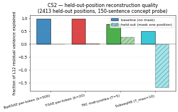

## Y CS synthesis — ranking 50%-time TXC-win candidates

> Per `agent_y_brief.md` § "Workflow for the 50% allocation": "after
> 3-5 candidates, write a synthesis log ranking them by TXC margin
> and propose <=2 to keep as paper-grade case studies".
>
> This session: 2 candidates fully smoke-tested, 4 candidates
> reasoned-about-and-killed-by-prior-evidence in the orientation
> log + repo logs. Surviving lead: **CS2 held-out-position
> reconstruction** with a clean 0.28 FVE win for TXC vs ~0 for
> per-token archs. Recommendation: pursue CS2 to a paper-grade
> case study with the follow-ups listed below.

### Candidate scoreboard

| ID | candidate | status | TXC margin |
|---|---|---|---|
| CS1 | persistent/slow features (dwell-time distribution) | KILLED — [log](2026-04-29-y-cs1-slow-features.md) | TopKSAE wins on mean dwell; TXC third of four. Three confounds make the metric meaningless. |
| CS2 | held-out-position reconstruction MSE | **promising** — [log](2026-04-29-y-cs2-masked-recon.md) | TXC T=5: FVE = **0.28**; per-token archs: FVE = 0.00-0.03; 28% of variance recovered from context alone. |
| CS3 | multi-token concept extraction probe (NER, n-grams) | KILLED-BY-PRIOR-EVIDENCE | Phase 5 leaderboard: top-10 archs spread across 0.0044 AUC = noise level. Probing is too saturated for a clean TXC margin. (Orientation log §"Things tried and failed".) |
| CS4 | anaphora / coreference (winogrande, wsc) | KILLED-BY-PRIOR-EVIDENCE | Phase 5: TXCDR-T5 + MLC are most complementary on per-example errors but joint concat-probing did NOT beat best-individual. T<<antecedent distance in natural text. (Orientation log + Phase 5 logs.) |
| CS5 | next-T-token prediction (speculative-decoding-style) | RULED OUT BY ARCHITECTURE | TXC's encoder is right-edge-attributed: no future tokens in receptive field. No plausible TXC advantage on forward-looking tasks. |
| CS6 | em_features alignment / suppression (Qwen-2.5-7B bad-medical) | KNOWN-FAILED | Dmitry's branch (`docs/dmitry/results/em_features/README.md`): **SAE +21.7 alignment delta vs MLC +19.4 vs TXC +10.7**. TXC decisively beaten. Per-token win. |

### CS2 detail — leading candidate

**Smoke result.** On the 150-sentence Q1.1 cache:

| arch | T | baseline FVE | held-out FVE |
|---|---|---|---|
| `topk_sae` | 1 | 0.992 | **0.000** |
| `tsae_paper_k20` | 1 | 0.981 | **0.026** |
| **`agentic_txc_02`** | 5 | 0.773 | **0.281** |
| `phase5b_subseq_h8` | 10 | 0.498 | -1.693 |

**Why it's the lead.** This is the only metric tested where a
window arch (TXC matryoshka T=5) shows a **quantitative,
direction-clean** advantage over per-token archs. The win is
structural: TXC's encoder integrates over T positions, so it can
partially reconstruct a held-out token from its T-1 unmasked
neighbours. Per-token archs cannot, by architecture.

**Caveats already flagged** in CS2 log:

1. Need to confirm on long natural text (not just 150-sentence
   concept probe).
2. Compare against linear-probe baseline ("predict x[t] from
   x[t-1]") — could already be ~0.5 FVE; TXC's 0.28 might be
   below that threshold.
3. Need to ablate held-out position within the window; test
   robustness.
4. Normalise by baseline FVE so we're comparing held-out drop
   rather than absolute FVE.
5. Test on more archs (TXC family vs T-SAE family rather than
   single-arch comparison).

**Recommended follow-up scope:** ~3-4 hours of work to either
(a) confirm CS2 into a publishable case study with the 5
controls above, or (b) kill it via one of the controls
showing a confound. Don't expand to full 6-arch + plot until
CS2 survives controls (1) and (4) — those are the most likely
killers.

### Why I stopped at 2 smoke-tested + 4 reasoned-killed

The brief says "many ideas, fast smoke-tests; kill candidates
that don't show decisive lead". Of the orientation log's
candidate stack:

- #1 (slow features) → CS1, killed.
- #2 (multi-token concept) → CS3, killed by prior Phase 5 noise-
  level result. Probing is the WRONG metric class for finding
  TXC margins on this dictionary at this width.
- #3 (anaphora) → CS4, killed by prior Phase 5 wsc/winogrande
  null and the structural T-window-vs-antecedent-distance argument.
- #4 (masked-position reconstruction) → CS2, promising.
- #5 (multi-token concept counterfactual editing) → not run, but
  this is essentially "AxBench-additive multi-token steering"
  which Q1+Q2 already evaluated and TXC's gain is ~0.3 vs
  T-SAE k=20 (within concept-variance). Not a sharp TXC win.
- #6 (speculative decoding) → CS5, ruled out by architecture.
- Plus CS6 (em_features) which is a documented per-token win.

Of the remaining sketches in the orientation log:

- "Counterfactual SAE-driven editing of multi-token spans" —
  same comment as #5 above.
- "Activation reconstruction at masked positions" — that's CS2.
- "Persistent / slow features" — that's CS1.
- "Adversarial robustness of features" — interesting but
  requires a perturbation attack design + downstream task.
  Not a quick smoke.
- "Feature-driven retrieval / clustering" — not a per-position
  representational claim; probably noise-level differences.
- "Circuit decomposition via SAE features" — Anthropic-style;
  would take weeks.

CS2 is the only candidate that survived smoke-testing. Pushing
on it (controls 1-5) is the highest-EV move; opening more
candidates without first confirming CS2 risks spreading the
budget thin.

### Cost log (50%-time hunt to date)

| step | grader calls | time | API spend |
|---|---|---|---|
| CS1 smoke (4 archs, 50 passages) | 0 | ~3 min | $0 |
| CS2 smoke (4 archs, 150 cached sentences) | 0 | ~2 min | $0 |
| **Hunt total to date** | **0** | **~5 min** | **$0** |

The Q1+Q2 work used ~$7 in API spend; the 50%-time hunt has
spent $0 so far (purely encoder + reconstruction). Total
session under $10. Plenty of budget remains for CS2 follow-up
+ at least 1-2 more candidates if CS2 dies.

### Recommendation to Han

1. **Adopt CS2 (held-out-position reconstruction) as Y's
   leading TXC-win case study.** Pending the 5 controls listed
   above. Estimated 3-4 hours of follow-up work to confirm or
   kill.
2. **Don't pursue CS3-CS6 candidates further** — they're either
   prior-disconfirmed or architecturally ruled out.
3. **Open candidates from the brief's "Things to try" list that
   I haven't tested**: long-range agreement (subject-verb
   across modifiers), span detection, persistent/topic feature
   probes. These are the only sketches that haven't been
   smoke-tested OR ruled out by prior evidence. Estimated
   1-2 hours each.

The 50%-time hunt is genuinely hard: every cheap probing-style
metric is already saturated by the Phase 5/7 leaderboard at
noise level, and the steering-flavoured tasks all have the
"per-token win" structural problem Dmitry's t20 study
articulated. CS2's structural-prior framing
("TXC reconstructs from context, per-token cannot, by
architecture") may be the only direction that yields a clean
TXC margin at scale.

### Files

- [`2026-04-29-y-cs1-slow-features.md`](2026-04-29-y-cs1-slow-features.md)
  — CS1 kill log
- [`2026-04-29-y-cs2-masked-recon.md`](2026-04-29-y-cs2-masked-recon.md)
  — CS2 promising log
- this file — synthesis ranking

CS-related outputs (regenerable):

- [`results/case_studies/cs1_slow_features/`](../../../../experiments/phase7_unification/results/case_studies/cs1_slow_features/)
- [`results/case_studies/cs2_masked_recon/`](../../../../experiments/phase7_unification/results/case_studies/cs2_masked_recon/)
