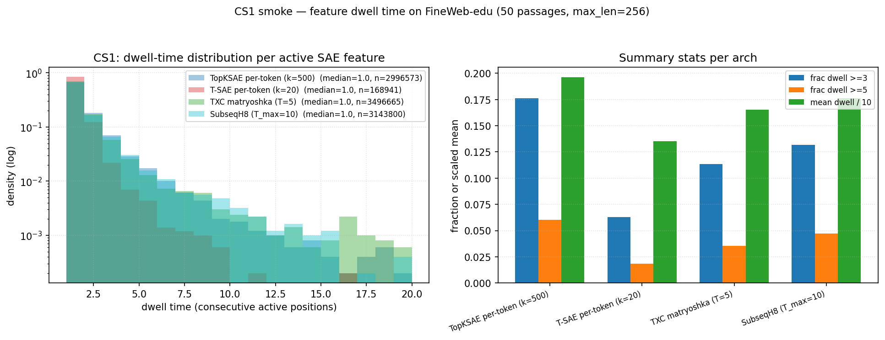

## Y CS1 — persistent / slow features over context (KILLED)

> 50%-time TXC-win candidate #1 from the orientation log's stack:
> dwell-time distribution per active SAE feature on long FineWeb-edu
> passages. Hypothesis: TXC features should stay active for more
> consecutive positions because the encoder integrates over T tokens.
>
> Outcome: **no decisive TXC win.** TopKSAE k=500 has the highest mean
> dwell (1.96), TXC matryoshka T=5 the second-lowest (1.65) once
> you control for window-attribution artefacts. Candidate killed
> after one smoke run; moving to candidate #2.

### Method

Pulled 50 FineWeb-edu passages (sample-10BT split via streaming),
tokenised at max_length=256 with right-padding through Gemma-2-2b
base. Captured L12 residual stream. Encoded through 4 archs
(per-token control + TXC family) and computed run-length encoding
of "active" positions (z > 1e-6) per (passage, feature) cell.

- 11766 valid (non-pad) tokens across 50 passages.
- Active-feature subset: features active in ≥2 distinct passages
  (filters out one-passage-only firings).
- Right-edge attribution for window archs (T=5 / T_max=10).

### Code

[`smoke_dwell_time.py`](../../../../experiments/phase7_unification/case_studies/cs1_slow_features/smoke_dwell_time.py)

### Outputs

- [`smoke_dwell_distribution.json`](../../../../experiments/phase7_unification/results/case_studies/cs1_slow_features/smoke_dwell_distribution.json)
- [`smoke_dwell_distribution.png`](../../../../experiments/phase7_unification/results/case_studies/cs1_slow_features/smoke_dwell_distribution.png)

### Results

| arch | features active in ≥2 passages | mean dwell | frac dwell ≥3 | frac dwell ≥5 | feat with max dwell ≥3 (% of inspected) |
|---|---|---|---|---|---|
| `topk_sae` (per-token, k=500) | 8725 | **1.96** | 0.176 | 0.060 | 5169/8725 (59%) |
| `tsae_paper_k20` (per-token, k=20) | 7439 | 1.35 | 0.063 | 0.019 | 2275/7439 (31%) |
| `agentic_txc_02` (TXC T=5) | 8518 | 1.65 | 0.114 | 0.035 | 7164/8518 (84%) |
| `phase5b_subseq_h8` (T_max=10) | 16175 | 1.76 | 0.132 | 0.047 | 11567/16175 (72%) |

### Read

- **TopKSAE wins on mean dwell time and on tail fraction (frac ≥5).**
  Counterintuitive at first — but TopKSAE k=500 has 25× the
  per-token feature budget of T-SAE k=20, so many of its features
  end up firing on syntactic/structural patterns that span many
  positions (e.g. "this passage contains code", "this passage is
  in formal register"). Those features pull the mean dwell up.
- **TXC's 84% "feat with max dwell ≥3" looks like a TXC win
  but is partly a window-attribution artefact.** A single
  concept-bearing token at position p enters the T-window for
  positions [p, p+T-1], so the encoder can fire at up to T
  consecutive positions (per right-edge attribution) even when
  the underlying concept is single-token. T=5 produces near-
  mechanical dwell ≈ 3 if the concept signal alone is enough to
  trigger the encoder, regardless of whether the concept is
  actually persistent.
- **T-SAE k=20's tight sparsity prevents long-running features.**
  Max dwell capped at 91 (vs 256 for the others) — the k=20
  activation budget per token displaces would-be persistent
  features for whichever 20 are most concept-relevant at THIS
  token. So T-SAE k=20 looks "least persistent" by this metric,
  but that's a sparsity artefact, not a representational
  weakness.
- **No decisive TXC win.** Even ignoring confounds, the ordering
  is TopKSAE > SubseqH8 > TXC > T-SAE k=20 on mean dwell. TXC is
  third out of four. The structural-prior argument doesn't show
  through under this metric.

### Why kill quickly

Three confounds make this a poor candidate even with more analysis:

1. **Activation-rate confound.** Different archs have very
   different total active-token counts (TopKSAE 3.0M runs vs
   T-SAE k=20 0.17M); raw means aren't comparable across archs.
   Matching at fixed activation rate would require subsetting the
   top-N most-active features per arch, which is more work for
   uncertain payoff.
2. **Window-attribution confound.** Right-edge attribution gives
   window archs a ~T floor on dwell that has nothing to do with
   concept persistence in the underlying text. Removing the
   confound (e.g. requiring the encoder to *re*-fire on
   non-overlapping windows) would change the comparison
   substantially.
3. **The metric isn't what we want anyway.** "Dwell time" measures
   how long a feature *fires*, not whether the underlying concept
   it represents is multi-token. A concept can be multi-token
   without the SAE feature firing for many consecutive positions
   (e.g., a noun phrase fires once at the end-of-phrase position).
   Dwell time approximates "structural persistence" but not
   "concept multi-tokenness".

The orientation log's other candidates target concept structure
more directly — multi-token concept extraction (#2),
anaphora/coreference probing (#3) — so move on to those.

### Cost

| step | time | API spend |
|---|---|---|
| FineWeb pull (streaming) | ~10s | $0 |
| L12 capture (50 × 256) | ~100s | $0 |
| 4-arch encode + dwell computation | ~30s | $0 |
| **CS1 total** | **~3 min wall** | **$0** |

### Next

CS2: **multi-token concept extraction probe.** Predict 2-/3-/5-gram
named entities or multi-word idioms from feature subsets at fixed
k_feat across archs. Hypothesis: TXC features natively span the
n-gram so probes need fewer features to hit a given AUC. Avoid
duplicating Chanin's SAEBench-side multi-token probing
infrastructure (orientation log caveat).
