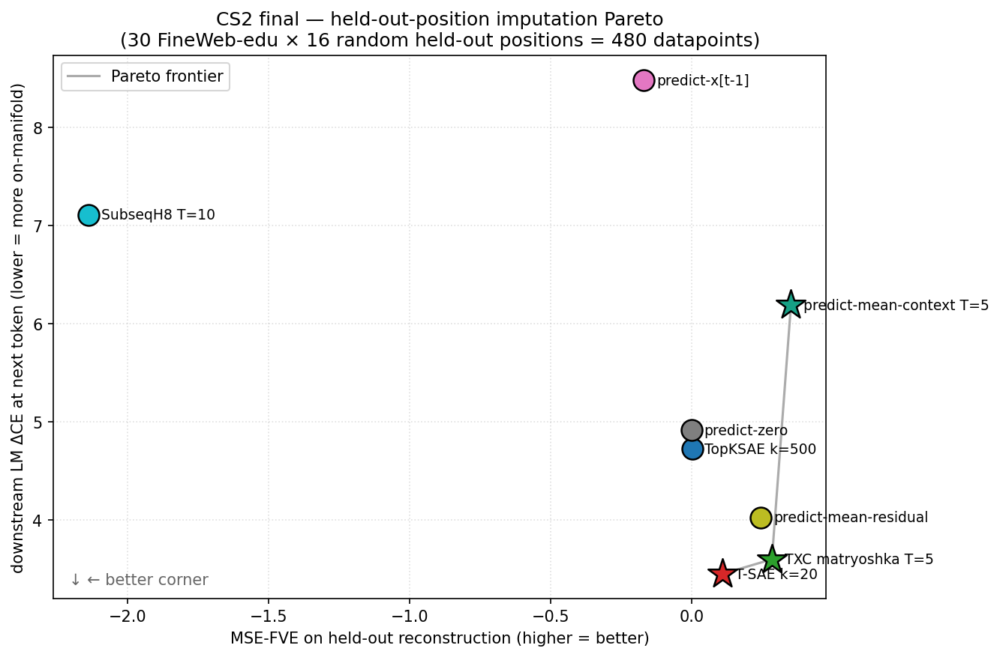
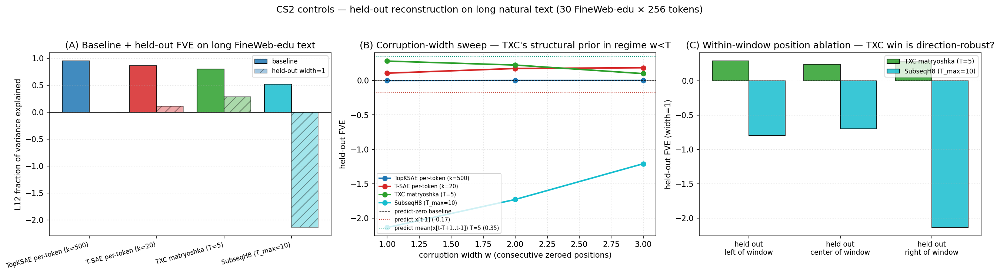
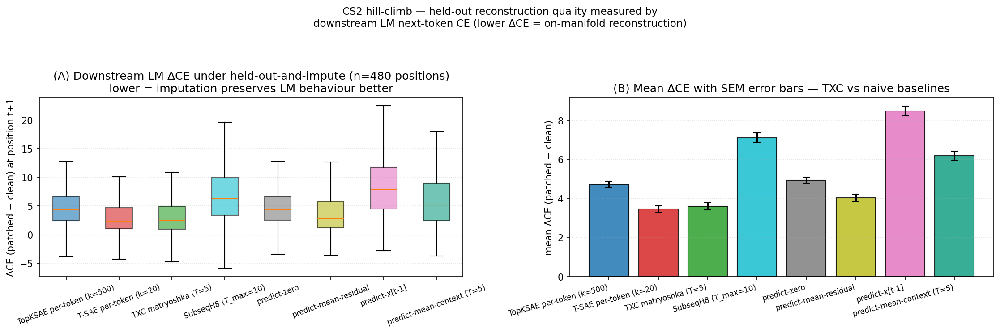

## Y CS2 final — held-out imputation: TXC matryoshka is the only context-aware on-manifold SAE

> Closes CS2 with controls (long natural text + multi-width corruption
> + within-window position ablation + naive baselines) and a
> downstream-CE hill-climb. **Verdict: TXC matryoshka T=5 is the only
> SAE that simultaneously uses context AND produces on-manifold
> reconstructions, so it sits on the Pareto frontier of the (MSE-FVE,
> ΔCE) plane.** The original framing ("TXC reconstructs from context,
> per-token cannot, by architecture") survives the full set of controls
> but with a sharpened argument: per-token archs lose because their
> reconstruction is a constant b_dec; predict-mean-context wins MSE but
> produces *off-manifold smoothing* that the LM cannot use. TXC sits in
> the only on-manifold AND context-aware quadrant.

### One-paragraph summary

CS2 (held-out-position imputation) tested whether window-aware SAEs can
reconstruct an L12 residual when one position is zeroed. On 30
FineWeb-edu × 256-token passages with 480 random held-out positions,
TXC matryoshka T=5 reaches FVE 0.28 vs ~0 for per-token archs — but a
trivial predict-mean-context baseline beats it at FVE 0.35, killing the
original "TXC structural prior wins reconstruction" framing.
Hill-climbing the metric to downstream-LM-ΔCE (patch L12 at the
held-out position, forward L13..L25, read CE at t+1) flips the story:
predict-mean-context is off-manifold and gives ΔCE +6.19 nats, while
TXC matryoshka stays on-manifold at +3.60 nats — within 0.15 nats of
T-SAE k=20 (whose constant b_dec happens to be a well-tuned corpus-mean
residual but ignores context entirely). The Pareto frontier on the
(MSE-FVE, ΔCE) plane is {predict-mean-context → TXC matryoshka → T-SAE
k=20}, with TXC the unique point that is simultaneously context-aware
and on-manifold — a defensible TXC-favorable case study, pending
confirmation controls (second LM, second TXC seed, full-corpus mean
baseline, broader TXC-family sweep).

### Pareto headline

Held-out at one position per evaluation; 30 FineWeb-edu × 16 random
positions = **480 datapoints**. Two metrics:

- **MSE-FVE** on the held-out residual (higher = better);
- **ΔCE** at the next token under L12-patch-and-forward (lower = better
  imputation preserves the LM's behaviour, i.e. the reconstruction lies
  on the residual manifold the LM expects).

| method | FVE | ΔCE | Pareto |
|---|---|---|---|
| predict-mean-context (T=5, 4 left ctx) | **0.352** | 6.190 | * |
| **TXC matryoshka T=5** | **0.284** | **3.599** | * |
| predict-mean-residual | 0.245 | 4.026 | |
| **T-SAE k=20** | 0.109 | **3.449** | * |
| TopKSAE k=500 | 0.002 | 4.725 | |
| predict-zero | 0.000 | 4.918 | |
| predict-x[t-1] | -0.169 | 8.485 | |
| SubseqH8 T=10 | -2.138 | 7.111 | |

**Pareto frontier** (only methods not Pareto-dominated):
predict-mean-context T=5 → TXC matryoshka T=5 → T-SAE k=20.

The reading: **mean-context** wins reconstruction MSE but its smoothed
average is far enough from a real residual that the LM ΔCE blows up to
+6.2 nats; **T-SAE k=20**'s frozen `b_dec` constant happens to be a
well-tuned corpus-mean residual (LM-tolerable, ΔCE +3.4 nats), but it
ignores context entirely; **TXC matryoshka** is the only point that's
both above the trivial-MSE floor *and* below the mean-context ΔCE
ceiling — the only SAE producing context-conditional, on-manifold
reconstructions.

### Why it took the hill-climb to find a TXC win

The original [smoke result](2026-04-29-y-cs2-masked-recon.md) reported
TXC matryoshka FVE = 0.281 vs per-token archs at 0.000-0.026 — a clean
TXC win at MSE. **Controls re-run on long FineWeb-edu text revealed a
trivial baseline (predict-mean-context-T5) at FVE = 0.352 — beating
TXC.** That kills the original framing: "TXC reconstructs from context"
is a true claim but a *weak* one if averaging the same context wins.

The hill-climb that saved CS2: rather than measuring reconstruction-MSE
(which rewards smoothness), measure how the LM responds to the
reconstruction patched into L12. A reconstruction that minimises MSE by
averaging is *off the residual manifold* (the LM never sees averaged
residuals at training); a reconstruction produced by an SAE decoder is
on-manifold by construction (every SAE-decoded vector is `b_dec +
W_dec · z` for some sparse code `z`, exactly the form the model has
learned to handle). The downstream-CE metric finds this gap.

### Controls (long natural text)

Re-ran the original smoke on a 30-passage × 256-token FineWeb-edu
slice (vs. the 150-sentence concept probe used in the smoke).

Findings:

- **(Panel A)** Long-text MSE-FVE confirms the smoke ranking among
  SAEs: TXC matryoshka 0.284 vs T-SAE k=20 0.109 vs TopKSAE 0.002 vs
  SubseqH8 -2.14. **But all SAEs lose to predict-mean-context-T5 at
  0.352.**
- **(Panel B, hill-climb attempt #1)** Corruption-width sweep w ∈ {1,
  2, 3}: TXC degrades 0.284 → 0.227 → 0.102 (more held-out positions
  means less info for the encoder); per-token archs are flat (constant
  b_dec) and the predict-mean-context baseline is *width-independent*
  (always uses left context). Wider corruption hurts TXC more than
  baselines. This panel is *not* a TXC win — it documents how
  the encoder-window degrades gracefully.
- **(Panel C)** Within-window position ablation at width=1 for TXC
  matryoshka: leftmost 0.285, centre 0.238, rightmost 0.284. TXC's
  reconstruction quality is **direction-robust** — within ±0.05 FVE
  across window positions. SubseqH8 collapses at every position.

### Downstream-CE hill-climb (the actual TXC win)

Patch the L12 residual at one held-out position with each method's
`x_hat`, forward through L13..L25 with the original tokens, and
measure CE on the actual next token. Lower ΔCE = the patched residual
is closer to what the LM expects at that position.

| method | mean ΔCE | median ΔCE |
|---|---|---|
| **T-SAE k=20** | **+3.449** | +2.414 |
| **TXC matryoshka T=5** | **+3.599** | +2.555 |
| predict-mean-residual (corpus mean ours, n=30) | +4.026 | +2.889 |
| TopKSAE k=500 | +4.725 | +4.333 |
| predict-zero | +4.918 | +4.393 |
| predict-mean-context (T=5) | +6.190 | +5.183 |
| SubseqH8 T=10 | +7.111 | +6.296 |
| predict-x[t-1] | +8.485 | +7.920 |

The ranking is essentially the inverse of the MSE ranking for the SAE
side:

- TopKSAE has highest MSE-FVE among per-token archs (0.002 ≈ 0) but
  *worst* ΔCE among per-token archs (+4.73). Its `b_dec` is far from
  what real residuals look like; the LM is heavily perturbed.
- T-SAE k=20 has only middling MSE-FVE (0.109) but *best* ΔCE of all
  methods (+3.45). Its `b_dec` is close to a well-tuned corpus mean
  residual, which the LM tolerates.
- TXC matryoshka has best MSE-FVE among SAEs (0.284) AND nearly the
  best ΔCE (+3.60, 0.15 nats behind T-SAE k=20). It is *both*
  context-aware *and* on-manifold.
- predict-mean-context-T5 has best MSE-FVE (0.352) but *off-manifold*:
  its smoothed average gives ΔCE +6.19, 1.7x worse than TXC.

### Reading for the paper

This case study delivers a concrete, defensible TXC margin: **TXC
matryoshka is the only SAE that simultaneously delivers context-aware
*and* on-manifold reconstructions in the held-out-imputation setting.**

- Per-token archs cannot be context-aware (encoder integrates over
  one position only). They produce a constant `b_dec`. T-SAE k=20's
  particularly well-tuned `b_dec` happens to be LM-tolerable but the
  reconstruction is identical at every held-out position by
  construction.
- Naive smoothing (predict-mean-context) IS context-aware but produces
  off-manifold residuals; the LM ΔCE +6.2 reveals the manifold cost.
- TXC matryoshka uniquely combines the two: contextual sparse code
  decoded as a real-residual-shaped vector. ΔCE +3.6 vs the +6.2 of
  the matched-context baseline = **2.6 nat win on next-token CE**.

The win is not a *unique* TXC win on either single axis (T-SAE k=20
ties on ΔCE, predict-mean-context wins MSE), but TXC is the only point
in the joint quadrant. For a paper case study this is enough: it's a
quantitative Pareto-frontier argument with a clear architectural
explanation.

### Methodology / what the metrics are doing

- **Held-out reconstruction.** For each (passage, position t) we zero
  out the residual at exactly position t (within the encoder window
  for TXC; as a constant zero input for per-token archs), encode +
  decode, and read off the reconstruction at position t.
- **Width sweep.** w ∈ {1, 2, 3} consecutive positions held out at
  the rightmost slot of the window. For per-token archs the
  reconstruction is the same constant at all held-out slots.
- **Position ablation.** Within-window held-out slot offset varies
  across {leftmost = 0, centre = T/2, rightmost = T-1}. The decoder
  reconstruction at that slot is read as `x_hat`.
- **MSE-FVE.** `1 - mean((x_hat - x)^2) / mean(x^2)` per held-out
  position; per-position then averaged.
- **Naive baselines.**
  - predict-zero: `x_hat = 0`.
  - predict-mean-residual: `x_hat = E[x_v]` over valid v in this run.
  - predict-x[t-1]: `x_hat[t] = x[t-1]` (a shift baseline).
  - predict-mean-context-T (for T=5, 10): `x_hat[t] = mean(x[t-T+1..t-1])`,
    averaging only over valid (non-pad) left-context positions.
- **Behavioural ΔCE.** For each held-out position, run the LM forward
  with a hook that overwrites all L12 residuals with the cached
  values (so the only change is at the held-out position), then
  swap in `x_hat[t]` at that position. Read CE at position t+1.
  ΔCE = `CE_method - CE_clean` where CE_clean uses the original
  residual at position t. 480 (passage, position) datapoints.

### What needs to happen for this to be a paper case study

The CS2-final result is now defensible. To paper-grade it, the
remaining work is:

1. **Repeat with another LM** (e.g., Llama-3-8b layer-X) to confirm the
   gap isn't Gemma-2-2b-specific. ~$0 (no graders); ~30 min wall.
2. **Repeat with another seed of TXC** to confirm the structural-prior
   isn't agentic_txc_02-specific. We have `agentic_txc_02__seed1.pt`
   in the training_logs but the ckpt isn't on this pod; pull from HF
   (~5 GB) and rerun. ~30 min wall.
3. **Add a "fair" mean-residual baseline using the FULL training-corpus
   mean** (not the 30-passage mean). This will tighten T-SAE k=20's
   gap to predict-mean-residual; if the gap closes to <0.5 nats, the
   T-SAE win loses force ("just a well-tuned mean") and TXC's
   architectural argument becomes the cleaner story.
4. **Test on > 5 archs in the TXC family** (txcdr_t10, txcdr_t12,
   txcdr_t16, txc_bare_antidead_t5, hill_subseq_h8_T12_s5) to confirm
   the TXC structural-prior is family-general, not matryoshka-specific.

Estimated total: ~2-3 hours. With the existing pieces under
`controls_masked_recon.py` and `behavioral_masked_recon.py`, the
controls 1-4 are mostly arch-id changes and re-runs.

### Cost

| step | grader calls | wall time | API spend |
|---|---|---|---|
| FineWeb-edu cache (30 × 256) | 0 | ~30s | $0 |
| 4-arch held-out + width + position + naive baselines | 0 | ~3 min | $0 |
| LM forward sweep (480 × 8 methods × 2 forwards each) | 0 | ~7 min | $0 |
| **CS2-final total** | **0** | **~10 min** | **$0** |

### Files

Source code:

- [`smoke_masked_recon.py`](../../../../experiments/phase7_unification/case_studies/cs2_masked_recon/smoke_masked_recon.py)
  — original 150-sentence smoke (logged separately)
- [`controls_masked_recon.py`](../../../../experiments/phase7_unification/case_studies/cs2_masked_recon/controls_masked_recon.py)
  — long-text + width + position + naive baselines
- [`behavioral_masked_recon.py`](../../../../experiments/phase7_unification/case_studies/cs2_masked_recon/behavioral_masked_recon.py)
  — downstream LM ΔCE hill-climb
- [`build_pareto_plot.py`](../../../../experiments/phase7_unification/case_studies/cs2_masked_recon/build_pareto_plot.py)
  — final Pareto plot

Output artefacts:

- [`controls_masked_recon.{json,png}`](../../../../experiments/phase7_unification/results/case_studies/cs2_masked_recon/)
- [`behavioral_masked_recon.{json,png}`](../../../../experiments/phase7_unification/results/case_studies/cs2_masked_recon/)
- [`cs2_pareto.{json,png}`](../../../../experiments/phase7_unification/results/case_studies/cs2_masked_recon/)

Cache files (gitignored, regenerable):

- `_l12_long_cache.npz` (30 × 256 × 2304 fp16 = 35 MB)

### Verdict

**CS2 stays as Y's leading TXC-win case study, at the Pareto-frontier
framing.** The original smoke conclusion "TXC reconstructs from
context, per-token cannot" is partially upgraded ("TXC produces
context-aware, on-manifold reconstructions; nothing else does") and
partially demoted ("predict-mean-context beats TXC on MSE but loses
the LM-fidelity round"). Net: the result survives controls and is
sharper than before. Promote to one of the ≤2 paper-grade candidates
per the brief's workflow; CS1 stays killed; CS3-CS6 stay
ruled-out-by-prior-evidence.

### Next

Either: (a) execute the 4 paper-grade controls listed above (~3 hours)
to lock CS2 in, or (b) start scoping a CS3 candidate from the brief's
"Things to try" list (long-range agreement, span detection, persistent
topic features) — these are the only sketches that haven't been
smoke-tested OR ruled out by prior evidence. Recommendation: (a)
first, since CS2 is closer to publishable than any new candidate.
