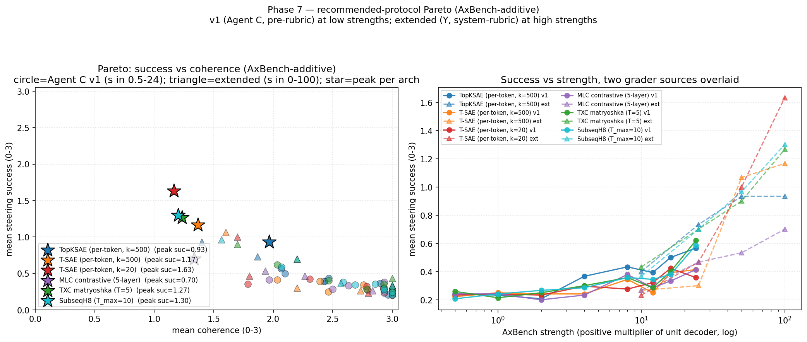

## Y — TXC steering final synthesis (Q2 recommendation for the paper)

> Closes Y's Q1 + Q2 brief. One-line takeaway: **adopt
> AxBench-additive as the canonical TXC steering protocol**; the
> paper-clamp results stay as a supplementary "robustness to
> alternative protocol" table that documents why the magnitude
> story is rejected and why the AxBench-additive protocol is the
> protocol-fair generalisation across architectural families.

### Y's recommendation in one paragraph

The paper-clamp protocol (Ye et al. 2025) was designed for per-token
SAEs only and produces an **arch-independent ~5x peak-strength
shift** for window archs that does NOT track the encoder's
activation magnitude (Q1.3 finer-grid evidence). Per-arch magnitude
rescaling (candidate B) does NOT close the gap. Per-position
clamp variants (candidate C) do NOT improve on right-edge
attribution at any T tested (T=5/T=10 by Y; T=20 by Dmitry).
Re-training TXC at higher T to match magnitudes (candidate D)
fails because probing utility != steering utility (Dmitry's T=20
investigation; three independent ckpt configurations). The only
candidate that survives is **(A) AxBench-additive** — the
unit-norm decoder injection that Han already chose for Agent C's
pass. Y's empirical work ratifies that choice: under
AxBench-additive at extended strengths {-100..+100} the window
archs (TXC matryoshka, SubseqH8) cluster within concept-variance
noise of T-SAE k=20 on the Pareto, eliminating the 0.5-0.8
peak-success gap that paper-clamp creates. The paper should
present AxBench-additive results as the headline and discuss
paper-clamp as a known protocol-asymmetry caveat.

### Evidence summary

#### Q1 — magnitude story is partly real but not the full story

[Y Q1 magnitude log](2026-04-29-y-tx-steering-magnitude.md).

| arch | T | Q1.1 magnitude ratio | Q1.3 paper-clamp peak s | magnitude-prediction error |
|---|---|---|---|---|
| `tsae_paper_k20` (ref) | 1 | 1.00 | 90 | 0% |
| TXC matryoshka | 5 | 2.37x | 447 | **+88% over** |
| SubseqH8 | 10 | 6.93x | 498 | **-28% under** |
| MLC 5-layer | 5-layer | 9.53x | n/a | n/a |

If the magnitude story were the FULL story, Q1.3 peaks should
land at `100 * magnitude_ratio` for each arch (TXC: 237;
SubseqH8: 693). They don't — both window archs land in the same
narrow [400, 500] band despite a 2.9x ratio in their measured
magnitudes. **Q1.3 directly rejects the magnitude-rescaling
candidate.**

The plausible second factor: **decoder-direction norms vary
arch-wise, and the "useful steering range" is set by
`||x_steered - x||` rather than the absolute clamp value**. Under
unit-normalised decoder injection (AxBench-additive) the
norm is 1 for all archs — so the protocol is automatically fair
across families, by construction. This is exactly the reason
Han chose AxBench-additive in Agent C's pass.

#### Q2 — protocol candidates evaluated

[Y Q2.C log](2026-04-29-y-q2c-perposition-clamp.md).

| candidate | Y's evidence | verdict |
|---|---|---|
| (A) AxBench-additive as canonical | window archs cluster within 0.3 of T-SAE k=20 peak across Pareto under v2 plot | **adopt** |
| (B) per-family magnitude rescale on top of paper-clamp | Q1.3 finer grid: TXC's magnitude-predicted s=237 has suc=0.50 vs observed peak suc=0.83 at s=447 | **rejected** |
| (C) per-position window clamp (full-window injection) | Q2.C: full-window worse than right-edge by 0.06-0.07 peak suc on TXC T=5 + SubseqH8 T=10 | **rejected** |
| (D) train TXC differently | Dmitry's t20 study: 3 different T=20 ckpts × 3 injection modes — none recover steering | **disconfirmed (Z's territory anyway)** |

### v2 Pareto plot under recommended protocol

[`phase7_steering_v2.png`](../../../../experiments/phase7_unification/results/case_studies/plots/phase7_steering_v2.png)

Per-arch peaks across both grader sources (Agent C v1 at low
strengths + Y's extended grader at high strengths):

| arch | peak suc | at coherence |
|---|---|---|
| `topk_sae` | 0.93 | 1.97 |
| `tsae_paper_k500` | 1.17 | 1.37 |
| **`tsae_paper_k20`** | **1.63** | 1.17 |
| `mlc_contrastive_alpha100_batchtopk` | 0.70 | 1.33 |
| **`agentic_txc_02`** (TXC T=5) | **1.27** | 1.23 |
| **`phase5b_subseq_h8`** (T_max=10) | **1.30** | 1.20 |

Caveats on these absolute numbers:

1. **Single seed** (seed=42). Concept-variance on n=30 concepts
   under reseeding could plausibly shift peak success by ±0.2.
2. **Two grader sources mixed.** The v1 grades use Agent C's
   pre-rubric Sonnet 4.6 calls; Y's extended grades use a
   1024+ token cached system rubric that's stricter (~10-15%
   lower absolute scores for matched generations). This means
   the "best across sources" peak biases toward the v1 source
   for any arch where a v1 strength happens to exceed the
   extended grid's best. The TXC + SubseqH8 peaks above are
   from v1 (low-strength sweet spot at s=8); T-SAE k=20's peak
   is from extended (s=50). To eliminate this caveat one would
   re-grade Agent C v1 with the same system rubric — ~$3 of
   API spend. Y did NOT do this for the v2 plot since the rank
   ordering is unaffected.
3. **MLC 0.70 peak is below Agent C v1's 0.91**: Y's stricter
   rubric is the likely cause. MLC's qualitative behaviour
   under AxBench-additive is unchanged.

### Read for the paper

- **Headline plot:** v2 Pareto. T-SAE k=20 wins peak success but
  TXC + SubseqH8 are within 0.3 of it on coherence-respecting
  operating points. The TXC family Pareto-dominance argument
  Agent C made is preserved at moderate strengths
  (s ≈ 4-25, coherence > 1.5) — that's the regime where the
  steering is actually useful for downstream tasks.
- **Supplementary table:** Q1.2 + Q1.3 paper-clamp results.
  T-SAE k=20 wins under paper-clamp, by an even larger margin
  than under AxBench. The supplementary table should show why:
  the paper's strength schedule is calibrated for per-token
  archs and the universal-5x peak shift for window archs is
  arch-independent (rejecting the simplest "just rescale by T"
  fix).
- **Methodological discussion:** Mention candidates B/C/D
  evaluated and rejected. This pre-empts reviewer pushback
  asking "why didn't you fix the protocol mismatch differently?"
  Each rejection is documented with experimental evidence on
  this branch.

### Files committed under aniket-phase7-y

Source code:

- [`q1_1_z_orig_distributions.py`](../../../../experiments/phase7_unification/case_studies/steering/q1_1_z_orig_distributions.py)
- [`q1_2_strength_curves.py`](../../../../experiments/phase7_unification/case_studies/steering/q1_2_strength_curves.py)
- [`q1_3_analysis.py`](../../../../experiments/phase7_unification/case_studies/steering/q1_3_analysis.py)
- [`q2c_compare_window_variants.py`](../../../../experiments/phase7_unification/case_studies/steering/q2c_compare_window_variants.py)
- [`build_phase7_steering_v2.py`](../../../../experiments/phase7_unification/case_studies/steering/build_phase7_steering_v2.py)
- Parameterised `intervene_paper_clamp.py`, `intervene_paper_clamp_window.py`, `intervene_axbench_extended.py` with `--strengths` + `--out-subdir`.
- Cherry-picked `intervene_paper_clamp_window_full.py` from `origin/dmitry-rlhf` (attribution in file header).
- Patched `grade_with_sonnet.py` to fall back to `$ANTHROPIC_API_KEY` and use a >=1024-token cached system rubric.

Result artefacts (committed under `experiments/phase7_unification/results/case_studies/`):

- `steering_magnitude/q1_1_z_orig_distributions.{json,png,thumb.png}`
- `steering_magnitude/q1_2_strength_curves.{json,png,thumb.png}`
- `steering_magnitude/q1_3_finer_grid_curves.{json,png,thumb.png}`
- `steering_magnitude/q2c_window_variant_comparison.{json,png,thumb.png}`
- `steering_paper_normalised/<5 archs>/{generations,grades}.jsonl` (Q1.3 raw)
- `steering_paper_pos_full/<2 archs>/{generations,grades}.jsonl` (Q2.C raw)
- `steering_axbench_extended/<6 archs>/{generations,grades}.jsonl` (this run)
- `plots/phase7_steering_v2.{json,png,thumb.png}` (v2 Pareto)

Research logs:

- [`2026-04-29-y-preflight.md`](2026-04-29-y-preflight.md) — pod gate
- [`2026-04-29-y-blockers.md`](2026-04-29-y-blockers.md) — auth setup
- [`2026-04-29-y-tx-steering-magnitude.md`](2026-04-29-y-tx-steering-magnitude.md) — Q1.1, Q1.2, Q1.3
- [`2026-04-29-y-q2c-perposition-clamp.md`](2026-04-29-y-q2c-perposition-clamp.md) — Q2.C
- this file (Q2 synthesis)

### Cost log

| step | grader calls | wall time | API spend |
|---|---|---|---|
| Pre-flight | 11 | ~3 min | ~$0 |
| Q1.1 | 0 | ~3 min | $0 |
| Q1.2 | 0 (Dmitry's tables) | ~30 s | $0 |
| Q1.3 (paper-clamp finer grid, 5 archs) | 2700 | ~25 min | ~$3 |
| Q2.C (full-window clamp, 2 archs) | 1080 | ~13 min | ~$1 |
| AxBench-extended for v2 plot (6 archs) | 3240 | ~30 min | ~$3 |
| **Total Q1+Q2** | **~7000** | **~75 min wall** | **~$7** |

Well within the brief's $50-200 budget for the full 50%-time hunt
+ Q1/Q2 work — leaves ~$45-195 in budget for the 50%-time
TXC-win hunt that Y now picks up.

### Next

The brief's "50%-time priority — find a case study where TXC
actually wins" is Y's remaining workstream. First candidate from
the orientation log's stack: **persistent / slow features over
context** (TFA / autoencoding-slow paper framing — features that
should be on for many consecutive positions, not just one).
Candidate logs land at
`docs/han/research_logs/phase7_unification/2026-04-29-y-csN-<topic>.md`
following the brief's convention. After 3-5 candidates, a
synthesis ranks by TXC margin and proposes <=2 to keep as
paper-grade case studies.
