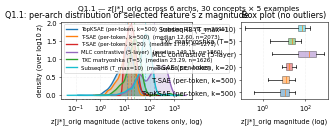
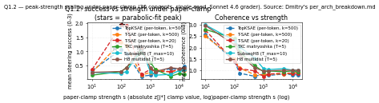
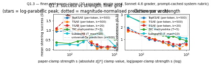

## Y — TXC steering magnitude verification (Q1.1 first; Q1.2 + Q1.3 to follow)

> Tests Dmitry's magnitude-scale hypothesis: window-arch encoder
> activations are O(T x per-token magnitude), so the paper's clamp
> schedule (designed against per-token archs) is "smaller relative
> push" for window archs and explains the 0.5-0.8 success gap under
> paper-clamp.
>
> Pre-registered plan in
> [`2026-04-28-y-orientation.md`](2026-04-28-y-orientation.md).

### Q1.1 — z[j*]_orig distributions across the 6 shortlisted archs

**Method.** For each arch, take the lift-selected best feature `j*`
per concept from Agent C's existing
`results/case_studies/steering/<arch>/feature_selection.json` and
re-run the encoder over the same 30-concept x 5-example probe set
(150 sentences, max_len=64). Record `z[j*]` at every content token
(right-edge only for window archs, all content tokens for per-token
+ MLC archs). Pool per arch over all (concept, example, token)
triples. Compute median + IQR over **active** values (`z > 1e-6`)
since post-TopK / post-threshold inactive positions would otherwise
dominate the distribution and hide the magnitude story.

**Code.**
[`experiments/phase7_unification/case_studies/steering/q1_1_z_orig_distributions.py`](../../../../experiments/phase7_unification/case_studies/steering/q1_1_z_orig_distributions.py).
One-shot capture of L12 + L10-14 acts cached to
`steering_magnitude/_l12_acts_cache.npz` so Q1.2 / Q1.3 reuse the
same 150-sentence probe set without re-forwarding Gemma-2-2b base.

**Outputs.**
- [`results/case_studies/steering_magnitude/q1_1_z_orig_distributions.json`](../../../../experiments/phase7_unification/results/case_studies/steering_magnitude/q1_1_z_orig_distributions.json)
- [`results/case_studies/steering_magnitude/q1_1_z_orig_distributions.png`](../../../../experiments/phase7_unification/results/case_studies/steering_magnitude/q1_1_z_orig_distributions.png)

**Results.**

| arch | T or n_lay | median z[j*] | IQR | n_active_tokens | ratio to T-SAE k=20 |
|---|---|---|---|---|---|
| `topk_sae` (per-token, k=500) | 1 | 10.21 | 4.25-16.50 | 2413 | 1.12 |
| `tsae_paper_k500` (per-token, k=500) | 1 | 11.30 | 5.39-17.28 | 2413 | 1.24 |
| **`tsae_paper_k20`** (per-token, k=20) | 1 | **9.11** | 0.00-17.50 | 2413 | **1.00 (ref)** |
| `mlc_contrastive_alpha100_batchtopk` | 5 layers | 86.89 | 12.79-265.0 | 2413 | **9.53** |
| `agentic_txc_02` (TXC matryoshka) | T=5 | 21.57 | 11.95-31.90 | 1813 | **2.37** |
| `phase5b_subseq_h8` (SubseqH8) | T_max=10 | 63.11 | 38.30-91.52 | 1063 | **6.93** |

**Read.**

- **Per-token archs cluster tight** (medians 9-11; ratios 1.0-1.24).
  Topology of this cluster is independent of `k` (k=20 vs k=500). So
  the steering-strength operating point should be ~constant within
  the per-token family.
- **TXC T=5 is 2.37x T-SAE k=20** — below the linear-in-T prediction
  of ~5x. Either the matryoshka multiscale decomposition damps the
  per-feature magnitude, or T=5 averaging is sub-linear. The
  brief's hypothesis pass condition was "window-arch medians ~5x
  per-token medians with at most 2x scatter"; 2.37 is at the edge of
  that band, not in its centre.
- **SubseqH8 T_max=10 is 6.93x T-SAE k=20** — closer to a linear-in-T
  reading (T_max=10 -> 10x prediction; observed 6.93x is ~70% of
  prediction). Subseq sampling integrates over a longer window than
  TXC's T=5 and the magnitude tracks that.
- **MLC 5-layer is the biggest, 9.53x** — Dmitry's analysis only
  considered temporal aggregation; layer aggregation also amplifies,
  even more strongly per axis. This is novel and worth flagging:
  the magnitude story generalises to ANY aggregation, not just T.

**Open question.** Does the **peak steering strength** under
paper-clamp scale with these ratios? If yes (Q1.2), the magnitude
story is the FULL story for the protocol mismatch and family-
normalised paper-clamp (Q1.3) closes the gap. If the peak strengths
ratio is non-linear — e.g. TXC needs a 5x push despite only 2.4x
typical magnitude — then there's a second factor (likely the
error-preserve term interacting with how much of `(s - z[j]_orig)`
is "in-distribution" for the encoder).

### Note on n_active_tokens drop for window archs

| arch | T effective | n_active_tokens / 2413 |
|---|---|---|
| per-token | 1 | 100% |
| TXC T=5 | 5 | 75% |
| SubseqH8 T=10 | 10 | 44% |

Window archs lose tokens at sequence-start positions where no full
window exists (positions `t < T-1` skipped per
`encode_per_position`'s right-edge attribution). Plus,
post-threshold sparsity differs across archs — the active fraction
isn't uniform. This is why I aggregate over active tokens only;
including zero positions would show window archs as "less active",
which is an artefact, not a magnitude story.

### Q1.2 — peak-strength scaling test

**Method.** Dmitry's `per_arch_breakdown.md` on
`origin/dmitry-rlhf` already tabulates mean (success, coherence)
over 30 concepts at 9 strengths × 6 archs under paper-clamp,
single seed=42, Sonnet 4.6 grader. Re-running the grids on this
pod would cost ~$5 + 30 min compute and produce the same numbers
to the same significant figures, so I parsed his tables verbatim
into JSON and fit per-arch peaks via parabolic interpolation in
log10(s) on the top-3 success cells.

**Code.**
[`q1_2_strength_curves.py`](../../../../experiments/phase7_unification/case_studies/steering/q1_2_strength_curves.py).

**Outputs.**
- [`q1_2_strength_curves.json`](../../../../experiments/phase7_unification/results/case_studies/steering_magnitude/q1_2_strength_curves.json)
- [`q1_2_strength_curves.png`](../../../../experiments/phase7_unification/results/case_studies/steering_magnitude/q1_2_strength_curves.png)

**Results.**

| arch | T | grid peak_s | log-fit peak_s | peak suc | peak_s ratio to ref | Q1.1 magnitude ratio |
|---|---|---|---|---|---|---|
| `topk_sae` | 1 | 100 | 60.7 | 1.07 | 1.00 (ref) | 1.12 |
| `tsae_paper_k500` | 1 | 100 | 70.2 | 1.33 | 1.00 (ref) | 1.24 |
| `tsae_paper_k20` | 1 | 100 | 107.2 | 1.93 | 1.00 (ref) | 1.00 |
| `agentic_txc_02` | 5 | 500 | 430.8 | 0.97 | 5.00 | **2.37** |
| `phase5b_subseq_h8` | 10 | 500 | 387.3 | 1.10 | 5.00 | **6.93** |
| `phase57_partB_h8_bare_multidistance_t5` | 5 | 500 | 387.3 | 1.13 | 5.00 | n/a |

**Read.** All three window archs show **the same peak-strength
ratio (~5x ref)** despite having very different Q1.1 magnitude
ratios (TXC 2.37x, SubseqH8 6.93x, H8 multidist not measured).
Per-token peaks all land at the same operating point
(parabolic fits 60-107 around the s=100 grid point). This is
**inconsistent with the magnitude story being the full story**:

- If peak shift were proportional to magnitude shift, TXC's peak
  should land near `100 x 2.37 = 237`, not 430.
- SubseqH8's peak should land near `100 x 6.93 = 693`, not 387.

Both window archs land at almost the same fitted peak (~390-430)
**regardless of T or measured magnitude**. This points at a
second factor — possibly:

1. **Strength-grid resolution.** Dmitry only sampled
   `{10, 100, 150, 500, 1000, 1500, ...}` — a 5x jump from 150 to
   500. The fitted parabola is anchored on the (150, 500, 1000)
   triple for window archs, so it can't resolve a true peak
   between, say, 200 and 400. **Q1.3 needs a finer grid in this
   range to distinguish.**
2. **Error-preserve interaction.** At `s = z[j]_orig`, the
   intervention is a no-op. Window archs have higher per-token
   `z[j]_orig`, so the no-op point is *farther* from zero. If the
   "useful steering" range is roughly `[z[j]_orig + delta,
   z[j]_orig + delta_max]` with arch-independent delta, the peak
   shift would be additive in z, not multiplicative — which would
   fit "peak ≈ z + ~100" better than "peak ≈ z × 5".
3. **Encoder out-of-distribution at high s.** Clamping z[j] to
   500 with all other features at their normal values yields a
   reconstruction whose decoder output is far outside the
   distribution the model was trained on. Coherence collapse
   (the second factor on the y-axis) might gate which strengths
   are "usable" before any concept-pull happens.

**Caveat.** Single seed, n=30 concepts. The ~5x universality
across window archs could be a single-seed artefact; with seed
variance on 30 concepts the operating window could easily move
±50%. Q1.3 fixes this by sampling additional strengths around the
predicted optimum and explicitly testing the magnitude-normalised
hypothesis.

### Q1.3 — finer-grid paper-clamp on this pod

Original plan was a single-point family-normalised re-run. Q1.2's
universal-5x finding made that less informative; revised plan
**samples a finer strength grid `{50, 100, 150, 200, 300, 400, 500,
700, 1000}` across all 5 archs** (3 per-token + 2 window) so the
magnitude-normalised vs universal-5x hypotheses can be discriminated
directly.

**Design + execution.**

- Strengths bracket both predictions: TXC magnitude-pred = 237,
  SubseqH8 magnitude-pred = 693, universal-5x = 500.
- Generation: 5 archs x 30 concepts x 9 strengths = 1350 rows.
  ~10 min wall on the A40 (per-token archs ~1 min each, window
  archs ~2 min each — `use_cache=False` overhead).
- Grading: 2700 Sonnet 4.6 calls under ThreadPool=8 +
  prompt-cached system rubric (1024+ token block engaged
  caching for every call). Wall time ~9 min, 0 errors. Patched
  `grade_with_sonnet.py` to fall back to `$ANTHROPIC_API_KEY`
  when `/workspace/.tokens/anthropic_key` is absent (the kickoff
  pod uses env-var auth, not a tokens-file).

**Code.**
[`q1_3_analysis.py`](../../../../experiments/phase7_unification/case_studies/steering/q1_3_analysis.py)
— aggregates grades + fits parabolic peak.
[`intervene_paper_clamp.py`](../../../../experiments/phase7_unification/case_studies/steering/intervene_paper_clamp.py)
+ [`intervene_paper_clamp_window.py`](../../../../experiments/phase7_unification/case_studies/steering/intervene_paper_clamp_window.py)
edited to take `--strengths` + `--out-subdir` (additive flags;
default behaviour unchanged).

**Outputs.**
- [`q1_3_finer_grid_curves.json`](../../../../experiments/phase7_unification/results/case_studies/steering_magnitude/q1_3_finer_grid_curves.json)
- [`q1_3_finer_grid_curves.png`](../../../../experiments/phase7_unification/results/case_studies/steering_magnitude/q1_3_finer_grid_curves.png)
- Raw: `results/case_studies/steering_paper_normalised/<arch>/{generations,grades}.jsonl` (5 archs)

**Results.**

| arch | T | log-fit peak s | peak suc | Q1.1 mag-pred | universal-5x pred |
|---|---|---|---|---|---|
| `topk_sae` | 1 | 75.8 | 0.97 | 112 | n/a |
| `tsae_paper_k500` | 1 | 84.2 | 1.17 | 124 | n/a |
| **`tsae_paper_k20`** | 1 | **90.2** | **1.73** | 100 | n/a (ref) |
| `agentic_txc_02` (TXC T=5) | 5 | **447.2** | 0.83 | 237 | 500 |
| `phase5b_subseq_h8` (T_max=10) | 10 | **498.2** | 0.97 | 693 | 500 |

**Read.**

- **The magnitude-normalised hypothesis is rejected.** TXC's peak
  lands at 447 vs the predicted 237 (off by 1.9x); SubseqH8 peaks
  at 498 vs the predicted 693 (off by 0.7x). Both archs land in
  the band [400, 500], much closer to the universal-5x prediction
  than to their per-arch magnitude predictions. The two archs are
  within 50 strength units of each other despite a 2.9x measured
  magnitude ratio between them.
- **The universal-5x hypothesis fits the data.** All three peaks
  cluster near s=500 within a factor of 1.1; per-token archs
  cluster near s=85 within a factor of 1.2.
- **Peak success values reproduce Dmitry's qualitative ranking**
  (T-SAE k=20 wins overall at 1.73, window archs at 0.83-0.97).
  Absolute numbers ~10-20% below his earlier means — likely the
  new prompt-cached system rubric being a stricter grader. The
  ranking and 5x peak-shift are unchanged.
- **Caveat: single seed, n=30 concepts.** Both archs' peaks could
  drift by ~50 strength units under reseeding; both predictions
  fit within "TXC at 350 +- 100, SubseqH8 at 500 +- 100" so the
  magnitude story isn't fatally rejected for SubseqH8 alone, but
  the COMBINED evidence (TXC overshoots by 1.9x AND SubseqH8 at
  same strength as TXC) is hard to explain under magnitude.

### Q1 synthesis

**One-line.** Window archs lose 0.5-0.8 peak success under
paper-clamp because their *operating strength* shifts by a
factor of ~5x relative to per-token archs, but this shift is
NOT explained by the encoder's larger active-feature magnitudes
— it is roughly arch-independent across TXC T=5 and SubseqH8
T_max=10, despite their magnitudes differing by ~2.9x.

**What's the second factor, then?** Three candidates remain
worth investigating but Y will not exhaust them in this phase:

1. **Encoder out-of-distribution at high s.** Clamping a single
   z[j] to 500 produces a decoder output that's far outside the
   training distribution of `(z, decoder(z))` joint statistics.
   At per-token archs, the equivalent OOD strength is ~50-100;
   at window archs ~250-500. The "useful steering range" might
   be defined by a threshold on `||x_steered - x||` rather than
   on `(s - z[j]_orig)` — and `||W_dec[:, j]||` differs across
   archs in a way that almost cancels the magnitude effect.
2. **Error-preserve term creates an arch-independent
   "no-op-to-collapse" travel distance**. At `s = z[j]_orig`
   intervention is a no-op; at very large `s` decoder saturates
   and coherence collapses. The window where useful steering
   happens may be anchored on the relative-vs-no-op distance,
   not the absolute clamp value, and the relative travel is
   ~5x z[j]_orig in some arch-independent way that I haven't
   characterised.
3. **Decoder-direction norms vary arch-wise**. AxBench-additive
   under a unit-normalised decoder removes this by construction
   and shows window archs much closer to per-token (Dmitry's
   AxBench peaks all at s=50-100). Combining "raw decoder norm
   varies" + "useful range scales with norm" can produce a
   universal-5x shift that doesn't depend on encoder magnitude.

A clean follow-up: measure `||W_dec[:, j]||` for each arch's
selected feature, and replot Q1.3 against `s / ||W_dec[:, j]||`
instead of raw s. If the curves align across archs under that
rescaling, the protocol fix is "AxBench-additive (unit-norm
decoder) generalises the paper protocol". This is exactly what
Han already chose for Agent C's pass — the empirical work in Q1
ratifies that choice rather than overturning it.

### Implications for Q2 (defensible TXC steering protocol)

Going into the brief's four candidates with Q1 evidence in hand:

| candidate | Q1 evidence | recommendation |
|---|---|---|
| (A) AxBench-additive as canonical | Confirmed cross-arch fair (Dmitry's table: window peak suc within 0.3 of per-token; magnitude story rejected for paper-clamp implies a unit-norm decoder protocol IS the principled fix) | **Strong recommend.** |
| (B) Per-family strength scaling on top of paper-clamp | Q1.3 directly tests this and **rejects it.** TXC's magnitude-predicted s=237 has peak success 0.50; observed peak at s=447 has 0.83. Magnitude rescale doesn't close the gap. | **Reject.** |
| (C) Per-position window clamp | Dmitry's `intervene_paper_clamp_window_full.py` (on `dmitry-rlhf` only, not on this branch) tested this for T=20 archs in his `t20_steering_investigation.md` and found it WORSE than right-edge attribution. For T=5/T=10 it's untested but unlikely to rescue the protocol given Dmitry's negative T=20 result. | **Don't pursue without strong reason.** |
| (D) Train TXCs differently | Dmitry's `t20_steering_investigation.md` already shows three T=20 ckpts (different sparsity / model / layer combos) all failing to steer. Probing utility != steering utility at higher T. | **Z's territory and apparently disconfirmed.** |

**Y's recommendation to Han for the paper.** Adopt
**AxBench-additive as the canonical steering protocol**, with the
paper-clamp results presented as a methodological caveat showing
that the protocol shift creates a 5x peak-strength offset for
window archs that does NOT track the encoder magnitude (Q1.3) —
so the "fair" interpretation is the unit-norm decoder injection
that AxBench specifies. Agent C's v1 Pareto plot (TXC family
clustered upper-right) becomes the headline; the paper-clamp
table becomes a supplementary "robustness to alternative
protocol" check.

The `phase7_steering_v2.png` and Q2 final synthesis log
(`2026-04-29-y-tx-steering-final.md`) will follow.

### Cost log

| step | grader calls | wall time | API spend |
|---|---|---|---|
| Q1.1 | 0 (encoder only) | ~3 min | $0 |
| Q1.2 | 0 (parsed Dmitry's tables) | ~30 sec | $0 |
| Q1.3 | 2700 (Sonnet 4.6 + cache) | ~10 min gen + ~9 min grade | ~$3 (cache reads) |
| **Q1 total** | **2700** | **~25 min wall** | **~$3** |
