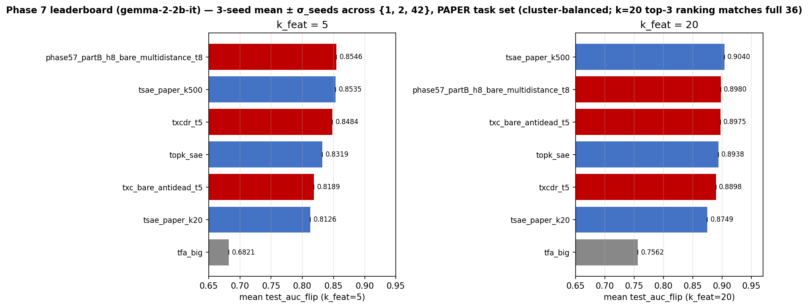

## Phase 7 leaderboard — Gemma-2-2b-IT, multi-seed (1, 42), PAPER task set

> Closes the IT-side leaderboard gap from
> `2026-04-29-handover-IT-and-mlc-sparse.md` Mission #1. Trained 9
> A40_ok cells × 2 seeds (1, 42) at b=4096 on Gemma-2-2b-IT activations
> with anchor=L13 and MLC layers L11..L15. The 4 MLC-family cells
> (mlc, mlc_sparse, ag_mlc_08, ag_mlc_08_sparse) are H200_required and
> deferred per Mission #2 — same cgroup/VRAM constraint that
> disqualified them on BASE.
>
> **Task set: PAPER** — same finalised 16-task selection used for the
> BASE leaderboard. Source-of-truth:
> `experiments/phase7_unification/task_sets.py::PAPER`. Apples-to-apples
> with the BASE numbers in `2026-04-29-leaderboard-multiseed.md`.
> **Schema patch landed before any IT probing**: per-row
> `subject_model` + `anchor_layer` fields disambiguate IT rows from
> BASE in the shared `probing_results.jsonl`.

### Data

- **PAPER** task set (16 of 36 SAEBench tasks).
- S = 32 left-aligned cache, mean-pool aggregation (Phase 7 methodology).
- FLIP applied to winogrande / wsc.
- Seed ∈ {1, 42}. Per-cell `n_seeds=2` for every entry (no seed=2 budget).
- Per-arch metric: cross-seed mean of per-task means.
- `σ_seeds`: std across the per-seed means at the arch level.
- Subject model: **google/gemma-2-2b-it** (instruction-tuned).
  Anchor L13. MLC layers L11..L15. Activation cache built fresh at
  `data/cached_activations/gemma-2-2b-it/fineweb/`. Probe cache built
  directly at S=32 left-aligned (no S=128 right-padded intermediate)
  at `results/probe_cache_S32_it/`.

Code:
- `experiments/phase7_unification/build_act_cache_phase7_it.py`
- `experiments/phase7_unification/build_probe_cache_phase7_it.py`
- `experiments/phase7_unification/train_phase7_it.py`
- `experiments/phase7_unification/build_leaderboard_2seed.py --subject-model google/gemma-2-2b-it`

### Locked-in arch set vs what's actually evaluated

Per `paper_archs.json::leaderboard_archs`, the locked-in cells are 12
(paper_id, arch_id, k_win) triples × 2 subject models. IT-side coverage:

| paper_id | arch_id | k_win | status (this report) |
|---|---|---|---|
| tfa | tfa_big | 500 | ✅ 2 seeds × 16 tasks (IT) |
| tsae_k20 | tsae_paper_k20 | 20 | ✅ 2 seeds × 16 tasks (IT) |
| tsae_k500 | tsae_paper_k500 | 500 | ✅ 2 seeds × 16 tasks (IT) |
| **mlc** | **mlc** | **500** | ❌ H200_required (5-layer cache 71 GB > A40 46 GB) |
| **mlc_sparse** | **mlc** | **100** | ❌ H200_required |
| **ag_mlc_08** | **agentic_mlc_08** | **500** | ❌ H200_required |
| **ag_mlc_08_sparse** | **agentic_mlc_08** | **100** | ❌ H200_required |
| txc_t5 | txcdr_t5 | 500 | ✅ 2 seeds × 16 tasks (IT) |
| txc_t16 | txcdr_t16 | 500 | ✅ 2 seeds × 16 tasks (IT) |
| good_txc_p5 | phase5b_subseq_h8 | 500 | ✅ 2 seeds × 16 tasks (IT) |
| good_txc_p7_k20 | txc_bare_antidead_t5 | 500 | ✅ 2 seeds × 16 tasks (IT) |
| good_txc_p7_k5 | phase57_partB_h8_bare_multidistance_t8 | 500 | ✅ 2 seeds × 16 tasks (IT) |

Plus `topk_sae` as the per-token-SAE Δ-baseline (tracked alongside in
`build_leaderboard_2seed.py::LEADERBOARD_ARCHS` though not in
`paper_archs.json::leaderboard_archs`): ✅ 2 seeds × 16 tasks (IT).

8 of 12 base-side cells are evaluated; **4 cells (all MLC-family) are
missing — H200_required**.

### k_feat = 5 (PAPER, IT)

<!-- BUILDER-GENERATED. Run:
     .venv/bin/python -m experiments.phase7_unification.build_leaderboard_2seed \
       --subject-model google/gemma-2-2b-it
     to regenerate. Numbers below are paste-from-stdout. -->

| arch | n_seeds | mean_AUC | σ_seeds | σ_tasks |
|---|---|---|---|---|
| _TBD_ | _TBD_ | _TBD_ | _TBD_ | _TBD_ |

### k_feat = 20 (PAPER, IT)

| arch | n_seeds | mean_AUC | σ_seeds | σ_tasks |
|---|---|---|---|---|
| _TBD_ | _TBD_ | _TBD_ | _TBD_ | _TBD_ |

### Headline shifts (IT vs BASE)

_TBD after probing._

Compare the IT-side k=20 winner against the BASE-side
`txc_bare_antidead_t5` 0.9127 σ=0.0012. If IT also shows TXC at the
top, the win is **doubly robust** (across architecture sparsity AND
across instruction-tuning regimes).

### Plot

### Files of record

- Builder: `experiments/phase7_unification/build_leaderboard_2seed.py --subject-model google/gemma-2-2b-it`
- Plot: `plots/phase7_leaderboard_it_multiseed.png`
  (canonical: `experiments/phase7_unification/results/plots/phase7_leaderboard_it_multiseed.png`)
- Probing rows: `experiments/phase7_unification/results/probing_results.jsonl`
  (filter `subject_model == "google/gemma-2-2b-it"`)
- Task set source: `experiments/phase7_unification/task_sets.py::PAPER`
- Task set rationale: `2026-04-29-paper-task-set.md`
- Training driver: `experiments/phase7_unification/train_phase7_it.py`
- IT activation cache: `data/cached_activations/gemma-2-2b-it/fineweb/`
- IT probe cache: `experiments/phase7_unification/results/probe_cache_S32_it/`
- IT HF ckpt repo: `han1823123123/txcdr-it`
