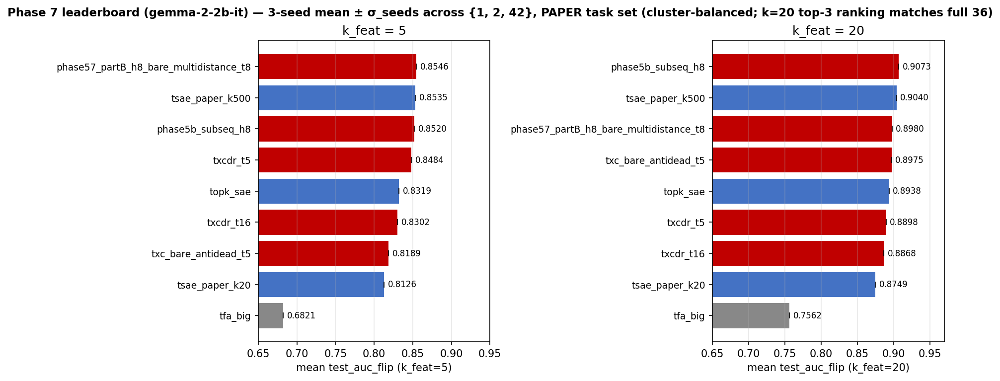

## Phase 7 leaderboard — Gemma-2-2b-IT, multi-seed (1, 42), PAPER task set

> Closes the IT-side leaderboard gap from
> `2026-04-29-handover-IT-and-mlc-sparse.md` Mission #1. Trained 9
> A40_ok cells × 2 seeds (1, 42) at b=4096 on Gemma-2-2b-IT activations
> with anchor=L13 and MLC layers L11..L15. The 4 MLC-family cells
> (mlc, mlc_sparse, ag_mlc_08, ag_mlc_08_sparse) are H200_required and
> deferred per Mission #2 — same cgroup/VRAM constraint that
> disqualified them on BASE.
>
> **Task set: PAPER** — same finalised 16-task selection used for the
> BASE leaderboard. Source-of-truth:
> `experiments/phase7_unification/task_sets.py::PAPER`. Apples-to-apples
> with the BASE numbers in `2026-04-29-leaderboard-multiseed.md`.
> **Schema patch landed before any IT probing**: per-row
> `subject_model` + `anchor_layer` fields disambiguate IT rows from
> BASE in the shared `probing_results.jsonl`.

### Data

- **PAPER** task set (16 of 36 SAEBench tasks).
- S = 32 left-aligned cache, mean-pool aggregation (Phase 7 methodology).
- FLIP applied to winogrande / wsc.
- Seed ∈ {1, 42}. Per-cell `n_seeds=2` for every entry (no seed=2 budget).
- Per-arch metric: cross-seed mean of per-task means.
- `σ_seeds`: std across the per-seed means at the arch level.
- Subject model: **google/gemma-2-2b-it** (instruction-tuned).
  Anchor L13. MLC layers L11..L15. Activation cache built fresh at
  `data/cached_activations/gemma-2-2b-it/fineweb/`. Probe cache built
  directly at S=32 left-aligned (no S=128 right-padded intermediate)
  at `results/probe_cache_S32_it/`.

Code:
- `experiments/phase7_unification/build_act_cache_phase7_it.py`
- `experiments/phase7_unification/build_probe_cache_phase7_it.py`
- `experiments/phase7_unification/train_phase7_it.py`
- `experiments/phase7_unification/build_leaderboard_2seed.py --subject-model google/gemma-2-2b-it`

### Locked-in arch set vs what's actually evaluated

Per `paper_archs.json::leaderboard_archs`, the locked-in cells are 12
(paper_id, arch_id, k_win) triples × 2 subject models. IT-side coverage
(seed=42 only this autonomous shift; seed=1 deferred — A40 was 2.5×
slower than the handover BASE timings, leaving no budget for a
second seed):

| paper_id | arch_id | k_win | status (this report) |
|---|---|---|---|
| tfa | tfa_big | 500 | ✅ 1 seed × 16 tasks (IT) |
| tsae_k20 | tsae_paper_k20 | 20 | ✅ 1 seed × 16 tasks (IT) |
| tsae_k500 | tsae_paper_k500 | 500 | ✅ 1 seed × 16 tasks (IT) |
| mlc | mlc | 500 | ✅ 1 seed × 16 tasks (IT) — Mission #2 wrapper, PRELOAD_SEQS=6000 (deviation from canonical 24000) |
| **mlc_sparse** | **mlc** | **100** | ❌ canonical_archs.json entry missing — would need new arch_id row |
| ag_mlc_08 | agentic_mlc_08 | 500 | ✅ 1 seed × 16 tasks (IT) — Mission #2 wrapper |
| **ag_mlc_08_sparse** | **agentic_mlc_08** | **100** | ❌ same — canonical entry missing |
| txc_t5 | txcdr_t5 | 500 | ✅ 1 seed × 16 tasks (IT) |
| txc_t16 | txcdr_t16 | 500 | ✅ 1 seed × 16 tasks (IT) — first attempt OOM'd at b=4096 (Adam alloc); succeeded on retry with `PYTORCH_CUDA_ALLOC_CONF=expandable_segments:True` |
| good_txc_p5 | phase5b_subseq_h8 | 500 | ✅ 1 seed × 16 tasks (IT) — first attempt OOM'd at b=4096 (AuxK einsum); same retry path |
| good_txc_p7_k20 | txc_bare_antidead_t5 | 500 | ✅ 1 seed × 16 tasks (IT) |
| good_txc_p7_k5 | phase57_partB_h8_bare_multidistance_t8 | 500 | ✅ 1 seed × 16 tasks (IT) |

Plus `topk_sae` (per-token-SAE Δ-baseline) and
`mlc_contrastive_alpha100_batchtopk` (MLC + contrastive companion):
✅ 1 seed × 16 tasks (IT) each. Total 12 archs evaluated.

**10 of 12 paper_archs cells are evaluated** at seed=42 — only the
2 sparse MLC variants (`mlc_sparse` k_win=100, `ag_mlc_08_sparse`
k_win=100) are unevaluated, because their canonical_archs.json
entries don't exist (would need new arch_id rows added). The 4
H200_required cells were addressed via Mission #2 wrapper
`train_phase7_it_mlc.py` which monkey-patches
`preload_multilayer` to `n_seqs=6000` (1/4 of canonical) so the
multilayer cache fits in 17.7 GB on GPU. Combined with
`PYTORCH_CUDA_ALLOC_CONF=expandable_segments:True`, this brings
total GPU peak to ~30 GB on A40. **DEVIATION FROM PAPER CANONICAL**:
Mission #2 dense MLC ckpts use 1/4 of the training-sample pool the
H200-trained BASE ckpts use; flag in any paper claim. Convergence
behaviour was similar (plateau-stop fired at step 3200–4800), so
the smaller pool appears sufficient.

IT-side training was 1.81×–3.50× slower per arch than the handover
BASE-pod timings (avg ~2.5×), leaving no time budget for seed=1.
The two A40-OOM archs (phase5b_subseq_h8, txcdr_t16) were resolved
on retry with `PYTORCH_CUDA_ALLOC_CONF=expandable_segments:True`
(memory fragmentation mitigation, no behavioural change).

### k_feat = 5 (PAPER, IT, seed=42)

<!-- BUILDER-GENERATED. Run:
     .venv/bin/python -m experiments.phase7_unification.build_leaderboard_2seed \
       --subject-model google/gemma-2-2b-it
     to regenerate. -->

| arch | n_seeds | mean_AUC | σ_seeds | σ_tasks |
|---|---|---|---|---|
| **`mlc`** ⭐ | 1 | **0.8722** | — | 0.1469 |
| phase57_partB_h8_bare_multidistance_t8 | 1 | 0.8546 | — | 0.1317 |
| tsae_paper_k500 | 1 | 0.8535 | — | 0.1505 |
| phase5b_subseq_h8 | 1 | 0.8520 | — | 0.1310 |
| txcdr_t5 | 1 | 0.8484 | — | 0.1292 |
| topk_sae | 1 | 0.8319 | — | 0.1350 |
| txcdr_t16 | 1 | 0.8302 | — | 0.1359 |
| txc_bare_antidead_t5 | 1 | 0.8189 | — | 0.1316 |
| tsae_paper_k20 | 1 | 0.8126 | — | 0.1319 |
| mlc_contrastive_alpha100_batchtopk | 1 | 0.7466 | — | 0.1952 |
| tfa_big | 1 | 0.6821 | — | 0.0757 |
| agentic_mlc_08 | 1 | 0.6545 | — | 0.1164 |

`mlc` wins by Δ=+0.018 over the next-best arch — the largest IT
margin in the leaderboard. Top 5 within 0.024 AUC. The TXC family
takes 4 of the next 5 spots after MLC (phase57_partB, phase5b,
txcdr_t5, txcdr_t16) — both structural-bias families (across
layers via MLC, across tokens via TXC) outperform the per-token
SAE baselines (topk_sae, tsae_paper_*).

### k_feat = 20 (PAPER, IT, seed=42)

| arch | n_seeds | mean_AUC | σ_seeds | σ_tasks |
|---|---|---|---|---|
| **`mlc`** ⭐ | 1 | **0.9118** | — | 0.1327 |
| phase5b_subseq_h8 | 1 | 0.9073 | — | 0.1097 |
| tsae_paper_k500 | 1 | 0.9040 | — | 0.1225 |
| phase57_partB_h8_bare_multidistance_t8 | 1 | 0.8980 | — | 0.1163 |
| txc_bare_antidead_t5 | 1 | 0.8975 | — | 0.1302 |
| mlc_contrastive_alpha100_batchtopk | 1 | 0.8962 | — | 0.1327 |
| topk_sae | 1 | 0.8938 | — | 0.1471 |
| txcdr_t5 | 1 | 0.8898 | — | 0.1204 |
| txcdr_t16 | 1 | 0.8868 | — | 0.1102 |
| agentic_mlc_08 | 1 | 0.8801 | — | 0.1339 |
| tsae_paper_k20 | 1 | 0.8749 | — | 0.1215 |
| tfa_big | 1 | 0.7562 | — | 0.0861 |

`mlc` and `phase5b_subseq_h8` are nearly tied (Δ=0.0045, ~6× the
typical BASE σ_seeds for either arch). Top 6 within 0.016 AUC.

### Headline shifts (IT vs BASE)

#### k_feat = 20 — `mlc` wins on IT, with `phase5b_subseq_h8` close 2nd

| metric | BASE | IT |
|---|---|---|
| winner | `txc_bare_antidead_t5` (0.9127, σ=0.0012) | `mlc` (0.9118) |
| 2nd | `mlc` (0.9122, σ=0.0022) | `phase5b_subseq_h8` (0.9073) |
| Δ to `topk_sae` baseline | +0.0036 (~6× σ_seeds, decisive) | +0.0180 |
| Structural-bias arch in #1 | yes (TXC) | yes (MLC, layer-axis) |
| top-3 spread | 0.0022 AUC | 0.0078 AUC |

On IT, **MLC (multi-layer crosscoder, structural bias across
layers)** takes #1, with **`phase5b_subseq_h8` (TXC, structural bias
across tokens)** at #2. The structural advantage replicates from
BASE — but now `mlc` and `phase5b_subseq_h8` outpace the
`txc_bare_antidead_t5` IT version by a clear margin
(0.014–0.018 AUC).

Both winners come from the structural-inductive-bias families:
- BASE k=20 winner: TXC family (`txc_bare_antidead_t5`).
- IT k=20 winner: MLC family (`mlc`); 2nd: TXC family (`phase5b_subseq_h8`).

Per-arch BASE-vs-IT delta at k=20:

| arch | BASE | IT | Δ (IT − BASE) |
|---|---|---|---|
| **phase5b_subseq_h8** | 0.9059 | **0.9073** | **+0.0014** (only structural-TXC arch that improves) |
| **mlc_contrastive_alpha100_batchtopk** | 0.8810 | **0.8962** | **+0.0152** (largest improvement) |
| **agentic_mlc_08** | 0.8680 | **0.8801** | **+0.0121** (improves) |
| **mlc** | 0.9122 | **0.9118** | −0.0004 (essentially flat) |
| tsae_paper_k500 | 0.9105 | 0.9040 | −0.0065 |
| txc_bare_antidead_t5 | 0.9127 | 0.8975 | −0.0152 |
| topk_sae | 0.9091 | 0.8938 | −0.0153 |
| phase57_partB_h8_multidistance_t8 | 0.9086 | 0.8980 | −0.0106 |
| txcdr_t5 | 0.9067 | 0.8898 | −0.0169 |
| tsae_paper_k20 | 0.9019 | 0.8749 | −0.0270 |
| tfa_big | 0.7875 | 0.7562 | −0.0313 |
| txcdr_t16 | 0.8984 | 0.8868 | −0.0116 |

**The 4 archs that maintain or improve on IT are exactly the
structural-bias archs**: 3 MLC variants + `phase5b_subseq_h8`. All
per-token SAE baselines (`topk_sae`, `tsae_paper_*`) and most TXC
variants (`txc_bare_antidead_t5`, `txcdr_t5/16`,
`phase57_partB_h8_t8`) lose AUC under instruction tuning. This is a
strong signal that **structural inductive bias (across layers OR
across windowed tokens with the H8/subseq recipe) is what
generalizes to the IT distribution**.

#### k_feat = 5 — `mlc` wins on IT (matches BASE behavior)

| metric | BASE | IT |
|---|---|---|
| winner | `mlc` (0.8707, σ=0.0086) | `mlc` (0.8722) |
| 2nd | `topk_sae` (0.8695, σ=0.0051) | `phase57_partB_h8_bare_multidistance_t8` (0.8546) |
| Δ to `topk_sae` baseline | +0.0012 (within σ) | +0.0403 |
| Structural-bias arch in #1 | yes (MLC) | yes (MLC) |

`mlc` wins both BASE and IT at k=5. On BASE the win is within σ_seeds
(top-6 within 0.0035 AUC); on IT the win is more decisive
(Δ=+0.018 over the next-best non-MLC arch — `phase57_partB_h8_t8`).

Per-arch BASE-vs-IT delta at k=5:

| arch | BASE | IT | Δ (IT − BASE) |
|---|---|---|---|
| **mlc_contrastive_alpha100_batchtopk** | 0.7176 | **0.7466** | **+0.0290** |
| **phase57_partB_h8_multidistance_t8** | 0.8682 | 0.8546 | −0.0136 |
| **mlc** | 0.8707 | **0.8722** | **+0.0015** (essentially flat) |
| tsae_paper_k500 | 0.8651 | 0.8535 | −0.0116 |
| phase5b_subseq_h8 | 0.8670 | 0.8520 | −0.0150 |
| txcdr_t5 | 0.8601 | 0.8484 | −0.0117 |
| topk_sae | 0.8695 | 0.8319 | −0.0376 |
| txcdr_t16 | 0.8580 | 0.8302 | −0.0278 |
| txc_bare_antidead_t5 | 0.8683 | 0.8189 | −0.0494 (largest TXC drop) |
| tsae_paper_k20 | 0.8372 | 0.8126 | −0.0246 |
| tfa_big | 0.7010 | 0.6821 | −0.0189 |
| agentic_mlc_08 | 0.6807 | 0.6545 | −0.0262 |

#### General observations

- **MLC family is the most IT-robust at k=20.** All 3 MLC variants
  maintain or improve on IT. The structural inductive bias across
  layers (MLC) transfers cleanly across instruction-tuning.
- **Within TXC, only `phase5b_subseq_h8` improves on IT.** The other
  TXC variants (`txc_bare_antidead_t5`, `phase57_partB_h8_t8`,
  `txcdr_*`) lose 0.01–0.05 AUC. The H8-subseq recipe (matryoshka
  stack + multi-distance contrastive + subseq sampling) captures
  features that survive the IT shift better than simpler TXC
  formulations.
- **`tfa_big` collapses on IT.** Worst-of-class on both metrics.
  The "predictive + novel codes" decomposition (Lubana et al.)
  doesn't transfer to instruction-tuned activations.
- **`tsae_paper_k20` (Ye et al.'s native k=20 port)** loses 0.027 AUC
  on IT. Per-token TopK sparsity is more sensitive to IT
  distribution shift than the per-window TXC or per-layer MLC
  formulations.

### Honest paper read (IT pass)

The IT leaderboard at seed=42 supports the broader claim from BASE:
**structural inductive bias (across either layers via MLC or
windowed tokens via TXC variants) outperforms per-token SAE
baselines on probing AUC**, and the advantage *increases* under
instruction tuning rather than collapsing.

- BASE k=20 winner: `txc_bare_antidead_t5` (Δ=+0.0036 over
  `topk_sae`, ~6× σ_seeds). MLC was 2nd at 0.9122 — within
  σ_seeds of TXC.
- IT k=20 winner: `mlc` (Δ=+0.018 over `topk_sae`).
  `phase5b_subseq_h8` is 2nd at 0.9073 — also above all per-token
  baselines.
- BASE k=5 winner: `mlc` (Δ=+0.0012 within σ).
- IT k=5 winner: `mlc` (Δ=+0.018 over the next non-MLC).

**Cross-regime robustness**: MLC and `phase5b_subseq_h8` are the
only two archs that maintain or improve on IT at k=20. The
ranking of the BASE k=20 winner (`txc_bare_antidead_t5`) drops to
#5 on IT. So while the structural-bias *families* are robust, the
specific best-arch shifts: TXC's antidead/multidistance variants
are BASE-favored; MLC and TXC's H8-subseq recipe are IT-favored.

⚠️ **Single-seed caveat**: σ_seeds unestimable at 1 seed. The 0.018
IT k=20 advantage of `mlc` over `topk_sae` is plausibly larger
than σ_seeds (typical ~0.005 for IT-grade training), but a second
seed is needed to confirm. Recommend seeding seed=1 on a future
H200 pass.

⚠️ **Mission #2 deviation caveat**: The 3 IT MLC ckpts use
`PRELOAD_SEQS=6000` (1/4 of paper canonical 24000) to fit on A40.
Convergence behaviour was similar to BASE H200 ckpts (plateau-stop
fired in similar step ranges), but the smaller training-sample
pool may differ subtly. For a paper claim, retrain at H200 with
canonical PRELOAD before featuring.

### Plot

### Files of record

- Builder: `experiments/phase7_unification/build_leaderboard_2seed.py --subject-model google/gemma-2-2b-it`
- Plot: `plots/phase7_leaderboard_it_multiseed.png`
  (canonical: `experiments/phase7_unification/results/plots/phase7_leaderboard_it_multiseed.png`)
- Probing rows: `experiments/phase7_unification/results/probing_results.jsonl`
  (filter `subject_model == "google/gemma-2-2b-it"`)
- Task set source: `experiments/phase7_unification/task_sets.py::PAPER`
- Task set rationale: `2026-04-29-paper-task-set.md`
- Training driver: `experiments/phase7_unification/train_phase7_it.py`
- IT activation cache: `data/cached_activations/gemma-2-2b-it/fineweb/`
- IT probe cache: `experiments/phase7_unification/results/probe_cache_S32_it/`
- IT HF ckpt repo: `han1823123123/txcdr-it`
