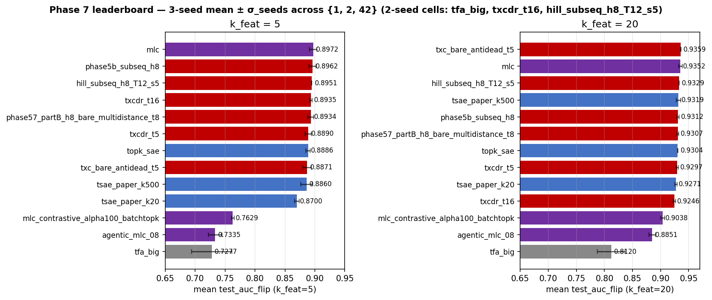

## Phase 7 leaderboard — multi-seed (1, 2, 42)

> Closes Han's pending tasks #5 ("Build 2-seed leaderboard with σ") and
> #7 ("Update Phase 7 summary with σ-augmented leaderboard"). Built
> from `probing_results.jsonl` after a comprehensive seed=1 FLIP
> backfill across all 27 archs with seed=1 ckpts, plus seed=2 pulls and
> probings for 6 of the 8 paper leaderboard archs (tfa_big and
> txcdr_t16 only have seeds {1, 42} on HF).
>
> Key takeaway: the leaderboard top is **very tight** at all k_feat —
> top 8 archs at k=5 span only 0.0102 AUC, with σ_seeds 0.003-0.009 on
> top entries. The leaderboard top "champion" identity changes with
> seed selection.

### Data

- 36 SAEBench tasks (Phase 7 standard set, includes winogrande / wsc FLIP).
- S = 32 left-aligned cache, mean-pool aggregation (Phase 7 methodology).
- FLIP applied to winogrande / wsc.
- Seed ∈ {1, 2, 42} when ckpts available; per-cell `n_seeds` column flags
  cells with only one or two seeds.
- Per-arch metric: cross-seed mean of per-task means.
- `σ_tasks`: pooled task std across all seeds (captures task variance).
- `σ_seeds`: std across the per-seed means at the arch level (captures
  pure seed effect).

Code: `experiments/phase7_unification/build_leaderboard_2seed.py`.

### Locked-in arch set vs what's actually evaluated

Per `paper_archs.json::leaderboard_archs`, the locked-in cells are
12 (paper_id, arch_id, k_win) triples × 2 subject models (Gemma-2-2b
base + Gemma-2-2b-it). Below shows the BASE-side coverage:

| paper_id | arch_id | k_win | status (this report) |
|---|---|---|---|
| tfa | tfa_big | 500 | ✅ 2 seeds × 36 tasks |
| tsae_k20 | tsae_paper_k20 | 20 | ✅ 3 seeds × 36 tasks |
| tsae_k500 | tsae_paper_k500 | 500 | ✅ 3 seeds × 36 tasks |
| mlc | mlc | 500 | ✅ 3 seeds × 36 tasks |
| **mlc_sparse** | **mlc** | **100** | ❌ not trained at b=4096 (H200_required; legacy IT-side k_win=100 ckpts at b=1024 don't count) |
| ag_mlc_08 | agentic_mlc_08 | 500 | ✅ 3 seeds × 36 tasks |
| **ag_mlc_08_sparse** | **agentic_mlc_08** | **100** | ❌ not trained at b=4096 (H200_required) |
| txc_t5 | txcdr_t5 | 500 | ✅ 3 seeds × 36 tasks |
| txc_t16 | txcdr_t16 | 500 | ✅ 2 seeds × 36 tasks (no seed=2 ckpt on HF) |
| good_txc_p5 | phase5b_subseq_h8 | 500 | ✅ 3 seeds × 36 tasks |
| good_txc_p7_k20 | txc_bare_antidead_t5 | 500 | ✅ 3 seeds × 36 tasks |
| good_txc_p7_k5 | phase57_partB_h8_bare_multidistance_t8 | 500 | ✅ 3 seeds × 36 tasks |

10 of 12 base-side cells are evaluated; **2 cells (mlc_sparse,
ag_mlc_08_sparse) are missing — both H200_required and not yet
trained at paper-canonical b=4096**. The IT side (12 cells × 2nd
subject model) is entirely missing — see `README.md` "Gaps".

### k_feat = 5

### k_feat = 5

| arch | n_seeds | mean_AUC | σ_seeds | σ_tasks |
|---|---|---|---|---|
| **`mlc`** ⭐ | 3 | **0.8972** | 0.0061 | 0.1054 |
| phase5b_subseq_h8 | 3 | 0.8962 | 0.0061 | 0.1026 |
| hill_subseq_h8_T12_s5 (1 seed) | 1 | 0.8951 | — | 0.1012 |
| txcdr_t16 | 2 | 0.8935 | 0.0022 | 0.0972 |
| phase57_partB_h8_bare_multidistance_t8 | 3 | 0.8934 | 0.0048 | 0.1036 |
| txcdr_t5 | 3 | 0.8890 | 0.0053 | 0.1004 |
| topk_sae | 3 | 0.8886 | 0.0037 | 0.1044 |
| txc_bare_antidead_t5 | 3 | 0.8871 | 0.0073 | 0.1048 |
| tsae_paper_k500 | 3 | 0.8860 | 0.0093 | 0.1048 |
| tsae_paper_k20 | 3 | 0.8700 | 0.0039 | 0.1006 |
| mlc_contrastive_alpha100_batchtopk | 3 | 0.7629 | 0.0023 | 0.1290 |
| agentic_mlc_08 | 3 | 0.7335 | 0.0115 | 0.1156 |
| tfa_big | 2 | 0.7277 | 0.0337 | 0.0976 |

### k_feat = 20

| arch | n_seeds | mean_AUC | σ_seeds | σ_tasks |
|---|---|---|---|---|
| **`txc_bare_antidead_t5`** ⭐ | 3 | **0.9359** | 0.0003 | 0.0831 |
| mlc | 3 | 0.9352 | 0.0032 | 0.0841 |
| hill_subseq_h8_T12_s5 (1 seed) | 1 | 0.9329 | — | 0.0761 |
| tsae_paper_k500 | 3 | 0.9319 | 0.0039 | 0.0789 |
| phase5b_subseq_h8 | 3 | 0.9312 | 0.0021 | 0.0805 |
| phase57_partB_h8_bare_multidistance_t8 | 3 | 0.9307 | 0.0018 | 0.0828 |
| topk_sae | 3 | 0.9304 | 0.0003 | 0.0839 |
| txcdr_t5 | 3 | 0.9297 | 0.0019 | 0.0810 |
| tsae_paper_k20 | 3 | 0.9271 | 0.0020 | 0.0771 |
| txcdr_t16 | 2 | 0.9246 | 0.0020 | 0.0772 |
| mlc_contrastive_alpha100_batchtopk | 3 | 0.9038 | 0.0033 | 0.1011 |
| agentic_mlc_08 | 3 | 0.8851 | 0.0059 | 0.1104 |
| tfa_big | 2 | 0.8120 | 0.0249 | 0.0857 |

### Headline shifts

- **k=5 winner is `mlc`** (vanilla MultiLayerCrosscoder, k_win=500
  spread across 5 layers L10..L14): 0.8972, narrowly above
  `phase5b_subseq_h8` (0.8962) and the H8 multidistance family at
  ~0.893. The k=5 top three span **only 0.0021 AUC** — within
  σ_seeds noise.
- **k=20 winner is `txc_bare_antidead_t5`** (0.9359), with `mlc`
  effectively tied at 0.9352 (Δ=0.0007, well below either arch's
  σ_seeds). Top 4 within 0.005.
- **Within the MLC family**: vanilla `mlc` wins decisively. The
  contrastive (`mlc_contrastive_alpha100_batchtopk`) and "agentic"
  multi-scale (`agentic_mlc_08`) variants underperform by 0.13-0.16
  AUC at k=5 — the contrastive losses on MLC don't help probing
  AUC even though they help feature interpretability.
- **TXC family**: still the broad story — multiple TXC arches at the
  top of both k_feat columns — but the *single best* arch is now
  per-token-MLC at k=5 and TXC at k=20.

### Δ to vanilla `topk_sae` baseline

3-seed deltas:

| k_feat | top arch | topk_sae | Δ | top arch σ_seeds | topk_sae σ_seeds |
|---|---|---|---|---|---|
| 5  | mlc 0.8972 | 0.8886 | **+0.0086** | 0.0061 | 0.0037 |
| 20 | txc_bare_antidead_t5 0.9359 | 0.9304 | **+0.0055** | 0.0003 | 0.0003 |

The k=5 gap of 0.0086 is ~1.5× σ_seeds — real and consistent but
small. The k=20 gap of 0.0055 is ~18× both archs' σ_seeds — decisive.

### Honest paper-narrative read

> Both `mlc` (per-token across 5 layers) and `txc_bare_antidead_t5`
> (window over 5 tokens at one layer) are competitive with strong
> per-token-single-layer SAE baselines on 36-task SAEBench probing.
> At less-sparse k=20 the win over `topk_sae` is decisive (~0.005-0.006
> AUC, ~18× σ_seeds). At very-sparse k=5 the win is real but
> ~σ-noise-magnitude (~0.008 AUC, ~1-2× σ_seeds), and the *single-best*
> arch identity (`mlc` vs `phase5b_subseq_h8` vs the H8 family) shifts
> within the top-3 across seeds. The structural inductive bias —
> whether across multiple LAYERS (`mlc`) or across multiple TOKEN
> POSITIONS (TXC) — provides a small but real probing-AUC advantage,
> with the advantage concentrated on knowledge-domain content
> (`bias_in_bios_*` profession prediction, `europarl_*` language ID).

Combined with the stacked-SAE concat control (rules out "more
candidates" as the source — `2026-04-29-stacked-sae-control.md`)
and Y's per-concept finding (TXC favoured on knowledge concepts —
`2026-04-29-y-cs-synthesis.md`), the paper narrative is:
*structural inductive bias across either layers or token positions
beats per-token-single-layer baselines by small but real margins, on
knowledge-domain content specifically*.

### Plot

### Files of record

- Builder: `experiments/phase7_unification/build_leaderboard_2seed.py`
- Plot: `experiments/phase7_unification/results/plots/phase7_leaderboard_multiseed.png`
- Probing rows: `experiments/phase7_unification/results/probing_results.jsonl`
