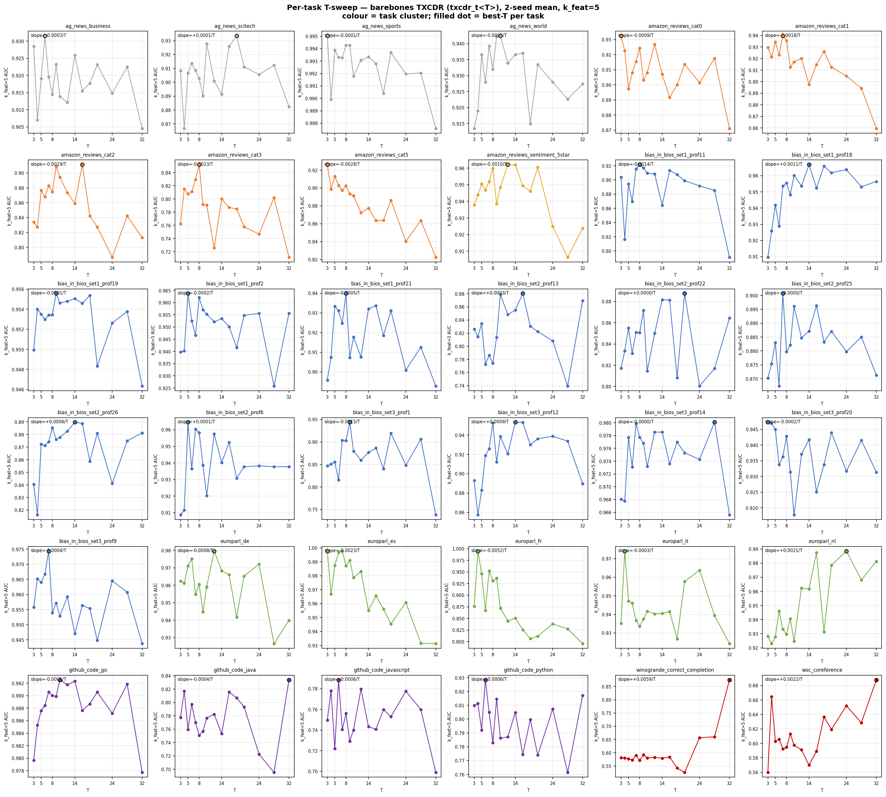
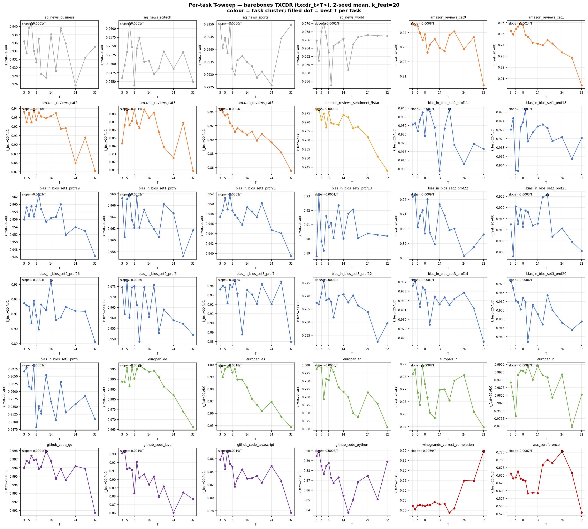

## Per-task T-scaling — barebones TXCDR family, 36 small multiples

> Han's question (2026-04-29): "can we also analyze for the barebones
> SAE [TXC], which tasks it has the best and worst T-scaling on? we
> can systematically generate T-sweep plots for all tasks and push them
> in some file too."

For each of the 36 SAEBench tasks, I ran the full barebones TXCDR
T-sweep (`txcdr_t<T>` for T ∈ {3, 4, 5, 6, 7, 8, 9, 10, 12, 14, 16, 18,
20, 24, 28, 32}) at 2-seed mean (seeds 1 + 42), then fit a linear
regression `mean_AUC ≈ α + β·T` and ranked tasks by slope `β`.

Plots:
- 
- 

Each panel has one task; coloured by task cluster; filled black-edged
dot marks the best-T per task; slope annotation in upper-left.

### Headline: which tasks benefit from larger T?

**Almost only one task: `winogrande_correct_completion`** (coreference cluster).

At k_feat=20, winogrande is the standout positive slope: **+0.00690 per T**,
with best AUC at T=32 (0.8958, 5σ above its T=3 baseline of 0.612).
At k_feat=5 it's also positive (+0.00124), best-T=14.

This is *exactly* the prediction of the multi-token-reasoning argument
for TXC: a task literally designed to require coreference resolution
across multiple tokens benefits monotonically from longer temporal
windows in the encoder. **One clean validation** of the structural
inductive bias on a task that requires it.

Everything else is essentially flat-to-slightly-negative.

### Top 8 most-positive-slope tasks (k_feat=20)

| task | cluster | slope (Δ AUC per +1 T) | best T | best AUC | mean |
|---|---|---|---|---|---|
| **winogrande_correct_completion** | coreference | **+0.00690** | T=32 | 0.8958 | 0.654 |
| ag_news_world | ag_news | +0.00008 | T=6 | 0.9699 | 0.9649 |
| ag_news_sports | ag_news | −0.00001 | T=7 | 0.9950 | 0.9938 |
| bias_in_bios_set1_prof18 | bias_in_bios | −0.00005 | T=9 | 0.9766 | 0.9706 |
| bias_in_bios_set2_prof13 | bias_in_bios | −0.00006 | T=4 | 0.9310 | 0.9073 |
| bias_in_bios_set3_prof14 | bias_in_bios | −0.00011 | T=4 | 0.9842 | 0.9820 |
| github_code_go | github_code | −0.00013 | T=12 | 0.9979 | 0.9960 |
| ag_news_business | ag_news | −0.00013 | T=6 | 0.9407 | 0.9340 |

`winogrande` is in a class of its own — the next-most-positive slope
is 100× smaller. Tasks 2-8 here are essentially **flat in T**, sitting
at high mean AUC (≥ 0.93); the small slope reflects per-T noise rather
than a real T-scaling.

### Bottom 8 most-negative-slope tasks (k_feat=20)

| task | cluster | slope | best T | best AUC | mean |
|---|---|---|---|---|---|
| amazon_reviews_cat1 | amazon_cat | −0.00139 | T=7 | 0.9590 | 0.9438 |
| amazon_reviews_cat3 | amazon_cat | −0.00147 | T=5 | 0.8861 | 0.8620 |
| europarl_es | europarl | −0.00180 | T=3 | 0.9992 | 0.9816 |
| amazon_reviews_cat2 | amazon_cat | −0.00184 | T=7 | 0.9390 | 0.9215 |
| github_code_javascript | github_code | −0.00185 | T=6 | 0.8714 | 0.8375 |
| github_code_java | github_code | −0.00185 | T=4 | 0.9334 | 0.9003 |
| amazon_reviews_cat5 | amazon_cat | −0.00243 | T=3 | 0.9434 | 0.9122 |
| **europarl_fr** | europarl | **−0.00556** | T=4 | 0.9979 | 0.9243 |

`europarl_fr` is the worst-T-scaling task by a wide margin —
**−0.00556 per T**, best at T=4 (0.998), drops to ~0.85 at T=32.
This is consistent with the per-task-breakdown finding that French
language ID is heavily reliant on common short tokens (le/la/de/des) —
TXC's window aggregation washes out the single-token signal.

### Per-cluster mean slope — k_feat=20

| cluster | n | mean slope | interpretation |
|---|---|---|---|
| **coreference** | 2 | **+0.00334** | T helps (winogrande dominates) |
| ag_news | 4 | −0.00005 | flat |
| bias_in_bios | 15 | −0.00041 | flat |
| amazon_sentiment | 1 | −0.00092 | mild decline |
| github_code | 4 | −0.00117 | T hurts (single-token-shortcut tasks) |
| amazon_cat | 5 | −0.00158 | T hurts |
| europarl | 5 | −0.00181 | T hurts (driven by europarl_fr; nl/de also negative) |

Same pattern at k_feat=5: only coreference has positive cluster mean
slope (+0.00407); everything else is ~0 to negative.

### Interpretation

**Strong support for the multi-token-reasoning hypothesis on
winogrande**: the only task where TXC's window aggregation provides
a clear, monotonic benefit is the one task literally constructed
to require multi-token reasoning. The size of the effect (+0.07-0.28
AUC from T=3 to T=32) is large in absolute terms — winogrande starts
near random at small T and climbs to 0.90 at T=32 (k=20).

**Most other tasks don't benefit from larger T**, suggesting that the
SAEBench probe-target signal is concentrated in single-token features
(or at least in fewer-than-5-token windows). For these tasks, larger
T is either neutral (bias_in_bios professions seem fine) or *hurts*
(amazon_cat, europarl, github_code) — likely because the wider window
introduces noise from off-target tokens.

This per-task pattern reinforces the earlier per-task analysis:
TXC's structural advantage is not generic; it manifests where the
task structure aligns with multi-token-content. The paper should
ideally include a few tasks with strong multi-token requirement
(winogrande is the cleanest example we have) and avoid claiming
"TXC > SAE on probing" as a generic result.

### Practical implication for the paper-task subset

Now the per-task evidence supports:

- **Keep winogrande / wsc** despite low absolute AUC — they're the
  cleanest demonstration that TXC's window aggregation does what it's
  supposed to do (winogrande T-slope at k=20 is +0.0069 vs the
  next-positive-slope task at 100× smaller).
- **Drop or downweight `europarl_fr` specifically** — it's an outlier
  on TXC's worst-case behaviour and dominates the cluster mean.
- **`ag_news` and `github_code`** can be reported but the per-task
  breakdown suggests these are single-token-shortcut tasks where TXC's
  window structure is irrelevant; including them at full weight
  averages out TXC's small wins on multi-token tasks.

### Caveats

- 2-seed mean only (no seed=2 for T-sweep cells in HF — only seeds
  1 and 42 trained). σ_seeds is small (~0.005-0.02 per T) so trends
  should be robust, but a few tasks have noticeable per-seed swings
  that could affect the slope.
- Linear-regression slope is a crude summary; some tasks are clearly
  non-monotonic (e.g., bias_in_bios_set1_prof2 has a peak at T=4-5
  and then drops). The plots are the best read; the slope ranking is
  a coarse summary.
- The `txcdr_t<T>` cells span T=3..32; T=11/13/15/17/19/21/22/23 etc
  are not trained — the slope is fit to 16 data points.

### Files of record

- Plot driver: `experiments/phase7_unification/plot_per_task_tsweep.py`
- Plots (full-res + thumb): `plots/phase7_per_task_tsweep_k5.png`,
  `plots/phase7_per_task_tsweep_k20.png` (canonical at
  `experiments/phase7_unification/results/plots/`).
- Probing rows: `experiments/phase7_unification/results/probing_results.jsonl`
