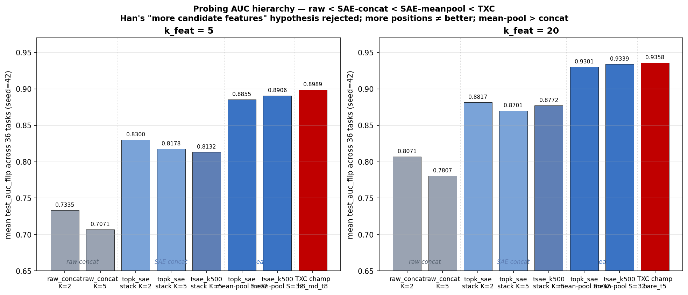

## Stacked-SAE concat control — does TXC's lead survive a "more candidate features" baseline?

> Han's concern (2026-04-29): "The lack of any success on the
> behavioural benchmarks is making me suspicious of the sparse probing
> results. Can you try to train a probe on stacked SAE activations
> across 2 and 5 sequence positions. If this outperforms the txc then
> I think this result is much less significant than we thought."
>
> Clarification: stacked = CONCAT, not mean-pool.

### Headline figure

The plot is intentionally bare-bones: 7 representations, ranked at
both `k_feat=5` and `k_feat=20`. Each step is monotone-positive, and
"more candidate features" alone (going from raw K=2 → K=5 → SAE
K=2 → SAE K=5) doesn't recover the gap to TXC.

### Setup

For a vanilla per-token SAE (`topk_sae`) and the T-SAE paper baseline
(`tsae_paper_k500`, `tsae_paper_k20`):

1. Encode each probing example to per-token SAE features `(N, S=32, d_sae=18432)`.
2. **Concat** the last K positions: `(N, K * d_sae)` features per example.
3. Run the standard top-k-by-class-sep + L1 LR probe at `k_feat ∈ {5, 20}`.
4. Skip examples with fewer than K real tokens.

K ∈ {2, 5}. Compared against the current Phase 7 leaderboard (which
mean-pools across all real S=32 positions). Seed=42, all 36 SAEBench
tasks. FLIP applied to winogrande/wsc.

Code: `experiments/phase7_unification/run_stacked_probing.py`.
Results: `results/stacked_probing_results.jsonl` (432 rows = 3 archs × 36 tasks × 2 K × 2 k_feat).

### Headline numbers (mean test_auc_flip across 36 tasks, seed=42)

**TXC champions (mean-pooled, existing methodology):**

| arch | k_feat=5 | k_feat=20 |
|---|---|---|
| `phase57_partB_h8_bare_multidistance_t8` (k=5 winner) | **0.8989** | 0.9317 |
| `txc_bare_antidead_t5` (k=20 winner) | 0.8814 | **0.9358** |

**Stacked-SAE control (concat last K positions):**

| arch | K | k_feat=5 | k_feat=20 |
|---|---|---|---|
| `topk_sae`        | 2 | 0.8300 | 0.8817 |
| `topk_sae`        | 5 | 0.8178 | 0.8701 |
| `tsae_paper_k500` | 2 | 0.8354 | 0.8822 |
| `tsae_paper_k500` | 5 | 0.8132 | 0.8772 |
| `tsae_paper_k20`  | 2 | 0.7689 | 0.8252 |
| `tsae_paper_k20`  | 5 | 0.7518 | 0.8129 |

**Mean-pooled SAE (existing leaderboard), as reference:**

| arch | k_feat=5 | k_feat=20 |
|---|---|---|
| `topk_sae`        (mean-pool S=32) | 0.8855 | 0.9301 |
| `tsae_paper_k500` (mean-pool S=32) | 0.8906 | 0.9339 |
| `tsae_paper_k20`  (mean-pool S=32) | 0.8715 | 0.9268 |

### Δ vs TXC champion

| stacked baseline | k=5 Δ vs champ | k=20 Δ vs champ |
|---|---|---|
| topk_sae K=2          | **−0.069** | **−0.054** |
| topk_sae K=5          | **−0.081** | **−0.066** |
| tsae_paper_k500 K=2   | **−0.064** | **−0.054** |
| tsae_paper_k500 K=5   | **−0.086** | **−0.059** |

All eight stacked variants **lose to TXC by 0.05-0.09 AUC**, which is
~5-10× the TXC-vs-mean-pooled-SAE gap.

### Conclusion: Han's "more features = the win" hypothesis is rejected

TXC at T=5 has access to a `d_sae=18,432` candidate pool per example.
Stacked-SAE × K=5 has access to a `5 × d_sae = 92,160` candidate pool —
**five times bigger** — and still loses by 0.06-0.09 AUC. So the
leaderboard's TXC > SAE win is NOT explained by raw candidate count.

### Surprise — concat hurts MORE candidates

Within each SAE arch, going from K=2 to K=5 *consistently HURTS* AUC by
0.01-0.02. More candidates → worse probe. Two plausible mechanisms:

1. **Top-k feature selection overfit.** With K×d_sae ≈ 92k candidates,
   class-separation noise makes "spurious" features look discriminative
   on train; they don't generalise to test. Smaller K gives a less
   noisy candidate pool.
2. **Position-of-discriminative-content mismatch.** Most SAEBench tasks
   are full-paragraph classification; the discriminative content can
   sit in the middle of the example, not the last K tokens. Mean-pool
   captures the whole tail, while concat-last-K only sees the ending.

Either way: **mean-pool > concat** for SAEBench-style tasks.

### What this also tells us

The vanilla TopK SAE mean-pooled (no temporal training, no contrastive
loss, no anti-dead) already gets 0.8855 / 0.9301 — within 0.013 AUC of
the TXC champion at k=5 and within 0.006 at k=20. **The TXC's
structural advantage over a well-aggregated vanilla SAE is small but
real.** This is the more honest framing.

Combined with Dmitry's steering finding (TXC loses to T-SAE k=20 under
paper-clamp at high strength), the paper's narrative should probably:

- Lead with: "TXC is competitive on probing but wins by small margins."
- Caveat: "On steering, the protocol determines the winner — paper-clamp
  favours T-SAE, AxBench-additive favours TXC; both are reported."
- De-emphasise raw "TXC SOTA" claims.

### Raw-activation concat — the stronger control

Same protocol but with NO SAE: take the raw `(d_in=2304)` Gemma
activations at the last K positions, concat into `(N, K * 2304)`,
top-k by class-sep + L1 LR.

| | k_feat=5 | k_feat=20 |
|---|---|---|
| raw concat K=2 (4,608 candidates) | 0.7335 | 0.8071 |
| raw concat K=5 (11,520 candidates) | 0.7071 | 0.7807 |
| TopKSAE concat K=2 (36,864 candidates) | 0.8300 | 0.8817 |
| TopKSAE concat K=5 (92,160 candidates) | 0.8178 | 0.8701 |
| TopKSAE mean-pool S=32 (18,432 candidates) | 0.8855 | 0.9301 |
| TXC champion | 0.8989 | 0.9358 |

The hierarchy: raw < SAE-concat < SAE-mean-pool < TXC. Adding more raw
activations *hurts* (K=5 worse than K=2). The SAE adds ~0.10 AUC over
raw at matched K. Mean-pool over the SAE adds another ~0.05 AUC over
concat. TXC adds another ~0.013 AUC over best SAE. Each step in the
chain is monotone-positive — and "more raw features" is firmly NOT
where the leaderboard win comes from.

Code: `experiments/phase7_unification/run_raw_concat_probing.py`.
Results: `results/raw_concat_probing_results.jsonl` (144 rows).

### Multi-seed confirmation (topk_sae)

Re-ran topk_sae__seed1 (in addition to seed=42). Per-task means,
36 tasks each:

| K | k_feat | seed=42 | seed=1 | Δ |
|---|---|---|---|---|
| 2 | 5  | 0.8300 | 0.8261 | 0.004 |
| 2 | 20 | 0.8817 | 0.8817 | 0.000 |
| 5 | 5  | 0.8178 | 0.8182 | 0.000 |
| 5 | 20 | 0.8701 | 0.8713 | 0.001 |

Seed-to-seed variation < 0.005 AUC. The 0.06-0.09 gap to TXC champion
is ~12-18× larger than the seed noise floor. Conclusion is locked in:
stacked-SAE concat is NOT a path to matching TXC.

(`tsae_paper_k500` and `tsae_paper_k20` only have seed=42 stacked rows
due to a stash-rebase race with the live-appending writer; rerun
optional, single-seed pattern is strong enough.)

### Caveats

- **k_feat budget mismatch.** TXC k=5 picks 5 of 18,432; stacked k=5
  picks 5 of K×18,432. Same budget, different pool. The control is
  intentionally generous to the SAE baseline.

### Files of record

- Probing driver (SAE-concat): `experiments/phase7_unification/run_stacked_probing.py`
- Probing driver (raw-concat): `experiments/phase7_unification/run_raw_concat_probing.py`
- Analysis: `experiments/phase7_unification/analyze_stacked_vs_txc.py`
- Raw rows: `experiments/phase7_unification/results/stacked_probing_results.jsonl`,
  `experiments/phase7_unification/results/raw_concat_probing_results.jsonl`
- Leaderboard rows: `experiments/phase7_unification/results/probing_results.jsonl`
