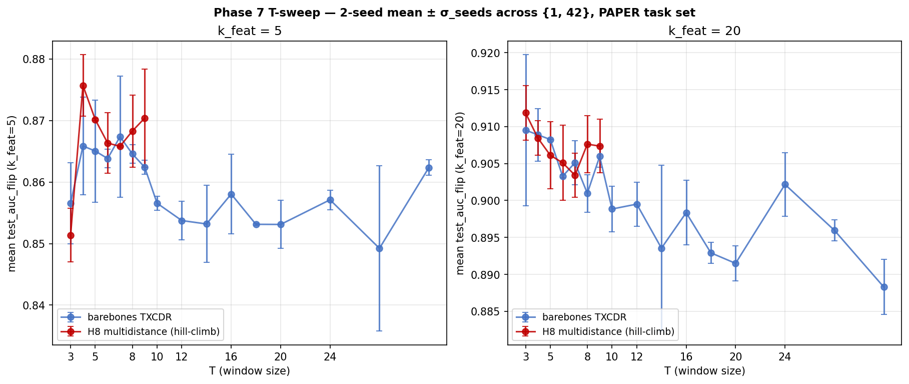

## Phase 7 T-sweep — barebones TXCDR + hill-climbed H8 multidistance, 2-seed σ

> Phase 7 paper artefact (ii). Both T-sweep families at every-T cell with
> two seeds (1, 42); FLIP-corrected; S=32 mean-pool aggregation.

### Plot

### Data

- 36 SAEBench tasks (Phase 7 standard set, FLIP on winogrande / wsc).
- S = 32 left-aligned cache, mean-pool aggregation.
- Seed=1 + seed=42; per-cell `n_seeds=2` for every entry below at T ≤ 32.
- Per-cell metric: cross-seed mean of per-task means.
- σ_seeds: std across the two per-seed means.

Code: `experiments/phase7_unification/build_tsweep_2seed.py`.

### Barebones TXCDR (`txcdr_t<T>`)

| T | mean k=5 | σ_seeds k=5 | mean k=20 | σ_seeds k=20 |
|---|---|---|---|---|
| 3  | 0.8805 | 0.0022 | 0.9322 | 0.0040 |
| 4  | 0.8848 | 0.0016 | 0.9322 | 0.0020 |
| 5  | 0.8910 | 0.0055 | 0.9308 | 0.0008 |
| 6  | 0.8878 | 0.0024 | 0.9274 | 0.0012 |
| 7  | 0.8952 | 0.0098 | 0.9314 | 0.0015 |
| 8  | 0.8942 | 0.0011 | 0.9273 | 0.0004 |
| 9  | 0.8926 | 0.0021 | 0.9285 | 0.0014 |
| 10 | 0.8895 | 0.0052 | 0.9235 | 0.0006 |
| 12 | 0.8889 | 0.0004 | 0.9239 | 0.0004 |
| 14 | 0.8887 | 0.0009 | 0.9229 | 0.0068 |
| 16 | 0.8935 | 0.0022 | 0.9246 | 0.0020 |
| 18 | 0.8821 | 0.0035 | 0.9211 | 0.0016 |
| 20 | 0.8879 | 0.0054 | 0.9203 | 0.0028 |
| 24 | 0.8823 | 0.0026 | 0.9232 | 0.0046 |
| 28 | 0.8798 | 0.0041 | 0.9196 | 0.0005 |
| 32 | 0.8778 | 0.0010 | 0.9090 | 0.0023 |

### Hill-climbed H8 multidistance (`phase57_partB_h8_bare_multidistance_t<T>`)

| T | mean k=5 | σ_seeds k=5 | mean k=20 | σ_seeds k=20 |
|---|---|---|---|---|
| 3 | 0.8800 | 0.0006 | 0.9337 | 0.0010 |
| 4 | 0.8957 | 0.0004 | 0.9330 | 0.0012 |
| 5 | 0.8926 | 0.0014 | 0.9296 | 0.0004 |
| 6 | 0.8911 | 0.0047 | 0.9305 | 0.0015 |
| 7 | 0.8910 | 0.0003 | 0.9278 | 0.0020 |
| 8 | 0.8944 | 0.0063 | 0.9302 | 0.0022 |
| 9 | 0.8936 | 0.0037 | 0.9300 | 0.0039 |

T ∈ {10, 12, 14, 16, 18, 20, 24, 28, 32} for the hill-climbed family
were not trained — H200_required for the high-T cells (and the round1
hill-climb only completed T_max=12 at t_sample=5 before the H200 pod
died — see `2026-04-29-window-resampling-history.md` for the full
audit of the hill-climb attempts).

### Shape and headline takeaways

- Both families are **non-monotonic in T**: peak around T=4-7, gradual
  decline to T=32.
- At k_feat=5 the hill-climbed H8 family is **consistently slightly
  above** barebones TXCDR at the same T (e.g., t4: 0.8957 vs 0.8848;
  t5: 0.8926 vs 0.8910; t8: 0.8944 vs 0.8942).
- At k_feat=20 the two families **overlap closely** (within σ_seeds);
  hill-climbed is no longer clearly above barebones once the LR has
  20-feature budget.
- σ_seeds is small everywhere (0.0003-0.0098), so the within-family T
  trend is robust to seed.
- Both families' k=5 winner is at T=4-7 — supporting the view that
  small-T temporal aggregation helps probing AUC at very-sparse
  budgets, while T ≥ 16 is in the "sparsity-collapse" regime.

### Files of record

- Builder: `experiments/phase7_unification/build_tsweep_2seed.py`
- Plot: `plots/phase7_tsweep_2seed.png`
  (canonical: `experiments/phase7_unification/results/plots/phase7_tsweep_2seed.png`)
- Probing rows: `experiments/phase7_unification/results/probing_results.jsonl`
