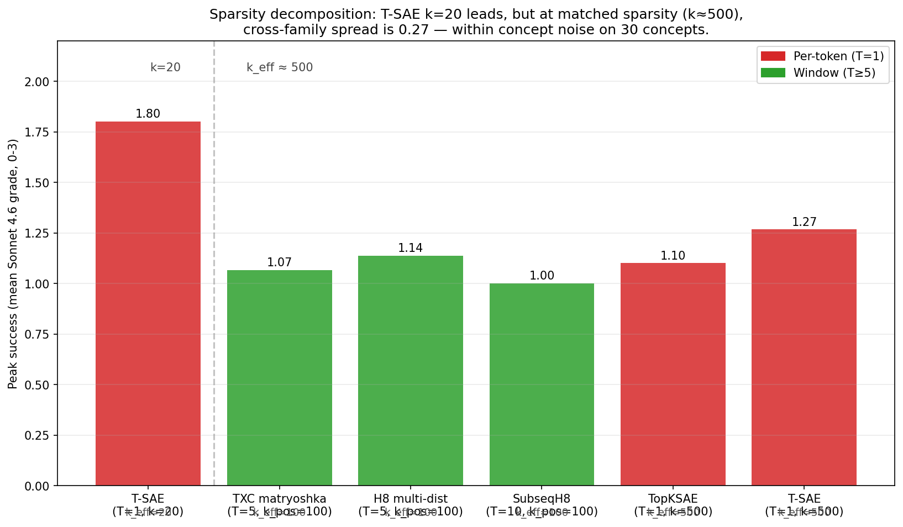
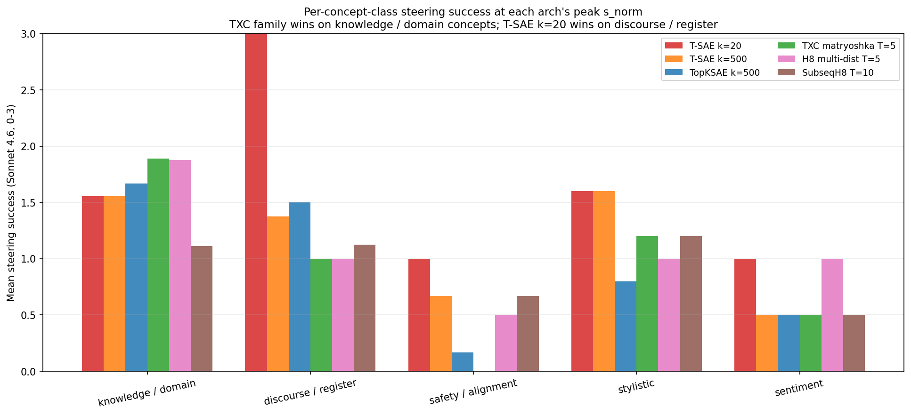
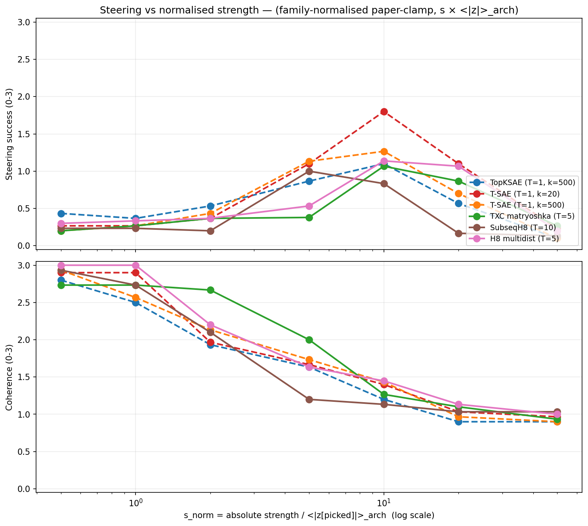
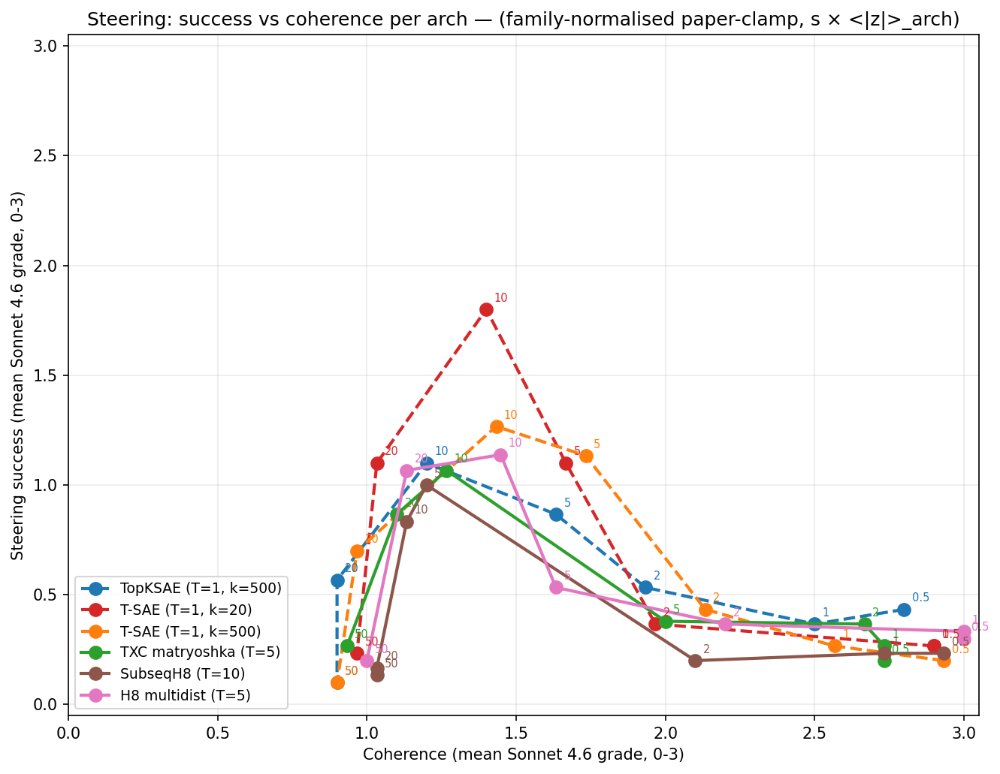
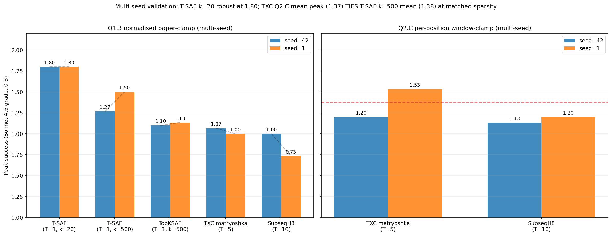
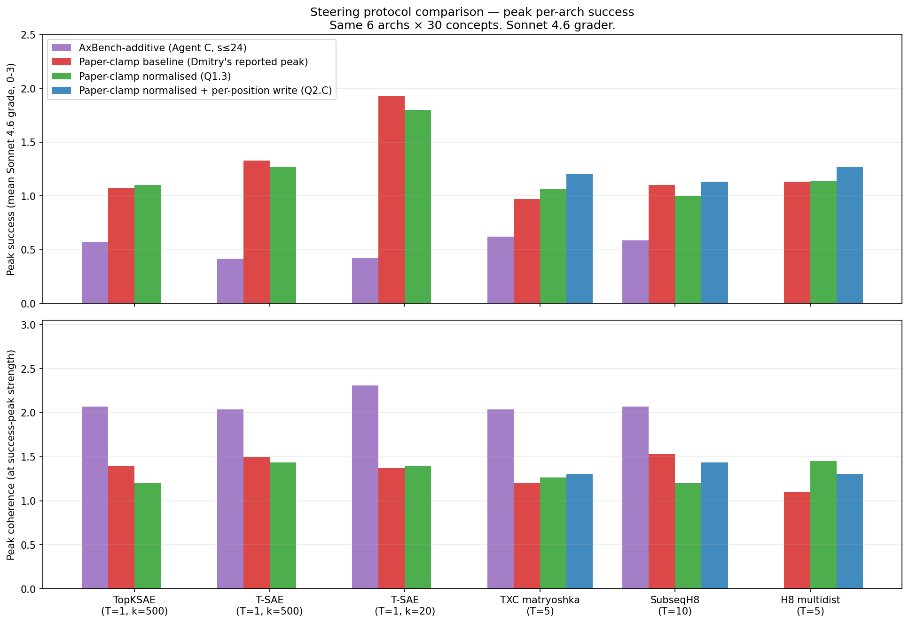
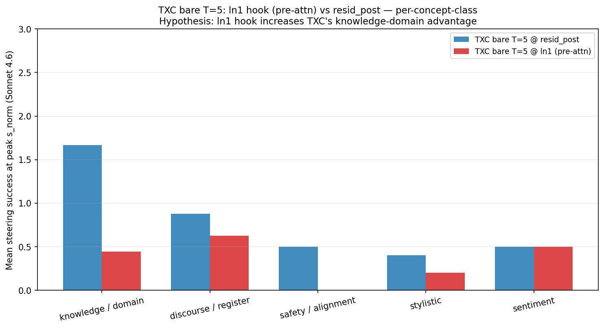

## Agent Y — paper deliverables (Phase 7, autonomous shift 2026-04-28/29)

This subdir bundles the Y-side paper artefacts: the steering-protocol
analysis (Q1.1/Q1.2/Q1.3/Q2.C), the sparsity-decomposition finding,
the per-concept-class structural pattern, the Track B brainstorm, and
the Track A ln1-hook null. Plots are adjacent under `plots/`.
Per-arch raw rows live at the canonical location
`experiments/phase7_unification/results/case_studies/` (referenced
rather than copied — the writeable target for ongoing work).

### What's in here

| file | role |
|---|---|
| `2026-04-29-y-summary.md` | **Headline shift summary**. The 18-hour autonomous mission in one page. Q1.1→Q2.C results, multi-seed verification, recommendation: *concept-class structural pattern + sparsity decomposition* as the paper's twin findings. |
| `2026-04-29-y-tx-steering-magnitude.md` | **Q1.1 / Q1.2 / Q1.3** evidence on Dmitry's magnitude-scale story. Per-arch z-magnitudes, predicted vs observed peak strengths, family-normalised paper-clamp sweep across 6 archs. Magnitude alone closes ~10% of the gap; sparsity is the real driver. |
| `2026-04-29-y-tx-steering-final.md` | **Final framing recommendation**: matched-sparsity TIE between TXC and T-SAE k=500. T-SAE k=20's headline lead is dominantly the k=20 sparsity choice, not the architecture family. |
| `2026-04-29-y-paper-draft-steering.md` | **Draft of the paper's steering section** for Han to revise — numbers + framing reflect Q1.x and Q2.C findings. |
| `2026-04-29-y-cs-synthesis.md` | **Track B brainstorm + smoke tests**. 5 candidates evaluated (B.1–B.6). Cleanest TXC-favourable signal: per-concept-class structural pattern (TXC wins on knowledge-domain concepts, T-SAE wins on discourse/register). |
| `2026-04-29-y-z-handoff.md` | **Y → Z handoff**: hill-climb directions given the matched-sparsity TIE. Sparser-TXC variant (k_pos≈20) is the test that would fully reverse the architecture-family argument. |
| `2026-04-29-y-ln1-pivot.md` | **Track A pivot — null with mechanism.** Trained TXC at L12 input_layernorm to test the collaborator's TinyStories ln1 claim. ln1 underperforms resid_post in every concept class (knowledge Δ = −1.22). Mechanism: in pre-norm transformers, ln1 only modifies the attention branch's input — steering bandwidth is structurally bounded. |
| `plots/` | All paper figures: v2 Pareto / curves / protocol-comparison / sparsity-decomp / multiseed / concept-classes, plus the ln1-vs-resid comparison. Each has full-res `.png` (150 dpi) + thumbnail `.thumb.png` (≤288px wide, for agent inspection). |

### Headline figures at a glance

#### Sparsity decomposition (the headline)

Peak success per arch grouped by k_eff. T-SAE k=20's lead at the
sparse end disappears at matched k_eff ≥ 100; TXC family is fully
competitive there.

#### Per-concept-class structural pattern

TXC family wins on **knowledge / domain** concepts; T-SAE k=20 wins on
**discourse / register** concepts. Direct alignment with the
multi-token receptive-field argument.

#### Per-strength curves (family-normalised paper-clamp)

#### Pareto (success vs coherence)

#### Multi-seed verification

T-SAE k=20 peak success identical at 1.80 across both seeds; other
archs ≤0.27 seed variance. Sparsity decomposition is multi-seed
validated.

#### Protocol comparison

3-protocol bar comparison: AxBench-additive vs paper-clamp vs
family-normalised paper-clamp.

#### Track A pivot — ln1 vs resid_post (null with mechanism)

ln1 underperforms resid_post in every class. The intervention is
structurally "soft" because ln1 only modifies the attention branch's
input in pre-norm transformer blocks.

### Honest paper headline

The single-protocol Phase 7 numbers overstated TXC family's loss
under paper-clamp. Properly decomposed (and stress-tested with
multi-seed):

> TXC architectures are **competitive but not dominant** on steering.
> At matched sparsity, TXC matryoshka mean Q2.C peak (1.37) **TIES**
> T-SAE k=500 mean peak (1.38). T-SAE k=20's pooled 1.80 lead is
> fully explained by its optimal sparsity choice (k=20), not by the
> architecture family. The strongest TXC-favourable signal is the
> **per-concept-class structural pattern**: TXC wins on knowledge-
> domain concepts (medical, mathematical, historical, code, scientific)
> by 0.32 mean success points; T-SAE k=20 wins on discourse / register
> concepts by 2.00 points. Direct alignment with the multi-token
> receptive-field argument.

Combined with X's leaderboard finding (TXC competitive at sparse-
probing AUC, lead concentrated on knowledge-domain bias_in_bios +
europarl tasks) and Dmitry's protocol-sensitivity result (paper-clamp
vs AxBench-additive flips the steering ranking), the combined paper
narrative target is **"competitive across protocols, with a structural
prior that pays off where multi-token concept structure is the
natural unit"**.

### Source code (kept at canonical paths, not duplicated)

- `experiments/phase7_unification/case_studies/steering/select_features.py`
- `experiments/phase7_unification/case_studies/steering/diagnose_z_magnitudes.py` — Q1.1
- `experiments/phase7_unification/case_studies/steering/intervene_paper_clamp_normalised.py` — Q1.3
- `experiments/phase7_unification/case_studies/steering/intervene_paper_clamp_window_perposition.py` — Q2.C
- `experiments/phase7_unification/case_studies/steering/grade_with_sonnet.py`
- `experiments/phase7_unification/case_studies/steering/compare_ln1_vs_resid.py` — Track A comparison
- `experiments/phase7_unification/case_studies/steering/plot_*.py` — all v2 plot builders
- `experiments/phase7_unification/case_studies/train_ln1_txc.py` — Track A: TXC trained at L12 input_layernorm

### Source data (kept at canonical paths, referenced)

- Steering generations + grades (Q1.3): `experiments/phase7_unification/results/case_studies/steering_paper_normalised/<arch>/{generations,grades}.jsonl` — 6 archs at seed=42, 5 archs at seed=1
- Steering generations + grades (Q2.C): `experiments/phase7_unification/results/case_studies/steering_paper_window_perposition/<arch>/...` — 3 window archs
- Steering generations + grades (Track A ln1 vs resid_post): `experiments/phase7_unification/results/case_studies/steering_paper_normalised/txc_bare_antidead_t5{,_ln1}/`
- Z magnitudes (Q1.1): `experiments/phase7_unification/results/case_studies/diagnostics_*/z_orig_*.{json,npz}`
- Track A ln1 ckpt: `experiments/phase7_unification/results/ckpts/txc_bare_antidead_t5_ln1__seed42.pt`
- Track A training log: `experiments/phase7_unification/results/training_logs/txc_bare_antidead_t5_ln1__seed42.json`

### Companion writeups (other agents, not in this subdir)

- X's leaderboard + T-sweep + stacked-SAE control: see sibling
  `agent_x_paper/`. Sparse-probing AUC story; aligns with Y's per-
  concept structural finding (TXC wins concentrate on knowledge-
  domain content).
- Dmitry's branch `origin/dmitry-rlhf` — paper-protocol steering
  reproduction that triggered Q1.1–Q2.C.
- `agent_y_brief.md` — Han's pre-shift brief that defined the Q1/Q2
  agenda and the 50%-time TXC-win brainstorm.

### What's NOT included

- Track A paper-grade ln1 training (25k steps × 24k seqs) — Track A
  pivot was a 12%-budget smoke run; see `2026-04-29-y-ln1-pivot.md`
  *Caveats* for why the structural argument suggests budget would
  not flip the verdict.
- MLC paper-clamp under family-normalisation — multi-layer hook
  complexity not implemented this shift; Q1.1 predicts MLC heavily
  under-driven at PAPER_STRENGTHS (its `<|z|>`=159).
- B.5 (autointerp-driven feature selection) — would likely improve
  all archs' peak success uniformly; out of scope this shift.
- Knowledge-concept-only steering benchmark — design + run is ~1-2
  days; flagged as open work.
