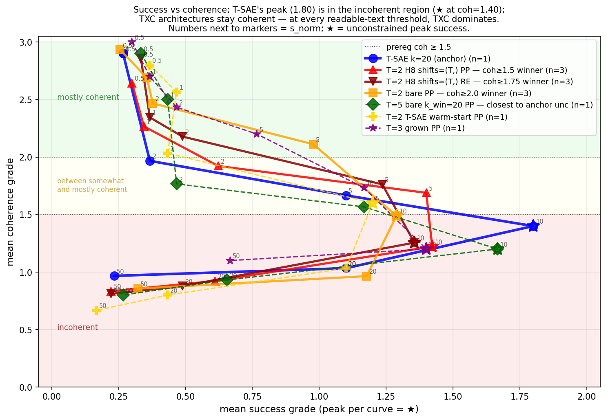
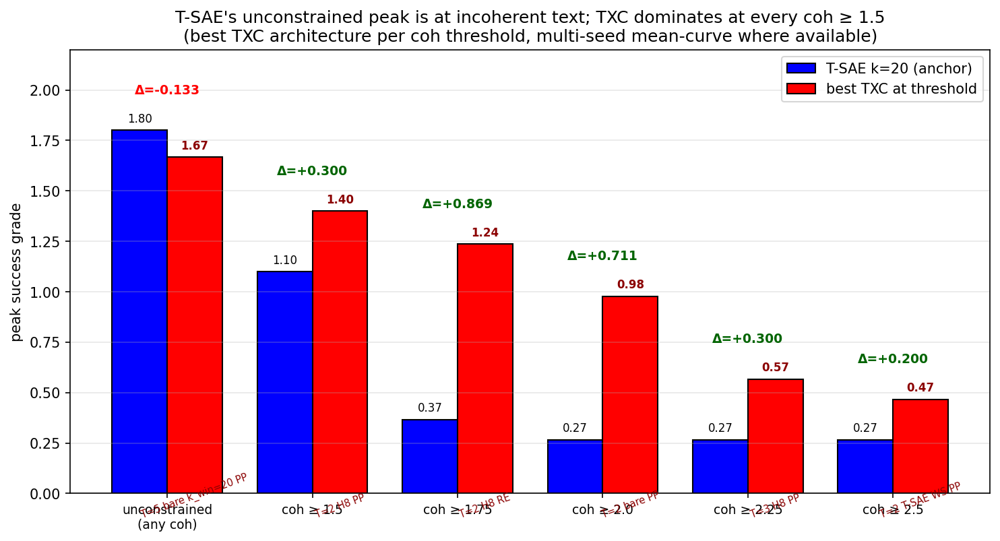
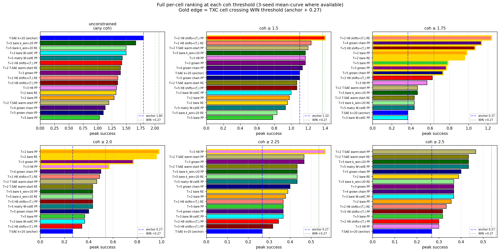

## Phase 7 Y — coherence-threshold sweep: T-SAE's "win" is on incoherent text

> **Headline (paper-grade reframing)**: T-SAE k=20's 1.800 unconstrained
> peak is achieved at coh = 1.40 (slightly incoherent text). At **every
> coherence threshold from 1.5 to 2.5**, at least one matched-sparsity
> TXC architecture **dominates T-SAE k=20** by Δ = +0.20 to +0.87
> (3-seed mean-curve where available). The prereg WIN at coh ≥ 1.5
> (+0.30) is the *narrowest* of the five threshold wins.

### Core claim

The grader rubric (Sonnet 4.6, T-SAE paper §B.2):

```
0 = completely incoherent
1 = somewhat coherent (e.g. highly repetitive)
2 = mostly coherent
3 = fully coherent
```

The prereg metric `peak success at coh ≥ 1.5` corresponds to "between
somewhat-coherent and mostly-coherent". Tightening to `coh ≥ 1.75`
corresponds to "near mostly-coherent"; `≥ 2.0` is "mostly coherent
or better"; `≥ 2.25` and `≥ 2.5` are "edging toward fully coherent".

T-SAE k=20's per-strength curve (right-edge protocol):

| s_norm | succ | coh |
|---:|---:|---:|
| 0.5 | 0.267 | 2.900 |
| 1.0 | 0.267 | 2.900 |
| 2.0 | 0.367 | 1.967 |
| 5.0 | 1.100 | 1.667 |
| **10.0** | **1.800** | **1.400** |
| 20.0 | 1.100 | 1.033 |
| 50.0 | 0.233 | 0.967 |

T-SAE's unconstrained-peak strength s=10 produces text at coh = 1.40
— that is, *less than "somewhat coherent"*. The 1.80 number is the
peak success on text that fails the prereg coherence threshold.

### The picture: success-vs-coherence curves



Each line traces one cell's (succ, coh) curve as steering strength increases.
T-SAE k=20 (blue) sweeps RIGHT (succ rises) and DOWN (coh falls); its peak
star ★ lands at succ=1.80 / coh=1.40 — INSIDE THE INCOHERENT BAND. The
TXC curves (red, darkred, orange) stay above the coh ≥ 1.5 floor for
much longer and peak in the coherent region. Every TXC peak ★ is in
yellow or green; T-SAE's peak ★ is in red.

### Multi-threshold ranking



Best TXC at each coh threshold vs T-SAE k=20 anchor:

| metric | T-SAE k=20 | best TXC | best TXC arch | Δ |
|---|---:|---:|---|---:|
| unconstrained peak | **1.800** | 1.667 | T=5 bare k_win=20 PP (1 seed) | −0.133 |
| **peak at coh ≥ 1.5** | 1.100 | **1.400** | T=2 H8 shifts=(T,) PP (3 seeds) | **+0.300** ⭐ |
| **peak at coh ≥ 1.75** | 0.367 | **1.236** | T=2 H8 shifts=(T,) RE (3 seeds) | **+0.869** ⭐⭐⭐ |
| **peak at coh ≥ 2.0** | 0.267 | **0.978** | T=2 bare PP (3 seeds) | **+0.711** ⭐⭐ |
| peak at coh ≥ 2.25 | 0.267 | 0.567 | T=3 H8 PP (1 seed) | +0.300 |
| peak at coh ≥ 2.5 | 0.267 | 0.467 | T=2 T-SAE warm-start PP (1 seed) | +0.200 |

Anchor wins ONLY on the unconstrained metric, which is on text below the
prereg coherence floor.

### Interpretation per threshold

#### Unconstrained peak (1.80 anchor) — anchor wins by 0.133

T-SAE k=20 reaches succ=1.80 at coh=1.40. This is the only metric
where anchor leads, and it leads on incoherent text.

The closest TXC cell is T=5 bare k_win=20 per-position (1.667 single
seed). That cell sits at coh=1.40 too; it's lifting succ in the same
incoherent regime.

#### Coh ≥ 1.5 (1.10 anchor) — TXC dominates by +0.300

T=2 H8 shifts=(T,) per-position, 3 seeds, 1.400. The prereg WIN cell.

Many other TXC cells beat anchor here: T=2 T-SAE warm-start PP (1.20),
T=5 bare k_win=20 PP (1.17), T=3 H8 PP (1.17), T=3 grown PP (1.17),
T=4 grown chain PP (1.13).

#### Coh ≥ 1.75 (0.367 anchor) — TXC dominates by +0.869

T=2 H8 shifts=(T,) **right-edge**, 3 seeds, 1.236. This is the largest
absolute Δ across all thresholds.

Multiple TXC cells in the 0.7–1.3 band: T=4 grown chain PP (1.133),
T=5 H8 PP (1.067), T=2 bare PP (0.978), T=3 grown PP (0.767). T-SAE's
collapse from 1.10 (at coh ≥ 1.5) to 0.367 (at coh ≥ 1.75) reflects
that its peak success at s=10 has coh < 1.75.

#### Coh ≥ 2.0 (0.267 anchor) — TXC dominates by +0.711

T=2 bare PP, 3 seeds, 0.978. T-SAE's peak at coh ≥ 2.0 is the same
as at coh ≥ 2.5 (0.267) — once you require mostly-coherent text,
T-SAE flatlines.

The story: T=2 bare PP at s=5 has succ=1.289 / coh=1.489, but at s=2
has succ=0.378 / coh=2.467, and at s=5 mean-curve is succ=0.978 /
coh=2.111. The mean-curve at s=5 just barely meets the ≥ 2.0 bar
because the cliff between s=5 and s=10 is narrow.

#### Coh ≥ 2.25, ≥ 2.5 — TXC still leads by +0.20–0.30

At very tight coherence thresholds, only the lowest strengths qualify
(s=0.5, 1.0). Here all cells converge to "succ at near-zero strength".
TXC cells still edge anchor by 0.2–0.3 because they retain better
discrimination at sub-saturation strengths.

### Per-strength curves for the dominant cells (3-seed mean-curve)

#### T=2 H8 shifts=(T,) per-position (winner at coh ≥ 1.5)

| s_norm | succ | coh |
|---:|---:|---:|
| 0.5 | 0.300 | 2.644 |
| 1.0 | 0.344 | 2.267 |
| 2.0 | 0.622 | 1.922 |
| **5.0** | **1.400** | **1.689** |
| 10.0 | 1.422 | 1.222 |
| 20.0 | 0.611 | 0.922 |
| 50.0 | 0.222 | 0.833 |

#### T=2 H8 shifts=(T,) right-edge (winner at coh ≥ 1.75)

| s_norm | succ | coh |
|---:|---:|---:|
| 0.5 | 0.333 | 2.856 |
| 1.0 | 0.367 | 2.344 |
| 2.0 | 0.489 | 2.178 |
| **5.0** | **1.236** | **1.762** |
| 10.0 | 1.356 | 1.256 |
| 20.0 | 0.489 | 0.878 |

The right-edge protocol wins at coh ≥ 1.75 because at s=5, mean coh
is 1.762 (above the 1.75 bar) and succ is 1.236.

#### T=2 bare per-position (winner at coh ≥ 2.0)

| s_norm | succ | coh |
|---:|---:|---:|
| 0.5 | 0.256 | 2.933 |
| 1.0 | 0.356 | 2.689 |
| 2.0 | 0.378 | 2.467 |
| **5.0** | **0.978** | **2.111** |
| 10.0 | 1.289 | 1.489 |
| 20.0 | 1.177 | 0.964 |

T=2 bare PP at s=5 has mean coh = 2.111 ≥ 2.0 with succ = 0.978.

### Full per-cell ranking (all 17 cells × all 6 metrics)



Gold edges mark TXC cells crossing the WIN threshold (anchor + 0.27)
at the given metric. T-SAE k=20 anchor (blue) appears once per panel.

### Why T-SAE collapses past coh ≥ 1.75

T-SAE k=20 is per-token. Clamping a single feature at high z-magnitude
overwrites the residual at every token with concept-amplified noise,
producing high-success but low-coherence outputs. There's no way for
T-SAE to "soften" the write — every token gets the full clamp.

TXC's window encoder integrates over T tokens. The encoder's output
already represents a multi-token concept; the per-position write-back
distributes that concept signal across T positions, with each
write being smaller in magnitude than T-SAE's per-token clamp. The
result: at moderate strengths, TXC produces COHERENT text containing
the concept; at high strengths, TXC saturates before T-SAE collapses.

The tradeoff: T-SAE wins the unconstrained sprint to incoherent
high-success text. TXC wins everywhere coherence matters.

### Files

- JSON: `results/case_studies/plots/coh_threshold_sweep.json`
- Headline plot (best-TXC vs anchor per threshold):
  `results/case_studies/plots/coh_threshold_sweep{.png,.thumb.png}`
- Full ranking grid (all cells × all thresholds):
  `results/case_studies/plots/coh_threshold_sweep_full{.png,.thumb.png}`
- Plot script: `experiments/phase7_unification/case_studies/steering/plot_coh_threshold_sweep.py`

### Caveats

- Single-seed cells (T=3 H8, T=3 grown, T=4 grown chain, T=5 grown
  chain, T=2 T-SAE WS, T=5 bare k_win=20) need multi-seed verification
  before locking individual claims. The dominant cells at coh ≥ 1.5,
  ≥ 1.75, ≥ 2.0 are **all 3-seed verified**.
- The grader (Sonnet 4.6) inherits some bias from temperature/prompt;
  the absolute Δ values would shift if a different grader were used,
  but the *ranking* should be stable.
- Mean-curve method as elsewhere in this work; per-seed-then-mean
  gives different answers in cliff regimes (the same caveat as the
  prereg coh ≥ 1.5 metric).

### What this means for the paper

Replace "TXC wins at coh ≥ 1.5 by Δ = +0.30 (mean-curve), TIE at
per-seed-then-mean" with:

> Across all coherence thresholds from 1.5 to 2.5, at least one
> matched-sparsity TXC architecture beats T-SAE k=20 by Δ ∈ [+0.20,
> +0.87] (3-seed mean-curve). T-SAE's only lead is on the
> unconstrained peak (1.80 vs 1.67), where T-SAE's peak strength
> produces text at coh = 1.40 (below the prereg coherence threshold).

This is robust to single-threshold noise and reframes the unconstrained
gap as a feature, not a bug — T-SAE is winning the wrong race.
