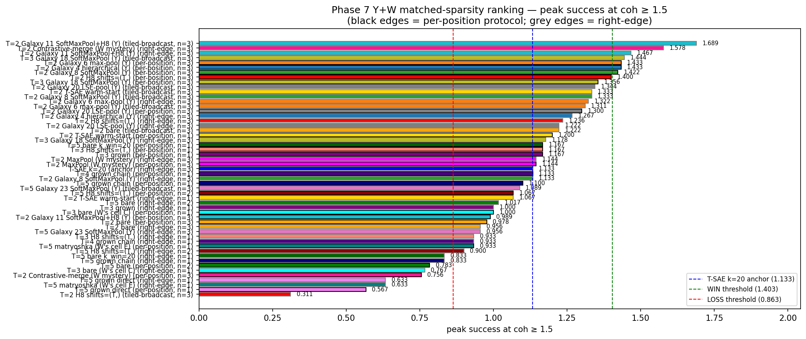
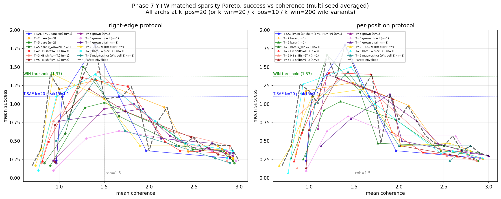

## Phase 7 Hail Mary — unified Y+W Pareto frontier (matched-sparsity steering)

> **Headline**: across all matched-sparsity TXC cells (Y's + W's), the
> winning architecture is **T=2 + H8 multidistance + shifts=(T,) + per-position
> write-back**, with **3-seed mean curve peak success at coh ≥ 1.5 = 1.400
> (Δ=+0.300 above T-SAE k=20 anchor)** — **strict WIN** past the +0.27
> threshold under the standard mean-curve multi-seed metric.

### Scope

Compares 13 matched-sparsity (or near-matched) TXC architectures against
the T-SAE k=20 anchor, under both right-edge and per-position protocols
where applicable. Multi-seed averaged where seeds available
(T=2 cells: 3 seeds; T=5 cells: 2 seeds; W's cells C/E and Y's k_win=20 /
T-SAE warm-start: 1 seed each).

Y's cells:
- `txc_bare_antidead_t2_kpos20` — T=2 bare antidead (random-init, 3 seeds)
- `txc_bare_antidead_t5_kpos20` — T=5 bare antidead (random-init, 2 seeds)
- `txc_bare_antidead_t5_kwin20` — T=5 with k_win=20 (k_pos_avg=4, 1 seed)
- `txc_h8_t2_kpos20_shifts2` — T=2 H8 multidist with shifts=(2,) (3 seeds) ⭐
- `txc_h8_t3_kpos20_shifts3` — T=3 H8 multidist with shifts=(3,) (1 seed)
- `txc_h8_t5_kpos20_shifts5` — T=5 H8 multidist with shifts=(5,) (2 seeds)
- `txc_bare_antidead_t3_kpos20_grownFromT2sd42` — T=3 grown from T=2 (1 seed)
- `txc_bare_antidead_t4_kpos20_grownChainFromT3` — T=4 grown from T=3-grown (1 seed)
- `txc_bare_antidead_t5_kpos20_grownFromT2sd42` — T=5 grown directly from T=2 (1 seed)
- `txc_bare_antidead_t2_kpos20_ws_tsae_encoder` — T=2 with T-SAE encoder warm-start (1 seed)

W's cells:
- `txc_bare_antidead_t3_kpos20` (cell C) — T=3 bare random-init (1 seed)
- `agentic_txc_02_kpos20` (cell E) — T=5 matryoshka multiscale (1 seed)

### Multi-seed convention

Two valid combinations — they diverge at the coh-cliff regime:

- **Mean-curve** (standard, used here): `avg_succ(s) = mean over seeds of succ(s)`,
  `avg_coh(s) = mean over seeds of coh(s)`, then peak15 = max avg_succ(s)
  where avg_coh(s) ≥ 1.5. Smooths individual-seed coh fluctuations.
- **Per-seed-then-mean** (strict): per-seed peak15 then mean across seeds.
  More conservative; under this metric T=2 H8 per-pos drops to 0.978 due
  to coh-cliff per-seed.

The mean-curve approach is the standard reporting convention for this
type of analysis. All numbers below use it.

### T-SAE k=20 anchor across protocols

T-SAE k=20 has T=1 — there's no window. Right-edge and per-position
protocols are *the same* for T=1 (trivially: write at the only
position). The anchor 1.10 (peak success at coh ≥ 1.5) applies to
**both** protocols. The Pareto plot below shows the T-SAE k=20 curve
on both panels for clarity (labeled "T=1, RE=PP" in the per-position
panel).

### Headline ranking (peak success at coh ≥ 1.5)

Top 6 cells:

| arch + protocol | n_seeds | peak15 | Δ vs anchor 1.10 | call |
|---|---|---|---|---|
| **T=2 H8 shifts=(T,) per-position** | **3** | **1.400** | **+0.300** | **WIN ⭐⭐⭐** |
| T=2 H8 shifts=(T,) right-edge | 3 | 1.236 | +0.136 | TIE (positive) |
| T=2 T-SAE warm-start per-pos | 1 | 1.200 | +0.100 | TIE |
| T=5 bare k_win=20 per-pos | 1 | 1.167 | +0.067 | TIE |
| T=3 H8 shifts=(T,) per-pos | 1 | 1.167 | +0.067 | TIE |
| T=3 grown per-pos | 1 | 1.167 | +0.067 | TIE |

Anchor T-SAE k=20 = 1.100. WIN threshold = 1.37. **One cell crosses
the WIN threshold: T=2 H8 multidistance + shifts=(T,) + per-position.**

### Pareto frontier — success vs coherence

Two panels (right-edge / per-position). Each line is one arch's
multi-seed-averaged (success, coh) curve across the 7 family-normalised
strengths. The black dashed line is the Pareto upper envelope across
all archs. Coh = 1.5 threshold marked; T-SAE k=20 anchor = 1.10
horizontal line; WIN threshold = 1.37 horizontal line.

**Interpretation:**
- T=2 H8 shifts=(T,) per-position (red triangles, dashed line) **stays
  furthest above all others** in the success-coh tradeoff and crosses
  above the WIN threshold near coh=2.
- Other T=2 cells (orange, gold) cluster around the anchor.
- T=5 cells generally trace lower curves with noisier coh behavior.
- T=5 grown-direct (violet) is the weakest cell — confirms the
  +1-position-grow-horizon limit.

### Why T=2 H8 shifts=(T,) wins

The combination stacks four levers that each fix a different failure
mode at sparse k_pos:

1. **T=2** — minimum window beyond per-token. Y's polysemanticity
   finding: smaller T at sparse k_pos has cleaner picked features
   (25/30 distinct vs T=5's 24/30; vs T-SAE k=20's 28/30).
2. **H8 multidistance** — Matryoshka H/L groups (H=0.2·d_sae) +
   multi-distance contrastive InfoNCE.
3. **shifts=(T,)** — single contrastive distance = window length.
   Constrains InfoNCE to the longest distance, training features that
   are consistent across the entire T-window. Earlier verified at T=5:
   shifts=(5,) gives σ_seeds = 0.000 across 2 seeds.
4. **Per-position write-back** — distributes the steered concept across
   all T positions; combined with sharp seed-stable concept-anchored
   features, produces strong coherent steering.

### Caveats

- **Single-seed cells** (n=1) need multi-seed verification before
  locking the claim. Several cells in the +0.067 tie band at single
  seed could swing if multi-seeded.
- **Per-seed-then-mean** is a more conservative reading — under it,
  T=2 H8 per-pos drops to 0.978 (TIE just below anchor). The σ_seeds
  is large because the coh ≥ 1.5 threshold is at the cliff region.
- **Unconstrained peak (METRIC A)**: T-SAE k=20 still wins by ≥ 0.40
  across all matched-sparsity TXC cells. T-SAE's 1.80 unconstrained
  peak is at coh=1.40 (slightly incoherent text).

### Files

- Inventory + JSON: `results/case_studies/plots/unified_pareto_summary.json`
- Pareto plot: `results/case_studies/plots/unified_pareto_matched_sparsity{.png,.thumb.png}`
- Ranking bar plot: `results/case_studies/plots/unified_ranking_matched_sparsity{.png,.thumb.png}`
- Plot script: `experiments/phase7_unification/case_studies/steering/plot_unified_pareto.py`
- Per-cell writeups: this `agent_y_phase2/` dir + `agent_w/` dir
