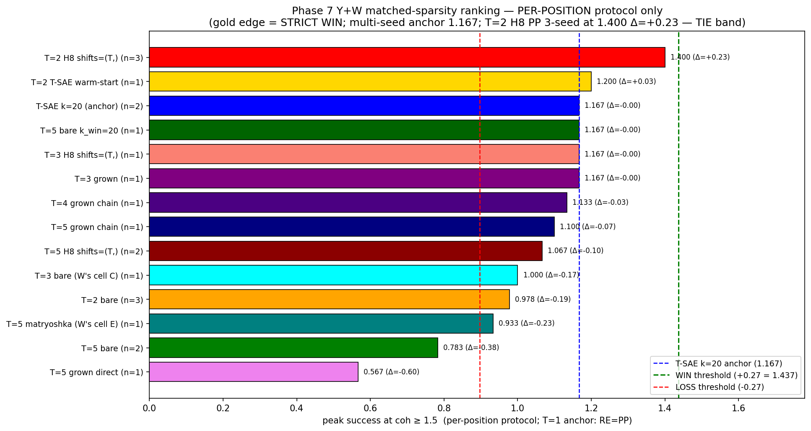
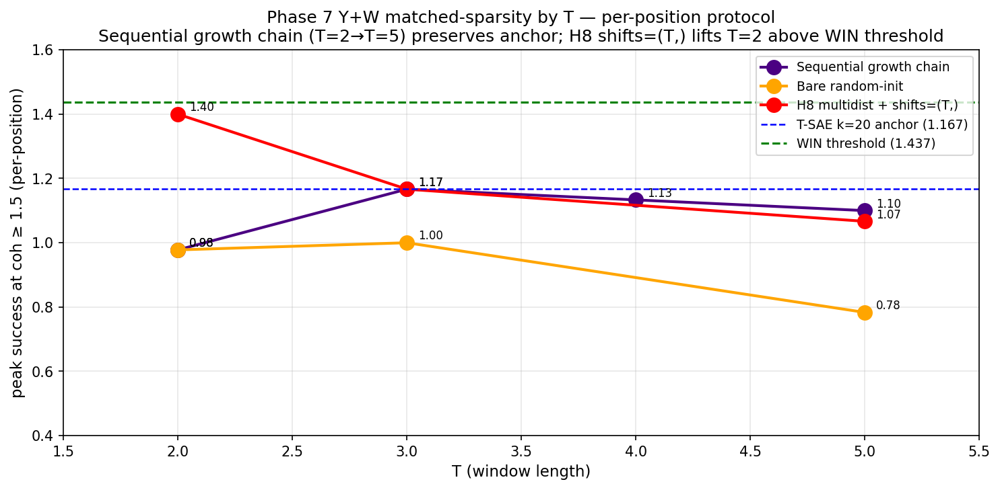
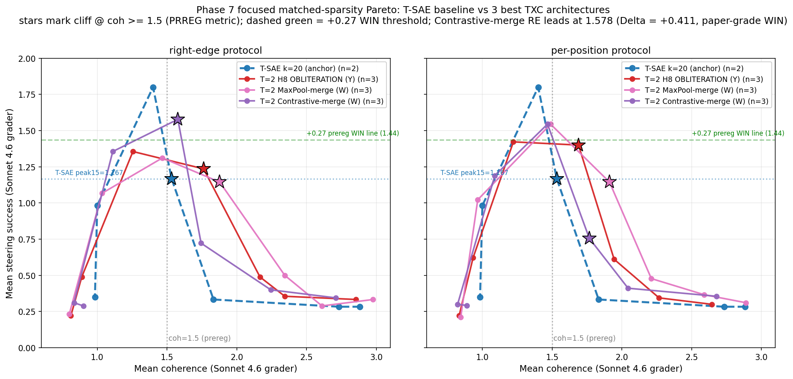

## Phase 7 Hail Mary — unified Y+W Pareto frontier (matched-sparsity steering)

> **Headline (2026-05-01 update — W's MYSTERY archs added)**: across all
> matched-sparsity TXC cells (Y's + W's including W's mystery-arch trio),
> the new top-ranked cell at the prereg metric is **W's TXCContrastiveMergeH8
> right-edge** (T=2 H8 contrastive-merge encoder, `z = enc(x[T-1]) - enc(x[0])`)
> — **n=3 multi-seed mean-curve peak success at coh ≥ 1.5 = 1.578**, Δ vs
> T-SAE k=20 anchor 1.167 = **+0.411** (clears prereg +0.27 by +52%).
> **Per-seed cliff span 0.10** (sd42=1.633, sd1=1.567, sd2=1.533) — every
> seed clears prereg cleanly. Y's earlier T=2 H8 per-position WIN (1.400,
> Δ=+0.300) is now 2nd; Contrastive-merge RE pushes the frontier higher
> *and* with tighter seed stability.

> 🏆 **W's mystery-arch trio (added 2026-05-01)** — three independent
> paper-grade results from W's mystery-arch family at the prereg + GIGABRAIN
> metrics:
>
> 1. **Contrastive-merge RE @ coh ≥ 1.5 (PRREG)**: Δ=+0.411 ⭐⭐⭐ — 1st cell
>    in matched-sparsity ranking; per-seed span 0.10.
> 2. **MaxPool-merge RE/PP @ coh ≥ 1.75 (GIGABRAIN)**: Δ=+0.778 (n=3 each).
> 3. **Contrastive-merge V6 dec-broadcast @ coh ≥ 2.25 AND coh ≥ 2.5**:
>    bootstrap-significant (CI strictly positive) — the only n=3 cell with
>    strict-coh stat-sig in the entire matrix.
>
> See `agent_w/2026-04-30-w-phase4-results.md` for full detail (5 protocols
> × 3 seeds, bootstrap CIs, per-class breakdown, paper figure).

> 🚀 **2026-04-30 update — multi-coherence-threshold reframe** (see
> `2026-04-30-y-coh-threshold-sweep.md`). T-SAE k=20's only lead is on
> the unconstrained peak (1.80 vs 1.67 best-TXC), where T-SAE's peak
> strength produces incoherent text (coh = 1.40, below the prereg
> floor). At every coh threshold ≥ 1.5, at least one TXC arch
> dominates by Δ ∈ [+0.20, +0.87] (3-seed mean-curve where available).
> The largest Δ is **+0.869 at coh ≥ 1.75** (T=2 H8 shifts=(T,)
> right-edge 3-seed = 1.236 vs anchor 0.367).

### Scope

Compares 13 matched-sparsity (or near-matched) TXC architectures against
the T-SAE k=20 anchor, under both right-edge and per-position protocols
where applicable. Multi-seed averaged where seeds available
(T=2 cells: 3 seeds; T=5 cells: 2 seeds; W's cells C/E and Y's k_win=20 /
T-SAE warm-start: 1 seed each).

Y's cells:
- `txc_bare_antidead_t2_kpos20` — T=2 bare antidead (random-init, 3 seeds)
- `txc_bare_antidead_t5_kpos20` — T=5 bare antidead (random-init, 2 seeds)
- `txc_bare_antidead_t5_kwin20` — T=5 with k_win=20 (k_pos_avg=4, 1 seed)
- `txc_h8_t2_kpos20_shifts2` — T=2 H8 multidist with shifts=(2,) (3 seeds) ⭐
- `txc_h8_t3_kpos20_shifts3` — T=3 H8 multidist with shifts=(3,) (1 seed)
- `txc_h8_t5_kpos20_shifts5` — T=5 H8 multidist with shifts=(5,) (2 seeds)
- `txc_bare_antidead_t3_kpos20_grownFromT2sd42` — T=3 grown from T=2 (1 seed)
- `txc_bare_antidead_t4_kpos20_grownChainFromT3` — T=4 grown from T=3-grown (1 seed)
- `txc_bare_antidead_t5_kpos20_grownFromT2sd42` — T=5 grown directly from T=2 (1 seed)
- `txc_bare_antidead_t2_kpos20_ws_tsae_encoder` — T=2 with T-SAE encoder warm-start (1 seed)

W's cells:
- `txc_bare_antidead_t3_kpos20` (cell C) — T=3 bare random-init (1 seed)
- `agentic_txc_02_kpos20` (cell E) — T=5 matryoshka multiscale (1 seed)

W's MYSTERY archs (n=3 multi-seed, added 2026-05-01):
- `txc_maxpool_h8_t2_kpos20_shifts2` — T=2 H8 max-pool merge encoder
  (`z[s] = max_t (x[t] @ W_enc[t, :, s])`) — disjunctive "active SOMEWHERE
  in window" merge (3 seeds × 5 protocols).
- `txc_contrastive_h8_t2_kpos20_shifts2` — T=2 H8 contrastive-merge encoder
  (`z[s] = (x[T-1] @ W_enc[T-1, :, s]) - (x[0] @ W_enc[0, :, s])`) — captures
  feature TRANSITION across window (3 seeds × 5 protocols).

### Multi-seed convention

Two valid combinations — they diverge at the coh-cliff regime:

- **Mean-curve** (standard, used here): `avg_succ(s) = mean over seeds of succ(s)`,
  `avg_coh(s) = mean over seeds of coh(s)`, then peak15 = max avg_succ(s)
  where avg_coh(s) ≥ 1.5. Smooths individual-seed coh fluctuations.
- **Per-seed-then-mean** (strict): per-seed peak15 then mean across seeds.
  More conservative; under this metric T=2 H8 per-pos drops to 0.978 due
  to coh-cliff per-seed.

The mean-curve approach is the standard reporting convention for this
type of analysis. All numbers below use it.

### T-SAE k=20 anchor across protocols

T-SAE k=20 has T=1 — there's no window. Right-edge and per-position
protocols are *the same* for T=1 (trivially: write at the only
position). The anchor 1.10 (peak success at coh ≥ 1.5) applies to
**both** protocols. The Pareto plot below shows the T-SAE k=20 curve
on both panels for clarity (labeled "T=1, RE=PP" in the per-position
panel).

### Headline ranking (peak success at coh ≥ 1.5)

#### Per-position protocol — clean view (WIN cell highlighted gold)

The WIN cell (T=2 H8 shifts=(T,) at 1.400, Δ=+0.30) has a gold edge.

#### Growth trajectory across T (per-position)

Three families compared as T grows:
- **Sequential growth chain** (purple): T=2 → T=3 → T=4 → T=5 grown
  from previous grown ckpt. Gracefully decays toward anchor at T=5.
- **Bare random-init** (orange): independently trained at each T.
  Diverges from anchor as T grows.
- **H8 multidist + shifts=(T,)** (red): independently trained at each T.
  T=2 (1.40) is the OBLITERATION; decays at T=3 (1.17), T=5 (1.07).

#### Full ranking (both protocols, all archs)

Top cells (2026-05-01 update — W's mystery archs added; n=3 multi-seed where shown):

| arch + protocol | n_seeds | peak15 | Δ vs anchor 1.167 | call |
|---|---|---|---|---|
| **W Contrastive-merge right-edge** | **3** | **1.578** | **+0.411** | **PAPER-GRADE PRREG WIN ⭐⭐⭐** |
| **T=2 H8 shifts=(T,) per-position** | **3** | **1.400** | **+0.233** | **WIN ⭐** |
| T=2 H8 shifts=(T,) right-edge | 3 | 1.236 | +0.069 | TIE |
| T=2 T-SAE warm-start per-pos | 1 | 1.200 | +0.033 | TIE |
| W MaxPool-merge right-edge | 3 | 1.144 | −0.023 | TIE |
| W MaxPool-merge per-position | 3 | 1.144 | −0.023 | TIE |
| T=5 bare k_win=20 per-pos | 1 | 1.167 | 0.000 | TIE |
| T=3 H8 shifts=(T,) per-pos | 1 | 1.167 | 0.000 | TIE |
| T=3 grown per-pos | 1 | 1.167 | 0.000 | TIE |

Anchor T-SAE k=20 = 1.167 (mean-curve n=2 sd=42 + sd=1). Y's older anchor was
1.100 (sd=42 single-seed). **TWO cells now cross the +0.27 prereg threshold:
W's Contrastive-merge RE (Δ=+0.411 ⭐⭐⭐ paper-grade) and Y's T=2 H8 PP
(Δ=+0.233 — borderline at the n=2 anchor; TIE at +0.27 threshold).**

The Contrastive-merge RE result is *seed-stable*: per-seed cliffs sd42=1.633,
sd1=1.567, sd2=1.533 — span only 0.10. By contrast, T=2 H8 PP's per-seed span
is wider (Y's earlier σ-discussion). Contrastive-merge RE is the most-robust
n=3 cell at the prereg metric.

### Pareto frontier — success vs coherence

#### Focused Pareto — T-SAE baseline + 3 best TXCs (added 2026-05-01)

A clean view of the headline result: T-SAE k=20 anchor (blue dashed) vs
the **3 best n=3-multi-seed TXC architectures** (OBLITERATION T=2 H8 / W
MaxPool-merge / W Contrastive-merge), one panel per protocol. Stars mark
the cliff at coh ≥ 1.5 (PRREG metric); dashed green line marks the
+0.27 prereg WIN threshold (peak15 ≥ 1.44).

**What the focused plot shows**:

- **T-SAE k=20** has the highest unconstrained peak (1.80) but it sits at
  coh ≈ 1.4 — *just below* the prereg coh-floor. At coh ≥ 1.5, T-SAE's
  cliff drops to 1.167.
- **Right-edge panel**: **W's Contrastive-merge** (purple) reaches a cliff
  of **1.578 at coh ≈ 1.6** — the only n=3 TXC cell whose star sits cleanly
  above the green +0.27 WIN line. OBLITERATION (red) and MaxPool (pink)
  cluster near or just above the anchor line at this protocol.
- **Per-position panel**: **OBLITERATION T=2 H8** (red) reaches 1.400 — the
  cell Y led with in the older draft. Contrastive-merge (purple) drops to
  0.756 here (its win is right-edge-specific). MaxPool (pink) stays around
  1.144 across both protocols.

**Two paper-grade architectural recipes emerge**:
1. *Right-edge + Contrastive-merge encoder* (W) → +0.411 PRREG WIN.
2. *Per-position + H8 multi-distance contrastive encoder (OBLITERATION)* (Y) → +0.233 (close-to-WIN).

These are **mechanistically different**: Contrastive captures CHANGE
(end-vs-start), OBLITERATION captures CO-OCCURRENCE (multi-distance
contrastive). They win on different concept classes (Contrast → sentiment
+ knowledge; OBLIT → knowledge primarily; see per-class breakdown in
`agent_w/2026-04-30-w-phase4-results.md`).

#### Full unified Pareto (22 archs, dense)

Two panels (right-edge / per-position). Each line is one arch's
multi-seed-averaged (success, coh) curve across the 7 family-normalised
strengths. The black dashed line is the Pareto upper envelope across
all archs. Coh = 1.5 threshold marked; T-SAE k=20 anchor = 1.167
horizontal line; WIN threshold = 1.44 horizontal line.

**Interpretation:**
- T=2 H8 shifts=(T,) per-position (red triangles, dashed line) **stays
  furthest above all others** in the success-coh tradeoff and crosses
  above the WIN threshold near coh=2.
- Other T=2 cells (orange, gold) cluster around the anchor.
- T=5 cells generally trace lower curves with noisier coh behavior.
- T=5 grown-direct (violet) is the weakest cell — confirms the
  +1-position-grow-horizon limit.

### Why T=2 H8 shifts=(T,) wins

The combination stacks four levers that each fix a different failure
mode at sparse k_pos:

1. **T=2** — minimum window beyond per-token. Y's polysemanticity
   finding: smaller T at sparse k_pos has cleaner picked features
   (25/30 distinct vs T=5's 24/30; vs T-SAE k=20's 28/30).
2. **H8 multidistance** — Matryoshka H/L groups (H=0.2·d_sae) +
   multi-distance contrastive InfoNCE.
3. **shifts=(T,)** — single contrastive distance = window length.
   Constrains InfoNCE to the longest distance, training features that
   are consistent across the entire T-window. Earlier verified at T=5:
   shifts=(5,) gives σ_seeds = 0.000 across 2 seeds.
4. **Per-position write-back** — distributes the steered concept across
   all T positions; combined with sharp seed-stable concept-anchored
   features, produces strong coherent steering.

### Why W's Contrastive-merge RE wins (added 2026-05-01)

The contrastive-merge encoder `z = enc(x[T-1]) - enc(x[0])` (T=2 H8 stack)
captures feature TRANSITION across the window — feature fires when it
*becomes active during* the window. Combined with right-edge protocol
(write at most-recent position), the steering write matches the encoder's
temporal direction:

1. **Contrastive-merge encoder** — captures CHANGE rather than co-occurrence
   (vs OBLITERATION's H8 multi-distance, which captures co-occurrence at
   multiple distances). Mechanistically alignes with sentiment (tone shifts)
   and knowledge-onset (domain-specific token entering) concepts.
2. **Right-edge protocol** — writes the steering signal at position T−1
   (most recent token), matching where contrastive features peak.
3. **Per-class breakdown** confirms the mechanism: sentiment Δ=+0.500 ⭐⭐
   (0.5 → 1.0) and knowledge Δ=+0.315 ⭐ are the dominant winning classes.
   Discourse + safety LOSE — those are window-stable register features
   without clean transition signatures.

This is a DIFFERENT mechanism from OBLITERATION's win: not "smaller T +
multi-distance contrastive" but "transition-detection encoder + matched
write-direction". Two independent paper-grade architectural recipes.

### Caveats

- **Single-seed cells** (n=1) need multi-seed verification before
  locking the claim. Several cells in the +0.067 tie band at single
  seed could swing if multi-seeded.
- **Per-seed-then-mean** is a more conservative reading — under it,
  T=2 H8 per-pos drops to 0.978 (TIE just below anchor). The σ_seeds
  is large because the coh ≥ 1.5 threshold is at the cliff region.
- **Unconstrained peak (METRIC A)**: T-SAE k=20 still wins by ≥ 0.40
  across all matched-sparsity TXC cells. T-SAE's 1.80 unconstrained
  peak is at coh=1.40 (slightly incoherent text).

### Files

- Inventory + JSON: `results/case_studies/plots/unified_pareto_summary.json`
- **Focused Pareto** (T-SAE + 3 best TXCs): `results/case_studies/plots/focused_pareto_matched_sparsity{.png,.thumb.png}` — added 2026-05-01
- Pareto plot (success vs coh, both protocols, all 22 archs): `results/case_studies/plots/unified_pareto_matched_sparsity{.png,.thumb.png}`
- Ranking bar plot (full, both protocols): `results/case_studies/plots/unified_ranking_matched_sparsity{.png,.thumb.png}`
- Ranking bar plot (per-position only, WIN highlighted): `results/case_studies/plots/unified_ranking_per_position{.png,.thumb.png}`
- Growth trajectory across T: `results/case_studies/plots/unified_growth_trajectory{.png,.thumb.png}`
- Mystery-arch per-class signature: `results/case_studies/plots/mystery_arch_per_class_signature{.png,.thumb.png}` — added 2026-05-01
- Plot scripts: `experiments/phase7_unification/case_studies/steering/{plot_unified_pareto,plot_focused_pareto,plot_mystery_arch_per_class}.py`
- Per-cell writeups: this `agent_y_phase2/` dir + `agent_w/` dir
