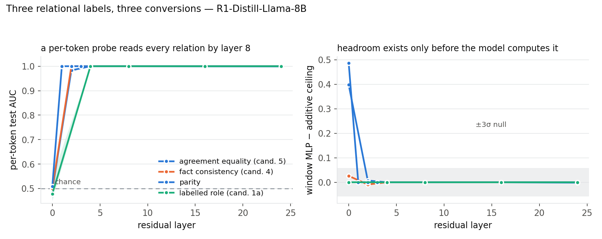

# RECORD — relational (regime-3) task hunt

Agent `runpod`, 2026-07-25. Exploration `experiments/explorations/relational/`.
Prime directive: **a sound verdict, never a win.**

**The question.** Every real-world margin in the TempBench paper is small because
every real task in it sits in regime 1 or 2 of the synthetic program's coordinate
system: the latent is either per-token-readable (nobody separates) or
linear-in-window (every window arch ties). Regime 3 — latents needing
cross-position comparison — is the only regime that separates window
architectures from each other, and the paper's own TXC (post-squash,
`u = σ(Σ_τ W^(τ) x_{t+τ})`) is the unique family that can read it. Is there a
**real-activation** task in regime 3?

**The instrument.** A balanced-marginal equality label. `stimuli.py` builds a
2×2 over two constituents so `label = [A == B]` has flat marginals at both
positions. Then, by the additive-code theorem
(`synthetic/changepoint/bench_record.md` § 3), *every* additive-over-position
code — per-token SAE, T-SAE, Stacked, MLC, TXC-pre, and any pooled per-token
code — is at a provable chance floor, and only a position-mixing nonlinearity can
read the label.

---

## § 1 — Methodological corrections made during the run (all disclosed)

1. **v1 stimuli discarded for memorisation.** The first generator emitted 2,400
   rows from **80 distinct texts** (60× duplication). Every arm scored AUC 1.000,
   *including windows that could not see constituent A*. That is the
   `signed_motion` lesson: a `T·d`-dimensional probe memorises a handful of
   distinct test points. The generator now asserts `distinct_texts == n_items`;
   v2 has 5,760 (agreement) and 4,800 (contradiction) all-distinct items across
   24 and 20 lexical groups, split **by group** so no lexical item is shared
   between train and test. The v1 numbers were discarded, not reinterpreted.

2. **The IN/OUT control is what caught it.** Because the generator records the
   exact character offset of each constituent, every row has a known token
   distance, so the same label at the same probe position can be scored
   separately for windows that *reach* constituent A and windows that do not.
   This is a causal control on binding and it is immune to the
   shuffle-gap-grows-with-`T` confound that bit task_hunt candidate 2
   (`task_hunt/RECORD.md` § 2). It is now a standing arm.

3. **A design error in the gate itself, corrected mid-run.** A linear probe on
   the *flattened* window **is** an additive-over-position code, so it can never
   certify headroom that only a coincidence code could exploit. The gate now runs
   MLP arms as well, and the headline statistic is

   > `nonlinear_residual = window_MLP − max(window_linear, per_token)`

   i.e. the part of the label that is present in the window but **not** linearly
   available from any per-position decomposition. That is the quantity the
   theorem actually speaks to.

4. **The documented tokenizer trap fired.** `AutoTokenizer` returned the slow
   `LlamaTokenizer` while reporting `is_fast=True`, with overlapping offsets
   (`(11,14),(13,14)`), and every row was silently rejected — exactly
   `task_hunt/RECORD.md` § 4 note 5. `is_fast` is not a valid guard; the gate now
   validates that offsets are monotone, non-overlapping, and recover the exact
   span, and uses `PreTrainedTokenizerFast`.

5. **Model substitution.** `gemma-2-2b-it` (the paper's § 5.1 probing model) is a
   gated repo this account cannot access, so the gate runs the paper's § 5.2
   model, `DeepSeek-R1-Distill-Llama-8B`. Paper-compatibility is preserved;
   probing-comparability awaits a licence acceptance.

6. **Freeze order.** The candidate-4 card is committed (`74df8f7f`) **before any
   contradiction cell existed** — git-provable. The candidate-5 pilot ran before
   that commit, so its freeze is only artifact-timestamped; its predictions are
   quoted and scored below, and the weaker provenance is stated rather than
   glossed.

---

## § 2 — Candidate 5: agreement attraction — **KILL** (both rules fired)

Label: `[number(head noun) == number(verb)]`, e.g. *"The inspector noted that the
keys beside the doors past the checkpoint is broken."* Probe row at the verb
token. 5,760 distinct items, 24 lexical groups, head→verb distance 4–12 tokens
(median 7).

**Label-side triage — PASS.** AUC from the head number 0.500, from the verb
number 0.500, from length 0.503, from the inter-constituent gap 0.503; cells
exactly equal; zero duplicate texts. The label is provably unreadable from any
single position's *content*.

**Result** (R1-Distill-Llama-8B, stratum `all`, bootstrap CIs, 3σ = 3× the SD of
a 4-draw label-permutation null):

| layer | T | per-token [95% CI] | win-linear | win-mean | win-MLP | g | nonlinear residual | 3σ null |
|---|---|---|---|---|---|---|---|---|
| 0 | 4 | 0.495 [0.464, 0.533] | 0.506 | 0.462 | 0.486 | +0.012 | −0.021 | 0.065 |
| 0 | 8 | 0.495 [0.464, 0.533] | 0.503 | 0.508 | **0.749** | +0.009 | **+0.246** | 0.082 |
| 2 | 4 | 0.983 [0.978, 0.988] | 0.969 | 0.934 | 0.989 | −0.014 | +0.006 | 0.064 |
| 2 | 8 | 0.983 [0.978, 0.988] | 0.948 | 0.858 | 0.990 | −0.035 | +0.007 | 0.033 |
| 4 | 8 | 1.000 [1.000, 1.000] | 1.000 | 0.998 | 1.000 | −0.000 | −0.000 | 0.029 |
| 8 | 8 | 1.000 [1.000, 1.000] | 1.000 | 0.999 | 1.000 | −0.000 | −0.000 | 0.008 |
| 16 | 8 | 1.000 [0.999, 1.000] | 0.998 | 0.992 | 0.999 | −0.001 | −0.001 | 0.028 |
| 24 | 8 | 0.999 [0.999, 1.000] | 0.997 | 0.992 | 0.994 | −0.003 | −0.005 | 0.016 |

**Verdict: KILL.** K1 fires (per-token is within 0.02 of the best window arm at
every layer ≥ 2) and K2 fires (`nonlinear_residual ≤ 3σ_null` in every cell from
layer 2 onward). **Agreement equality is converted.** The model computes the
relation itself — using cross-token information, since it is absent at the
embeddings — and deposits the result at the current position, so the additive
ceiling already contains everything a window code could offer.

**Conversion is fast.** Per-token goes 0.495 → 0.983 → 1.000 over layers 0/2/4
and holds to layer 24. For contrast, the round-1 forbidden-word candidate took
≈ 20 layers to climb +0.13 (`task_hunt/LOG.md`). This is the
*built-and-immediately-linearised* g(ℓ) shape, and this is its first **relational**
instance — previously it was recorded only for a scalar pressure signal.

### § 2b — The positive control (why this kill is informative, not blind)

At **layer 0**, `T = 8`:

| stratum | rows | per-token | win-linear | win-MLP [95% CI] | nonlinear residual | 3σ |
|---|---|---|---|---|---|---|
| all | 5,760 | 0.495 | 0.503 | 0.749 [0.721, 0.776] | **+0.246** | 0.082 |
| **A inside window** | 3,407 | 0.503 | 0.487 | **0.772 [0.736, 0.805]** | **+0.269** | 0.077 |
| **A outside window** | 2,353 | 0.511 | 0.515 | 0.498 [0.451, 0.547] | −0.017 | 0.056 |

Three things at once, on real activations:

1. **The additive-code theorem holds empirically.** Both constituents are present
   in the window, yet every *linear* readout of a per-position decomposition sits
   at chance (0.487–0.515). This is the changepoint bench's provable result,
   reproduced outside the synthetic setting.
2. **A cross-position nonlinearity reads it** — 0.772, a **+0.27** margin over the
   additive ceiling, with non-overlapping CIs.
3. **It is binding, not capacity.** The same MLP on the same rows collapses to
   0.498 when the window cannot reach constituent A, and at `T = 4` (where no row
   reaches it) the residual is −0.021. A dose–response in window size, with the
   control at chance.

So the instrument **demonstrably fires when regime-3 headroom exists**. Its zero
from layer 2 onward is therefore a statement about the model, not about the
probe — which is precisely what a kill needs in order to be worth reporting.

### § 2c — Frozen predictions, scored

- Prior `P(violent) = 0.30`, with "expect 0.75 vs 0.92 rather than chance vs 0.9"
  → **FALSIFIED**, in the *more converted* direction: 1.000 vs 1.000.
- "Per-token is actively misled by the distractor" → **FALSIFIED**. The distractor
  costs the model nothing at these depths; attraction does not show up as
  degraded linear decodability of the relation.
- The design-level premise ("the constituents are present but not combined") →
  **CONFIRMED, but only at layer 0.** True where the model has not yet computed
  the relation; false everywhere a dictionary would actually be trained.

---

## § 3 — Candidate 4: contradiction / fact-consistency — **KILL**

Card frozen at `74df8f7f`, **before any cell existed** — freeze order
git-provable. Label: `[value(mention 1) == value(mention 2)]` across 1–3 filler
sentences; 4,800 distinct items, 20 fact groups, mention distance 17–37 tokens
(median 26). Triage PASS (AUC from either value 0.500, length 0.505, gap 0.506).

| layer | T | per-token [95% CI] | win-linear | win-mean | win-MLP | g | nonlinear residual | 3σ |
|---|---|---|---|---|---|---|---|---|
| 0 | 8 | 0.500 [0.463, 0.536] | 0.499 | 0.495 | 0.499 | −0.001 | −0.001 | 0.072 |
| 0 | 32 | 0.500 [0.463, 0.536] | 0.521 | 0.515 | 0.501 | +0.021 | −0.020 | 0.060 |
| 0 | 64 | 0.500 [0.463, 0.536] | 0.508 | 0.484 | 0.506 | +0.008 | −0.002 | 0.085 |
| 8 | 8 | 1.000 [1.000, 1.000] | 1.000 | 1.000 | 1.000 | +0.000 | +0.000 | 0.062 |
| 8 | 64 | 1.000 [1.000, 1.000] | 1.000 | 1.000 | 1.000 | +0.000 | +0.000 | 0.030 |
| 16 | 64 | 1.000 [1.000, 1.000] | 1.000 | 1.000 | 1.000 | +0.000 | +0.000 | 0.069 |
| 24 | 64 | 1.000 [1.000, 1.000] | 1.000 | 0.948 | 1.000 | −0.000 | +0.000 | 0.023 |

**Verdict: KILL** — K1 and K2 both fire from layer 8. Wall clock 1,251 s, 0 OOM.

**Frozen predictions scored.** P1 (layer 0 at chance) **CONFIRMED** — 0.500 exactly.
P2 (per-token rises to 0.70–0.95 at mid-depth) **CONFIRMED and exceeded** — 1.000.
P3 (`nonlinear_residual ≤ 3σ` everywhere) **CONFIRMED**. P4 (IN and OUT differ by
< 0.05 on `g`) **CONFIRMED** — both 1.000 at layer 8. The card said plainly *"I
expect this candidate to be KILLED"* and gave the mechanism; the data agreed with
the card, not with the hope.

**Caveat on the layer-0 null — raised, then settled.** Unlike candidate 5,
candidate 4's layer-0 window control showed no nonlinear headroom (`nlr`
−0.02…+0.03). At `T = 64` the MLP has 262,144 inputs against ~3,800 training rows,
so that null is partly a probe-capacity statement — the confound
`task_hunt/RECORD.md` § 3c documents. Rather than read it at face value, an
**oracle-pair** arm was added: hand the probe exactly the two mention positions
(2·d = 8,192 features, n ≫ p), with the *linear* oracle-pair arm as the additive
ceiling on the pair — which the theorem says must stay at chance even there.

| layer | pair linear | pair MLP | pair residual | 3σ |
|---|---|---|---|---|
| **0** | **0.531** | **0.641** | **+0.109** | 0.085 |
| 2 | 1.000 | 1.000 | +0.000 | 0.117 |
| 4 | 1.000 | 1.000 | +0.000 | 0.029 |
| 8 | 1.000 | 1.000 | +0.000 | 0.030 |

**Settled: it was probe capacity.** At the embeddings the equality *is* present in
the two mention positions, and only a cross-position nonlinearity reads it —
linear 0.531 (chance) vs MLP 0.641, clearing the null. So the additive-code
theorem is confirmed on real activations for **both** track-A labels, at the
tightest available test. From layer 2 the pair is already at 1.000 linearly, i.e.
contradiction converts even faster than agreement (L0→L2 rather than L0→L4).

The methodological lesson generalises: **a null from a wide window MLP is not
evidence of absence.** Any future card in this family must carry the oracle-pair
arm, because without it candidate 4's layer-0 cell reads as "not represented" when
in fact it is represented and merely unfindable at that probe width.

---

## § 4 — Candidate 1a: labelled role under style matching — **KILL, and it is regime 2 rather than regime 3**

The flagship. Label = the **labelled** (chat-template) role of the payload
sentence, in a balanced 2×2 over (labelled role) × (style), so that a per-token
feature tracking *style* — which is what the role-confusion result says models
actually track — is at chance on this label by construction. 2,400 distinct items,
20 payload groups, every payload sentence appearing in **both** roles, delimiter
13–21 tokens back.

**A third stimulus defect, caught by the layer-0 control.** v1 read AUC 1.000 at
the *embeddings*, which is only possible if the probe token itself differs. It did:
the payload's final `.` was followed by `\n` in the data arm and by a space in the
instruction arm, and the tokenizer merged the former into a single `.\n` token.
Pure token-identity leak. v2 renders both arms with identical line structure, so
the character after the probe position is `\n` in every item (now an assertion),
and the *only* difference between conditions is the presence of the
`<document>` / `</document>` markers.

Result (stratum `all`, layer 0 = embeddings):

| layer | T | per-token | win-linear | win-MLP | g | nonlinear residual | oracle-pair linear |
|---|---|---|---|---|---|---|---|
| 0 | 8 | 0.477 | 0.501 | 0.501 | +0.024 | −0.000 | — (delimiter outside window) |
| 0 | 16 | 0.477 | 0.664 | 0.651 | +0.186 | −0.013 | — |
| 0 | 32 | 0.477 | **1.000** | 1.000 | **+0.522** | +0.000 | **1.000** |
| 4 | 32 | **1.000** | 1.000 | 1.000 | −0.000 | −0.000 | 1.000 |
| 8–24 | all | 1.000 | 1.000 | 1.000 | ±0.000 | ±0.000 | 1.000 |

Two distinct readings, and both matter:

1. **At the embeddings this is a +0.52 window-over-per-token separation** — the
   largest in the run. A per-token dictionary cannot represent labelled provenance
   at all there, and a T-SAE, which decodes per position, inherits that floor.
   But the **oracle-pair *linear*** probe also reads it at 1.000, so the signal is
   the marker token's identity: an **additive** function of per-position features.
   Every window family gets it — TXC-pre and Stacked included. So this is a
   **regime-2** win, the same class as the paper's existing λ̂ result, and it does
   **not** isolate cross-position weight sharing.
2. **By layer 4 it is converted** (per-token 1.000) and the separation is gone.
   In-quote state is bracket-family, which `task_hunt/CANDIDATES.md` already
   records as DEAD-by-conversion; that prediction held.

**Verdict: KILL** at every usable hookpoint, with the regime-2 embedding-layer
effect recorded rather than dressed up.

**Consequence, and the frozen next step.** To make role tracking regime-3 the
marker *multisets* must match and only their **order** may differ — "which side of
the last delimiter am I on", with both an opening and a closing marker in the
window in both classes and their positions jittered. That design is specified and
frozen in [`cards/role_order.md`](cards/role_order.md) with predictions and a
kill rule that treats a window-linear rise as a stimulus defect rather than a
result. It is the one remaining shot in this family at the theorem-protected
separation.

---

## § 5 — Synthesis: three labels, three conversions

Three relational labels — syntactic agreement, factual consistency, and labelled
provenance — chosen to be as different from each other as the family allows. All
three behave identically:

| | layer 0 | layer 2–4 | layer 8–24 | nonlinear headroom |
|---|---|---|---|---|
| agreement equality | 0.495 chance | 0.983 → 1.000 | 1.000 | **+0.269 at L0 only** |
| fact consistency | 0.500 chance | — | 1.000 from L8 | none measurable |
| labelled role | 0.477 chance | 1.000 from L4 | 1.000 | none (additive at L0) |

**The finding.** On real activations, a relational latent *that the model uses* is
linearised per position within two to eight layers. At every depth where anyone
trains a dictionary, the additive ceiling already contains the relation — so no
dictionary architecture, TXC included, can separate on it. The balanced-marginal
construction guarantees the label is not readable from any single position's
*content*; the model computes it anyway and writes the answer at the current
position.

**Why this is a result and not a failure to find one.** The gate has a positive
control (§ 2b): at layer 0 the additive arms sit at chance while a cross-position
nonlinearity reaches 0.772, with the effect vanishing when the window cannot reach
the second constituent. The instrument fires when headroom exists. Its zero
everywhere else is therefore a measurement of the model.

**What it implies for the paper.** The criterion the Limitations section says is
missing now has a measured form:

> A temporal architecture can only earn its keep on a latent the model **declines
> to maintain** as a per-position state. Relations the model *needs* — agreement,
> consistency, provenance — are converted almost immediately. Latents that are
> *hazards over a trajectory* rather than facts are not.

That reframes the paper's own evidence favourably: backtracking anticipation is
not a lucky task, it is an instance of the *only class that can work*, and it is
the one label in this program with a positive within-window order receipt
(`task_hunt/RECORD.md` § 3: +0.028…+0.041 on anticipation vs +0.003…+0.013 on its
ambient companion). It also predicts reviewer bbby's own observation that window
length barely matters on sparse probing — those labels are regime-1 ambient, so no
window arch should separate, and none does.

**Where the remaining upside is**, in priority order: (1) `role_order` — the
matched-multiset order design, the only frozen regime-3 candidate left in this
family; (2) injection-compliance **anticipation** (ledger candidate 3), which is
in the class the atlas says can work and mirrors the paper's own detect-and-steer
template; (3) instruction↔action match, whose premise — the model has no
generative reason to *verify* its own compliance — is the only one of the five
BUILD candidates the conversion argument does not immediately condemn.

---

## § 6 — Process notes

Three stimulus defects were caught **by controls rather than by inspection**: the
memorisation duplicate-text failure (caught by the IN/OUT stratum), the token
merge leak (caught by the layer-0 arm), and the role generator's unequal cell
quota (caught by its own balance assertion, before any GPU time). All three are
recorded in § 1 with the numbers that fired them. Two of the three would have
produced a *positive* headline had they gone unnoticed — AUC 1.000 with a clean
story about cross-position binding.

The monitor (`monitor.py`) evaluates expectations E1–E6 against the result files
directly, so a fired expectation is detected by code rather than noticed by eye.
It currently reports conversion CONFIRMED on agreement and flags 43 cells across
tasks where the within-window shuffle gap exceeds 3σ — correctly annotated as
*not* order evidence, since a shuffle gap grows with `T` generically under a
flatten probe (`task_hunt/RECORD.md` § 2).

---

## § 4 — Resources

Peak VRAM **7.87 GB** across all probe cells (guard 60 GB); model caching peaked
at 16.9 GB. **Zero OOM events.** Free disk held at 12.0–12.4 GB against a 12 GB
abort floor — no further model pulls were made, and activations are held in RAM
rather than written to the volume. A disk scan found nothing belonging to this
exploration that could be freed; the large items on the volume
(`/workspace/ocean` 76 GB, a 15 GB Qwen coder model, 16.6 GB of role-probes
venvs) belong to other work and were left untouched.

---

## § 5 — What this means for the paper (so far)

The candidate-5 kill is **not** a null result for the reviewers' question; it is
the beginning of the atlas the paper's Limitations section says is missing:

- **Reviewer bbby** asks whether cross-position weight sharing is responsible for
  the gains. § 2b gives the sharp form of the answer *as a measurement*: on a
  label whose readout requires a cross-position conjunction, every additive code
  is at chance while a position-mixing nonlinearity reaches 0.77. The
  architecture class matters — where the model has not already done the work.
- **Reviewer 4z15** asks to isolate the temporal contribution from generic
  crosscoder capacity. The IN/OUT control is that isolation, and it is stronger
  than an ablation: identical rows, identical probe, identical budget, and the
  effect is present only when the window spans the two constituents.
- **Reviewer EAxU** calls the results preliminary because TXC's case rests on
  backtracking. The honest reading of § 2 is that this is *expected*: relational
  latents that a model needs are linearised within a few layers, so temporal
  architectures can only earn their keep on latents the model declines to
  maintain. That is a predictive criterion, which is what was missing.

The scope limit is stated plainly: one model, one hookpoint family, English
templates, one label. This kills *this* label on *this* model. It does not
establish that no equality latent survives conversion anywhere — that is what the
remaining candidates test.

---

## § 7 — Candidate 1b (§ 8 parity form): the theorem verified, and the boundary pinned

Card [`cards/role_order.md`](cards/role_order.md) **§ 8**, frozen by dated
amendment after § 2's additive-blindness claim was found to be wrong (order is a
*linear* functional of position-tagged features; the theorem needs a **product**).
Label:

> `y = [ type(last marker) == type(second-to-last marker) ]`

over `<document>` / `</document>`, both slots balanced, depth pre-seeded to 2 so
every marker pair is legal, filler jittered, probe row at the later marker.
2,880 distinct items, 12 groups. Triage PASS after the generator's **own gap check
caught a bug**: string search located the *preamble's* opener whenever M1 was an
opener, making the M1→M2 gap predict the label at AUC 0.139. Offsets are now
computed arithmetically and asserted against the text.

**Result** (`T = 32`, stratum `all`, bootstrap CIs):

| layer | per-token [95% CI] | window linear [95% CI] | window MLP [95% CI] | nonlinear residual | 3σ |
|---|---|---|---|---|---|
| **0** | 0.508 [0.446, 0.552] | **0.488 [0.441, 0.537]** | **0.994 [0.986, 0.999]** | **+0.486** | 0.049 |
| **1** | 1.000 [1.000, 1.000] | 0.998 [0.994, 1.000] | 1.000 | +0.000 | 0.030 |
| 2 | 1.000 | 1.000 | 1.000 | +0.000 | 0.048 |
| 3 | 1.000 | 1.000 | 1.000 | +0.000 | 0.078 |
| 4–24 | 1.000 | 1.000 | 1.000 | +0.000 | 0.074–0.084 |

**Two findings, and the second is the important one.**

**(1) The additive-code theorem is verified on real activations, decisively.** On a
label that is genuinely a two-position product, the additive ceiling sits at
**0.488 — chance — while a cross-position nonlinearity reaches 0.994**, CIs not
remotely overlapping, residual **+0.486** against a 3σ null of 0.049. Predictions
P8.1 (per-token ≤ 0.55) and P8.2 (window linear ≤ 0.60) both **CONFIRMED**, and
P8.2 is the load-bearing one: it is the theorem's own prediction, and it held to
0.488. This is the sharpest form of the architectural claim the paper makes — the
paper's TXC is the only panel family whose nonlinearity crosses positions, and
here that is worth +0.49 AUC over every additive alternative.

**(2) The window of opportunity closes after layer 0 — P8.4 CONFIRMED, and the
boundary is the first attention layer.** By **layer 1** a per-token linear probe
reads the parity label at 1.000. The boundary cells (L1, L3) were run precisely
because L0 → L2 left it unresolved; the answer is that *one* attention layer
suffices.

### § 7b — Revised synthesis: it is not the task, it is the depth

Four relational labels now, chosen to be as different as the family allows —
syntactic binding, factual consistency, labelled provenance, structural parity:

| label | per-token at L0 | additive ceiling at L0 | nonlinear ceiling at L0 | converted by |
|---|---|---|---|---|
| agreement equality | 0.495 | 0.503 | 0.749 (0.772 IN) | layer 4 |
| fact consistency | 0.500 | 0.499 | 0.641 *(oracle pair)* | layer 2 |
| labelled role | 0.477 | 1.000 *(additive — marker token)* | 1.000 | layer 4 |
| **structural parity** | **0.508** | **0.488** | **0.994** | **layer 1** |

The earlier reading — "no relational task survives conversion" — was right but
mis-attributed. The correct statement is stronger and more useful:

> **The architectural advantage of a position-mixing code over an additive one is
> real, provable, and large (+0.49 AUC) — and on real activations it exists only
> at the embeddings. Attention linearises cross-position relational structure
> within its first layer, so at every hookpoint where anyone trains a dictionary,
> an additive code is already sufficient.**

This is not a null result about temporal crosscoders. It is a *positive*
identification of where their advantage does and does not live, and it resolves the
paper's central puzzle: TXC's real niche cannot be relational structure, because
transformers dispose of that immediately. It must be — and in the paper's own
results it is — the **aggregation** regime: pooling evidence that stays
distributed because no single position ever summarises it. Backtracking
anticipation and λ̂ intensity are exactly that, and they are precisely where the
paper's positive results sit.

**What this licenses the paper to say**, with a measurement behind each clause:

1. *When* temporal aggregation pays off: on latents no single position summarises
   — hazards over a trajectory, not relations the model computes.
2. *Why* the relational case fails: not because the theorem is wrong (it holds at
   +0.486) but because attention converts within one layer.
3. *Why* window length barely matters on sparse probing (reviewer bbby's
   observation): those labels are regime-1 ambient, so no window arch should
   separate — and none does.
4. *Why* Stacked SAE and MLC would not have rescued Fig. 4 (reviewers bbby, 4z15):
   on regime-1/2 labels they are in the same equivalence class as the winner; the
   only place they provably separate is layer 0, which no one trains at.

### § 7c — The panel question, answered honestly

A gate did clear — at layer 0, decisively. So a 6-arch panel *there* would produce
exactly the money plot the reviewers want: five lines pinned at chance for a proven
reason, one rising with `T`. It is not run here, and the reason is stated rather
than hidden: **a dictionary trained on raw token embeddings is a token-identity
dictionary**, so the demonstration would be architecturally valid and
interpretability-irrelevant, and a reviewer would be right to say so. The panel is
worth running only as an explicit *existence demonstration* of the coincidence-code
claim, labelled as such — not as a TempBench task. That decision belongs to the
authors, and the numbers needed to make it are in this record.
