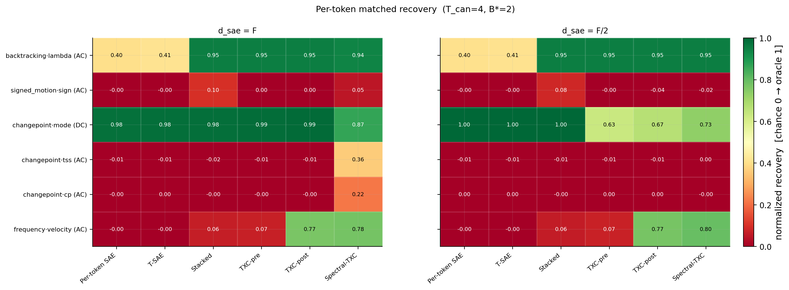
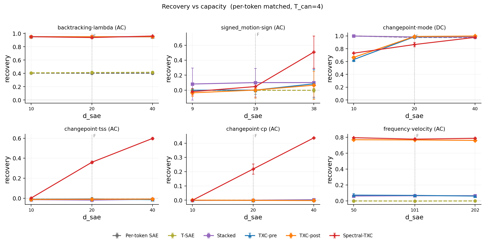
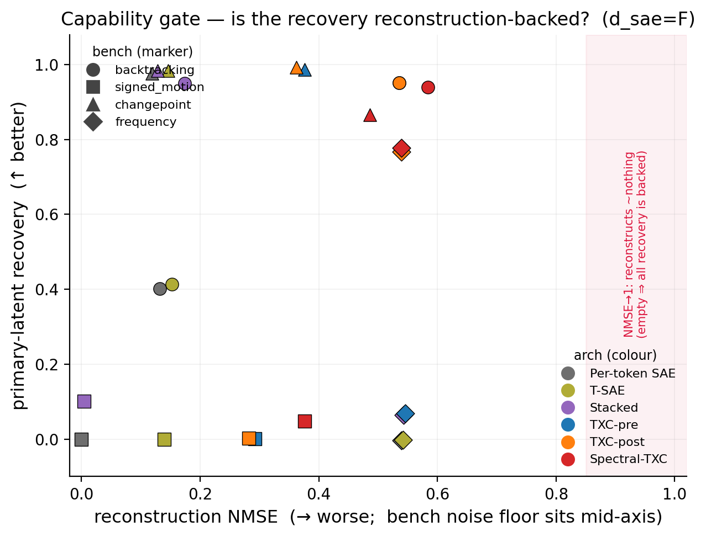

# Synthetic-benchmark program — B×A comparison report

**Auto-generated.** Every number below is rebuilt from the canonical leaderboard
(`results/leaderboard.jsonl`) by
`-m experiments.explorations.synthetic.render_report`; nothing is hand-typed. The
matrix spec (which benches, which architectures, the canonical operating point)
lives in [`registry.py`](registry.py). Per-benchmark detail — the full `d_sae`
and `T` frontiers, controls, and prose verdict — stays in each bench's own
`bench_record.md`; this file is the *cross-benchmark summary*, not a replacement.

---

## How the grid is made comparable (frozen)

The program compares **B benchmarks × A architectures**. Two things are not
natively comparable; both are resolved so a cell is apples-to-apples.

**1. Cross-benchmark metric.** Each benchmark scores latent recovery with a
held-out **linear** probe on the identical `L`-tiling, normalized to
`[chance = 0, oracle = 1]`. That single normalized scalar is comparable across
benchmarks. A **dual-latent** benchmark contributes **one matrix row per
latent-axis** (e.g. changepoint → a DC `mode` row and an AC `time-since-switch`
row), so the split is shown, not averaged away.

**2. Cross-architecture budget — matched per-token sparsity.** Architectures are
matched on the **realized `l0_per_token`** — the per-token code density actually
fired, measured on the shared eval windows, **not** the nominal `k_pos` knob
(they diverge sharply: at `T=8`, nominal `k_pos=4`, a per-token SAE fires
4/token, TXC-pre ~2/token, TXC-post 0.5/token). Per-token matching is the
*controlled* comparison: it equalizes the total atom budget spent describing any
span, so the only remaining variable is decode structure (one joint window code
vs `T` independent per-token codes). A token arch is the `T=1` base case; a
window arch gets `k_win = B*·T`. (`l0_per_window` is also recorded as a
diagnostic, but we do **not** match on it.)

**3. Capacity.** Each bench's canonical cells sit at **`{F, F/2}`** (boundary +
deep-scarce), a uniform rule for every bench. `F` is per-bench (usually the
feature-direction count; for frequency it's the alphabet `M=101`, footnoted
below) — cross-bench comparability rides on the normalization above, not on an
identical absolute `d_sae`.

<!-- BEGIN AUTO:operating_point -->
Per-token matched: window **T = 4** (token archs T=1), matched to **B\* = 2** atoms/token (nearest realized `l0_per_token`; loose match >1 marked `*`). Each cell is normalized recovery `mean` over seeds, `[chance=0, oracle=1]`, shown at **F, F/2** (`boundary / deep-scarce`):

- **backtracking**: d_sae ∈ {20, 10} (F=20; feature-direction count (1 backtrack + 19 content).)
- **signed_motion**: d_sae ∈ {19, 9} (F=19; feature-direction count (19 step directions).)
- **changepoint**: d_sae ∈ {20, 10} (F=20; feature-direction count (8 mode-signature + 12 content).)
- **frequency**: d_sae ∈ {101, 50} (F=101; alphabet M=101 (NOT a direction count): the circle embedding is rank-2 (all M symbols in a 2-D plane), so {101, 50} are alphabet-scaled capacities, both < the memorization budget |Ω|·M=1010.)
<!-- END AUTO:operating_point -->

---

## Matrix — per-token matched

Each cell is normalized recovery at `d_sae = F / F/2` (boundary / deep-scarce);
`—` = no grid cell there yet; `*` = loose realized-L0 match. Per-bench `d_sae`
values and the operating point are printed above. Run the uniform re-grid to fill
holes.

<!-- BEGIN AUTO:matrix_pertoken -->
| bench · latent (DC/AC) | Per-token SAE | T-SAE (contrastive) | Stacked (per-position dicts) | TXC-pre (additive) | TXC-post (coincidence) | Spectral-TXC (DCT bands) |
|---|---|---|---|---|---|---|
| **backtracking** · λ — self-exciting intensity (linear-in-history) (AC) | 0.402 / 0.403 | 0.413 / 0.408 | 0.950 / 0.951 | 0.952 / 0.951 | 0.951 / 0.951 | 0.939 / 0.951 |
| **signed_motion** · sign — ±1 order-sensitive step (AC) | -0.001 / -0.001 | -0.001 / -0.001 | 0.101 / 0.082 | 0.001 / -0.000 | 0.002 / -0.035 | 0.048 / -0.019 |
| **changepoint** · mode m_t — global hidden state (DC) | 0.977 / 1.000 | 0.984 / 0.999 | 0.983 / 0.999 | 0.987 / 0.632 | 0.992 / 0.666 | 0.866 / 0.732 |
| **changepoint** · time-since-switch (primary AC latent) (AC) | -0.009 / -0.010 | -0.009 / -0.009 | -0.018 / -0.014 | -0.008 / -0.011 | -0.010 / -0.012 | 0.360 / 0.002 |
| **changepoint** · change-point c_t — adjacency floor (AC) | -0.000 / 0.000 | 0.000 / 0.000 | -0.000 / -0.002 | -0.002 / 0.000 | -0.001 / 0.000 | 0.219 / -0.001 |
| **frequency** · velocity Y — cyclic tone f = Y/M (AC) | -0.004 / -0.001 | -0.003 / -0.003 | 0.064 / 0.060 | 0.068 / 0.072 | 0.767 / 0.770 | 0.777 / 0.796 |
<!-- END AUTO:matrix_pertoken -->

**The matrix as colour** — which architecture linearly exposes which latent (green
= oracle, red = chance). Additive/per-token columns go cold on the AC-interaction
rows; the position-mixing crosscoders (TXC-post, Spectral) light up, and the
Spectral column is the lone one exposing the changepoint boundary (`tss`, `cp`):

**Recovery vs capacity** — does the win survive into the scarce regime (`d_sae ≤ F`,
`F` marked)? One panel per (bench, latent), one line per arch (per-token dashed):

---

## Companion panels — the capability-vs-artifact gate

Latent recovery only *counts* if the architecture also reconstructs the signal
(README validity gate: "the winner must also reconstruct, not recover the latent
while representing nothing"). These panels are per **benchmark** (`A×B`, one value
per bench — reconstruction is of the shared activations, so it does **not** split
by latent-axis), read from the same per-token matched cells as the matrix above,
at `d_sae = F / F/2`. A high recovery number paired with a poor reconstruction is
a **red flag** — and is often the *cost* story (e.g. an AC-latent win paid for in
content). Where a benchmark exposes it, this is the "what did the recovery cost".

**Reconstruction NMSE** (windowed; **lower is better**, 0 = perfect, ~1 = trivial):

<!-- BEGIN AUTO:panel_nmse -->
| benchmark | Per-token SAE | T-SAE (contrastive) | Stacked (per-position dicts) | TXC-pre (additive) | TXC-post (coincidence) | Spectral-TXC (DCT bands) |
|---|---|---|---|---|---|---|
| **backtracking** | 0.132 / 0.347 | 0.152 / 0.381 | 0.174 / 0.347 | 0.536 / 0.631 | 0.535 / 0.629 | 0.584 / 0.634 |
| **signed_motion** | 0.000 / 0.474 | 0.139 / 0.485 | 0.004 / 0.473 | 0.292 / 0.580 | 0.282 / 0.578 | 0.376 / 0.616 |
| **changepoint** | 0.119 / 0.205 | 0.146 / 0.228 | 0.128 / 0.205 | 0.376 / 0.550 | 0.362 / 0.543 | 0.486 / 0.628 |
| **frequency** | 0.540 / 0.543 | 0.542 / 0.544 | 0.543 / 0.544 | 0.546 / 0.550 | 0.539 / 0.545 | 0.539 / 0.545 |
<!-- END AUTO:panel_nmse -->

**Content-direction recovery** (`eauc`; cosine-AUC of decoder atoms vs the
emission features; higher is better):

<!-- BEGIN AUTO:panel_eauc -->
| benchmark | Per-token SAE | T-SAE (contrastive) | Stacked (per-position dicts) | TXC-pre (additive) | TXC-post (coincidence) | Spectral-TXC (DCT bands) |
|---|---|---|---|---|---|---|
| **backtracking** | 0.989 / 0.524 | 0.950 / 0.492 | 0.545 / 0.477 | 0.675 / 0.397 | 0.633 / 0.385 | 0.424 / 0.332 |
| **signed_motion** | 0.702 / 0.486 | 0.663 / 0.483 | 0.505 / 0.425 | 0.438 / 0.382 | 0.433 / 0.374 | 0.398 / 0.324 |
| **changepoint** | 0.952 / 0.233 | 0.848 / 0.207 | 0.547 / 0.347 | 0.011 / 0.010 | 0.011 / 0.010 | 0.228 / 0.208 |
| **frequency** | 0.927 / 0.917 | 0.897 / 0.900 | 0.580 / 0.626 | 0.978 / 0.983 | 0.973 / 0.916 | 0.901 / 0.900 |
<!-- END AUTO:panel_eauc -->

**The gate, visually** — latent recovery (↑) vs reconstruction NMSE (→ worse). The
degenerate corner (recovery with near-trivial reconstruction) is shaded; it is
empty, so every recovery here is reconstruction-backed. The tradeoff is still
visible: window archs buy latent recovery at a reconstruction cost (rightward),
and a bench's noise floor (frequency) sits mid-axis for all archs:

---

## Grid coverage

What (arch, T, d_sae) groups currently exist per bench on the leaderboard — the
holes the uniform re-grid will fill.

<!-- BEGIN AUTO:coverage -->
- **backtracking** (F=20): 42 (arch,T,d_sae) groups · archs: batchtopk_sae, spectral_txc, stacked_batchtopk, tsae, txc_batchtopk_post, txc_batchtopk_pre
- **signed_motion** (F=19): 42 (arch,T,d_sae) groups · archs: batchtopk_sae, spectral_txc, stacked_batchtopk, tsae, txc_batchtopk_post, txc_batchtopk_pre
- **changepoint** (F=20): 42 (arch,T,d_sae) groups · archs: batchtopk_sae, spectral_txc, stacked_batchtopk, tsae, txc_batchtopk_post, txc_batchtopk_pre
- **frequency** (F=101): 62 (arch,T,d_sae) groups · archs: batchtopk_sae, spectral_txc, spectral_txc_dcac, spectral_txc_full, stacked_batchtopk, tsae, txc_batchtopk_post, txc_batchtopk_pre
<!-- END AUTO:coverage -->

---

## Per-benchmark records

- [`backtracking/bench_record.md`](backtracking/bench_record.md) — POSITIVE
- [`changepoint/bench_record.md`](changepoint/bench_record.md) — SPLIT (two-way)
- [`frequency/bench_record.md`](frequency/bench_record.md) — POSITIVE
- [`signed_motion/bench.md`](signed_motion/bench.md) — NEGATIVE

See [`STATUS.md`](STATUS.md) for the living program state and
[`README.md`](README.md) for the governing methodology.
