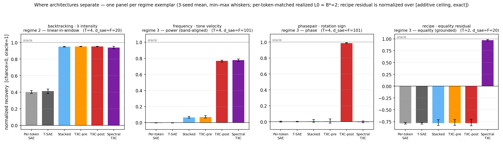

# The synthetic story — where temporal architectures earn their keep

**What this is.** The distilled head-to-head evidence from the synthetic-
benchmark program: per-token SAEs vs T-SAE vs the window/crosscoder family,
told for a reader outside the program. Every number is machine-derived from the
canonical leaderboard (`results/leaderboard.jsonl`, 7,116 code-version-stamped
rows): matrix cells come from [`REPORT.md`](REPORT.md) (auto-rendered by
`render_report.py`), figure and parameter numbers from
[`story_figs.py`](story_figs.py) → [`results/story_stats.json`](results/story_stats.json).
Methodology, gates, and the coordinate system live in [`README.md`](README.md);
per-bench detail in each `bench_record.md`. Paper-side numbers (§ 4) cite the
paper sections they come from.

The one-sentence version: **whether a temporal architecture beats a per-token
SAE is not a property of the architecture — it is a property of where the
latent lives**, and the suite's three-axis coordinate system predicts the
winner well enough to have survived five rounds of frozen blind predictions
(§ 3).

---

## 1. The regime table, with receipts

Every evaluated bench lands in one of four regimes (README coordinate
section). Cells below are normalized recovery `[chance=0, oracle=1]` at the
canonical per-token-matched operating point (T=4, realized L0 ≈ 2/token,
`d_sae = F`; REPORT.md matrix — the `F`-capacity value of each `F / F/2` pair).

| regime | who wins | receipts (bench · canonical cells) |
|---|---|---|
| **1 — ambient / per-token-readable** | nobody separates | changepoint `mode`: per-token 0.98, every window arch 0.87–0.99 · assumption `state`: 1.00 all six archs · assumption `next-state`: per-token 0.63, best window 0.64 (**NEGATIVE** — the frozen windows-beat-per-token prediction failed) · hedging `confidence`: per-token 0.755, best window 0.775 (**SPLIT**, edge ≤ +0.02) · recipe `phase`: 1.00 all |
| **2 — linear-in-window** | **any** window arch; per-token floored | backtracking `λ`: Stacked 0.950 ≈ TXC-pre 0.952 ≈ TXC-post 0.951 ≈ Spectral 0.939 vs per-token 0.402 (provable DPI floor ≈ 0.41) |
| **3 — order-2 / position-mixing** | **only** mixing codes; *which one* follows the subtype rule (§ 3) | frequency `velocity`: Spectral 0.777, post 0.767 vs Stacked 0.064, pre 0.068, token −0.004 · multilane: Spectral 0.561 > post 0.521 vs ≤ 0.024 · phasepair `sign`: post 0.988, everything else ≤ 0.006 incl. Spectral −0.004 · colored_sources: pre 0.109, the only lift · changepoint `tss`/`cp`: Spectral 0.360/0.219, only column ≠ 0 · recipe `equality residual` (T=2): Spectral 0.973, all others ≈ −0.78 · permuted_tones: post 0.060 (weak — 16 % of a provable ceiling at its best cell) |
| **4 — substrate defect** | nobody | signed_motion `sign`: max 0.101 (`#windows = 2F` memorization confound; the FreqBench proof addendum in `signed_motion/bench.md` retro-explains it as substrate defect, not panel phase-blindness) |

**The ambience point, explicitly.** The organizing concept is *ambience*: a
latent is ambient when a single token's marginal already depends on it.
Persistent "global" properties are usually ambient — and that is exactly where
the program's measured real-language properties landed. Both grounded
phenomenon benches that reached architecture evaluation came back regime 1:
`assumption_consequence` **NEGATIVE** (an order-1 mirror makes the current
state sufficient — per-token reads the directed grammar at the raw ceiling)
and `hedging_drift` **SPLIT** (confidence is ambient in token magnitude;
per-token reaches 0.73 of a 0.77 ceiling). The suite says so honestly:
**per-token SAEs suffice for ambient latents**, and a temporal architecture
can only earn its keep on a latent the per-token marginal cannot see. That is
why the discriminability STOP-gate (README validity gates) measures ambience
*before* any grid is spent — two further grounded candidates were stopped at
that gate rather than run to a fake win.

---

## 2. The isolation figure

One panel per regime exemplar, six bars each (3-seed mean, min–max whiskers),
at the bench's canonical verdict slice — `d_sae = F`, realized L0 matched to
≈ 2 atoms/token; T=4 for the swept exemplars, T=2 for the recipe residual
(its record's canonical window — the equality latent is adjacency-local; at
T=4 the Spectral residual falls to −0.23, REPORT.md). Rendered from the
leaderboard only by [`story_figs.py`](story_figs.py); plotted values in
[`results/story_stats.json`](results/story_stats.json). Two readings it should
make unmissable:

- **Regime 2 (backtracking): Stacked ≈ TXC-pre ≈ TXC-post ≈ Spectral, all
  0.94–0.95.** When reading the latent is a weighted sum over the window,
  *temporal aggregation of any kind* suffices — cross-position weight sharing
  (the crosscoder's one shared code) is **not** load-bearing. A bench that
  stops here cannot distinguish window architectures from each other.
- **Regime 3 (frequency, phasepair, recipe): Stacked ≈ per-token ≈ chance
  while the mixing codes win — and *which* mixing code wins rotates with the
  comparison subtype.** Stacked's per-position dictionaries mark the boundary:
  it aggregates over time but cannot *compare* positions, so cross-position
  structure is exactly what separates regime 3 from regime 2. Frequency
  (power, band-aligned): Spectral and post. Phasepair (phase): post alone —
  Spectral is provably sign-blind at T ≤ 4 (singleton DCT bands have no
  quadrature partner). Recipe residual (equality, grounded): Spectral alone at
  0.97 while every other family sits *below* the additive ceiling the axis is
  normalized against. No architecture dominates; the coordinates decide.

(The per-token-matched budget is doing real work here: TXC-post budgets per
window, so its matched cell uses nominal `k_pos = 8` at T=4 to realize the
same ≈ 2 atoms/token every other arch runs at — the match is on measured
density, never the knob.)

---

## 3. The subtype rule and its blind-prediction record

Within regime 3 the winner is a function of the **comparison type** (README
coordinate section):

- **phase-relational** (odd — sign/quadrature between positions) → the
  coincidence code, **TXC-post** — *T-conditional on band multiplicity*:
  untrained Spectral sign access climbs 0 → 0.67 → 0.94 at T = 4 → 8 → 16 as
  DCT bands become multi-index, so post's ownership of phase is a small-T
  statement (frozen T=16 addendum, `phasepair/bench_record.md`).
- **power / equality** (even — quadratic and matching invariants) → the band
  code, **Spectral-TXC** — *when the power concentrates in few DCT bands*: on
  a spectrally-generic schedule (random permutations of the tone map) trained
  Spectral is numerically pinned to a band-energy-envelope reference at every
  T and reads no temporal structure at all (`permuted_tones/bench_record.md`).
- **covariance-accumulable** (order-2 but additively summable) → the additive
  T-spanning decoder, **TXC-pre** — the only lift on colored_sources, with
  both coincidence-family codes at the floor.

Changepoint straddles the first two legs via axis-3 localization: post reads
the boundary at tiny T (k-fragile — gone at the matched budget above), while
Spectral's stationary bands win the robust reads.

The rule's currency is **frozen predictions scored blind**. The full record —
including the misses, which is what makes the holds worth something:

| prediction (frozen before the run) | outcome | recorded in |
|---|---|---|
| FB-2 multilane: Spectral > post ≫ additive ≈ token, memorization-immune | **HELD** (0.79 / 0.46 / ≈ 0) | `multilane/bench_record.md` |
| FB-2: multiband > vanilla-DCT by ≥ +0.03 at T=8 (the sprint's headline) | **MISS** (+0.019; edge peaks at T=4) | `multilane/bench_record.md` |
| FB-3 colored_sources: CS-1 floor over all T ≤ D cells | **HELD** (261 cells, max +0.037) | `colored_sources/bench_record.md` |
| FB-3: the W = D+1 transition realized near the +0.96 oracle | **PARTIAL** (realized at 21 % — and by txc-pre, not the predicted families; misses scored as misses) | `colored_sources/bench_record.md` |
| FB-1 phasepair: post reads phase-only sign; Spectral sign-blind at T ≤ 4 (singleton-band proof) | **HELD** (1.000; −0.004 at T=4 → 0.936 at T=8) | `phasepair/bench_record.md` |
| Stage-6 #3b recipe: Spectral exposes the equality residual | **HELD** (+0.97 at the T=2 matched cell) | `recipe_instruction_phase_runs/bench_record.md` |
| Stage-6 #3b: post also positive (changepoint τ precedent) | **MISS** (caps at the additive ceiling, best +0.26) | `recipe_instruction_phase_runs/bench_record.md` |
| T=16 addendum, 3 frozen extrapolations (band-margin inversion; Spectral sign ≥ its T=8 value; frequency saturation + high-pass sharpening) | **HELD 3/3, blind** | `freqbench/PORT.md` § I + the records' addenda |
| FB-4 rotated_multilane: untrained-Spectral collapse under a fixed spatial rotation | **REFUTED at the gate** — the absorption theorem (a fixed orthogonal knob is provably inert on a Haar seed-re-drawn embedding); ABORT, no grid spent | `rotated_multilane/bench_record.md` |
| FB-5 permuted_tones, 5 frozen directions | additive ≈ 0 **HELD** · post-positive **HELD** (magnitude below the indicative band at the canonical k) · Spectral-below-post **MIXED** literally, its mechanism clause **HELD** sharply (Spectral 0.016/0.042/0.096 vs envelope 0.017/0.048/0.116 at T=2/4/8) · untrained-prior collapse **PARTIAL** (6.6×) · falsifiers clean | `permuted_tones/bench_record.md` |

Both qualifiers on the rule (the T-conditional phase leg; the band-alignment
condition on the power leg) were forced by these outcomes — the rule got
*sharper* by being wrong in public, under predictions that could not be
retro-fitted.

---

## 4. Where T-SAE sits

On the synthetic suite, T-SAE's column is the per-token SAE's column: regime 1
competent (0.98–1.00 on the ambient latents), regime 2 floored at the DPI
line (0.413 vs 0.402), regime 3 at chance everywhere. Its one visible edge is
`assumption_consequence` next-state — 0.702 vs 0.625, the best cell in that
row — i.e. the temporally-*trained*, per-token-*decoded* dictionary helps
exactly on an ambient bench, where sharpening per-token features is all there
is to do. That is a coherent profile, not a deficiency: T-SAE keeps
per-position codes, so it sits on the per-token side of the regime boundary
by construction.

It is also exactly where the paper finds T-SAE winning on real models:
emergent-misalignment steering/detection and HH-RLHF preference decomposition
(paper §§ EM/RLHF — best on both EM axes; 14/20 semantic top-features with no
length-spurious ones on RLHF), tasks whose labels are ambient-shaped —
stamped into most tokens of a rollout — and where window aggregation dilutes
or picks up length artifacts. The suite and the paper agree: **T-SAE is the
strongest per-token-regime architecture, and the per-token regime is where
much of measured real-language behavior lives.**

**The sparse-probing corollary.** Probing concepts are ambient-shaped by
construction (a concept present in a span stamps single-token marginals — the
regime-1 signature), so the regime map *predicts* the paper's probing panel:
all six methods cluster tightly (paper § sparse-probing: per-token TopK 0.886
→ MLC 0.907 across 36 SAEBench tasks, with the temporal variants inside a
≈ 0.005-wide band at 0.897–0.902). A benchmark family whose latents are
ambient **cannot adjudicate temporal architectures** — the differences it
reports are within-regime noise, not architecture. Architecture conclusions
should be drawn where the suite discriminates (regimes 2–3), and probing
should be read as what it is: a regime-1 capability check that every
architecture passes.

---

## 5. Robustness and budget parity

- **Seeds + untrained controls, everywhere.** Every grid cell is seeds
  {1, 2, 42} plus an untrained control per (arch, T) at the `F` anchor; a
  claimed win must vanish at init or be reported as an access prior — as with
  frequency's untrained-Spectral 0.64 (the DCT-band prior is a tone-detector
  at init; disclosed in the record and in the untrained ladder of § 3), the
  recipe residual's untrained ≈ 0.06, and FB-5's collapsed prior (+0.30 →
  0.045). (README validity gates: untrained-encoder control.)
- **Per-token-matched realized L0.** Cross-arch comparisons match the
  *measured* `l0_per_token` (B* = 2, tolerance-flagged), never the nominal
  `k_pos` knob — the knobs diverge by design across families (REPORT.md
  convention § 2). Equal atoms per span; the only free variable is decode
  structure.
- **Capacity swept, scarce regime the object of study.** `d_sae ∈ {F/2, F,
  2F}` with `F` marked; headline claims must survive `d_sae ≤ F` (every § 1
  receipt is at `d_sae = F`, with the `F/2` twin in REPORT.md).
- **Capability companions.** A latent win only counts if the arch also
  reconstructs: the NMSE and content-eAUC panels (REPORT.md) come from the
  same matched cells, and the capability-gate figure shows the degenerate
  corner — high recovery with trivial reconstruction — is empty across the
  suite.

---

## 6. Parameters and inference cost (the 6-arch panel)

Exact counts from instantiating the registered arch classes at the
frequency-substrate boundary cell (`d_in=128, d_sae=101`;
`story_stats.json → param_counts`):

| arch | parameters (formula) | T=1 | T=2 | T=4 | T=8 |
|---|---|---|---|---|---|
| Per-token SAE | `2·d_in·d_sae + d_sae + d_in` | 26,085 | — | — | — |
| T-SAE | same (contrastive loss adds no params) | 26,085 | — | — | — |
| Stacked | `T · (2·d_in·d_sae + d_sae + d_in)` | — | 52,170 | 104,340 | 208,680 |
| TXC-pre / TXC-post | `2·T·d_in·d_sae + d_sae + T·d_in` | — | 52,069 | 104,037 | 207,973 |
| Spectral-TXC (multiband) | `2·d_in·Σ_b h_b·|band_b| + d_sae + T·d_in` | — | 26,213 | 26,469 | 52,581 |

Window architectures pay ×T parameters for the per-position kernels — except
Spectral, whose band-limiting zeroes cross-band coefficients (at T=4 its
multiband split is four singleton bands, putting it at per-token-SAE size; at
T=8, ≈ 2×). **Inference cost per token is T-independent for every panel
member** under the tiled protocol: encode + decode is ≈ `2·d_in·d_sae` MACs
per token for all six (the TXC window einsum is `T·d_in·d_sae` per window =
`d_in·d_sae` per token; Spectral's kernel synthesis from DCT coefficients is
a per-forward constant, cacheable at eval). Two honest caveats: window archs
must buffer a T-token window (latency, not FLOPs), and a *sliding* deployment
— a fresh window code at every offset instead of tiling — multiplies window-
arch cost by T. The code-rate flip side: a window arch emits one `d_sae` code
per T tokens (k_win actives) where token archs emit one per token.

---

*Regenerate: `render_report.py` (matrix, panels, REPORT figures) and
`story_figs.py` (isolation figure, `story_stats.json`, param counts) — both
read only `results/leaderboard.jsonl` and the registered arch classes.*

*Reviewed (2026-07-23, mac-local): APPROVED — numbers spot-checked against
the REPORT matrix and the arch classes; the recipe-residual T=2 slice
choice is disclosed with its T=4 counterpoint; extraction script committed
before its results; misses carried in the § 3 scorecard.*
