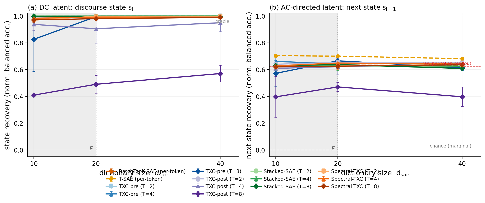
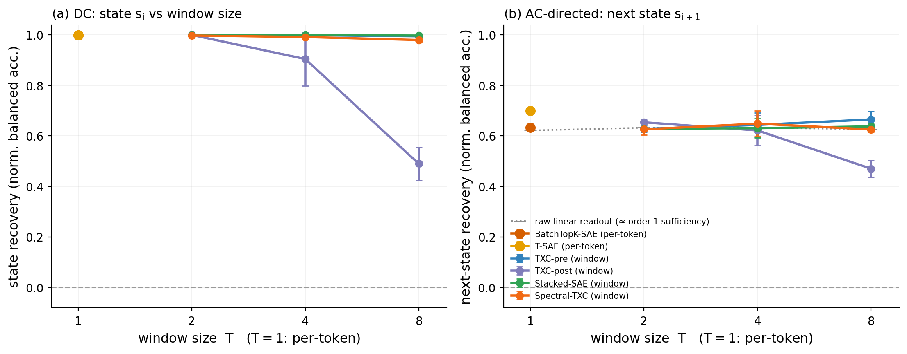
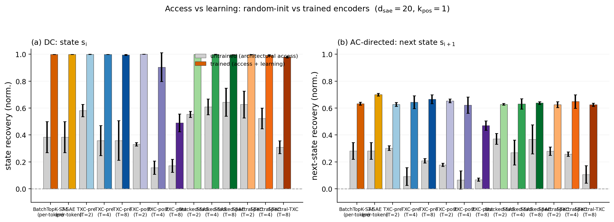
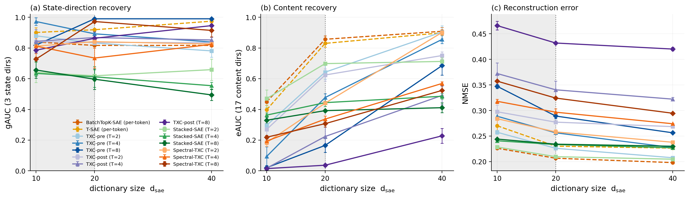

# Research record — assumption→consequence synthetic benchmark (architecture test)

**Benchmark:** directed-grammar 3-state discourse chain
(`toy_assumption_consequence_d64`), the AC / directed-transition dynamics
class — **the first benchmark discovered by the grounded-expansion loop to
face the architectures** (measure→mirror→**bench** closed).
**Spec:** [`bench_spec.md`](bench_spec.md) (frozen expansion C1; g7 amendment
2026-07-14; canonical mirror
[`mirror_params_g7.json`](mirror_params_g7.json)). **Gating:**
[`gating.py`](gating.py) →
[`results/assumption_gating_stats.json`](results/assumption_gating_stats.json)
(PASS). **Grid:** [`run_grid.py`](run_grid.py), the uniform fair-backbone
design through the canonical runner. **This record + figures are
auto-generated** from the canonical leaderboard by
[`render_figs.py`](render_figs.py) — re-run it to rebuild every number, table,
and figure; nothing is hand-typed.

**The design in one line:** the mirror of a *measured* property of real
R1-Distill reasoning traces (assume-before-derive; strict-labeler directed
asymmetry 0.297 ≫ nulls) — a 3-state {N, A, C} Markov chain whose directed
A→C edge is the latent under test: the DC probe reads the *current* discourse
state, the AC probe asks whether the code supports *next-state* prediction
above the marginal (the direction of the grammar).

## Headline

<!-- BEGIN AUTO:headline -->
- **The frozen § 5 prediction FAILS, informatively — per-token is NOT blind to the directed dependency:** per-token next-state recovery is **0.67** (normalized; d_sae=20, k_pos=1) vs the raw-readout line 0.62 — the order-1 mirror makes $s_i$ sufficient (gating), so any state-revealing code supports the one-step conditional. The best window cell (TXC-pre T=8) reaches **0.67**: no window family beats per-token beyond noise anywhere on the frontier.
- **DC state:** per-token **1.00** at d_sae=20; window families pay the usual shared-code price (min 0.49 at d=20 across (family, T)).
- **Access vs learning:** untrained per-token already reads 0.28 of the directed latent (the dominant state direction passes through a random encoder); training closes the rest.
- **Substrate:** the g7 strict-labeler Markov mirror (fwd P(C|A) = 0.359, directed asym 0.159), F=20 dirs, fair-backbone uniform grid, seeds {1,2,42}.
<!-- END AUTO:headline -->

## 1. Setup

- **Substrate** (spec § 2 + the g7 amendment): Layer 1 = the canonical g7
  Markov mirror — `P[A→C] = 0.363` vs unconditional C rate 0.294, fit on 207
  strict-labeled (ctx=0) traces, held-out validated, gate-8 PASS. Layer 2 =
  the standard emission over `F = 20` orthonormal directions: 3 dominant
  state-signatures (mag 2.5 → `hidden_features`/gAUC) + 17 content (mag 1.0,
  `n_c = 3`, state-independent → `emission_features`/eAUC). `d_in = 64`,
  `seq_len = 64`, `n_seqs = 4096`, `σ = 0`.
- **Latents + ceilings** (gating, committed):
  | latent | type | chance | oracle | per-token readout | raw window readout |
  |---|---|---|---|---|---|
  | state `s_i` | DC | 1/3 (balanced) | 1.0 | **1.000** (noiseless probe) | 0.999 |
  | next state `s_{i+1}` | AC-directed | 1/3 (balanced) | 0.544 (Bayes-balanced of the one-step conditional) | **0.464** | 0.466–0.467 (T=2/4/8) |
- **The structural fact recorded BEFORE the grid** (gating): the mirror is
  order-1, so `s_i` is a *sufficient statistic* for `s_{i+1}` — per-token and
  raw-linear window readouts are identical (0.464 vs 0.466 balacc). Unlike
  backtracking (DPI floor) or changepoint (equality-pattern blindness), this
  substrate has **no information-theoretic per-token/window separation**; the
  grid adjudicates what *trained scarce codes* expose linearly at the tile's
  leading edge. (The gap between the 0.466 readout and the 0.544 oracle is
  the class-unweighted logistic probe convention, uniform across archs.)
- **Archs:** the BatchTopK fair-backbone family — `batchtopk_sae`, `tsae`
  (per-token), `stacked_batchtopk`, `txc_batchtopk_pre`, `txc_batchtopk_post`,
  `spectral_txc` (windows, `T ∈ {2,4,8}`); equal tokens/step
  (`batch = 1024/T`), equal `B·T = 1024` BatchTopK pool, eval window `L = 32`,
  seeds {1, 2, 42}.
- **Grid:** the locked uniform design — `d_sae ∈ {10, 20, 40}` anchored on
  `F = 20`, `k_pos ∈ {1,2,4,8,16}` (dict-feasible), untrained control per
  `(arch, T)`; 495 cells through the canonical runner.
- **Metrics** (per-tile leading-edge linear probes, memorization-free,
  sequence-split): `state_recovery` (multinomial, normalized to [1/3, 1]),
  `nextstate_recovery` (multinomial → `s_{i+1}`, normalized to [1/3, the
  sample-matched Bayes-balanced oracle]), + `gauc` (state dirs), `eauc`
  (content dirs), `nmse` — direction sets never pooled.

## 2. DC half — state recovery vs capacity

<!-- BEGIN AUTO:state_frontier -->
| arch / T | d=10 | d=20 | d=40 |
|---|---|---|---|
| BatchTopK-SAE (per-token) | 0.999 | 0.999 | 1.000 |
| T-SAE (per-token) | 0.998 | 1.000 | 0.999 |
| **TXC-pre (T=2)** | 1.000 | 1.000 | 0.999 |
| **TXC-pre (T=4)** | 0.998 | 0.999 | 0.998 |
| **TXC-pre (T=8)** | 0.826 | 0.995 | 0.991 |
| **TXC-post (T=2)** | 0.983 | 1.000 | 1.000 |
| **TXC-post (T=4)** | 0.937 | 0.905 | 0.950 |
| **TXC-post (T=8)** | 0.409 | 0.490 | 0.570 |
| **Stacked-SAE (T=2)** | 1.000 | 1.000 | 1.000 |
| **Stacked-SAE (T=4)** | 0.999 | 0.999 | 1.000 |
| **Stacked-SAE (T=8)** | 0.996 | 0.997 | 0.997 |
| **Spectral-TXC (T=2)** | 0.969 | 0.998 | 0.997 |
| **Spectral-TXC (T=4)** | 0.983 | 0.992 | 0.991 |
| **Spectral-TXC (T=8)** | 0.971 | 0.980 | 0.990 |
<!-- END AUTO:state_frontier -->

## 3. AC half — next-state (directed) recovery vs capacity

<!-- BEGIN AUTO:nextstate_frontier -->
| arch / T | d=10 | d=20 | d=40 |
|---|---|---|---|
| BatchTopK-SAE (per-token) | 0.623 | 0.633 | 0.631 |
| T-SAE (per-token) | 0.704 | 0.700 | 0.681 |
| **TXC-pre (T=2)** | 0.625 | 0.628 | 0.617 |
| **TXC-pre (T=4)** | 0.661 | 0.644 | 0.648 |
| **TXC-pre (T=8)** | 0.571 | 0.665 | 0.613 |
| **TXC-post (T=2)** | 0.639 | 0.654 | 0.653 |
| **TXC-post (T=4)** | 0.609 | 0.621 | 0.642 |
| **TXC-post (T=8)** | 0.396 | 0.470 | 0.397 |
| **Stacked-SAE (T=2)** | 0.630 | 0.628 | 0.623 |
| **Stacked-SAE (T=4)** | 0.620 | 0.631 | 0.626 |
| **Stacked-SAE (T=8)** | 0.630 | 0.638 | 0.608 |
| **Spectral-TXC (T=2)** | 0.620 | 0.626 | 0.639 |
| **Spectral-TXC (T=4)** | 0.628 | 0.649 | 0.641 |
| **Spectral-TXC (T=8)** | 0.620 | 0.625 | 0.636 |
<!-- END AUTO:nextstate_frontier -->

## 4. Untrained-encoder control (access vs learning)

<!-- BEGIN AUTO:untrained -->
| arch / T | state untrained | state trained | next untrained | next trained |
|---|---|---|---|---|
| BatchTopK-SAE (per-token) | 0.384 ±0.115 | 0.999 ±0.000 | 0.281 ±0.062 | 0.633 ±0.011 |
| T-SAE (per-token) | 0.384 ±0.115 | 1.000 ±0.000 | 0.281 ±0.062 | 0.700 ±0.010 |
| TXC-pre (T=2) | 0.581 ±0.046 | 1.000 ±0.000 | 0.303 ±0.018 | 0.628 ±0.015 |
| TXC-pre (T=4) | 0.358 ±0.112 | 0.999 ±0.000 | 0.091 ±0.066 | 0.644 ±0.047 |
| TXC-pre (T=8) | 0.359 ±0.148 | 0.995 ±0.004 | 0.208 ±0.017 | 0.665 ±0.033 |
| TXC-post (T=2) | 0.331 ±0.013 | 1.000 ±0.000 | 0.178 ±0.012 | 0.654 ±0.013 |
| TXC-post (T=4) | 0.157 ±0.049 | 0.905 ±0.106 | 0.066 ±0.068 | 0.621 ±0.060 |
| TXC-post (T=8) | 0.171 ±0.048 | 0.490 ±0.066 | 0.068 ±0.012 | 0.470 ±0.034 |
| Stacked-SAE (T=2) | 0.554 ±0.023 | 1.000 ±0.000 | 0.370 ±0.040 | 0.628 ±0.007 |
| Stacked-SAE (T=4) | 0.609 ±0.058 | 0.999 ±0.001 | 0.270 ±0.092 | 0.631 ±0.038 |
| Stacked-SAE (T=8) | 0.644 ±0.104 | 0.997 ±0.000 | 0.367 ±0.108 | 0.638 ±0.009 |
| Spectral-TXC (T=2) | 0.627 ±0.100 | 0.998 ±0.001 | 0.280 ±0.030 | 0.626 ±0.022 |
| Spectral-TXC (T=4) | 0.524 ±0.077 | 0.992 ±0.005 | 0.258 ±0.016 | 0.649 ±0.050 |
| Spectral-TXC (T=8) | 0.308 ±0.047 | 0.980 ±0.007 | 0.106 ±0.065 | 0.625 ±0.012 |
<!-- END AUTO:untrained -->

## 5. Sparsity robustness (k_pos)

<!-- BEGIN AUTO:kpos -->
| arch / T | state @ $k_{pos}{=}1$ | state @ $k_{pos}{=}2$ | next @ $k_{pos}{=}1$ | next @ $k_{pos}{=}2$ |
|---|---|---|---|---|
| BatchTopK-SAE (per-token) | 0.999 | 0.999 | 0.633 | 0.625 |
| T-SAE (per-token) | 1.000 | 0.999 | 0.700 | 0.702 |
| TXC-pre (T=2) | 1.000 | 0.992 | 0.628 | 0.628 |
| TXC-pre (T=4) | 0.999 | 0.999 | 0.644 | 0.636 |
| TXC-pre (T=8) | 0.995 | 0.997 | 0.665 | 0.652 |
| TXC-post (T=2) | 1.000 | 0.999 | 0.654 | 0.676 |
| TXC-post (T=4) | 0.905 | 0.997 | 0.621 | 0.642 |
| TXC-post (T=8) | 0.490 | 0.827 | 0.470 | 0.612 |
| Stacked-SAE (T=2) | 1.000 | 1.000 | 0.628 | 0.628 |
| Stacked-SAE (T=4) | 0.999 | 0.998 | 0.631 | 0.626 |
| Stacked-SAE (T=8) | 0.997 | 0.988 | 0.638 | 0.582 |
| Spectral-TXC (T=2) | 0.998 | 0.999 | 0.626 | 0.639 |
| Spectral-TXC (T=4) | 0.992 | 0.996 | 0.649 | 0.644 |
| Spectral-TXC (T=8) | 0.980 | 0.993 | 0.625 | 0.635 |
<!-- END AUTO:kpos -->

## 6. Capability gate — feature recovery + reconstruction

<!-- BEGIN AUTO:feature_recovery -->
| arch / T | gAUC (state dirs) | eAUC (content dirs) | NMSE |
|---|---|---|---|
| BatchTopK-SAE (per-token) | 0.817 | 0.857 | 0.207 |
| T-SAE (per-token) | 0.919 | 0.830 | 0.230 |
| TXC-pre (T=2) | 0.832 | 0.643 | 0.226 |
| TXC-pre (T=4) | 0.892 | 0.477 | 0.256 |
| TXC-pre (T=8) | 0.990 | 0.166 | 0.289 |
| TXC-post (T=2) | 0.837 | 0.624 | 0.277 |
| TXC-post (T=4) | 0.868 | 0.224 | 0.341 |
| TXC-post (T=8) | 0.863 | 0.037 | 0.432 |
| Stacked-SAE (T=2) | 0.619 | 0.698 | 0.210 |
| Stacked-SAE (T=4) | 0.612 | 0.444 | 0.233 |
| Stacked-SAE (T=8) | 0.597 | 0.392 | 0.234 |
| Spectral-TXC (T=2) | 0.841 | 0.441 | 0.258 |
| Spectral-TXC (T=4) | 0.734 | 0.337 | 0.297 |
| Spectral-TXC (T=8) | 0.972 | 0.307 | 0.324 |
<!-- END AUTO:feature_recovery -->

## 7. Frozen predictions vs actual (the blind check)

*(hand-written after the blind grid — nothing here was tuned for)*

| frozen prediction (spec § 5, before any run) | actual | verdict |
|---|---|---|
| per-token SAE captures the A/C connective features per token | state recovery 0.999–1.000 at every per-token cell; gAUC 0.82–0.92, eAUC 0.83–0.86 | **CONFIRMED** |
| per-token SAE is blind to the directed A→C dependency across sentences | per-token next-state recovery 0.63–0.70 (T-SAE 0.70 at d=10–20) — at/above the raw-readout line 0.62; untrained control 0.28 | **FAILED** |
| window families (TXC-pre/-post / Stacked / Spectral) expose the order-sensitivity | best window cell 0.67 (TXC-pre T=8, d=20) vs per-token 0.70 — no window family beats per-token anywhere on the frontier | **FAILED** (no separation existed to expose — see below) |
| additive (pre-squash) families weaker on the directed latent | TXC-pre is the *strongest* window family on next-state (0.64–0.67); TXC-post is the weak one (0.47 at T=8, k=1) | **FAILED** (inverted) |

**Verdict: NEGATIVE — the frozen predictions failed, and the failure is the
finding.** The § 5 card assumed the directed A→C dependency lives *across*
sentences, so only cross-position codes could carry it. But the fitted mirror
is order-1, and gating recorded the consequence before any training run:
`s_i` is a sufficient statistic for `s_{i+1}`, so per-token and window raw
readouts are *identical* (0.464 vs 0.466 balacc) — there was never an
information-theoretic per-token/window separation on this substrate. The grid
then confirmed the trained version of the same fact: every family that reads
the state reads the "directed" latent equally (0.62–0.70 normalized), and the
residual spread is family capability (TXC-post's known T=8 squash pathology),
not order-sensitivity. **Citable consequence:** an order-1 mirror of a
directed grammar cannot function as an AC arch-separator — the directed
asymmetry collapses into the current state. A future AC-directed benchmark
needs order-2+ structure (the real R1-Distill stream has it — spec § 6 carries
exactly this fidelity caveat), so the next-state conditional is *not* a
function of the per-token readout. Nothing was retuned post-hoc; the § 8
gating facts and this grid are the entire evidence base.
