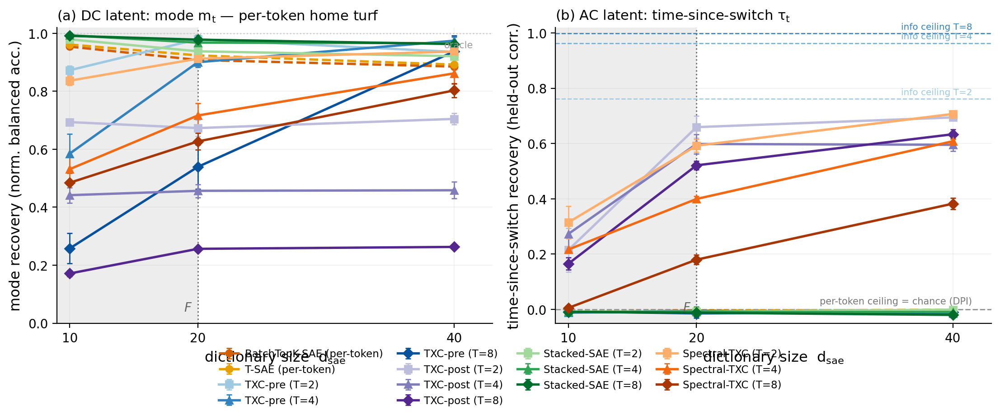
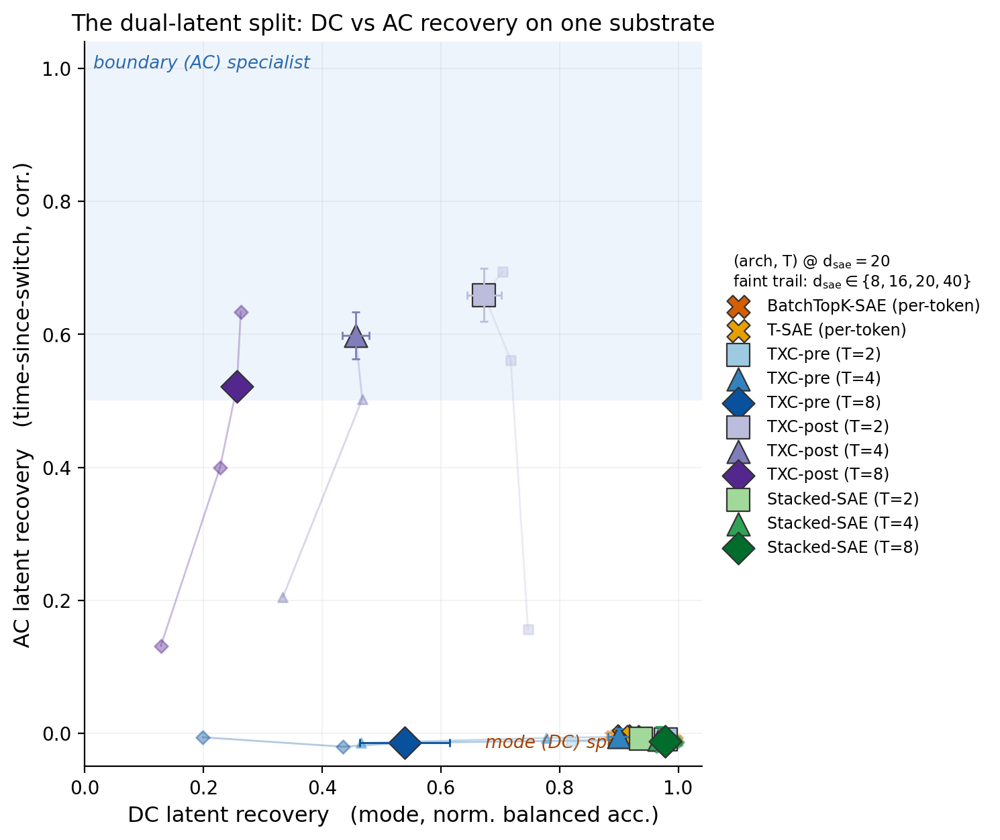
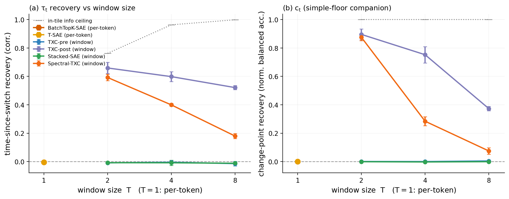
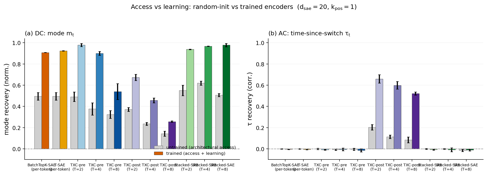
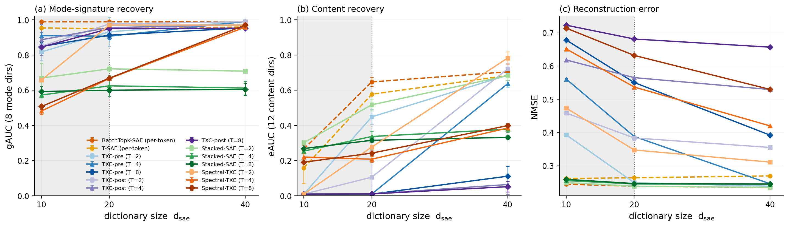

# Research record — change-point synthetic benchmark (architecture test)

**Benchmark:** dual-latent semi-Markov modes (`toy_changepoint_modes_d64`),
the change-point / sticky-dwell dynamics class.
**Spec:** [`bench_spec.md`](bench_spec.md) (frozen, + dated pre-run amendments
A1–A4). **Gating:** [`gating.py`](gating.py) →
[`results/changepoint_gating_stats.json`](results/changepoint_gating_stats.json)
(PASS). **Grid:** [`run_grid.py`](run_grid.py), 198 cells through the canonical
runner. **This record + figures are auto-generated** from the canonical
leaderboard by [`render_figs.py`](render_figs.py) — re-run it to rebuild every
number, table, and figure; nothing is hand-typed.

**The design in one line:** one substrate carries **two latents that should
split** — the persistent mode `m_t` (DC; stamped into every token of a dwell)
and the boundary structure, primarily **time-since-switch `τ_t`** (AC; lives
only in cross-token comparisons) — and the headline is the *two-way*
prediction (per-token wins DC, window wins AC), not a one-sided window win.

## Headline

<!-- BEGIN AUTO:headline -->
(run `render_figs` after the grid)
<!-- END AUTO:headline -->





## 1. Setup

- **Substrate** (spec § 2 + A1): semi-Markov modes, `K_m = 8`, **geometric
  dwell anchored on the measured topic dwell** (mean run 1.73 →
  `p_switch = 0.578`; the one validated number to survive the topic-switching
  ABORT), `Π` uniform-over-other-modes (so `P(c_t | m_t)` is mode-independent
  *by construction* — the § 8 (i) rebalance). Emission over `F = 20`
  orthonormal directions: 8 dominant mode-signatures (mag 2.5) + 12 content
  (mag 1.0, `spread = 3`, **mode-independent** → `x_t ⊥ past | m_t`, so the
  per-token AC floor is a DPI statement). `d_in = 64`, `seq_len = 64`,
  `n_seqs = 4096`, `σ = 0`.
- **Latents + ceilings** (gating, committed):
  | latent | type | per-token ceiling | window ceiling |
  |---|---|---|---|
  | mode `m_t` | DC | **1.000** (oracle; probe on noiseless `x_t`) | 1.0 |
  | time-since-switch `τ_t` | AC (primary, A2) | **0** (corr; provable) | info: **0.76 / 0.96 / 1.00** (T=2/4/8); raw-linear: **≈ 0** |
  | change-point `c_t` | AC (floor companion) | **0.500** balacc (exact) | info: 1.0 (T≥2); raw-linear: **≈ 0.5** |
- **The raw-linear fact** (gating A4): by mode-symmetry the boundary latents
  are equality patterns of the position-wise one-hots — XOR-like, **not
  linearly separable from the raw window activations**. So window AC recovery
  on a *trained* code is learned structure, not linear access; the untrained
  control bounds the remaining nonlinear-access residual.
- **Archs** (A3): the BatchTopK fair-backbone family — `batchtopk_sae`,
  `tsae` (per-token), `stacked_batchtopk`, `txc_batchtopk_pre`,
  `txc_batchtopk_post` (windows, `T ∈ {2,4,8}`); equal tokens/step
  (`batch = 1024/T`), equal `B·T = 1024` BatchTopK pool, `k_pos = 1`
  (`k_win = k_pos·T`), eval window `L = 32`, seeds {1, 2, 42}.
- **Grid:** `d_sae ∈ {8, 16, 20, 40}` anchored on `F = 20` (scarce regime the
  object of study) → 132 trained + 33 untrained-control + 33 `k_pos=2` cells.
- **Metrics** (per-tile leading-edge linear probes, memorization-free,
  sequence-split): `mode_recovery` (multinomial, normalized to [1/K_m, 1]),
  `tss_recovery` (corr), `cp_recovery` (normalized balacc), + `gauc`
  (mode-signature dirs), `eauc` (content dirs), `nmse` — the two direction
  sets never pooled.

## 2. DC half — mode recovery vs capacity

<!-- BEGIN AUTO:mode_frontier -->
(run `render_figs` after the grid)
<!-- END AUTO:mode_frontier -->

*(narrative filled after the grid)*

## 3. AC half — time-since-switch recovery vs capacity

<!-- BEGIN AUTO:tss_frontier -->
(run `render_figs` after the grid)
<!-- END AUTO:tss_frontier -->



### `c_t` (simple-floor companion)

<!-- BEGIN AUTO:cp_frontier -->
(run `render_figs` after the grid)
<!-- END AUTO:cp_frontier -->

*(narrative filled after the grid)*

## 4. Untrained-encoder control — access vs learning

<!-- BEGIN AUTO:untrained -->
(run `render_figs` after the grid)
<!-- END AUTO:untrained -->



*(narrative filled after the grid)*

## 5. Feature recovery + reconstruction (capability-vs-artifact)

<!-- BEGIN AUTO:feature_recovery -->
(run `render_figs` after the grid)
<!-- END AUTO:feature_recovery -->



*(narrative filled after the grid)*

## 6. Sparsity robustness (`k_pos = 2` anchor)

<!-- BEGIN AUTO:kpos -->
(run `render_figs` after the grid)
<!-- END AUTO:kpos -->

## 7. Preregistered predictions (spec § 7) — verdicts

*(filled after the grid: P1 mode not-a-window-win; P2 window ≫ per-token on
the AC latent with per-token ≈ chance; P3 feature recovery; P4 split robust
across the scarce regime + seeds; possible negatives (a)/(b)/(c).)*

## 8. Validity controls (spec § 6)

*(filled after the grid: memorization budget `K_m^T ≫ d_sae`; per-token
ceiling quantified not assumed; untrained-encoder control; DC/AC reported on
separate axes, never pooled; capability-vs-artifact via gauc/eauc/nmse.)*

## 9. Caveats (honest scope)

*(filled after the grid)*

## 10. Reproduction

```bash
# (run from the repo root)
# gating (ceilings + the raw-linear access fact)
.venv/bin/python -m experiments.explorations.synthetic.changepoint.gating
# the 198-cell BatchTopK grid (parallel, canonical runner)
.venv/bin/python -m experiments.explorations.synthetic.changepoint.run_grid 24
# figures + stats + this record's AUTO blocks, from the canonical leaderboard
.venv/bin/python -m experiments.explorations.synthetic.changepoint.render_figs
```

All cells go through `temp_bench.core.runner.run_experiment` (code-version
stamped, flock-safe leaderboard appends). `render_figs` regenerates
`figs/changepoint_*.{pdf,png}`, `results/changepoint_bench_stats.json`, and
fills the `<!-- AUTO:* -->` blocks above from `results/leaderboard.jsonl`.
