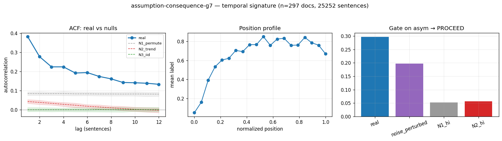

# Calibration record — `assumption-consequence-g7`

**Verdict: PROCEED**

Calibration per the frozen [prereg card](../../prereg/assumption-then-consequence.md); domain `reasoning-trace`, 297 documents / 25252 labeled sentences (doc coverage 0.990).

## 1. Labeler + noise floor

- **Bulk judge:** `claude-haiku-4-5-20251001` (frozen instruction in the card); **second judge:** `claude-sonnet-5` on 12 held-out docs (1040 sentences).
- **Inter-judge:** agreement 0.739, κ = 0.533 → noise floor ε̂ = 0.140 (adequacy floor κ ≥ 0.3: PASS).
- **Independent heuristic cross-check:** accuracy 0.57, κ 0.25 (class 1: F1 0.30, class 2: F1 0.50).

## 2. Temporal signature vs nulls

| statistic | real | N1 permute | N2 trend | N3 iid |
|---|---|---|---|---|
| directed asymmetry (fwd−rev)/(fwd+rev) | **0.297 [0.252, 0.340]** | -0.001 | 0.008 | -0.002 |
| P(dst @ t+1 | src @ t) forward | **0.355 [0.320, 0.393]** | 0.302 | 0.317 | 0.294 |
| same, time-reversed | **0.192 [0.166, 0.217]** | 0.303 | 0.312 | 0.295 |
| self-match ACF(1) | **0.382 [0.367, 0.399]** | 0.084 | 0.043 | -0.001 |
| dwell mean | **3.157 [3.045, 3.263]** | 2.156 | 2.064 | 1.977 |
| dwell CV | **1.448 [1.390, 1.518]** | 1.096 | 0.983 | 0.862 |

Marginal ['0.640', '0.066', '0.294']; Markov order-1 vs 0 p = 0.00e+00.

## 3. Gate (preregistered) + verdict

Primary statistic `asym` (expected sign +): real **0.2972**, after ε̂-noise perturbation **0.1967**; N1 97.5% band hi 0.0519, N2 hi 0.0562.

- clears sampling noise (real > N1 hi AND N2 hi): **True**
- survives labeler noise floor (perturbed likewise): **True**
- labeler adequate (κ ≥ 0.3): **True**
- split-half stability: 0.2772 / 0.3146

**→ PROCEED**

## 4. Mirror (Appendix B) + held-out validation

Process `markov`; fit on 207 train docs, validated on 90 held-out docs. Fitted params:

```json
{
 "process": "markov",
 "n_symbols": 3,
 "P": [
  [
   0.7912243453644727,
   0.058386411889596604,
   0.15038924274593066
  ],
  [
   0.38893617021276594,
   0.24765957446808512,
   0.36340425531914894
  ],
  [
   0.3607421875,
   0.0455078125,
   0.59375
  ]
 ],
 "pi": [
  0.6434792380738327,
  0.06635949879193122,
  0.2901612631342361
 ]
}
```

| statistic | real (held-out) | synthetic |
|---|---|---|
| acf(1) | 0.359 | 0.401 |
| mi(1) | 0.092 | 0.114 |
| dwell_mean | 3.013 | 3.216 |
| dwell_cv | 1.408 | 0.964 |
| asym (directed) | 0.295 | 0.289 |

Abs errors: acf_lag1_5 0.130, mi_lag1_5 0.029, dwell_mean 0.203, dwell_cv 0.444.

**Gate 8 (preregistered non-fitted moment)** — `acf[lag1]`: held-out real 0.3589 vs synthetic 0.4013, |err| 0.0425 vs tolerance ±0.05 → **PASS**.

## 5. Adversarial skeptic pass (fixed kill-rubric, Opus)

| item | kill | evidence |
|---|---|---|
| a_noise_floor | clear | real asym=0.297 vs noise_perturbed=0.197 (both well above N1_hi=0.052); noise-floor eps=0.14 and the perturbed statistic still clears the null band, so label noise alone cannot produce the gap. |
| b_leakage | clear | Cycle-2 re-exam explicitly addressed the relational-clause leakage: strictly per-sentence instruction with ctx=0 was applied, and asym survived (0.297, half1=0.277/half2=0.315), which was the preregistered upgrade condition SPEC*->SPEC. |
| c_composition | clear | This is a directed asymmetry (fwd 0.334 vs rev 0.182); N1 within-doc permutation equalizes direction and gives mean~-0.001 (band [-0.047,0.052]), so the effect is within-doc order not per-doc marginal composition. |
| d_circularity | clear | Mirror was fit on the forward transition matrix; gate8 validated on acf[lag1] (abs_err=0.042<0.05), a different moment than the fitted asym. Note the directed asym itself is nearly reproduced by the Markov mirror (syn 0.289 vs real 0.295), so a directed spec would be partly matched-by-construction, but acf/mi decay differences (acf_lag1_5 err=0.130, real acf persists ~0.10 at lag12 vs synth ~-0.01) show the spec tests longer-range structure the Markov mirror misses. |
| e_segmentation | clear | Data pre-segmented; the statistic is directional forward-vs-reversed asymmetry, which a symmetric splitter cannot create by construction (a splitter-induced alternation would be direction-symmetric and vanish under time-reversal, but rev_rate=0.182 != fwd_rate=0.334). |

_Survives all five kill criteria. Directed asymmetry clears sampling + noise floor, is within-doc (N1), and survived the ctx=0 no-leakage re-labeling that was the key concern. Kappa=0.53 is modest and heuristic cross-check is weak (kappa=0.25), but the noise-perturbed statistic still clears nulls. Weakest point is d: Markov mirror nearly reproduces the directed asym, but acf/mi decay mismatch keeps the spec non-vacuous. Do not kill._



## Reproduction

```bash
.venv/bin/python -m experiments.explorations.synthetic.expansion.calibrate assumption-consequence-g7
.venv/bin/python -m experiments.explorations.synthetic.expansion.render_records
```
Deterministic given the cached labels (`labels.json`); judge models pinned in the card; spend after this candidate: $14.06.
