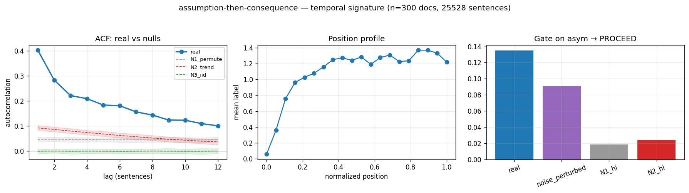

# Calibration record — `assumption-then-consequence`

**Verdict: PROCEED**

Cycle-1 calibration per the frozen [prereg card](../../prereg/assumption-then-consequence.md); domain `reasoning-trace`, 300 documents / 25528 labeled sentences (doc coverage 1.000).

## 1. Labeler + noise floor

- **Bulk judge:** `claude-haiku-4-5-20251001` (frozen instruction in the card); **second judge:** `claude-sonnet-5` on 12 held-out docs (1033 sentences).
- **Inter-judge:** agreement 0.698, κ = 0.517 → noise floor ε̂ = 0.165 (adequacy floor κ ≥ 0.3: PASS).
- **Independent heuristic cross-check:** accuracy 0.50, κ 0.21 (class 1: F1 0.33, class 2: F1 0.55).

## 2. Temporal signature vs nulls

| statistic | real | N1 permute | N2 trend | N3 iid |
|---|---|---|---|---|
| directed asymmetry (fwd−rev)/(fwd+rev) | **0.135 [0.116, 0.158]** | 0.000 | 0.009 | 0.001 |
| P(dst @ t+1 | src @ t) forward | **0.463 [0.443, 0.489]** | 0.475 | 0.510 | 0.476 |
| same, time-reversed | **0.353 [0.332, 0.373]** | 0.475 | 0.502 | 0.476 |
| self-match ACF(1) | **0.403 [0.387, 0.421]** | 0.046 | 0.093 | -0.000 |
| dwell mean | **2.703 [2.633, 2.792]** | 1.712 | 1.798 | 1.634 |
| dwell CV | **1.174 [1.120, 1.235]** | 0.737 | 0.835 | 0.665 |

Marginal ['0.383', '0.141', '0.476']; Markov order-1 vs 0 p = 0.00e+00.

## 3. Gate (preregistered) + verdict

Primary statistic `asym`: real **0.1351**, after ε̂-noise perturbation **0.0907**; N1 97.5% band hi 0.0188, N2 hi 0.0237.

- clears sampling noise (real > N1 hi AND N2 hi): **True**
- survives labeler noise floor (perturbed > both): **True**
- labeler adequate (κ ≥ 0.3): **True**
- split-half stability: 0.1095 / 0.1600

**→ PROCEED**

## 4. Mirror (Appendix B) + held-out validation

Process `markov`; fit on 210 train docs, validated on 90 held-out docs. Fitted params:

```json
{
 "process": "markov",
 "n_symbols": 3,
 "P": [
  [
   0.6689278867423684,
   0.1184191122253355,
   0.21265300103229612
  ],
  [
   0.2066182405165456,
   0.3171912832929782,
   0.47619047619047616
  ],
  [
   0.18928487137125324,
   0.10762331838565023,
   0.7030918102430965
  ]
 ],
 "pi": [
  0.38245790119326417,
  0.13928850228616035,
  0.4782535965205754
 ]
}
```

| statistic | real (held-out) | synthetic |
|---|---|---|
| acf(1) | 0.411 | 0.397 |
| mi(1) | 0.148 | 0.139 |
| dwell_mean | 2.725 | 2.670 |
| dwell_cv | 1.086 | 0.889 |
| asym (directed) | 0.141 | 0.129 |

Abs errors: acf_lag1_5 0.132, mi_lag1_5 0.039, dwell_mean 0.055, dwell_cv 0.197.

## 5. Adversarial skeptic pass (fixed kill-rubric, Opus)

| item | kill | evidence |
|---|---|---|
| a_noise_floor | clear | real asym 0.135 exceeds N1_hi 0.0188 and N2_hi 0.0237 by ~7x; noise_perturbed 0.0907 (flips at eps=0.165) still clears both null bands, so label noise alone cannot produce the gap. |
| b_leakage | clear | labels are per-sentence lexical/semantic (A vs C vs neither) with no built-in ordering requirement; consequence label ('follows from prior') is defined by content markers, not by presence of a preceding assumption — the directional asymmetry is measured, not definitional. Borderline: 'follows from prior' hints at temporal dependence, but marginal counts are reversal-invariant so it's not circular by construction. |
| c_composition | clear | N1 within-doc permutation band (hi=0.0188) is easily beaten by real 0.135; N1 destroys within-doc order while preserving per-doc composition, so the effect is genuine directed adjacency, not marginal/per-doc composition. N3 (product-of-marginals) also near zero. |
| d_circularity | clear | mirror is a full 3x3 Markov transition matrix; validation reports ACF/MI/dwell which were NOT directly fit as targets, and the directed asym is reproduced (0.129 vs real 0.141) plus decaying ACF (acf_lag1 0.397 vs 0.411). The spec tests directed A->C dependence beyond the raw transition matrix insertion — not vacuous, though the asym match is partly by construction of a Markov chain. |
| e_segmentation | clear | traces are pre-segmented (25528 sentences, mean 85/trace); alternation is not forced by the splitter — dwell_mean 2.72 with cv 1.09 shows multi-sentence runs, not artificial A/C alternation. No evidence the segmenter constructs the directionality. |

_Property survives all five kill criteria. Signal is large (7x null bands) and robust to noise-floor flips. Only soft concerns: kappa 0.517 is moderate and heuristic crosscheck is weak (kappa 0.21, acc 0.50), so the labeler is noisy; half-split stability (0.109 vs 0.160) shows ~50% variation across halves — worth flagging but does not cross any kill threshold. PROCEED stands._



## Reproduction

```bash
.venv/bin/python -m experiments.explorations.synthetic.expansion.calibrate assumption-then-consequence
.venv/bin/python -m experiments.explorations.synthetic.expansion.render_records
```
Deterministic given the cached labels (`labels.json`); judge models pinned in the card; spend after this candidate: $7.96.
