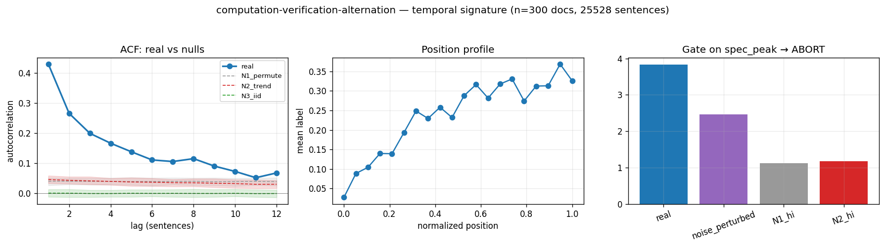

# Calibration record — `computation-verification-alternation`

**Verdict: ABORT** (numeric gate passed; **mirror failed its preregistered gate-8 moment** — see § 4)

Calibration per the frozen [prereg card](../../prereg/computation-verification-alternation.md); domain `reasoning-trace`, 300 documents / 25528 labeled sentences (doc coverage 1.000).

## 1. Labeler + noise floor

- **Bulk judge:** `claude-haiku-4-5-20251001` (frozen instruction in the card); **second judge:** `claude-sonnet-5` on 12 held-out docs (1033 sentences).
- **Inter-judge:** agreement 0.846, κ = 0.554 → noise floor ε̂ = 0.084 (adequacy floor κ ≥ 0.3: PASS).
- **Independent heuristic cross-check:** P 0.42 / R 0.05 / F1 0.09 (judge rate 0.238, heuristic 0.027).

## 2. Temporal signature vs nulls

| statistic | real | N1 permute | N2 trend | N3 iid |
|---|---|---|---|---|
| ACF(1) | **0.430 [0.409, 0.451]** | 0.040 | 0.046 | 0.001 |
| MI(1) (nats) | **0.083 [0.075, 0.092]** | 0.001 | 0.001 | 0.000 |
| Fano | **2.384 [2.257, 2.527]** | 1.030 | 1.073 | 0.762 |
| excite ratio P(1|1)/base | **2.392 [2.305, 2.483]** | 1.130 | 1.158 | 1.002 |
| inter-event gap CV | **1.471 [1.415, 1.528]** | 0.989 | 0.916 | 0.867 |
| spectral peak prominence | **3.836 [3.365, 4.284]** | 1.077 | 1.100 | 1.073 |

Base rate 0.2379; Markov order-1 vs 0 p = 0.00e+00.

## 3. Gate (preregistered) + verdict

Primary statistic `spec_peak` (expected sign +): real **3.8357**, after ε̂-noise perturbation **2.4609**; N1 97.5% band hi 1.1232, N2 hi 1.1807.

- clears sampling noise (real > N1 hi AND N2 hi): **True**
- survives labeler noise floor (perturbed likewise): **True**
- labeler adequate (κ ≥ 0.3): **True**
- split-half stability: 3.7088 / 3.9539

**→ ABORT**

## 4. Mirror (Appendix B) + held-out validation

Process `periodic_rate`; fit on 210 train docs, validated on 90 held-out docs. Fitted params:

```json
{
 "process": "periodic_rate",
 "period": 50,
 "a": 0.238158585436301,
 "b_cos": -0.00415648106787532,
 "b_sin": -0.04085999358844118
}
```

| statistic | real (held-out) | synthetic |
|---|---|---|
| acf(1) | 0.423 | 0.005 |
| mi(1) | 0.083 | 0.000 |
| fano | 2.294 | 0.870 |
| p11 | 0.574 | 0.241 |
| excite_ratio | 2.250 | 1.014 |
| gap_cv | 1.381 | 0.899 |
| spec_peak | 3.558 | 1.137 |

Abs errors: acf_lag1_5 0.218, mi_lag1_5 0.029, fano 1.423, p11 0.333, excite_ratio 1.236, gap_cv 0.483, spec_peak 2.421.

**Gate 8 (preregistered non-fitted moment)** — `fano`: held-out real 2.2936 vs synthetic 0.8705, |err| 1.4231 vs tolerance ±0.3000 → **FAIL — mirror invalid ⇒ ABORT**.



## Reproduction

```bash
.venv/bin/python -m experiments.explorations.synthetic.expansion.calibrate computation-verification-alternation
.venv/bin/python -m experiments.explorations.synthetic.expansion.render_records
```
Deterministic given the cached labels (`labels.json`); judge models pinned in the card; spend after this candidate: $5.48.
