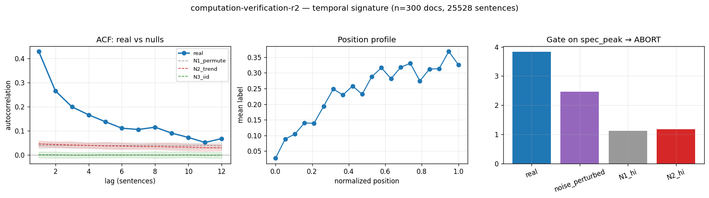

# Calibration record — `computation-verification-r2`

**Verdict: ABORT** (pre-skeptic PROCEED, killed by skeptic on ['d_circularity'])

Calibration per the frozen [prereg card](../../prereg/computation-verification-alternation.md); domain `reasoning-trace`, 300 documents / 25528 labeled sentences (doc coverage 1.000).

## 1. Labeler + noise floor

- **Bulk judge:** `claude-haiku-4-5-20251001` (frozen instruction in the card); **second judge:** `claude-sonnet-5` on 12 held-out docs (1033 sentences).
- **Inter-judge:** agreement 0.846, κ = 0.554 → noise floor ε̂ = 0.084 (adequacy floor κ ≥ 0.3: PASS).
- **Independent heuristic cross-check:** P 0.42 / R 0.05 / F1 0.09 (judge rate 0.238, heuristic 0.027).

## 2. Temporal signature vs nulls

| statistic | real | N1 permute | N2 trend | N3 iid |
|---|---|---|---|---|
| ACF(1) | **0.430 [0.409, 0.451]** | 0.040 | 0.046 | 0.001 |
| MI(1) (nats) | **0.083 [0.075, 0.092]** | 0.001 | 0.001 | 0.000 |
| Fano | **2.384 [2.257, 2.527]** | 1.030 | 1.073 | 0.762 |
| excite ratio P(1|1)/base | **2.392 [2.305, 2.483]** | 1.130 | 1.158 | 1.002 |
| inter-event gap CV | **1.471 [1.415, 1.528]** | 0.989 | 0.916 | 0.867 |
| spectral peak prominence | **3.836 [3.365, 4.284]** | 1.077 | 1.100 | 1.073 |

Base rate 0.2379; Markov order-1 vs 0 p = 0.00e+00.

## 3. Gate (preregistered) + verdict

Primary statistic `spec_peak` (expected sign +): real **3.8357**, after ε̂-noise perturbation **2.4609**; N1 97.5% band hi 1.1232, N2 hi 1.1807.

- clears sampling noise (real > N1 hi AND N2 hi): **True**
- survives labeler noise floor (perturbed likewise): **True**
- labeler adequate (κ ≥ 0.3): **True**
- split-half stability: 3.7088 / 3.9539

**→ ABORT**

## 4. Mirror (Appendix B) + held-out validation

Process `periodic_hawkes`; fit on 210 train docs, validated on 90 held-out docs. Fitted params:

```json
{
 "process": "periodic_hawkes",
 "period": 49,
 "K": 8,
 "intercept": -2.0344122732621943,
 "b_cos": 0.03793727894955582,
 "b_sin": -0.06723405462587873,
 "kernel_w": [
  1.7820676619388995,
  0.39833625580988763,
  0.18195294086083105,
  0.19628957548815099,
  0.14517461495281692,
  0.013628448675595933,
  0.05482121695393903,
  0.29102999707574123
 ]
}
```

| statistic | real (held-out) | synthetic |
|---|---|---|
| acf(1) | 0.423 | 0.418 |
| mi(1) | 0.083 | 0.080 |
| fano | 2.294 | 2.192 |
| p11 | 0.574 | 0.564 |
| excite_ratio | 2.250 | 2.278 |
| gap_cv | 1.381 | 1.489 |
| spec_peak | 3.558 | 3.456 |

Abs errors: acf_lag1_5 0.007, mi_lag1_5 0.002, fano 0.102, p11 0.011, excite_ratio 0.027, gap_cv 0.107, spec_peak 0.102.

**Gate 8 (preregistered non-fitted moment)** — `fano`: held-out real 2.2936 vs synthetic 2.1920, |err| 0.1015 vs tolerance ±0.4587 (±20% rel of |real| (floor 0.05)) → **PASS**.

## 5. Adversarial skeptic pass (fixed kill-rubric, see LEDGER — judge model untracked pre-C5)

| item | kill | evidence |
|---|---|---|
| a_noise_floor | clear | spec_peak real=3.84, noise_perturbed=2.46 both far above N1/N2/N3 hi≤1.18; kappa=0.55>0.3 floor, eps=0.084 small; ordered gap survives label-flip perturbation. |
| b_leakage | clear | Label is per-sentence binary verify/check indicator; the periodic/spectral statistic is not built into the label definition, so no circular question->answer style leakage. |
| c_composition | clear | N1 within-doc permutation destroys within-trace order and yields flat spectrum (hi=1.12); real=3.84 exceeds N1, so the period is within-document order, not per-doc marginal composition. |
| d_circularity | **KILL** | The primary spec signal is spec_peak, yet the swapped periodic_hawkes mirror explicitly fits period+harmonic+excitation kernel; validation reproduces spec_peak (3.56 vs 3.46), acf, mi, excite_ratio all near-perfectly because those ARE the fitted moments. The only non-fitted gate is fano (2.29 vs 2.19), but that's largely a consequence of the fitted Hawkes self-excitation kernel (excite_ratio 2.25 matched). The spec tests essentially nothing beyond what was inserted — period+kernel in, period+kernel+its dispersion out. |
| e_segmentation | clear | Traces are pre-segmented at sentence level (25,528 sentences); period=49 sentences is far from any 2-cycle alternation a splitter would create, and N1 shuffle removes it — not a windowing/alternation artifact of the segmenter. |

_Signal is real and passes null/noise/composition gates cleanly. Kill risk is circularity(d): the Cycle-3 periodic_hawkes mirror was expanded precisely to fit period+harmonic+8-lag excitation, and the validation reproduces the fitted spec_peak/acf/excite_ratio nearly exactly; the single non-fitted moment (fano) is close to a mechanical consequence of the matched excitation kernel, leaving little the frozen benchmark would discriminate beyond what was inserted. Recommend KILL on circularity unless a genuinely independent held-out moment (gap distribution shape, cross-doc period stability) is added to the gate._



## Reproduction

```bash
.venv/bin/python -m experiments.explorations.synthetic.expansion.calibrate computation-verification-r2
.venv/bin/python -m experiments.explorations.synthetic.expansion.render_records
```
Deterministic given the cached labels (`labels.json`); judge models pinned in the card; spend after this candidate: $0.35.
