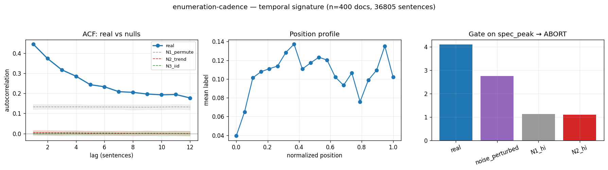

# Calibration record — `enumeration-cadence`

**Verdict: ABORT** (numeric gate passed; **mirror failed its preregistered gate-8 moment** — see § 4)

Calibration per the frozen [prereg card](../../prereg/enumeration-cadence.md); domain `text-corpus`, 400 documents / 36805 labeled sentences (doc coverage 1.000).

## 1. Labeler + noise floor

- **Bulk judge:** `claude-haiku-4-5-20251001` (frozen instruction in the card); **second judge:** `claude-sonnet-5` on 12 held-out docs (1227 sentences).
- **Inter-judge:** agreement 0.928, κ = 0.565 → noise floor ε̂ = 0.037 (adequacy floor κ ≥ 0.3: PASS).
- **Independent heuristic cross-check:** P 0.52 / R 0.04 / F1 0.08 (judge rate 0.105, heuristic 0.009).

## 2. Temporal signature vs nulls

| statistic | real | N1 permute | N2 trend | N3 iid |
|---|---|---|---|---|
| ACF(1) | **0.445 [0.397, 0.495]** | 0.133 | 0.005 | -0.001 |
| MI(1) (nats) | **0.064 [0.051, 0.081]** | 0.007 | 0.000 | 0.000 |
| Fano | **3.509 [3.185, 3.829]** | 1.961 | 0.932 | 0.893 |
| excite ratio P(1|1)/base | **4.825 [4.381, 5.267]** | 2.137 | 1.050 | 0.995 |
| inter-event gap CV | **1.785 [1.662, 1.928]** | 1.350 | 0.922 | 0.927 |
| spectral peak prominence | **4.101 [3.360, 5.024]** | 1.078 | 1.064 | 1.061 |

Base rate 0.1046; Markov order-1 vs 0 p = 0.00e+00.

## 3. Gate (preregistered) + verdict

Primary statistic `spec_peak` (expected sign +): real **4.1009**, after ε̂-noise perturbation **2.7455**; N1 97.5% band hi 1.1285, N2 hi 1.1035.

- clears sampling noise (real > N1 hi AND N2 hi): **True**
- survives labeler noise floor (perturbed likewise): **True**
- labeler adequate (κ ≥ 0.3): **True**
- split-half stability: 4.3241 / 4.0282

**→ ABORT**

## 4. Mirror (Appendix B) + held-out validation

Process `periodic_rate`; fit on 280 train docs, validated on 120 held-out docs. Fitted params:

```json
{
 "process": "periodic_rate",
 "period": 59,
 "a": 0.1016570876023761,
 "b_cos": -0.025598128988440407,
 "b_sin": -0.008718648402391293
}
```

| statistic | real (held-out) | synthetic |
|---|---|---|
| acf(1) | 0.453 | 0.024 |
| mi(1) | 0.070 | 0.000 |
| fano | 3.525 | 0.967 |
| p11 | 0.518 | 0.122 |
| excite_ratio | 4.476 | 1.212 |
| gap_cv | 1.569 | 0.955 |
| spec_peak | 3.759 | 1.136 |

Abs errors: acf_lag1_5 0.334, mi_lag1_5 0.042, fano 2.557, p11 0.396, excite_ratio 3.264, gap_cv 0.613, spec_peak 2.622.

**Gate 8 (preregistered non-fitted moment)** — `fano`: held-out real 3.5248 vs synthetic 0.9673, |err| 2.5574 vs tolerance ±0.7050 (±20% rel of |real| (floor 0.05)) → **FAIL — mirror invalid ⇒ ABORT**.



## Reproduction

```bash
.venv/bin/python -m experiments.explorations.synthetic.expansion.calibrate enumeration-cadence
.venv/bin/python -m experiments.explorations.synthetic.expansion.render_records
```
Deterministic given the cached labels (`labels.json`); judge models pinned in the card; spend after this candidate: $6.38.
