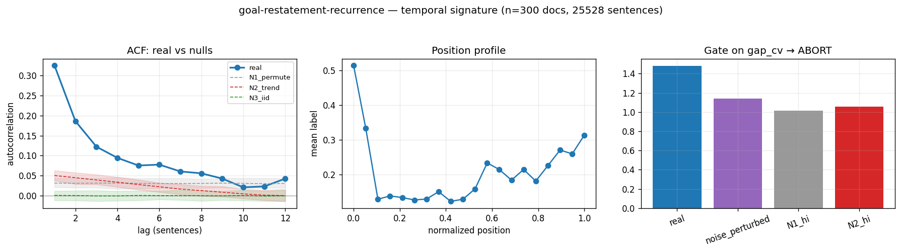

# Calibration record — `goal-restatement-recurrence`

**Verdict: ABORT** (pre-skeptic PROCEED, killed by skeptic on ['c_composition'])

Calibration per the frozen [prereg card](../../prereg/goal-restatement-recurrence.md); domain `reasoning-trace`, 300 documents / 25528 labeled sentences (doc coverage 1.000).

## 1. Labeler + noise floor

- **Bulk judge:** `claude-haiku-4-5-20251001` (frozen instruction in the card); **second judge:** `claude-sonnet-5` on 12 held-out docs (1033 sentences).
- **Inter-judge:** agreement 0.850, κ = 0.417 → noise floor ε̂ = 0.082 (adequacy floor κ ≥ 0.3: PASS).
- **Independent heuristic cross-check:** P 0.45 / R 0.06 / F1 0.11 (judge rate 0.209, heuristic 0.030).

## 2. Temporal signature vs nulls

| statistic | real | N1 permute | N2 trend | N3 iid |
|---|---|---|---|---|
| ACF(1) | **0.325 [0.303, 0.345]** | 0.031 | 0.050 | 0.001 |
| MI(1) (nats) | **0.046 [0.040, 0.052]** | 0.001 | 0.001 | 0.000 |
| Fano | **1.960 [1.848, 2.074]** | 1.012 | 1.110 | 0.791 |
| excite ratio P(1|1)/base | **2.183 [2.097, 2.274]** | 1.118 | 1.172 | 1.003 |
| inter-event gap CV | **1.481 [1.433, 1.528]** | 0.989 | 1.026 | 0.883 |
| spectral peak prominence | **2.927 [2.626, 3.214]** | 1.077 | 1.538 | 1.072 |

Base rate 0.2090; Markov order-1 vs 0 p = 0.00e+00.

## 3. Gate (preregistered) + verdict

Primary statistic `gap_cv` (expected sign +): real **1.4815**, after ε̂-noise perturbation **1.1415**; N1 97.5% band hi 1.0148, N2 hi 1.0554.

- clears sampling noise (real > N1 hi AND N2 hi): **True**
- survives labeler noise floor (perturbed likewise): **True**
- labeler adequate (κ ≥ 0.3): **True**
- split-half stability: 1.4667 / 1.4950

**→ ABORT**

## 4. Mirror (Appendix B) + held-out validation

Process `semi_markov`; fit on 210 train docs, validated on 90 held-out docs. Fitted params:

```json
{
 "process": "semi_markov",
 "n_symbols": 2,
 "jump_P": [
  [
   0.0,
   1.0
  ],
  [
   1.0,
   0.0
  ]
 ],
 "pi": [
  0.1380952380952381,
  0.861904761904762
 ],
 "dwell": [
  [
   2,
   2,
   2,
   1,
   13,
   6,
   3,
   2,
   1,
   1,
   3,
   2,
   5,
   2,
   1,
   1,
   1,
   1,
   3,
   1,
   2,
   4,
   2,
   8,
   42,
   2,
   5,
   4,
   4,
   3,
   2,
   3,
   3,
   4,
   5,
   14,
   33,
   21,
   1,
   2,
   16,
   33,
   22,
   3,
   2,
   5,
   7,
   33,
   17,
   8,
   1,
   7,
   2,
   1,
   6,
   9,
   1,
   6,
   5,
   8,
   1,
   8,
   3,
   1,
   2,
   1,
   15,
   3,
   6,
   10,
   7,
   12,
   24,
   1,
   4,
   21,
   3,
   1,
   12,
   13,
   2,
   5,
   6,
   10,
   2,
   10,
   22,
   7,
   5,
   5,
   3,
   19,
   22,
   7,
   7,
   9,
   2,
   10,
   1,
   7,
   8,
   2,
   1,
   1,
   1,
   2,
   3,
   4,
   3,
   1,
   1,
   2,
   1,
   2,
   2,
   1,
   1,
   1,
   15,
   1,
   1,
   4,
   5,
   9,
   9,
   20,
   15,
   6,
   1,
   11,
   1,
   11,
   21,
   1,
   3,
   8,
   1,
   2,
   1,
   2,
   1,
   1,
   5,
   1,
   7,
   7,
   7,
   6,
   3,
   2,
   8,
   11,
   3,
   1,
   20,
   7,
   4,
   4,
   3,
   13,
   1,
   1,
   3,
   7,
   3,
   6,
   3,
   2,
   1,
   5,
   2,
   1,
   26,
   25,
   3,
   15,
   1,
   1,
   12,
   1,
   5,
   35,
   2,
   5,
   5,
   13,
   8,
   1,
   1,
   1,
   2,
   8,
   3,
   22,
   1,
   1,
   7,
   10,
   10,
   1,
   27,
   11,
   25,
   5,
   3,
   1,
   1,
   1,
   2,
   9,
   1,
   1,
   2,
   21,
   16,
   1,
   4,
   5,
   2,
   2,
   4,
   12,
   10,
   1,
   11,
   2,
   2,
   1,
   1,
   2,
   4,
   10,
   1,
   86,
   4,
   10,
   14,
   8,
   12,
   5,
   2,
   7,
   2,
   2,
   1,
   8,
   5,
   3,
   1,
   1,
   1,
   6,
   11,
   21,
   2,
   2,
   1,
   10,
   1,
   1,
   5,
   5,
   9,
   1,
   6,
   1,
   17,
   5,
   2,
   12,
   11,
   2,
   1,
   2,
   1,
   1,
   1,
   2,
   3,
   4,
   3,
   1,
   1,
   2,
   1,
   2,
   2,
   1,
   1,
   1,
   15,
   1,
   1,
   11,
   9,
   7,
   9,
   5,
   1,
   1,
   2,
   1,
   1,
   1,
   2,
   3,
   4,
   3,
   1,
   1,
   2,
   1,
   2,
   2,
   1,
   1,
   15,
   1,
   1,
   5,
   10,
   7,
   3,
   5,
   3,
   8,
   6,
   5,
   4,
   4,
   13,
   2,
   3,
   8,
   1,
   6,
   1,
   5,
   3,
   1,
   1,
   1,
   1,
   1,
   1,
   1,
   8,
   4,
   1,
   21,
   1,
   15,
   9,
   2,
   1,
   12,
   3,
   23,
   6,
   11,
   5,
   6,
   4,
   5,
   6,
   1,
   2,
   10,
   1,
   32,
   9,
   3,
   2,
   9,
   18,
   1,
   1,
   3,
   2,
   6,
   1,
   3,
   11,
   5,
   1,
   2,
   21,
   1,
   11,
   18,
   1,
   1,
   5,
   14,
   3,
   2,
   4,
   14,
   2,
   2,
   6,
   14,
   3,
   2,
   9,
   18,
   5,
   2,
   10,
   2,
   3,
   12,
   5,
   5,
   19,
   4,
   7,
   1,
   20,
   14,
   6,
   1,
   2,
   1,
   4,
   12,
   7,
   13,
   4,
   4,
   20,
   15,
   4,
   5,
   17,
   10,
   13,
   13,
   2,
   21,
   9,
   1,
   4,
   13,
   11,
   13,
   1,
   2,
   3,
   1,
   6,
   3,
   1,
   2,
   18,
   9,
   7,
   8,
   2,
   5,
   5,
   2,
   10,
   15,
   2,
   1,
   1,
   1,
   2,
   3,
   4,
   3,
   1,
   1,
   2,
   1,
   2,
   2,
   1,
   2,
   5,
   4,
   1,
   1,
   4,
   25,
   20,
   1,
   5,
   2,
   3,
   6,
   3,
   2,
   3,
   1,
   15,
   4,
   4,
   2,
   2,
   6,
   4,
   11,
   1,
   1,
   2,
   3,
   12,
   1,
   4,
   3,
   1,
   10,
   2,
   6,
   7,
   14,
   7,
   5,
   5,
   1,
   2,
   41,
   10,
   17,
   11,
   1,
   2,
   2,
   37,
   3,
   2,
   42,
   7,
   12,
   8,
   1,
   2,
   12,
   1,
   9,
   1,
   4,
   9,
   18,
   15,
   13,
   5,
   4,
   3,
   5,
   14,
   42,
   6,
   2,
   6,
   16,
   13,
   8,
   2,
   5,
   4,
   7,
   1,
   3,
   1,
   4,
   1,
   6,
   2,
   10,
   1,
   11,
   4,
   15,
   7,
   2,
   17,
   4,
   4,
   1,
   12,
   5,
   1,
   5,
   15,
   14,
   7,
   4,
   2,
   1,
   1,
   1,
   2,
   5,
   16,
   1,
   4,
   3,
   12,
   2,
   1,
   9,
   4,
   5,
   7,
   2,
   3,
   11,
   12,
   5,
   2,
   6,
   1,
   1,
   3,
   2,
   3,
   20,
   6,
   1,
   2,
   1,
   4,
   1,
   14,
   11,
   11,
   24,
   8,
   11,
   13,
   12,
   2,
   3,
   3,
   4,
   17,
   13,
   3,
   29,
   3,
   12,
   9,
   1,
   2,
   1,
   1,
   1,
   2,
   3,
   4,
   3,
   1,
   1,
   2,
   1,
   2,
   2,
   1,
   1,
   1,
   15,
   1,
   1,
   11,
   9,
   9,
   20,
   1,
   1,
   3,
   2,
   2,
   5,
   13,
   3,
   46,
   3,
   4,
   4,
   4,
   1,
   5,
   3,
   7,
   1,
   4,
   4,
   5,
   5,
   5,
   5,
   1,
   7,
   4,
   2,
   1,
   1,
   2,
   1,
   1,
   4,
   5,
   11,
   11,
   2,
   2,
   2,
   12,
   10,
   5,
   1,
   2,
   4,
   37,
   10,
   2,
   2,
   4,
   12,
   6,
   4,
   4,
   2,
   8,
   11,
   25,
   2,
   18,
   4,
   4,
   37,
   10,
   2,
   2,
   4,
   12,
   6,
   4,
   2,
   11,
   15,
   10,
   21,
   3,
   2,
   2,
   2,
   1,
   3,
   19,
   1,
   2,
   10,
   4,
   2,
   3,
   3,
   2,
   2,
   1,
   11,
   5,
   5,
   14,
   1,
   5,
   1,
   2,
   1,
   2,
   2,
   11,
   15,
   10,
   21,
   3,
   2,
   2,
   2,
   1,
   3,
   19,
   1,
   2,
   10,
   4,
   2,
   3,
   2,
   1,
   66,
   10,
   14,
   6,
   10,
   2,
   10,
   22,
   7,
   5,
   5,
   2,
   1,
   1,
   1,
   2,
   3,
   4,
   3,
   1,
   1,
   2,
   1,
   2,
   2,
   1,
   1,
   1,
   15,
   1,
   1,
   11,
   9,
   7,
   2,
   2,
   13,
   2,
   20,
   25,
   1,
   22,
   1,
   5,
   4,
   37,
   10,
   2,
   2,
   4,
   12,
   6,
   4,
   5,
   15,
   37,
   5,
   3,
   9,
   2,
   1,
   26,
   7,
   17,
   3,
   15,
   4,
   12,
   1,
   5,
   15,
   36,
   8,
   9,
   17,
   10,
   13,
   13,
   2,
   21,
   1,
   3,
   5,
   1,
   21,
   3,
   10,
   5,
   3,
   3,
   5,
   1,
   1,
   3,
   8,
   4,
   2,
   8,
   11,
   22,
   3,
   16,
   17,
   10,
   13,
   13,
   2,
   21,
   9,
   1,
   3,
   11,
   25,
   1,
   28,
   6,
   4,
   1,
   1,
   1,
   1,
   22,
   9,
   1,
   8,
   2,
   20,
   8,
   6,
   1,
   1,
   2,
   10,
   1,
   3,
   5,
   6,
   1,
   9,
   2,
   2,
   2,
   2,
   14,
   6,
   3,
   2,
   3,
   1,
   1,
   4,
   17,
   56,
   11,
   14,
   1,
   3,
   1,
   7,
   5,
   9,
   6,
   7,
   1,
   8,
   3,
   1,
   6,
   3,
   7,
   8,
   1,
   1,
   2,
   3,
   1,
   7,
   6,
   1,
   6,
   3,
   4,
   22,
   2,
   8,
   12,
   1,
   7,
   10,
   2,
   2,
   5,
   2,
   2,
   6,
   4,
   5,
   5,
   8,
   34,
   5,
   1,
   19,
   5,
   28,
   4,
   11,
   11,
   3,
   1,
   9,
   14,
   1,
   1,
   1,
   1,
   27,
   1,
   7,
   4,
   1,
   3,
   4,
   64,
   6,
   3,
   2,
   1,
   12,
   3,
   23,
   18,
   5,
   15,
   1,
   1,
   2,
   3,
   1,
   2,
   1,
   1,
   6,
   31,
   5,
   14,
   16,
   2,
   1,
   1,
   2,
   1,
   2,
   1,
   1,
   3,
   17,
   11,
   12,
   3,
   34,
   2,
   2,
   1,
   12,
   4,
   23,
   18,
   5,
   15,
   2,
   2,
   3,
   1,
   27,
   1,
   7,
   4,
   1,
   3,
   1,
   6,
   1,
   35,
   6,
   7,
   27,
   2,
   2,
   2,
   1,
   10,
   6,
   3,
   1,
   1,
   40,
   3,
   9,
   4,
   37,
   10,
   2,
   3,
   4,
   13,
   6,
   4,
   2,
   25,
   3,
   11,
   1,
   2,
   28,
   2,
   13,
   2,
   13,
   12,
   6,
   6,
   2,
   1,
   2,
   6,
   28,
   4,
   4,
   17,
   12,
   11,
   4,
   4,
   3,
   5,
   2,
   1,
   1,
   2,
   1,
   3,
   1,
   2,
   1,
   1,
   1,
   2,
   3,
   4,
   3,
   1,
   1,
   2,
   1,
   2,
   2,
   1,
   1,
   1,
   15,
   1,
   1,
   11,
   9,
   9,
   2,
   1,
   1,
   1,
   1,
   1,
   1,
   8,
   2,
   26,
   3,
   4,
   2,
   3,
   3,
   2,
   4,
   5,
   1,
   1,
   2,
   8,
   22,
   1,
   13,
   17,
   2,
   9,
   14,
   4,
   1,
   2,
   80,
   5,
   2,
   4,
   37,
   10,
   2,
   2,
   4,
   12,
   6,
   4,
   2,
   1,
   1,
   1,
   2,
   3,
   4,
   3,
   1,
   1,
   2,
   1,
   2,
   2,
   1,
   1,
   1,
   15,
   1,
   1,
   5,
   5,
   9,
   9,
   20,
   2,
   1,
   26,
   27,
   5,
   1,
   19,
   1,
   2,
   2,
   8,
   28,
   11,
   1,
   4,
   4,
   4,
   15,
   1,
   4,
   7,
   1,
   20,
   13,
   6,
   1,
   1,
   10,
   10,
   18,
   18,
   29,
   3,
   2,
   3,
   25,
   10,
   3,
   1,
   9,
   1,
   7,
   1,
   5,
   17,
   5,
   9,
   1,
   1,
   6,
   5,
   13,
   8,
   1,
   1,
   4,
   1,
   4,
   21,
   17,
   14,
   33,
   2,
   4,
   1,
   2,
   4,
   2,
   1,
   1,
   4,
   16,
   3,
   5,
   1,
   2,
   29,
   11,
   1,
   29,
   26,
   11,
   18,
   2,
   46,
   1,
   7,
   38,
   8,
   8,
   2,
   25,
   16,
   3,
   3,
   5,
   5,
   9,
   8,
   1,
   4,
   4,
   5,
   27,
   5,
   2,
   14,
   1,
   50,
   7,
   4,
   37,
   10,
   2,
   2,
   4,
   12,
   6,
   4,
   1,
   7,
   8,
   3,
   2,
   1,
   1,
   23,
   1,
   22,
   1,
   19,
   2,
   8,
   3,
   5,
   17,
   15,
   1,
   1,
   6,
   5,
   13,
   8,
   1,
   5,
   11,
   7,
   19,
   5,
   10,
   4,
   2,
   16,
   1,
   12,
   1,
   5,
   25,
   33,
   4,
   4,
   4,
   42,
   20,
   41,
   1,
   6,
   3,
   8,
   3,
   15,
   7,
   8,
   5,
   1,
   7,
   8,
   1,
   1,
   2,
   3,
   6,
   2,
   1,
   12,
   3,
   23,
   18,
   5,
   16,
   2,
   2,
   3,
   1,
   4,
   7,
   1,
   20,
   7,
   5,
   10,
   2,
   1,
   17,
   10,
   13,
   13,
   2,
   21,
   9,
   1,
   6,
   37,
   23,
   7,
   20,
   6,
   7,
   1,
   11,
   7,
   9,
   9,
   1,
   2,
   6,
   2,
   1,
   2,
   6,
   2,
   1,
   1,
   5,
   1,
   29,
   6,
   1,
   4,
   37,
   10,
   2,
   2,
   4,
   12,
   6,
   4,
   27,
   1,
   7,
   5,
   1,
   3,
   1,
   1,
   8,
   8,
   32,
   1,
   3,
   1,
   1,
   2,
   5,
   1,
   2,
   52,
   13,
   7,
   3,
   2,
   10,
   32,
   3,
   1,
   27,
   1,
   3,
   13,
   5,
   5,
   2,
   4,
   2,
   4,
   1,
   1,
   9,
   12,
   7,
   12,
   2,
   3,
   8,
   11,
   3,
   8,
   10,
   3,
   11,
   7,
   7,
   4,
   4,
   2,
   8,
   35,
   2,
   15,
   1,
   3,
   13,
   19,
   2,
   6,
   9,
   2,
   3,
   4,
   3,
   2,
   33,
   7,
   2,
   22,
   6,
   17,
   10,
   9,
   6,
   3,
   1,
   1,
   2,
   2,
   11,
   13,
   6,
   3,
   4,
   3,
   1,
   6,
   16,
   4,
   2,
   1,
   7,
   6,
   1,
   2,
   1,
   2,
   9,
   34,
   3,
   7,
   12,
   5,
   1,
   5,
   3,
   2,
   48,
   17,
   1,
   8,
   18,
   2,
   5,
   1,
   4,
   3,
   3,
   3,
   2,
   3,
   2,
   4,
   4,
   10,
   1,
   2,
   12,
   12,
   10,
   3,
   1,
   1,
   2,
   34,
   1,
   1,
   1,
   1,
   1,
   4,
   1,
   1,
   1,
   1,
   1,
   5,
   3,
   5,
   6,
   8,
   35,
   1,
   3,
   3,
   1,
   2,
   1,
   1,
   2,
   1,
   61,
   10,
   11,
   1,
   7,
   4,
   37,
   10,
   2,
   2,
   4,
   12,
   6,
   4,
   2,
   1,
   3,
   2,
   2,
   1,
   19,
   1,
   2,
   10,
   1,
   3,
   1,
   8,
   2,
   14,
   1,
   8,
   14,
   1,
   14,
   37,
   4,
   3,
   4,
   2,
   8,
   11,
   23,
   3,
   5,
   3,
   7,
   6,
   8,
   18,
   9,
   1,
   3,
   3,
   1,
   1,
   1,
   1,
   2,
   2,
   3,
   2,
   6,
   18,
   18,
   6,
   12,
   8,
   19,
   3,
   4,
   2,
   4,
   7,
   1,
   5,
   11,
   3,
   15,
   8,
   3,
   6,
   6,
   38,
   7,
   4,
   8,
   5,
   9,
   5,
   3,
   1,
   2,
   4,
   3,
   39,
   3,
   15,
   17,
   14,
   7,
   1,
   2,
   1,
   12,
   3,
   23,
   18,
   5,
   13,
   8,
   6,
   5,
   5,
   9,
   22,
   1,
   1,
   1,
   17,
   9,
   1,
   7,
   16,
   2,
   2,
   6,
   4,
   2,
   6,
   5,
   5,
   6,
   1,
   1,
   1,
   3,
   2,
   1,
   1,
   8,
   11,
   6,
   2,
   6,
   3,
   10,
   21,
   8,
   1,
   6,
   1,
   22,
   3,
   1,
   3,
   16,
   12,
   7,
   1,
   8,
   56,
   2,
   11,
   1,
   4,
   5,
   13,
   3,
   5,
   26,
   10,
   1,
   2,
   10,
   3,
   2,
   1,
   1,
   3,
   15,
   1,
   8,
   2,
   1,
   8,
   7,
   1,
   7,
   2,
   8,
   1,
   2,
   8,
   8,
   4,
   15,
   7,
   15,
   8,
   18,
   1,
   27,
   11,
   25,
   17,
   19,
   3,
   14,
   1,
   1,
   2,
   2,
   22,
   1,
   5,
   4,
   2,
   8,
   11,
   23,
   2,
   2,
   15,
   28,
   2,
   24,
   2,
   7,
   8,
   19,
   6,
   4,
   3,
   6,
   6,
   7,
   6,
   1,
   13,
   3,
   1,
   4,
   2,
   8,
   10,
   22,
   4,
   6,
   6,
   1,
   3,
   4,
   4,
   2,
   8,
   40,
   2,
   7,
   5,
   4,
   2,
   1,
   29,
   6,
   3,
   1,
   1,
   4,
   1,
   10,
   1,
   4,
   2,
   3,
   1,
   20,
   4,
   13,
   1,
   1,
   2,
   2,
   18,
   1,
   1,
   7,
   17,
   10,
   13,
   13,
   2,
   21,
   9,
   1,
   6,
   4,
   7,
   1,
   5,
   11,
   3,
   5,
   5,
   5,
   2,
   8,
   1,
   5,
   14,
   14,
   12,
   1,
   11,
   1,
   1,
   6,
   7,
   1,
   2,
   1,
   1,
   7,
   10,
   4,
   28,
   5,
   10,
   12,
   7,
   10,
   12,
   2,
   7,
   8,
   2,
   6,
   8,
   7,
   1,
   5,
   1,
   5,
   2,
   30,
   10,
   7,
   1,
   2,
   23,
   8,
   9,
   8,
   33,
   1,
   2,
   1,
   5,
   5,
   11,
   1,
   1,
   16,
   1,
   3,
   2,
   6,
   1,
   1,
   2,
   1,
   4,
   2,
   1,
   6,
   18,
   34,
   6,
   1,
   1,
   4,
   2,
   8,
   37,
   1,
   3,
   7,
   2,
   1,
   1,
   1,
   2,
   1,
   5,
   15,
   13,
   15,
   17,
   6,
   11,
   6,
   1,
   1,
   1,
   22,
   9,
   1,
   31,
   2,
   1,
   7
  ],
  [
   1,
   2,
   2,
   1,
   1,
   1,
   1,
   1,
   2,
   1,
   1,
   3,
   2,
   2,
   1,
   1,
   1,
   1,
   2,
   1,
   1,
   1,
   1,
   1,
   1,
   1,
   1,
   3,
   2,
   2,
   1,
   2,
   1,
   2,
   1,
   1,
   2,
   1,
   1,
   5,
   1,
   1,
   2,
   6,
   1,
   5,
   4,
   2,
   3,
   1,
   5,
   1,
   1,
   1,
   1,
   2,
   2,
   1,
   1,
   7,
   1,
   1,
   1,
   3,
   1,
   1,
   3,
   2,
   4,
   1,
   4,
   1,
   1,
   1,
   1,
   1,
   2,
   1,
   1,
   1,
   3,
   1,
   1,
   3,
   1,
   2,
   1,
   2,
   1,
   1,
   2,
   3,
   1,
   1,
   2,
   3,
   1,
   3,
   4,
   2,
   1,
   1,
   1,
   3,
   1,
   1,
   3,
   1,
   1,
   1,
   1,
   1,
   1,
   2,
   1,
   1,
   1,
   1,
   1,
   2,
   3,
   1,
   1,
   2,
   1,
   1,
   1,
   2,
   2,
   2,
   2,
   1,
   1,
   3,
   1,
   1,
   4,
   1,
   1,
   1,
   2,
   1,
   3,
   3,
   1,
   1,
   1,
   1,
   1,
   2,
   1,
   1,
   1,
   4,
   2,
   1,
   8,
   2,
   2,
   2,
   2,
   3,
   1,
   3,
   3,
   3,
   1,
   1,
   1,
   1,
   2,
   7,
   2,
   2,
   1,
   3,
   1,
   1,
   2,
   1,
   2,
   1,
   2,
   2,
   1,
   1,
   2,
   2,
   1,
   2,
   3,
   4,
   1,
   1,
   2,
   1,
   2,
   1,
   1,
   2,
   3,
   2,
   3,
   2,
   1,
   2,
   4,
   1,
   1,
   2,
   2,
   3,
   2,
   2,
   1,
   1,
   1,
   3,
   1,
   1,
   1,
   1,
   1,
   1,
   3,
   5,
   7,
   4,
   2,
   1,
   2,
   4,
   1,
   2,
   2,
   1,
   1,
   3,
   6,
   2,
   3,
   1,
   2,
   1,
   3,
   2,
   1,
   1,
   4,
   1,
   1,
   1,
   1,
   3,
   1,
   1,
   1,
   1,
   2,
   4,
   6,
   6,
   4,
   13,
   3,
   2,
   1,
   3,
   2,
   1,
   1,
   2,
   4,
   1,
   3,
   3,
   2,
   1,
   3,
   1,
   1,
   3,
   1,
   1,
   1,
   1,
   1,
   1,
   2,
   1,
   1,
   1,
   1,
   1,
   2,
   3,
   1,
   1,
   1,
   1,
   3,
   1,
   5,
   1,
   1,
   3,
   1,
   1,
   3,
   1,
   1,
   1,
   1,
   1,
   1,
   2,
   1,
   1,
   1,
   3,
   2,
   3,
   1,
   1,
   1,
   1,
   2,
   1,
   1,
   1,
   1,
   2,
   2,
   2,
   2,
   1,
   2,
   2,
   1,
   1,
   1,
   1,
   1,
   3,
   1,
   1,
   1,
   1,
   1,
   2,
   6,
   2,
   2,
   1,
   6,
   1,
   8,
   1,
   1,
   6,
   1,
   2,
   1,
   1,
   1,
   1,
   3,
   1,
   1,
   2,
   3,
   6,
   1,
   3,
   1,
   3,
   3,
   1,
   1,
   2,
   4,
   1,
   1,
   1,
   1,
   2,
   14,
   1,
   3,
   1,
   3,
   7,
   2,
   1,
   1,
   2,
   3,
   2,
   1,
   2,
   1,
   4,
   1,
   2,
   1,
   5,
   2,
   2,
   2,
   1,
   1,
   1,
   2,
   1,
   1,
   1,
   1,
   1,
   2,
   3,
   5,
   1,
   1,
   2,
   1,
   1,
   2,
   6,
   1,
   4,
   1,
   1,
   4,
   1,
   1,
   1,
   4,
   2,
   1,
   2,
   2,
   1,
   1,
   1,
   2,
   2,
   4,
   1,
   2,
   4,
   2,
   1,
   3,
   1,
   2,
   7,
   1,
   2,
   6,
   1,
   4,
   1,
   1,
   2,
   2,
   1,
   1,
   1,
   1,
   1,
   3,
   1,
   1,
   3,
   1,
   1,
   1,
   1,
   1,
   1,
   2,
   1,
   1,
   1,
   1,
   5,
   3,
   4,
   1,
   1,
   2,
   1,
   3,
   4,
   1,
   1,
   5,
   1,
   3,
   1,
   1,
   1,
   2,
   1,
   1,
   1,
   1,
   1,
   8,
   3,
   1,
   1,
   1,
   1,
   1,
   1,
   1,
   1,
   3,
   1,
   5,
   2,
   1,
   2,
   1,
   1,
   2,
   1,
   2,
   1,
   1,
   2,
   1,
   2,
   3,
   1,
   1,
   1,
   1,
   1,
   1,
   2,
   1,
   1,
   1,
   1,
   1,
   1,
   1,
   1,
   1,
   1,
   1,
   1,
   1,
   5,
   1,
   2,
   2,
   1,
   3,
   1,
   1,
   1,
   2,
   1,
   1,
   1,
   1,
   2,
   1,
   3,
   6,
   1,
   2,
   2,
   1,
   4,
   2,
   1,
   1,
   7,
   1,
   1,
   1,
   2,
   1,
   1,
   2,
   2,
   1,
   3,
   4,
   2,
   1,
   1,
   4,
   2,
   2,
   3,
   1,
   1,
   1,
   3,
   2,
   1,
   1,
   1,
   1,
   3,
   2,
   1,
   3,
   2,
   5,
   4,
   1,
   2,
   1,
   1,
   2,
   4,
   2,
   4,
   1,
   1,
   4,
   3,
   2,
   4,
   3,
   1,
   2,
   1,
   2,
   1,
   1,
   4,
   1,
   1,
   1,
   1,
   1,
   1,
   3,
   1,
   1,
   1,
   1,
   1,
   1,
   1,
   1,
   1,
   3,
   1,
   1,
   3,
   1,
   1,
   1,
   1,
   1,
   1,
   2,
   1,
   1,
   1,
   1,
   1,
   2,
   3,
   1,
   1,
   1,
   1,
   1,
   3,
   6,
   1,
   1,
   1,
   1,
   1,
   4,
   1,
   1,
   1,
   2,
   1,
   8,
   2,
   1,
   1,
   1,
   1,
   1,
   1,
   1,
   1,
   1,
   1,
   1,
   8,
   10,
   3,
   4,
   3,
   1,
   2,
   2,
   3,
   1,
   1,
   3,
   1,
   1,
   1,
   3,
   2,
   3,
   3,
   3,
   1,
   2,
   1,
   1,
   2,
   1,
   4,
   1,
   2,
   1,
   1,
   1,
   1,
   1,
   1,
   3,
   1,
   3,
   1,
   2,
   1,
   1,
   2,
   1,
   4,
   1,
   2,
   1,
   1,
   2,
   3,
   1,
   1,
   1,
   1,
   1,
   1,
   2,
   1,
   1,
   2,
   2,
   1,
   1,
   1,
   1,
   1,
   2,
   2,
   1,
   2,
   1,
   4,
   1,
   2,
   1,
   1,
   5,
   1,
   1,
   2,
   3,
   1,
   1,
   1,
   1,
   1,
   1,
   2,
   1,
   1,
   2,
   2,
   1,
   1,
   2,
   1,
   1,
   1,
   1,
   1,
   3,
   1,
   2,
   1,
   2,
   1,
   1,
   2,
   1,
   3,
   1,
   1,
   3,
   1,
   1,
   1,
   1,
   1,
   1,
   2,
   1,
   1,
   1,
   1,
   1,
   2,
   3,
   1,
   1,
   1,
   1,
   2,
   1,
   1,
   2,
   1,
   1,
   3,
   1,
   4,
   3,
   3,
   1,
   2,
   1,
   1,
   2,
   1,
   4,
   1,
   2,
   1,
   3,
   1,
   1,
   1,
   2,
   2,
   2,
   1,
   3,
   1,
   1,
   1,
   1,
   2,
   1,
   1,
   3,
   1,
   3,
   2,
   2,
   1,
   1,
   1,
   2,
   2,
   4,
   10,
   1,
   3,
   3,
   1,
   1,
   3,
   2,
   3,
   1,
   1,
   1,
   3,
   1,
   1,
   2,
   1,
   1,
   1,
   1,
   1,
   1,
   3,
   2,
   1,
   1,
   1,
   2,
   2,
   4,
   1,
   1,
   1,
   1,
   2,
   1,
   2,
   1,
   1,
   1,
   1,
   1,
   2,
   3,
   1,
   1,
   1,
   1,
   1,
   1,
   3,
   5,
   1,
   2,
   2,
   2,
   1,
   1,
   4,
   2,
   2,
   2,
   1,
   1,
   1,
   2,
   1,
   1,
   1,
   1,
   3,
   1,
   2,
   2,
   1,
   1,
   1,
   1,
   1,
   1,
   1,
   1,
   1,
   1,
   2,
   9,
   1,
   6,
   1,
   3,
   1,
   4,
   2,
   1,
   2,
   2,
   2,
   4,
   1,
   3,
   4,
   1,
   3,
   2,
   1,
   1,
   3,
   1,
   1,
   1,
   3,
   3,
   2,
   4,
   1,
   1,
   2,
   2,
   2,
   1,
   1,
   1,
   4,
   1,
   1,
   2,
   3,
   2,
   2,
   1,
   1,
   1,
   5,
   1,
   1,
   2,
   1,
   1,
   1,
   3,
   1,
   7,
   4,
   2,
   1,
   4,
   1,
   1,
   1,
   2,
   1,
   6,
   1,
   2,
   1,
   1,
   1,
   3,
   1,
   1,
   2,
   1,
   1,
   3,
   2,
   2,
   1,
   1,
   3,
   2,
   1,
   7,
   1,
   1,
   1,
   1,
   4,
   5,
   2,
   1,
   1,
   1,
   1,
   3,
   3,
   1,
   1,
   3,
   1,
   1,
   1,
   1,
   1,
   1,
   3,
   2,
   2,
   1,
   1,
   3,
   1,
   7,
   4,
   2,
   1,
   4,
   2,
   4,
   2,
   1,
   1,
   2,
   5,
   1,
   1,
   1,
   2,
   1,
   2,
   1,
   1,
   1,
   2,
   1,
   2,
   3,
   1,
   2,
   1,
   1,
   1,
   1,
   3,
   1,
   2,
   2,
   3,
   3,
   1,
   1,
   1,
   1,
   1,
   2,
   1,
   1,
   1,
   1,
   1,
   1,
   1,
   1,
   2,
   3,
   1,
   2,
   5,
   8,
   3,
   1,
   3,
   1,
   1,
   1,
   1,
   1,
   1,
   1,
   1,
   3,
   1,
   1,
   3,
   1,
   1,
   1,
   1,
   1,
   1,
   2,
   1,
   1,
   1,
   1,
   1,
   2,
   3,
   1,
   1,
   1,
   1,
   1,
   2,
   1,
   1,
   1,
   1,
   3,
   2,
   3,
   4,
   2,
   2,
   3,
   2,
   2,
   5,
   1,
   1,
   1,
   5,
   2,
   1,
   1,
   1,
   1,
   1,
   1,
   1,
   1,
   5,
   5,
   1,
   7,
   2,
   1,
   1,
   3,
   1,
   2,
   1,
   1,
   2,
   1,
   4,
   1,
   2,
   1,
   3,
   1,
   1,
   3,
   1,
   1,
   1,
   1,
   1,
   1,
   2,
   1,
   1,
   1,
   1,
   1,
   2,
   3,
   1,
   1,
   1,
   1,
   1,
   1,
   2,
   2,
   1,
   3,
   1,
   1,
   1,
   2,
   3,
   1,
   2,
   1,
   1,
   1,
   1,
   4,
   1,
   1,
   1,
   4,
   1,
   1,
   2,
   1,
   2,
   2,
   9,
   3,
   2,
   2,
   1,
   2,
   5,
   3,
   1,
   1,
   4,
   2,
   1,
   1,
   1,
   1,
   1,
   2,
   1,
   2,
   2,
   1,
   1,
   1,
   1,
   1,
   2,
   2,
   1,
   2,
   1,
   1,
   1,
   3,
   1,
   1,
   2,
   1,
   1,
   4,
   1,
   1,
   1,
   1,
   1,
   1,
   1,
   2,
   1,
   1,
   1,
   3,
   1,
   1,
   3,
   1,
   1,
   1,
   1,
   1,
   1,
   1,
   2,
   1,
   4,
   7,
   1,
   2,
   1,
   1,
   1,
   1,
   2,
   1,
   1,
   1,
   1,
   1,
   1,
   1,
   1,
   2,
   1,
   1,
   6,
   3,
   1,
   2,
   1,
   1,
   2,
   1,
   4,
   1,
   2,
   2,
   1,
   1,
   1,
   3,
   3,
   5,
   1,
   1,
   1,
   1,
   5,
   2,
   3,
   10,
   1,
   2,
   2,
   1,
   1,
   1,
   1,
   2,
   2,
   1,
   2,
   2,
   1,
   1,
   1,
   1,
   1,
   1,
   1,
   1,
   1,
   1,
   2,
   3,
   2,
   2,
   3,
   1,
   1,
   2,
   1,
   1,
   1,
   1,
   2,
   3,
   7,
   1,
   2,
   1,
   2,
   2,
   1,
   1,
   2,
   2,
   1,
   1,
   2,
   2,
   1,
   6,
   1,
   2,
   1,
   1,
   1,
   3,
   1,
   2,
   1,
   1,
   1,
   1,
   2,
   1,
   2,
   1,
   2,
   6,
   1,
   1,
   2,
   1,
   1,
   1,
   2,
   2,
   4,
   1,
   3,
   2,
   2,
   1,
   4,
   2,
   2,
   1,
   2,
   5,
   1,
   5,
   2,
   1,
   1,
   2,
   1,
   1,
   1,
   2,
   1,
   1,
   1,
   2,
   2,
   2,
   1,
   2,
   2,
   3,
   1,
   2,
   1,
   1,
   2,
   1,
   4,
   1,
   2,
   3,
   1,
   7,
   4,
   1,
   1,
   4,
   1,
   2,
   2,
   2,
   2,
   2,
   4,
   6,
   2,
   4,
   4,
   1,
   2,
   1,
   2,
   1,
   1,
   4,
   1,
   1,
   2,
   1,
   1,
   4,
   2,
   2,
   3,
   2,
   2,
   2,
   1,
   4,
   1,
   1,
   1,
   3,
   1,
   2,
   2,
   1,
   2,
   1,
   1,
   1,
   1,
   1,
   1,
   1,
   1,
   1,
   1,
   1,
   1,
   1,
   1,
   3,
   1,
   6,
   1,
   7,
   1,
   2,
   4,
   2,
   1,
   2,
   1,
   1,
   1,
   3,
   3,
   2,
   1,
   1,
   1,
   1,
   1,
   1,
   1,
   3,
   1,
   4,
   2,
   1,
   2,
   2,
   1,
   1,
   1,
   2,
   2,
   1,
   1,
   2,
   2,
   2,
   1,
   3,
   1,
   2,
   1,
   1,
   1,
   1,
   1,
   1,
   1,
   1,
   2,
   1,
   1,
   2,
   1,
   1,
   3,
   2,
   3,
   1,
   1,
   3,
   3,
   1,
   3,
   1,
   2,
   2,
   1,
   1,
   2,
   1,
   1,
   1,
   1,
   1,
   6,
   1,
   2,
   1,
   3,
   2,
   7,
   1,
   6,
   2,
   2,
   2,
   6,
   7,
   1,
   2,
   2,
   2,
   1,
   1,
   1,
   1,
   1,
   1,
   3,
   1,
   1,
   1,
   5,
   1,
   1,
   3,
   3,
   1,
   1,
   3,
   1,
   2,
   1,
   1,
   2,
   1,
   4,
   1,
   2,
   5,
   1,
   1,
   2,
   1,
   1,
   2,
   3,
   1,
   2,
   1,
   2,
   1,
   1,
   1,
   1,
   3,
   3,
   2,
   1,
   1,
   1,
   2,
   4,
   1,
   1,
   1,
   1,
   1,
   3,
   3,
   2,
   3,
   2,
   3,
   6,
   1,
   1,
   2,
   2,
   6,
   1,
   1,
   2,
   1,
   1,
   1,
   11,
   4,
   2,
   2,
   1,
   2,
   1,
   1,
   1,
   1,
   1,
   1,
   1,
   2,
   1,
   1,
   1,
   1,
   1,
   2,
   1,
   1,
   3,
   3,
   1,
   1,
   1,
   1,
   1,
   1,
   1,
   1,
   4,
   1,
   1,
   1,
   1,
   1,
   1,
   3,
   1,
   3,
   1,
   6,
   1,
   2,
   1,
   1,
   1,
   6,
   4,
   4,
   3,
   1,
   2,
   2,
   2,
   1,
   2,
   1,
   1,
   1,
   1,
   1,
   1,
   3,
   2,
   3,
   1,
   1,
   2,
   1,
   4,
   1,
   2,
   2,
   3,
   1,
   1,
   2,
   2,
   1,
   2,
   1,
   2,
   2,
   1,
   1,
   1,
   1,
   5,
   3,
   2,
   8,
   4,
   2,
   1,
   1,
   2,
   1,
   1,
   1,
   1,
   1,
   2,
   1,
   3,
   5,
   1,
   2,
   1,
   1,
   2,
   6,
   1,
   7,
   3,
   1,
   1,
   1,
   2,
   1,
   1,
   1,
   2,
   2,
   2,
   2,
   3,
   1,
   1,
   1,
   2,
   3,
   1,
   1,
   2,
   9,
   1,
   1,
   1,
   1,
   1,
   3,
   2,
   3,
   2,
   1,
   1,
   3,
   3,
   2,
   1,
   1,
   1,
   1,
   1,
   1,
   1,
   3,
   1,
   1,
   1,
   1,
   1,
   1,
   3,
   1,
   1,
   1,
   1,
   3,
   1,
   1,
   3,
   3,
   4,
   1,
   1,
   1,
   1,
   1,
   1,
   2,
   1,
   2,
   1,
   1,
   1,
   1,
   1,
   1,
   2,
   1,
   1,
   2,
   1,
   1,
   1,
   1,
   1,
   3,
   2,
   1,
   1,
   5,
   1,
   1,
   1,
   1,
   5,
   2,
   5,
   2,
   2,
   5,
   4,
   1,
   3,
   1,
   3,
   1,
   3,
   1,
   1,
   1,
   1,
   1,
   1,
   1,
   1,
   3,
   2,
   1,
   1,
   1,
   2,
   2,
   4,
   1,
   1,
   1,
   1,
   1,
   2,
   1,
   1,
   1,
   1,
   1,
   4,
   1,
   4,
   1,
   2,
   1,
   2,
   2,
   1,
   2,
   2,
   1,
   1,
   1,
   4,
   1,
   3,
   2,
   2,
   1,
   1,
   3,
   2,
   2,
   1,
   7,
   4,
   6,
   1,
   1,
   1,
   4,
   2,
   2,
   1,
   1,
   1,
   2,
   1,
   1,
   1,
   1,
   3,
   1,
   4,
   2,
   2,
   2,
   2,
   1,
   2,
   1,
   1,
   1,
   1,
   1,
   2,
   1,
   1,
   2,
   1,
   2,
   5,
   1,
   6,
   1,
   2,
   1,
   2,
   1,
   2,
   1,
   1,
   1,
   1,
   1,
   1,
   2,
   1,
   1,
   1,
   1,
   2,
   3,
   1,
   2,
   1,
   1,
   1,
   1,
   4,
   2,
   1,
   2,
   1,
   1,
   1,
   1,
   1,
   3,
   1,
   1,
   2,
   3,
   1,
   1,
   3,
   1,
   4
  ]
 ]
}
```

| statistic | real (held-out) | synthetic |
|---|---|---|
| acf(1) | 0.323 | 0.297 |
| mi(1) | 0.045 | 0.040 |
| fano | 1.914 | 1.674 |
| p11 | 0.454 | 0.443 |
| excite_ratio | 2.179 | 1.983 |
| gap_cv | 1.432 | 1.416 |
| spec_peak | 2.890 | 2.679 |

Abs errors: acf_lag1_5 0.012, mi_lag1_5 0.002, fano 0.240, p11 0.012, excite_ratio 0.196, gap_cv 0.016, spec_peak 0.210.

**Gate 8 (preregistered non-fitted moment)** — `acf[lag1]`: held-out real 0.3230 vs synthetic 0.2975, |err| 0.0255 vs tolerance ±0.0646 (±20% rel of |real| (floor 0.01)) → **PASS**.

## 5. Adversarial skeptic pass (fixed kill-rubric, see LEDGER — judge model untracked pre-C5)

| item | kill | evidence |
|---|---|---|
| a_noise_floor | clear | real gap_cv=1.481, noise_perturbed=1.142 stays well above N1_hi=1.015 and N2_hi=1.055; the ordered-vs-shuffled gap (~0.47) dwarfs the noise-induced shrinkage, and kappa=0.417>floor 0.3. |
| b_leakage | clear | label is a per-sentence goal-restatement binary; gap_cv (dispersion of inter-event spacings) is not built into the label definition — the labeler judges content, not timing, so no circular temporal statistic is inserted. |
| c_composition | **KILL** | The gate compares to N1 (within-doc permutation), which preserves per-doc composition/marginal, yet N1 gap_cv sits at ~0.99 (hi 1.015) while real is 1.48 — good. BUT gap_cv is a heavy-tail claim that is trivially inflated by pooling gaps ACROSS documents of heterogeneous length/base-rate: N1 permutes within-doc but N3 (iid global marginal) gives cv~0.88. The renewal 'heavy tail' is consistent with mixing many short-doc geometric gap distributions with differing rates (a between-doc composition/mixture effect), which within-doc permutation does NOT rule out because it preserves each doc's event count. The dwell array shows massive repeated stereotyped blocks (identical subsequences '37,10,2,2,4,12,6,4' recurring verbatim ~15 times), indicating the tail is driven by cross-document pooling of duplicated/boilerplate structure, not genuine within-trace long-memory recurrence. |
| d_circularity | clear | mirror is semi_markov fit to the dwell distribution (gap_cv is the fitted moment, abs_err 0.016 as expected/vacuous), but gate-8 tests ACF(lag1)=0.323 which semi_markov does NOT fit directly and reproduces to abs_err 0.025<tol 0.065 — a genuine non-fitted-moment check, so validation is not entirely vacuous. |
| e_segmentation | clear | Traces are pre-segmented and the unit is sentence index; alternating jump_P=[[0,1],[1,0]] is inherent to a binary indicator event process, not a splitter artifact. No evidence the segmenter manufactures the gap heavy tail. |

_KILL on composition (c): the heavy-tailed gap_cv is likely a between-document mixture artifact — 300 traces of heterogeneous length/base-rate pooled into one gap distribution will inflate CV above geometric even if each trace is memoryless, and the verbatim-repeated dwell subsequences betray cross-doc boilerplate driving the tail. N1 within-doc permutation preserves each doc's marginal but cannot expose a between-doc mixture; the card needed a per-doc CV distribution or a length-matched N3, which was not shown. Noise/leakage/circularity/segmentation all survive, but the core long-memory claim is not distinguished from document-level compositional heterogeneity._



## Reproduction

```bash
.venv/bin/python -m experiments.explorations.synthetic.expansion.calibrate goal-restatement-recurrence
.venv/bin/python -m experiments.explorations.synthetic.expansion.render_records
```
Deterministic given the cached labels (`labels.json`); judge models pinned in the card; spend after this candidate: $8.20.
