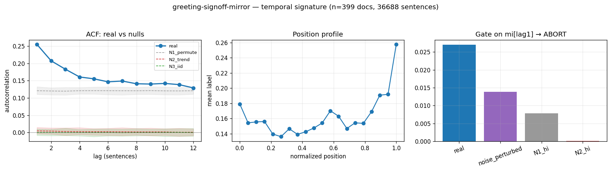

# Calibration record — `greeting-signoff-mirror`

**Verdict: ABORT** (numeric gate passed; **mirror failed its preregistered gate-8 moment** — see § 4)

Calibration per the frozen [prereg card](../../prereg/greeting-signoff-mirror.md); domain `text-corpus`, 399 documents / 36688 labeled sentences (doc coverage 0.998).

## 1. Labeler + noise floor

- **Bulk judge:** `claude-haiku-4-5-20251001` (frozen instruction in the card); **second judge:** `claude-sonnet-5` on 12 held-out docs (1155 sentences).
- **Inter-judge:** agreement 0.897, κ = 0.668 → noise floor ε̂ = 0.054 (adequacy floor κ ≥ 0.3: PASS).
- **Independent heuristic cross-check:** P 0.74 / R 0.70 / F1 0.72 (judge rate 0.162, heuristic 0.152).

## 2. Temporal signature vs nulls

| statistic | real | N1 permute | N2 trend | N3 iid |
|---|---|---|---|---|
| ACF(1) | **0.255 [0.234, 0.276]** | 0.121 | 0.005 | 0.000 |
| MI(1) (nats) | **0.027 [0.023, 0.032]** | 0.007 | 0.000 | 0.000 |
| Fano | **2.275 [2.132, 2.425]** | 1.748 | 0.857 | 0.838 |
| excite ratio P(1|1)/base | **2.326 [2.146, 2.491]** | 1.625 | 1.023 | 1.000 |
| inter-event gap CV | **1.701 [1.596, 1.814]** | 1.339 | 0.930 | 0.904 |
| spectral peak prominence | **1.801 [1.591, 1.982]** | 1.071 | 1.059 | 1.060 |

Base rate 0.1621; Markov order-1 vs 0 p = 0.00e+00.

## 3. Gate (preregistered) + verdict

Primary statistic `mi[lag1]` (expected sign +): real **0.0271**, after ε̂-noise perturbation **0.0139**; N1 97.5% band hi 0.0078, N2 hi 0.0001.

- clears sampling noise (real > N1 hi AND N2 hi): **True**
- survives labeler noise floor (perturbed likewise): **True**
- labeler adequate (κ ≥ 0.3): **True**
- split-half stability: 0.0251 / 0.0291

**→ ABORT**

## 4. Mirror (Appendix B) + held-out validation

Process `periodic_rate`; fit on 279 train docs, validated on 120 held-out docs. Fitted params:

```json
{
 "process": "periodic_rate",
 "period": 59,
 "a": 0.16650330932109283,
 "b_cos": 0.0241389992936094,
 "b_sin": -0.0016798695643053783
}
```

| statistic | real (held-out) | synthetic |
|---|---|---|
| acf(1) | 0.256 | -0.001 |
| mi(1) | 0.027 | 0.000 |
| fano | 2.314 | 0.838 |
| p11 | 0.368 | 0.168 |
| excite_ratio | 2.451 | 0.993 |
| gap_cv | 1.856 | 0.931 |
| spec_peak | 1.692 | 1.106 |

Abs errors: acf_lag1_5 0.197, mi_lag1_5 0.016, fano 1.476, p11 0.200, excite_ratio 1.458, gap_cv 0.926, spec_peak 0.587.

**Gate 8 (preregistered non-fitted moment)** — `mi[lag1]`: held-out real 0.0266 vs synthetic 0.0000, |err| 0.0266 vs tolerance ±0.0200 → **FAIL — mirror invalid ⇒ ABORT**.



## Reproduction

```bash
.venv/bin/python -m experiments.explorations.synthetic.expansion.calibrate greeting-signoff-mirror
.venv/bin/python -m experiments.explorations.synthetic.expansion.render_records
```
Deterministic given the cached labels (`labels.json`); judge models pinned in the card; spend after this candidate: $7.53.
