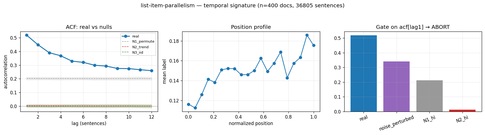

# Calibration record — `list-item-parallelism`

**Verdict: ABORT** (numeric gate passed; **mirror failed its preregistered gate-8 moment** — see § 4)

Calibration per the frozen [prereg card](../../prereg/list-item-parallelism.md); domain `text-corpus`, 400 documents / 36805 labeled sentences (doc coverage 1.000).

## 1. Labeler + noise floor

- **Bulk judge:** `claude-haiku-4-5-20251001` (frozen instruction in the card); **second judge:** `claude-sonnet-5` on 12 held-out docs (1227 sentences).
- **Inter-judge:** agreement 0.899, κ = 0.644 → noise floor ε̂ = 0.053 (adequacy floor κ ≥ 0.3: PASS).
- **Independent heuristic cross-check:** P 0.37 / R 0.05 / F1 0.09 (judge rate 0.149, heuristic 0.022).

## 2. Temporal signature vs nulls

| statistic | real | N1 permute | N2 trend | N3 iid |
|---|---|---|---|---|
| ACF(1) | **0.520 [0.477, 0.560]** | 0.202 | 0.003 | -0.000 |
| MI(1) (nats) | **0.101 [0.082, 0.121]** | 0.017 | 0.000 | 0.000 |
| Fano | **3.946 [3.583, 4.238]** | 2.397 | 0.869 | 0.850 |
| excite ratio P(1|1)/base | **3.967 [3.657, 4.332]** | 2.151 | 1.018 | 0.998 |
| inter-event gap CV | **2.074 [1.912, 2.232]** | 1.461 | 0.913 | 0.911 |
| spectral peak prominence | **4.623 [3.768, 5.567]** | 1.075 | 1.061 | 1.061 |

Base rate 0.1494; Markov order-1 vs 0 p = 0.00e+00.

## 3. Gate (preregistered) + verdict

Primary statistic `acf[lag1]` (expected sign +): real **0.5198**, after ε̂-noise perturbation **0.3417**; N1 97.5% band hi 0.2124, N2 hi 0.0125.

- clears sampling noise (real > N1 hi AND N2 hi): **True**
- survives labeler noise floor (perturbed likewise): **True**
- labeler adequate (κ ≥ 0.3): **True**
- split-half stability: 0.5151 / 0.5241

**→ ABORT**

## 4. Mirror (Appendix B) + held-out validation

Process `logistic_ar`; fit on 280 train docs, validated on 120 held-out docs. Fitted params:

```json
{
 "process": "logistic_ar",
 "K": 8,
 "position": true,
 "intercept": -3.0289349064438884,
 "coef_position": 0.15502952839868064,
 "kernel_w": [
  1.9727836787189788,
  1.0356383136567269,
  0.41222815520184575,
  0.40839275561015864,
  0.18046888474226117,
  0.2810537194716384,
  0.1597213135154442,
  0.40232442174750577
 ]
}
```

| statistic | real (held-out) | synthetic |
|---|---|---|
| acf(1) | 0.506 | 0.509 |
| mi(1) | 0.099 | 0.090 |
| fano | 3.903 | 3.740 |
| p11 | 0.587 | 0.574 |
| excite_ratio | 3.653 | 4.511 |
| gap_cv | 2.036 | 1.899 |
| spec_peak | 4.113 | 5.312 |

Abs errors: acf_lag1_5 0.023, mi_lag1_5 0.011, fano 0.163, p11 0.014, excite_ratio 0.858, gap_cv 0.136, spec_peak 1.199.

**Gate 8 (preregistered non-fitted moment)** — `fano`: held-out real 3.9034 vs synthetic 3.7404, |err| 0.1630 vs tolerance ±0.15 → **FAIL — mirror invalid ⇒ ABORT**.



## Reproduction

```bash
.venv/bin/python -m experiments.explorations.synthetic.expansion.calibrate list-item-parallelism
.venv/bin/python -m experiments.explorations.synthetic.expansion.render_records
```
Deterministic given the cached labels (`labels.json`); judge models pinned in the card; spend after this candidate: $9.60.
