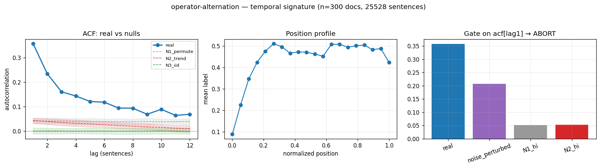

# Calibration record — `operator-alternation`

**Verdict: ABORT**

Calibration per the frozen [prereg card](../../prereg/operator-alternation.md); domain `reasoning-trace`, 300 documents / 25528 labeled sentences (doc coverage 1.000).

## 1. Labeler + noise floor

- **Bulk judge:** `claude-haiku-4-5-20251001` (frozen instruction in the card); **second judge:** `claude-sonnet-5` on 12 held-out docs (1033 sentences).
- **Inter-judge:** agreement 0.792, κ = 0.574 → noise floor ε̂ = 0.118 (adequacy floor κ ≥ 0.3: PASS).
- **Independent heuristic cross-check:** P 0.76 / R 0.32 / F1 0.45 (judge rate 0.438, heuristic 0.185).

## 2. Temporal signature vs nulls

| statistic | real | N1 permute | N2 trend | N3 iid |
|---|---|---|---|---|
| ACF(1) | **0.358 [0.339, 0.378]** | 0.041 | 0.043 | -0.000 |
| MI(1) (nats) | **0.065 [0.058, 0.073]** | 0.001 | 0.001 | 0.000 |
| Fano | **1.627 [1.546, 1.718]** | 0.759 | 0.779 | 0.561 |
| excite ratio P(1|1)/base | **1.470 [1.440, 1.507]** | 1.052 | 1.065 | 1.000 |
| inter-event gap CV | **1.137 [1.084, 1.192]** | 0.813 | 0.748 | 0.745 |
| spectral peak prominence | **3.627 [3.310, 3.972]** | 1.074 | 1.373 | 1.073 |

Base rate 0.4384; Markov order-1 vs 0 p = 0.00e+00.

## 3. Gate (preregistered) + verdict

Primary statistic `acf[lag1]` (expected sign -): real **0.3582**, after ε̂-noise perturbation **0.2069**; N1 2.5% band lo 0.0289, N2 lo 0.0315.

- clears sampling noise (real < N1 lo AND N2 lo (preregistered NEGATIVE effect)): **False**
- survives labeler noise floor (perturbed likewise): **False**
- labeler adequate (κ ≥ 0.3): **True**
- split-half stability: 0.3509 / 0.3652

**→ ABORT**



## Reproduction

```bash
.venv/bin/python -m experiments.explorations.synthetic.expansion.calibrate operator-alternation
.venv/bin/python -m experiments.explorations.synthetic.expansion.render_records
```
Deterministic given the cached labels (`labels.json`); judge models pinned in the card; spend after this candidate: $3.69.
