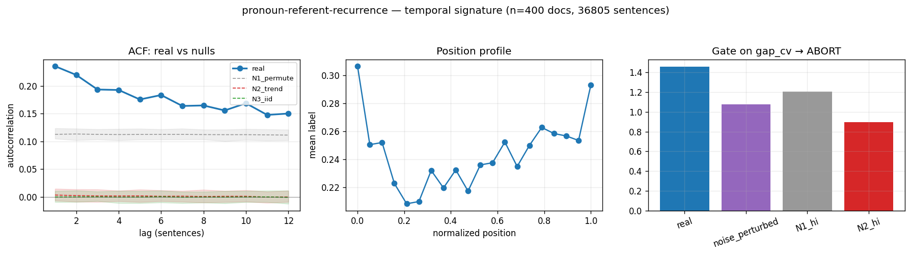

# Calibration record — `pronoun-referent-recurrence`

**Verdict: ABORT**

Calibration per the frozen [prereg card](../../prereg/pronoun-referent-recurrence.md); domain `text-corpus`, 400 documents / 36805 labeled sentences (doc coverage 1.000).

## 1. Labeler + noise floor

- **Bulk judge:** `claude-haiku-4-5-20251001` (frozen instruction in the card); **second judge:** `claude-sonnet-5` on 12 held-out docs (1227 sentences).
- **Inter-judge:** agreement 0.820, κ = 0.527 → noise floor ε̂ = 0.100 (adequacy floor κ ≥ 0.3: PASS).
- **Independent heuristic cross-check:** P 0.55 / R 0.55 / F1 0.55 (judge rate 0.245, heuristic 0.245).

## 2. Temporal signature vs nulls

| statistic | real | N1 permute | N2 trend | N3 iid |
|---|---|---|---|---|
| ACF(1) | **0.236 [0.209, 0.263]** | 0.113 | 0.003 | -0.000 |
| MI(1) (nats) | **0.026 [0.020, 0.032]** | 0.006 | 0.000 | 0.000 |
| Fano | **2.158 [1.981, 2.315]** | 1.525 | 0.773 | 0.755 |
| excite ratio P(1|1)/base | **1.719 [1.641, 1.812]** | 1.349 | 1.008 | 1.000 |
| inter-event gap CV | **1.458 [1.384, 1.524]** | 1.166 | 0.879 | 0.863 |
| spectral peak prominence | **1.881 [1.672, 2.073]** | 1.065 | 1.062 | 1.060 |

Base rate 0.2445; Markov order-1 vs 0 p = 0.00e+00.

## 3. Gate (preregistered) + verdict

Primary statistic `gap_cv` (expected sign +): real **1.4584**, after ε̂-noise perturbation **1.0755**; N1 97.5% band hi 1.2058, N2 hi 0.8974.

- clears sampling noise (real > N1 hi AND N2 hi): **True**
- survives labeler noise floor (perturbed likewise): **False**
- labeler adequate (κ ≥ 0.3): **True**
- split-half stability: 1.3855 / 1.5332

**→ ABORT**



## Reproduction

```bash
.venv/bin/python -m experiments.explorations.synthetic.expansion.calibrate pronoun-referent-recurrence
.venv/bin/python -m experiments.explorations.synthetic.expansion.render_records
```
Deterministic given the cached labels (`labels.json`); judge models pinned in the card; spend after this candidate: $12.01.
