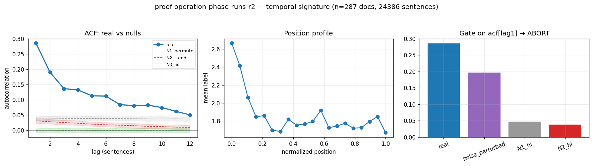

# Calibration record — `proof-operation-phase-runs-r2`

**Verdict: ABORT** (numeric gate passed; **mirror failed its preregistered gate-8 moment** — see § 4)

Calibration per the frozen [prereg card](../../prereg/proof-operation-phase-runs.md); domain `reasoning-trace`, 287 documents / 24386 labeled sentences (doc coverage 0.957).

## 1. Labeler + noise floor

- **Bulk judge:** `claude-haiku-4-5-20251001` (frozen instruction in the card); **second judge:** `claude-sonnet-5` on 12 held-out docs (1079 sentences).
- **Inter-judge:** agreement 0.685, κ = 0.586 → noise floor ε̂ = 0.172 (adequacy floor κ ≥ 0.3: PASS).
- **Independent heuristic cross-check:** accuracy 0.42, κ 0.23 (class 1: F1 0.61, class 2: F1 0.19, class 3: F1 0.14, class 4: F1 0.16).

## 2. Temporal signature vs nulls

| statistic | real | N1 permute | N2 trend | N3 iid |
|---|---|---|---|---|
| directed asymmetry (fwd−rev)/(fwd+rev) | **—** | — | — | — |
| P(dst @ t+1 | src @ t) forward | **—** | — | — | — |
| same, time-reversed | **—** | — | — | — |
| self-match ACF(1) | **0.286 [0.272, 0.300]** | 0.040 | 0.031 | -0.000 |
| dwell mean | **1.860 [1.826, 1.899]** | 1.391 | 1.379 | 1.337 |
| dwell CV | **0.910 [0.826, 1.028]** | 0.594 | 0.577 | 0.525 |

Marginal ['0.223', '0.334', '0.077', '0.080', '0.285']; Markov order-1 vs 0 p = 0.00e+00.

## 3. Gate (preregistered) + verdict

Primary statistic `acf[lag1]` (expected sign +): real **0.2857**, after ε̂-noise perturbation **0.1963**; N1 97.5% band hi 0.0474, N2 hi 0.0381.

- clears sampling noise (real > N1 hi AND N2 hi): **True**
- survives labeler noise floor (perturbed likewise): **True**
- labeler adequate (κ ≥ 0.3): **True**
- split-half stability: 0.2834 / 0.2879

**→ ABORT**

## 4. Mirror (Appendix B) + held-out validation

Process `hier_categorical`; fit on 200 train docs, validated on 87 held-out docs. Fitted params:

```json
{
 "process": "hier_categorical",
 "n_symbols": 5,
 "jump_P": [
  [
   0.0,
   0.3218189768255356,
   0.16965456930476608,
   0.062090074333187584,
   0.4464363795365107
  ],
  [
   0.4028309104820199,
   0.0,
   0.07612853863810252,
   0.21040550879877581,
   0.31063504208110176
  ],
  [
   0.20890774125132555,
   0.46129374337221635,
   0.0,
   0.09013785790031813,
   0.23966065747614
  ],
  [
   0.3394199785177229,
   0.3082706766917293,
   0.10848549946294307,
   0.0,
   0.24382384532760473
  ],
  [
   0.3089092422980849,
   0.511240632805995,
   0.10990840965861781,
   0.06994171523730225,
   0.0
  ]
 ],
 "alpha": 0.72,
 "doc_props": [
  [
   0.49085729076169765,
   0.06119373242449622,
   0.2985463869694431,
   0.06104800290212079,
   0.08835458694224244
  ],
  [
   0.016687128636518805,
   0.03365567740233644,
   9.765173389845181e-07,
   0.04162694714459097,
   0.9080292702992148
  ],
  [
   0.0931604484382563,
   0.1274897719205741,
   0.24792294266721113,
   0.2994604744297744,
   0.23196636254418418
  ],
  [
   0.03614536292029017,
   0.9344998564364575,
   9.722312887704912e-07,
   0.011593496493022427,
   0.01776031191894101
  ],
  [
   0.01639652212858136,
   0.3774141337767543,
   0.10963399588814673,
   0.24693430459001006,
   0.24962104361650755
  ],
  [
   0.19265330070655104,
   0.40866449389419857,
   0.02760072682660875,
   0.12286724289512978,
   0.24821423567751197
  ],
  [
   0.008739778625544606,
   0.9841002220254901,
   0.0005599629485736893,
   9.449825243576623e-07,
   0.006599091417867255
  ],
  [
   0.02518659612924563,
   0.9437161740040892,
   0.009244707415213124,
   0.006472120552214377,
   0.015380401899237763
  ],
  [
   0.27291122585130356,
   0.3652133716235341,
   0.13440351269817286,
   0.0694942833686134,
   0.1579776064583759
  ],
  [
   0.23713414391669918,
   0.0660034795558918,
   9.894501061709364e-07,
   0.10034011129348072,
   0.5965212757838221
  ],
  [
   0.49395865440002173,
   0.10271882319876423,
   0.10345642773470451,
   0.04663284597221127,
   0.2532332486942983
  ],
  [
   0.012704365604909939,
   0.6905883165099499,
   0.07694089394807158,
   0.05942226143529978,
   0.16034416250176875
  ],
  [
   0.03585959645108819,
   0.8631906837039327,
   0.03731321758741872,
   0.024773019384806652,
   0.038863482872753714
  ],
  [
   0.2131094655043104,
   0.38720046190380014,
   0.022315923593021435,
   0.06632855023860398,
   0.31104559876026394
  ],
  [
   0.028898610305645077,
   0.4781825900598783,
   0.11906536305546844,
   0.0952314426590786,
   0.2786219939199297
  ],
  [
   0.38136382719204637,
   0.044646758018833714,
   0.15231894519520275,
   0.012524812386757634,
   0.40914565720715945
  ],
  [
   0.24515804301407368,
   0.16697767176865297,
   0.24436311117216233,
   0.059373924281636646,
   0.2841272497634745
  ],
  [
   0.0350513431821317,
   0.07586011750257879,
   0.6045714192511187,
   0.14885694498669036,
   0.1356601750774805
  ],
  [
   0.00027325995169782225,
   0.8769485167811171,
   0.025410213197109236,
   0.050351215620094786,
   0.047016794449981185
  ],
  [
   0.6543427103752629,
   0.21809398720103998,
   0.00071196138943814,
   0.021929005112163766,
   0.10492233592209528
  ],
  [
   0.041676184756766106,
   0.18424101947146715,
   0.004503264653976147,
   0.02054719131241718,
   0.7490323398053733
  ],
  [
   0.4997670697143904,
   0.26311840954179666,
   0.027516524962274046,
   0.014716047442857393,
   0.19488194833868153
  ],
  [
   0.03247713507159102,
   0.0402477344229069,
   0.010229431508282006,
   0.01750184122228103,
   0.899543857774939
  ],
  [
   0.07496563784211703,
   0.2843996821800484,
   0.18984179169449794,
   0.1953432625144669,
   0.2554496257688697
  ],
  [
   0.00047963958836454347,
   0.998411453320785,
   0.00011957939460329751,
   0.00039910617631600524,
   0.0005902215199311333
  ],
  [
   0.32171872701972065,
   0.28520741365120383,
   0.03308902830508655,
   0.1679252887101364,
   0.19205954231385267
  ],
  [
   0.17600439460381667,
   0.31177858924830565,
   0.0835534937776538,
   0.35604153290441537,
   0.07262198946580858
  ],
  [
   0.03495674257835389,
   0.3953093428549201,
   0.29466861604067807,
   0.06786964409010757,
   0.2071956544359404
  ],
  [
   0.046730287180054425,
   0.2820071352388854,
   0.07628959564571212,
   0.003757255977710443,
   0.5912157259576377
  ],
  [
   0.9538934241649855,
   0.02126199559732175,
   0.011781249638527055,
   5.700522969081866e-05,
   0.013006325369474941
  ],
  [
   7.154495437563206e-07,
   7.154495437563206e-07,
   7.154495437563206e-07,
   7.154495437563206e-07,
   0.999997138201825
  ],
  [
   0.09984339105370739,
   0.2111109311582223,
   4.405314359193463e-05,
   0.0293579793399389,
   0.6596436453045394
  ],
  [
   0.07301045395744808,
   0.46698970156702574,
   0.0655534876543204,
   0.050164561033109525,
   0.34428179578809626
  ],
  [
   0.4268596752263218,
   0.08304677522679307,
   0.11649853745890829,
   0.21843391831280712,
   0.1551610937751698
  ],
  [
   0.603603073669079,
   0.15830188725368605,
   0.14400701132842714,
   0.039499028743552676,
   0.05458899900525513
  ],
  [
   0.018630904332580446,
   0.32931257144914855,
   0.10370788122032863,
   0.0836079178857609,
   0.4647407251121814
  ],
  [
   0.14749301597291015,
   0.1031417148589451,
   0.0575844643590204,
   0.00926465958467914,
   0.6825161452244453
  ],
  [
   0.01700380234300474,
   0.9253257555044205,
   9.75827662163883e-07,
   0.010112499904913329,
   0.04755696641999918
  ],
  [
   0.09730412891117246,
   0.5019918620067725,
   0.058680576775598195,
   0.08014083930162896,
   0.2618825930048278
  ],
  [
   0.19877633671141565,
   0.14485075803790012,
   0.09551994804781372,
   0.10206118507821386,
   0.45879177212465666
  ],
  [
   0.008297711800249404,
   0.18703124211996788,
   0.06998569176469442,
   0.05703552882875771,
   0.6776498254863306
  ],
  [
   0.1692293567855385,
   0.17841661379511997,
   0.08142631999563278,
   0.08867799844745912,
   0.4822497109762495
  ],
  [
   0.06410516537284128,
   0.7395427737774455,
   0.0008077864235507796,
   0.02796328002058562,
   0.16758099440557686
  ],
  [
   0.48542994545968304,
   0.09049104969850348,
   0.2760637611462205,
   0.0003034810815187808,
   0.1477117626140743
  ],
  [
   0.2901748957920797,
   0.4058389656195991,
   0.10904320115782086,
   0.05124456028841969,
   0.14369837714208064
  ],
  [
   0.040008189762266166,
   0.0839746385323034,
   0.004423067554936067,
   0.057205396989816144,
   0.8143887071606782
  ],
  [
   0.16901154307112035,
   0.18872161943018456,
   0.053938773633435,
   0.15782698912036364,
   0.4305010747448964
  ],
  [
   0.4414165050320834,
   0.20440430527110198,
   0.08638860996815176,
   0.021687304404969528,
   0.24610327532369344
  ],
  [
   0.33088671149485765,
   0.3467849158120185,
   0.010144529490622932,
   0.13733034287189655,
   0.17485350033060446
  ],
  [
   0.030277805752831743,
   0.003768813591531565,
   0.004545401303636797,
   0.00165641073079067,
   0.9597515686212091
  ],
  [
   0.18736828348589196,
   0.15389884243309282,
   0.1466318584636315,
   0.3796202447520127,
   0.13248077086537086
  ],
  [
   0.7452540031763527,
   0.09658619367787803,
   0.07933299526981334,
   0.030350608310534655,
   0.04847619956542129
  ],
  [
   0.8314797015039499,
   0.06811744881478349,
   0.052625689646866716,
   0.008674191371451694,
   0.03910296866294812
  ],
  [
   0.22581068808364005,
   0.4219299403157262,
   0.037272829031871756,
   0.09530015835221603,
   0.2196863842165461
  ],
  [
   0.28185424576724233,
   0.287875275014503,
   0.009028668747008266,
   0.1182862558405671,
   0.30295555463067925
  ],
  [
   0.27097974598229513,
   0.32431144215024016,
   0.06124579543967972,
   0.06893647555325033,
   0.27452654087453454
  ],
  [
   0.19017920950653397,
   0.4166500047110162,
   0.08750087128881415,
   0.08784791436607552,
   0.21782200012756028
  ],
  [
   0.14963657837770075,
   0.45969586114087696,
   0.08293800858066713,
   0.1231574185911539,
   0.18457213330960126
  ],
  [
   9.698466299041383e-07,
   0.22110609324843375,
   0.45032404640368245,
   0.15100307395196005,
   0.17756581654929393
  ],
  [
   9.731016520572451e-07,
   0.5776104622433293,
   0.1761229059528986,
   0.022086994332540747,
   0.22417866436957934
  ],
  [
   0.02991040869819942,
   0.15895908258920502,
   0.0862313972072034,
   0.19534574059755558,
   0.5295533709078365
  ],
  [
   0.04715699126780294,
   0.7014300584232379,
   0.0017308485527070567,
   0.06511387291661036,
   0.18456822883964177
  ],
  [
   0.36589412281617245,
   0.2322771636510337,
   0.20755063337833035,
   0.1386090015564395,
   0.055669078598024085
  ],
  [
   0.1833790400333734,
   0.35456653498915336,
   0.12280935233629442,
   0.06553918064374116,
   0.2737058919974377
  ],
  [
   0.6171521377906442,
   0.0960469641285397,
   0.18935887276707605,
   0.02556248281508663,
   0.07187954249865341
  ],
  [
   0.3235672285150728,
   0.374050782246616,
   0.05479736031527586,
   0.13337740995120634,
   0.11420721897182914
  ],
  [
   0.6438150014291789,
   0.15826141762397233,
   1.0134095333092715e-06,
   0.04736251193941577,
   0.15056005559789967
  ],
  [
   0.1356155843976999,
   0.32898731572423523,
   0.009894792190833626,
   0.15052148424323708,
   0.37498082344399425
  ],
  [
   0.7007579890735142,
   0.14273021804923933,
   0.0014703644538398375,
   0.0651953490730849,
   0.08984607935032178
  ],
  [
   0.10172300313024814,
   0.31654649010468433,
   0.047181869620012785,
   0.22580634556380969,
   0.30874229158124505
  ],
  [
   0.4778891024043228,
   0.16103433684838758,
   0.15528954859823113,
   0.041353274219033606,
   0.16443373793002483
  ],
  [
   0.21156508243229574,
   0.5961300518682554,
   0.0699753643455094,
   0.042803523777102774,
   0.07952597757683673
  ],
  [
   0.2771493224491232,
   0.4304072680042404,
   0.010564333438021207,
   0.13239922424322,
   0.14947985186539506
  ],
  [
   0.32508951777106304,
   0.3969206657780711,
   0.04106977058822344,
   0.12037693742833162,
   0.11654310843431083
  ],
  [
   0.20897231186941917,
   0.21955022579031122,
   0.13460668163627942,
   0.1756440005055724,
   0.26122678019841766
  ],
  [
   0.24157216382520935,
   0.14714435398281311,
   0.3714178002397139,
   0.042645547105420234,
   0.1972201348468434
  ],
  [
   0.42119113166111494,
   0.15911602309691117,
   0.2018557017765181,
   9.874838728441662e-07,
   0.21783615598158304
  ],
  [
   0.3453864009899534,
   0.16599941294952514,
   0.19374641155362118,
   0.0982316533848962,
   0.19663612112200415
  ],
  [
   0.1040932258571402,
   0.4179416410184606,
   0.17463573820361963,
   0.21993320204820366,
   0.08339619287257584
  ],
  [
   0.0039776694535324465,
   0.3430766919712474,
   0.07759551008454621,
   0.06052030978123305,
   0.5148298187094408
  ],
  [
   0.429958328059496,
   0.11168985234135405,
   0.2741294483722547,
   0.06555753014846956,
   0.11866484107842552
  ],
  [
   0.06613531451472736,
   0.5078170398511872,
   0.0694035619189335,
   0.19670555789850758,
   0.1599385258166444
  ],
  [
   0.25877635745496996,
   0.42373442515426757,
   0.04309623901499829,
   0.12355616597327328,
   0.15083681240249086
  ],
  [
   0.3806123436868069,
   0.23634791496849322,
   0.08304197243375112,
   0.056712544449485425,
   0.24328522446146325
  ],
  [
   0.26679291748953204,
   0.28438307270883667,
   0.026954654750501815,
   0.1458575444748655,
   0.276011810576264
  ],
  [
   0.1971586033579895,
   0.3829419189131528,
   0.10630380758212588,
   0.20973346884864918,
   0.10386220129808264
  ],
  [
   0.26526792817048417,
   0.430099756684087,
   0.10841152484465869,
   9.829533592364048e-07,
   0.1962198073474109
  ],
  [
   0.0057564462606474335,
   0.007999574042067881,
   0.0014544741975695572,
   9.385958675857962e-07,
   0.9847885669038474
  ],
  [
   8.898792364148379e-07,
   0.9952401917255195,
   8.898792364148379e-07,
   0.00014410152389164962,
   0.004613926992116093
  ],
  [
   0.17625224284719584,
   0.1526170287485742,
   0.06725776796193673,
   0.176287491416219,
   0.42758546902607425
  ],
  [
   1.9167435971847776e-05,
   0.9997228989302827,
   9.298692734093826e-05,
   7.11596390678832e-05,
   9.37870673369544e-05
  ],
  [
   0.13468356210990198,
   0.7280839900916445,
   0.0669523558884236,
   0.02347643453987577,
   0.04680365737015415
  ],
  [
   0.06269941805848989,
   0.4939278678808678,
   0.10976396865188372,
   0.10284543326822576,
   0.23076331214053292
  ],
  [
   0.289462822081327,
   0.24831596155085853,
   0.12034407616572305,
   0.001331421685017748,
   0.34054571851707366
  ],
  [
   7.154495437563206e-07,
   7.154495437563206e-07,
   7.154495437563206e-07,
   7.154495437563206e-07,
   0.999997138201825
  ],
  [
   0.008478433660653206,
   0.38716485552614777,
   0.4636308803742043,
   0.06243438894380187,
   0.07829144149519288
  ],
  [
   0.4252338775716999,
   0.07579410582704639,
   0.025129369457136858,
   0.11992052789604848,
   0.35392211924806827
  ],
  [
   0.11147272575311774,
   0.5589399765079779,
   0.08505241249734871,
   0.06730957110033925,
   0.17722531414121648
  ],
  [
   0.11543860522591148,
   0.488030464367685,
   0.08144487800498537,
   0.13437027933108386,
   0.1807157730703342
  ],
  [
   0.6159739508539058,
   0.13510156426056086,
   0.026441712006262125,
   0.05143201336751364,
   0.1710507595117575
  ],
  [
   0.04710782063739996,
   0.20187854223457632,
   0.11679174006168877,
   0.05348991955619026,
   0.5807319775101448
  ],
  [
   0.0658656546838589,
   0.7949714355967834,
   0.0904518595714019,
   0.012475958637623822,
   0.03623509151033182
  ],
  [
   7.774743390341949e-07,
   7.774743390341949e-07,
   7.774743390341949e-07,
   7.774743390341949e-07,
   0.9999968901026439
  ],
  [
   0.22393065965369854,
   0.5297711475065379,
   0.00021190051525468872,
   0.004024438617181985,
   0.2420618537073269
  ],
  [
   0.18955483517284172,
   0.5693056563223203,
   0.003817810746810163,
   0.05531126940838117,
   0.1820104283496465
  ],
  [
   0.6996648492808217,
   0.09440085318007231,
   0.04006887883326904,
   0.021234991004816017,
   0.14463042770102086
  ],
  [
   0.1535366972028448,
   0.25088071983897603,
   0.2196287324166058,
   0.24045938640511294,
   0.13549446413646038
  ],
  [
   0.46516976656189757,
   0.1774567827642814,
   0.18560254964068237,
   0.12481075276401671,
   0.04696014826912208
  ],
  [
   0.14085120604194706,
   0.5281263610754172,
   0.09985935376072583,
   9.820625289105995e-07,
   0.23116209705938084
  ],
  [
   0.12470174365800576,
   0.07082227214322862,
   0.015805459997503064,
   0.09019529693307,
   0.6984752272681927
  ],
  [
   0.7243781670241131,
   0.10279709581464201,
   0.07921472179668111,
   0.012678238134676471,
   0.08093177722988729
  ],
  [
   0.004804475610252578,
   0.9909603395453125,
   0.0014252120246920805,
   9.34770894197227e-07,
   0.0028090380488485747
  ],
  [
   0.10764196122589344,
   0.694477651344986,
   0.007333196259618705,
   0.03557334983368716,
   0.15497384133581465
  ],
  [
   0.002958549129015444,
   0.8097974320792031,
   9.87694850188279e-07,
   0.03365034215514444,
   0.1535926889417868
  ],
  [
   7.857793760055425e-07,
   2.1753217927773327e-06,
   7.857793760055425e-07,
   7.857793760055425e-07,
   0.9999954673400793
  ],
  [
   0.028970393455321913,
   0.2596737417979471,
   0.05651864993840281,
   0.008536201397605076,
   0.6463010134107231
  ],
  [
   0.233822158678201,
   0.15946631125767022,
   0.16764102954621266,
   0.22183297217163453,
   0.21723752834628168
  ],
  [
   0.0749395880783016,
   0.17643646031283416,
   0.004115937942435059,
   0.23811072109339632,
   0.5063972925730328
  ],
  [
   0.024702711487798665,
   0.04097898080819513,
   0.020750656680437043,
   0.017949076900959444,
   0.8956185741226097
  ],
  [
   0.9998029012090427,
   1.8289198016761338e-05,
   4.053765977640226e-05,
   8.404746770548158e-07,
   0.00013743145848713607
  ],
  [
   0.1506548786947402,
   0.05820164078868917,
   0.2548254092549892,
   0.07577139858944218,
   0.4605466726721394
  ],
  [
   0.4918993683660705,
   0.22489657853052997,
   0.02464639787053992,
   0.07644974630040478,
   0.18210790893245488
  ],
  [
   0.0015262565589814028,
   0.024200881192363577,
   0.013001607680281439,
   0.010939222142225029,
   0.9503320324261486
  ],
  [
   0.5410867310222852,
   0.09487737464369238,
   0.13608515643310823,
   0.08507936765854451,
   0.1428713702423696
  ],
  [
   0.43151753361396444,
   0.15062331439338617,
   0.04625320241687637,
   0.022348467160264576,
   0.3492574824155085
  ],
  [
   0.5858891313949647,
   0.07974031476584488,
   0.025211076791900988,
   0.16046006734290033,
   0.14869940970438922
  ],
  [
   0.2487599847354162,
   0.09770791967524077,
   0.033399107426069795,
   0.009745470645993334,
   0.6103875175172799
  ],
  [
   0.21954871103001353,
   0.31009586168069186,
   0.10435286063948845,
   0.13463185555192406,
   0.231370711097882
  ],
  [
   0.07893138774153866,
   0.47390785309973266,
   0.07566069000744623,
   0.14427250572248007,
   0.2272275634288023
  ],
  [
   0.0001922459342011233,
   0.9991740958535117,
   5.4589037186850294e-05,
   1.9022442484515678e-05,
   0.0005600467326156704
  ],
  [
   0.1990139651519993,
   0.4580950453496155,
   0.11099369172391078,
   9.839752248846613e-07,
   0.2318963137992497
  ],
  [
   0.08702664343758733,
   0.08935914199990742,
   0.08268567613394485,
   0.012906207823966643,
   0.7280223306045938
  ],
  [
   0.3804054814379497,
   0.1568940201610069,
   0.1938817383925077,
   0.07000725779568985,
   0.1988115022128458
  ],
  [
   0.13035933820174075,
   0.48859324267075965,
   0.08128609846201343,
   0.11971234793123005,
   0.18004897273425619
  ],
  [
   0.0007873468127567586,
   0.3599127660259955,
   0.1442131697092957,
   0.16667345263841568,
   0.3284132648135363
  ],
  [
   0.060372324784566604,
   0.3307401765432884,
   0.2569960949655041,
   0.23823723406261207,
   0.11365416964402883
  ],
  [
   0.5092477477790474,
   0.19522815733623822,
   0.024733360945060536,
   0.19202224244536187,
   0.07876849149429209
  ],
  [
   0.07543487028250027,
   0.3111109469085188,
   0.027137695930720396,
   0.10965730880453055,
   0.47665917807373
  ],
  [
   0.14160900103384894,
   0.5166594573239413,
   0.0827194240654945,
   0.05537768106171524,
   0.203634436515
  ],
  [
   0.32226781258776477,
   0.2702362726581096,
   0.03298439756910653,
   0.18218268938928392,
   0.19232882779573512
  ],
  [
   0.15689273333125175,
   0.026979051946161715,
   0.002857964645933796,
   0.03162262072350953,
   0.7816476293531432
  ],
  [
   0.26943783442621094,
   0.5305006605101467,
   0.009604916357585036,
   0.11767971880530226,
   0.07277686990075506
  ],
  [
   7.89210565755215e-07,
   6.546800900045837e-06,
   7.89210565755215e-07,
   1.6597645919820995e-06,
   0.9999902150133764
  ],
  [
   0.008297711800249404,
   0.18703124211996788,
   0.06998569176469442,
   0.05703552882875771,
   0.6776498254863306
  ],
  [
   0.2636307157706426,
   0.10770253931001988,
   0.06525205253943597,
   0.022281913431700034,
   0.5411327789482014
  ],
  [
   0.19674820945823915,
   0.05851793321966506,
   0.327329375367236,
   0.10111934564855238,
   0.3162851363063074
  ],
  [
   0.4635590247921794,
   0.3111389691592947,
   9.801618828528882e-07,
   9.801618828528882e-07,
   0.22530004572476023
  ],
  [
   0.04715699126780294,
   0.7014300584232379,
   0.0017308485527070567,
   0.06511387291661036,
   0.18456822883964177
  ],
  [
   0.02464942319482102,
   0.3466120438139772,
   0.05933806748684332,
   0.04503201122906868,
   0.5243684542752897
  ],
  [
   0.14963657837770075,
   0.45969586114087696,
   0.08293800858066713,
   0.1231574185911539,
   0.18457213330960126
  ],
  [
   0.4161548964457489,
   0.38127846457239783,
   0.03722759540112187,
   0.07925334559982655,
   0.08608569798090474
  ],
  [
   0.3882358521154358,
   0.21279677978073774,
   0.1614809163548356,
   0.036835063098871204,
   0.20065138865011975
  ],
  [
   0.294199838215923,
   0.1720455510321562,
   0.26027728750154894,
   0.17623120876597187,
   0.09724611448439989
  ],
  [
   0.01743182388033935,
   0.787405505876879,
   0.022610500549233237,
   0.08092143460300275,
   0.09163073509054558
  ],
  [
   0.128177819659678,
   0.3305162181310334,
   0.12931524860302623,
   0.00703512276230036,
   0.40495559084396204
  ],
  [
   0.4271944366553028,
   0.1807730889279616,
   0.1510030510292135,
   0.05342928341113565,
   0.18760013997638647
  ],
  [
   0.04738327778629645,
   0.8669479067496398,
   0.02618200469065672,
   0.03056201633284987,
   0.028924794440557205
  ],
  [
   0.3792886030628595,
   0.07778055591730472,
   0.11875198668359858,
   0.060059756185352066,
   0.3641190981508851
  ],
  [
   9.588197704741868e-07,
   0.8305828212983057,
   0.014150576132464524,
   0.007134972584562915,
   0.14813067116489634
  ],
  [
   0.19685725244237937,
   0.16021069800760118,
   0.12849063595459745,
   0.3185934232106201,
   0.19584799038480183
  ],
  [
   0.10191816387291643,
   0.7974353308337125,
   0.004801513916365513,
   0.03134255986024095,
   0.06450243151676464
  ],
  [
   0.08698116217278493,
   0.2668614675201996,
   0.04631594485214591,
   0.2036359664818576,
   0.39620545897301196
  ],
  [
   0.1356155843976999,
   0.32898731572423523,
   0.009894792190833626,
   0.15052148424323708,
   0.37498082344399425
  ],
  [
   0.008297711800249404,
   0.18703124211996788,
   0.06998569176469442,
   0.05703552882875771,
   0.6776498254863306
  ],
  [
   0.9999916525649815,
   1.7227167966726828e-06,
   7.813399822384921e-07,
   7.813399822384921e-07,
   5.0620382575413855e-06
  ],
  [
   0.08583628458232095,
   0.1781523015056,
   0.001400057209506701,
   0.028344357397505404,
   0.706266999305067
  ],
  [
   0.37485403963571073,
   0.17639138803061455,
   0.14399041051966274,
   0.1263958753365892,
   0.17836828647742287
  ],
  [
   0.02805808546720484,
   0.8370924131893737,
   9.858317082374854e-07,
   0.0037929740628565496,
   0.13105554144885678
  ],
  [
   0.09428548631497667,
   0.09629046723416894,
   0.39061150658471233,
   0.26528761730232814,
   0.15352492256381403
  ],
  [
   6.918391948818621e-05,
   0.5305242578564314,
   0.2590563551121374,
   0.03766144941542517,
   0.17268875369651784
  ],
  [
   0.30900640691073183,
   0.26162973881691426,
   0.03379808600801462,
   0.1856938150892806,
   0.20987195317505875
  ],
  [
   0.08369983959919437,
   0.666423087673953,
   0.018585358665726356,
   0.0014512773978541062,
   0.22984043666327206
  ],
  [
   0.24581377393272552,
   0.507823239544902,
   0.0010332578421455793,
   0.1782296744611607,
   0.06710005421906595
  ],
  [
   0.17851762563507953,
   0.3551953992716147,
   0.1039802825832734,
   0.1323611107926769,
   0.22994558171735546
  ],
  [
   0.688922229911418,
   0.11807188408708841,
   0.05502462668073231,
   0.0793212903814789,
   0.05865996893928223
  ],
  [
   0.4648005034275401,
   0.007128640248169104,
   0.16346589851286378,
   9.862805637821302e-07,
   0.36460397153086316
  ],
  [
   0.05631067955720478,
   0.7905612038755665,
   0.008661232327833982,
   0.013293032225420992,
   0.13117385201397372
  ],
  [
   0.06613531451472736,
   0.5078170398511872,
   0.0694035619189335,
   0.19670555789850758,
   0.1599385258166444
  ],
  [
   0.1390012729194103,
   0.6812913826688136,
   0.010923080040649036,
   0.0669476890348812,
   0.10183657533624581
  ],
  [
   0.026442599772350774,
   0.4402104132522048,
   0.0996832973321292,
   0.055148415548698745,
   0.37851527409461655
  ],
  [
   0.49475518016741316,
   0.17488773059650092,
   0.11704124366862893,
   0.08142519521681245,
   0.13189065035064454
  ],
  [
   0.002461788552986452,
   0.997120095625283,
   0.00012308265206636843,
   9.052653001117144e-07,
   0.0002941279043641231
  ],
  [
   0.12832900800068062,
   0.41055057274708145,
   0.21887040608132063,
   0.033337179553185194,
   0.20891283361773194
  ],
  [
   0.20496224187493742,
   0.14370156205651685,
   0.005552739423929849,
   2.0607731853660296e-05,
   0.6457628489127623
  ],
  [
   0.9871760748124089,
   0.0020293337574822322,
   0.004108576673360366,
   0.003031751809740516,
   0.0036542629470080225
  ],
  [
   0.16594183716500643,
   0.21601050554768209,
   0.037407053501584554,
   0.03093236191062856,
   0.5497082418750983
  ],
  [
   0.09206567911886539,
   0.620836970144455,
   0.07299413156032357,
   0.046724993881629116,
   0.16737822529472698
  ],
  [
   0.30014397540990817,
   0.09557212634623705,
   0.38150831426215936,
   0.056340213115336615,
   0.16643537086635873
  ],
  [
   0.8490544124642604,
   0.028232575300329757,
   0.07388594303574343,
   9.828930185068048e-07,
   0.04882608630664788
  ],
  [
   0.3233000862383532,
   0.05547246442099025,
   0.37078024834609646,
   0.07176594565011066,
   0.17868125534444948
  ],
  [
   0.05837686414644697,
   0.2755065923236136,
   0.13990545128667392,
   0.08657607873335307,
   0.4396350135099125
  ],
  [
   0.1356155843976999,
   0.32898731572423523,
   0.009894792190833626,
   0.15052148424323708,
   0.37498082344399425
  ],
  [
   0.3295421276990479,
   0.11535478576184328,
   0.052865841322273725,
   0.0005482643420099856,
   0.5016889808748252
  ],
  [
   0.0008488045668249126,
   0.0005557282010430019,
   0.0007943981420940761,
   1.567954199339621e-05,
   0.9977853895480445
  ],
  [
   0.17793140560234588,
   0.2042254364934904,
   0.04000250565724544,
   9.868107374661929e-07,
   0.5778396654361809
  ],
  [
   0.0493764476426026,
   0.008966185061725106,
   0.00502573858611295,
   0.009168371792259614,
   0.9274632569172998
  ],
  [
   0.6186070842112399,
   0.2352339782776919,
   0.047346250805385647,
   0.013813317718811764,
   0.08499936898687092
  ],
  [
   0.5289501073580254,
   0.28900259058512384,
   0.011239080694813802,
   0.07809618696191872,
   0.09271203440011808
  ],
  [
   0.9999977999619968,
   5.5000950083709e-07,
   5.5000950083709e-07,
   5.5000950083709e-07,
   5.5000950083709e-07
  ],
  [
   0.008297711800249404,
   0.18703124211996788,
   0.06998569176469442,
   0.05703552882875771,
   0.6776498254863306
  ]
 ],
 "doc_marginals": [
  [
   0.3333333333333333,
   0.19047619047619047,
   0.20952380952380953,
   0.0761904761904762,
   0.19047619047619047
  ],
  [
   0.1271186440677966,
   0.2457627118644068,
   0.00847457627118644,
   0.1440677966101695,
   0.4745762711864407
  ],
  [
   0.144,
   0.232,
   0.16,
   0.2,
   0.264
  ],
  [
   0.22641509433962265,
   0.5094339622641509,
   0.009433962264150943,
   0.07547169811320754,
   0.1792452830188679
  ],
  [
   0.09090909090909091,
   0.36363636363636365,
   0.09090909090909091,
   0.18181818181818182,
   0.2727272727272727
  ],
  [
   0.20408163265306123,
   0.3673469387755102,
   0.04081632653061224,
   0.11224489795918367,
   0.2755102040816326
  ],
  [
   0.21296296296296297,
   0.5277777777777778,
   0.027777777777777776,
   0.018518518518518517,
   0.21296296296296297
  ],
  [
   0.19607843137254902,
   0.5098039215686274,
   0.058823529411764705,
   0.058823529411764705,
   0.17647058823529413
  ],
  [
   0.2403846153846154,
   0.3557692307692308,
   0.10576923076923077,
   0.07692307692307693,
   0.22115384615384615
  ],
  [
   0.2638888888888889,
   0.19444444444444445,
   0.013888888888888888,
   0.1111111111111111,
   0.4166666666666667
  ],
  [
   0.3170731707317073,
   0.21951219512195122,
   0.0975609756097561,
   0.06097560975609756,
   0.3048780487804878
  ],
  [
   0.09090909090909091,
   0.45454545454545453,
   0.09090909090909091,
   0.09090909090909091,
   0.2727272727272727
  ],
  [
   0.1532258064516129,
   0.49193548387096775,
   0.08870967741935484,
   0.08064516129032258,
   0.18548387096774194
  ],
  [
   0.21495327102803738,
   0.3644859813084112,
   0.037383177570093455,
   0.07476635514018691,
   0.308411214953271
  ],
  [
   0.1,
   0.4,
   0.1,
   0.1,
   0.3
  ],
  [
   0.2978723404255319,
   0.1702127659574468,
   0.1276595744680851,
   0.031914893617021274,
   0.3723404255319149
  ],
  [
   0.2247191011235955,
   0.25842696629213485,
   0.15730337078651685,
   0.06741573033707865,
   0.29213483146067415
  ],
  [
   0.11023622047244094,
   0.2204724409448819,
   0.2755905511811024,
   0.15748031496062992,
   0.23622047244094488
  ],
  [
   0.07142857142857142,
   0.5,
   0.07142857142857142,
   0.14285714285714285,
   0.21428571428571427
  ],
  [
   0.35714285714285715,
   0.3492063492063492,
   0.023809523809523808,
   0.047619047619047616,
   0.2222222222222222
  ],
  [
   0.12658227848101267,
   0.3670886075949367,
   0.02531645569620253,
   0.05063291139240506,
   0.43037974683544306
  ],
  [
   0.31851851851851853,
   0.3333333333333333,
   0.044444444444444446,
   0.037037037037037035,
   0.26666666666666666
  ],
  [
   0.16279069767441862,
   0.2558139534883721,
   0.046511627906976744,
   0.06976744186046512,
   0.46511627906976744
  ],
  [
   0.13,
   0.32,
   0.13,
   0.15,
   0.27
  ],
  [
   0.14285714285714285,
   0.5546218487394958,
   0.03361344537815126,
   0.08403361344537816,
   0.18487394957983194
  ],
  [
   0.25757575757575757,
   0.3181818181818182,
   0.045454545454545456,
   0.13636363636363635,
   0.24242424242424243
  ],
  [
   0.2,
   0.3391304347826087,
   0.0782608695652174,
   0.22608695652173913,
   0.1565217391304348
  ],
  [
   0.10317460317460317,
   0.38095238095238093,
   0.18253968253968253,
   0.07936507936507936,
   0.25396825396825395
  ],
  [
   0.11678832116788321,
   0.3722627737226277,
   0.08029197080291971,
   0.029197080291970802,
   0.40145985401459855
  ],
  [
   0.42391304347826086,
   0.2717391304347826,
   0.08695652173913043,
   0.021739130434782608,
   0.1956521739130435
  ],
  [
   0.06451612903225806,
   0.16129032258064516,
   0.03225806451612903,
   0.06451612903225806,
   0.6774193548387096
  ],
  [
   0.17117117117117117,
   0.34234234234234234,
   0.018018018018018018,
   0.05405405405405406,
   0.4144144144144144
  ],
  [
   0.13333333333333333,
   0.4,
   0.06666666666666667,
   0.06666666666666667,
   0.3333333333333333
  ],
  [
   0.29914529914529914,
   0.19658119658119658,
   0.10256410256410256,
   0.17094017094017094,
   0.23076923076923078
  ],
  [
   0.35,
   0.2875,
   0.1375,
   0.0625,
   0.1625
  ],
  [
   0.09090909090909091,
   0.36363636363636365,
   0.09090909090909091,
   0.09090909090909091,
   0.36363636363636365
  ],
  [
   0.21739130434782608,
   0.25,
   0.07608695652173914,
   0.03260869565217391,
   0.42391304347826086
  ],
  [
   0.13829787234042554,
   0.5,
   0.010638297872340425,
   0.06382978723404255,
   0.2872340425531915
  ],
  [
   0.15178571428571427,
   0.4017857142857143,
   0.0625,
   0.08928571428571429,
   0.29464285714285715
  ],
  [
   0.20987654320987653,
   0.24691358024691357,
   0.08641975308641975,
   0.09876543209876543,
   0.35802469135802467
  ],
  [
   0.08333333333333333,
   0.3333333333333333,
   0.08333333333333333,
   0.08333333333333333,
   0.4166666666666667
  ],
  [
   0.19480519480519481,
   0.2727272727272727,
   0.07792207792207792,
   0.09090909090909091,
   0.36363636363636365
  ],
  [
   0.15306122448979592,
   0.45918367346938777,
   0.02040816326530612,
   0.061224489795918366,
   0.30612244897959184
  ],
  [
   0.32608695652173914,
   0.21739130434782608,
   0.1956521739130435,
   0.021739130434782608,
   0.2391304347826087
  ],
  [
   0.2523364485981308,
   0.37383177570093457,
   0.09345794392523364,
   0.06542056074766354,
   0.21495327102803738
  ],
  [
   0.1388888888888889,
   0.2777777777777778,
   0.027777777777777776,
   0.1111111111111111,
   0.4444444444444444
  ],
  [
   0.19117647058823528,
   0.27205882352941174,
   0.058823529411764705,
   0.1323529411764706,
   0.34558823529411764
  ],
  [
   0.29896907216494845,
   0.28865979381443296,
   0.08247422680412371,
   0.041237113402061855,
   0.28865979381443296
  ],
  [
   0.26515151515151514,
   0.3484848484848485,
   0.030303030303030304,
   0.12121212121212122,
   0.23484848484848486
  ],
  [
   0.27,
   0.15,
   0.05,
   0.03,
   0.5
  ],
  [
   0.20382165605095542,
   0.2484076433121019,
   0.11464968152866242,
   0.22929936305732485,
   0.20382165605095542
  ],
  [
   0.379746835443038,
   0.26582278481012656,
   0.11392405063291139,
   0.06329113924050633,
   0.17721518987341772
  ],
  [
   0.39603960396039606,
   0.26732673267326734,
   0.10891089108910891,
   0.039603960396039604,
   0.18811881188118812
  ],
  [
   0.2222222222222222,
   0.373015873015873,
   0.047619047619047616,
   0.09523809523809523,
   0.2619047619047619
  ],
  [
   0.24271844660194175,
   0.32038834951456313,
   0.02912621359223301,
   0.10679611650485436,
   0.30097087378640774
  ],
  [
   0.2375,
   0.3375,
   0.0625,
   0.075,
   0.2875
  ],
  [
   0.20224719101123595,
   0.3707865168539326,
   0.07865168539325842,
   0.0898876404494382,
   0.25842696629213485
  ],
  [
   0.18269230769230768,
   0.38461538461538464,
   0.07692307692307693,
   0.11538461538461539,
   0.2403846153846154
  ],
  [
   0.047619047619047616,
   0.3238095238095238,
   0.23809523809523808,
   0.14285714285714285,
   0.24761904761904763
  ],
  [
   0.05,
   0.45,
   0.15,
   0.05,
   0.3
  ],
  [
   0.10185185185185185,
   0.26851851851851855,
   0.08333333333333333,
   0.16666666666666666,
   0.37962962962962965
  ],
  [
   0.12903225806451613,
   0.45161290322580644,
   0.021505376344086023,
   0.0967741935483871,
   0.3010752688172043
  ],
  [
   0.27906976744186046,
   0.3023255813953488,
   0.14728682170542637,
   0.12403100775193798,
   0.14728682170542637
  ],
  [
   0.1951219512195122,
   0.34959349593495936,
   0.0975609756097561,
   0.07317073170731707,
   0.2845528455284553
  ],
  [
   0.35802469135802467,
   0.2345679012345679,
   0.1728395061728395,
   0.04938271604938271,
   0.18518518518518517
  ],
  [
   0.26506024096385544,
   0.3614457831325301,
   0.060240963855421686,
   0.12048192771084337,
   0.1927710843373494
  ],
  [
   0.35398230088495575,
   0.2920353982300885,
   0.017699115044247787,
   0.07079646017699115,
   0.26548672566371684
  ],
  [
   0.17142857142857143,
   0.34285714285714286,
   0.02857142857142857,
   0.12857142857142856,
   0.32857142857142857
  ],
  [
   0.3652173913043478,
   0.2956521739130435,
   0.02608695652173913,
   0.09565217391304348,
   0.21739130434782608
  ],
  [
   0.14912280701754385,
   0.3333333333333333,
   0.05263157894736842,
   0.16666666666666666,
   0.2982456140350877
  ],
  [
   0.3103448275862069,
   0.26436781609195403,
   0.12643678160919541,
   0.05747126436781609,
   0.2413793103448276
  ],
  [
   0.24444444444444444,
   0.43333333333333335,
   0.07777777777777778,
   0.06666666666666667,
   0.17777777777777778
  ],
  [
   0.25,
   0.3787878787878788,
   0.030303030303030304,
   0.12121212121212122,
   0.2196969696969697
  ],
  [
   0.26804123711340205,
   0.3711340206185567,
   0.05154639175257732,
   0.1134020618556701,
   0.1958762886597938
  ],
  [
   0.20512820512820512,
   0.28205128205128205,
   0.10256410256410256,
   0.13675213675213677,
   0.27350427350427353
  ],
  [
   0.22988505747126436,
   0.25287356321839083,
   0.20689655172413793,
   0.05747126436781609,
   0.25287356321839083
  ],
  [
   0.2988505747126437,
   0.26436781609195403,
   0.14942528735632185,
   0.011494252873563218,
   0.27586206896551724
  ],
  [
   0.26495726495726496,
   0.2564102564102564,
   0.13675213675213677,
   0.09401709401709402,
   0.24786324786324787
  ],
  [
   0.15517241379310345,
   0.3793103448275862,
   0.12931034482758622,
   0.1724137931034483,
   0.16379310344827586
  ],
  [
   0.07692307692307693,
   0.38461538461538464,
   0.07692307692307693,
   0.07692307692307693,
   0.38461538461538464
  ],
  [
   0.30434782608695654,
   0.22826086956521738,
   0.18478260869565216,
   0.07608695652173914,
   0.20652173913043478
  ],
  [
   0.13157894736842105,
   0.40350877192982454,
   0.07017543859649122,
   0.16666666666666666,
   0.22807017543859648
  ],
  [
   0.23958333333333334,
   0.375,
   0.052083333333333336,
   0.11458333333333333,
   0.21875
  ],
  [
   0.2777777777777778,
   0.3,
   0.07777777777777778,
   0.06666666666666667,
   0.2777777777777778
  ],
  [
   0.23469387755102042,
   0.3163265306122449,
   0.04081632653061224,
   0.12244897959183673,
   0.2857142857142857
  ],
  [
   0.2072072072072072,
   0.36036036036036034,
   0.09009009009009009,
   0.16216216216216217,
   0.18018018018018017
  ],
  [
   0.24761904761904763,
   0.3904761904761905,
   0.09523809523809523,
   0.009523809523809525,
   0.2571428571428571
  ],
  [
   0.16666666666666666,
   0.28125,
   0.041666666666666664,
   0.010416666666666666,
   0.5
  ],
  [
   0.0449438202247191,
   0.550561797752809,
   0.011235955056179775,
   0.033707865168539325,
   0.3595505617977528
  ],
  [
   0.19548872180451127,
   0.24812030075187969,
   0.06766917293233082,
   0.14285714285714285,
   0.3458646616541353
  ],
  [
   0.08333333333333333,
   0.5833333333333334,
   0.08333333333333333,
   0.08333333333333333,
   0.16666666666666666
  ],
  [
   0.22727272727272727,
   0.4659090909090909,
   0.09090909090909091,
   0.056818181818181816,
   0.1590909090909091
  ],
  [
   0.12631578947368421,
   0.4,
   0.09473684210526316,
   0.10526315789473684,
   0.2736842105263158
  ],
  [
   0.24691358024691357,
   0.30864197530864196,
   0.09876543209876543,
   0.024691358024691357,
   0.32098765432098764
  ],
  [
   0.06451612903225806,
   0.16129032258064516,
   0.03225806451612903,
   0.06451612903225806,
   0.6774193548387096
  ],
  [
   0.08333333333333333,
   0.4166666666666667,
   0.25,
   0.08333333333333333,
   0.16666666666666666
  ],
  [
   0.30434782608695654,
   0.19130434782608696,
   0.043478260869565216,
   0.11304347826086956,
   0.34782608695652173
  ],
  [
   0.16666666666666666,
   0.4166666666666667,
   0.08333333333333333,
   0.08333333333333333,
   0.25
  ],
  [
   0.16346153846153846,
   0.3942307692307692,
   0.07692307692307693,
   0.125,
   0.2403846153846154
  ],
  [
   0.34523809523809523,
   0.2619047619047619,
   0.047619047619047616,
   0.07142857142857142,
   0.27380952380952384
  ],
  [
   0.11607142857142858,
   0.3125,
   0.10714285714285714,
   0.07142857142857142,
   0.39285714285714285
  ],
  [
   0.17475728155339806,
   0.4854368932038835,
   0.13592233009708737,
   0.04854368932038835,
   0.1553398058252427
  ],
  [
   0.15584415584415584,
   0.18181818181818182,
   0.025974025974025976,
   0.012987012987012988,
   0.6233766233766234
  ],
  [
   0.2376237623762376,
   0.4158415841584158,
   0.019801980198019802,
   0.0297029702970297,
   0.297029702970297
  ],
  [
   0.2222222222222222,
   0.41975308641975306,
   0.024691358024691357,
   0.07407407407407407,
   0.25925925925925924
  ],
  [
   0.3644859813084112,
   0.24299065420560748,
   0.06542056074766354,
   0.04672897196261682,
   0.2803738317757009
  ],
  [
   0.1793103448275862,
   0.30344827586206896,
   0.14482758620689656,
   0.1724137931034483,
   0.2
  ],
  [
   0.3132530120481928,
   0.27710843373493976,
   0.14457831325301204,
   0.12048192771084337,
   0.14457831325301204
  ],
  [
   0.18691588785046728,
   0.4205607476635514,
   0.09345794392523364,
   0.009345794392523364,
   0.2897196261682243
  ],
  [
   0.20388349514563106,
   0.21359223300970873,
   0.038834951456310676,
   0.11650485436893204,
   0.42718446601941745
  ],
  [
   0.37254901960784315,
   0.2647058823529412,
   0.10784313725490197,
   0.0392156862745098,
   0.21568627450980393
  ],
  [
   0.2072072072072072,
   0.5405405405405406,
   0.05405405405405406,
   0.018018018018018018,
   0.18018018018018017
  ],
  [
   0.18691588785046728,
   0.4485981308411215,
   0.028037383177570093,
   0.06542056074766354,
   0.27102803738317754
  ],
  [
   0.08,
   0.48,
   0.013333333333333334,
   0.08,
   0.3466666666666667
  ],
  [
   0.03333333333333333,
   0.3,
   0.03333333333333333,
   0.03333333333333333,
   0.6
  ],
  [
   0.10344827586206896,
   0.3793103448275862,
   0.06896551724137931,
   0.034482758620689655,
   0.41379310344827586
  ],
  [
   0.21839080459770116,
   0.2471264367816092,
   0.1206896551724138,
   0.16091954022988506,
   0.25287356321839083
  ],
  [
   0.1375,
   0.275,
   0.025,
   0.1875,
   0.375
  ],
  [
   0.13953488372093023,
   0.2558139534883721,
   0.06976744186046512,
   0.06976744186046512,
   0.46511627906976744
  ],
  [
   0.49523809523809526,
   0.13333333333333333,
   0.06666666666666667,
   0.009523809523809525,
   0.29523809523809524
  ],
  [
   0.18556701030927836,
   0.18556701030927836,
   0.17525773195876287,
   0.08247422680412371,
   0.3711340206185567
  ],
  [
   0.3135593220338983,
   0.3050847457627119,
   0.0423728813559322,
   0.0847457627118644,
   0.2542372881355932
  ],
  [
   0.08,
   0.28,
   0.08,
   0.08,
   0.48
  ],
  [
   0.330188679245283,
   0.2169811320754717,
   0.12264150943396226,
   0.09433962264150944,
   0.2358490566037736
  ],
  [
   0.30327868852459017,
   0.2540983606557377,
   0.05737704918032787,
   0.040983606557377046,
   0.3442622950819672
  ],
  [
   0.34375,
   0.203125,
   0.046875,
   0.15625,
   0.25
  ],
  [
   0.2708333333333333,
   0.22916666666666666,
   0.052083333333333336,
   0.03125,
   0.4166666666666667
  ],
  [
   0.21153846153846154,
   0.3269230769230769,
   0.08653846153846154,
   0.11538461538461539,
   0.25961538461538464
  ],
  [
   0.13768115942028986,
   0.391304347826087,
   0.07246376811594203,
   0.13043478260869565,
   0.26811594202898553
  ],
  [
   0.12121212121212122,
   0.5555555555555556,
   0.030303030303030304,
   0.030303030303030304,
   0.26262626262626265
  ],
  [
   0.21505376344086022,
   0.3978494623655914,
   0.0967741935483871,
   0.010752688172043012,
   0.27956989247311825
  ],
  [
   0.17307692307692307,
   0.25,
   0.10576923076923077,
   0.038461538461538464,
   0.4326923076923077
  ],
  [
   0.27848101265822783,
   0.25316455696202533,
   0.13924050632911392,
   0.0759493670886076,
   0.25316455696202533
  ],
  [
   0.17307692307692307,
   0.3942307692307692,
   0.07692307692307693,
   0.11538461538461539,
   0.2403846153846154
  ],
  [
   0.0707070707070707,
   0.36363636363636365,
   0.1111111111111111,
   0.1414141414141414,
   0.31313131313131315
  ],
  [
   0.1232876712328767,
   0.3493150684931507,
   0.1643835616438356,
   0.1780821917808219,
   0.18493150684931506
  ],
  [
   0.32456140350877194,
   0.2894736842105263,
   0.043859649122807015,
   0.16666666666666666,
   0.17543859649122806
  ],
  [
   0.13513513513513514,
   0.35135135135135137,
   0.04054054054054054,
   0.10810810810810811,
   0.36486486486486486
  ],
  [
   0.18253968253968253,
   0.40476190476190477,
   0.07936507936507936,
   0.07142857142857142,
   0.2619047619047619
  ],
  [
   0.25757575757575757,
   0.3106060606060606,
   0.045454545454545456,
   0.14393939393939395,
   0.24242424242424243
  ],
  [
   0.2803738317757009,
   0.16822429906542055,
   0.028037383177570093,
   0.06542056074766354,
   0.45794392523364486
  ],
  [
   0.26515151515151514,
   0.4166666666666667,
   0.030303030303030304,
   0.12121212121212122,
   0.16666666666666666
  ],
  [
   0.029411764705882353,
   0.29411764705882354,
   0.029411764705882353,
   0.058823529411764705,
   0.5882352941176471
  ],
  [
   0.08333333333333333,
   0.3333333333333333,
   0.08333333333333333,
   0.08333333333333333,
   0.4166666666666667
  ],
  [
   0.2604166666666667,
   0.22916666666666666,
   0.07291666666666667,
   0.041666666666666664,
   0.3958333333333333
  ],
  [
   0.2073170731707317,
   0.18292682926829268,
   0.1951219512195122,
   0.0975609756097561,
   0.3170731707317073
  ],
  [
   0.3188405797101449,
   0.36231884057971014,
   0.014492753623188406,
   0.014492753623188406,
   0.2898550724637681
  ],
  [
   0.12903225806451613,
   0.45161290322580644,
   0.021505376344086023,
   0.0967741935483871,
   0.3010752688172043
  ],
  [
   0.0967741935483871,
   0.3870967741935484,
   0.06451612903225806,
   0.06451612903225806,
   0.3870967741935484
  ],
  [
   0.18269230769230768,
   0.38461538461538464,
   0.07692307692307693,
   0.11538461538461539,
   0.2403846153846154
  ],
  [
   0.3037974683544304,
   0.379746835443038,
   0.05063291139240506,
   0.08860759493670886,
   0.17721518987341772
  ],
  [
   0.2807017543859649,
   0.2894736842105263,
   0.12280701754385964,
   0.05263157894736842,
   0.2543859649122807
  ],
  [
   0.25,
   0.2619047619047619,
   0.16666666666666666,
   0.14285714285714285,
   0.17857142857142858
  ],
  [
   0.10416666666666667,
   0.4722222222222222,
   0.04861111111111111,
   0.1388888888888889,
   0.2361111111111111
  ],
  [
   0.16666666666666666,
   0.3541666666666667,
   0.10416666666666667,
   0.03125,
   0.34375
  ],
  [
   0.29347826086956524,
   0.2717391304347826,
   0.11956521739130435,
   0.06521739130434782,
   0.25
  ],
  [
   0.1796875,
   0.4921875,
   0.0703125,
   0.09375,
   0.1640625
  ],
  [
   0.28735632183908044,
   0.19540229885057472,
   0.10344827586206896,
   0.06896551724137931,
   0.3448275862068966
  ],
  [
   0.041666666666666664,
   0.5,
   0.041666666666666664,
   0.041666666666666664,
   0.375
  ],
  [
   0.20382165605095542,
   0.2484076433121019,
   0.10191082802547771,
   0.20382165605095542,
   0.24203821656050956
  ],
  [
   0.2222222222222222,
   0.4722222222222222,
   0.027777777777777776,
   0.07407407407407407,
   0.2037037037037037
  ],
  [
   0.14035087719298245,
   0.3157894736842105,
   0.05263157894736842,
   0.15789473684210525,
   0.3333333333333333
  ],
  [
   0.17142857142857143,
   0.34285714285714286,
   0.02857142857142857,
   0.12857142857142856,
   0.32857142857142857
  ],
  [
   0.08333333333333333,
   0.3333333333333333,
   0.08333333333333333,
   0.08333333333333333,
   0.4166666666666667
  ],
  [
   0.5280898876404494,
   0.16853932584269662,
   0.011235955056179775,
   0.011235955056179775,
   0.2808988764044944
  ],
  [
   0.16666666666666666,
   0.3333333333333333,
   0.022222222222222223,
   0.05555555555555555,
   0.4222222222222222
  ],
  [
   0.275,
   0.2625,
   0.1125,
   0.1125,
   0.2375
  ],
  [
   0.12643678160919541,
   0.4827586206896552,
   0.011494252873563218,
   0.034482758620689655,
   0.3448275862068966
  ],
  [
   0.14864864864864866,
   0.21621621621621623,
   0.21621621621621623,
   0.19594594594594594,
   0.22297297297297297
  ],
  [
   0.0625,
   0.4375,
   0.1875,
   0.0625,
   0.25
  ],
  [
   0.25190839694656486,
   0.3053435114503817,
   0.04580152671755725,
   0.1450381679389313,
   0.25190839694656486
  ],
  [
   0.1588785046728972,
   0.4485981308411215,
   0.037383177570093455,
   0.028037383177570093,
   0.32710280373831774
  ],
  [
   0.25,
   0.4090909090909091,
   0.022727272727272728,
   0.1590909090909091,
   0.1590909090909091
  ],
  [
   0.19230769230769232,
   0.34615384615384615,
   0.08653846153846154,
   0.11538461538461539,
   0.25961538461538464
  ],
  [
   0.36633663366336633,
   0.26732673267326734,
   0.07920792079207921,
   0.10891089108910891,
   0.1782178217821782
  ],
  [
   0.3333333333333333,
   0.13333333333333333,
   0.14285714285714285,
   0.009523809523809525,
   0.38095238095238093
  ],
  [
   0.15625,
   0.46875,
   0.03125,
   0.046875,
   0.296875
  ],
  [
   0.13157894736842105,
   0.40350877192982454,
   0.07017543859649122,
   0.16666666666666666,
   0.22807017543859648
  ],
  [
   0.2127659574468085,
   0.44680851063829785,
   0.031914893617021274,
   0.09574468085106383,
   0.2127659574468085
  ],
  [
   0.09734513274336283,
   0.39823008849557523,
   0.08849557522123894,
   0.07079646017699115,
   0.34513274336283184
  ],
  [
   0.31451612903225806,
   0.27419354838709675,
   0.10483870967741936,
   0.08870967741935484,
   0.21774193548387097
  ],
  [
   0.27941176470588236,
   0.5588235294117647,
   0.029411764705882353,
   0.014705882352941176,
   0.11764705882352941
  ],
  [
   0.16666666666666666,
   0.37719298245614036,
   0.14912280701754385,
   0.05263157894736842,
   0.2543859649122807
  ],
  [
   0.2523364485981308,
   0.2803738317757009,
   0.028037383177570093,
   0.018691588785046728,
   0.4205607476635514
  ],
  [
   0.4537037037037037,
   0.16666666666666666,
   0.10185185185185185,
   0.08333333333333333,
   0.19444444444444445
  ],
  [
   0.20168067226890757,
   0.31092436974789917,
   0.05042016806722689,
   0.05042016806722689,
   0.3865546218487395
  ],
  [
   0.1592920353982301,
   0.4336283185840708,
   0.07964601769911504,
   0.07079646017699115,
   0.25663716814159293
  ],
  [
   0.26136363636363635,
   0.2159090909090909,
   0.2159090909090909,
   0.06818181818181818,
   0.23863636363636365
  ],
  [
   0.4117647058823529,
   0.19607843137254902,
   0.1568627450980392,
   0.00980392156862745,
   0.22549019607843138
  ],
  [
   0.2727272727272727,
   0.18181818181818182,
   0.2159090909090909,
   0.07954545454545454,
   0.25
  ],
  [
   0.12,
   0.33,
   0.11,
   0.09,
   0.35
  ],
  [
   0.17142857142857143,
   0.34285714285714286,
   0.02857142857142857,
   0.12857142857142856,
   0.32857142857142857
  ],
  [
   0.2872340425531915,
   0.23404255319148937,
   0.06382978723404255,
   0.02127659574468085,
   0.39361702127659576
  ],
  [
   0.1595744680851064,
   0.19148936170212766,
   0.09574468085106383,
   0.02127659574468085,
   0.5319148936170213
  ],
  [
   0.21739130434782608,
   0.31521739130434784,
   0.05434782608695652,
   0.010869565217391304,
   0.40217391304347827
  ],
  [
   0.25675675675675674,
   0.16216216216216217,
   0.04054054054054054,
   0.05405405405405406,
   0.4864864864864865
  ],
  [
   0.35064935064935066,
   0.35064935064935066,
   0.06493506493506493,
   0.03896103896103896,
   0.19480519480519481
  ],
  [
   0.3305785123966942,
   0.35537190082644626,
   0.03305785123966942,
   0.09090909090909091,
   0.19008264462809918
  ],
  [
   0.7767857142857143,
   0.09821428571428571,
   0.05357142857142857,
   0.008928571428571428,
   0.0625
  ],
  [
   0.08333333333333333,
   0.3333333333333333,
   0.08333333333333333,
   0.08333333333333333,
   0.4166666666666667
  ]
 ],
 "dwell": [
  [
   1,
   1,
   2,
   2,
   2,
   3,
   3,
   1,
   1,
   3,
   2,
   2,
   1,
   1,
   1,
   2,
   1,
   1,
   1,
   3,
   1,
   1,
   1,
   5,
   1,
   1,
   1,
   1,
   1,
   1,
   1,
   1,
   1,
   1,
   1,
   1,
   2,
   1,
   1,
   1,
   2,
   1,
   1,
   1,
   1,
   1,
   1,
   2,
   1,
   2,
   2,
   2,
   2,
   2,
   4,
   1,
   1,
   1,
   1,
   1,
   1,
   1,
   1,
   1,
   1,
   1,
   2,
   1,
   1,
   1,
   2,
   1,
   1,
   2,
   1,
   1,
   1,
   6,
   1,
   1,
   3,
   1,
   1,
   1,
   3,
   1,
   1,
   1,
   1,
   1,
   1,
   1,
   1,
   1,
   3,
   1,
   2,
   1,
   3,
   1,
   1,
   1,
   1,
   3,
   1,
   1,
   1,
   1,
   1,
   3,
   1,
   1,
   1,
   1,
   3,
   2,
   1,
   1,
   1,
   2,
   1,
   1,
   1,
   2,
   1,
   1,
   1,
   2,
   3,
   1,
   2,
   1,
   2,
   1,
   1,
   1,
   3,
   5,
   1,
   1,
   1,
   1,
   1,
   1,
   1,
   1,
   1,
   1,
   2,
   1,
   1,
   1,
   2,
   2,
   2,
   2,
   8,
   1,
   2,
   4,
   1,
   2,
   1,
   1,
   3,
   1,
   3,
   1,
   2,
   2,
   2,
   3,
   1,
   1,
   2,
   3,
   1,
   1,
   3,
   1,
   1,
   1,
   1,
   1,
   1,
   3,
   1,
   2,
   2,
   1,
   1,
   1,
   3,
   1,
   1,
   1,
   1,
   1,
   2,
   1,
   1,
   1,
   1,
   5,
   5,
   1,
   3,
   5,
   1,
   6,
   3,
   6,
   2,
   4,
   1,
   3,
   1,
   1,
   1,
   1,
   1,
   2,
   1,
   1,
   1,
   2,
   3,
   1,
   3,
   4,
   1,
   2,
   1,
   2,
   2,
   1,
   1,
   1,
   2,
   1,
   2,
   2,
   1,
   1,
   2,
   1,
   1,
   1,
   1,
   1,
   1,
   1,
   1,
   1,
   1,
   1,
   1,
   1,
   2,
   1,
   1,
   2,
   1,
   5,
   1,
   3,
   1,
   3,
   1,
   1,
   1,
   2,
   1,
   1,
   1,
   2,
   3,
   1,
   3,
   4,
   1,
   2,
   1,
   2,
   2,
   1,
   1,
   1,
   1,
   1,
   1,
   1,
   1,
   1,
   2,
   2,
   1,
   2,
   1,
   2,
   2,
   3,
   2,
   3,
   1,
   1,
   1,
   1,
   1,
   1,
   1,
   1,
   1,
   1,
   1,
   1,
   1,
   1,
   1,
   1,
   1,
   3,
   1,
   1,
   1,
   4,
   3,
   1,
   1,
   8,
   1,
   2,
   1,
   6,
   2,
   1,
   2,
   1,
   3,
   1,
   1,
   1,
   3,
   1,
   1,
   1,
   1,
   1,
   1,
   2,
   1,
   3,
   1,
   1,
   2,
   1,
   1,
   1,
   1,
   1,
   1,
   2,
   1,
   2,
   1,
   2,
   1,
   1,
   2,
   1,
   1,
   4,
   1,
   2,
   3,
   1,
   3,
   1,
   1,
   1,
   1,
   1,
   2,
   3,
   3,
   2,
   2,
   1,
   1,
   1,
   1,
   3,
   1,
   2,
   1,
   1,
   2,
   2,
   2,
   1,
   1,
   1,
   3,
   1,
   2,
   2,
   1,
   1,
   2,
   1,
   1,
   6,
   1,
   1,
   1,
   1,
   1,
   1,
   3,
   1,
   2,
   2,
   1,
   2,
   1,
   1,
   1,
   1,
   2,
   1,
   6,
   1,
   2,
   2,
   1,
   1,
   1,
   2,
   1,
   1,
   1,
   3,
   1,
   2,
   1,
   1,
   1,
   1,
   1,
   1,
   2,
   3,
   1,
   1,
   1,
   1,
   1,
   1,
   3,
   4,
   1,
   1,
   1,
   1,
   1,
   1,
   1,
   2,
   1,
   1,
   1,
   2,
   1,
   1,
   4,
   1,
   2,
   1,
   3,
   1,
   1,
   1,
   1,
   3,
   1,
   1,
   1,
   1,
   1,
   2,
   2,
   3,
   1,
   1,
   1,
   1,
   1,
   1,
   1,
   1,
   1,
   1,
   1,
   2,
   1,
   1,
   2,
   1,
   2,
   1,
   1,
   1,
   2,
   2,
   2,
   1,
   1,
   1,
   1,
   1,
   1,
   3,
   2,
   3,
   2,
   3,
   1,
   3,
   1,
   2,
   1,
   1,
   2,
   1,
   1,
   1,
   2,
   3,
   1,
   3,
   4,
   1,
   2,
   1,
   2,
   2,
   1,
   1,
   1,
   2,
   1,
   1,
   1,
   1,
   2,
   1,
   1,
   1,
   1,
   3,
   3,
   1,
   1,
   2,
   2,
   2,
   1,
   1,
   1,
   2,
   1,
   1,
   4,
   1,
   1,
   1,
   1,
   2,
   1,
   2,
   1,
   1,
   2,
   1,
   2,
   1,
   1,
   1,
   1,
   1,
   1,
   1,
   2,
   4,
   3,
   3,
   1,
   2,
   1,
   1,
   1,
   1,
   3,
   1,
   2,
   1,
   1,
   1,
   1,
   1,
   1,
   1,
   1,
   1,
   2,
   5,
   3,
   1,
   7,
   7,
   4,
   7,
   2,
   1,
   1,
   1,
   2,
   1,
   2,
   2,
   1,
   1,
   1,
   1,
   1,
   5,
   4,
   1,
   1,
   4,
   2,
   1,
   3,
   1,
   1,
   3,
   1,
   1,
   2,
   4,
   1,
   2,
   1,
   2,
   1,
   2,
   1,
   1,
   1,
   2,
   2,
   2,
   1,
   1,
   1,
   1,
   1,
   1,
   4,
   1,
   1,
   2,
   2,
   1,
   1,
   1,
   3,
   1,
   2,
   1,
   1,
   3,
   1,
   2,
   1,
   1,
   1,
   1,
   1,
   1,
   1,
   1,
   1,
   1,
   1,
   1,
   1,
   1,
   1,
   1,
   1,
   1,
   1,
   1,
   1,
   1,
   1,
   2,
   1,
   1,
   1,
   1,
   4,
   1,
   1,
   1,
   1,
   1,
   1,
   1,
   1,
   1,
   5,
   1,
   1,
   5,
   1,
   2,
   3,
   2,
   1,
   2,
   1,
   1,
   7,
   2,
   1,
   1,
   1,
   3,
   1,
   1,
   1,
   1,
   1,
   3,
   3,
   1,
   1,
   2,
   1,
   1,
   3,
   1,
   1,
   2,
   1,
   3,
   3,
   1,
   1,
   1,
   3,
   1,
   4,
   1,
   3,
   2,
   2,
   1,
   1,
   1,
   1,
   1,
   3,
   1,
   1,
   1,
   3,
   1,
   2,
   1,
   4,
   5,
   3,
   1,
   5,
   2,
   3,
   1,
   1,
   1,
   1,
   1,
   1,
   1,
   2,
   2,
   1,
   1,
   1,
   2,
   1,
   2,
   1,
   1,
   2,
   1,
   1,
   1,
   1,
   1,
   1,
   3,
   1,
   1,
   2,
   4,
   4,
   6,
   1,
   1,
   2,
   1,
   1,
   2,
   1,
   1,
   1,
   3,
   4,
   3,
   3,
   2,
   1,
   1,
   1,
   1,
   2,
   1,
   2,
   1,
   1,
   2,
   1,
   1,
   1,
   1,
   1,
   1,
   1,
   3,
   2,
   3,
   2,
   3,
   2,
   1,
   1,
   2,
   2,
   1,
   1,
   1,
   2,
   3,
   1,
   3,
   4,
   1,
   2,
   1,
   2,
   2,
   1,
   1,
   1,
   1,
   1,
   1,
   1,
   1,
   1,
   1,
   1,
   1,
   1,
   2,
   2,
   1,
   1,
   1,
   1,
   1,
   1,
   1,
   1,
   1,
   4,
   1,
   1,
   1,
   1,
   1,
   1,
   3,
   1,
   1,
   1,
   2,
   1,
   1,
   2,
   3,
   2,
   1,
   1,
   3,
   2,
   1,
   1,
   1,
   1,
   1,
   2,
   3,
   1,
   1,
   1,
   1,
   3,
   2,
   1,
   1,
   1,
   1,
   2,
   1,
   3,
   2,
   1,
   1,
   1,
   1,
   1,
   2,
   1,
   1,
   1,
   2,
   1,
   1,
   1,
   1,
   3,
   1,
   2,
   2,
   2,
   3,
   3,
   1,
   2,
   2,
   1,
   1,
   4,
   1,
   2,
   2,
   2,
   1,
   1,
   1,
   1,
   1,
   2,
   1,
   2,
   3,
   9,
   1,
   1,
   1,
   1,
   1,
   1,
   1,
   1,
   1,
   2,
   1,
   1,
   2,
   1,
   2,
   1,
   3,
   1,
   1,
   1,
   1,
   1,
   1,
   1,
   1,
   2,
   2,
   1,
   1,
   1,
   1,
   1,
   1,
   1,
   1,
   2,
   1,
   1,
   3,
   1,
   1,
   2,
   1,
   1,
   3,
   2,
   1,
   1,
   1,
   2,
   1,
   1,
   1,
   1,
   2,
   4,
   1,
   5,
   3,
   1,
   1,
   1,
   1,
   2,
   1,
   1,
   1,
   4,
   2,
   3,
   2,
   1,
   1,
   1,
   1,
   1,
   2,
   1,
   1,
   1,
   1,
   2,
   2,
   3,
   3,
   5,
   1,
   1,
   1,
   1,
   2,
   1,
   1,
   1,
   1,
   1,
   1,
   1,
   1,
   3,
   1,
   1,
   2,
   1,
   1,
   1,
   1,
   1,
   1,
   1,
   1,
   1,
   1,
   1,
   1,
   1,
   2,
   2,
   2,
   1,
   1,
   1,
   1,
   4,
   3,
   1,
   1,
   1,
   2,
   3,
   2,
   1,
   1,
   3,
   1,
   1,
   1,
   1,
   2,
   1,
   1,
   1,
   1,
   1,
   2,
   1,
   1,
   4,
   4,
   2,
   3,
   1,
   2,
   1,
   1,
   1,
   1,
   2,
   1,
   1,
   1,
   2,
   3,
   1,
   3,
   4,
   1,
   2,
   1,
   2,
   2,
   1,
   1,
   1,
   1,
   1,
   1,
   2,
   1,
   1,
   1,
   3,
   1,
   2,
   1,
   1,
   3,
   1,
   2,
   1,
   1,
   3,
   2,
   2,
   3,
   3,
   3,
   1,
   7,
   1,
   1,
   2,
   1,
   2,
   1,
   1,
   1,
   1,
   1,
   2,
   1,
   1,
   1,
   1,
   1,
   3,
   3,
   2,
   2,
   1,
   1,
   1,
   1,
   1,
   1,
   1,
   1,
   1,
   2,
   1,
   1,
   1,
   1,
   1,
   1,
   1,
   1,
   2,
   2,
   1,
   4,
   4,
   4,
   2,
   1,
   1,
   2,
   1,
   1,
   2,
   3,
   1,
   1,
   2,
   1,
   1,
   1,
   2,
   2,
   1,
   1,
   1,
   1,
   10,
   4,
   4,
   9,
   1,
   1,
   4,
   1,
   1,
   1,
   1,
   1,
   1,
   2,
   1,
   2,
   1,
   1,
   1,
   2,
   2,
   1,
   1,
   1,
   2,
   3,
   1,
   2,
   1,
   2,
   2,
   1,
   1,
   1,
   1,
   1,
   1,
   1,
   1,
   1,
   1,
   1,
   2,
   2,
   3,
   1,
   3,
   2,
   2,
   1,
   1,
   1,
   2,
   1,
   4,
   2,
   1,
   3,
   1,
   2,
   1,
   1,
   1,
   1,
   2,
   1,
   1,
   1,
   3,
   3,
   2,
   1,
   3,
   2,
   1,
   4,
   1,
   1,
   1,
   2,
   2,
   2,
   1,
   3,
   1,
   1,
   1,
   1,
   1,
   2,
   1,
   2,
   1,
   1,
   2,
   1,
   1,
   1,
   3,
   1,
   1,
   1,
   1,
   2,
   1,
   2,
   2,
   2,
   2,
   2,
   4,
   1,
   1,
   1,
   1,
   1,
   1,
   1,
   1,
   1,
   1,
   1,
   1,
   2,
   2,
   1,
   1,
   8,
   2,
   2,
   2,
   1,
   5,
   1,
   1,
   4,
   2,
   1,
   3,
   2,
   1,
   1,
   1,
   1,
   1,
   1,
   1,
   3,
   2,
   7,
   2,
   1,
   5,
   5,
   2,
   11,
   1,
   2,
   1,
   2,
   2,
   2,
   3,
   1,
   1,
   1,
   1,
   1,
   1,
   1,
   1,
   1,
   2,
   2,
   1,
   1,
   1,
   1,
   2,
   1,
   1,
   1,
   3,
   3,
   3,
   5,
   2,
   1,
   1,
   1,
   1,
   1,
   1,
   1,
   5,
   3,
   1,
   2,
   1,
   1,
   1,
   4,
   2,
   4,
   1,
   1,
   1,
   2,
   1,
   1,
   1,
   1,
   5,
   1,
   4,
   1,
   1,
   3,
   6,
   2,
   2,
   1,
   1,
   2,
   3,
   1,
   2,
   7,
   1,
   3,
   1,
   1,
   5,
   2,
   1,
   4,
   2,
   1,
   3,
   6,
   3,
   1,
   1,
   1,
   3,
   1,
   2,
   2,
   1,
   2,
   1,
   1,
   1,
   11,
   4,
   2,
   3,
   1,
   1,
   1,
   1,
   3,
   1,
   2,
   1,
   1,
   3,
   1,
   1,
   2,
   1,
   1,
   1,
   1,
   1,
   1,
   4,
   1,
   2,
   1,
   2,
   2,
   2,
   2,
   1,
   1,
   4,
   1,
   2,
   1,
   1,
   1,
   2,
   3,
   1,
   2,
   1,
   1,
   1,
   1,
   4,
   1,
   1,
   2,
   1,
   2,
   1,
   2,
   2,
   1,
   2,
   2,
   1,
   1,
   1,
   2,
   1,
   1,
   2,
   1,
   1,
   1,
   3,
   2,
   1,
   3,
   2,
   1,
   1,
   3,
   1,
   2,
   1,
   1,
   3,
   1,
   2,
   1,
   1,
   1,
   2,
   1,
   1,
   1,
   1,
   4,
   2,
   1,
   1,
   1,
   1,
   1,
   1,
   1,
   1,
   1,
   1,
   1,
   5,
   1,
   5,
   2,
   2,
   1,
   5,
   10,
   2,
   1,
   1,
   1,
   1,
   2,
   2,
   1,
   1,
   1,
   1,
   3,
   1,
   1,
   1,
   2,
   2,
   2,
   2,
   1,
   2,
   2,
   1,
   2,
   1,
   1,
   1,
   2,
   3,
   1,
   3,
   4,
   1,
   2,
   1,
   2,
   2,
   1,
   1,
   1,
   1,
   1,
   1,
   1,
   2,
   1,
   2,
   3,
   1,
   3,
   1,
   2,
   4,
   1,
   1,
   1,
   1,
   1,
   3,
   1,
   1,
   2,
   1,
   1,
   1,
   2,
   3,
   1,
   3,
   4,
   1,
   2,
   1,
   2,
   2,
   1,
   1,
   1,
   2,
   1,
   1,
   1,
   1,
   2,
   1,
   2,
   1,
   1,
   1,
   1,
   1,
   1,
   2,
   3,
   3,
   1,
   3,
   1,
   1,
   1,
   1,
   2,
   1,
   1,
   2,
   1,
   2,
   1,
   1,
   1,
   1,
   1,
   1,
   1,
   1,
   1,
   1,
   4,
   1,
   3,
   2,
   1,
   2,
   1,
   1,
   1,
   1,
   1,
   1,
   1,
   1,
   2,
   1,
   1,
   1,
   1,
   1,
   1,
   3,
   1,
   2,
   1,
   1,
   3,
   1,
   2,
   1,
   1,
   1,
   1,
   3,
   3,
   2,
   1,
   3,
   1,
   1,
   1,
   1,
   3,
   2,
   2,
   1,
   1,
   1,
   1,
   2,
   4,
   1,
   1,
   1,
   2,
   1,
   4,
   4,
   2,
   2,
   1,
   1,
   2,
   2,
   5,
   1,
   1,
   1,
   2,
   1,
   3,
   1,
   1,
   1,
   4,
   1,
   2,
   1,
   1,
   1,
   1,
   1,
   1,
   2,
   1,
   1,
   1,
   2,
   2,
   2,
   2,
   1,
   1,
   2,
   1,
   1,
   1,
   2,
   1,
   1,
   1,
   2,
   1,
   2,
   1,
   2,
   1,
   2,
   3,
   1,
   1,
   2,
   1,
   1,
   1,
   1,
   2,
   1,
   3,
   5,
   2,
   1,
   1,
   1,
   2,
   1,
   2,
   1,
   1,
   2,
   1,
   1,
   3,
   3,
   1,
   1,
   2,
   1,
   1,
   1,
   1,
   5,
   1,
   1,
   1,
   2,
   1,
   3,
   1,
   1,
   1,
   1,
   1,
   1,
   1,
   1,
   1,
   2,
   1,
   2,
   1,
   1,
   1,
   7,
   1,
   1,
   3,
   1,
   1,
   1,
   3,
   1,
   1,
   1,
   2,
   1,
   1,
   2,
   1,
   1,
   1,
   1,
   1,
   4,
   1,
   1,
   1,
   1,
   1,
   1,
   1,
   2,
   2,
   1,
   5,
   11,
   1,
   14,
   1,
   1,
   1,
   1,
   1,
   2,
   2,
   2,
   1,
   1,
   1,
   1,
   1,
   1,
   1,
   1,
   1,
   3,
   3,
   2,
   1,
   3,
   1,
   2,
   1,
   1,
   1,
   1,
   3,
   1,
   1,
   1,
   1,
   1,
   2,
   1,
   1,
   2,
   1,
   1,
   3,
   1,
   1,
   1,
   4,
   1,
   1,
   1,
   1,
   2,
   1,
   1,
   2,
   1,
   1,
   1,
   1,
   1,
   2,
   1,
   1,
   1,
   2,
   3,
   1,
   3,
   4,
   1,
   2,
   1,
   2,
   2,
   1,
   1,
   1,
   1,
   1,
   1,
   1,
   1,
   1,
   1,
   1,
   4,
   4,
   1,
   1,
   1,
   3,
   1,
   1,
   1,
   1,
   2,
   1,
   1,
   1,
   3,
   1,
   2,
   1,
   1,
   3,
   1,
   1,
   2,
   1,
   1,
   1,
   1,
   1,
   1,
   1,
   2,
   2,
   3,
   1,
   3,
   2,
   4,
   1,
   1,
   2,
   7,
   1,
   1,
   1,
   3,
   2,
   1,
   2,
   1,
   1,
   1,
   1,
   1,
   8,
   1,
   2,
   1,
   2,
   2,
   2,
   1,
   2,
   1,
   1,
   1,
   1,
   1,
   2,
   2,
   2,
   1,
   1,
   2,
   1,
   2,
   1,
   3,
   1,
   1,
   1,
   1,
   6,
   1,
   6,
   1,
   2,
   2,
   1,
   1,
   2,
   1,
   1,
   1,
   1,
   1,
   1,
   4,
   4,
   1,
   2,
   5,
   2,
   1,
   1,
   3,
   4,
   2,
   1,
   3,
   3,
   1,
   1,
   2,
   2,
   1,
   2,
   2,
   2,
   1,
   1,
   1,
   2,
   2,
   4,
   1,
   3,
   1,
   2,
   1,
   1,
   3,
   1,
   1,
   1,
   3,
   1,
   3,
   1,
   6,
   2,
   4,
   3,
   1,
   1,
   6,
   2,
   1,
   1,
   3,
   1,
   1,
   1,
   2,
   1,
   2,
   2,
   22,
   1,
   1,
   1,
   1,
   1,
   1,
   1,
   1,
   1,
   1,
   1,
   1,
   1,
   1,
   1,
   2,
   1,
   3,
   1,
   1,
   1,
   3,
   4,
   2,
   2,
   2,
   2,
   1,
   1,
   1,
   3,
   2,
   1,
   1,
   1,
   1,
   1,
   2,
   2,
   1,
   1,
   2,
   1,
   1,
   1,
   1,
   4,
   3,
   2,
   3,
   3,
   2,
   1,
   5,
   2,
   4,
   8,
   2,
   1,
   1,
   3,
   2,
   1,
   1,
   1,
   1,
   1,
   2,
   2,
   1,
   1,
   2,
   1,
   1,
   2,
   1,
   5,
   2,
   3,
   1,
   1,
   1,
   1,
   1,
   1,
   1,
   2,
   2,
   1,
   1,
   1,
   2,
   1,
   1,
   2,
   1,
   1,
   1,
   2,
   2,
   1,
   2,
   1,
   1,
   1,
   1,
   1,
   2,
   1,
   1,
   2,
   1,
   1,
   1,
   2,
   1,
   1,
   1,
   2,
   2,
   2,
   1,
   1,
   1,
   2,
   1,
   2,
   2,
   1,
   1,
   3,
   1,
   1,
   3,
   1,
   1,
   1,
   2,
   2,
   3,
   2,
   1,
   1,
   2,
   1,
   5,
   5,
   1,
   2,
   1,
   1,
   6,
   1,
   2,
   2,
   1,
   2,
   1,
   1,
   1,
   1,
   5,
   1,
   1,
   2,
   1,
   1,
   1,
   2,
   1,
   1,
   1,
   1,
   1,
   2,
   2,
   5,
   2,
   1,
   1,
   7,
   2,
   73
  ],
  [
   1,
   1,
   1,
   1,
   2,
   1,
   3,
   1,
   2,
   1,
   1,
   1,
   1,
   1,
   1,
   1,
   1,
   5,
   1,
   1,
   1,
   2,
   1,
   5,
   1,
   1,
   1,
   1,
   1,
   1,
   4,
   3,
   2,
   4,
   3,
   1,
   1,
   2,
   1,
   3,
   1,
   1,
   1,
   2,
   1,
   1,
   1,
   1,
   1,
   1,
   1,
   2,
   2,
   3,
   5,
   5,
   3,
   3,
   1,
   10,
   9,
   2,
   1,
   1,
   2,
   1,
   2,
   1,
   1,
   1,
   1,
   1,
   1,
   2,
   1,
   2,
   5,
   1,
   3,
   1,
   1,
   2,
   1,
   4,
   1,
   1,
   1,
   1,
   2,
   22,
   2,
   6,
   3,
   1,
   1,
   1,
   2,
   1,
   1,
   2,
   4,
   2,
   3,
   5,
   1,
   3,
   1,
   1,
   10,
   1,
   2,
   3,
   2,
   1,
   2,
   1,
   1,
   1,
   1,
   1,
   1,
   3,
   1,
   1,
   6,
   1,
   2,
   4,
   1,
   3,
   2,
   1,
   3,
   1,
   1,
   1,
   5,
   1,
   2,
   1,
   1,
   4,
   2,
   1,
   1,
   2,
   2,
   1,
   1,
   1,
   2,
   3,
   1,
   1,
   5,
   1,
   1,
   4,
   3,
   2,
   2,
   2,
   2,
   2,
   2,
   1,
   3,
   2,
   6,
   1,
   1,
   3,
   1,
   5,
   1,
   1,
   8,
   2,
   3,
   3,
   1,
   2,
   1,
   1,
   2,
   7,
   1,
   1,
   1,
   2,
   1,
   1,
   2,
   2,
   1,
   2,
   1,
   1,
   1,
   2,
   1,
   1,
   1,
   1,
   1,
   2,
   1,
   2,
   5,
   1,
   1,
   1,
   1,
   1,
   3,
   1,
   1,
   1,
   1,
   1,
   2,
   1,
   1,
   1,
   1,
   3,
   1,
   1,
   1,
   2,
   1,
   1,
   1,
   3,
   1,
   1,
   2,
   1,
   1,
   2,
   1,
   1,
   3,
   2,
   1,
   2,
   4,
   1,
   2,
   3,
   1,
   2,
   1,
   7,
   1,
   2,
   7,
   2,
   6,
   2,
   1,
   5,
   1,
   2,
   1,
   1,
   1,
   4,
   4,
   1,
   4,
   1,
   3,
   2,
   1,
   2,
   1,
   1,
   1,
   1,
   1,
   1,
   1,
   1,
   2,
   1,
   1,
   2,
   1,
   3,
   3,
   1,
   2,
   1,
   1,
   1,
   3,
   1,
   2,
   1,
   2,
   2,
   2,
   3,
   1,
   1,
   1,
   1,
   4,
   1,
   2,
   3,
   1,
   4,
   1,
   2,
   2,
   2,
   2,
   2,
   2,
   1,
   5,
   1,
   1,
   1,
   1,
   3,
   3,
   6,
   7,
   8,
   10,
   4,
   1,
   6,
   3,
   3,
   1,
   4,
   4,
   2,
   1,
   1,
   1,
   1,
   1,
   1,
   1,
   1,
   2,
   1,
   1,
   2,
   2,
   2,
   2,
   1,
   2,
   1,
   1,
   1,
   3,
   1,
   2,
   1,
   1,
   1,
   1,
   1,
   1,
   1,
   1,
   1,
   3,
   2,
   4,
   6,
   3,
   3,
   1,
   1,
   1,
   4,
   1,
   1,
   3,
   2,
   1,
   1,
   1,
   1,
   1,
   1,
   1,
   1,
   6,
   1,
   1,
   1,
   5,
   4,
   3,
   2,
   7,
   1,
   4,
   4,
   1,
   1,
   1,
   1,
   2,
   1,
   2,
   1,
   6,
   7,
   1,
   2,
   1,
   1,
   3,
   2,
   3,
   4,
   4,
   2,
   1,
   1,
   5,
   1,
   1,
   1,
   1,
   1,
   1,
   1,
   1,
   2,
   3,
   2,
   1,
   4,
   3,
   1,
   1,
   1,
   1,
   1,
   1,
   1,
   1,
   1,
   1,
   1,
   1,
   1,
   1,
   2,
   6,
   3,
   1,
   2,
   1,
   4,
   2,
   4,
   3,
   2,
   3,
   2,
   2,
   2,
   2,
   3,
   1,
   1,
   2,
   1,
   4,
   2,
   4,
   4,
   1,
   1,
   1,
   1,
   2,
   2,
   2,
   2,
   2,
   3,
   2,
   1,
   1,
   1,
   1,
   1,
   1,
   4,
   6,
   4,
   2,
   3,
   1,
   4,
   1,
   1,
   3,
   3,
   6,
   3,
   5,
   5,
   9,
   2,
   1,
   2,
   3,
   2,
   1,
   3,
   2,
   2,
   1,
   2,
   2,
   1,
   1,
   1,
   3,
   1,
   5,
   3,
   2,
   1,
   2,
   1,
   1,
   1,
   1,
   1,
   1,
   3,
   1,
   1,
   1,
   1,
   2,
   2,
   3,
   3,
   3,
   3,
   3,
   4,
   4,
   2,
   1,
   1,
   2,
   1,
   1,
   1,
   1,
   2,
   6,
   1,
   3,
   1,
   2,
   8,
   4,
   1,
   2,
   2,
   3,
   2,
   1,
   2,
   1,
   1,
   1,
   1,
   1,
   1,
   3,
   3,
   1,
   2,
   1,
   2,
   1,
   1,
   1,
   1,
   1,
   1,
   3,
   1,
   1,
   6,
   1,
   2,
   4,
   4,
   4,
   2,
   3,
   1,
   1,
   3,
   1,
   3,
   3,
   2,
   2,
   2,
   2,
   2,
   1,
   1,
   1,
   1,
   1,
   1,
   2,
   1,
   3,
   3,
   1,
   1,
   2,
   1,
   2,
   1,
   1,
   2,
   1,
   2,
   1,
   3,
   2,
   3,
   1,
   1,
   1,
   1,
   1,
   1,
   1,
   5,
   1,
   1,
   1,
   1,
   1,
   1,
   1,
   1,
   2,
   1,
   1,
   2,
   1,
   3,
   1,
   3,
   1,
   1,
   1,
   2,
   1,
   1,
   4,
   1,
   2,
   1,
   1,
   1,
   1,
   1,
   1,
   1,
   1,
   1,
   4,
   1,
   2,
   4,
   2,
   1,
   4,
   4,
   2,
   4,
   2,
   3,
   2,
   3,
   3,
   2,
   3,
   1,
   2,
   1,
   2,
   4,
   4,
   1,
   1,
   1,
   1,
   2,
   2,
   2,
   2,
   1,
   5,
   1,
   5,
   3,
   1,
   4,
   2,
   3,
   1,
   1,
   2,
   2,
   7,
   2,
   4,
   1,
   9,
   1,
   4,
   2,
   1,
   10,
   5,
   2,
   1,
   3,
   1,
   1,
   4,
   1,
   1,
   1,
   1,
   1,
   1,
   1,
   1,
   5,
   1,
   1,
   2,
   4,
   2,
   1,
   1,
   3,
   2,
   1,
   3,
   3,
   3,
   1,
   3,
   2,
   1,
   4,
   4,
   1,
   1,
   1,
   1,
   8,
   2,
   1,
   1,
   1,
   1,
   1,
   1,
   4,
   3,
   4,
   1,
   2,
   2,
   2,
   3,
   2,
   3,
   2,
   3,
   3,
   1,
   2,
   1,
   1,
   1,
   1,
   1,
   3,
   4,
   2,
   5,
   8,
   6,
   1,
   1,
   1,
   3,
   1,
   1,
   4,
   1,
   1,
   1,
   6,
   1,
   1,
   1,
   1,
   1,
   1,
   1,
   1,
   4,
   1,
   1,
   1,
   1,
   5,
   3,
   1,
   8,
   2,
   6,
   6,
   4,
   1,
   2,
   1,
   1,
   3,
   3,
   2,
   2,
   3,
   4,
   2,
   1,
   1,
   3,
   1,
   1,
   1,
   1,
   3,
   1,
   2,
   1,
   2,
   1,
   1,
   3,
   2,
   3,
   2,
   9,
   2,
   2,
   1,
   1,
   4,
   3,
   2,
   2,
   1,
   2,
   2,
   7,
   2,
   1,
   1,
   1,
   1,
   1,
   4,
   4,
   2,
   1,
   1,
   2,
   2,
   1,
   1,
   2,
   2,
   1,
   1,
   1,
   3,
   1,
   1,
   1,
   1,
   1,
   1,
   1,
   2,
   1,
   1,
   2,
   1,
   3,
   3,
   1,
   1,
   4,
   3,
   3,
   1,
   4,
   1,
   1,
   6,
   2,
   5,
   5,
   3,
   1,
   1,
   1,
   1,
   3,
   1,
   2,
   2,
   2,
   3,
   5,
   1,
   1,
   3,
   4,
   1,
   1,
   7,
   4,
   6,
   5,
   8,
   3,
   3,
   1,
   1,
   1,
   1,
   1,
   3,
   1,
   1,
   3,
   3,
   1,
   2,
   2,
   2,
   1,
   1,
   2,
   1,
   4,
   3,
   5,
   5,
   8,
   1,
   4,
   1,
   1,
   1,
   1,
   1,
   1,
   1,
   1,
   1,
   1,
   1,
   2,
   1,
   1,
   2,
   1,
   3,
   1,
   3,
   1,
   1,
   1,
   2,
   5,
   4,
   1,
   2,
   1,
   1,
   1,
   1,
   1,
   1,
   1,
   1,
   1,
   1,
   1,
   1,
   1,
   1,
   1,
   1,
   2,
   1,
   2,
   5,
   1,
   3,
   1,
   1,
   2,
   1,
   4,
   1,
   1,
   1,
   1,
   2,
   4,
   4,
   3,
   3,
   1,
   1,
   3,
   1,
   3,
   1,
   1,
   1,
   3,
   1,
   1,
   1,
   1,
   1,
   1,
   1,
   1,
   3,
   1,
   1,
   3,
   2,
   1,
   1,
   1,
   1,
   1,
   1,
   1,
   1,
   1,
   1,
   3,
   1,
   1,
   3,
   2,
   2,
   1,
   1,
   1,
   1,
   1,
   1,
   1,
   3,
   1,
   1,
   1,
   4,
   4,
   2,
   1,
   2,
   1,
   1,
   2,
   1,
   1,
   1,
   1,
   1,
   2,
   2,
   2,
   1,
   2,
   4,
   7,
   3,
   5,
   2,
   4,
   2,
   3,
   1,
   2,
   1,
   4,
   3,
   1,
   1,
   4,
   1,
   1,
   1,
   1,
   3,
   1,
   1,
   2,
   1,
   3,
   8,
   4,
   6,
   5,
   8,
   3,
   3,
   3,
   1,
   1,
   1,
   1,
   1,
   1,
   1,
   2,
   1,
   2,
   5,
   1,
   3,
   1,
   1,
   2,
   1,
   4,
   1,
   2,
   1,
   2,
   1,
   1,
   2,
   3,
   2,
   3,
   2,
   2,
   2,
   1,
   2,
   2,
   1,
   2,
   1,
   4,
   3,
   6,
   1,
   2,
   2,
   2,
   1,
   1,
   1,
   1,
   2,
   3,
   2,
   2,
   1,
   5,
   6,
   6,
   5,
   2,
   3,
   5,
   1,
   1,
   1,
   1,
   2,
   2,
   1,
   2,
   5,
   1,
   3,
   3,
   1,
   1,
   1,
   2,
   3,
   5,
   2,
   1,
   3,
   1,
   1,
   1,
   3,
   1,
   1,
   2,
   1,
   5,
   2,
   2,
   2,
   1,
   1,
   1,
   1,
   1,
   3,
   3,
   2,
   1,
   2,
   1,
   1,
   11,
   2,
   4,
   4,
   3,
   4,
   5,
   1,
   2,
   2,
   2,
   2,
   2,
   1,
   2,
   1,
   1,
   1,
   1,
   1,
   1,
   2,
   1,
   2,
   1,
   2,
   1,
   1,
   3,
   6,
   1,
   1,
   3,
   2,
   4,
   4,
   7,
   4,
   2,
   8,
   3,
   1,
   1,
   2,
   2,
   2,
   2,
   2,
   2,
   2,
   2,
   5,
   1,
   2,
   2,
   3,
   1,
   2,
   1,
   3,
   1,
   1,
   1,
   1,
   3,
   1,
   1,
   3,
   2,
   1,
   1,
   3,
   1,
   4,
   1,
   1,
   1,
   1,
   1,
   3,
   1,
   1,
   1,
   1,
   1,
   1,
   1,
   1,
   2,
   1,
   1,
   2,
   2,
   1,
   2,
   1,
   1,
   3,
   1,
   1,
   1,
   4,
   3,
   4,
   1,
   2,
   2,
   2,
   3,
   2,
   3,
   2,
   3,
   3,
   1,
   3,
   1,
   2,
   3,
   2,
   1,
   1,
   1,
   3,
   3,
   1,
   1,
   2,
   4,
   3,
   7,
   2,
   1,
   1,
   1,
   1,
   1,
   2,
   1,
   5,
   3,
   1,
   1,
   2,
   2,
   2,
   2,
   2,
   4,
   4,
   1,
   2,
   5,
   1,
   1,
   7,
   1,
   3,
   9,
   1,
   2,
   2,
   2,
   1,
   1,
   1,
   4,
   1,
   1,
   2,
   1,
   1,
   1,
   1,
   10,
   3,
   2,
   1,
   5,
   1,
   1,
   3,
   4,
   3,
   2,
   1,
   1,
   8,
   5,
   1,
   1,
   3,
   1,
   1,
   1,
   4,
   2,
   1,
   1,
   1,
   1,
   5,
   3,
   7,
   1,
   1,
   1,
   5,
   2,
   1,
   3,
   2,
   1,
   1,
   3,
   3,
   2,
   1,
   1,
   1,
   2,
   1,
   2,
   1,
   2,
   1,
   2,
   2,
   3,
   1,
   1,
   3,
   1,
   4,
   2,
   1,
   1,
   1,
   1,
   3,
   2,
   1,
   1,
   3,
   1,
   1,
   1,
   1,
   1,
   1,
   1,
   1,
   1,
   1,
   10,
   9,
   1,
   2,
   1,
   1,
   2,
   2,
   2,
   4,
   2,
   1,
   2,
   4,
   4,
   1,
   6,
   1,
   2,
   2,
   1,
   1,
   1,
   2,
   2,
   1,
   1,
   1,
   1,
   1,
   2,
   1,
   1,
   1,
   4,
   3,
   1,
   1,
   1,
   2,
   2,
   1,
   2,
   2,
   2,
   2,
   2,
   10,
   2,
   3,
   1,
   6,
   2,
   17,
   1,
   1,
   1,
   1,
   2,
   2,
   3,
   5,
   4,
   2,
   3,
   3,
   1,
   3,
   3,
   3,
   2,
   3,
   2,
   2,
   4,
   3,
   1,
   2,
   4,
   2,
   1,
   1,
   1,
   5,
   7,
   4,
   1,
   3,
   3,
   1,
   1,
   3,
   2,
   4,
   2,
   4,
   2,
   4,
   1,
   3,
   1,
   2,
   1,
   1,
   1,
   3,
   1,
   3,
   4,
   4,
   5,
   1,
   1,
   2,
   8,
   6,
   3,
   1,
   1,
   1,
   4,
   1,
   2,
   1,
   1,
   4,
   1,
   1,
   1,
   4,
   1,
   1,
   2,
   3,
   1,
   1,
   5,
   1,
   1,
   1,
   1,
   1,
   1,
   3,
   1,
   1,
   2,
   1,
   5,
   1,
   1,
   4,
   2,
   7,
   4,
   2,
   3,
   1,
   2,
   1,
   6,
   2,
   4,
   3,
   1,
   2,
   1,
   1,
   4,
   6,
   1,
   5,
   4,
   5,
   3,
   1,
   5,
   1,
   1,
   4,
   2,
   5,
   7,
   3,
   4,
   4,
   4,
   6,
   1,
   1,
   4,
   3,
   4,
   1,
   2,
   2,
   2,
   3,
   2,
   2,
   2,
   1,
   1,
   2,
   1,
   2,
   2,
   2,
   1,
   2,
   5,
   3,
   3,
   1,
   3,
   1,
   1,
   6,
   2,
   3,
   5,
   5,
   2,
   2,
   1,
   22,
   2,
   6,
   1,
   1,
   2,
   1,
   2,
   1,
   3,
   6,
   1,
   6,
   1,
   1,
   1,
   1,
   1,
   1,
   1,
   1,
   10,
   2,
   1,
   1,
   1,
   3,
   1,
   3,
   2,
   1,
   3,
   1,
   3,
   3,
   1,
   5,
   1,
   1,
   1,
   1,
   1,
   1,
   2,
   3,
   1,
   7,
   2,
   1,
   1,
   1,
   2,
   2,
   3,
   1,
   1,
   4,
   3,
   4,
   1,
   2,
   2,
   2,
   3,
   2,
   3,
   2,
   3,
   3,
   1,
   3,
   1,
   2,
   1,
   1,
   1,
   1,
   6,
   2,
   2,
   3,
   4,
   2,
   1,
   2,
   5,
   1,
   1,
   3,
   4,
   1,
   2,
   1,
   4,
   3,
   2,
   5,
   2,
   1,
   1,
   4,
   5,
   2,
   2,
   1,
   1,
   2,
   2,
   1,
   1,
   1,
   2,
   1,
   2,
   2,
   5,
   2,
   1,
   1,
   1,
   3,
   1,
   2,
   3,
   2,
   1,
   1,
   2,
   1,
   1,
   4,
   2,
   1,
   1,
   1,
   4,
   3,
   5,
   2,
   1,
   2,
   4,
   1,
   1,
   1,
   3,
   5,
   7,
   2,
   2,
   6,
   4,
   2,
   1,
   1,
   2,
   1,
   2,
   1,
   1,
   1,
   1,
   1,
   1,
   1,
   1,
   2,
   1,
   1,
   2,
   2,
   1,
   2,
   1,
   2,
   1,
   1,
   1,
   3,
   1,
   2,
   1,
   1,
   1,
   1,
   1,
   1,
   1,
   1,
   1,
   2,
   2,
   2,
   2,
   1,
   2,
   2,
   1,
   1,
   1,
   1,
   1,
   1,
   1,
   1,
   1,
   1,
   1,
   1,
   2,
   1,
   1,
   2,
   1,
   3,
   1,
   3,
   1,
   1,
   3,
   2,
   8,
   5,
   1,
   2,
   1,
   1,
   1,
   1,
   1,
   1,
   1,
   1,
   1,
   1,
   3,
   1,
   3,
   1,
   3,
   1,
   1,
   1,
   1,
   1,
   1,
   3,
   1,
   2,
   4,
   1,
   1,
   2,
   1,
   1,
   1,
   1,
   1,
   1,
   2,
   2,
   3,
   1,
   1,
   8,
   1,
   3,
   2,
   3,
   1,
   2,
   1,
   3,
   1,
   5,
   3,
   1,
   8,
   2,
   6,
   6,
   4,
   1,
   2,
   1,
   1,
   1,
   2,
   3,
   1,
   4,
   1,
   1,
   4,
   3,
   4,
   1,
   2,
   2,
   2,
   3,
   2,
   3,
   2,
   3,
   3,
   1,
   2,
   2,
   4,
   3,
   2,
   1,
   5,
   1,
   2,
   5,
   2,
   2,
   1,
   2,
   3,
   1,
   7,
   3,
   2,
   1,
   1,
   3,
   1,
   6,
   1,
   1,
   2,
   1,
   1,
   3,
   1,
   4,
   6,
   2,
   2,
   2,
   3,
   2,
   2,
   6,
   6,
   4,
   2,
   2,
   5,
   3,
   3,
   2,
   1,
   6,
   1,
   3,
   1,
   1,
   3,
   4,
   2,
   1,
   3,
   2,
   1,
   1,
   2,
   1,
   2,
   3,
   2,
   2,
   6,
   3,
   1,
   4,
   1,
   1,
   1,
   1,
   5,
   3,
   7,
   1,
   2,
   1,
   1,
   1,
   1,
   1,
   1,
   1,
   1,
   1,
   1,
   5,
   1,
   1,
   9,
   9,
   1,
   4,
   6,
   2,
   1,
   1,
   7,
   1,
   6,
   1,
   1,
   2,
   1,
   1,
   1,
   1,
   3,
   1,
   1,
   1,
   1,
   1,
   1,
   1,
   1,
   3,
   5,
   3,
   1,
   4,
   1,
   2,
   4,
   2,
   1,
   2,
   1,
   1,
   1,
   3,
   1,
   1,
   2,
   2,
   1,
   3,
   2,
   3,
   3,
   3,
   3,
   3,
   2,
   1,
   6,
   3,
   1,
   1,
   1,
   2,
   1,
   1,
   2,
   4,
   2,
   3,
   5,
   6,
   4,
   6,
   5,
   7,
   3,
   3,
   1,
   1,
   1,
   6,
   2,
   5,
   5,
   3,
   3,
   1,
   6,
   1,
   1,
   1,
   2,
   1,
   1,
   2,
   5,
   1,
   1,
   2,
   5,
   2,
   3,
   2,
   3,
   3,
   4,
   4,
   1,
   1,
   1,
   2,
   2,
   2,
   2,
   1,
   8,
   10,
   2,
   4,
   1,
   1,
   2,
   1,
   4,
   1,
   4,
   3,
   1,
   1,
   2,
   1,
   1,
   1,
   1,
   5,
   2,
   2,
   1,
   2,
   2,
   2,
   1,
   6,
   1,
   2,
   2,
   1,
   1,
   1,
   1,
   1,
   1,
   1,
   1,
   1,
   2,
   1,
   1,
   2,
   2,
   1,
   2,
   1,
   2,
   1,
   1,
   1,
   3,
   1,
   2,
   1,
   1,
   1,
   1,
   1,
   1,
   1,
   1,
   1,
   1,
   3,
   1,
   1,
   3,
   5,
   1,
   2,
   10,
   2,
   3,
   1,
   3,
   2,
   1,
   1,
   1,
   2,
   1,
   1,
   1,
   1,
   2,
   1,
   1,
   6,
   3,
   1,
   2,
   1,
   1,
   4,
   3,
   4,
   1,
   2,
   2,
   2,
   3,
   2,
   2,
   2,
   3,
   1,
   2,
   1,
   1,
   2,
   3,
   3,
   1,
   2,
   4,
   1,
   1,
   1,
   5,
   1,
   1,
   1,
   4,
   1,
   1,
   1,
   4,
   1,
   4,
   9,
   1,
   1,
   4,
   3,
   3,
   3,
   1,
   3,
   8,
   4,
   6,
   5,
   8,
   3,
   3,
   3,
   1,
   3,
   3,
   3,
   3,
   3,
   2,
   1,
   6,
   1,
   1,
   2,
   1,
   2,
   1,
   4,
   1,
   4,
   1,
   3,
   1,
   1,
   1,
   1,
   1,
   1,
   1,
   1,
   1,
   1,
   1,
   4,
   1,
   9,
   2,
   1,
   2,
   1,
   7,
   2,
   1,
   2,
   2,
   2,
   1,
   1,
   2,
   3,
   1,
   2,
   1,
   2,
   1,
   4,
   3,
   5,
   1,
   3,
   1,
   7,
   2,
   3,
   1,
   4,
   3,
   1,
   6,
   2,
   3,
   1,
   2,
   1,
   5,
   1,
   3,
   2,
   2,
   1,
   1,
   4,
   2,
   7,
   3,
   7,
   4,
   1,
   2,
   2,
   1,
   1,
   1,
   3,
   2,
   1,
   1,
   3,
   2,
   1,
   1,
   1,
   2,
   1,
   1,
   1,
   1,
   2,
   3,
   2,
   1,
   2,
   1,
   1,
   1,
   1,
   1,
   1,
   1,
   1,
   1,
   1,
   2,
   1,
   1,
   3,
   3,
   1,
   1,
   1,
   1,
   1,
   1,
   2,
   2,
   2,
   2,
   5,
   2,
   4,
   1,
   4,
   8,
   7,
   4,
   6,
   2,
   2,
   3,
   3,
   1,
   1,
   1,
   1,
   1,
   1,
   3,
   1,
   1,
   3,
   1,
   1,
   1,
   1,
   1,
   1,
   1,
   1,
   3,
   2,
   1,
   1,
   1,
   2,
   2,
   2,
   3,
   1,
   1,
   1,
   1,
   3,
   1,
   1,
   3,
   1,
   1,
   1,
   1,
   3,
   1,
   6,
   3,
   5,
   3,
   5,
   3,
   2,
   1,
   1,
   6,
   2,
   5,
   5,
   3,
   1,
   1,
   2,
   3,
   1,
   1,
   2,
   2,
   2,
   2,
   3,
   1,
   1,
   1,
   1,
   2,
   2,
   2,
   4,
   1,
   1,
   1,
   1,
   2,
   1,
   1,
   1,
   2,
   1,
   2,
   1,
   1,
   1,
   11,
   4,
   1,
   1,
   2,
   2,
   2,
   2,
   1,
   1,
   1,
   1,
   2,
   1,
   1,
   4,
   5,
   5,
   5,
   3,
   5,
   2,
   2,
   1,
   2,
   1,
   1,
   1,
   1,
   1,
   1,
   3,
   3,
   2,
   1,
   1,
   2,
   1,
   1,
   4,
   1,
   1,
   1,
   1,
   2,
   2,
   3,
   2,
   3
  ],
  [
   1,
   1,
   1,
   1,
   1,
   4,
   3,
   2,
   2,
   1,
   1,
   2,
   1,
   1,
   3,
   2,
   2,
   2,
   2,
   2,
   1,
   1,
   1,
   1,
   1,
   1,
   1,
   1,
   1,
   1,
   1,
   1,
   3,
   1,
   1,
   1,
   1,
   1,
   1,
   1,
   1,
   1,
   1,
   1,
   1,
   2,
   1,
   1,
   1,
   2,
   1,
   1,
   1,
   1,
   1,
   1,
   1,
   1,
   1,
   3,
   1,
   1,
   1,
   1,
   1,
   2,
   1,
   1,
   1,
   1,
   1,
   1,
   3,
   2,
   2,
   1,
   14,
   4,
   2,
   2,
   3,
   1,
   1,
   1,
   1,
   1,
   1,
   2,
   1,
   1,
   1,
   1,
   1,
   2,
   1,
   1,
   2,
   1,
   1,
   1,
   1,
   1,
   1,
   1,
   1,
   1,
   1,
   1,
   1,
   1,
   2,
   2,
   1,
   1,
   2,
   1,
   1,
   1,
   1,
   1,
   1,
   2,
   2,
   2,
   2,
   2,
   1,
   2,
   1,
   2,
   1,
   1,
   1,
   1,
   1,
   1,
   1,
   1,
   1,
   2,
   1,
   1,
   2,
   1,
   1,
   1,
   1,
   1,
   1,
   1,
   1,
   1,
   1,
   1,
   1,
   1,
   1,
   1,
   1,
   1,
   2,
   1,
   1,
   1,
   1,
   1,
   1,
   1,
   2,
   1,
   1,
   2,
   1,
   1,
   1,
   1,
   2,
   1,
   1,
   1,
   1,
   3,
   1,
   1,
   2,
   1,
   1,
   1,
   1,
   2,
   2,
   1,
   1,
   1,
   1,
   1,
   1,
   1,
   1,
   1,
   1,
   1,
   1,
   1,
   3,
   1,
   1,
   1,
   1,
   1,
   1,
   1,
   1,
   1,
   1,
   1,
   1,
   1,
   1,
   2,
   2,
   1,
   1,
   1,
   1,
   1,
   1,
   1,
   1,
   1,
   3,
   1,
   1,
   2,
   1,
   1,
   1,
   1,
   1,
   1,
   2,
   1,
   1,
   1,
   1,
   1,
   1,
   1,
   2,
   1,
   1,
   1,
   3,
   3,
   1,
   1,
   1,
   3,
   1,
   2,
   1,
   1,
   1,
   1,
   1,
   1,
   1,
   1,
   1,
   1,
   2,
   1,
   1,
   1,
   1,
   1,
   5,
   1,
   1,
   1,
   1,
   1,
   1,
   2,
   1,
   3,
   5,
   1,
   1,
   1,
   1,
   2,
   1,
   5,
   1,
   1,
   1,
   1,
   1,
   1,
   2,
   3,
   2,
   1,
   1,
   1,
   1,
   1,
   1,
   1,
   1,
   1,
   1,
   1,
   1,
   2,
   1,
   1,
   1,
   3,
   2,
   2,
   1,
   5,
   2,
   2,
   1,
   1,
   1,
   1,
   1,
   2,
   1,
   1,
   1,
   1,
   1,
   1,
   2,
   1,
   1,
   1,
   1,
   1,
   1,
   1,
   1,
   1,
   1,
   1,
   1,
   1,
   1,
   1,
   2,
   1,
   2,
   1,
   3,
   2,
   2,
   1,
   1,
   1,
   1,
   1,
   1,
   3,
   3,
   1,
   1,
   2,
   1,
   1,
   1,
   1,
   1,
   3,
   1,
   1,
   2,
   1,
   7,
   1,
   1,
   1,
   1,
   1,
   2,
   1,
   1,
   1,
   1,
   1,
   2,
   1,
   1,
   1,
   1,
   1,
   1,
   1,
   1,
   1,
   3,
   1,
   1,
   1,
   1,
   1,
   1,
   1,
   1,
   2,
   2,
   1,
   2,
   1,
   1,
   1,
   1,
   3,
   1,
   1,
   1,
   1,
   2,
   1,
   1,
   2,
   1,
   1,
   1,
   2,
   1,
   1,
   1,
   1,
   1,
   3,
   1,
   1,
   2,
   1,
   1,
   1,
   1,
   1,
   1,
   1,
   1,
   1,
   1,
   1,
   1,
   1,
   2,
   1,
   1,
   1,
   1,
   1,
   1,
   1,
   1,
   1,
   1,
   1,
   1,
   1,
   1,
   1,
   1,
   2,
   1,
   1,
   1,
   2,
   2,
   2,
   1,
   1,
   1,
   1,
   1,
   1,
   1,
   1,
   1,
   1,
   3,
   1,
   1,
   1,
   1,
   1,
   1,
   1,
   1,
   2,
   1,
   1,
   1,
   1,
   4,
   1,
   1,
   1,
   1,
   1,
   1,
   3,
   1,
   2,
   2,
   2,
   2,
   3,
   2,
   2,
   1,
   1,
   2,
   1,
   1,
   1,
   1,
   1,
   1,
   1,
   2,
   1,
   1,
   1,
   1,
   1,
   1,
   1,
   1,
   1,
   1,
   1,
   1,
   1,
   2,
   1,
   1,
   2,
   1,
   1,
   1,
   2,
   1,
   1,
   2,
   1,
   1,
   1,
   1,
   1,
   4,
   2,
   1,
   2,
   1,
   1,
   2,
   2,
   2,
   2,
   1,
   1,
   2,
   1,
   1,
   1,
   1,
   1,
   1,
   1,
   4,
   1,
   1,
   1,
   1,
   1,
   1,
   1,
   1,
   3,
   2,
   1,
   1,
   1,
   1,
   1,
   1,
   1,
   2,
   1,
   4,
   1,
   1,
   1,
   1,
   1,
   1,
   1,
   2,
   1,
   1,
   1,
   1,
   3,
   2,
   1,
   1,
   1,
   1,
   1,
   1,
   1,
   2,
   2,
   1,
   1,
   1,
   1,
   1,
   1,
   1,
   1,
   1,
   1,
   1,
   1,
   1,
   1,
   1,
   2,
   1,
   1,
   1,
   1,
   1,
   1,
   1,
   1,
   1,
   1,
   2,
   2,
   3,
   2,
   1,
   1,
   1,
   1,
   1,
   1,
   2,
   1,
   1,
   1,
   1,
   2,
   1,
   1,
   2,
   2,
   2,
   2,
   2,
   1,
   2,
   2,
   1,
   3,
   1,
   1,
   1,
   1,
   1,
   1,
   1,
   2,
   2,
   1,
   1,
   1,
   2,
   1,
   1,
   2,
   2,
   1,
   1,
   1,
   1,
   1,
   1,
   2,
   1,
   1,
   1,
   1,
   4,
   1,
   2,
   2,
   2,
   4,
   1,
   1,
   2,
   1,
   1,
   1,
   1,
   1,
   1,
   1,
   1,
   1,
   6,
   1,
   2,
   1,
   2,
   1,
   1,
   2,
   3,
   4,
   2,
   1,
   2,
   1,
   1,
   1,
   2,
   3,
   1,
   2,
   1,
   1,
   1,
   3,
   3,
   1,
   1,
   1,
   1,
   1,
   1,
   1,
   1,
   1,
   1,
   1,
   1,
   1,
   2,
   1,
   2,
   6,
   1,
   1,
   1,
   1,
   1,
   2,
   1,
   1,
   1,
   1,
   1,
   2,
   1,
   1,
   1,
   1,
   1,
   1,
   1,
   1,
   1,
   2,
   1,
   1,
   2,
   9,
   1,
   1,
   1,
   1,
   1,
   1,
   1,
   4,
   1,
   1,
   2,
   4,
   1,
   1,
   2,
   2,
   1,
   1,
   1,
   1,
   2,
   1,
   1,
   1,
   1,
   1,
   1,
   1,
   4,
   1,
   1,
   1,
   2,
   2,
   2,
   1,
   1,
   2,
   1,
   1,
   1,
   1,
   1,
   2,
   1,
   1,
   1,
   1,
   1,
   1,
   2,
   1,
   1,
   1,
   1,
   1,
   2,
   1,
   1,
   3,
   1,
   1,
   4,
   1,
   1,
   1,
   2,
   1,
   1,
   1,
   2,
   6,
   1,
   1,
   1,
   1,
   1,
   1,
   1,
   1,
   1,
   1,
   2,
   1,
   1,
   1,
   1,
   1,
   1,
   1,
   1,
   2,
   1,
   1,
   3,
   1,
   1,
   1,
   1,
   1,
   1,
   1,
   3,
   3,
   2,
   3,
   1,
   3,
   1,
   8,
   1,
   1,
   1,
   1,
   1,
   1,
   1,
   1,
   1,
   3,
   3,
   2,
   3,
   4,
   3,
   1,
   1,
   1,
   1,
   1,
   1,
   1,
   1,
   1,
   1,
   1,
   2,
   2,
   1,
   1,
   1,
   2,
   1,
   1,
   1,
   1,
   1,
   1,
   1,
   1,
   2,
   1,
   1,
   1,
   1,
   1
  ],
  [
   1,
   1,
   1,
   1,
   1,
   1,
   1,
   1,
   1,
   1,
   1,
   1,
   2,
   2,
   1,
   1,
   1,
   1,
   1,
   1,
   1,
   2,
   1,
   2,
   2,
   1,
   1,
   1,
   2,
   3,
   1,
   2,
   1,
   2,
   1,
   1,
   1,
   5,
   1,
   1,
   1,
   1,
   1,
   1,
   1,
   1,
   4,
   1,
   1,
   1,
   1,
   1,
   3,
   1,
   1,
   1,
   4,
   3,
   1,
   1,
   2,
   2,
   2,
   1,
   1,
   3,
   3,
   3,
   1,
   1,
   1,
   1,
   4,
   1,
   1,
   1,
   1,
   1,
   2,
   1,
   1,
   1,
   2,
   1,
   1,
   1,
   1,
   2,
   1,
   1,
   1,
   2,
   1,
   1,
   3,
   2,
   2,
   1,
   1,
   1,
   5,
   2,
   2,
   3,
   1,
   2,
   2,
   1,
   1,
   1,
   2,
   1,
   1,
   4,
   1,
   2,
   1,
   1,
   1,
   1,
   1,
   2,
   1,
   1,
   1,
   4,
   2,
   2,
   1,
   2,
   3,
   3,
   3,
   3,
   1,
   1,
   2,
   1,
   2,
   2,
   1,
   1,
   1,
   1,
   1,
   2,
   3,
   1,
   1,
   1,
   1,
   1,
   1,
   1,
   1,
   1,
   4,
   1,
   2,
   1,
   1,
   1,
   1,
   1,
   2,
   1,
   1,
   2,
   1,
   1,
   1,
   4,
   1,
   1,
   1,
   1,
   1,
   3,
   1,
   1,
   2,
   2,
   3,
   1,
   1,
   2,
   2,
   1,
   1,
   3,
   1,
   1,
   1,
   1,
   1,
   1,
   1,
   1,
   1,
   1,
   1,
   1,
   1,
   1,
   1,
   1,
   6,
   1,
   1,
   1,
   2,
   3,
   2,
   1,
   1,
   1,
   1,
   1,
   2,
   1,
   2,
   1,
   1,
   1,
   1,
   6,
   1,
   4,
   1,
   2,
   1,
   1,
   3,
   4,
   1,
   4,
   2,
   1,
   1,
   1,
   1,
   1,
   1,
   1,
   1,
   1,
   1,
   1,
   1,
   1,
   1,
   1,
   1,
   3,
   1,
   2,
   1,
   1,
   1,
   3,
   1,
   1,
   1,
   3,
   1,
   1,
   1,
   2,
   1,
   1,
   1,
   3,
   1,
   1,
   1,
   1,
   1,
   1,
   1,
   1,
   1,
   2,
   1,
   1,
   1,
   2,
   4,
   1,
   4,
   2,
   1,
   1,
   1,
   1,
   1,
   2,
   1,
   1,
   1,
   1,
   2,
   1,
   1,
   1,
   3,
   1,
   1,
   1,
   1,
   2,
   1,
   2,
   2,
   1,
   3,
   1,
   2,
   5,
   3,
   1,
   1,
   1,
   1,
   1,
   1,
   2,
   1,
   1,
   1,
   1,
   1,
   1,
   1,
   1,
   1,
   3,
   1,
   1,
   2,
   1,
   2,
   1,
   1,
   1,
   1,
   2,
   1,
   4,
   6,
   2,
   5,
   1,
   1,
   1,
   2,
   1,
   1,
   1,
   1,
   1,
   2,
   3,
   2,
   1,
   1,
   1,
   2,
   1,
   1,
   1,
   1,
   1,
   1,
   1,
   1,
   4,
   1,
   1,
   5,
   1,
   1,
   1,
   1,
   1,
   1,
   1,
   2,
   1,
   1,
   1,
   1,
   1,
   1,
   3,
   2,
   3,
   1,
   1,
   2,
   8,
   1,
   3,
   1,
   1,
   1,
   1,
   1,
   1,
   1,
   1,
   1,
   4,
   6,
   1,
   2,
   4,
   1,
   1,
   1,
   1,
   1,
   1,
   4,
   1,
   1,
   1,
   1,
   1,
   1,
   2,
   1,
   4,
   1,
   1,
   1,
   1,
   1,
   1,
   2,
   2,
   1,
   1,
   1,
   2,
   1,
   2,
   1,
   2,
   2,
   1,
   1,
   1,
   1,
   1,
   1,
   2,
   1,
   1,
   1,
   1,
   3,
   3,
   1,
   2,
   1,
   2,
   1,
   1,
   1,
   1,
   2,
   1,
   1,
   1,
   1,
   2,
   3,
   5,
   1,
   1,
   3,
   1,
   1,
   1,
   1,
   1,
   1,
   1,
   1,
   2,
   1,
   2,
   4,
   3,
   2,
   1,
   1,
   1,
   1,
   2,
   1,
   2,
   1,
   1,
   1,
   1,
   4,
   2,
   3,
   1,
   1,
   1,
   2,
   1,
   1,
   1,
   1,
   1,
   1,
   2,
   2,
   1,
   1,
   2,
   1,
   1,
   2,
   1,
   1,
   10,
   2,
   1,
   1,
   5,
   1,
   3,
   1,
   1,
   1,
   1,
   1,
   1,
   2,
   6,
   1,
   5,
   7,
   1,
   1,
   6,
   2,
   1,
   1,
   4,
   1,
   1,
   2,
   1,
   1,
   1,
   1,
   1,
   2,
   1,
   1,
   2,
   2,
   1,
   1,
   3,
   1,
   1,
   1,
   1,
   2,
   1,
   1,
   1,
   1,
   2,
   1,
   1,
   1,
   5,
   1,
   1,
   7,
   1,
   1,
   1,
   3,
   1,
   1,
   1,
   1,
   1,
   1,
   1,
   1,
   1,
   1,
   1,
   1,
   2,
   2,
   1,
   3,
   1,
   1,
   2,
   1,
   1,
   1,
   1,
   1,
   1,
   3,
   1,
   1,
   3,
   1,
   1,
   1,
   1,
   1,
   1,
   1,
   1,
   1,
   1,
   1,
   1,
   2,
   1,
   1,
   1,
   3,
   2,
   3,
   1,
   1,
   3,
   1,
   3,
   3,
   1,
   1,
   1,
   2,
   2,
   1,
   1,
   1,
   5,
   1,
   2,
   8,
   1,
   1,
   2,
   1,
   1,
   1,
   1,
   1,
   1,
   1,
   1,
   1,
   1,
   1,
   1,
   2,
   4,
   1,
   2,
   1,
   1,
   1,
   1,
   1,
   2,
   1,
   2,
   1,
   1,
   2,
   2,
   3,
   2,
   1,
   1,
   1,
   1,
   1,
   2,
   1,
   1,
   1,
   1,
   1,
   4,
   1,
   1,
   1,
   2,
   1,
   1,
   1,
   3,
   1,
   1,
   3,
   1,
   1,
   1,
   1,
   1,
   1,
   1,
   1,
   3,
   1,
   1,
   1,
   1,
   3,
   2,
   1,
   1,
   1,
   2,
   2,
   2,
   1,
   2,
   1,
   2,
   2,
   1,
   2,
   1,
   1,
   2,
   2,
   2,
   1,
   1,
   2,
   1,
   1,
   1,
   8,
   1,
   1,
   1,
   1,
   4,
   3,
   1,
   1,
   2,
   2,
   1,
   3,
   1,
   1,
   2,
   1,
   2,
   1,
   2,
   1,
   1,
   1,
   1,
   1,
   1,
   2,
   1,
   1,
   1,
   1,
   1,
   2,
   4,
   6,
   2,
   4,
   1,
   1,
   3,
   1,
   1,
   2,
   1,
   2,
   1,
   2,
   1,
   1,
   1,
   1,
   1,
   1,
   1,
   1,
   1,
   1,
   1,
   1,
   2,
   1,
   1,
   1,
   1,
   2,
   1,
   1,
   1,
   2,
   11,
   1,
   2,
   4,
   1,
   2,
   1,
   1,
   1,
   1,
   2,
   2,
   1,
   1,
   1,
   5,
   1,
   3,
   1,
   1,
   1,
   1,
   1,
   1,
   1,
   1,
   1,
   1,
   1,
   1,
   1,
   1,
   1,
   1,
   1,
   1,
   1,
   4,
   6,
   1,
   2,
   4,
   1,
   1,
   1,
   1,
   1,
   1,
   1,
   1,
   1,
   1,
   2,
   1,
   1,
   1,
   1,
   1,
   1,
   1,
   1,
   2,
   1,
   2,
   1,
   2,
   2,
   1,
   1,
   1,
   1,
   4,
   1,
   1,
   1,
   1,
   1,
   1,
   1,
   1,
   1,
   2,
   1,
   1,
   1,
   2,
   1,
   1,
   1,
   2,
   2,
   2,
   2,
   1,
   1,
   1,
   1,
   1,
   1,
   1,
   3,
   1,
   1,
   2,
   1,
   1,
   1,
   1,
   1,
   1,
   1,
   2,
   1,
   1,
   1,
   1,
   1,
   1,
   1,
   1
  ],
  [
   2,
   4,
   1,
   1,
   2,
   1,
   2,
   1,
   4,
   1,
   18,
   2,
   1,
   2,
   2,
   5,
   2,
   1,
   1,
   1,
   1,
   2,
   1,
   5,
   1,
   1,
   4,
   1,
   1,
   1,
   2,
   2,
   8,
   1,
   1,
   1,
   1,
   1,
   1,
   1,
   2,
   1,
   1,
   2,
   3,
   1,
   5,
   1,
   5,
   1,
   3,
   1,
   1,
   1,
   1,
   3,
   1,
   1,
   1,
   1,
   1,
   2,
   2,
   4,
   1,
   1,
   1,
   1,
   1,
   1,
   1,
   2,
   1,
   5,
   1,
   2,
   5,
   3,
   1,
   1,
   1,
   1,
   1,
   3,
   3,
   1,
   2,
   2,
   1,
   1,
   1,
   1,
   2,
   1,
   1,
   1,
   2,
   1,
   12,
   1,
   1,
   2,
   5,
   4,
   1,
   2,
   2,
   2,
   2,
   5,
   2,
   1,
   1,
   1,
   1,
   1,
   1,
   1,
   1,
   8,
   1,
   1,
   7,
   1,
   1,
   1,
   1,
   1,
   2,
   1,
   1,
   1,
   1,
   1,
   1,
   1,
   1,
   1,
   1,
   1,
   2,
   3,
   2,
   2,
   2,
   1,
   1,
   4,
   1,
   1,
   1,
   1,
   1,
   2,
   1,
   1,
   1,
   1,
   2,
   1,
   4,
   1,
   1,
   1,
   1,
   1,
   1,
   2,
   2,
   3,
   2,
   6,
   3,
   9,
   1,
   1,
   1,
   3,
   1,
   1,
   2,
   1,
   1,
   2,
   2,
   1,
   1,
   1,
   1,
   1,
   1,
   1,
   3,
   1,
   1,
   4,
   2,
   7,
   1,
   1,
   1,
   1,
   2,
   1,
   1,
   1,
   2,
   1,
   3,
   1,
   1,
   1,
   1,
   1,
   1,
   1,
   2,
   4,
   3,
   1,
   2,
   1,
   1,
   4,
   2,
   2,
   2,
   1,
   1,
   1,
   3,
   2,
   2,
   1,
   5,
   1,
   5,
   3,
   2,
   1,
   1,
   2,
   2,
   3,
   1,
   3,
   1,
   2,
   3,
   1,
   12,
   1,
   1,
   1,
   1,
   1,
   1,
   3,
   1,
   1,
   1,
   16,
   2,
   1,
   2,
   2,
   6,
   2,
   1,
   1,
   1,
   1,
   1,
   1,
   1,
   3,
   1,
   1,
   2,
   1,
   1,
   3,
   1,
   3,
   1,
   1,
   1,
   2,
   1,
   1,
   2,
   1,
   1,
   1,
   1,
   3,
   1,
   2,
   3,
   1,
   12,
   1,
   1,
   1,
   1,
   1,
   1,
   2,
   2,
   8,
   1,
   1,
   1,
   1,
   1,
   1,
   1,
   2,
   8,
   1,
   1,
   1,
   1,
   1,
   1,
   2,
   2,
   1,
   2,
   1,
   2,
   1,
   1,
   2,
   1,
   2,
   2,
   8,
   2,
   1,
   1,
   7,
   4,
   8,
   1,
   1,
   1,
   1,
   2,
   2,
   2,
   2,
   7,
   2,
   1,
   1,
   2,
   3,
   1,
   2,
   1,
   1,
   2,
   1,
   16,
   1,
   1,
   2,
   4,
   3,
   5,
   1,
   1,
   2,
   1,
   1,
   2,
   2,
   15,
   1,
   1,
   4,
   1,
   1,
   3,
   1,
   2,
   4,
   1,
   3,
   1,
   5,
   1,
   1,
   1,
   1,
   1,
   5,
   1,
   1,
   1,
   1,
   1,
   2,
   4,
   1,
   1,
   2,
   2,
   1,
   2,
   9,
   1,
   1,
   1,
   1,
   1,
   1,
   2,
   5,
   2,
   4,
   2,
   1,
   1,
   1,
   3,
   2,
   1,
   2,
   1,
   3,
   1,
   1,
   1,
   1,
   4,
   1,
   2,
   3,
   5,
   4,
   2,
   1,
   2,
   3,
   3,
   4,
   1,
   2,
   1,
   2,
   1,
   1,
   3,
   6,
   1,
   2,
   3,
   2,
   2,
   2,
   1,
   1,
   2,
   1,
   2,
   1,
   3,
   1,
   3,
   1,
   4,
   4,
   1,
   7,
   1,
   1,
   3,
   1,
   4,
   2,
   1,
   1,
   1,
   1,
   4,
   2,
   1,
   3,
   1,
   4,
   2,
   1,
   1,
   3,
   4,
   4,
   1,
   1,
   1,
   1,
   1,
   2,
   3,
   2,
   1,
   1,
   1,
   2,
   1,
   12,
   1,
   1,
   12,
   1,
   1,
   1,
   2,
   6,
   1,
   1,
   1,
   1,
   1,
   1,
   1,
   2,
   1,
   1,
   2,
   1,
   2,
   1,
   1,
   1,
   11,
   5,
   2,
   1,
   1,
   1,
   3,
   1,
   1,
   2,
   1,
   2,
   1,
   1,
   2,
   1,
   1,
   1,
   1,
   2,
   2,
   2,
   1,
   1,
   3,
   1,
   2,
   3,
   1,
   4,
   7,
   1,
   3,
   1,
   1,
   2,
   1,
   1,
   2,
   2,
   1,
   2,
   3,
   10,
   2,
   3,
   2,
   1,
   15,
   1,
   3,
   2,
   1,
   2,
   5,
   1,
   2,
   5,
   1,
   5,
   1,
   1,
   1,
   1,
   1,
   1,
   1,
   1,
   1,
   1,
   2,
   2,
   1,
   1,
   3,
   1,
   9,
   1,
   4,
   1,
   1,
   1,
   1,
   1,
   8,
   1,
   1,
   2,
   2,
   1,
   1,
   1,
   3,
   1,
   1,
   1,
   1,
   2,
   4,
   1,
   3,
   2,
   2,
   1,
   2,
   1,
   1,
   1,
   1,
   1,
   1,
   4,
   2,
   1,
   1,
   6,
   1,
   2,
   1,
   3,
   1,
   1,
   8,
   1,
   3,
   1,
   2,
   1,
   1,
   2,
   4,
   1,
   1,
   2,
   1,
   1,
   2,
   1,
   1,
   1,
   1,
   3,
   4,
   7,
   1,
   1,
   1,
   5,
   1,
   1,
   2,
   15,
   1,
   1,
   1,
   2,
   2,
   1,
   2,
   1,
   1,
   1,
   1,
   2,
   5,
   3,
   1,
   3,
   2,
   1,
   1,
   2,
   3,
   1,
   7,
   1,
   1,
   1,
   1,
   3,
   1,
   3,
   2,
   1,
   2,
   2,
   2,
   5,
   1,
   4,
   2,
   1,
   1,
   1,
   2,
   1,
   3,
   1,
   1,
   1,
   2,
   2,
   1,
   1,
   2,
   1,
   3,
   4,
   1,
   1,
   3,
   2,
   1,
   1,
   1,
   1,
   2,
   1,
   6,
   1,
   1,
   1,
   1,
   1,
   1,
   1,
   1,
   1,
   2,
   1,
   1,
   3,
   1,
   2,
   2,
   2,
   1,
   2,
   2,
   1,
   1,
   1,
   1,
   2,
   1,
   1,
   5,
   3,
   5,
   1,
   8,
   1,
   1,
   1,
   1,
   1,
   2,
   3,
   2,
   1,
   2,
   1,
   1,
   1,
   8,
   2,
   1,
   1,
   4,
   2,
   1,
   1,
   1,
   1,
   2,
   3,
   1,
   3,
   2,
   2,
   1,
   6,
   1,
   2,
   3,
   3,
   2,
   5,
   2,
   3,
   1,
   1,
   1,
   1,
   1,
   1,
   1,
   1,
   1,
   4,
   1,
   1,
   1,
   1,
   1,
   1,
   2,
   1,
   1,
   2,
   1,
   1,
   1,
   1,
   1,
   1,
   1,
   1,
   1,
   2,
   1,
   1,
   2,
   1,
   3,
   1,
   2,
   3,
   1,
   4,
   7,
   1,
   1,
   1,
   1,
   2,
   1,
   1,
   2,
   2,
   3,
   1,
   2,
   1,
   1,
   2,
   1,
   1,
   3,
   12,
   1,
   1,
   2,
   1,
   1,
   1,
   2,
   1,
   1,
   2,
   1,
   1,
   1,
   1,
   2,
   1,
   1,
   1,
   2,
   1,
   1,
   1,
   1,
   1,
   1,
   1,
   1,
   1,
   1,
   1,
   2,
   1,
   2,
   1,
   1,
   1,
   4,
   1,
   1,
   1,
   1,
   1,
   1,
   2,
   1,
   1,
   1,
   2,
   4,
   7,
   2,
   9,
   1,
   1,
   1,
   1,
   1,
   1,
   2,
   1,
   4,
   1,
   1,
   5,
   1,
   1,
   1,
   1,
   3,
   1,
   2,
   2,
   4,
   1,
   2,
   1,
   5,
   1,
   1,
   6,
   1,
   2,
   3,
   3,
   2,
   3,
   1,
   1,
   1,
   1,
   1,
   1,
   2,
   2,
   3,
   1,
   2,
   1,
   1,
   1,
   1,
   2,
   1,
   1,
   2,
   5,
   2,
   1,
   2,
   2,
   2,
   1,
   2,
   2,
   1,
   1,
   1,
   3,
   5,
   3,
   4,
   3,
   1,
   2,
   1,
   1,
   4,
   2,
   1,
   3,
   1,
   1,
   2,
   2,
   1,
   2,
   1,
   1,
   1,
   1,
   3,
   1,
   2,
   1,
   5,
   1,
   2,
   3,
   3,
   1,
   1,
   1,
   1,
   1,
   1,
   2,
   6,
   4,
   4,
   1,
   1,
   6,
   3,
   2,
   3,
   1,
   2,
   3,
   3,
   2,
   3,
   2,
   4,
   2,
   2,
   1,
   3,
   2,
   1,
   1,
   1,
   1,
   1,
   1,
   1,
   4,
   1,
   1,
   2,
   2,
   2,
   9,
   3,
   2,
   2,
   2,
   2,
   2,
   2,
   1,
   1,
   4,
   1,
   2,
   1,
   1,
   2,
   1,
   1,
   1,
   1,
   1,
   1,
   1,
   1,
   2,
   2,
   3,
   2,
   1,
   5,
   1,
   1,
   6,
   1,
   1,
   1,
   1,
   2,
   1,
   1,
   3,
   1,
   1,
   1,
   1,
   1,
   4,
   1,
   1,
   1,
   1,
   1,
   1,
   2,
   1,
   1,
   1,
   2,
   3,
   1,
   16,
   1,
   1,
   1,
   1,
   1,
   1,
   3,
   1,
   2,
   3,
   1,
   11,
   4,
   1,
   9,
   1,
   2,
   1,
   1,
   3,
   4,
   7,
   1,
   1,
   1,
   5,
   1,
   1,
   1,
   1,
   2,
   1,
   1,
   1,
   1,
   5,
   1,
   1,
   2,
   1,
   2,
   1,
   1,
   1,
   4,
   6,
   10,
   2,
   3,
   1,
   2,
   1,
   1,
   4,
   1,
   1,
   1,
   1,
   1,
   1,
   1,
   1,
   2,
   6,
   1,
   2,
   1,
   2,
   1,
   3,
   1,
   3,
   4,
   1,
   1,
   1,
   1,
   1,
   22,
   3,
   1,
   5,
   3,
   5,
   4,
   1,
   3,
   1,
   2,
   2,
   2,
   1,
   1,
   1,
   1,
   2,
   1,
   1,
   2,
   1,
   1,
   2,
   1,
   4,
   3,
   1,
   1,
   1,
   1,
   2,
   6,
   1,
   4,
   5,
   3,
   6,
   2,
   2,
   1,
   2,
   3,
   1,
   1,
   1,
   1,
   1,
   1,
   1,
   1,
   1,
   1,
   1,
   1,
   3,
   2,
   1,
   1,
   1,
   1,
   1,
   1,
   1,
   2,
   1,
   1,
   1,
   1,
   1,
   1,
   7,
   2,
   1,
   3,
   1,
   2,
   1,
   3,
   2,
   1,
   1,
   4,
   1,
   8,
   4,
   1,
   2,
   1,
   1,
   5,
   1,
   3,
   3,
   1,
   1,
   4,
   2,
   1,
   5,
   3,
   3,
   2,
   2,
   2,
   1,
   2,
   2,
   1,
   1,
   1,
   1,
   1,
   1,
   1,
   4,
   1,
   1,
   1,
   1,
   1,
   1,
   1,
   1,
   1,
   1,
   1,
   1,
   1,
   5,
   1,
   3,
   2,
   1,
   1,
   1,
   1,
   1,
   1,
   5,
   1,
   1,
   1,
   2,
   2,
   2,
   2,
   1,
   1,
   2,
   4,
   1,
   2,
   1,
   1,
   3,
   1,
   2,
   13,
   2,
   1,
   1,
   2,
   7,
   1,
   1,
   4,
   10,
   2,
   1,
   1,
   1,
   1,
   2,
   7,
   1,
   2,
   6,
   5,
   4,
   6,
   4,
   4,
   3,
   1,
   1,
   1,
   2,
   1,
   2,
   16,
   2,
   1,
   2,
   1,
   1,
   2,
   5,
   2,
   1,
   2,
   1,
   1,
   12,
   3,
   1,
   1,
   1,
   2,
   2,
   4,
   2,
   8,
   1,
   1,
   1,
   1,
   1,
   1,
   4,
   1,
   2,
   1,
   1,
   3,
   3,
   1,
   3,
   1,
   1,
   4,
   2,
   1,
   1,
   1,
   2,
   2,
   2,
   7,
   1,
   1,
   5,
   2,
   3,
   1,
   2,
   3,
   1,
   1,
   2,
   2,
   1,
   1,
   4,
   22,
   2,
   1,
   1,
   3,
   1,
   1,
   1,
   2,
   1,
   2,
   2,
   1,
   2,
   1,
   5,
   1,
   4,
   1,
   1,
   1,
   1,
   2,
   1,
   2,
   1,
   2,
   2,
   1,
   5,
   3,
   1,
   1,
   1,
   7,
   3,
   6,
   5,
   1,
   1,
   1,
   2,
   2,
   3,
   4,
   7,
   1,
   1,
   1,
   5,
   1,
   1,
   1,
   1,
   2,
   1,
   1,
   1,
   1,
   1,
   1,
   1,
   1,
   1,
   1,
   1,
   5,
   1,
   5,
   1,
   1,
   1,
   1,
   3,
   1,
   2,
   1,
   1,
   2,
   5,
   3,
   3,
   1,
   1,
   1,
   1,
   3,
   1,
   1,
   1,
   2,
   2,
   7,
   2,
   1,
   1,
   1,
   1,
   2,
   1,
   2,
   1,
   1,
   1,
   1,
   1,
   1,
   4,
   2,
   4,
   14,
   3,
   1,
   1,
   2,
   1,
   1,
   1,
   4,
   1,
   1,
   1,
   1,
   1,
   1,
   2,
   1,
   3,
   2,
   2,
   1,
   1,
   4,
   2,
   3,
   4,
   7,
   1,
   1,
   1,
   5,
   1,
   1,
   2,
   3,
   3,
   1,
   2,
   1,
   1,
   1,
   3,
   1,
   10,
   1,
   1,
   2,
   1,
   3,
   1,
   1,
   1,
   1,
   1,
   1,
   3,
   3,
   1,
   1,
   1,
   1,
   4,
   2,
   1,
   1,
   1,
   1,
   1,
   1,
   1,
   1,
   1,
   1,
   1,
   1,
   3,
   2,
   3,
   5,
   1,
   7,
   1,
   1,
   1,
   3,
   2,
   1,
   1,
   3,
   1,
   5,
   2,
   1,
   1,
   3,
   4,
   4,
   2,
   1,
   2,
   1,
   2,
   1,
   3,
   1,
   2,
   3,
   1,
   12,
   1,
   1,
   1,
   1,
   1,
   1,
   2,
   2,
   3,
   1,
   5,
   2,
   1,
   3,
   3,
   6,
   4,
   9,
   4,
   2,
   2,
   1,
   1,
   3,
   1,
   2,
   3,
   1,
   4,
   2,
   1,
   1,
   2,
   16,
   1,
   1,
   1,
   1,
   3,
   6,
   1,
   3,
   5,
   3,
   1,
   1,
   1,
   2,
   3,
   3,
   2,
   1,
   4,
   1,
   2,
   1,
   1,
   1,
   2,
   1,
   2,
   2,
   4,
   2,
   1,
   2,
   1,
   2,
   1,
   2,
   2,
   1,
   1,
   2,
   2,
   1,
   3,
   3,
   1,
   1,
   3,
   2,
   1,
   2,
   2,
   2,
   5,
   1,
   4,
   2,
   1,
   1,
   1,
   1,
   7,
   1,
   1,
   1,
   3,
   4,
   7,
   1,
   1,
   1,
   5,
   1,
   1,
   2,
   1,
   2,
   1,
   1,
   4,
   1,
   1,
   2,
   2,
   2,
   1,
   2,
   1,
   3,
   2,
   1,
   1,
   1,
   2,
   1,
   6,
   1,
   1,
   1,
   2,
   1,
   1,
   1,
   3,
   2,
   1,
   1,
   2,
   1,
   3,
   1,
   1,
   1,
   1,
   1,
   1,
   2,
   1,
   5,
   1,
   1,
   1,
   1,
   1,
   1,
   2,
   1,
   1,
   2,
   1,
   3,
   6,
   1,
   4,
   3,
   3,
   3,
   1,
   5,
   1,
   1,
   1,
   2,
   1,
   1,
   1,
   3,
   1,
   3,
   2,
   1,
   1,
   1,
   1,
   2,
   1,
   1,
   1,
   5,
   2,
   3,
   1,
   1,
   1,
   2,
   1,
   1,
   1,
   1,
   1,
   2,
   1,
   1,
   2,
   1,
   1,
   1,
   2,
   2,
   1,
   1,
   1,
   3,
   5,
   1,
   1,
   2,
   3,
   1,
   1,
   2,
   1,
   2,
   1,
   1,
   1,
   5,
   1,
   1,
   1,
   1,
   1,
   1,
   1,
   1,
   1,
   2,
   4,
   5,
   5,
   2,
   2,
   5,
   3,
   1,
   1,
   1,
   1,
   3,
   3,
   1,
   1,
   6,
   1,
   2,
   3,
   3,
   2,
   6,
   2,
   3,
   1,
   1,
   1,
   1,
   1,
   1,
   1,
   1,
   3,
   2,
   1,
   2,
   1,
   1,
   1,
   8,
   2,
   1,
   1,
   3,
   1,
   2,
   3,
   1,
   1,
   1,
   4,
   1,
   1,
   2,
   1,
   2,
   3,
   1,
   3,
   2,
   3,
   3,
   2,
   2,
   1,
   1,
   3,
   2,
   2,
   12,
   1,
   1,
   4,
   3,
   5,
   1,
   1,
   3,
   14,
   1,
   2,
   3,
   1,
   1,
   1,
   1,
   1,
   3,
   1,
   2,
   1,
   3,
   2,
   1,
   1,
   1,
   1,
   1,
   7,
   2,
   2,
   2,
   1,
   1,
   2,
   1,
   1,
   1,
   1,
   1,
   1,
   3,
   1,
   2,
   3,
   1,
   12,
   1,
   1,
   1,
   1,
   1,
   1,
   2,
   1,
   2,
   2,
   3,
   1,
   1,
   2,
   2,
   1,
   1,
   2,
   1,
   1,
   1,
   1,
   2,
   2,
   1,
   2,
   1,
   2,
   2,
   1,
   4,
   1,
   1,
   3,
   4,
   7,
   1,
   1,
   1,
   5,
   1,
   1,
   1,
   1,
   2,
   5,
   1,
   1,
   1,
   1,
   2,
   1,
   1,
   2,
   2,
   1,
   1,
   3,
   5,
   2,
   1,
   2,
   2,
   1,
   3,
   2,
   1,
   1,
   11,
   1,
   1,
   1,
   6,
   4,
   1,
   1,
   1,
   1,
   2,
   1,
   6,
   1,
   2,
   3,
   3,
   2,
   3,
   1,
   1,
   1,
   1,
   2,
   5,
   3,
   1,
   1,
   1,
   1,
   2,
   1,
   1,
   1,
   5,
   5,
   1,
   1,
   1,
   1,
   1,
   1,
   1,
   1,
   1,
   1,
   1,
   1,
   1,
   1,
   5,
   1,
   1,
   2,
   1,
   2,
   1,
   1,
   2,
   3,
   1,
   8,
   1,
   1,
   1,
   1,
   1,
   1,
   1,
   3,
   1,
   1,
   1,
   2,
   1,
   1,
   1,
   1,
   2,
   1,
   1,
   1,
   1,
   1,
   1,
   1,
   1,
   3,
   1,
   2,
   4,
   1,
   5,
   2,
   2,
   1,
   3,
   1,
   1,
   8,
   1,
   1,
   1,
   1,
   1,
   1,
   1,
   4,
   4,
   1,
   2,
   2,
   2,
   2,
   4,
   2,
   1,
   1,
   1,
   1,
   1,
   5,
   2,
   1,
   5,
   2,
   2,
   1,
   1,
   3,
   2,
   4,
   1,
   2,
   1,
   2,
   1,
   1,
   1,
   1,
   2,
   3,
   2,
   1,
   1,
   1,
   1,
   1,
   3,
   1,
   1,
   1,
   1,
   1,
   3,
   7,
   1,
   3,
   3,
   3,
   2,
   2,
   1,
   2,
   1,
   1,
   2,
   1,
   1,
   1,
   4,
   1,
   1,
   1,
   1,
   2,
   1,
   1,
   1,
   1,
   4,
   1,
   1,
   2,
   1,
   1,
   1,
   2,
   1,
   3,
   1,
   4,
   1,
   2,
   1,
   1,
   1,
   4,
   1,
   1,
   1,
   1,
   2,
   1,
   1,
   1,
   1,
   1,
   2,
   5,
   1,
   2,
   1,
   2,
   3,
   1,
   5,
   1,
   5,
   1,
   5,
   3,
   2,
   1,
   2,
   1,
   1,
   1,
   8,
   2,
   1,
   2,
   1,
   3,
   2,
   2,
   1,
   1,
   1,
   2,
   2,
   3,
   1,
   1,
   1,
   7,
   1,
   1,
   2,
   2,
   1,
   4,
   2,
   5,
   1,
   4,
   2,
   2,
   1,
   4,
   2,
   3,
   1,
   4,
   1,
   6,
   6,
   2,
   1,
   2,
   9,
   1,
   1,
   1,
   1,
   1,
   2,
   1,
   1,
   2,
   2,
   4,
   2,
   1,
   1,
   1,
   3,
   4,
   1,
   3,
   1,
   1,
   2,
   1,
   4,
   1,
   12,
   1,
   1,
   1,
   1,
   1,
   5,
   1,
   1,
   1,
   1,
   2,
   3,
   1,
   1,
   2,
   2,
   1,
   2,
   2,
   4,
   4,
   1,
   2,
   3,
   1,
   3
  ]
 ]
}
```

| statistic | real (held-out) | synthetic |
|---|---|---|
| acf(1) | 0.285 | 0.264 |
| mi(1) | 0.140 | 0.104 |
| dwell_mean | 1.863 | 1.807 |
| dwell_cv | 0.824 | 0.809 |

Abs errors: acf_lag1_5 0.050, mi_lag1_5 0.028, dwell_mean 0.056, dwell_cv 0.015.

**Gate 8 (preregistered non-fitted moment)** — `mi[lag2]`: held-out real 0.0649 vs synthetic 0.0298, |err| 0.0351 vs tolerance ±0.0130 (±20% rel of |real| (floor 0.003)) → **FAIL — mirror invalid ⇒ ABORT**.

**Gate 8 (preregistered non-fitted moment)** — `acf[lag4]`: held-out real 0.1273 vs synthetic 0.0578, |err| 0.0694 vs tolerance ±0.0255 (±20% rel of |real| (floor 0.01)) → **FAIL — mirror invalid ⇒ ABORT**.



## Reproduction

```bash
.venv/bin/python -m experiments.explorations.synthetic.expansion.calibrate proof-operation-phase-runs-r2
.venv/bin/python -m experiments.explorations.synthetic.expansion.render_records
```
Deterministic given the cached labels (`labels.json`); judge models pinned in the card; spend after this candidate: $8.20.
