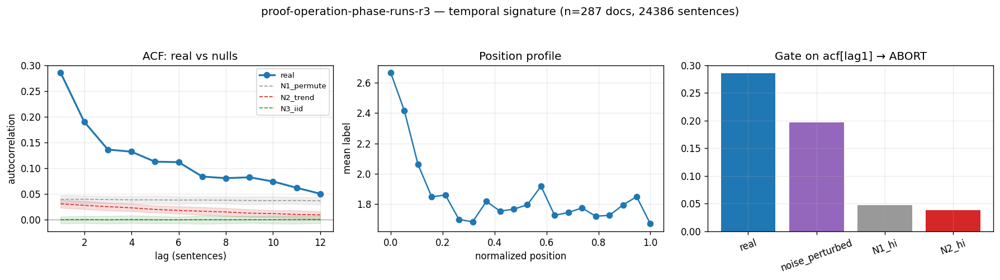

# Calibration record — `proof-operation-phase-runs-r3`

**Verdict: ABORT** (numeric gate passed; **mirror failed its preregistered gate-8 moment** — see § 4)

Calibration per the frozen [prereg card](../../prereg/proof-operation-phase-runs.md); domain `reasoning-trace`, 287 documents / 24386 labeled sentences (doc coverage 0.957).

## 1. Labeler + noise floor

- **Bulk judge:** `claude-haiku-4-5-20251001` (frozen instruction in the card); **second judge:** `claude-sonnet-5` on 12 held-out docs (1079 sentences).
- **Inter-judge:** agreement 0.685, κ = 0.586 → noise floor ε̂ = 0.172 (adequacy floor κ ≥ 0.3: PASS).
- **Independent heuristic cross-check:** accuracy 0.42, κ 0.23 (class 1: F1 0.61, class 2: F1 0.19, class 3: F1 0.14, class 4: F1 0.16).

## 2. Temporal signature vs nulls

| statistic | real | N1 permute | N2 trend | N3 iid |
|---|---|---|---|---|
| directed asymmetry (fwd−rev)/(fwd+rev) | **—** | — | — | — |
| P(dst @ t+1 | src @ t) forward | **—** | — | — | — |
| same, time-reversed | **—** | — | — | — |
| self-match ACF(1) | **0.286 [0.272, 0.300]** | 0.040 | 0.031 | -0.000 |
| dwell mean | **1.860 [1.826, 1.899]** | 1.391 | 1.379 | 1.337 |
| dwell CV | **0.910 [0.826, 1.028]** | 0.594 | 0.577 | 0.525 |

Marginal ['0.223', '0.334', '0.077', '0.080', '0.285']; Markov order-1 vs 0 p = 0.00e+00.

## 3. Gate (preregistered) + verdict

Primary statistic `acf[lag1]` (expected sign +): real **0.2857**, after ε̂-noise perturbation **0.1963**; N1 97.5% band hi 0.0474, N2 hi 0.0381.

- clears sampling noise (real > N1 hi AND N2 hi): **True**
- survives labeler noise floor (perturbed likewise): **True**
- labeler adequate (κ ≥ 0.3): **True**
- split-half stability: 0.2834 / 0.2879

**→ ABORT**

## 4. Mirror (Appendix B) + held-out validation

Process `seg_hier_categorical`; fit on 200 train docs, validated on 87 held-out docs. Fitted params:

```json
{
 "process": "seg_hier_categorical",
 "n_symbols": 5,
 "jump_P": [
  [
   0.0,
   0.3218189768255356,
   0.16965456930476608,
   0.062090074333187584,
   0.4464363795365107
  ],
  [
   0.4028309104820199,
   0.0,
   0.07612853863810252,
   0.21040550879877581,
   0.31063504208110176
  ],
  [
   0.20890774125132555,
   0.46129374337221635,
   0.0,
   0.09013785790031813,
   0.23966065747614
  ],
  [
   0.3394199785177229,
   0.3082706766917293,
   0.10848549946294307,
   0.0,
   0.24382384532760473
  ],
  [
   0.3089092422980849,
   0.511240632805995,
   0.10990840965861781,
   0.06994171523730225,
   0.0
  ]
 ],
 "tilt_seg": 1.0,
 "tilt_doc": 0.0,
 "doc_props": [
  [
   0.3333333333333333,
   0.19047619047619047,
   0.20952380952380953,
   0.0761904761904762,
   0.19047619047619047
  ],
  [
   0.1271186440677966,
   0.2457627118644068,
   0.00847457627118644,
   0.1440677966101695,
   0.4745762711864407
  ],
  [
   0.144,
   0.232,
   0.16,
   0.2,
   0.264
  ],
  [
   0.22641509433962265,
   0.5094339622641509,
   0.009433962264150943,
   0.07547169811320754,
   0.1792452830188679
  ],
  [
   0.09090909090909091,
   0.36363636363636365,
   0.09090909090909091,
   0.18181818181818182,
   0.2727272727272727
  ],
  [
   0.20408163265306123,
   0.3673469387755102,
   0.04081632653061224,
   0.11224489795918367,
   0.2755102040816326
  ],
  [
   0.21296296296296297,
   0.5277777777777778,
   0.027777777777777776,
   0.018518518518518517,
   0.21296296296296297
  ],
  [
   0.19607843137254902,
   0.5098039215686274,
   0.058823529411764705,
   0.058823529411764705,
   0.17647058823529413
  ],
  [
   0.2403846153846154,
   0.3557692307692308,
   0.10576923076923077,
   0.07692307692307693,
   0.22115384615384615
  ],
  [
   0.2638888888888889,
   0.19444444444444445,
   0.013888888888888888,
   0.1111111111111111,
   0.4166666666666667
  ],
  [
   0.3170731707317073,
   0.21951219512195122,
   0.0975609756097561,
   0.06097560975609756,
   0.3048780487804878
  ],
  [
   0.09090909090909091,
   0.45454545454545453,
   0.09090909090909091,
   0.09090909090909091,
   0.2727272727272727
  ],
  [
   0.1532258064516129,
   0.49193548387096775,
   0.08870967741935484,
   0.08064516129032258,
   0.18548387096774194
  ],
  [
   0.21495327102803738,
   0.3644859813084112,
   0.037383177570093455,
   0.07476635514018691,
   0.308411214953271
  ],
  [
   0.1,
   0.4,
   0.1,
   0.1,
   0.3
  ],
  [
   0.2978723404255319,
   0.1702127659574468,
   0.1276595744680851,
   0.031914893617021274,
   0.3723404255319149
  ],
  [
   0.2247191011235955,
   0.25842696629213485,
   0.15730337078651685,
   0.06741573033707865,
   0.29213483146067415
  ],
  [
   0.11023622047244094,
   0.2204724409448819,
   0.2755905511811024,
   0.15748031496062992,
   0.23622047244094488
  ],
  [
   0.07142857142857142,
   0.5,
   0.07142857142857142,
   0.14285714285714285,
   0.21428571428571427
  ],
  [
   0.35714285714285715,
   0.3492063492063492,
   0.023809523809523808,
   0.047619047619047616,
   0.2222222222222222
  ],
  [
   0.12658227848101267,
   0.3670886075949367,
   0.02531645569620253,
   0.05063291139240506,
   0.43037974683544306
  ],
  [
   0.31851851851851853,
   0.3333333333333333,
   0.044444444444444446,
   0.037037037037037035,
   0.26666666666666666
  ],
  [
   0.16279069767441862,
   0.2558139534883721,
   0.046511627906976744,
   0.06976744186046512,
   0.46511627906976744
  ],
  [
   0.13,
   0.32,
   0.13,
   0.15,
   0.27
  ],
  [
   0.14285714285714285,
   0.5546218487394958,
   0.03361344537815126,
   0.08403361344537816,
   0.18487394957983194
  ],
  [
   0.25757575757575757,
   0.3181818181818182,
   0.045454545454545456,
   0.13636363636363635,
   0.24242424242424243
  ],
  [
   0.2,
   0.3391304347826087,
   0.0782608695652174,
   0.22608695652173913,
   0.1565217391304348
  ],
  [
   0.10317460317460317,
   0.38095238095238093,
   0.18253968253968253,
   0.07936507936507936,
   0.25396825396825395
  ],
  [
   0.11678832116788321,
   0.3722627737226277,
   0.08029197080291971,
   0.029197080291970802,
   0.40145985401459855
  ],
  [
   0.42391304347826086,
   0.2717391304347826,
   0.08695652173913043,
   0.021739130434782608,
   0.1956521739130435
  ],
  [
   0.06451612903225806,
   0.16129032258064516,
   0.03225806451612903,
   0.06451612903225806,
   0.6774193548387096
  ],
  [
   0.17117117117117117,
   0.34234234234234234,
   0.018018018018018018,
   0.05405405405405406,
   0.4144144144144144
  ],
  [
   0.13333333333333333,
   0.4,
   0.06666666666666667,
   0.06666666666666667,
   0.3333333333333333
  ],
  [
   0.29914529914529914,
   0.19658119658119658,
   0.10256410256410256,
   0.17094017094017094,
   0.23076923076923078
  ],
  [
   0.35,
   0.2875,
   0.1375,
   0.0625,
   0.1625
  ],
  [
   0.09090909090909091,
   0.36363636363636365,
   0.09090909090909091,
   0.09090909090909091,
   0.36363636363636365
  ],
  [
   0.21739130434782608,
   0.25,
   0.07608695652173914,
   0.03260869565217391,
   0.42391304347826086
  ],
  [
   0.13829787234042554,
   0.5,
   0.010638297872340425,
   0.06382978723404255,
   0.2872340425531915
  ],
  [
   0.15178571428571427,
   0.4017857142857143,
   0.0625,
   0.08928571428571429,
   0.29464285714285715
  ],
  [
   0.20987654320987653,
   0.24691358024691357,
   0.08641975308641975,
   0.09876543209876543,
   0.35802469135802467
  ],
  [
   0.08333333333333333,
   0.3333333333333333,
   0.08333333333333333,
   0.08333333333333333,
   0.4166666666666667
  ],
  [
   0.19480519480519481,
   0.2727272727272727,
   0.07792207792207792,
   0.09090909090909091,
   0.36363636363636365
  ],
  [
   0.15306122448979592,
   0.45918367346938777,
   0.02040816326530612,
   0.061224489795918366,
   0.30612244897959184
  ],
  [
   0.32608695652173914,
   0.21739130434782608,
   0.1956521739130435,
   0.021739130434782608,
   0.2391304347826087
  ],
  [
   0.2523364485981308,
   0.37383177570093457,
   0.09345794392523364,
   0.06542056074766354,
   0.21495327102803738
  ],
  [
   0.1388888888888889,
   0.2777777777777778,
   0.027777777777777776,
   0.1111111111111111,
   0.4444444444444444
  ],
  [
   0.19117647058823528,
   0.27205882352941174,
   0.058823529411764705,
   0.1323529411764706,
   0.34558823529411764
  ],
  [
   0.29896907216494845,
   0.28865979381443296,
   0.08247422680412371,
   0.041237113402061855,
   0.28865979381443296
  ],
  [
   0.26515151515151514,
   0.3484848484848485,
   0.030303030303030304,
   0.12121212121212122,
   0.23484848484848486
  ],
  [
   0.27,
   0.15,
   0.05,
   0.03,
   0.5
  ],
  [
   0.20382165605095542,
   0.2484076433121019,
   0.11464968152866242,
   0.22929936305732485,
   0.20382165605095542
  ],
  [
   0.379746835443038,
   0.26582278481012656,
   0.11392405063291139,
   0.06329113924050633,
   0.17721518987341772
  ],
  [
   0.39603960396039606,
   0.26732673267326734,
   0.10891089108910891,
   0.039603960396039604,
   0.18811881188118812
  ],
  [
   0.2222222222222222,
   0.373015873015873,
   0.047619047619047616,
   0.09523809523809523,
   0.2619047619047619
  ],
  [
   0.24271844660194175,
   0.32038834951456313,
   0.02912621359223301,
   0.10679611650485436,
   0.30097087378640774
  ],
  [
   0.2375,
   0.3375,
   0.0625,
   0.075,
   0.2875
  ],
  [
   0.20224719101123595,
   0.3707865168539326,
   0.07865168539325842,
   0.0898876404494382,
   0.25842696629213485
  ],
  [
   0.18269230769230768,
   0.38461538461538464,
   0.07692307692307693,
   0.11538461538461539,
   0.2403846153846154
  ],
  [
   0.047619047619047616,
   0.3238095238095238,
   0.23809523809523808,
   0.14285714285714285,
   0.24761904761904763
  ],
  [
   0.05,
   0.45,
   0.15,
   0.05,
   0.3
  ],
  [
   0.10185185185185185,
   0.26851851851851855,
   0.08333333333333333,
   0.16666666666666666,
   0.37962962962962965
  ],
  [
   0.12903225806451613,
   0.45161290322580644,
   0.021505376344086023,
   0.0967741935483871,
   0.3010752688172043
  ],
  [
   0.27906976744186046,
   0.3023255813953488,
   0.14728682170542637,
   0.12403100775193798,
   0.14728682170542637
  ],
  [
   0.1951219512195122,
   0.34959349593495936,
   0.0975609756097561,
   0.07317073170731707,
   0.2845528455284553
  ],
  [
   0.35802469135802467,
   0.2345679012345679,
   0.1728395061728395,
   0.04938271604938271,
   0.18518518518518517
  ],
  [
   0.26506024096385544,
   0.3614457831325301,
   0.060240963855421686,
   0.12048192771084337,
   0.1927710843373494
  ],
  [
   0.35398230088495575,
   0.2920353982300885,
   0.017699115044247787,
   0.07079646017699115,
   0.26548672566371684
  ],
  [
   0.17142857142857143,
   0.34285714285714286,
   0.02857142857142857,
   0.12857142857142856,
   0.32857142857142857
  ],
  [
   0.3652173913043478,
   0.2956521739130435,
   0.02608695652173913,
   0.09565217391304348,
   0.21739130434782608
  ],
  [
   0.14912280701754385,
   0.3333333333333333,
   0.05263157894736842,
   0.16666666666666666,
   0.2982456140350877
  ],
  [
   0.3103448275862069,
   0.26436781609195403,
   0.12643678160919541,
   0.05747126436781609,
   0.2413793103448276
  ],
  [
   0.24444444444444444,
   0.43333333333333335,
   0.07777777777777778,
   0.06666666666666667,
   0.17777777777777778
  ],
  [
   0.25,
   0.3787878787878788,
   0.030303030303030304,
   0.12121212121212122,
   0.2196969696969697
  ],
  [
   0.26804123711340205,
   0.3711340206185567,
   0.05154639175257732,
   0.1134020618556701,
   0.1958762886597938
  ],
  [
   0.20512820512820512,
   0.28205128205128205,
   0.10256410256410256,
   0.13675213675213677,
   0.27350427350427353
  ],
  [
   0.22988505747126436,
   0.25287356321839083,
   0.20689655172413793,
   0.05747126436781609,
   0.25287356321839083
  ],
  [
   0.2988505747126437,
   0.26436781609195403,
   0.14942528735632185,
   0.011494252873563218,
   0.27586206896551724
  ],
  [
   0.26495726495726496,
   0.2564102564102564,
   0.13675213675213677,
   0.09401709401709402,
   0.24786324786324787
  ],
  [
   0.15517241379310345,
   0.3793103448275862,
   0.12931034482758622,
   0.1724137931034483,
   0.16379310344827586
  ],
  [
   0.07692307692307693,
   0.38461538461538464,
   0.07692307692307693,
   0.07692307692307693,
   0.38461538461538464
  ],
  [
   0.30434782608695654,
   0.22826086956521738,
   0.18478260869565216,
   0.07608695652173914,
   0.20652173913043478
  ],
  [
   0.13157894736842105,
   0.40350877192982454,
   0.07017543859649122,
   0.16666666666666666,
   0.22807017543859648
  ],
  [
   0.23958333333333334,
   0.375,
   0.052083333333333336,
   0.11458333333333333,
   0.21875
  ],
  [
   0.2777777777777778,
   0.3,
   0.07777777777777778,
   0.06666666666666667,
   0.2777777777777778
  ],
  [
   0.23469387755102042,
   0.3163265306122449,
   0.04081632653061224,
   0.12244897959183673,
   0.2857142857142857
  ],
  [
   0.2072072072072072,
   0.36036036036036034,
   0.09009009009009009,
   0.16216216216216217,
   0.18018018018018017
  ],
  [
   0.24761904761904763,
   0.3904761904761905,
   0.09523809523809523,
   0.009523809523809525,
   0.2571428571428571
  ],
  [
   0.16666666666666666,
   0.28125,
   0.041666666666666664,
   0.010416666666666666,
   0.5
  ],
  [
   0.0449438202247191,
   0.550561797752809,
   0.011235955056179775,
   0.033707865168539325,
   0.3595505617977528
  ],
  [
   0.19548872180451127,
   0.24812030075187969,
   0.06766917293233082,
   0.14285714285714285,
   0.3458646616541353
  ],
  [
   0.08333333333333333,
   0.5833333333333334,
   0.08333333333333333,
   0.08333333333333333,
   0.16666666666666666
  ],
  [
   0.22727272727272727,
   0.4659090909090909,
   0.09090909090909091,
   0.056818181818181816,
   0.1590909090909091
  ],
  [
   0.12631578947368421,
   0.4,
   0.09473684210526316,
   0.10526315789473684,
   0.2736842105263158
  ],
  [
   0.24691358024691357,
   0.30864197530864196,
   0.09876543209876543,
   0.024691358024691357,
   0.32098765432098764
  ],
  [
   0.06451612903225806,
   0.16129032258064516,
   0.03225806451612903,
   0.06451612903225806,
   0.6774193548387096
  ],
  [
   0.08333333333333333,
   0.4166666666666667,
   0.25,
   0.08333333333333333,
   0.16666666666666666
  ],
  [
   0.30434782608695654,
   0.19130434782608696,
   0.043478260869565216,
   0.11304347826086956,
   0.34782608695652173
  ],
  [
   0.16666666666666666,
   0.4166666666666667,
   0.08333333333333333,
   0.08333333333333333,
   0.25
  ],
  [
   0.16346153846153846,
   0.3942307692307692,
   0.07692307692307693,
   0.125,
   0.2403846153846154
  ],
  [
   0.34523809523809523,
   0.2619047619047619,
   0.047619047619047616,
   0.07142857142857142,
   0.27380952380952384
  ],
  [
   0.11607142857142858,
   0.3125,
   0.10714285714285714,
   0.07142857142857142,
   0.39285714285714285
  ],
  [
   0.17475728155339806,
   0.4854368932038835,
   0.13592233009708737,
   0.04854368932038835,
   0.1553398058252427
  ],
  [
   0.15584415584415584,
   0.18181818181818182,
   0.025974025974025976,
   0.012987012987012988,
   0.6233766233766234
  ],
  [
   0.2376237623762376,
   0.4158415841584158,
   0.019801980198019802,
   0.0297029702970297,
   0.297029702970297
  ],
  [
   0.2222222222222222,
   0.41975308641975306,
   0.024691358024691357,
   0.07407407407407407,
   0.25925925925925924
  ],
  [
   0.3644859813084112,
   0.24299065420560748,
   0.06542056074766354,
   0.04672897196261682,
   0.2803738317757009
  ],
  [
   0.1793103448275862,
   0.30344827586206896,
   0.14482758620689656,
   0.1724137931034483,
   0.2
  ],
  [
   0.3132530120481928,
   0.27710843373493976,
   0.14457831325301204,
   0.12048192771084337,
   0.14457831325301204
  ],
  [
   0.18691588785046728,
   0.4205607476635514,
   0.09345794392523364,
   0.009345794392523364,
   0.2897196261682243
  ],
  [
   0.20388349514563106,
   0.21359223300970873,
   0.038834951456310676,
   0.11650485436893204,
   0.42718446601941745
  ],
  [
   0.37254901960784315,
   0.2647058823529412,
   0.10784313725490197,
   0.0392156862745098,
   0.21568627450980393
  ],
  [
   0.2072072072072072,
   0.5405405405405406,
   0.05405405405405406,
   0.018018018018018018,
   0.18018018018018017
  ],
  [
   0.18691588785046728,
   0.4485981308411215,
   0.028037383177570093,
   0.06542056074766354,
   0.27102803738317754
  ],
  [
   0.08,
   0.48,
   0.013333333333333334,
   0.08,
   0.3466666666666667
  ],
  [
   0.03333333333333333,
   0.3,
   0.03333333333333333,
   0.03333333333333333,
   0.6
  ],
  [
   0.10344827586206896,
   0.3793103448275862,
   0.06896551724137931,
   0.034482758620689655,
   0.41379310344827586
  ],
  [
   0.21839080459770116,
   0.2471264367816092,
   0.1206896551724138,
   0.16091954022988506,
   0.25287356321839083
  ],
  [
   0.1375,
   0.275,
   0.025,
   0.1875,
   0.375
  ],
  [
   0.13953488372093023,
   0.2558139534883721,
   0.06976744186046512,
   0.06976744186046512,
   0.46511627906976744
  ],
  [
   0.49523809523809526,
   0.13333333333333333,
   0.06666666666666667,
   0.009523809523809525,
   0.29523809523809524
  ],
  [
   0.18556701030927836,
   0.18556701030927836,
   0.17525773195876287,
   0.08247422680412371,
   0.3711340206185567
  ],
  [
   0.3135593220338983,
   0.3050847457627119,
   0.0423728813559322,
   0.0847457627118644,
   0.2542372881355932
  ],
  [
   0.08,
   0.28,
   0.08,
   0.08,
   0.48
  ],
  [
   0.330188679245283,
   0.2169811320754717,
   0.12264150943396226,
   0.09433962264150944,
   0.2358490566037736
  ],
  [
   0.30327868852459017,
   0.2540983606557377,
   0.05737704918032787,
   0.040983606557377046,
   0.3442622950819672
  ],
  [
   0.34375,
   0.203125,
   0.046875,
   0.15625,
   0.25
  ],
  [
   0.2708333333333333,
   0.22916666666666666,
   0.052083333333333336,
   0.03125,
   0.4166666666666667
  ],
  [
   0.21153846153846154,
   0.3269230769230769,
   0.08653846153846154,
   0.11538461538461539,
   0.25961538461538464
  ],
  [
   0.13768115942028986,
   0.391304347826087,
   0.07246376811594203,
   0.13043478260869565,
   0.26811594202898553
  ],
  [
   0.12121212121212122,
   0.5555555555555556,
   0.030303030303030304,
   0.030303030303030304,
   0.26262626262626265
  ],
  [
   0.21505376344086022,
   0.3978494623655914,
   0.0967741935483871,
   0.010752688172043012,
   0.27956989247311825
  ],
  [
   0.17307692307692307,
   0.25,
   0.10576923076923077,
   0.038461538461538464,
   0.4326923076923077
  ],
  [
   0.27848101265822783,
   0.25316455696202533,
   0.13924050632911392,
   0.0759493670886076,
   0.25316455696202533
  ],
  [
   0.17307692307692307,
   0.3942307692307692,
   0.07692307692307693,
   0.11538461538461539,
   0.2403846153846154
  ],
  [
   0.0707070707070707,
   0.36363636363636365,
   0.1111111111111111,
   0.1414141414141414,
   0.31313131313131315
  ],
  [
   0.1232876712328767,
   0.3493150684931507,
   0.1643835616438356,
   0.1780821917808219,
   0.18493150684931506
  ],
  [
   0.32456140350877194,
   0.2894736842105263,
   0.043859649122807015,
   0.16666666666666666,
   0.17543859649122806
  ],
  [
   0.13513513513513514,
   0.35135135135135137,
   0.04054054054054054,
   0.10810810810810811,
   0.36486486486486486
  ],
  [
   0.18253968253968253,
   0.40476190476190477,
   0.07936507936507936,
   0.07142857142857142,
   0.2619047619047619
  ],
  [
   0.25757575757575757,
   0.3106060606060606,
   0.045454545454545456,
   0.14393939393939395,
   0.24242424242424243
  ],
  [
   0.2803738317757009,
   0.16822429906542055,
   0.028037383177570093,
   0.06542056074766354,
   0.45794392523364486
  ],
  [
   0.26515151515151514,
   0.4166666666666667,
   0.030303030303030304,
   0.12121212121212122,
   0.16666666666666666
  ],
  [
   0.029411764705882353,
   0.29411764705882354,
   0.029411764705882353,
   0.058823529411764705,
   0.5882352941176471
  ],
  [
   0.08333333333333333,
   0.3333333333333333,
   0.08333333333333333,
   0.08333333333333333,
   0.4166666666666667
  ],
  [
   0.2604166666666667,
   0.22916666666666666,
   0.07291666666666667,
   0.041666666666666664,
   0.3958333333333333
  ],
  [
   0.2073170731707317,
   0.18292682926829268,
   0.1951219512195122,
   0.0975609756097561,
   0.3170731707317073
  ],
  [
   0.3188405797101449,
   0.36231884057971014,
   0.014492753623188406,
   0.014492753623188406,
   0.2898550724637681
  ],
  [
   0.12903225806451613,
   0.45161290322580644,
   0.021505376344086023,
   0.0967741935483871,
   0.3010752688172043
  ],
  [
   0.0967741935483871,
   0.3870967741935484,
   0.06451612903225806,
   0.06451612903225806,
   0.3870967741935484
  ],
  [
   0.18269230769230768,
   0.38461538461538464,
   0.07692307692307693,
   0.11538461538461539,
   0.2403846153846154
  ],
  [
   0.3037974683544304,
   0.379746835443038,
   0.05063291139240506,
   0.08860759493670886,
   0.17721518987341772
  ],
  [
   0.2807017543859649,
   0.2894736842105263,
   0.12280701754385964,
   0.05263157894736842,
   0.2543859649122807
  ],
  [
   0.25,
   0.2619047619047619,
   0.16666666666666666,
   0.14285714285714285,
   0.17857142857142858
  ],
  [
   0.10416666666666667,
   0.4722222222222222,
   0.04861111111111111,
   0.1388888888888889,
   0.2361111111111111
  ],
  [
   0.16666666666666666,
   0.3541666666666667,
   0.10416666666666667,
   0.03125,
   0.34375
  ],
  [
   0.29347826086956524,
   0.2717391304347826,
   0.11956521739130435,
   0.06521739130434782,
   0.25
  ],
  [
   0.1796875,
   0.4921875,
   0.0703125,
   0.09375,
   0.1640625
  ],
  [
   0.28735632183908044,
   0.19540229885057472,
   0.10344827586206896,
   0.06896551724137931,
   0.3448275862068966
  ],
  [
   0.041666666666666664,
   0.5,
   0.041666666666666664,
   0.041666666666666664,
   0.375
  ],
  [
   0.20382165605095542,
   0.2484076433121019,
   0.10191082802547771,
   0.20382165605095542,
   0.24203821656050956
  ],
  [
   0.2222222222222222,
   0.4722222222222222,
   0.027777777777777776,
   0.07407407407407407,
   0.2037037037037037
  ],
  [
   0.14035087719298245,
   0.3157894736842105,
   0.05263157894736842,
   0.15789473684210525,
   0.3333333333333333
  ],
  [
   0.17142857142857143,
   0.34285714285714286,
   0.02857142857142857,
   0.12857142857142856,
   0.32857142857142857
  ],
  [
   0.08333333333333333,
   0.3333333333333333,
   0.08333333333333333,
   0.08333333333333333,
   0.4166666666666667
  ],
  [
   0.5280898876404494,
   0.16853932584269662,
   0.011235955056179775,
   0.011235955056179775,
   0.2808988764044944
  ],
  [
   0.16666666666666666,
   0.3333333333333333,
   0.022222222222222223,
   0.05555555555555555,
   0.4222222222222222
  ],
  [
   0.275,
   0.2625,
   0.1125,
   0.1125,
   0.2375
  ],
  [
   0.12643678160919541,
   0.4827586206896552,
   0.011494252873563218,
   0.034482758620689655,
   0.3448275862068966
  ],
  [
   0.14864864864864866,
   0.21621621621621623,
   0.21621621621621623,
   0.19594594594594594,
   0.22297297297297297
  ],
  [
   0.0625,
   0.4375,
   0.1875,
   0.0625,
   0.25
  ],
  [
   0.25190839694656486,
   0.3053435114503817,
   0.04580152671755725,
   0.1450381679389313,
   0.25190839694656486
  ],
  [
   0.1588785046728972,
   0.4485981308411215,
   0.037383177570093455,
   0.028037383177570093,
   0.32710280373831774
  ],
  [
   0.25,
   0.4090909090909091,
   0.022727272727272728,
   0.1590909090909091,
   0.1590909090909091
  ],
  [
   0.19230769230769232,
   0.34615384615384615,
   0.08653846153846154,
   0.11538461538461539,
   0.25961538461538464
  ],
  [
   0.36633663366336633,
   0.26732673267326734,
   0.07920792079207921,
   0.10891089108910891,
   0.1782178217821782
  ],
  [
   0.3333333333333333,
   0.13333333333333333,
   0.14285714285714285,
   0.009523809523809525,
   0.38095238095238093
  ],
  [
   0.15625,
   0.46875,
   0.03125,
   0.046875,
   0.296875
  ],
  [
   0.13157894736842105,
   0.40350877192982454,
   0.07017543859649122,
   0.16666666666666666,
   0.22807017543859648
  ],
  [
   0.2127659574468085,
   0.44680851063829785,
   0.031914893617021274,
   0.09574468085106383,
   0.2127659574468085
  ],
  [
   0.09734513274336283,
   0.39823008849557523,
   0.08849557522123894,
   0.07079646017699115,
   0.34513274336283184
  ],
  [
   0.31451612903225806,
   0.27419354838709675,
   0.10483870967741936,
   0.08870967741935484,
   0.21774193548387097
  ],
  [
   0.27941176470588236,
   0.5588235294117647,
   0.029411764705882353,
   0.014705882352941176,
   0.11764705882352941
  ],
  [
   0.16666666666666666,
   0.37719298245614036,
   0.14912280701754385,
   0.05263157894736842,
   0.2543859649122807
  ],
  [
   0.2523364485981308,
   0.2803738317757009,
   0.028037383177570093,
   0.018691588785046728,
   0.4205607476635514
  ],
  [
   0.4537037037037037,
   0.16666666666666666,
   0.10185185185185185,
   0.08333333333333333,
   0.19444444444444445
  ],
  [
   0.20168067226890757,
   0.31092436974789917,
   0.05042016806722689,
   0.05042016806722689,
   0.3865546218487395
  ],
  [
   0.1592920353982301,
   0.4336283185840708,
   0.07964601769911504,
   0.07079646017699115,
   0.25663716814159293
  ],
  [
   0.26136363636363635,
   0.2159090909090909,
   0.2159090909090909,
   0.06818181818181818,
   0.23863636363636365
  ],
  [
   0.4117647058823529,
   0.19607843137254902,
   0.1568627450980392,
   0.00980392156862745,
   0.22549019607843138
  ],
  [
   0.2727272727272727,
   0.18181818181818182,
   0.2159090909090909,
   0.07954545454545454,
   0.25
  ],
  [
   0.12,
   0.33,
   0.11,
   0.09,
   0.35
  ],
  [
   0.17142857142857143,
   0.34285714285714286,
   0.02857142857142857,
   0.12857142857142856,
   0.32857142857142857
  ],
  [
   0.2872340425531915,
   0.23404255319148937,
   0.06382978723404255,
   0.02127659574468085,
   0.39361702127659576
  ],
  [
   0.1595744680851064,
   0.19148936170212766,
   0.09574468085106383,
   0.02127659574468085,
   0.5319148936170213
  ],
  [
   0.21739130434782608,
   0.31521739130434784,
   0.05434782608695652,
   0.010869565217391304,
   0.40217391304347827
  ],
  [
   0.25675675675675674,
   0.16216216216216217,
   0.04054054054054054,
   0.05405405405405406,
   0.4864864864864865
  ],
  [
   0.35064935064935066,
   0.35064935064935066,
   0.06493506493506493,
   0.03896103896103896,
   0.19480519480519481
  ],
  [
   0.3305785123966942,
   0.35537190082644626,
   0.03305785123966942,
   0.09090909090909091,
   0.19008264462809918
  ],
  [
   0.7767857142857143,
   0.09821428571428571,
   0.05357142857142857,
   0.008928571428571428,
   0.0625
  ],
  [
   0.08333333333333333,
   0.3333333333333333,
   0.08333333333333333,
   0.08333333333333333,
   0.4166666666666667
  ]
 ],
 "seg_tables": [
  [
   [
    57,
    [
     0.6898423240834886,
     0.116495154556699,
     0.0483325595825045,
     0.020989121852578483,
     0.12434083992472943
    ]
   ],
   [
    43,
    [
     0.1001647158244638,
     0.03334241438939204,
     0.783842487340666,
     0.047305797394226475,
     0.03534458505125174
    ]
   ]
  ],
  [
   [
    113,
    [
     0.056189014332253207,
     0.09203243165432944,
     9.961198079536857e-07,
     0.07190891899702785,
     0.7798686388965816
    ]
   ]
  ],
  [
   [
    29,
    [
     0.029254504898465976,
     9.66357568200778e-07,
     0.8433159741201337,
     9.66357568200778e-07,
     0.12742758826626405
    ]
   ],
   [
    91,
    [
     0.14247680473900753,
     0.2600485661065238,
     0.08198719152934499,
     0.3606629402130706,
     0.15482449741205312
    ]
   ]
  ],
  [
   [
    101,
    [
     0.08580801267399911,
     0.8332088511788971,
     9.918602750001158e-07,
     0.026970684940282694,
     0.054011459346546144
    ]
   ]
  ],
  [
   [
    6,
    [
     9.974078238999097e-07,
     0.7202252625986485,
     9.974078238999097e-07,
     0.10601841837747443,
     0.17375432420822934
    ]
   ]
  ],
  [
   [
    93,
    [
     0.20892190857047374,
     0.39874573635087135,
     0.03325790897919427,
     0.10727282107961914,
     0.25180162501984166
    ]
   ]
  ],
  [
   [
    103,
    [
     0.0443484625501001,
     0.9121452729551761,
     0.004758169104386986,
     0.002119926431851127,
     0.03662816895848573
    ]
   ]
  ],
  [
   [
    17,
    [
     0.06499073513317526,
     0.1740502628652473,
     0.038942729752200894,
     9.97074939365096e-07,
     0.7220152751744371
    ]
   ],
   [
    29,
    [
     3.7348166386266365e-07,
     0.9999985060733444,
     3.7348166386266365e-07,
     3.7348166386266365e-07,
     3.7348166386266365e-07
    ]
   ]
  ],
  [
   [
    37,
    [
     0.035956211365829195,
     0.01383406348384099,
     0.08144640155125943,
     0.03974432012009672,
     0.8290190034789737
    ]
   ],
   [
    62,
    [
     0.13466472739216132,
     0.8140838811020267,
     0.02193601558842691,
     0.01955235760964637,
     0.009763018307738847
    ]
   ]
  ],
  [
   [
    37,
    [
     3.423491030046011e-07,
     3.423491030046011e-07,
     3.423491030046011e-07,
     3.423491030046011e-07,
     0.999998630603588
    ]
   ],
   [
    20,
    [
     0.07000468471224679,
     0.9021841141863884,
     9.67560108722264e-07,
     9.67560108722264e-07,
     0.027809265981147396
    ]
   ],
   [
    10,
    [
     2.5002941153224946e-07,
     2.5002941153224946e-07,
     2.5002941153224946e-07,
     0.9999989998823539,
     2.5002941153224946e-07
    ]
   ]
  ],
  [
   [
    53,
    [
     0.8159509097232245,
     0.06419544509526534,
     0.058210486019319246,
     0.028808324093507198,
     0.03283483506868375
    ]
   ],
   [
    24,
    [
     3.0841868762499894e-07,
     3.0841868762499894e-07,
     3.0841868762499894e-07,
     3.0841868762499894e-07,
     0.9999987663252494
    ]
   ]
  ],
  [
   [
    6,
    [
     3.6704236556122776e-07,
     0.9999985318305376,
     3.6704236556122776e-07,
     3.6704236556122776e-07,
     3.6704236556122776e-07
    ]
   ]
  ],
  [
   [
    40,
    [
     0.10279623028715897,
     0.4446489413484279,
     0.2867833149037365,
     9.999997626681867e-07,
     0.16577051346091373
    ]
   ],
   [
    79,
    [
     0.03828056709314973,
     0.8976817936013844,
     0.003495942792135833,
     0.028881468987143895,
     0.03166022752618599
    ]
   ]
  ],
  [
   [
    93,
    [
     0.19779555441529567,
     0.4182825457867809,
     0.021020283208373628,
     0.028387997680974907,
     0.33451361890857495
    ]
   ],
   [
    9,
    [
     0.142678877593698,
     0.03313590881240472,
     0.05294441636371955,
     0.7712398035227296,
     9.937074482677906e-07
    ]
   ]
  ],
  [
   [
    5,
    [
     4.078305033652561e-07,
     0.9999983686779863,
     4.078305033652561e-07,
     4.078305033652561e-07,
     4.078305033652561e-07
    ]
   ]
  ],
  [
   [
    89,
    [
     0.347932262181493,
     0.11174163282021606,
     0.1310575723967865,
     0.018857429129294147,
     0.3904111034722105
    ]
   ]
  ],
  [
   [
    29,
    [
     0.18493647197054094,
     0.06332333870299076,
     0.07526880515763258,
     9.99096879155541e-07,
     0.6764703850719564
    ]
   ],
   [
    24,
    [
     0.8294912345591028,
     0.1360865244069076,
     0.034420287536276205,
     9.767488567910605e-07,
     9.767488567910605e-07
    ]
   ],
   [
    31,
    [
     9.999974256430118e-07,
     0.1545673985909983,
     0.37216816492105875,
     0.1543035170143128,
     0.3189599194762044
    ]
   ]
  ],
  [
   [
    47,
    [
     2.827113105555656e-07,
     2.827113105555656e-07,
     0.9999988691547578,
     2.827113105555656e-07,
     2.827113105555656e-07
    ]
   ],
   [
    75,
    [
     0.08138463899439144,
     0.32299696026425306,
     0.11956546588872857,
     0.3041571923689622,
     0.17189574248366465
    ]
   ]
  ],
  [
   [
    9,
    [
     3.6704199847417686e-07,
     0.9999985318320059,
     3.6704199847417686e-07,
     3.6704199847417686e-07,
     3.6704199847417686e-07
    ]
   ]
  ],
  [
   [
    13,
    [
     3.34123215254689e-07,
     3.34123215254689e-07,
     3.34123215254689e-07,
     3.34123215254689e-07,
     0.999998663507139
    ]
   ],
   [
    108,
    [
     0.5786839624207623,
     0.2807751662369447,
     0.007395806982093541,
     0.033952498091157336,
     0.09919256626904231
    ]
   ]
  ],
  [
   [
    74,
    [
     0.08433269330449693,
     0.2537627593585621,
     0.010683456592541454,
     0.029185929216476482,
     0.622035161527923
    ]
   ]
  ],
  [
   [
    130,
    [
     0.4351027862042969,
     0.28269897863871735,
     0.037455169781488835,
     0.026472723189253585,
     0.21827034218624342
    ]
   ]
  ],
  [
   [
    38,
    [
     0.05468648328594231,
     0.07325224783541821,
     0.010718403375825995,
     0.01932715973686153,
     0.8420157057659519
    ]
   ]
  ],
  [
   [
    29,
    [
     0.04808953117733388,
     0.1235252601438252,
     0.039127125686884826,
     0.017085056266750324,
     0.7721730267252057
    ]
   ],
   [
    26,
    [
     3.534462174061998e-07,
     0.9999985862151302,
     3.534462174061998e-07,
     3.534462174061998e-07,
     3.534462174061998e-07
    ]
   ],
   [
    40,
    [
     0.14233409493089585,
     0.05833478596572835,
     0.09496338574900191,
     0.479453178063588,
     0.22491455529078586
    ]
   ]
  ],
  [
   [
    114,
    [
     0.007720656638804393,
     0.9772939313667014,
     0.0017718357444418073,
     0.004765503090788977,
     0.008448073159263207
    ]
   ]
  ],
  [
   [
    45,
    [
     0.99999866598889,
     3.335027774632419e-07,
     3.335027774632419e-07,
     3.335027774632419e-07,
     3.335027774632419e-07
    ]
   ],
   [
    64,
    [
     0.07981590426992241,
     0.30524235112313397,
     0.0821579752828904,
     0.10545515700012757,
     0.4273286123239257
    ]
   ],
   [
    18,
    [
     3.1504466134242907e-07,
     3.1504466134242907e-07,
     3.1504466134242907e-07,
     0.9999987398213546,
     3.1504466134242907e-07
    ]
   ]
  ],
  [
   [
    46,
    [
     0.08571021486573276,
     0.6554788572918135,
     0.08824593764009933,
     9.995032936436918e-07,
     0.1705639906990607
    ]
   ],
   [
    64,
    [
     0.14873562037928606,
     0.1122954595812789,
     0.030142860746687757,
     0.6817384598761161,
     0.027087599416631143
    ]
   ]
  ],
  [
   [
    29,
    [
     0.05235951818799043,
     0.01319272024828911,
     0.6712628704709308,
     9.935090764604994e-07,
     0.263183897583713
    ]
   ],
   [
    92,
    [
     0.053368947158801874,
     0.7174592070048257,
     0.0829694415728647,
     0.0591153857375602,
     0.08708701852594766
    ]
   ]
  ],
  [
   [
    132,
    [
     0.09179297277916076,
     0.3235488884563518,
     0.07394331193460732,
     0.01870593332084228,
     0.4920088935090378
    ]
   ]
  ],
  [
   [
    47,
    [
     0.9994850137066928,
     9.581897191191888e-05,
     0.0002099111262824547,
     2.678968189012138e-05,
     0.00018246651322274788
    ]
   ],
   [
    40,
    [
     0.3101564660471774,
     0.5645038290633442,
     9.998545336903808e-07,
     9.998545336903808e-07,
     0.1253377051804109
    ]
   ]
  ],
  [
   [
    26,
    [
     3.0070711771350066e-07,
     3.0070711771350066e-07,
     3.0070711771350066e-07,
     3.0070711771350066e-07,
     0.9999987971715291
    ]
   ]
  ],
  [
   [
    54,
    [
     0.3468564986642242,
     0.2541360768843909,
     0.017760578849519596,
     9.999996273052889e-07,
     0.3812458456022379
    ]
   ],
   [
    9,
    [
     3.1504497642332504e-07,
     3.1504497642332504e-07,
     3.1504497642332504e-07,
     0.9999987398200942,
     3.1504497642332504e-07
    ]
   ],
   [
    43,
    [
     3.9787030595766603e-07,
     3.9787030595766603e-07,
     3.9787030595766603e-07,
     3.9787030595766603e-07,
     0.9999984085187761
    ]
   ]
  ],
  [
   [
    10,
    [
     0.055240206051983855,
     0.7192165972455887,
     9.94873626002655e-07,
     9.94873626002655e-07,
     0.22554120695517538
    ]
   ]
  ],
  [
   [
    13,
    [
     0.21366650534104217,
     9.94061297686533e-07,
     0.04303695112514234,
     9.94061297686533e-07,
     0.7432945554112202
    ]
   ],
   [
    63,
    [
     0.15939516557827324,
     0.3025799418350717,
     0.18389124177493082,
     0.3117503601200627,
     0.042383290691661656
    ]
   ],
   [
    36,
    [
     0.9951870171855068,
     5.349654203639428e-07,
     5.349654203639428e-07,
     0.00100345324011231,
     0.0038084596435401467
    ]
   ]
  ],
  [
   [
    20,
    [
     0.9999988142271229,
     2.9644321923696234e-07,
     2.9644321923696234e-07,
     2.9644321923696234e-07,
     2.9644321923696234e-07
    ]
   ],
   [
    44,
    [
     0.252092294316127,
     0.44955242339432455,
     0.2624715128664442,
     0.035882769423927645,
     9.999991765636296e-07
    ]
   ],
   [
    11,
    [
     0.1287515984310052,
     0.09791921882919023,
     9.997465649189963e-07,
     0.14433061829755275,
     0.628997564695687
    ]
   ]
  ],
  [
   [
    6,
    [
     3.9517704323290917e-07,
     1.9612278626172787e-06,
     3.9517704323290917e-07,
     3.9517704323290917e-07,
     0.9999968532410076
    ]
   ]
  ],
  [
   [
    87,
    [
     0.1766294202466084,
     0.1573686204726987,
     0.06020286961207057,
     0.017145745614057673,
     0.5886533440545646
    ]
   ]
  ],
  [
   [
    89,
    [
     0.04878774489720509,
     0.8370453105595415,
     9.901450111214927e-07,
     0.021745080343470648,
     0.09242087405477162
    ]
   ]
  ],
  [
   [
    41,
    [
     3.7274288380156514e-07,
     3.7274288380156514e-07,
     3.7274288380156514e-07,
     3.7274288380156514e-07,
     0.9999985090284648
    ]
   ],
   [
    66,
    [
     0.08800426554179039,
     0.7048499406936856,
     0.06333840850560843,
     0.08711225254806003,
     0.056695132710855495
    ]
   ]
  ],
  [
   [
    35,
    [
     4.2556136560089945e-07,
     3.8078507471519516e-07,
     3.8078507471519516e-07,
     3.8078507471519516e-07,
     0.9999984320834102
    ]
   ],
   [
    41,
    [
     0.13681830251184424,
     0.3677141144061703,
     0.17674481655529714,
     0.18645301773105988,
     0.13226974879562836
    ]
   ]
  ],
  [
   [
    7,
    [
     4.048134275767271e-07,
     4.048134275767271e-07,
     4.048134275767271e-07,
     4.048134275767271e-07,
     0.9999983807462897
    ]
   ]
  ],
  [
   [
    36,
    [
     1.551149349293978e-05,
     4.0178616563383874e-07,
     5.460280834999889e-06,
     1.2197832568247082e-05,
     0.9999664286069382
    ]
   ],
   [
    36,
    [
     0.03936790020795762,
     0.9112856910237468,
     0.020362560197965496,
     0.00597283577694818,
     0.02301101279338195
    ]
   ]
  ],
  [
   [
    71,
    [
     0.11586306762943203,
     0.4108602912598702,
     0.01278456449728307,
     0.011407876780238533,
     0.44908419983317616
    ]
   ],
   [
    22,
    [
     4.516732156817112e-07,
     0.9999982700446366,
     3.905112573294138e-07,
     4.972596328926266e-07,
     3.905112573294138e-07
    ]
   ]
  ],
  [
   [
    13,
    [
     2.73368068919653e-07,
     2.73368068919653e-07,
     2.73368068919653e-07,
     2.73368068919653e-07,
     0.9999989065277243
    ]
   ],
   [
    74,
    [
     0.4775133603309694,
     0.16573431330243846,
     0.2624301667415356,
     0.01027941331611277,
     0.08404274630894368
    ]
   ]
  ],
  [
   [
    37,
    [
     0.035956211365829195,
     0.01383406348384099,
     0.08144640155125943,
     0.03974432012009672,
     0.8290190034789737
    ]
   ],
   [
    65,
    [
     0.07502669923465989,
     0.9049585454507212,
     0.007796806402761246,
     0.006960705867029311,
     0.005257243044828224
    ]
   ]
  ],
  [
   [
    31,
    [
     0.05775340628030007,
     0.10821330412999854,
     9.950210091066354e-07,
     0.04714866789994348,
     0.7868836266687489
    ]
   ]
  ],
  [
   [
    131,
    [
     0.1919781995370844,
     0.22779360267052381,
     0.056732618599408854,
     0.13411686737364992,
     0.389378711819333
    ]
   ]
  ],
  [
   [
    92,
    [
     0.39423684651841356,
     0.23797988962977407,
     0.07995155774272106,
     0.029011541081464743,
     0.2588201650276265
    ]
   ]
  ],
  [
   [
    52,
    [
     0.9999980441525218,
     7.059098168486906e-07,
     3.3161043594168515e-07,
     3.3161043594168515e-07,
     5.867167892998523e-07
    ]
   ],
   [
    17,
    [
     0.033350158386859924,
     0.6487037610354343,
     0.08702152117516207,
     0.23092355985480184,
     9.995477418446426e-07
    ]
   ],
   [
    40,
    [
     0.0652244397340564,
     0.17499053421184246,
     0.015246348521592174,
     9.94958888235186e-07,
     0.7445376825736207
    ]
   ],
   [
    18,
    [
     3.1504466134242907e-07,
     3.1504466134242907e-07,
     3.1504466134242907e-07,
     0.9999987398213546,
     3.1504466134242907e-07
    ]
   ]
  ],
  [
   [
    52,
    [
     0.007668222871013539,
     6.398897667217461e-07,
     0.001481587857789175,
     6.398897667217461e-07,
     0.9908489094916639
    ]
   ],
   [
    43,
    [
     0.11800444436005747,
     0.206679966225136,
     0.018664429470235524,
     0.033881634793287846,
     0.6227695251512831
    ]
   ]
  ],
  [
   [
    12,
    [
     0.9999986786939608,
     3.303265097599246e-07,
     3.303265097599246e-07,
     3.303265097599246e-07,
     3.303265097599246e-07
    ]
   ],
   [
    36,
    [
     0.03831871328317454,
     0.9222391342053982,
     0.029212407043388216,
     0.010228772693736798,
     9.727743023093627e-07
    ]
   ],
   [
    104,
    [
     0.12562335312862843,
     0.10238722501421149,
     0.11464262321975896,
     0.47564230779530636,
     0.18170449084209475
    ]
   ]
  ],
  [
   [
    20,
    [
     0.9999988142271229,
     2.9644321923696234e-07,
     2.9644321923696234e-07,
     2.9644321923696234e-07,
     2.9644321923696234e-07
    ]
   ],
   [
    41,
    [
     0.3335308852354312,
     0.41269575785511653,
     0.21458676311252275,
     0.039185593798592794,
     9.999983368170055e-07
    ]
   ],
   [
    13,
    [
     0.16603195800486323,
     0.07890503690156242,
     9.996440130198805e-07,
     0.114792150294061,
     0.6402698551555003
    ]
   ]
  ],
  [
   [
    16,
    [
     2.643548463392669e-07,
     2.643548463392669e-07,
     2.643548463392669e-07,
     2.643548463392669e-07,
     0.9999989425806146
    ]
   ],
   [
    80,
    [
     0.9050989584830692,
     0.05168603418900544,
     0.0272464553214947,
     0.00794875051385412,
     0.008019801492576478
    ]
   ]
  ],
  [
   [
    34,
    [
     0.34151290053544164,
     0.014978279814206668,
     0.10293118021894598,
     0.021070668924017686,
     0.519506970507388
    ]
   ],
   [
    76,
    [
     1.9203016532334857e-05,
     0.9999437220707226,
     3.9563351583598313e-07,
     1.2684580535847284e-05,
     2.39946986934207e-05
    ]
   ],
   [
    11,
    [
     0.5791198855562643,
     9.995739455812295e-07,
     0.0643414981297197,
     0.31402898176919125,
     0.0425086349708792
    ]
   ]
  ],
  [
   [
    8,
    [
     1.0078109046857741e-05,
     4.1467356529026703e-07,
     2.4834273128258752e-05,
     4.1467356529026703e-07,
     0.9999642582706944
    ]
   ],
   [
    90,
    [
     0.29215636656502797,
     0.34694854226490895,
     9.999999722946218e-07,
     0.1113977443523415,
     0.2494963468177492
    ]
   ]
  ],
  [
   [
    12,
    [
     0.02190039893403558,
     9.094133224269135e-07,
     0.017908772235404602,
     9.094133224269135e-07,
     0.960189010003915
    ]
   ],
   [
    40,
    [
     0.5278695031440619,
     0.29890386709312755,
     0.04280198063820596,
     0.10191161397718715,
     0.02851303514741756
    ]
   ],
   [
    23,
    [
     4.092625564955235e-07,
     4.092625564955235e-07,
     4.092625564955235e-07,
     4.092625564955235e-07,
     0.999998362949774
    ]
   ]
  ],
  [
   [
    47,
    [
     0.25349845937486915,
     0.24756020150470764,
     0.01982175856284537,
     9.99986894849503e-07,
     0.4791185805706829
    ]
   ],
   [
    37,
    [
     0.10334171127591374,
     0.5439119563398433,
     0.13144414191453999,
     0.17261908020893202,
     0.04868311026077104
    ]
   ]
  ],
  [
   [
    17,
    [
     2.808786294383096e-07,
     2.808786294383096e-07,
     2.808786294383096e-07,
     2.808786294383096e-07,
     0.9999988764854822
    ]
   ],
   [
    82,
    [
     0.1530822814544401,
     0.6263791576875697,
     0.04941831078900153,
     0.10295012136889418,
     0.06817012870009455
    ]
   ]
  ],
  [
   [
    25,
    [
     3.401714058671428e-07,
     3.401714058671428e-07,
     3.401714058671428e-07,
     3.401714058671428e-07,
     0.9999986393143765
    ]
   ],
   [
    25,
    [
     9.97883755287878e-07,
     0.7468753251450706,
     0.12139038622599437,
     0.13173229286142446,
     9.97883755287878e-07
    ]
   ],
   [
    27,
    [
     0.005602768002907525,
     9.598762290163742e-07,
     0.9156230834739698,
     0.04508864102213593,
     0.03368454762475787
    ]
   ],
   [
    23,
    [
     2.962016089022162e-07,
     0.9999988151935643,
     2.962016089022162e-07,
     2.962016089022162e-07,
     2.962016089022162e-07
    ]
   ]
  ],
  [
   [
    15,
    [
     9.882583364311603e-07,
     0.8383627167254554,
     0.058162291805279875,
     9.882583364311603e-07,
     0.1034730149525918
    ]
   ]
  ],
  [
   [
    36,
    [
     0.11180623879575806,
     0.06705728921345966,
     0.2671107687253158,
     0.09684076616251504,
     0.4571849371029514
    ]
   ],
   [
    67,
    [
     0.06168147470714948,
     0.32327898152929324,
     9.99998830315794e-07,
     0.2095997181767404,
     0.4054388255879866
    ]
   ]
  ],
  [
   [
    88,
    [
     0.08693464019049844,
     0.6319433284468153,
     0.008970151032130698,
     0.0682050372372258,
     0.2039468430933299
    ]
   ]
  ],
  [
   [
    12,
    [
     0.9999984584489313,
     3.8538776712172555e-07,
     3.8538776712172555e-07,
     3.8538776712172555e-07,
     3.8538776712172555e-07
    ]
   ],
   [
    35,
    [
     3.5684479399557974e-07,
     0.9999985726208238,
     3.5684479399557974e-07,
     3.5684479399557974e-07,
     3.5684479399557974e-07
    ]
   ],
   [
    77,
    [
     0.3786861893122683,
     0.12327718497207066,
     0.1950754457914605,
     0.2031728576050893,
     0.09978832231911117
    ]
   ]
  ],
  [
   [
    118,
    [
     0.2000541568997422,
     0.3590270480697841,
     0.10541052047773057,
     0.06558253552308205,
     0.26992573902966105
    ]
   ]
  ],
  [
   [
    19,
    [
     0.9999985355334354,
     3.6611664108172136e-07,
     3.6611664108172136e-07,
     3.6611664108172136e-07,
     3.6611664108172136e-07
    ]
   ],
   [
    44,
    [
     0.24194838818969241,
     0.31738585147964193,
     0.42776671368459523,
     9.999763095855358e-07,
     0.012898046669760885
    ]
   ],
   [
    13,
    [
     0.7946169593960064,
     9.92094275454597e-07,
     9.92094275454597e-07,
     0.102177320767305,
     0.10320373564813762
    ]
   ]
  ],
  [
   [
    78,
    [
     0.3116397826318062,
     0.37071142241868216,
     0.05317076481707372,
     0.114275314964358,
     0.15020271516807981
    ]
   ]
  ],
  [
   [
    26,
    [
     2.7336779552655535e-07,
     2.7336779552655535e-07,
     2.7336779552655535e-07,
     2.7336779552655535e-07,
     0.9999989065288178
    ]
   ],
   [
    82,
    [
     0.8149579930163093,
     0.11964013823652352,
     0.005325052719364291,
     0.0343334209508419,
     0.025743395076960846
    ]
   ]
  ],
  [
   [
    16,
    [
     3.7011032170744136e-07,
     3.7011032170744136e-07,
     3.7011032170744136e-07,
     3.7011032170744136e-07,
     0.9999985195587131
    ]
   ],
   [
    49,
    [
     0.09350972850252974,
     0.5729359075667956,
     0.0177198007849363,
     0.14564220769021943,
     0.17019235545551906
    ]
   ]
  ],
  [
   [
    110,
    [
     0.5889207024362558,
     0.1894777423126616,
     0.014778450996331016,
     0.06994617044286462,
     0.13687693381188698
    ]
   ]
  ],
  [
   [
    45,
    [
     0.09523785708866128,
     9.989020054188288e-07,
     0.056234537710894025,
     0.13752383154340314,
     0.7110027747550363
    ]
   ],
   [
    64,
    [
     0.004015360880857361,
     0.9867641031592049,
     0.0006160549730370838,
     0.004422639106410473,
     0.0041818418804903884
    ]
   ]
  ],
  [
   [
    23,
    [
     0.8623903701667777,
     9.779540247096153e-07,
     0.04372848871401061,
     9.779540247096153e-07,
     0.09387918521116229
    ]
   ],
   [
    29,
    [
     0.2368323906992094,
     0.6990121186924769,
     9.972550163110161e-07,
     9.972550163110161e-07,
     0.06415349609828111
    ]
   ],
   [
    30,
    [
     0.15548477234309221,
     0.17559909915965538,
     0.34668537871189964,
     0.13346161139099294,
     0.18876913839435963
    ]
   ]
  ],
  [
   [
    85,
    [
     0.2244701630848515,
     0.5446780677573516,
     0.06557809570634471,
     0.04792618267919208,
     0.11734749077226024
    ]
   ]
  ],
  [
   [
    45,
    [
     0.99999866598889,
     3.335027774632419e-07,
     3.335027774632419e-07,
     3.335027774632419e-07,
     3.335027774632419e-07
    ]
   ],
   [
    63,
    [
     0.07269818965018719,
     0.5487794153816593,
     0.043413069830400206,
     0.066234361598822,
     0.26887496353893114
    ]
   ],
   [
    19,
    [
     3.325496357927639e-07,
     3.325496357927639e-07,
     3.325496357927639e-07,
     0.9999986698014568,
     3.325496357927639e-07
    ]
   ]
  ],
  [
   [
    92,
    [
     0.3125202663145777,
     0.38540109788312604,
     0.0443179758199352,
     0.10581025046521954,
     0.1519504095171415
    ]
   ]
  ],
  [
   [
    38,
    [
     4.806013317965874e-06,
     2.649304567832504e-05,
     2.9606613382657744e-06,
     3.6688440772670176e-07,
     0.9999653733952577
    ]
   ],
   [
    74,
    [
     0.33570398449898137,
     0.1846035086249822,
     0.1548014074500346,
     0.22681046422129209,
     0.09808063520470958
    ]
   ]
  ],
  [
   [
    54,
    [
     0.4132409509001916,
     0.23488135417736172,
     0.1197893700912095,
     9.999973236954717e-07,
     0.23208732483391348
    ]
   ],
   [
    28,
    [
     0.02206691536959759,
     0.04448145007915536,
     0.8261603004930674,
     0.050046978290647845,
     0.057244355767531827
    ]
   ]
  ],
  [
   [
    23,
    [
     0.42313274723284494,
     9.999787379474932e-07,
     0.11306135167453989,
     9.999787379474932e-07,
     0.4638039011351392
    ]
   ],
   [
    30,
    [
     0.22929537586085008,
     0.7290282202946654,
     9.949444069884298e-07,
     9.949444069884298e-07,
     0.041674413955670446
    ]
   ],
   [
    29,
    [
     0.12872146797347125,
     0.12050072325369637,
     0.5368315655397478,
     9.998814393453149e-07,
     0.2139452433516452
    ]
   ]
  ],
  [
   [
    24,
    [
     0.06380400034705778,
     0.015925642335003345,
     0.6788993519615891,
     9.946287053896892e-07,
     0.24137001072764427
    ]
   ],
   [
    28,
    [
     4.279384655550741e-07,
     0.9999982882461376,
     4.279384655550741e-07,
     4.279384655550741e-07,
     4.279384655550741e-07
    ]
   ],
   [
    60,
    [
     0.28748654550915026,
     0.15221276429927755,
     0.11392976263341814,
     0.18431228139068612,
     0.2620586461674679
    ]
   ]
  ],
  [
   [
    13,
    [
     2.4337103945168628e-06,
     4.289771948620737e-07,
     4.289771948620737e-07,
     4.289771948620737e-07,
     0.9999962793580208
    ]
   ],
   [
    39,
    [
     0.03299420262288193,
     0.9147752827828285,
     0.04719449489847361,
     0.0050350450626725956,
     9.74633143293588e-07
    ]
   ],
   [
    59,
    [
     0.052621822771457355,
     0.2682513692732225,
     0.10267537372779101,
     0.4449587379543683,
     0.1314926962731608
    ]
   ]
  ],
  [
   [
    8,
    [
     3.9517704323290917e-07,
     1.9612278626172787e-06,
     3.9517704323290917e-07,
     3.9517704323290917e-07,
     0.9999968532410076
    ]
   ]
  ],
  [
   [
    58,
    [
     0.5725502133171744,
     0.10810820950609222,
     0.10757227852147422,
     9.998125641370904e-07,
     0.21176829884269519
    ]
   ],
   [
    29,
    [
     0.12943773049700488,
     0.19954355095054593,
     0.4890288151797057,
     0.18198890340159615,
     9.999711473454275e-07
    ]
   ]
  ],
  [
   [
    37,
    [
     0.15401098336295946,
     9.999988865908084e-07,
     0.10216877820348721,
     0.28767337070020904,
     0.45614586773445764
    ]
   ],
   [
    72,
    [
     3.857940576429429e-07,
     0.9999983916889083,
     3.857940576429429e-07,
     4.5092891878505345e-07,
     3.857940576429429e-07
    ]
   ]
  ],
  [
   [
    91,
    [
     0.26087415876393855,
     0.4081492680039112,
     0.045240479697353,
     0.10819733916393971,
     0.1775387543708574
    ]
   ]
  ],
  [
   [
    85,
    [
     0.3506114291799969,
     0.26385712833883984,
     0.07588957875289824,
     0.05527698800547801,
     0.25436487572278693
    ]
   ]
  ],
  [
   [
    93,
    [
     0.2667771440799276,
     0.3001224885074025,
     0.034021258493980584,
     0.12273968230864954,
     0.27633942661003985
    ]
   ]
  ],
  [
   [
    12,
    [
     0.9999984584489313,
     3.8538776712172555e-07,
     3.8538776712172555e-07,
     3.8538776712172555e-07,
     3.8538776712172555e-07
    ]
   ],
   [
    59,
    [
     0.06586414268979948,
     0.8343692658847431,
     0.0585490319311095,
     0.012457108889408977,
     0.028760450604938998
    ]
   ],
   [
    18,
    [
     9.439321006580676e-06,
     3.4503802381400756e-07,
     1.1629918284145401e-05,
     0.9999235410666127,
     5.504465607276374e-05
    ]
   ],
   [
    17,
    [
     0.1858506591619815,
     0.29643983989278727,
     9.997904567136782e-07,
     0.5177075013643179,
     9.997904567136782e-07
    ]
   ]
  ],
  [
   [
    57,
    [
     0.38876812208877,
     0.24926150993875643,
     9.999967535835019e-07,
     9.999967535835019e-07,
     0.3619683679789665
    ]
   ],
   [
    43,
    [
     0.09822677461517508,
     0.6770836253182038,
     0.1688749069444078,
     9.994301200666802e-07,
     0.055813693692093234
    ]
   ]
  ],
  [
   [
    91,
    [
     0.03573117155071276,
     0.04952340748007127,
     0.008549634857400824,
     9.73029551901028e-07,
     0.9061948130822631
    ]
   ]
  ],
  [
   [
    10,
    [
     2.8914088097887105e-07,
     2.8914088097887105e-07,
     2.8914088097887105e-07,
     2.8914088097887105e-07,
     0.999998843436476
    ]
   ],
   [
    74,
    [
     3.772385394422864e-07,
     0.999998491045842,
     3.772385394422864e-07,
     3.772385394422864e-07,
     3.772385394422864e-07
    ]
   ]
  ],
  [
   [
    57,
    [
     0.043701527503000395,
     0.037605358471406676,
     0.03189554239349239,
     9.840849134628364e-07,
     0.8867965875471872
    ]
   ],
   [
    71,
    [
     0.21583593869388296,
     0.24819320146769952,
     0.028623077884680926,
     0.3375171539127169,
     0.16983062804101956
    ]
   ]
  ],
  [
   [
    7,
    [
     2.8546948179156213e-07,
     0.9999988581220727,
     2.8546948179156213e-07,
     2.8546948179156213e-07,
     2.8546948179156213e-07
    ]
   ]
  ],
  [
   [
    83,
    [
     0.16446916687296403,
     0.6501282896047916,
     0.06683128463550445,
     0.03292658824796376,
     0.08564467063877604
    ]
   ]
  ],
  [
   [
    25,
    [
     0.012702615406129738,
     0.005956933111341115,
     0.003096890089927669,
     0.005549541005529682,
     0.9726940203870719
    ]
   ],
   [
    18,
    [
     3.6704236556122766e-07,
     0.9999985318305376,
     3.6704236556122766e-07,
     3.6704236556122766e-07,
     3.6704236556122766e-07
    ]
   ],
   [
    47,
    [
     0.08811600663339995,
     0.6349977264544087,
     0.0167801828876069,
     0.11686651779190443,
     0.14323956623268022
    ]
   ]
  ],
  [
   [
    23,
    [
     0.9999987337547103,
     3.165613223991543e-07,
     3.165613223991543e-07,
     3.165613223991543e-07,
     3.165613223991543e-07
    ]
   ],
   [
    53,
    [
     0.07001949162325258,
     0.5628955645216198,
     0.12895060781265025,
     0.014549217366992738,
     0.22358511867548456
    ]
   ]
  ],
  [
   [
    26,
    [
     3.0070711771350066e-07,
     3.0070711771350066e-07,
     3.0070711771350066e-07,
     3.0070711771350066e-07,
     0.9999987971715291
    ]
   ]
  ],
  [
   [
    7,
    [
     9.912030883937087e-07,
     0.8152641761321793,
     0.14189147291234214,
     9.912030883937087e-07,
     0.04284236854930175
    ]
   ]
  ],
  [
   [
    52,
    [
     0.9999980441525218,
     7.059098168486906e-07,
     3.3161043594168515e-07,
     3.3161043594168515e-07,
     5.867167892998523e-07
    ]
   ],
   [
    16,
    [
     0.03923625422274382,
     0.18130736501657252,
     0.24662657027457535,
     0.5328288105791456,
     9.999069629300248e-07
    ]
   ],
   [
    42,
    [
     3.469753034305872e-07,
     3.469753034305872e-07,
     3.469753034305872e-07,
     3.469753034305872e-07,
     0.9999986120987863
    ]
   ]
  ],
  [
   [
    7,
    [
     0.00010270230695588947,
     0.9997253578371538,
     4.1061124341786e-07,
     4.1061124341786e-07,
     0.0001711186334035418
    ]
   ]
  ],
  [
   [
    17,
    [
     2.808786294383096e-07,
     2.808786294383096e-07,
     2.808786294383096e-07,
     2.808786294383096e-07,
     0.9999988764854822
    ]
   ],
   [
    82,
    [
     0.12040171533039948,
     0.6671789450596533,
     0.04556435052359042,
     0.1041109831296653,
     0.06274400595669163
    ]
   ]
  ],
  [
   [
    20,
    [
     0.9999987154011882,
     3.211497028922345e-07,
     3.211497028922345e-07,
     3.211497028922345e-07,
     3.211497028922345e-07
    ]
   ],
   [
    29,
    [
     0.8979503229286672,
     0.045407690873267216,
     0.01722559816653739,
     0.039415411623331065,
     9.764081971336695e-07
    ]
   ],
   [
    30,
    [
     0.04082467991569714,
     0.2792382676502848,
     0.024731524329328864,
     9.96992316263445e-07,
     0.655204531112373
    ]
   ]
  ],
  [
   [
    94,
    [
     0.06051900713952557,
     0.2072441429082004,
     0.07580027544195406,
     9.990102678295612e-07,
     0.6564355755000522
    ]
   ],
   [
    13,
    [
     2.0686834970237707e-05,
     5.430027023922904e-06,
     1.6991650085849624e-05,
     0.999956530813815,
     3.606741049460624e-07
    ]
   ]
  ],
  [
   [
    11,
    [
     3.180581500231326e-07,
     3.180581500231326e-07,
     3.180581500231326e-07,
     3.180581500231326e-07,
     0.9999987277673998
    ]
   ],
   [
    41,
    [
     0.27735738421669504,
     0.4895453363652218,
     0.1744986587887096,
     0.058597620631970875,
     9.999974026967135e-07
    ]
   ],
   [
    46,
    [
     3.751990057079445e-07,
     0.999998499203977,
     3.751990057079445e-07,
     3.751990057079445e-07,
     3.751990057079445e-07
    ]
   ]
  ],
  [
   [
    72,
    [
     3.543586615492409e-07,
     3.543586615492409e-07,
     3.543586615492409e-07,
     3.543586615492409e-07,
     0.9999985825653538
    ]
   ]
  ],
  [
   [
    17,
    [
     3.024869384564082e-07,
     3.024869384564082e-07,
     3.024869384564082e-07,
     3.024869384564082e-07,
     0.9999987900522461
    ]
   ],
   [
    53,
    [
     0.0004522798395313493,
     0.9981414298752669,
     5.143935998108973e-07,
     0.00019911285693994342,
     0.0012066630346620917
    ]
   ],
   [
    26,
    [
     0.9999986640110012,
     3.3399724963617894e-07,
     3.3399724963617894e-07,
     3.3399724963617894e-07,
     3.3399724963617894e-07
    ]
   ]
  ],
  [
   [
    76,
    [
     0.2051963736062823,
     0.5271857768951089,
     0.011962603820335456,
     0.055936333052921415,
     0.19971891262535185
    ]
   ]
  ],
  [
   [
    26,
    [
     0.22795278058675117,
     9.997495693376604e-07,
     0.16161096819331025,
     9.997495693376604e-07,
     0.6104342517207999
    ]
   ],
   [
    17,
    [
     2.8087862943830955e-07,
     2.8087862943830955e-07,
     2.8087862943830955e-07,
     2.8087862943830955e-07,
     0.9999988764854822
    ]
   ],
   [
    59,
    [
     0.9999462962725023,
     4.000726581536335e-05,
     2.721375353226824e-06,
     7.295184156975085e-06,
     3.6799021721936245e-06
    ]
   ]
  ],
  [
   [
    32,
    [
     0.14351952661839606,
     0.04335663260276133,
     0.6115556915951942,
     9.993123343836824e-07,
     0.2015671498713139
    ]
   ],
   [
    108,
    [
     0.1577984221917244,
     0.3679570834833074,
     0.08996311118951117,
     0.2656531527881835,
     0.11862823034727346
    ]
   ]
  ],
  [
   [
    78,
    [
     0.4206677347135102,
     0.2151925504724148,
     0.15665843752010924,
     0.10832379026495506,
     0.09915748702901062
    ]
   ]
  ],
  [
   [
    13,
    [
     3.007077191896893e-07,
     3.007077191896893e-07,
     3.007077191896893e-07,
     3.007077191896893e-07,
     0.9999987971691232
    ]
   ],
   [
    16,
    [
     3.127914914913089e-07,
     3.127914914913089e-07,
     0.999998748834034,
     3.127914914913089e-07,
     3.127914914913089e-07
    ]
   ],
   [
    73,
    [
     0.13163660838376312,
     0.7213819855781034,
     0.008872503001610027,
     9.978900860989456e-07,
     0.13810790514643723
    ]
   ]
  ],
  [
   [
    98,
    [
     0.15981713846600915,
     0.1272032107314153,
     0.025461627342924474,
     0.08926989131607986,
     0.5982481321435712
    ]
   ]
  ],
  [
   [
    47,
    [
     0.47725593596110244,
     0.06159018177233411,
     0.10053558240601197,
     0.033439124983471645,
     0.32717917487708004
    ]
   ],
   [
    50,
    [
     0.6000230337108619,
     0.27483641638766665,
     0.08066539113559158,
     0.013431403688641173,
     0.031043755077238614
    ]
   ]
  ],
  [
   [
    20,
    [
     0.11268401913244583,
     0.08616024142306551,
     0.2886363339203568,
     9.999925268750813e-07,
     0.5125184055316049
    ]
   ],
   [
    86,
    [
     3.7578183395893704e-07,
     0.999998496872664,
     3.7578183395893704e-07,
     3.7578183395893704e-07,
     3.7578183395893704e-07
    ]
   ]
  ],
  [
   [
    50,
    [
     0.6104602732205013,
     0.19657763990941957,
     9.995422759313962e-07,
     0.07453897590303146,
     0.11842211142477159
    ]
   ],
   [
    52,
    [
     3.738459468218301e-07,
     0.9999983122594353,
     3.738459468218301e-07,
     3.738459468218301e-07,
     5.662027241792489e-07
    ]
   ]
  ],
  [
   [
    70,
    [
     0.03577838651042026,
     0.7501219835688359,
     9.9528861438444e-07,
     0.039545931022370896,
     0.17455270360975875
    ]
   ]
  ],
  [
   [
    25,
    [
     3.401717460297566e-07,
     3.401717460297566e-07,
     3.401717460297566e-07,
     3.401717460297566e-07,
     0.9999986393130158
    ]
   ]
  ],
  [
   [
    11,
    [
     2.827146169961479e-07,
     2.827146169961479e-07,
     2.827146169961479e-07,
     2.827146169961479e-07,
     0.999998869141532
    ]
   ],
   [
    13,
    [
     3.1809777448348164e-07,
     0.9999987276089018,
     3.1809777448348164e-07,
     3.1809777448348164e-07,
     3.1809777448348164e-07
    ]
   ]
  ],
  [
   [
    141,
    [
     0.18040799907990146,
     0.2667921324692319,
     0.1448645985589867,
     0.2276160332454871,
     0.18031923664639274
    ]
   ],
   [
    28,
    [
     0.5913310414806273,
     9.983221602139302e-07,
     0.08155442987693287,
     9.983221602139302e-07,
     0.3271125319981193
    ]
   ]
  ],
  [
   [
    37,
    [
     3.890377536408533e-07,
     3.890377536408533e-07,
     3.890377536408533e-07,
     3.890377536408533e-07,
     0.9999984438489854
    ]
   ],
   [
    38,
    [
     0.11725118319595254,
     0.11894143725316803,
     0.018558788172280856,
     0.6499516030782114,
     0.09529698830038712
    ]
   ]
  ],
  [
   [
    38,
    [
     0.04646102299434163,
     0.07553169093816839,
     0.02231964335658259,
     0.019893562550360327,
     0.8357940801605471
    ]
   ]
  ],
  [
   [
    100,
    [
     0.9996959132998191,
     7.294379588124431e-05,
     5.267240090428246e-05,
     3.821322584747567e-07,
     0.00017808837113676636
    ]
   ]
  ],
  [
   [
    92,
    [
     0.17172433020995861,
     0.12852550657597112,
     0.20834083515866209,
     0.06927786767181873,
     0.42213146038358934
    ]
   ]
  ],
  [
   [
    24,
    [
     0.00012632389945649967,
     5.9681510177737594e-05,
     6.225113293063094e-05,
     4.201791339367568e-07,
     0.9997513232783013
    ]
   ],
   [
    22,
    [
     0.9999987888149091,
     3.0279627268234885e-07,
     3.0279627268234885e-07,
     3.0279627268234885e-07,
     3.0279627268234885e-07
    ]
   ],
   [
    67,
    [
     0.28974132025950816,
     0.35434525072449047,
     0.030776482471346213,
     0.13936760840319717,
     0.18576933814145785
    ]
   ]
  ],
  [
   [
    11,
    [
     2.827146169961479e-07,
     2.827146169961479e-07,
     2.827146169961479e-07,
     2.827146169961479e-07,
     0.999998869141532
    ]
   ],
   [
    9,
    [
     3.6704199847417686e-07,
     0.9999985318320059,
     3.6704199847417686e-07,
     3.6704199847417686e-07,
     3.6704199847417686e-07
    ]
   ]
  ],
  [
   [
    69,
    [
     0.3056504907779441,
     0.22872416412878752,
     0.01474403975160177,
     0.13506716876025207,
     0.3158141365814145
    ]
   ],
   [
    32,
    [
     0.7291139567499669,
     0.030603693439470427,
     0.21890526990636874,
     9.949768944940451e-07,
     0.021376084927299307
    ]
   ]
  ],
  [
   [
    117,
    [
     0.38537786425929266,
     0.19249047972320765,
     0.05126726026315429,
     0.029866570114497566,
     0.3409978256398478
    ]
   ]
  ],
  [
   [
    12,
    [
     0.9999986786939608,
     3.303265097599246e-07,
     3.303265097599246e-07,
     3.303265097599246e-07,
     3.303265097599246e-07
    ]
   ],
   [
    69,
    [
     0.17399761201126682,
     0.32014131369692245,
     0.07350976516666137,
     0.36308780010259134,
     0.06926350902255794
    ]
   ],
   [
    42,
    [
     0.9999985925108128,
     3.5187229674362574e-07,
     3.5187229674362574e-07,
     3.5187229674362574e-07,
     3.5187229674362574e-07
    ]
   ]
  ],
  [
   [
    11,
    [
     2.8271489973784585e-07,
     2.8271489973784585e-07,
     2.8271489973784585e-07,
     2.8271489973784585e-07,
     0.999998869140401
    ]
   ],
   [
    13,
    [
     2.8917695283122944e-07,
     0.9999988432921885,
     2.8917695283122944e-07,
     2.8917695283122944e-07,
     2.8917695283122944e-07
    ]
   ],
   [
    53,
    [
     0.48946671108896334,
     0.11079848474985061,
     9.997700876104274e-07,
     9.997700876104274e-07,
     0.3997328046210109
    ]
   ],
   [
    14,
    [
     0.093114279918258,
     9.999601523741629e-07,
     0.29536609828998084,
     0.04887099882536437,
     0.5626476230062444
    ]
   ]
  ],
  [
   [
    17,
    [
     2.808786294383096e-07,
     2.808786294383096e-07,
     2.808786294383096e-07,
     2.808786294383096e-07,
     0.9999988764854822
    ]
   ],
   [
    82,
    [
     0.2530938538359277,
     0.433830698684385,
     0.07558506819682317,
     0.13184774256070175,
     0.10564263672216234
    ]
   ]
  ],
  [
   [
    47,
    [
     0.1433552651432974,
     0.6175192210894672,
     0.09263375040050614,
     9.99820695085347e-07,
     0.14649076354603438
    ]
   ],
   [
    70,
    [
     0.010348631860575493,
     0.5018070112799647,
     0.053315758841966654,
     0.258512430971625,
     0.1760161670458679
    ]
   ],
   [
    16,
    [
     0.9999984584489313,
     3.8538776712172555e-07,
     3.8538776712172555e-07,
     3.8538776712172555e-07,
     3.8538776712172555e-07
    ]
   ]
  ],
  [
   [
    94,
    [
     0.0002531419064006645,
     0.999160127359131,
     5.669393393992119e-05,
     5.06591198473733e-05,
     0.00047937768068106876
    ]
   ]
  ],
  [
   [
    14,
    [
     2.943985232389057e-07,
     2.943985232389057e-07,
     2.943985232389057e-07,
     2.943985232389057e-07,
     0.999998822405907
    ]
   ],
   [
    16,
    [
     3.127914914913089e-07,
     3.127914914913089e-07,
     0.999998748834034,
     3.127914914913089e-07,
     3.127914914913089e-07
    ]
   ],
   [
    58,
    [
     0.20979595456041925,
     0.6496639963605786,
     9.992615704683646e-07,
     9.992615704683646e-07,
     0.14053805055586124
    ]
   ]
  ],
  [
   [
    78,
    [
     0.08729135706687406,
     0.0715185725131157,
     0.02362180570338987,
     9.926823485161308e-07,
     0.8175672720342718
    ]
   ],
   [
    21,
    [
     9.999801709401937e-07,
     0.2454261738254991,
     0.45922671057338427,
     0.12711737169329432,
     0.1682287439276513
    ]
   ]
  ],
  [
   [
    18,
    [
     5.762750591397397e-05,
     4.1774729111015114e-07,
     5.325048510614039e-05,
     4.1774729111015114e-07,
     0.9998882865143977
    ]
   ],
   [
    38,
    [
     0.811301328400388,
     0.11512970583021614,
     0.04772494841225869,
     0.010248698833258647,
     0.015595318523878295
    ]
   ],
   [
    18,
    [
     9.999997187696868e-07,
     0.2197160419898247,
     0.20157021427822486,
     0.25864098329829227,
     0.32007176043393926
    ]
   ]
  ],
  [
   [
    17,
    [
     2.808786294383096e-07,
     2.808786294383096e-07,
     2.808786294383096e-07,
     2.808786294383096e-07,
     0.9999988764854822
    ]
   ],
   [
    82,
    [
     0.12969594566461373,
     0.6677671135357011,
     0.04552467442597091,
     0.09432395619106827,
     0.06268831018264616
    ]
   ]
  ],
  [
   [
    8,
    [
     1.2007793011707227e-06,
     3.872097110488793e-07,
     7.397205757273734e-07,
     3.872097110488793e-07,
     0.999997285080701
    ]
   ],
   [
    20,
    [
     9.999982451421004e-07,
     0.22273987710864918,
     0.36649503746848355,
     0.41076308542637696,
     9.999982451421004e-07
    ]
   ],
   [
    66,
    [
     0.047206087375183815,
     0.45430113352729895,
     0.04344952740411407,
     0.08080531492079619,
     0.37423793677260686
    ]
   ]
  ],
  [
   [
    30,
    [
     0.15634413084790266,
     0.013147357925499278,
     0.6661380558839304,
     9.982119291591403e-07,
     0.16436945713073842
    ]
   ],
   [
    111,
    [
     0.062177360503339475,
     0.5027680086179708,
     0.10730617953641129,
     0.2322801262393527,
     0.09546832510292572
    ]
   ]
  ],
  [
   [
    44,
    [
     0.7218743314716707,
     0.14503704325361935,
     0.02849764116663242,
     9.969075632762053e-07,
     0.10458998720051416
    ]
   ],
   [
    40,
    [
     8.921391727200472e-07,
     0.032996845707033706,
     0.006261864042945238,
     0.9522520770308268,
     0.00848832108002148
    ]
   ],
   [
    25,
    [
     0.9999989295228755,
     2.67619281097061e-07,
     2.67619281097061e-07,
     2.67619281097061e-07,
     2.67619281097061e-07
    ]
   ]
  ],
  [
   [
    12,
    [
     3.0841868762499894e-07,
     3.0841868762499894e-07,
     3.0841868762499894e-07,
     3.0841868762499894e-07,
     0.9999987663252494
    ]
   ],
   [
    57,
    [
     0.11374009579132091,
     0.5447679782533258,
     9.99950901397571e-07,
     0.10898191559786856,
     0.23250901040658317
    ]
   ]
  ],
  [
   [
    15,
    [
     0.007459329624932752,
     8.422954051813762e-07,
     0.01860929130865919,
     8.422954051813762e-07,
     0.9739296944755977
    ]
   ],
   [
    106,
    [
     0.1341392425774676,
     0.6471222316819691,
     0.037149819197460736,
     0.05406376247193921,
     0.12752494407116335
    ]
   ]
  ],
  [
   [
    52,
    [
     0.9999980441525218,
     7.059098168486906e-07,
     3.3161043594168515e-07,
     3.3161043594168515e-07,
     5.867167892998523e-07
    ]
   ],
   [
    17,
    [
     0.02982393154167359,
     0.131177882100939,
     0.17241351008139708,
     0.666583677481993,
     9.987939973993134e-07
    ]
   ],
   [
    40,
    [
     0.03134151928237622,
     0.09246861072614619,
     0.00943222617440453,
     0.0084193459811826,
     0.8583382978358903
    ]
   ],
   [
    18,
    [
     3.1504466134242907e-07,
     3.1504466134242907e-07,
     3.1504466134242907e-07,
     0.9999987398213546,
     3.1504466134242907e-07
    ]
   ]
  ],
  [
   [
    102,
    [
     0.20614448727618215,
     0.08226497363204843,
     0.014092679407170938,
     0.03874935906182223,
     0.6587485006227762
    ]
   ]
  ],
  [
   [
    45,
    [
     0.99999866598889,
     3.335027774632419e-07,
     3.335027774632419e-07,
     3.335027774632419e-07,
     3.335027774632419e-07
    ]
   ],
   [
    64,
    [
     0.021223633926902845,
     0.9151545078834235,
     0.011085696153749273,
     0.016607204712963206,
     0.035928957322961315
    ]
   ],
   [
    18,
    [
     3.1504466134242907e-07,
     3.1504466134242907e-07,
     3.1504466134242907e-07,
     0.9999987398213546,
     3.1504466134242907e-07
    ]
   ]
  ],
  [
   [
    29,
    [
     3.530636859424004e-07,
     3.530636859424004e-07,
     3.530636859424004e-07,
     3.530636859424004e-07,
     0.9999985877452562
    ]
   ]
  ],
  [
   [
    7,
    [
     4.048134275767271e-07,
     4.048134275767271e-07,
     4.048134275767271e-07,
     4.048134275767271e-07,
     0.9999983807462897
    ]
   ]
  ],
  [
   [
    91,
    [
     0.26441809577458075,
     0.1594372423237711,
     0.0640048768154888,
     0.027523327688259474,
     0.4846164573978997
    ]
   ]
  ],
  [
   [
    77,
    [
     0.20942807847990277,
     0.13133104481704352,
     0.25759861079177987,
     0.08738248768974591,
     0.31425977822152806
    ]
   ]
  ],
  [
   [
    64,
    [
     0.4280404538491867,
     0.32782632229541253,
     9.999851264443927e-07,
     9.999851264443927e-07,
     0.24413122388514777
    ]
   ]
  ],
  [
   [
    88,
    [
     0.08693464019049844,
     0.6319433284468153,
     0.008970151032130698,
     0.0682050372372258,
     0.2039468430933299
    ]
   ]
  ],
  [
   [
    26,
    [
     0.05795276317250127,
     0.38419424448228556,
     0.03484597430230678,
     0.03101383018291016,
     0.4919931878599963
    ]
   ]
  ],
  [
   [
    17,
    [
     2.808786294383096e-07,
     2.808786294383096e-07,
     2.808786294383096e-07,
     2.808786294383096e-07,
     0.9999988764854822
    ]
   ],
   [
    82,
    [
     0.1530822814544401,
     0.6263791576875697,
     0.04941831078900153,
     0.10295012136889418,
     0.06817012870009455
    ]
   ]
  ],
  [
   [
    74,
    [
     0.3832739688132808,
     0.3763488332351548,
     0.039551923802435364,
     0.07325465084625968,
     0.1275706233028693
    ]
   ]
  ],
  [
   [
    109,
    [
     0.35356179152385114,
     0.2465998804220758,
     0.13680435882276681,
     0.04238058635371901,
     0.22065338287758726
    ]
   ]
  ],
  [
   [
    57,
    [
     0.33547172474343534,
     0.3600495243568053,
     0.03560069323779003,
     0.08370345848949791,
     0.1851745991724715
    ]
   ],
   [
    22,
    [
     0.0001765553207553949,
     3.954777006209506e-07,
     0.9994946853558176,
     0.0002916016938380502,
     3.676215188838353e-05
    ]
   ]
  ],
  [
   [
    14,
    [
     0.5182786038676014,
     9.992197290300474e-07,
     0.0544766967922709,
     9.992197290300474e-07,
     0.42724270090066974
    ]
   ],
   [
    125,
    [
     0.018591066432905007,
     0.8647068922273046,
     0.014251118535808065,
     0.050281690171816946,
     0.05216923263216542
    ]
   ]
  ],
  [
   [
    12,
    [
     3.0841899607597157e-07,
     3.0841899607597157e-07,
     3.0841899607597157e-07,
     3.0841899607597157e-07,
     0.9999987663240156
    ]
   ],
   [
    29,
    [
     0.19596549831005364,
     0.30693635289718535,
     0.4779822348938801,
     9.999038189438239e-07,
     0.01911491399506186
    ]
   ],
   [
    16,
    [
     3.7007045543234117e-07,
     3.7007045543234117e-07,
     3.7007045543234117e-07,
     3.7007045543234117e-07,
     0.9999985197181782
    ]
   ],
   [
    34,
    [
     3.961762380384654e-07,
     0.9999984152950476,
     3.961762380384654e-07,
     3.961762380384654e-07,
     3.961762380384654e-07
    ]
   ]
  ],
  [
   [
    42,
    [
     0.3892288208447274,
     0.02750016192112375,
     0.25159204225072374,
     0.05964084911094218,
     0.27203812587248305
    ]
   ],
   [
    45,
    [
     0.18872932696161362,
     0.6726161432966796,
     0.015963402320452194,
     0.028909860643084664,
     0.09378126677816996
    ]
   ]
  ],
  [
   [
    11,
    [
     3.180581500231326e-07,
     3.180581500231326e-07,
     3.180581500231326e-07,
     3.180581500231326e-07,
     0.9999987277673998
    ]
   ],
   [
    16,
    [
     3.127914914913089e-07,
     3.127914914913089e-07,
     0.999998748834034,
     3.127914914913089e-07,
     3.127914914913089e-07
    ]
   ],
   [
    20,
    [
     3.1822730648160677e-07,
     3.1822730648160677e-07,
     3.1822730648160677e-07,
     0.9999987270907741,
     3.1822730648160677e-07
    ]
   ],
   [
    76,
    [
     3.9434553841103983e-07,
     0.9999984226178461,
     3.9434553841103983e-07,
     3.9434553841103983e-07,
     3.9434553841103983e-07
    ]
   ]
  ],
  [
   [
    69,
    [
     0.42733042725920345,
     0.15951714634418573,
     0.0410129057751378,
     0.011855377907249758,
     0.36028414271422327
    ]
   ],
   [
    13,
    [
     0.03823089133316189,
     9.985925332760736e-07,
     0.6559119929093464,
     0.20346143282010634,
     0.10239468434485216
    ]
   ]
  ],
  [
   [
    19,
    [
     4.226628338007039e-07,
     0.9999983093486645,
     4.226628338007039e-07,
     4.226628338007039e-07,
     4.226628338007039e-07
    ]
   ]
  ],
  [
   [
    12,
    [
     0.9999988438745574,
     2.8903136060810756e-07,
     2.8903136060810756e-07,
     2.8903136060810756e-07,
     2.8903136060810756e-07
    ]
   ],
   [
    40,
    [
     0.17249247206876667,
     0.5147337172131656,
     0.31277181072073656,
     9.99998665678008e-07,
     9.99998665678008e-07
    ]
   ],
   [
    100,
    [
     0.1149554826041403,
     0.11660640811603178,
     0.03719831319481234,
     0.45534729858283174,
     0.27589249750218375
    ]
   ]
  ],
  [
   [
    11,
    [
     3.6350037786248525e-07,
     3.6350037786248525e-07,
     3.6350037786248525e-07,
     3.6350037786248525e-07,
     0.9999985459984885
    ]
   ],
   [
    23,
    [
     3.7519988268508387e-07,
     0.999998499200469,
     3.7519988268508387e-07,
     3.7519988268508387e-07,
     3.7519988268508387e-07
    ]
   ],
   [
    69,
    [
     0.2907587177037546,
     0.5525429341765686,
     0.02480625369283541,
     9.999191069864954e-07,
     0.13189109450773434
    ]
   ]
  ],
  [
   [
    46,
    [
     0.08179729711299577,
     9.978309676045081e-07,
     0.048618942064167385,
     0.11711090870597594,
     0.7524718542858934
    ]
   ],
   [
    63,
    [
     0.015286786469740438,
     0.9413277379891025,
     0.002654086817870973,
     0.016858559583368824,
     0.0238728291399172
    ]
   ]
  ],
  [
   [
    16,
    [
     3.7011032170744136e-07,
     3.7011032170744136e-07,
     3.7011032170744136e-07,
     3.7011032170744136e-07,
     0.9999985195587131
    ]
   ],
   [
    49,
    [
     0.09350972850252974,
     0.5729359075667956,
     0.0177198007849363,
     0.14564220769021943,
     0.17019235545551906
    ]
   ]
  ],
  [
   [
    7,
    [
     4.048134275767271e-07,
     4.048134275767271e-07,
     4.048134275767271e-07,
     4.048134275767271e-07,
     0.9999983807462897
    ]
   ]
  ],
  [
   [
    84,
    [
     0.9999985925170153,
     3.518707461177197e-07,
     3.518707461177197e-07,
     3.518707461177197e-07,
     3.518707461177197e-07
    ]
   ]
  ],
  [
   [
    41,
    [
     0.12017241780624566,
     0.482846533203996,
     9.9997863612208e-07,
     0.019791879211193335,
     0.37718816979992886
    ]
   ],
   [
    13,
    [
     0.9999987475222002,
     3.1311944990684877e-07,
     3.1311944990684877e-07,
     3.1311944990684877e-07,
     3.1311944990684877e-07
    ]
   ],
   [
    31,
    [
     3.5854329839340586e-07,
     3.5854329839340586e-07,
     3.5854329839340586e-07,
     3.5854329839340586e-07,
     0.9999985658268064
    ]
   ]
  ],
  [
   [
    20,
    [
     3.558739130417e-07,
     3.558739130417e-07,
     3.558739130417e-07,
     3.558739130417e-07,
     0.9999985765043478
    ]
   ],
   [
    40,
    [
     0.23821361976869168,
     0.41593578169377576,
     0.23328789990755772,
     0.11256169863066783,
     9.99999306988544e-07
    ]
   ],
   [
    15,
    [
     0.3028065208123857,
     0.1460026511612148,
     9.999999484501698e-07,
     0.22489384412511798,
     0.32629598390133313
    ]
   ]
  ],
  [
   [
    82,
    [
     0.06189000860083746,
     0.755931978234035,
     9.948727938970203e-07,
     0.012942331106708968,
     0.16923468718562465
    ]
   ]
  ],
  [
   [
    12,
    [
     0.9999984584489313,
     3.8538776712172555e-07,
     3.8538776712172555e-07,
     3.8538776712172555e-07,
     3.8538776712172555e-07
    ]
   ],
   [
    131,
    [
     0.09778145318412404,
     0.17377014191910573,
     0.3407292430580896,
     0.2378900668442046,
     0.149829094994476
    ]
   ]
  ],
  [
   [
    11,
    [
     9.882879523312774e-07,
     0.8520601130899428,
     0.07340172028762526,
     9.882879523312774e-07,
     0.07453619004652721
    ]
   ]
  ],
  [
   [
    52,
    [
     0.9999980441525218,
     7.059098168486906e-07,
     3.3161043594168515e-07,
     3.3161043594168515e-07,
     5.867167892998523e-07
    ]
   ],
   [
    74,
    [
     0.05732605374541505,
     0.3070628205951225,
     0.07172519313498417,
     0.3107327627070651,
     0.25315316981741326
    ]
   ]
  ],
  [
   [
    102,
    [
     0.11776468489831882,
     0.6000771697421652,
     0.02460386687343392,
     0.014506387281380182,
     0.24304789120470183
    ]
   ]
  ],
  [
   [
    13,
    [
     0.2546227458724375,
     0.128541549687179,
     9.994265389721258e-07,
     9.994265389721258e-07,
     0.6168337055873057
    ]
   ],
   [
    26,
    [
     0.11332124149657094,
     0.7599791563217028,
     9.968707388904035e-07,
     0.12669760844024855,
     9.968707388904035e-07
    ]
   ]
  ],
  [
   [
    17,
    [
     2.808786294383096e-07,
     2.808786294383096e-07,
     2.808786294383096e-07,
     2.808786294383096e-07,
     0.9999988764854822
    ]
   ],
   [
    82,
    [
     0.20549145802589322,
     0.4957760446122832,
     0.072274160209918,
     0.12562340698084923,
     0.1008349301710563
    ]
   ]
  ],
  [
   [
    96,
    [
     0.5844287388007037,
     0.16563106104295483,
     0.06206095828165479,
     0.08084113959203124,
     0.10703810228265549
    ]
   ]
  ],
  [
   [
    59,
    [
     0.39310177971403737,
     0.009028083118717731,
     0.2135939299672852,
     9.999947497082886e-07,
     0.3842752072052099
    ]
   ],
   [
    41,
    [
     0.40755309224490854,
     0.22708483204238683,
     0.048079971243063256,
     9.99995362076701e-07,
     0.3172811044742792
    ]
   ]
  ],
  [
   [
    16,
    [
     3.084183791740267e-07,
     3.084183791740267e-07,
     3.084183791740267e-07,
     3.084183791740267e-07,
     0.9999987663264833
    ]
   ],
   [
    43,
    [
     3.757818339604925e-07,
     0.999998496872664,
     3.757818339604925e-07,
     3.757818339604925e-07,
     3.757818339604925e-07
    ]
   ]
  ],
  [
   [
    37,
    [
     0.15401098336295946,
     9.999988865908084e-07,
     0.10216877820348721,
     0.28767337070020904,
     0.45614586773445764
    ]
   ],
   [
    72,
    [
     3.857940576429429e-07,
     0.9999983916889083,
     3.857940576429429e-07,
     4.5092891878505345e-07,
     3.857940576429429e-07
    ]
   ]
  ],
  [
   [
    89,
    [
     0.1690692853966058,
     0.6070135127482812,
     0.018561950127194558,
     0.07001791525706348,
     0.13533733647085502
    ]
   ]
  ],
  [
   [
    60,
    [
     0.07777193061932555,
     0.12239372817660703,
     0.01798007284710116,
     9.943898398555882e-07,
     0.7818532739671263
    ]
   ],
   [
    48,
    [
     9.98098457066806e-07,
     0.7526920509150301,
     0.09024851495446205,
     0.0797122124911521,
     0.07734622354089869
    ]
   ]
  ],
  [
   [
    38,
    [
     0.01774755061588859,
     0.11722787899379211,
     0.02196417165666979,
     9.82001612481091e-07,
     0.8430594167320371
    ]
   ],
   [
    81,
    [
     0.7726106557599542,
     0.07547653785744568,
     0.06485245359744113,
     0.05749289199623675,
     0.02956746078892231
    ]
   ]
  ],
  [
   [
    63,
    [
     0.00037568555208095745,
     0.9994765017589908,
     2.5704556863495284e-05,
     4.408020363716796e-07,
     0.00012166733002819643
    ]
   ]
  ],
  [
   [
    40,
    [
     0.4540318462911019,
     0.3869010761048254,
     0.022322299852306153,
     9.999237999525015e-07,
     0.13674377782796657
    ]
   ],
   [
    69,
    [
     0.04754663790238821,
     0.33533433615947383,
     0.2980905068552189,
     0.06678032072872889,
     0.25224819835419005
    ]
   ]
  ],
  [
   [
    102,
    [
     0.2259197637086102,
     0.18951116531938592,
     0.01685576358368126,
     0.007459507910539121,
     0.5602537994777834
    ]
   ]
  ],
  [
   [
    103,
    [
     0.8782248291803988,
     0.03185030508038792,
     0.029231272333506697,
     0.02070785239734166,
     0.03998574100836493
    ]
   ]
  ],
  [
   [
    114,
    [
     0.1887175398996732,
     0.2524375810702123,
     0.04284236087015866,
     0.038093240116306416,
     0.4779092780436496
    ]
   ]
  ],
  [
   [
    27,
    [
     0.3315401847903604,
     0.0326427786398146,
     9.981409825760076e-07,
     9.981409825760076e-07,
     0.6358150402878598
    ]
   ],
   [
    53,
    [
     3.814376681425862e-07,
     0.9999984742493272,
     3.814376681425862e-07,
     3.814376681425862e-07,
     3.814376681425862e-07
    ]
   ],
   [
    28,
    [
     0.1791232749107891,
     0.36433366408686213,
     0.4079446674166834,
     0.027749674878282057,
     0.020848718707383418
    ]
   ]
  ],
  [
   [
    58,
    [
     0.440298945266066,
     0.18889064381746054,
     0.12833442732776254,
     9.999942470321438e-07,
     0.24247498359446373
    ]
   ],
   [
    25,
    [
     0.01563155956946,
     0.012264651997181793,
     0.9300113069328043,
     0.029108500022232593,
     0.012983981478321367
    ]
   ]
  ],
  [
   [
    97,
    [
     0.711809277824551,
     0.08190430835632219,
     0.10363297248227296,
     9.983310648190413e-07,
     0.10265244300578903
    ]
   ]
  ],
  [
   [
    58,
    [
     0.440298945266066,
     0.18889064381746054,
     0.12833442732776254,
     9.999942470321438e-07,
     0.24247498359446373
    ]
   ],
   [
    25,
    [
     0.03097064374162597,
     9.764353364885012e-07,
     0.8910190892197166,
     0.05235790546040085,
     0.025651385142920004
    ]
   ]
  ],
  [
   [
    27,
    [
     0.47693925459890485,
     9.99989026903264e-07,
     0.33745548629770944,
     9.99989026903264e-07,
     0.18560325912533196
    ]
   ],
   [
    68,
    [
     9.996127345245499e-07,
     0.5823893403921178,
     0.024427623466108883,
     0.0940270653426958,
     0.299154971186343
    ]
   ]
  ],
  [
   [
    16,
    [
     3.7011032170744136e-07,
     3.7011032170744136e-07,
     3.7011032170744136e-07,
     3.7011032170744136e-07,
     0.9999985195587131
    ]
   ],
   [
    49,
    [
     0.09350972850252974,
     0.5729359075667956,
     0.0177198007849363,
     0.14564220769021943,
     0.17019235545551906
    ]
   ]
  ],
  [
   [
    89,
    [
     0.31379391984930144,
     0.16377643955910864,
     0.05392562966440117,
     0.009202147770921857,
     0.4593018631562669
    ]
   ]
  ],
  [
   [
    89,
    [
     0.013537540453231923,
     0.01293625216835369,
     0.009488360448399766,
     0.0010500367675059768,
     0.9629878101625086
    ]
   ]
  ],
  [
   [
    87,
    [
     0.1970703947981877,
     0.24238293448753515,
     0.04288023027784073,
     9.999598225984761e-07,
     0.5176654404766138
    ]
   ]
  ],
  [
   [
    55,
    [
     3.634996507694136e-07,
     3.634996507694136e-07,
     3.634996507694136e-07,
     3.634996507694136e-07,
     0.9999985460013969
    ]
   ],
   [
    14,
    [
     0.709852996409977,
     0.16261857851983627,
     0.04455105257948809,
     0.08297637498630692,
     9.9750439194538e-07
    ]
   ]
  ],
  [
   [
    54,
    [
     0.9751359704949935,
     0.009059819588359374,
     0.0012774671655303308,
     0.0022855494395755357,
     0.012241193311541264
    ]
   ],
   [
    18,
    [
     2.936265666628661e-07,
     0.9999988254937332,
     2.936265666628661e-07,
     2.936265666628661e-07,
     2.936265666628661e-07
    ]
   ]
  ],
  [
   [
    116,
    [
     0.4626453487481191,
     0.30217215307677703,
     0.02414691014364705,
     0.07595513073696988,
     0.135080457294487
    ]
   ]
  ],
  [
   [
    21,
    [
     0.18598391318430565,
     0.3924725646227752,
     0.16818031561570312,
     9.999998109137634e-07,
     0.2533622065774052
    ]
   ],
   [
    86,
    [
     0.9999991916784688,
     2.0208038275263933e-07,
     2.0208038275263933e-07,
     2.0208038275263933e-07,
     2.0208038275263933e-07
    ]
   ]
  ],
  [
   [
    7,
    [
     4.048134275767271e-07,
     4.048134275767271e-07,
     4.048134275767271e-07,
     4.048134275767271e-07,
     0.9999983807462897
    ]
   ]
  ]
 ],
 "dwell": [
  [
   1,
   1,
   2,
   2,
   2,
   3,
   3,
   1,
   1,
   3,
   2,
   2,
   1,
   1,
   1,
   2,
   1,
   1,
   1,
   3,
   1,
   1,
   1,
   5,
   1,
   1,
   1,
   1,
   1,
   1,
   1,
   1,
   1,
   1,
   1,
   1,
   2,
   1,
   1,
   1,
   2,
   1,
   1,
   1,
   1,
   1,
   1,
   2,
   1,
   2,
   2,
   2,
   2,
   2,
   4,
   1,
   1,
   1,
   1,
   1,
   1,
   1,
   1,
   1,
   1,
   1,
   2,
   1,
   1,
   1,
   2,
   1,
   1,
   2,
   1,
   1,
   1,
   6,
   1,
   1,
   3,
   1,
   1,
   1,
   3,
   1,
   1,
   1,
   1,
   1,
   1,
   1,
   1,
   1,
   3,
   1,
   2,
   1,
   3,
   1,
   1,
   1,
   1,
   3,
   1,
   1,
   1,
   1,
   1,
   3,
   1,
   1,
   1,
   1,
   3,
   2,
   1,
   1,
   1,
   2,
   1,
   1,
   1,
   2,
   1,
   1,
   1,
   2,
   3,
   1,
   2,
   1,
   2,
   1,
   1,
   1,
   3,
   5,
   1,
   1,
   1,
   1,
   1,
   1,
   1,
   1,
   1,
   1,
   2,
   1,
   1,
   1,
   2,
   2,
   2,
   2,
   8,
   1,
   2,
   4,
   1,
   2,
   1,
   1,
   3,
   1,
   3,
   1,
   2,
   2,
   2,
   3,
   1,
   1,
   2,
   3,
   1,
   1,
   3,
   1,
   1,
   1,
   1,
   1,
   1,
   3,
   1,
   2,
   2,
   1,
   1,
   1,
   3,
   1,
   1,
   1,
   1,
   1,
   2,
   1,
   1,
   1,
   1,
   5,
   5,
   1,
   3,
   5,
   1,
   6,
   3,
   6,
   2,
   4,
   1,
   3,
   1,
   1,
   1,
   1,
   1,
   2,
   1,
   1,
   1,
   2,
   3,
   1,
   3,
   4,
   1,
   2,
   1,
   2,
   2,
   1,
   1,
   1,
   2,
   1,
   2,
   2,
   1,
   1,
   2,
   1,
   1,
   1,
   1,
   1,
   1,
   1,
   1,
   1,
   1,
   1,
   1,
   1,
   2,
   1,
   1,
   2,
   1,
   5,
   1,
   3,
   1,
   3,
   1,
   1,
   1,
   2,
   1,
   1,
   1,
   2,
   3,
   1,
   3,
   4,
   1,
   2,
   1,
   2,
   2,
   1,
   1,
   1,
   1,
   1,
   1,
   1,
   1,
   1,
   2,
   2,
   1,
   2,
   1,
   2,
   2,
   3,
   2,
   3,
   1,
   1,
   1,
   1,
   1,
   1,
   1,
   1,
   1,
   1,
   1,
   1,
   1,
   1,
   1,
   1,
   1,
   3,
   1,
   1,
   1,
   4,
   3,
   1,
   1,
   8,
   1,
   2,
   1,
   6,
   2,
   1,
   2,
   1,
   3,
   1,
   1,
   1,
   3,
   1,
   1,
   1,
   1,
   1,
   1,
   2,
   1,
   3,
   1,
   1,
   2,
   1,
   1,
   1,
   1,
   1,
   1,
   2,
   1,
   2,
   1,
   2,
   1,
   1,
   2,
   1,
   1,
   4,
   1,
   2,
   3,
   1,
   3,
   1,
   1,
   1,
   1,
   1,
   2,
   3,
   3,
   2,
   2,
   1,
   1,
   1,
   1,
   3,
   1,
   2,
   1,
   1,
   2,
   2,
   2,
   1,
   1,
   1,
   3,
   1,
   2,
   2,
   1,
   1,
   2,
   1,
   1,
   6,
   1,
   1,
   1,
   1,
   1,
   1,
   3,
   1,
   2,
   2,
   1,
   2,
   1,
   1,
   1,
   1,
   2,
   1,
   6,
   1,
   2,
   2,
   1,
   1,
   1,
   2,
   1,
   1,
   1,
   3,
   1,
   2,
   1,
   1,
   1,
   1,
   1,
   1,
   2,
   3,
   1,
   1,
   1,
   1,
   1,
   1,
   3,
   4,
   1,
   1,
   1,
   1,
   1,
   1,
   1,
   2,
   1,
   1,
   1,
   2,
   1,
   1,
   4,
   1,
   2,
   1,
   3,
   1,
   1,
   1,
   1,
   3,
   1,
   1,
   1,
   1,
   1,
   2,
   2,
   3,
   1,
   1,
   1,
   1,
   1,
   1,
   1,
   1,
   1,
   1,
   1,
   2,
   1,
   1,
   2,
   1,
   2,
   1,
   1,
   1,
   2,
   2,
   2,
   1,
   1,
   1,
   1,
   1,
   1,
   3,
   2,
   3,
   2,
   3,
   1,
   3,
   1,
   2,
   1,
   1,
   2,
   1,
   1,
   1,
   2,
   3,
   1,
   3,
   4,
   1,
   2,
   1,
   2,
   2,
   1,
   1,
   1,
   2,
   1,
   1,
   1,
   1,
   2,
   1,
   1,
   1,
   1,
   3,
   3,
   1,
   1,
   2,
   2,
   2,
   1,
   1,
   1,
   2,
   1,
   1,
   4,
   1,
   1,
   1,
   1,
   2,
   1,
   2,
   1,
   1,
   2,
   1,
   2,
   1,
   1,
   1,
   1,
   1,
   1,
   1,
   2,
   4,
   3,
   3,
   1,
   2,
   1,
   1,
   1,
   1,
   3,
   1,
   2,
   1,
   1,
   1,
   1,
   1,
   1,
   1,
   1,
   1,
   2,
   5,
   3,
   1,
   7,
   7,
   4,
   7,
   2,
   1,
   1,
   1,
   2,
   1,
   2,
   2,
   1,
   1,
   1,
   1,
   1,
   5,
   4,
   1,
   1,
   4,
   2,
   1,
   3,
   1,
   1,
   3,
   1,
   1,
   2,
   4,
   1,
   2,
   1,
   2,
   1,
   2,
   1,
   1,
   1,
   2,
   2,
   2,
   1,
   1,
   1,
   1,
   1,
   1,
   4,
   1,
   1,
   2,
   2,
   1,
   1,
   1,
   3,
   1,
   2,
   1,
   1,
   3,
   1,
   2,
   1,
   1,
   1,
   1,
   1,
   1,
   1,
   1,
   1,
   1,
   1,
   1,
   1,
   1,
   1,
   1,
   1,
   1,
   1,
   1,
   1,
   1,
   1,
   2,
   1,
   1,
   1,
   1,
   4,
   1,
   1,
   1,
   1,
   1,
   1,
   1,
   1,
   1,
   5,
   1,
   1,
   5,
   1,
   2,
   3,
   2,
   1,
   2,
   1,
   1,
   7,
   2,
   1,
   1,
   1,
   3,
   1,
   1,
   1,
   1,
   1,
   3,
   3,
   1,
   1,
   2,
   1,
   1,
   3,
   1,
   1,
   2,
   1,
   3,
   3,
   1,
   1,
   1,
   3,
   1,
   4,
   1,
   3,
   2,
   2,
   1,
   1,
   1,
   1,
   1,
   3,
   1,
   1,
   1,
   3,
   1,
   2,
   1,
   4,
   5,
   3,
   1,
   5,
   2,
   3,
   1,
   1,
   1,
   1,
   1,
   1,
   1,
   2,
   2,
   1,
   1,
   1,
   2,
   1,
   2,
   1,
   1,
   2,
   1,
   1,
   1,
   1,
   1,
   1,
   3,
   1,
   1,
   2,
   4,
   4,
   6,
   1,
   1,
   2,
   1,
   1,
   2,
   1,
   1,
   1,
   3,
   4,
   3,
   3,
   2,
   1,
   1,
   1,
   1,
   2,
   1,
   2,
   1,
   1,
   2,
   1,
   1,
   1,
   1,
   1,
   1,
   1,
   3,
   2,
   3,
   2,
   3,
   2,
   1,
   1,
   2,
   2,
   1,
   1,
   1,
   2,
   3,
   1,
   3,
   4,
   1,
   2,
   1,
   2,
   2,
   1,
   1,
   1,
   1,
   1,
   1,
   1,
   1,
   1,
   1,
   1,
   1,
   1,
   2,
   2,
   1,
   1,
   1,
   1,
   1,
   1,
   1,
   1,
   1,
   4,
   1,
   1,
   1,
   1,
   1,
   1,
   3,
   1,
   1,
   1,
   2,
   1,
   1,
   2,
   3,
   2,
   1,
   1,
   3,
   2,
   1,
   1,
   1,
   1,
   1,
   2,
   3,
   1,
   1,
   1,
   1,
   3,
   2,
   1,
   1,
   1,
   1,
   2,
   1,
   3,
   2,
   1,
   1,
   1,
   1,
   1,
   2,
   1,
   1,
   1,
   2,
   1,
   1,
   1,
   1,
   3,
   1,
   2,
   2,
   2,
   3,
   3,
   1,
   2,
   2,
   1,
   1,
   4,
   1,
   2,
   2,
   2,
   1,
   1,
   1,
   1,
   1,
   2,
   1,
   2,
   3,
   9,
   1,
   1,
   1,
   1,
   1,
   1,
   1,
   1,
   1,
   2,
   1,
   1,
   2,
   1,
   2,
   1,
   3,
   1,
   1,
   1,
   1,
   1,
   1,
   1,
   1,
   2,
   2,
   1,
   1,
   1,
   1,
   1,
   1,
   1,
   1,
   2,
   1,
   1,
   3,
   1,
   1,
   2,
   1,
   1,
   3,
   2,
   1,
   1,
   1,
   2,
   1,
   1,
   1,
   1,
   2,
   4,
   1,
   5,
   3,
   1,
   1,
   1,
   1,
   2,
   1,
   1,
   1,
   4,
   2,
   3,
   2,
   1,
   1,
   1,
   1,
   1,
   2,
   1,
   1,
   1,
   1,
   2,
   2,
   3,
   3,
   5,
   1,
   1,
   1,
   1,
   2,
   1,
   1,
   1,
   1,
   1,
   1,
   1,
   1,
   3,
   1,
   1,
   2,
   1,
   1,
   1,
   1,
   1,
   1,
   1,
   1,
   1,
   1,
   1,
   1,
   1,
   2,
   2,
   2,
   1,
   1,
   1,
   1,
   4,
   3,
   1,
   1,
   1,
   2,
   3,
   2,
   1,
   1,
   3,
   1,
   1,
   1,
   1,
   2,
   1,
   1,
   1,
   1,
   1,
   2,
   1,
   1,
   4,
   4,
   2,
   3,
   1,
   2,
   1,
   1,
   1,
   1,
   2,
   1,
   1,
   1,
   2,
   3,
   1,
   3,
   4,
   1,
   2,
   1,
   2,
   2,
   1,
   1,
   1,
   1,
   1,
   1,
   2,
   1,
   1,
   1,
   3,
   1,
   2,
   1,
   1,
   3,
   1,
   2,
   1,
   1,
   3,
   2,
   2,
   3,
   3,
   3,
   1,
   7,
   1,
   1,
   2,
   1,
   2,
   1,
   1,
   1,
   1,
   1,
   2,
   1,
   1,
   1,
   1,
   1,
   3,
   3,
   2,
   2,
   1,
   1,
   1,
   1,
   1,
   1,
   1,
   1,
   1,
   2,
   1,
   1,
   1,
   1,
   1,
   1,
   1,
   1,
   2,
   2,
   1,
   4,
   4,
   4,
   2,
   1,
   1,
   2,
   1,
   1,
   2,
   3,
   1,
   1,
   2,
   1,
   1,
   1,
   2,
   2,
   1,
   1,
   1,
   1,
   10,
   4,
   4,
   9,
   1,
   1,
   4,
   1,
   1,
   1,
   1,
   1,
   1,
   2,
   1,
   2,
   1,
   1,
   1,
   2,
   2,
   1,
   1,
   1,
   2,
   3,
   1,
   2,
   1,
   2,
   2,
   1,
   1,
   1,
   1,
   1,
   1,
   1,
   1,
   1,
   1,
   1,
   2,
   2,
   3,
   1,
   3,
   2,
   2,
   1,
   1,
   1,
   2,
   1,
   4,
   2,
   1,
   3,
   1,
   2,
   1,
   1,
   1,
   1,
   2,
   1,
   1,
   1,
   3,
   3,
   2,
   1,
   3,
   2,
   1,
   4,
   1,
   1,
   1,
   2,
   2,
   2,
   1,
   3,
   1,
   1,
   1,
   1,
   1,
   2,
   1,
   2,
   1,
   1,
   2,
   1,
   1,
   1,
   3,
   1,
   1,
   1,
   1,
   2,
   1,
   2,
   2,
   2,
   2,
   2,
   4,
   1,
   1,
   1,
   1,
   1,
   1,
   1,
   1,
   1,
   1,
   1,
   1,
   2,
   2,
   1,
   1,
   8,
   2,
   2,
   2,
   1,
   5,
   1,
   1,
   4,
   2,
   1,
   3,
   2,
   1,
   1,
   1,
   1,
   1,
   1,
   1,
   3,
   2,
   7,
   2,
   1,
   5,
   5,
   2,
   11,
   1,
   2,
   1,
   2,
   2,
   2,
   3,
   1,
   1,
   1,
   1,
   1,
   1,
   1,
   1,
   1,
   2,
   2,
   1,
   1,
   1,
   1,
   2,
   1,
   1,
   1,
   3,
   3,
   3,
   5,
   2,
   1,
   1,
   1,
   1,
   1,
   1,
   1,
   5,
   3,
   1,
   2,
   1,
   1,
   1,
   4,
   2,
   4,
   1,
   1,
   1,
   2,
   1,
   1,
   1,
   1,
   5,
   1,
   4,
   1,
   1,
   3,
   6,
   2,
   2,
   1,
   1,
   2,
   3,
   1,
   2,
   7,
   1,
   3,
   1,
   1,
   5,
   2,
   1,
   4,
   2,
   1,
   3,
   6,
   3,
   1,
   1,
   1,
   3,
   1,
   2,
   2,
   1,
   2,
   1,
   1,
   1,
   11,
   4,
   2,
   3,
   1,
   1,
   1,
   1,
   3,
   1,
   2,
   1,
   1,
   3,
   1,
   1,
   2,
   1,
   1,
   1,
   1,
   1,
   1,
   4,
   1,
   2,
   1,
   2,
   2,
   2,
   2,
   1,
   1,
   4,
   1,
   2,
   1,
   1,
   1,
   2,
   3,
   1,
   2,
   1,
   1,
   1,
   1,
   4,
   1,
   1,
   2,
   1,
   2,
   1,
   2,
   2,
   1,
   2,
   2,
   1,
   1,
   1,
   2,
   1,
   1,
   2,
   1,
   1,
   1,
   3,
   2,
   1,
   3,
   2,
   1,
   1,
   3,
   1,
   2,
   1,
   1,
   3,
   1,
   2,
   1,
   1,
   1,
   2,
   1,
   1,
   1,
   1,
   4,
   2,
   1,
   1,
   1,
   1,
   1,
   1,
   1,
   1,
   1,
   1,
   1,
   5,
   1,
   5,
   2,
   2,
   1,
   5,
   10,
   2,
   1,
   1,
   1,
   1,
   2,
   2,
   1,
   1,
   1,
   1,
   3,
   1,
   1,
   1,
   2,
   2,
   2,
   2,
   1,
   2,
   2,
   1,
   2,
   1,
   1,
   1,
   2,
   3,
   1,
   3,
   4,
   1,
   2,
   1,
   2,
   2,
   1,
   1,
   1,
   1,
   1,
   1,
   1,
   2,
   1,
   2,
   3,
   1,
   3,
   1,
   2,
   4,
   1,
   1,
   1,
   1,
   1,
   3,
   1,
   1,
   2,
   1,
   1,
   1,
   2,
   3,
   1,
   3,
   4,
   1,
   2,
   1,
   2,
   2,
   1,
   1,
   1,
   2,
   1,
   1,
   1,
   1,
   2,
   1,
   2,
   1,
   1,
   1,
   1,
   1,
   1,
   2,
   3,
   3,
   1,
   3,
   1,
   1,
   1,
   1,
   2,
   1,
   1,
   2,
   1,
   2,
   1,
   1,
   1,
   1,
   1,
   1,
   1,
   1,
   1,
   1,
   4,
   1,
   3,
   2,
   1,
   2,
   1,
   1,
   1,
   1,
   1,
   1,
   1,
   1,
   2,
   1,
   1,
   1,
   1,
   1,
   1,
   3,
   1,
   2,
   1,
   1,
   3,
   1,
   2,
   1,
   1,
   1,
   1,
   3,
   3,
   2,
   1,
   3,
   1,
   1,
   1,
   1,
   3,
   2,
   2,
   1,
   1,
   1,
   1,
   2,
   4,
   1,
   1,
   1,
   2,
   1,
   4,
   4,
   2,
   2,
   1,
   1,
   2,
   2,
   5,
   1,
   1,
   1,
   2,
   1,
   3,
   1,
   1,
   1,
   4,
   1,
   2,
   1,
   1,
   1,
   1,
   1,
   1,
   2,
   1,
   1,
   1,
   2,
   2,
   2,
   2,
   1,
   1,
   2,
   1,
   1,
   1,
   2,
   1,
   1,
   1,
   2,
   1,
   2,
   1,
   2,
   1,
   2,
   3,
   1,
   1,
   2,
   1,
   1,
   1,
   1,
   2,
   1,
   3,
   5,
   2,
   1,
   1,
   1,
   2,
   1,
   2,
   1,
   1,
   2,
   1,
   1,
   3,
   3,
   1,
   1,
   2,
   1,
   1,
   1,
   1,
   5,
   1,
   1,
   1,
   2,
   1,
   3,
   1,
   1,
   1,
   1,
   1,
   1,
   1,
   1,
   1,
   2,
   1,
   2,
   1,
   1,
   1,
   7,
   1,
   1,
   3,
   1,
   1,
   1,
   3,
   1,
   1,
   1,
   2,
   1,
   1,
   2,
   1,
   1,
   1,
   1,
   1,
   4,
   1,
   1,
   1,
   1,
   1,
   1,
   1,
   2,
   2,
   1,
   5,
   11,
   1,
   14,
   1,
   1,
   1,
   1,
   1,
   2,
   2,
   2,
   1,
   1,
   1,
   1,
   1,
   1,
   1,
   1,
   1,
   3,
   3,
   2,
   1,
   3,
   1,
   2,
   1,
   1,
   1,
   1,
   3,
   1,
   1,
   1,
   1,
   1,
   2,
   1,
   1,
   2,
   1,
   1,
   3,
   1,
   1,
   1,
   4,
   1,
   1,
   1,
   1,
   2,
   1,
   1,
   2,
   1,
   1,
   1,
   1,
   1,
   2,
   1,
   1,
   1,
   2,
   3,
   1,
   3,
   4,
   1,
   2,
   1,
   2,
   2,
   1,
   1,
   1,
   1,
   1,
   1,
   1,
   1,
   1,
   1,
   1,
   4,
   4,
   1,
   1,
   1,
   3,
   1,
   1,
   1,
   1,
   2,
   1,
   1,
   1,
   3,
   1,
   2,
   1,
   1,
   3,
   1,
   1,
   2,
   1,
   1,
   1,
   1,
   1,
   1,
   1,
   2,
   2,
   3,
   1,
   3,
   2,
   4,
   1,
   1,
   2,
   7,
   1,
   1,
   1,
   3,
   2,
   1,
   2,
   1,
   1,
   1,
   1,
   1,
   8,
   1,
   2,
   1,
   2,
   2,
   2,
   1,
   2,
   1,
   1,
   1,
   1,
   1,
   2,
   2,
   2,
   1,
   1,
   2,
   1,
   2,
   1,
   3,
   1,
   1,
   1,
   1,
   6,
   1,
   6,
   1,
   2,
   2,
   1,
   1,
   2,
   1,
   1,
   1,
   1,
   1,
   1,
   4,
   4,
   1,
   2,
   5,
   2,
   1,
   1,
   3,
   4,
   2,
   1,
   3,
   3,
   1,
   1,
   2,
   2,
   1,
   2,
   2,
   2,
   1,
   1,
   1,
   2,
   2,
   4,
   1,
   3,
   1,
   2,
   1,
   1,
   3,
   1,
   1,
   1,
   3,
   1,
   3,
   1,
   6,
   2,
   4,
   3,
   1,
   1,
   6,
   2,
   1,
   1,
   3,
   1,
   1,
   1,
   2,
   1,
   2,
   2,
   22,
   1,
   1,
   1,
   1,
   1,
   1,
   1,
   1,
   1,
   1,
   1,
   1,
   1,
   1,
   1,
   2,
   1,
   3,
   1,
   1,
   1,
   3,
   4,
   2,
   2,
   2,
   2,
   1,
   1,
   1,
   3,
   2,
   1,
   1,
   1,
   1,
   1,
   2,
   2,
   1,
   1,
   2,
   1,
   1,
   1,
   1,
   4,
   3,
   2,
   3,
   3,
   2,
   1,
   5,
   2,
   4,
   8,
   2,
   1,
   1,
   3,
   2,
   1,
   1,
   1,
   1,
   1,
   2,
   2,
   1,
   1,
   2,
   1,
   1,
   2,
   1,
   5,
   2,
   3,
   1,
   1,
   1,
   1,
   1,
   1,
   1,
   2,
   2,
   1,
   1,
   1,
   2,
   1,
   1,
   2,
   1,
   1,
   1,
   2,
   2,
   1,
   2,
   1,
   1,
   1,
   1,
   1,
   2,
   1,
   1,
   2,
   1,
   1,
   1,
   2,
   1,
   1,
   1,
   2,
   2,
   2,
   1,
   1,
   1,
   2,
   1,
   2,
   2,
   1,
   1,
   3,
   1,
   1,
   3,
   1,
   1,
   1,
   2,
   2,
   3,
   2,
   1,
   1,
   2,
   1,
   5,
   5,
   1,
   2,
   1,
   1,
   6,
   1,
   2,
   2,
   1,
   2,
   1,
   1,
   1,
   1,
   5,
   1,
   1,
   2,
   1,
   1,
   1,
   2,
   1,
   1,
   1,
   1,
   1,
   2,
   2,
   5,
   2,
   1,
   1,
   7,
   2,
   73
  ],
  [
   1,
   1,
   1,
   1,
   2,
   1,
   3,
   1,
   2,
   1,
   1,
   1,
   1,
   1,
   1,
   1,
   1,
   5,
   1,
   1,
   1,
   2,
   1,
   5,
   1,
   1,
   1,
   1,
   1,
   1,
   4,
   3,
   2,
   4,
   3,
   1,
   1,
   2,
   1,
   3,
   1,
   1,
   1,
   2,
   1,
   1,
   1,
   1,
   1,
   1,
   1,
   2,
   2,
   3,
   5,
   5,
   3,
   3,
   1,
   10,
   9,
   2,
   1,
   1,
   2,
   1,
   2,
   1,
   1,
   1,
   1,
   1,
   1,
   2,
   1,
   2,
   5,
   1,
   3,
   1,
   1,
   2,
   1,
   4,
   1,
   1,
   1,
   1,
   2,
   22,
   2,
   6,
   3,
   1,
   1,
   1,
   2,
   1,
   1,
   2,
   4,
   2,
   3,
   5,
   1,
   3,
   1,
   1,
   10,
   1,
   2,
   3,
   2,
   1,
   2,
   1,
   1,
   1,
   1,
   1,
   1,
   3,
   1,
   1,
   6,
   1,
   2,
   4,
   1,
   3,
   2,
   1,
   3,
   1,
   1,
   1,
   5,
   1,
   2,
   1,
   1,
   4,
   2,
   1,
   1,
   2,
   2,
   1,
   1,
   1,
   2,
   3,
   1,
   1,
   5,
   1,
   1,
   4,
   3,
   2,
   2,
   2,
   2,
   2,
   2,
   1,
   3,
   2,
   6,
   1,
   1,
   3,
   1,
   5,
   1,
   1,
   8,
   2,
   3,
   3,
   1,
   2,
   1,
   1,
   2,
   7,
   1,
   1,
   1,
   2,
   1,
   1,
   2,
   2,
   1,
   2,
   1,
   1,
   1,
   2,
   1,
   1,
   1,
   1,
   1,
   2,
   1,
   2,
   5,
   1,
   1,
   1,
   1,
   1,
   3,
   1,
   1,
   1,
   1,
   1,
   2,
   1,
   1,
   1,
   1,
   3,
   1,
   1,
   1,
   2,
   1,
   1,
   1,
   3,
   1,
   1,
   2,
   1,
   1,
   2,
   1,
   1,
   3,
   2,
   1,
   2,
   4,
   1,
   2,
   3,
   1,
   2,
   1,
   7,
   1,
   2,
   7,
   2,
   6,
   2,
   1,
   5,
   1,
   2,
   1,
   1,
   1,
   4,
   4,
   1,
   4,
   1,
   3,
   2,
   1,
   2,
   1,
   1,
   1,
   1,
   1,
   1,
   1,
   1,
   2,
   1,
   1,
   2,
   1,
   3,
   3,
   1,
   2,
   1,
   1,
   1,
   3,
   1,
   2,
   1,
   2,
   2,
   2,
   3,
   1,
   1,
   1,
   1,
   4,
   1,
   2,
   3,
   1,
   4,
   1,
   2,
   2,
   2,
   2,
   2,
   2,
   1,
   5,
   1,
   1,
   1,
   1,
   3,
   3,
   6,
   7,
   8,
   10,
   4,
   1,
   6,
   3,
   3,
   1,
   4,
   4,
   2,
   1,
   1,
   1,
   1,
   1,
   1,
   1,
   1,
   2,
   1,
   1,
   2,
   2,
   2,
   2,
   1,
   2,
   1,
   1,
   1,
   3,
   1,
   2,
   1,
   1,
   1,
   1,
   1,
   1,
   1,
   1,
   1,
   3,
   2,
   4,
   6,
   3,
   3,
   1,
   1,
   1,
   4,
   1,
   1,
   3,
   2,
   1,
   1,
   1,
   1,
   1,
   1,
   1,
   1,
   6,
   1,
   1,
   1,
   5,
   4,
   3,
   2,
   7,
   1,
   4,
   4,
   1,
   1,
   1,
   1,
   2,
   1,
   2,
   1,
   6,
   7,
   1,
   2,
   1,
   1,
   3,
   2,
   3,
   4,
   4,
   2,
   1,
   1,
   5,
   1,
   1,
   1,
   1,
   1,
   1,
   1,
   1,
   2,
   3,
   2,
   1,
   4,
   3,
   1,
   1,
   1,
   1,
   1,
   1,
   1,
   1,
   1,
   1,
   1,
   1,
   1,
   1,
   2,
   6,
   3,
   1,
   2,
   1,
   4,
   2,
   4,
   3,
   2,
   3,
   2,
   2,
   2,
   2,
   3,
   1,
   1,
   2,
   1,
   4,
   2,
   4,
   4,
   1,
   1,
   1,
   1,
   2,
   2,
   2,
   2,
   2,
   3,
   2,
   1,
   1,
   1,
   1,
   1,
   1,
   4,
   6,
   4,
   2,
   3,
   1,
   4,
   1,
   1,
   3,
   3,
   6,
   3,
   5,
   5,
   9,
   2,
   1,
   2,
   3,
   2,
   1,
   3,
   2,
   2,
   1,
   2,
   2,
   1,
   1,
   1,
   3,
   1,
   5,
   3,
   2,
   1,
   2,
   1,
   1,
   1,
   1,
   1,
   1,
   3,
   1,
   1,
   1,
   1,
   2,
   2,
   3,
   3,
   3,
   3,
   3,
   4,
   4,
   2,
   1,
   1,
   2,
   1,
   1,
   1,
   1,
   2,
   6,
   1,
   3,
   1,
   2,
   8,
   4,
   1,
   2,
   2,
   3,
   2,
   1,
   2,
   1,
   1,
   1,
   1,
   1,
   1,
   3,
   3,
   1,
   2,
   1,
   2,
   1,
   1,
   1,
   1,
   1,
   1,
   3,
   1,
   1,
   6,
   1,
   2,
   4,
   4,
   4,
   2,
   3,
   1,
   1,
   3,
   1,
   3,
   3,
   2,
   2,
   2,
   2,
   2,
   1,
   1,
   1,
   1,
   1,
   1,
   2,
   1,
   3,
   3,
   1,
   1,
   2,
   1,
   2,
   1,
   1,
   2,
   1,
   2,
   1,
   3,
   2,
   3,
   1,
   1,
   1,
   1,
   1,
   1,
   1,
   5,
   1,
   1,
   1,
   1,
   1,
   1,
   1,
   1,
   2,
   1,
   1,
   2,
   1,
   3,
   1,
   3,
   1,
   1,
   1,
   2,
   1,
   1,
   4,
   1,
   2,
   1,
   1,
   1,
   1,
   1,
   1,
   1,
   1,
   1,
   4,
   1,
   2,
   4,
   2,
   1,
   4,
   4,
   2,
   4,
   2,
   3,
   2,
   3,
   3,
   2,
   3,
   1,
   2,
   1,
   2,
   4,
   4,
   1,
   1,
   1,
   1,
   2,
   2,
   2,
   2,
   1,
   5,
   1,
   5,
   3,
   1,
   4,
   2,
   3,
   1,
   1,
   2,
   2,
   7,
   2,
   4,
   1,
   9,
   1,
   4,
   2,
   1,
   10,
   5,
   2,
   1,
   3,
   1,
   1,
   4,
   1,
   1,
   1,
   1,
   1,
   1,
   1,
   1,
   5,
   1,
   1,
   2,
   4,
   2,
   1,
   1,
   3,
   2,
   1,
   3,
   3,
   3,
   1,
   3,
   2,
   1,
   4,
   4,
   1,
   1,
   1,
   1,
   8,
   2,
   1,
   1,
   1,
   1,
   1,
   1,
   4,
   3,
   4,
   1,
   2,
   2,
   2,
   3,
   2,
   3,
   2,
   3,
   3,
   1,
   2,
   1,
   1,
   1,
   1,
   1,
   3,
   4,
   2,
   5,
   8,
   6,
   1,
   1,
   1,
   3,
   1,
   1,
   4,
   1,
   1,
   1,
   6,
   1,
   1,
   1,
   1,
   1,
   1,
   1,
   1,
   4,
   1,
   1,
   1,
   1,
   5,
   3,
   1,
   8,
   2,
   6,
   6,
   4,
   1,
   2,
   1,
   1,
   3,
   3,
   2,
   2,
   3,
   4,
   2,
   1,
   1,
   3,
   1,
   1,
   1,
   1,
   3,
   1,
   2,
   1,
   2,
   1,
   1,
   3,
   2,
   3,
   2,
   9,
   2,
   2,
   1,
   1,
   4,
   3,
   2,
   2,
   1,
   2,
   2,
   7,
   2,
   1,
   1,
   1,
   1,
   1,
   4,
   4,
   2,
   1,
   1,
   2,
   2,
   1,
   1,
   2,
   2,
   1,
   1,
   1,
   3,
   1,
   1,
   1,
   1,
   1,
   1,
   1,
   2,
   1,
   1,
   2,
   1,
   3,
   3,
   1,
   1,
   4,
   3,
   3,
   1,
   4,
   1,
   1,
   6,
   2,
   5,
   5,
   3,
   1,
   1,
   1,
   1,
   3,
   1,
   2,
   2,
   2,
   3,
   5,
   1,
   1,
   3,
   4,
   1,
   1,
   7,
   4,
   6,
   5,
   8,
   3,
   3,
   1,
   1,
   1,
   1,
   1,
   3,
   1,
   1,
   3,
   3,
   1,
   2,
   2,
   2,
   1,
   1,
   2,
   1,
   4,
   3,
   5,
   5,
   8,
   1,
   4,
   1,
   1,
   1,
   1,
   1,
   1,
   1,
   1,
   1,
   1,
   1,
   2,
   1,
   1,
   2,
   1,
   3,
   1,
   3,
   1,
   1,
   1,
   2,
   5,
   4,
   1,
   2,
   1,
   1,
   1,
   1,
   1,
   1,
   1,
   1,
   1,
   1,
   1,
   1,
   1,
   1,
   1,
   1,
   2,
   1,
   2,
   5,
   1,
   3,
   1,
   1,
   2,
   1,
   4,
   1,
   1,
   1,
   1,
   2,
   4,
   4,
   3,
   3,
   1,
   1,
   3,
   1,
   3,
   1,
   1,
   1,
   3,
   1,
   1,
   1,
   1,
   1,
   1,
   1,
   1,
   3,
   1,
   1,
   3,
   2,
   1,
   1,
   1,
   1,
   1,
   1,
   1,
   1,
   1,
   1,
   3,
   1,
   1,
   3,
   2,
   2,
   1,
   1,
   1,
   1,
   1,
   1,
   1,
   3,
   1,
   1,
   1,
   4,
   4,
   2,
   1,
   2,
   1,
   1,
   2,
   1,
   1,
   1,
   1,
   1,
   2,
   2,
   2,
   1,
   2,
   4,
   7,
   3,
   5,
   2,
   4,
   2,
   3,
   1,
   2,
   1,
   4,
   3,
   1,
   1,
   4,
   1,
   1,
   1,
   1,
   3,
   1,
   1,
   2,
   1,
   3,
   8,
   4,
   6,
   5,
   8,
   3,
   3,
   3,
   1,
   1,
   1,
   1,
   1,
   1,
   1,
   2,
   1,
   2,
   5,
   1,
   3,
   1,
   1,
   2,
   1,
   4,
   1,
   2,
   1,
   2,
   1,
   1,
   2,
   3,
   2,
   3,
   2,
   2,
   2,
   1,
   2,
   2,
   1,
   2,
   1,
   4,
   3,
   6,
   1,
   2,
   2,
   2,
   1,
   1,
   1,
   1,
   2,
   3,
   2,
   2,
   1,
   5,
   6,
   6,
   5,
   2,
   3,
   5,
   1,
   1,
   1,
   1,
   2,
   2,
   1,
   2,
   5,
   1,
   3,
   3,
   1,
   1,
   1,
   2,
   3,
   5,
   2,
   1,
   3,
   1,
   1,
   1,
   3,
   1,
   1,
   2,
   1,
   5,
   2,
   2,
   2,
   1,
   1,
   1,
   1,
   1,
   3,
   3,
   2,
   1,
   2,
   1,
   1,
   11,
   2,
   4,
   4,
   3,
   4,
   5,
   1,
   2,
   2,
   2,
   2,
   2,
   1,
   2,
   1,
   1,
   1,
   1,
   1,
   1,
   2,
   1,
   2,
   1,
   2,
   1,
   1,
   3,
   6,
   1,
   1,
   3,
   2,
   4,
   4,
   7,
   4,
   2,
   8,
   3,
   1,
   1,
   2,
   2,
   2,
   2,
   2,
   2,
   2,
   2,
   5,
   1,
   2,
   2,
   3,
   1,
   2,
   1,
   3,
   1,
   1,
   1,
   1,
   3,
   1,
   1,
   3,
   2,
   1,
   1,
   3,
   1,
   4,
   1,
   1,
   1,
   1,
   1,
   3,
   1,
   1,
   1,
   1,
   1,
   1,
   1,
   1,
   2,
   1,
   1,
   2,
   2,
   1,
   2,
   1,
   1,
   3,
   1,
   1,
   1,
   4,
   3,
   4,
   1,
   2,
   2,
   2,
   3,
   2,
   3,
   2,
   3,
   3,
   1,
   3,
   1,
   2,
   3,
   2,
   1,
   1,
   1,
   3,
   3,
   1,
   1,
   2,
   4,
   3,
   7,
   2,
   1,
   1,
   1,
   1,
   1,
   2,
   1,
   5,
   3,
   1,
   1,
   2,
   2,
   2,
   2,
   2,
   4,
   4,
   1,
   2,
   5,
   1,
   1,
   7,
   1,
   3,
   9,
   1,
   2,
   2,
   2,
   1,
   1,
   1,
   4,
   1,
   1,
   2,
   1,
   1,
   1,
   1,
   10,
   3,
   2,
   1,
   5,
   1,
   1,
   3,
   4,
   3,
   2,
   1,
   1,
   8,
   5,
   1,
   1,
   3,
   1,
   1,
   1,
   4,
   2,
   1,
   1,
   1,
   1,
   5,
   3,
   7,
   1,
   1,
   1,
   5,
   2,
   1,
   3,
   2,
   1,
   1,
   3,
   3,
   2,
   1,
   1,
   1,
   2,
   1,
   2,
   1,
   2,
   1,
   2,
   2,
   3,
   1,
   1,
   3,
   1,
   4,
   2,
   1,
   1,
   1,
   1,
   3,
   2,
   1,
   1,
   3,
   1,
   1,
   1,
   1,
   1,
   1,
   1,
   1,
   1,
   1,
   10,
   9,
   1,
   2,
   1,
   1,
   2,
   2,
   2,
   4,
   2,
   1,
   2,
   4,
   4,
   1,
   6,
   1,
   2,
   2,
   1,
   1,
   1,
   2,
   2,
   1,
   1,
   1,
   1,
   1,
   2,
   1,
   1,
   1,
   4,
   3,
   1,
   1,
   1,
   2,
   2,
   1,
   2,
   2,
   2,
   2,
   2,
   10,
   2,
   3,
   1,
   6,
   2,
   17,
   1,
   1,
   1,
   1,
   2,
   2,
   3,
   5,
   4,
   2,
   3,
   3,
   1,
   3,
   3,
   3,
   2,
   3,
   2,
   2,
   4,
   3,
   1,
   2,
   4,
   2,
   1,
   1,
   1,
   5,
   7,
   4,
   1,
   3,
   3,
   1,
   1,
   3,
   2,
   4,
   2,
   4,
   2,
   4,
   1,
   3,
   1,
   2,
   1,
   1,
   1,
   3,
   1,
   3,
   4,
   4,
   5,
   1,
   1,
   2,
   8,
   6,
   3,
   1,
   1,
   1,
   4,
   1,
   2,
   1,
   1,
   4,
   1,
   1,
   1,
   4,
   1,
   1,
   2,
   3,
   1,
   1,
   5,
   1,
   1,
   1,
   1,
   1,
   1,
   3,
   1,
   1,
   2,
   1,
   5,
   1,
   1,
   4,
   2,
   7,
   4,
   2,
   3,
   1,
   2,
   1,
   6,
   2,
   4,
   3,
   1,
   2,
   1,
   1,
   4,
   6,
   1,
   5,
   4,
   5,
   3,
   1,
   5,
   1,
   1,
   4,
   2,
   5,
   7,
   3,
   4,
   4,
   4,
   6,
   1,
   1,
   4,
   3,
   4,
   1,
   2,
   2,
   2,
   3,
   2,
   2,
   2,
   1,
   1,
   2,
   1,
   2,
   2,
   2,
   1,
   2,
   5,
   3,
   3,
   1,
   3,
   1,
   1,
   6,
   2,
   3,
   5,
   5,
   2,
   2,
   1,
   22,
   2,
   6,
   1,
   1,
   2,
   1,
   2,
   1,
   3,
   6,
   1,
   6,
   1,
   1,
   1,
   1,
   1,
   1,
   1,
   1,
   10,
   2,
   1,
   1,
   1,
   3,
   1,
   3,
   2,
   1,
   3,
   1,
   3,
   3,
   1,
   5,
   1,
   1,
   1,
   1,
   1,
   1,
   2,
   3,
   1,
   7,
   2,
   1,
   1,
   1,
   2,
   2,
   3,
   1,
   1,
   4,
   3,
   4,
   1,
   2,
   2,
   2,
   3,
   2,
   3,
   2,
   3,
   3,
   1,
   3,
   1,
   2,
   1,
   1,
   1,
   1,
   6,
   2,
   2,
   3,
   4,
   2,
   1,
   2,
   5,
   1,
   1,
   3,
   4,
   1,
   2,
   1,
   4,
   3,
   2,
   5,
   2,
   1,
   1,
   4,
   5,
   2,
   2,
   1,
   1,
   2,
   2,
   1,
   1,
   1,
   2,
   1,
   2,
   2,
   5,
   2,
   1,
   1,
   1,
   3,
   1,
   2,
   3,
   2,
   1,
   1,
   2,
   1,
   1,
   4,
   2,
   1,
   1,
   1,
   4,
   3,
   5,
   2,
   1,
   2,
   4,
   1,
   1,
   1,
   3,
   5,
   7,
   2,
   2,
   6,
   4,
   2,
   1,
   1,
   2,
   1,
   2,
   1,
   1,
   1,
   1,
   1,
   1,
   1,
   1,
   2,
   1,
   1,
   2,
   2,
   1,
   2,
   1,
   2,
   1,
   1,
   1,
   3,
   1,
   2,
   1,
   1,
   1,
   1,
   1,
   1,
   1,
   1,
   1,
   2,
   2,
   2,
   2,
   1,
   2,
   2,
   1,
   1,
   1,
   1,
   1,
   1,
   1,
   1,
   1,
   1,
   1,
   1,
   2,
   1,
   1,
   2,
   1,
   3,
   1,
   3,
   1,
   1,
   3,
   2,
   8,
   5,
   1,
   2,
   1,
   1,
   1,
   1,
   1,
   1,
   1,
   1,
   1,
   1,
   3,
   1,
   3,
   1,
   3,
   1,
   1,
   1,
   1,
   1,
   1,
   3,
   1,
   2,
   4,
   1,
   1,
   2,
   1,
   1,
   1,
   1,
   1,
   1,
   2,
   2,
   3,
   1,
   1,
   8,
   1,
   3,
   2,
   3,
   1,
   2,
   1,
   3,
   1,
   5,
   3,
   1,
   8,
   2,
   6,
   6,
   4,
   1,
   2,
   1,
   1,
   1,
   2,
   3,
   1,
   4,
   1,
   1,
   4,
   3,
   4,
   1,
   2,
   2,
   2,
   3,
   2,
   3,
   2,
   3,
   3,
   1,
   2,
   2,
   4,
   3,
   2,
   1,
   5,
   1,
   2,
   5,
   2,
   2,
   1,
   2,
   3,
   1,
   7,
   3,
   2,
   1,
   1,
   3,
   1,
   6,
   1,
   1,
   2,
   1,
   1,
   3,
   1,
   4,
   6,
   2,
   2,
   2,
   3,
   2,
   2,
   6,
   6,
   4,
   2,
   2,
   5,
   3,
   3,
   2,
   1,
   6,
   1,
   3,
   1,
   1,
   3,
   4,
   2,
   1,
   3,
   2,
   1,
   1,
   2,
   1,
   2,
   3,
   2,
   2,
   6,
   3,
   1,
   4,
   1,
   1,
   1,
   1,
   5,
   3,
   7,
   1,
   2,
   1,
   1,
   1,
   1,
   1,
   1,
   1,
   1,
   1,
   1,
   5,
   1,
   1,
   9,
   9,
   1,
   4,
   6,
   2,
   1,
   1,
   7,
   1,
   6,
   1,
   1,
   2,
   1,
   1,
   1,
   1,
   3,
   1,
   1,
   1,
   1,
   1,
   1,
   1,
   1,
   3,
   5,
   3,
   1,
   4,
   1,
   2,
   4,
   2,
   1,
   2,
   1,
   1,
   1,
   3,
   1,
   1,
   2,
   2,
   1,
   3,
   2,
   3,
   3,
   3,
   3,
   3,
   2,
   1,
   6,
   3,
   1,
   1,
   1,
   2,
   1,
   1,
   2,
   4,
   2,
   3,
   5,
   6,
   4,
   6,
   5,
   7,
   3,
   3,
   1,
   1,
   1,
   6,
   2,
   5,
   5,
   3,
   3,
   1,
   6,
   1,
   1,
   1,
   2,
   1,
   1,
   2,
   5,
   1,
   1,
   2,
   5,
   2,
   3,
   2,
   3,
   3,
   4,
   4,
   1,
   1,
   1,
   2,
   2,
   2,
   2,
   1,
   8,
   10,
   2,
   4,
   1,
   1,
   2,
   1,
   4,
   1,
   4,
   3,
   1,
   1,
   2,
   1,
   1,
   1,
   1,
   5,
   2,
   2,
   1,
   2,
   2,
   2,
   1,
   6,
   1,
   2,
   2,
   1,
   1,
   1,
   1,
   1,
   1,
   1,
   1,
   1,
   2,
   1,
   1,
   2,
   2,
   1,
   2,
   1,
   2,
   1,
   1,
   1,
   3,
   1,
   2,
   1,
   1,
   1,
   1,
   1,
   1,
   1,
   1,
   1,
   1,
   3,
   1,
   1,
   3,
   5,
   1,
   2,
   10,
   2,
   3,
   1,
   3,
   2,
   1,
   1,
   1,
   2,
   1,
   1,
   1,
   1,
   2,
   1,
   1,
   6,
   3,
   1,
   2,
   1,
   1,
   4,
   3,
   4,
   1,
   2,
   2,
   2,
   3,
   2,
   2,
   2,
   3,
   1,
   2,
   1,
   1,
   2,
   3,
   3,
   1,
   2,
   4,
   1,
   1,
   1,
   5,
   1,
   1,
   1,
   4,
   1,
   1,
   1,
   4,
   1,
   4,
   9,
   1,
   1,
   4,
   3,
   3,
   3,
   1,
   3,
   8,
   4,
   6,
   5,
   8,
   3,
   3,
   3,
   1,
   3,
   3,
   3,
   3,
   3,
   2,
   1,
   6,
   1,
   1,
   2,
   1,
   2,
   1,
   4,
   1,
   4,
   1,
   3,
   1,
   1,
   1,
   1,
   1,
   1,
   1,
   1,
   1,
   1,
   1,
   4,
   1,
   9,
   2,
   1,
   2,
   1,
   7,
   2,
   1,
   2,
   2,
   2,
   1,
   1,
   2,
   3,
   1,
   2,
   1,
   2,
   1,
   4,
   3,
   5,
   1,
   3,
   1,
   7,
   2,
   3,
   1,
   4,
   3,
   1,
   6,
   2,
   3,
   1,
   2,
   1,
   5,
   1,
   3,
   2,
   2,
   1,
   1,
   4,
   2,
   7,
   3,
   7,
   4,
   1,
   2,
   2,
   1,
   1,
   1,
   3,
   2,
   1,
   1,
   3,
   2,
   1,
   1,
   1,
   2,
   1,
   1,
   1,
   1,
   2,
   3,
   2,
   1,
   2,
   1,
   1,
   1,
   1,
   1,
   1,
   1,
   1,
   1,
   1,
   2,
   1,
   1,
   3,
   3,
   1,
   1,
   1,
   1,
   1,
   1,
   2,
   2,
   2,
   2,
   5,
   2,
   4,
   1,
   4,
   8,
   7,
   4,
   6,
   2,
   2,
   3,
   3,
   1,
   1,
   1,
   1,
   1,
   1,
   3,
   1,
   1,
   3,
   1,
   1,
   1,
   1,
   1,
   1,
   1,
   1,
   3,
   2,
   1,
   1,
   1,
   2,
   2,
   2,
   3,
   1,
   1,
   1,
   1,
   3,
   1,
   1,
   3,
   1,
   1,
   1,
   1,
   3,
   1,
   6,
   3,
   5,
   3,
   5,
   3,
   2,
   1,
   1,
   6,
   2,
   5,
   5,
   3,
   1,
   1,
   2,
   3,
   1,
   1,
   2,
   2,
   2,
   2,
   3,
   1,
   1,
   1,
   1,
   2,
   2,
   2,
   4,
   1,
   1,
   1,
   1,
   2,
   1,
   1,
   1,
   2,
   1,
   2,
   1,
   1,
   1,
   11,
   4,
   1,
   1,
   2,
   2,
   2,
   2,
   1,
   1,
   1,
   1,
   2,
   1,
   1,
   4,
   5,
   5,
   5,
   3,
   5,
   2,
   2,
   1,
   2,
   1,
   1,
   1,
   1,
   1,
   1,
   3,
   3,
   2,
   1,
   1,
   2,
   1,
   1,
   4,
   1,
   1,
   1,
   1,
   2,
   2,
   3,
   2,
   3
  ],
  [
   1,
   1,
   1,
   1,
   1,
   4,
   3,
   2,
   2,
   1,
   1,
   2,
   1,
   1,
   3,
   2,
   2,
   2,
   2,
   2,
   1,
   1,
   1,
   1,
   1,
   1,
   1,
   1,
   1,
   1,
   1,
   1,
   3,
   1,
   1,
   1,
   1,
   1,
   1,
   1,
   1,
   1,
   1,
   1,
   1,
   2,
   1,
   1,
   1,
   2,
   1,
   1,
   1,
   1,
   1,
   1,
   1,
   1,
   1,
   3,
   1,
   1,
   1,
   1,
   1,
   2,
   1,
   1,
   1,
   1,
   1,
   1,
   3,
   2,
   2,
   1,
   14,
   4,
   2,
   2,
   3,
   1,
   1,
   1,
   1,
   1,
   1,
   2,
   1,
   1,
   1,
   1,
   1,
   2,
   1,
   1,
   2,
   1,
   1,
   1,
   1,
   1,
   1,
   1,
   1,
   1,
   1,
   1,
   1,
   1,
   2,
   2,
   1,
   1,
   2,
   1,
   1,
   1,
   1,
   1,
   1,
   2,
   2,
   2,
   2,
   2,
   1,
   2,
   1,
   2,
   1,
   1,
   1,
   1,
   1,
   1,
   1,
   1,
   1,
   2,
   1,
   1,
   2,
   1,
   1,
   1,
   1,
   1,
   1,
   1,
   1,
   1,
   1,
   1,
   1,
   1,
   1,
   1,
   1,
   1,
   2,
   1,
   1,
   1,
   1,
   1,
   1,
   1,
   2,
   1,
   1,
   2,
   1,
   1,
   1,
   1,
   2,
   1,
   1,
   1,
   1,
   3,
   1,
   1,
   2,
   1,
   1,
   1,
   1,
   2,
   2,
   1,
   1,
   1,
   1,
   1,
   1,
   1,
   1,
   1,
   1,
   1,
   1,
   1,
   3,
   1,
   1,
   1,
   1,
   1,
   1,
   1,
   1,
   1,
   1,
   1,
   1,
   1,
   1,
   2,
   2,
   1,
   1,
   1,
   1,
   1,
   1,
   1,
   1,
   1,
   3,
   1,
   1,
   2,
   1,
   1,
   1,
   1,
   1,
   1,
   2,
   1,
   1,
   1,
   1,
   1,
   1,
   1,
   2,
   1,
   1,
   1,
   3,
   3,
   1,
   1,
   1,
   3,
   1,
   2,
   1,
   1,
   1,
   1,
   1,
   1,
   1,
   1,
   1,
   1,
   2,
   1,
   1,
   1,
   1,
   1,
   5,
   1,
   1,
   1,
   1,
   1,
   1,
   2,
   1,
   3,
   5,
   1,
   1,
   1,
   1,
   2,
   1,
   5,
   1,
   1,
   1,
   1,
   1,
   1,
   2,
   3,
   2,
   1,
   1,
   1,
   1,
   1,
   1,
   1,
   1,
   1,
   1,
   1,
   1,
   2,
   1,
   1,
   1,
   3,
   2,
   2,
   1,
   5,
   2,
   2,
   1,
   1,
   1,
   1,
   1,
   2,
   1,
   1,
   1,
   1,
   1,
   1,
   2,
   1,
   1,
   1,
   1,
   1,
   1,
   1,
   1,
   1,
   1,
   1,
   1,
   1,
   1,
   1,
   2,
   1,
   2,
   1,
   3,
   2,
   2,
   1,
   1,
   1,
   1,
   1,
   1,
   3,
   3,
   1,
   1,
   2,
   1,
   1,
   1,
   1,
   1,
   3,
   1,
   1,
   2,
   1,
   7,
   1,
   1,
   1,
   1,
   1,
   2,
   1,
   1,
   1,
   1,
   1,
   2,
   1,
   1,
   1,
   1,
   1,
   1,
   1,
   1,
   1,
   3,
   1,
   1,
   1,
   1,
   1,
   1,
   1,
   1,
   2,
   2,
   1,
   2,
   1,
   1,
   1,
   1,
   3,
   1,
   1,
   1,
   1,
   2,
   1,
   1,
   2,
   1,
   1,
   1,
   2,
   1,
   1,
   1,
   1,
   1,
   3,
   1,
   1,
   2,
   1,
   1,
   1,
   1,
   1,
   1,
   1,
   1,
   1,
   1,
   1,
   1,
   1,
   2,
   1,
   1,
   1,
   1,
   1,
   1,
   1,
   1,
   1,
   1,
   1,
   1,
   1,
   1,
   1,
   1,
   2,
   1,
   1,
   1,
   2,
   2,
   2,
   1,
   1,
   1,
   1,
   1,
   1,
   1,
   1,
   1,
   1,
   3,
   1,
   1,
   1,
   1,
   1,
   1,
   1,
   1,
   2,
   1,
   1,
   1,
   1,
   4,
   1,
   1,
   1,
   1,
   1,
   1,
   3,
   1,
   2,
   2,
   2,
   2,
   3,
   2,
   2,
   1,
   1,
   2,
   1,
   1,
   1,
   1,
   1,
   1,
   1,
   2,
   1,
   1,
   1,
   1,
   1,
   1,
   1,
   1,
   1,
   1,
   1,
   1,
   1,
   2,
   1,
   1,
   2,
   1,
   1,
   1,
   2,
   1,
   1,
   2,
   1,
   1,
   1,
   1,
   1,
   4,
   2,
   1,
   2,
   1,
   1,
   2,
   2,
   2,
   2,
   1,
   1,
   2,
   1,
   1,
   1,
   1,
   1,
   1,
   1,
   4,
   1,
   1,
   1,
   1,
   1,
   1,
   1,
   1,
   3,
   2,
   1,
   1,
   1,
   1,
   1,
   1,
   1,
   2,
   1,
   4,
   1,
   1,
   1,
   1,
   1,
   1,
   1,
   2,
   1,
   1,
   1,
   1,
   3,
   2,
   1,
   1,
   1,
   1,
   1,
   1,
   1,
   2,
   2,
   1,
   1,
   1,
   1,
   1,
   1,
   1,
   1,
   1,
   1,
   1,
   1,
   1,
   1,
   1,
   2,
   1,
   1,
   1,
   1,
   1,
   1,
   1,
   1,
   1,
   1,
   2,
   2,
   3,
   2,
   1,
   1,
   1,
   1,
   1,
   1,
   2,
   1,
   1,
   1,
   1,
   2,
   1,
   1,
   2,
   2,
   2,
   2,
   2,
   1,
   2,
   2,
   1,
   3,
   1,
   1,
   1,
   1,
   1,
   1,
   1,
   2,
   2,
   1,
   1,
   1,
   2,
   1,
   1,
   2,
   2,
   1,
   1,
   1,
   1,
   1,
   1,
   2,
   1,
   1,
   1,
   1,
   4,
   1,
   2,
   2,
   2,
   4,
   1,
   1,
   2,
   1,
   1,
   1,
   1,
   1,
   1,
   1,
   1,
   1,
   6,
   1,
   2,
   1,
   2,
   1,
   1,
   2,
   3,
   4,
   2,
   1,
   2,
   1,
   1,
   1,
   2,
   3,
   1,
   2,
   1,
   1,
   1,
   3,
   3,
   1,
   1,
   1,
   1,
   1,
   1,
   1,
   1,
   1,
   1,
   1,
   1,
   1,
   2,
   1,
   2,
   6,
   1,
   1,
   1,
   1,
   1,
   2,
   1,
   1,
   1,
   1,
   1,
   2,
   1,
   1,
   1,
   1,
   1,
   1,
   1,
   1,
   1,
   2,
   1,
   1,
   2,
   9,
   1,
   1,
   1,
   1,
   1,
   1,
   1,
   4,
   1,
   1,
   2,
   4,
   1,
   1,
   2,
   2,
   1,
   1,
   1,
   1,
   2,
   1,
   1,
   1,
   1,
   1,
   1,
   1,
   4,
   1,
   1,
   1,
   2,
   2,
   2,
   1,
   1,
   2,
   1,
   1,
   1,
   1,
   1,
   2,
   1,
   1,
   1,
   1,
   1,
   1,
   2,
   1,
   1,
   1,
   1,
   1,
   2,
   1,
   1,
   3,
   1,
   1,
   4,
   1,
   1,
   1,
   2,
   1,
   1,
   1,
   2,
   6,
   1,
   1,
   1,
   1,
   1,
   1,
   1,
   1,
   1,
   1,
   2,
   1,
   1,
   1,
   1,
   1,
   1,
   1,
   1,
   2,
   1,
   1,
   3,
   1,
   1,
   1,
   1,
   1,
   1,
   1,
   3,
   3,
   2,
   3,
   1,
   3,
   1,
   8,
   1,
   1,
   1,
   1,
   1,
   1,
   1,
   1,
   1,
   3,
   3,
   2,
   3,
   4,
   3,
   1,
   1,
   1,
   1,
   1,
   1,
   1,
   1,
   1,
   1,
   1,
   2,
   2,
   1,
   1,
   1,
   2,
   1,
   1,
   1,
   1,
   1,
   1,
   1,
   1,
   2,
   1,
   1,
   1,
   1,
   1
  ],
  [
   1,
   1,
   1,
   1,
   1,
   1,
   1,
   1,
   1,
   1,
   1,
   1,
   2,
   2,
   1,
   1,
   1,
   1,
   1,
   1,
   1,
   2,
   1,
   2,
   2,
   1,
   1,
   1,
   2,
   3,
   1,
   2,
   1,
   2,
   1,
   1,
   1,
   5,
   1,
   1,
   1,
   1,
   1,
   1,
   1,
   1,
   4,
   1,
   1,
   1,
   1,
   1,
   3,
   1,
   1,
   1,
   4,
   3,
   1,
   1,
   2,
   2,
   2,
   1,
   1,
   3,
   3,
   3,
   1,
   1,
   1,
   1,
   4,
   1,
   1,
   1,
   1,
   1,
   2,
   1,
   1,
   1,
   2,
   1,
   1,
   1,
   1,
   2,
   1,
   1,
   1,
   2,
   1,
   1,
   3,
   2,
   2,
   1,
   1,
   1,
   5,
   2,
   2,
   3,
   1,
   2,
   2,
   1,
   1,
   1,
   2,
   1,
   1,
   4,
   1,
   2,
   1,
   1,
   1,
   1,
   1,
   2,
   1,
   1,
   1,
   4,
   2,
   2,
   1,
   2,
   3,
   3,
   3,
   3,
   1,
   1,
   2,
   1,
   2,
   2,
   1,
   1,
   1,
   1,
   1,
   2,
   3,
   1,
   1,
   1,
   1,
   1,
   1,
   1,
   1,
   1,
   4,
   1,
   2,
   1,
   1,
   1,
   1,
   1,
   2,
   1,
   1,
   2,
   1,
   1,
   1,
   4,
   1,
   1,
   1,
   1,
   1,
   3,
   1,
   1,
   2,
   2,
   3,
   1,
   1,
   2,
   2,
   1,
   1,
   3,
   1,
   1,
   1,
   1,
   1,
   1,
   1,
   1,
   1,
   1,
   1,
   1,
   1,
   1,
   1,
   1,
   6,
   1,
   1,
   1,
   2,
   3,
   2,
   1,
   1,
   1,
   1,
   1,
   2,
   1,
   2,
   1,
   1,
   1,
   1,
   6,
   1,
   4,
   1,
   2,
   1,
   1,
   3,
   4,
   1,
   4,
   2,
   1,
   1,
   1,
   1,
   1,
   1,
   1,
   1,
   1,
   1,
   1,
   1,
   1,
   1,
   1,
   1,
   3,
   1,
   2,
   1,
   1,
   1,
   3,
   1,
   1,
   1,
   3,
   1,
   1,
   1,
   2,
   1,
   1,
   1,
   3,
   1,
   1,
   1,
   1,
   1,
   1,
   1,
   1,
   1,
   2,
   1,
   1,
   1,
   2,
   4,
   1,
   4,
   2,
   1,
   1,
   1,
   1,
   1,
   2,
   1,
   1,
   1,
   1,
   2,
   1,
   1,
   1,
   3,
   1,
   1,
   1,
   1,
   2,
   1,
   2,
   2,
   1,
   3,
   1,
   2,
   5,
   3,
   1,
   1,
   1,
   1,
   1,
   1,
   2,
   1,
   1,
   1,
   1,
   1,
   1,
   1,
   1,
   1,
   3,
   1,
   1,
   2,
   1,
   2,
   1,
   1,
   1,
   1,
   2,
   1,
   4,
   6,
   2,
   5,
   1,
   1,
   1,
   2,
   1,
   1,
   1,
   1,
   1,
   2,
   3,
   2,
   1,
   1,
   1,
   2,
   1,
   1,
   1,
   1,
   1,
   1,
   1,
   1,
   4,
   1,
   1,
   5,
   1,
   1,
   1,
   1,
   1,
   1,
   1,
   2,
   1,
   1,
   1,
   1,
   1,
   1,
   3,
   2,
   3,
   1,
   1,
   2,
   8,
   1,
   3,
   1,
   1,
   1,
   1,
   1,
   1,
   1,
   1,
   1,
   4,
   6,
   1,
   2,
   4,
   1,
   1,
   1,
   1,
   1,
   1,
   4,
   1,
   1,
   1,
   1,
   1,
   1,
   2,
   1,
   4,
   1,
   1,
   1,
   1,
   1,
   1,
   2,
   2,
   1,
   1,
   1,
   2,
   1,
   2,
   1,
   2,
   2,
   1,
   1,
   1,
   1,
   1,
   1,
   2,
   1,
   1,
   1,
   1,
   3,
   3,
   1,
   2,
   1,
   2,
   1,
   1,
   1,
   1,
   2,
   1,
   1,
   1,
   1,
   2,
   3,
   5,
   1,
   1,
   3,
   1,
   1,
   1,
   1,
   1,
   1,
   1,
   1,
   2,
   1,
   2,
   4,
   3,
   2,
   1,
   1,
   1,
   1,
   2,
   1,
   2,
   1,
   1,
   1,
   1,
   4,
   2,
   3,
   1,
   1,
   1,
   2,
   1,
   1,
   1,
   1,
   1,
   1,
   2,
   2,
   1,
   1,
   2,
   1,
   1,
   2,
   1,
   1,
   10,
   2,
   1,
   1,
   5,
   1,
   3,
   1,
   1,
   1,
   1,
   1,
   1,
   2,
   6,
   1,
   5,
   7,
   1,
   1,
   6,
   2,
   1,
   1,
   4,
   1,
   1,
   2,
   1,
   1,
   1,
   1,
   1,
   2,
   1,
   1,
   2,
   2,
   1,
   1,
   3,
   1,
   1,
   1,
   1,
   2,
   1,
   1,
   1,
   1,
   2,
   1,
   1,
   1,
   5,
   1,
   1,
   7,
   1,
   1,
   1,
   3,
   1,
   1,
   1,
   1,
   1,
   1,
   1,
   1,
   1,
   1,
   1,
   1,
   2,
   2,
   1,
   3,
   1,
   1,
   2,
   1,
   1,
   1,
   1,
   1,
   1,
   3,
   1,
   1,
   3,
   1,
   1,
   1,
   1,
   1,
   1,
   1,
   1,
   1,
   1,
   1,
   1,
   2,
   1,
   1,
   1,
   3,
   2,
   3,
   1,
   1,
   3,
   1,
   3,
   3,
   1,
   1,
   1,
   2,
   2,
   1,
   1,
   1,
   5,
   1,
   2,
   8,
   1,
   1,
   2,
   1,
   1,
   1,
   1,
   1,
   1,
   1,
   1,
   1,
   1,
   1,
   1,
   2,
   4,
   1,
   2,
   1,
   1,
   1,
   1,
   1,
   2,
   1,
   2,
   1,
   1,
   2,
   2,
   3,
   2,
   1,
   1,
   1,
   1,
   1,
   2,
   1,
   1,
   1,
   1,
   1,
   4,
   1,
   1,
   1,
   2,
   1,
   1,
   1,
   3,
   1,
   1,
   3,
   1,
   1,
   1,
   1,
   1,
   1,
   1,
   1,
   3,
   1,
   1,
   1,
   1,
   3,
   2,
   1,
   1,
   1,
   2,
   2,
   2,
   1,
   2,
   1,
   2,
   2,
   1,
   2,
   1,
   1,
   2,
   2,
   2,
   1,
   1,
   2,
   1,
   1,
   1,
   8,
   1,
   1,
   1,
   1,
   4,
   3,
   1,
   1,
   2,
   2,
   1,
   3,
   1,
   1,
   2,
   1,
   2,
   1,
   2,
   1,
   1,
   1,
   1,
   1,
   1,
   2,
   1,
   1,
   1,
   1,
   1,
   2,
   4,
   6,
   2,
   4,
   1,
   1,
   3,
   1,
   1,
   2,
   1,
   2,
   1,
   2,
   1,
   1,
   1,
   1,
   1,
   1,
   1,
   1,
   1,
   1,
   1,
   1,
   2,
   1,
   1,
   1,
   1,
   2,
   1,
   1,
   1,
   2,
   11,
   1,
   2,
   4,
   1,
   2,
   1,
   1,
   1,
   1,
   2,
   2,
   1,
   1,
   1,
   5,
   1,
   3,
   1,
   1,
   1,
   1,
   1,
   1,
   1,
   1,
   1,
   1,
   1,
   1,
   1,
   1,
   1,
   1,
   1,
   1,
   1,
   4,
   6,
   1,
   2,
   4,
   1,
   1,
   1,
   1,
   1,
   1,
   1,
   1,
   1,
   1,
   2,
   1,
   1,
   1,
   1,
   1,
   1,
   1,
   1,
   2,
   1,
   2,
   1,
   2,
   2,
   1,
   1,
   1,
   1,
   4,
   1,
   1,
   1,
   1,
   1,
   1,
   1,
   1,
   1,
   2,
   1,
   1,
   1,
   2,
   1,
   1,
   1,
   2,
   2,
   2,
   2,
   1,
   1,
   1,
   1,
   1,
   1,
   1,
   3,
   1,
   1,
   2,
   1,
   1,
   1,
   1,
   1,
   1,
   1,
   2,
   1,
   1,
   1,
   1,
   1,
   1,
   1,
   1
  ],
  [
   2,
   4,
   1,
   1,
   2,
   1,
   2,
   1,
   4,
   1,
   18,
   2,
   1,
   2,
   2,
   5,
   2,
   1,
   1,
   1,
   1,
   2,
   1,
   5,
   1,
   1,
   4,
   1,
   1,
   1,
   2,
   2,
   8,
   1,
   1,
   1,
   1,
   1,
   1,
   1,
   2,
   1,
   1,
   2,
   3,
   1,
   5,
   1,
   5,
   1,
   3,
   1,
   1,
   1,
   1,
   3,
   1,
   1,
   1,
   1,
   1,
   2,
   2,
   4,
   1,
   1,
   1,
   1,
   1,
   1,
   1,
   2,
   1,
   5,
   1,
   2,
   5,
   3,
   1,
   1,
   1,
   1,
   1,
   3,
   3,
   1,
   2,
   2,
   1,
   1,
   1,
   1,
   2,
   1,
   1,
   1,
   2,
   1,
   12,
   1,
   1,
   2,
   5,
   4,
   1,
   2,
   2,
   2,
   2,
   5,
   2,
   1,
   1,
   1,
   1,
   1,
   1,
   1,
   1,
   8,
   1,
   1,
   7,
   1,
   1,
   1,
   1,
   1,
   2,
   1,
   1,
   1,
   1,
   1,
   1,
   1,
   1,
   1,
   1,
   1,
   2,
   3,
   2,
   2,
   2,
   1,
   1,
   4,
   1,
   1,
   1,
   1,
   1,
   2,
   1,
   1,
   1,
   1,
   2,
   1,
   4,
   1,
   1,
   1,
   1,
   1,
   1,
   2,
   2,
   3,
   2,
   6,
   3,
   9,
   1,
   1,
   1,
   3,
   1,
   1,
   2,
   1,
   1,
   2,
   2,
   1,
   1,
   1,
   1,
   1,
   1,
   1,
   3,
   1,
   1,
   4,
   2,
   7,
   1,
   1,
   1,
   1,
   2,
   1,
   1,
   1,
   2,
   1,
   3,
   1,
   1,
   1,
   1,
   1,
   1,
   1,
   2,
   4,
   3,
   1,
   2,
   1,
   1,
   4,
   2,
   2,
   2,
   1,
   1,
   1,
   3,
   2,
   2,
   1,
   5,
   1,
   5,
   3,
   2,
   1,
   1,
   2,
   2,
   3,
   1,
   3,
   1,
   2,
   3,
   1,
   12,
   1,
   1,
   1,
   1,
   1,
   1,
   3,
   1,
   1,
   1,
   16,
   2,
   1,
   2,
   2,
   6,
   2,
   1,
   1,
   1,
   1,
   1,
   1,
   1,
   3,
   1,
   1,
   2,
   1,
   1,
   3,
   1,
   3,
   1,
   1,
   1,
   2,
   1,
   1,
   2,
   1,
   1,
   1,
   1,
   3,
   1,
   2,
   3,
   1,
   12,
   1,
   1,
   1,
   1,
   1,
   1,
   2,
   2,
   8,
   1,
   1,
   1,
   1,
   1,
   1,
   1,
   2,
   8,
   1,
   1,
   1,
   1,
   1,
   1,
   2,
   2,
   1,
   2,
   1,
   2,
   1,
   1,
   2,
   1,
   2,
   2,
   8,
   2,
   1,
   1,
   7,
   4,
   8,
   1,
   1,
   1,
   1,
   2,
   2,
   2,
   2,
   7,
   2,
   1,
   1,
   2,
   3,
   1,
   2,
   1,
   1,
   2,
   1,
   16,
   1,
   1,
   2,
   4,
   3,
   5,
   1,
   1,
   2,
   1,
   1,
   2,
   2,
   15,
   1,
   1,
   4,
   1,
   1,
   3,
   1,
   2,
   4,
   1,
   3,
   1,
   5,
   1,
   1,
   1,
   1,
   1,
   5,
   1,
   1,
   1,
   1,
   1,
   2,
   4,
   1,
   1,
   2,
   2,
   1,
   2,
   9,
   1,
   1,
   1,
   1,
   1,
   1,
   2,
   5,
   2,
   4,
   2,
   1,
   1,
   1,
   3,
   2,
   1,
   2,
   1,
   3,
   1,
   1,
   1,
   1,
   4,
   1,
   2,
   3,
   5,
   4,
   2,
   1,
   2,
   3,
   3,
   4,
   1,
   2,
   1,
   2,
   1,
   1,
   3,
   6,
   1,
   2,
   3,
   2,
   2,
   2,
   1,
   1,
   2,
   1,
   2,
   1,
   3,
   1,
   3,
   1,
   4,
   4,
   1,
   7,
   1,
   1,
   3,
   1,
   4,
   2,
   1,
   1,
   1,
   1,
   4,
   2,
   1,
   3,
   1,
   4,
   2,
   1,
   1,
   3,
   4,
   4,
   1,
   1,
   1,
   1,
   1,
   2,
   3,
   2,
   1,
   1,
   1,
   2,
   1,
   12,
   1,
   1,
   12,
   1,
   1,
   1,
   2,
   6,
   1,
   1,
   1,
   1,
   1,
   1,
   1,
   2,
   1,
   1,
   2,
   1,
   2,
   1,
   1,
   1,
   11,
   5,
   2,
   1,
   1,
   1,
   3,
   1,
   1,
   2,
   1,
   2,
   1,
   1,
   2,
   1,
   1,
   1,
   1,
   2,
   2,
   2,
   1,
   1,
   3,
   1,
   2,
   3,
   1,
   4,
   7,
   1,
   3,
   1,
   1,
   2,
   1,
   1,
   2,
   2,
   1,
   2,
   3,
   10,
   2,
   3,
   2,
   1,
   15,
   1,
   3,
   2,
   1,
   2,
   5,
   1,
   2,
   5,
   1,
   5,
   1,
   1,
   1,
   1,
   1,
   1,
   1,
   1,
   1,
   1,
   2,
   2,
   1,
   1,
   3,
   1,
   9,
   1,
   4,
   1,
   1,
   1,
   1,
   1,
   8,
   1,
   1,
   2,
   2,
   1,
   1,
   1,
   3,
   1,
   1,
   1,
   1,
   2,
   4,
   1,
   3,
   2,
   2,
   1,
   2,
   1,
   1,
   1,
   1,
   1,
   1,
   4,
   2,
   1,
   1,
   6,
   1,
   2,
   1,
   3,
   1,
   1,
   8,
   1,
   3,
   1,
   2,
   1,
   1,
   2,
   4,
   1,
   1,
   2,
   1,
   1,
   2,
   1,
   1,
   1,
   1,
   3,
   4,
   7,
   1,
   1,
   1,
   5,
   1,
   1,
   2,
   15,
   1,
   1,
   1,
   2,
   2,
   1,
   2,
   1,
   1,
   1,
   1,
   2,
   5,
   3,
   1,
   3,
   2,
   1,
   1,
   2,
   3,
   1,
   7,
   1,
   1,
   1,
   1,
   3,
   1,
   3,
   2,
   1,
   2,
   2,
   2,
   5,
   1,
   4,
   2,
   1,
   1,
   1,
   2,
   1,
   3,
   1,
   1,
   1,
   2,
   2,
   1,
   1,
   2,
   1,
   3,
   4,
   1,
   1,
   3,
   2,
   1,
   1,
   1,
   1,
   2,
   1,
   6,
   1,
   1,
   1,
   1,
   1,
   1,
   1,
   1,
   1,
   2,
   1,
   1,
   3,
   1,
   2,
   2,
   2,
   1,
   2,
   2,
   1,
   1,
   1,
   1,
   2,
   1,
   1,
   5,
   3,
   5,
   1,
   8,
   1,
   1,
   1,
   1,
   1,
   2,
   3,
   2,
   1,
   2,
   1,
   1,
   1,
   8,
   2,
   1,
   1,
   4,
   2,
   1,
   1,
   1,
   1,
   2,
   3,
   1,
   3,
   2,
   2,
   1,
   6,
   1,
   2,
   3,
   3,
   2,
   5,
   2,
   3,
   1,
   1,
   1,
   1,
   1,
   1,
   1,
   1,
   1,
   4,
   1,
   1,
   1,
   1,
   1,
   1,
   2,
   1,
   1,
   2,
   1,
   1,
   1,
   1,
   1,
   1,
   1,
   1,
   1,
   2,
   1,
   1,
   2,
   1,
   3,
   1,
   2,
   3,
   1,
   4,
   7,
   1,
   1,
   1,
   1,
   2,
   1,
   1,
   2,
   2,
   3,
   1,
   2,
   1,
   1,
   2,
   1,
   1,
   3,
   12,
   1,
   1,
   2,
   1,
   1,
   1,
   2,
   1,
   1,
   2,
   1,
   1,
   1,
   1,
   2,
   1,
   1,
   1,
   2,
   1,
   1,
   1,
   1,
   1,
   1,
   1,
   1,
   1,
   1,
   1,
   2,
   1,
   2,
   1,
   1,
   1,
   4,
   1,
   1,
   1,
   1,
   1,
   1,
   2,
   1,
   1,
   1,
   2,
   4,
   7,
   2,
   9,
   1,
   1,
   1,
   1,
   1,
   1,
   2,
   1,
   4,
   1,
   1,
   5,
   1,
   1,
   1,
   1,
   3,
   1,
   2,
   2,
   4,
   1,
   2,
   1,
   5,
   1,
   1,
   6,
   1,
   2,
   3,
   3,
   2,
   3,
   1,
   1,
   1,
   1,
   1,
   1,
   2,
   2,
   3,
   1,
   2,
   1,
   1,
   1,
   1,
   2,
   1,
   1,
   2,
   5,
   2,
   1,
   2,
   2,
   2,
   1,
   2,
   2,
   1,
   1,
   1,
   3,
   5,
   3,
   4,
   3,
   1,
   2,
   1,
   1,
   4,
   2,
   1,
   3,
   1,
   1,
   2,
   2,
   1,
   2,
   1,
   1,
   1,
   1,
   3,
   1,
   2,
   1,
   5,
   1,
   2,
   3,
   3,
   1,
   1,
   1,
   1,
   1,
   1,
   2,
   6,
   4,
   4,
   1,
   1,
   6,
   3,
   2,
   3,
   1,
   2,
   3,
   3,
   2,
   3,
   2,
   4,
   2,
   2,
   1,
   3,
   2,
   1,
   1,
   1,
   1,
   1,
   1,
   1,
   4,
   1,
   1,
   2,
   2,
   2,
   9,
   3,
   2,
   2,
   2,
   2,
   2,
   2,
   1,
   1,
   4,
   1,
   2,
   1,
   1,
   2,
   1,
   1,
   1,
   1,
   1,
   1,
   1,
   1,
   2,
   2,
   3,
   2,
   1,
   5,
   1,
   1,
   6,
   1,
   1,
   1,
   1,
   2,
   1,
   1,
   3,
   1,
   1,
   1,
   1,
   1,
   4,
   1,
   1,
   1,
   1,
   1,
   1,
   2,
   1,
   1,
   1,
   2,
   3,
   1,
   16,
   1,
   1,
   1,
   1,
   1,
   1,
   3,
   1,
   2,
   3,
   1,
   11,
   4,
   1,
   9,
   1,
   2,
   1,
   1,
   3,
   4,
   7,
   1,
   1,
   1,
   5,
   1,
   1,
   1,
   1,
   2,
   1,
   1,
   1,
   1,
   5,
   1,
   1,
   2,
   1,
   2,
   1,
   1,
   1,
   4,
   6,
   10,
   2,
   3,
   1,
   2,
   1,
   1,
   4,
   1,
   1,
   1,
   1,
   1,
   1,
   1,
   1,
   2,
   6,
   1,
   2,
   1,
   2,
   1,
   3,
   1,
   3,
   4,
   1,
   1,
   1,
   1,
   1,
   22,
   3,
   1,
   5,
   3,
   5,
   4,
   1,
   3,
   1,
   2,
   2,
   2,
   1,
   1,
   1,
   1,
   2,
   1,
   1,
   2,
   1,
   1,
   2,
   1,
   4,
   3,
   1,
   1,
   1,
   1,
   2,
   6,
   1,
   4,
   5,
   3,
   6,
   2,
   2,
   1,
   2,
   3,
   1,
   1,
   1,
   1,
   1,
   1,
   1,
   1,
   1,
   1,
   1,
   1,
   3,
   2,
   1,
   1,
   1,
   1,
   1,
   1,
   1,
   2,
   1,
   1,
   1,
   1,
   1,
   1,
   7,
   2,
   1,
   3,
   1,
   2,
   1,
   3,
   2,
   1,
   1,
   4,
   1,
   8,
   4,
   1,
   2,
   1,
   1,
   5,
   1,
   3,
   3,
   1,
   1,
   4,
   2,
   1,
   5,
   3,
   3,
   2,
   2,
   2,
   1,
   2,
   2,
   1,
   1,
   1,
   1,
   1,
   1,
   1,
   4,
   1,
   1,
   1,
   1,
   1,
   1,
   1,
   1,
   1,
   1,
   1,
   1,
   1,
   5,
   1,
   3,
   2,
   1,
   1,
   1,
   1,
   1,
   1,
   5,
   1,
   1,
   1,
   2,
   2,
   2,
   2,
   1,
   1,
   2,
   4,
   1,
   2,
   1,
   1,
   3,
   1,
   2,
   13,
   2,
   1,
   1,
   2,
   7,
   1,
   1,
   4,
   10,
   2,
   1,
   1,
   1,
   1,
   2,
   7,
   1,
   2,
   6,
   5,
   4,
   6,
   4,
   4,
   3,
   1,
   1,
   1,
   2,
   1,
   2,
   16,
   2,
   1,
   2,
   1,
   1,
   2,
   5,
   2,
   1,
   2,
   1,
   1,
   12,
   3,
   1,
   1,
   1,
   2,
   2,
   4,
   2,
   8,
   1,
   1,
   1,
   1,
   1,
   1,
   4,
   1,
   2,
   1,
   1,
   3,
   3,
   1,
   3,
   1,
   1,
   4,
   2,
   1,
   1,
   1,
   2,
   2,
   2,
   7,
   1,
   1,
   5,
   2,
   3,
   1,
   2,
   3,
   1,
   1,
   2,
   2,
   1,
   1,
   4,
   22,
   2,
   1,
   1,
   3,
   1,
   1,
   1,
   2,
   1,
   2,
   2,
   1,
   2,
   1,
   5,
   1,
   4,
   1,
   1,
   1,
   1,
   2,
   1,
   2,
   1,
   2,
   2,
   1,
   5,
   3,
   1,
   1,
   1,
   7,
   3,
   6,
   5,
   1,
   1,
   1,
   2,
   2,
   3,
   4,
   7,
   1,
   1,
   1,
   5,
   1,
   1,
   1,
   1,
   2,
   1,
   1,
   1,
   1,
   1,
   1,
   1,
   1,
   1,
   1,
   1,
   5,
   1,
   5,
   1,
   1,
   1,
   1,
   3,
   1,
   2,
   1,
   1,
   2,
   5,
   3,
   3,
   1,
   1,
   1,
   1,
   3,
   1,
   1,
   1,
   2,
   2,
   7,
   2,
   1,
   1,
   1,
   1,
   2,
   1,
   2,
   1,
   1,
   1,
   1,
   1,
   1,
   4,
   2,
   4,
   14,
   3,
   1,
   1,
   2,
   1,
   1,
   1,
   4,
   1,
   1,
   1,
   1,
   1,
   1,
   2,
   1,
   3,
   2,
   2,
   1,
   1,
   4,
   2,
   3,
   4,
   7,
   1,
   1,
   1,
   5,
   1,
   1,
   2,
   3,
   3,
   1,
   2,
   1,
   1,
   1,
   3,
   1,
   10,
   1,
   1,
   2,
   1,
   3,
   1,
   1,
   1,
   1,
   1,
   1,
   3,
   3,
   1,
   1,
   1,
   1,
   4,
   2,
   1,
   1,
   1,
   1,
   1,
   1,
   1,
   1,
   1,
   1,
   1,
   1,
   3,
   2,
   3,
   5,
   1,
   7,
   1,
   1,
   1,
   3,
   2,
   1,
   1,
   3,
   1,
   5,
   2,
   1,
   1,
   3,
   4,
   4,
   2,
   1,
   2,
   1,
   2,
   1,
   3,
   1,
   2,
   3,
   1,
   12,
   1,
   1,
   1,
   1,
   1,
   1,
   2,
   2,
   3,
   1,
   5,
   2,
   1,
   3,
   3,
   6,
   4,
   9,
   4,
   2,
   2,
   1,
   1,
   3,
   1,
   2,
   3,
   1,
   4,
   2,
   1,
   1,
   2,
   16,
   1,
   1,
   1,
   1,
   3,
   6,
   1,
   3,
   5,
   3,
   1,
   1,
   1,
   2,
   3,
   3,
   2,
   1,
   4,
   1,
   2,
   1,
   1,
   1,
   2,
   1,
   2,
   2,
   4,
   2,
   1,
   2,
   1,
   2,
   1,
   2,
   2,
   1,
   1,
   2,
   2,
   1,
   3,
   3,
   1,
   1,
   3,
   2,
   1,
   2,
   2,
   2,
   5,
   1,
   4,
   2,
   1,
   1,
   1,
   1,
   7,
   1,
   1,
   1,
   3,
   4,
   7,
   1,
   1,
   1,
   5,
   1,
   1,
   2,
   1,
   2,
   1,
   1,
   4,
   1,
   1,
   2,
   2,
   2,
   1,
   2,
   1,
   3,
   2,
   1,
   1,
   1,
   2,
   1,
   6,
   1,
   1,
   1,
   2,
   1,
   1,
   1,
   3,
   2,
   1,
   1,
   2,
   1,
   3,
   1,
   1,
   1,
   1,
   1,
   1,
   2,
   1,
   5,
   1,
   1,
   1,
   1,
   1,
   1,
   2,
   1,
   1,
   2,
   1,
   3,
   6,
   1,
   4,
   3,
   3,
   3,
   1,
   5,
   1,
   1,
   1,
   2,
   1,
   1,
   1,
   3,
   1,
   3,
   2,
   1,
   1,
   1,
   1,
   2,
   1,
   1,
   1,
   5,
   2,
   3,
   1,
   1,
   1,
   2,
   1,
   1,
   1,
   1,
   1,
   2,
   1,
   1,
   2,
   1,
   1,
   1,
   2,
   2,
   1,
   1,
   1,
   3,
   5,
   1,
   1,
   2,
   3,
   1,
   1,
   2,
   1,
   2,
   1,
   1,
   1,
   5,
   1,
   1,
   1,
   1,
   1,
   1,
   1,
   1,
   1,
   2,
   4,
   5,
   5,
   2,
   2,
   5,
   3,
   1,
   1,
   1,
   1,
   3,
   3,
   1,
   1,
   6,
   1,
   2,
   3,
   3,
   2,
   6,
   2,
   3,
   1,
   1,
   1,
   1,
   1,
   1,
   1,
   1,
   3,
   2,
   1,
   2,
   1,
   1,
   1,
   8,
   2,
   1,
   1,
   3,
   1,
   2,
   3,
   1,
   1,
   1,
   4,
   1,
   1,
   2,
   1,
   2,
   3,
   1,
   3,
   2,
   3,
   3,
   2,
   2,
   1,
   1,
   3,
   2,
   2,
   12,
   1,
   1,
   4,
   3,
   5,
   1,
   1,
   3,
   14,
   1,
   2,
   3,
   1,
   1,
   1,
   1,
   1,
   3,
   1,
   2,
   1,
   3,
   2,
   1,
   1,
   1,
   1,
   1,
   7,
   2,
   2,
   2,
   1,
   1,
   2,
   1,
   1,
   1,
   1,
   1,
   1,
   3,
   1,
   2,
   3,
   1,
   12,
   1,
   1,
   1,
   1,
   1,
   1,
   2,
   1,
   2,
   2,
   3,
   1,
   1,
   2,
   2,
   1,
   1,
   2,
   1,
   1,
   1,
   1,
   2,
   2,
   1,
   2,
   1,
   2,
   2,
   1,
   4,
   1,
   1,
   3,
   4,
   7,
   1,
   1,
   1,
   5,
   1,
   1,
   1,
   1,
   2,
   5,
   1,
   1,
   1,
   1,
   2,
   1,
   1,
   2,
   2,
   1,
   1,
   3,
   5,
   2,
   1,
   2,
   2,
   1,
   3,
   2,
   1,
   1,
   11,
   1,
   1,
   1,
   6,
   4,
   1,
   1,
   1,
   1,
   2,
   1,
   6,
   1,
   2,
   3,
   3,
   2,
   3,
   1,
   1,
   1,
   1,
   2,
   5,
   3,
   1,
   1,
   1,
   1,
   2,
   1,
   1,
   1,
   5,
   5,
   1,
   1,
   1,
   1,
   1,
   1,
   1,
   1,
   1,
   1,
   1,
   1,
   1,
   1,
   5,
   1,
   1,
   2,
   1,
   2,
   1,
   1,
   2,
   3,
   1,
   8,
   1,
   1,
   1,
   1,
   1,
   1,
   1,
   3,
   1,
   1,
   1,
   2,
   1,
   1,
   1,
   1,
   2,
   1,
   1,
   1,
   1,
   1,
   1,
   1,
   1,
   3,
   1,
   2,
   4,
   1,
   5,
   2,
   2,
   1,
   3,
   1,
   1,
   8,
   1,
   1,
   1,
   1,
   1,
   1,
   1,
   4,
   4,
   1,
   2,
   2,
   2,
   2,
   4,
   2,
   1,
   1,
   1,
   1,
   1,
   5,
   2,
   1,
   5,
   2,
   2,
   1,
   1,
   3,
   2,
   4,
   1,
   2,
   1,
   2,
   1,
   1,
   1,
   1,
   2,
   3,
   2,
   1,
   1,
   1,
   1,
   1,
   3,
   1,
   1,
   1,
   1,
   1,
   3,
   7,
   1,
   3,
   3,
   3,
   2,
   2,
   1,
   2,
   1,
   1,
   2,
   1,
   1,
   1,
   4,
   1,
   1,
   1,
   1,
   2,
   1,
   1,
   1,
   1,
   4,
   1,
   1,
   2,
   1,
   1,
   1,
   2,
   1,
   3,
   1,
   4,
   1,
   2,
   1,
   1,
   1,
   4,
   1,
   1,
   1,
   1,
   2,
   1,
   1,
   1,
   1,
   1,
   2,
   5,
   1,
   2,
   1,
   2,
   3,
   1,
   5,
   1,
   5,
   1,
   5,
   3,
   2,
   1,
   2,
   1,
   1,
   1,
   8,
   2,
   1,
   2,
   1,
   3,
   2,
   2,
   1,
   1,
   1,
   2,
   2,
   3,
   1,
   1,
   1,
   7,
   1,
   1,
   2,
   2,
   1,
   4,
   2,
   5,
   1,
   4,
   2,
   2,
   1,
   4,
   2,
   3,
   1,
   4,
   1,
   6,
   6,
   2,
   1,
   2,
   9,
   1,
   1,
   1,
   1,
   1,
   2,
   1,
   1,
   2,
   2,
   4,
   2,
   1,
   1,
   1,
   3,
   4,
   1,
   3,
   1,
   1,
   2,
   1,
   4,
   1,
   12,
   1,
   1,
   1,
   1,
   1,
   5,
   1,
   1,
   1,
   1,
   2,
   3,
   1,
   1,
   2,
   2,
   1,
   2,
   2,
   4,
   4,
   1,
   2,
   3,
   1,
   3
  ]
 ]
}
```

| statistic | real (held-out) | synthetic |
|---|---|---|
| acf(1) | 0.285 | 0.266 |
| mi(1) | 0.140 | 0.105 |
| dwell_mean | 1.863 | 1.823 |
| dwell_cv | 0.824 | 0.889 |

Abs errors: acf_lag1_5 0.028, mi_lag1_5 0.010, dwell_mean 0.040, dwell_cv 0.065.

**Gate 8 (preregistered non-fitted moment)** — `mi[lag2]`: held-out real 0.0649 vs synthetic 0.0747, |err| 0.0098 vs tolerance ±0.0130 (±20% rel of |real| (floor 0.003)) → **PASS**.

**Gate 8 (preregistered non-fitted moment)** — `acf[lag4]`: held-out real 0.1273 vs synthetic 0.1536, |err| 0.0263 vs tolerance ±0.0255 (±20% rel of |real| (floor 0.01)) → **FAIL — mirror invalid ⇒ ABORT**.

**Insertion control (preregistered, C5)** — `mi[lag2]`: null-fit synthetic 0.0501 vs run-permuted held-out 0.0326, hallucination 0.0176 vs tolerance ±0.0130 → **FAIL — mirror over-expressive ⇒ ABORT**.

**Insertion control (preregistered, C5)** — `acf[lag4]`: null-fit synthetic 0.1094 vs run-permuted held-out 0.0709, hallucination 0.0385 vs tolerance ±0.0255 → **FAIL — mirror over-expressive ⇒ ABORT**.



## Reproduction

```bash
.venv/bin/python -m experiments.explorations.synthetic.expansion.calibrate proof-operation-phase-runs-r3
.venv/bin/python -m experiments.explorations.synthetic.expansion.render_records
```
Deterministic given the cached labels (`labels.json`); judge models pinned in the card; spend after this candidate: $10.82.
